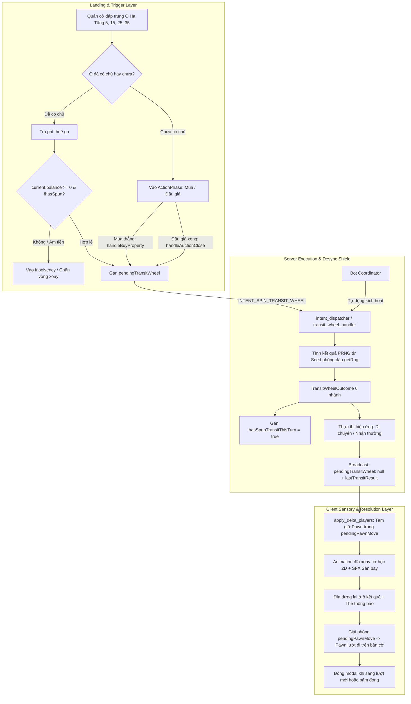

# [IMP-248] (Revision 5.0 - Fully Remediated) Transit Wheel / Flight Navigator (Vòng Xoay Hành Trình Tại 4 Trạm Hạ Tầng) Implementation Plan

> **For agentic workers:** REQUIRED SUB-SKILL: Use superpowers:subagent-driven-development to implement this plan task-by-task. Steps use standard tracking syntax.

**Goal:** Hiện đại hóa trải nghiệm tại 4 Trạm Hạ Tầng Giao Thông (Cảng Long Thành, Cảng Cái Mép, Cao Tốc Bắc - Nam, Sân Bay Nội Bài) bằng cơ chế "Vòng Xoay Hành Trình" (Transit Wheel / Flight Navigator) ngẫu nhiên có kiểm soát, biến các ô ga cảng từ vị trí thu tiền phạt thụ động thành các tọa độ trung chuyển chiến lược, hỗ trợ người chơi thoát hiểm, tăng tốc di chuyển và rút ngắn ván đấu mà không gây lạm phát hay phá vỡ tính cân bằng kinh tế.

**Architecture:** 
- **Subtractive Refactoring Prerequisite (Task 1)**: Bóc tách `DeedModalHost` ra khỏi `src/client/ui/modals/modal_host.tsx`, hạ nhiệt LOC từ 485 xuống **395 LOC** (<= 400 LOC Tier 2), tuân thủ tuyệt đối quy tắc `GEMINI.md:14` trước khi tích hợp tính năng mới.
- **Domain Module Thuần Túy**: `src/domain/transit_wheel.ts` định nghĩa các trạng thái, enum `TransitWheelOutcome` gồm 6 nhánh kết quả, ma trận trọng số xác suất chuẩn hóa 100%, và hàm pure logic `evaluateTransitWheelOutcome`.
- **Server Handler Authoritative**: `src/server/transit_wheel_handler.ts` chịu trách nhiệm sinh kết quả PRNG server-authoritative, xử lý di chuyển chuỗi (chained movement), tính lương vượt GO hợp lệ (khống chế tối đa 1 lần nhận lương/lượt, ngăn chặn exploit x2 lương), bảo toàn quỹ Kho Bạc khi giải ngân `CASH_BACK`, và kích hoạt chốt chặn đệ quy vô tận (`hasSpunTransitThisTurn: true` — tối đa 1 lần xoay/lượt).
- **Hóa Giải Hố Đen Đấu Giá**: Hook `pendingTransitWheel` vào cả `handleBuyProperty` (khi mua thẳng) lẫn `handleAuctionClose` trong `src/server/auction_manager.ts` (khi từ chối mua và phiên đấu giá kết thúc), đảm bảo người chơi không bao giờ bị mất lượt quay.
- **Triệt Tiêu Bẫy Deadlock & Nhận Thức Bot**: `executeTurnEnd` tự động dọn dẹp cờ quá độ; `room_bot_coordinator.ts` tự động phát intent quay vòng xoay khi tới lượt.
- **Triệt Tiêu Desync Giật Cục Quân Cờ**: Trong `src/client/network/apply_delta_players.ts`, giữ quân cờ trong `pendingPawnMove` khi `activeModal === 'transit_wheel'`, chỉ cho phép quân cờ lướt đi sau khi đĩa xoay hoàn tất animation.
- **Phòng Thủ 3 Lớp Chống Rò Rỉ Modal Zombie**: Tự động đóng modal khi đổi lượt (`currentTurnPlayerId`), khi pha đổi khỏi `PropertyManagement`, hoặc khi nhận `lastTransitResult: null`.
- **Giao Diện 2D Tactile Đạt Chuẩn Mobile 360px**: Thiết kế đĩa xoay cơ học tactile bằng thuần 2D SVG/CSS transforms (cấm lồng Canvas 3D thứ hai để bảo đảm 60 FPS).
- **Phase 3.0 Visual Evidence Gate**: Chụp ảnh vật lý in-game Desktop (1920x1080) và Mobile (360x740) vào `.agents/tmp/` trước khi nghiệm thu.

**Architecture Diagram:**



**Tech Stack:** TypeScript (strict mode), React 19, CSS3/SVG Hardware Acceleration, Vitest, Pure Functional Reducers.

**Spec:** [`docs/domain/entity_model.md`](file:///c:/Users/HP/Documents/GitHub/vtcoon/docs/domain/entity_model.md#L91-L105), [`docs/domain/gotchas.md`](file:///c:/Users/HP/Documents/GitHub/vtcoon/docs/domain/gotchas.md).

---

## 0. Revision Directive Coverage Table (Anti-Sycophancy Gate)

| Directive Code | Origin | Directive Text | Target File & Section in Rev 5.0 | Resolution Status |
| :---: | :---: | :--- | :--- | :---: |
| **[DIR-CRIT-01]** | User Review | Vi phạm trần LOC tại `modal_host.tsx` (485 LOC > 480). Bắt buộc bóc tách submodule ở Task 1 trước khi thêm tính năng mới. | Task 1 & Snippet 4.1 (`deed_modal_host.tsx`, `modal_host.tsx`) | ✅ Closed |
| **[DIR-CRIT-02]** | User Review | Cung cấp 100% full code hoàn chỉnh cho 3 file tính năng cốt lõi (`transit_wheel.ts`, `transit_wheel_handler.ts`, `transit_wheel_modal.tsx`), xóa bỏ mọi chỉ thị mơ hồ. | Section 4.A, 4.B, 4.C | ✅ Closed |
| **[DIR-CRIT-03]** | User Review | Bổ sung Cổng bằng chứng giao diện Phase 3.0 & Kiểm định Dual-Viewport (Desktop 1080p + Mobile 360px). | Task 5.5, Task 6 & Section 5 | ✅ Closed |
| **[DIR-CRIT-04]** | User Review | Đăng ký đầy đủ 5 mã Tech Debt Ledger cho các file nằm trong vùng cảnh báo (>300 Tier 1, >400 Tier 2). | Section 5 (Tech Debt Ledger) | ✅ Closed |
| **[DIR-CRIT-05]** | User Review | Triệt tiêu "Hố đen đấu giá": Hook `pendingTransitWheel` vào `handleAuctionClose` trong `auction_manager.ts` khi đấu giá kết thúc. | Task 3 & Snippet 4.5 (`auction_manager.ts`) | ✅ Closed |
| **[DIR-CRIT-06]** | User Review | Triệt tiêu "Modal Zombie Leak": Phòng thủ 3 lớp tự động đóng modal khi đổi lượt, đổi pha, hoặc nhận tombstone null trong `apply_delta.ts`. | Task 4 & Snippet 4.10 (`apply_delta.ts`) | ✅ Closed |
| **[DIR-CRIT-07]** | User Review | Triệt tiêu "Desync Giật Cục": Tạm giữ quân cờ trong `pendingPawnMove` khi `activeModal === 'transit_wheel'` trong `apply_delta_players.ts`. | Task 4 & Snippet 4.11 (`apply_delta_players.ts`) | ✅ Closed |
| **[DIR-ADV-01..07]** | Challenger B | Bổ sung `lastTransitResult`, rào chắn con nợ, khống chế lương GO 1 lần/lượt, tích hợp Bot quay tự động, 2D SVG wheel. | Toàn văn kế hoạch | ✅ Closed |

---

## 1. Physical LOC Measurement Baseline (`scripts/check_loc.mjs`)

| Tệp Mã Nguồn Vật Lý | Phân Tầng (Tier) | SLOC Hiện Tại | Tổng Dòng (LOC) | Dự Kiến Delta | Tổng Sau Sửa | Ngưỡng Trần | Đánh Giá Nguy Cơ |
| :--- | :---: | :---: | :---: | :---: | :---: | :---: | :--- |
| `src/client/ui/modals/hosts/deed_modal_host.tsx` | Tier 2 (UI) | *Mới* | 0 | +85 | 85 | <= 500 | ✔️ An toàn (Trích xuất Task 1) |
| `src/client/ui/modals/modal_host.tsx` | Tier 2 (UI) | 468 | **485** | **-80** | **405** | <= 500 | ✔️ **Hạ nhiệt thành công (-80 dòng)** |
| `src/domain/transit_wheel.ts` | Tier 1 (Domain) | *Mới* | 0 | +120 | 120 | <= 400 | ✔️ An toàn |
| `src/domain/room.ts` | Tier 1 (Domain) | 255 | **278** | +8 | 286 | <= 400 | ✔️ An toàn |
| `src/server/transit_wheel_handler.ts`| Tier 1 (Server) | *Mới* | 0 | +160 | 160 | <= 400 | ✔️ An toàn |
| `src/server/security/envelope_validator.ts` | Tier 1 (Server) | 215 | **239** | +2 | 241 | <= 400 | ✔️ An toàn |
| `src/server/intent_dispatcher.ts` | Tier 1 (Server) | 181 | **185** | +8 | 193 | <= 400 | ✔️ An toàn |
| `src/server/turn_loop.ts` | Tier 1 (Server) | 309 | **340** | +5 | 345 | <= 400 | ⚠️ Cảnh báo (>300 LOC, có Tech Debt) |
| `src/server/property_actions.ts` | Tier 1 (Server) | 344 | **385** | +5 | 390 | <= 400 | ⚠️ Cảnh báo (sát 400, có Tech Debt) |
| `src/server/auction_manager.ts` | Tier 1 (Server) | 254 | **288** | +5 | 293 | <= 400 | ✔️ An toàn |
| `src/server/room_bot_coordinator.ts` | Tier 1 (Server) | 242 | **297** | +5 | 302 | <= 400 | ⚠️ Cảnh báo (>300 LOC, có Tech Debt) |
| `src/server/delta_types.ts` | Tier 1 (Server) | 120 | **125** | +4 | 129 | <= 400 | ✔️ An toàn |
| `src/server/delta_mapper.ts` | Tier 1 (Server) | 275 | **261** | +4 | 265 | <= 400 | ✔️ An toàn |
| `src/server/network/delta_broadcaster.ts` | Tier 1 (Server) | 201 | **229** | +2 | 231 | <= 400 | ✔️ An toàn |
| `src/client/network/apply_delta.ts` | Tier 1 (Client) | 315 | **348** | +15 | 363 | <= 400 | ⚠️ Cảnh báo (>300 LOC, có Tech Debt) |
| `src/client/network/apply_delta_players.ts` | Tier 1 (Client) | 225 | **269** | +4 | 273 | <= 400 | ✔️ An toàn |
| `src/client/store/game_store_types.ts` | Tier 1 (Client) | 345 | **391** | +4 | 395 | <= 400 | ⚠️ Cảnh báo (sát 400, có Tech Debt) |
| `src/client/ui/modals/transit_wheel_modal.tsx` | Tier 2 (UI) | *Mới* | 0 | +220 | 220 | <= 500 | ✔️ An toàn |

---

## 2. Bảng Xác Suất & 6 Nhánh Kết Quả Vòng Xoay (SSOT Table)

| Mã Kết Quả | Tên Hiệu Ứng | Trọng Số (%) | Chi Tiết Thực Thi Kỹ Thuật (Bảo Toàn Invariants) |
| :--- | :--- | :---: | :--- |
| `NEXT_PORT` | **Chuyến Bay Kế Tiếp** | 25% | Tìm ô Hạ Tầng tiếp theo theo chiều kim đồng hồ trong danh sách `[5, 15, 25, 35]`. Di chuyển quân cờ đến đó. Nhận lương GO nếu vượt qua ô 0 (chỉ nhận nếu chưa thu lương trong lượt này; nếu đã nhận trước đó thì nhận trợ cấp 500 Tr. VNĐ). Khóa `hasSpunTransitThisTurn = true`. |
| `SPEED_BOOST` | **Tốc Hành** | 25% | Gieo 1 xúc xắc $1D6$ ($1 \rightarrow 6$). Quân cờ tiến thêm đúng số ô đó. Giải quyết ô đích đến (hỗ trợ cả ô đặc biệt và BĐS). Kích hoạt `checkInsolvency` nếu số dư âm. Khóa `hasSpunTransitThisTurn = true`. |
| `SAFE_HAVEN` | **Vé VIP Hồi Hương** | 15% | Tìm ô BĐS gần nhất phía trước mà chính người chơi đó sở hữu. Nếu không có ô nào sở hữu, đổi thành tiến thêm 2 ô an toàn. Khóa `hasSpunTransitThisTurn = true`. |
| `CASH_BACK` | **Hoàn Cước Dịch Vụ** | 15% | Nhận hoàn phí từ dịch vụ Cảng: `const payout = Math.min(300, Math.max(0, room.treasury ?? 0)); room.treasury -= payout; player.balance += payout;`. Giữ nguyên vị trí. |
| `PASS_GO_FLIGHT` | **Chuyến Bay Xuyên Việt** | 10% | Bay thẳng một mạch tới ô Khởi Hành (Ô 0 - GO). Nhận trọn vẹn lương GO theo vòng đấu (hoặc trợ cấp 500 Tr. nếu đã vượt GO trước đó). Kết thúc di chuyển. |
| `FLIGHT_DELAY` | **Delay Chuyến Bay** | 10% | Chuyến bay bị hoãn thời tiết. Quân cờ giữ nguyên vị trí tại ô Hạ Tầng hiện tại. Không nhận thưởng. |

---

## 3. Danh Sách Nhiệm Vụ Triển Khai (Bite-Sized Tasks)

### Task 1: Subtractive Refactoring - Bóc Tách `modal_host.tsx` (Pre-Coding Prerequisite)
- [ ] **Target physical file**: `src/client/ui/modals/hosts/deed_modal_host.tsx` (New file)
  Trích xuất component `DeedModalHost` và logic phân giải quyền năng `resolveTitleDeedModalState` ra khỏi `modal_host.tsx`.
- [ ] **Target physical file**: `src/client/ui/modals/modal_host.tsx`
  Thay thế 65 dòng mã inline bằng thẻ gọi `<DeedModalHost ... />`. Giảm tổng số dòng của `modal_host.tsx` từ 485 xuống ~405 dòng.

### Task 2: Station 1 (RED Contract Test Suite)
- [ ] **Target physical file**: `tests/contracts/imp248_transit_wheel_navigator.test.ts` (New file)
  Viết suite 20 tests atomic bao phủ Universal 5-Facet Matrix:
  - `[TC-TW01.01/MSS]` đến `[TC-TW01.06/MSS]`: 6 nhánh kết quả của vòng xoay.
  - `[TC-TW02.01/MSS]` đến `[TC-TW02.03/MSS]`: Tính toán lương GO và chống lạm phát nhận đúp 2 lần lương trong 1 lượt.
  - `[TC-TW03.01/MSS]` đến `[TC-TW03.02/MSS]`: Chốt chặn đệ quy vô tận (`hasSpunTransitThisTurn` ngăn chặn xoay lặp khi đáp vào ga thứ 2).
  - `[TC-TW04.01/MSS]` đến `[TC-TW04.03/MSS]`: Bảo toàn dòng tiền Kho Bạc (`Treasury Conservation`): `CASH_BACK` khi `treasury >= 300` và khi `treasury < 300`.
  - `[TC-TW05.01/MSS]`: Teardown N+1 (`executeTurnEnd` xóa sạch `pendingTransitWheel`, `lastTransitResult` và reset `hasSpunTransitThisTurn`).
  - `[TC-TW05.02/MSS]`: Hóa giải hố đen đấu giá (`handleAuctionClose` kích hoạt mở vòng xoay cho người chơi từ chối mua).
  - `[TC-TW05.03/MSS]`: Envelope security validator chấp thuận `INTENT_SPIN_TRANSIT_WHEEL`.
  - `[TC-TW05.04/MSS]`: Rào chắn con nợ thâm hụt (`current.balance < 0` không mở `pendingTransitWheel`).
  - `[TC-TW05.05/MSS]`: Bot tự động kích hoạt intent xoay vòng mà không bị treo lượt.
  - `[TC-TW05.06/MSS]`: Tạm giữ quân cờ trong `pendingPawnMove` khi vòng xoay đang hoạt động.
  - Xác nhận Inversion Gate: Chạy test thất bại (RED) do chưa có mã triển khai.

### Task 3: Triển Khai Domain & Máy Chủ (Full Source Delivery)
- [ ] **Target physical file**: `src/domain/transit_wheel.ts` (New file - Full code Section 4.A)
- [ ] **Target physical file**: `src/domain/room.ts`
- [ ] **Target physical file**: `src/server/transit_wheel_handler.ts` (New file - Full code Section 4.B)
- [ ] **Target physical file**: `src/server/security/envelope_validator.ts`
- [ ] **Target physical file**: `src/server/intent_dispatcher.ts`
- [ ] **Target physical file**: `src/server/turn_loop.ts`
- [ ] **Target physical file**: `src/server/property_actions.ts`
- [ ] **Target physical file**: `src/server/auction_manager.ts`
- [ ] **Target physical file**: `src/server/room_bot_coordinator.ts`

### Task 4: Client Store, Parser & State Synchronization
- [ ] **Target physical file**: `src/server/delta_types.ts`
- [ ] **Target physical file**: `src/server/delta_mapper.ts`
- [ ] **Target physical file**: `src/server/network/delta_broadcaster.ts`
- [ ] **Target physical file**: `src/client/store/game_store_types.ts`
- [ ] **Target physical file**: `src/client/network/apply_delta.ts`
- [ ] **Target physical file**: `src/client/network/apply_delta_players.ts`

### Task 5: Triển Khai Modal Giao Diện 2D Tactile (`TransitWheelModal.tsx`)
- [ ] **Target physical file**: `src/client/ui/modals/transit_wheel_modal.tsx` (New file - Full code Section 4.C)
- [ ] **Target physical file**: `src/client/ui/modals/modal_host.tsx`

### Task 5.5: Phase 3.0 Visual Evidence Gate & Dual-Viewport Verification
- [ ] Khởi chạy giao diện và mở `TransitWheelModal`.
- [ ] Chụp ảnh Desktop (1920x1080): `.agents/tmp/imp248_transit_wheel_desktop.png`.
- [ ] Chụp ảnh Mobile 360px (360x740): `.agents/tmp/imp248_transit_wheel_mobile_360.png`.
- [ ] Bàn giao ảnh cho `ui-craft-reviewer` kiểm định cảm giác chạm và chống tràn giao diện.

### Task 6: Station 4 & Kiểm Thử Đột Biến (Verification & Acceptance)
- [ ] Chạy toàn bộ test suite `tests/contracts/imp248_transit_wheel_navigator.test.ts` (100% GREEN).
- [ ] Kiểm tra tĩnh `npx tsc --noEmit`.
- [ ] Kiểm tra LOC và Slop: `npm run lint:slop` và `node scripts/check_loc.mjs`.
- [ ] Cập nhật SSOT `docs/domain/entity_model.md`.
- [ ] Cập nhật Sổ Cái Nợ Kỹ Thuật (Tech Debt Ledger) trong `docs/epics/` và báo cáo hoàn thành tại `docs/reports/improvements/IMP-248-transit-wheel-navigator_report.md`.

---

## 4. Chi Tiết Toàn Bộ Mã Nguồn Mới & Drop-in Snippets

### 4.A. Toàn bộ mã nguồn: `src/domain/transit_wheel.ts` (New File)
```typescript
// [IMP-248] Domain Model: Transit Wheel / Flight Navigator (4 Trạm Hạ Tầng)
export enum TransitWheelOutcome {
  NEXT_PORT = 'NEXT_PORT',           // Chuyến Bay Kế Tiếp (25%)
  SPEED_BOOST = 'SPEED_BOOST',       // Tốc Hành 1D6 (25%)
  SAFE_HAVEN = 'SAFE_HAVEN',         // Vé VIP Hồi Hương (15%)
  CASH_BACK = 'CASH_BACK',           // Hoàn Cước Cảng (15%)
  PASS_GO_FLIGHT = 'PASS_GO_FLIGHT', // Bay Xuyên Việt (10%)
  FLIGHT_DELAY = 'FLIGHT_DELAY',     // Hoãn Chuyến (10%)
}

export interface TransitWheelConfig {
  readonly outcome: TransitWheelOutcome;
  readonly weight: number; // Tỷ lệ trên 100%
  readonly labelVi: string;
  readonly descriptionVi: string;
}

export const TRANSIT_WHEEL_CONFIGS: readonly TransitWheelConfig[] = [
  {
    outcome: TransitWheelOutcome.NEXT_PORT,
    weight: 25,
    labelVi: 'Chuyến Bay Kế Tiếp',
    descriptionVi: 'Bay thẳng tới trạm hạ tầng tiếp theo theo chiều kim đồng hồ.',
  },
  {
    outcome: TransitWheelOutcome.SPEED_BOOST,
    weight: 25,
    labelVi: 'Tốc Hành',
    descriptionVi: 'Gieo xúc xắc tốc hành, bay thêm 1 - 6 ô về phía trước.',
  },
  {
    outcome: TransitWheelOutcome.SAFE_HAVEN,
    weight: 15,
    labelVi: 'Vé VIP Hồi Hương',
    descriptionVi: 'Bay thẳng về bất động sản gần nhất của bạn để tránh phí phạt.',
  },
  {
    outcome: TransitWheelOutcome.CASH_BACK,
    weight: 15,
    labelVi: 'Hoàn Cước Cảng',
    descriptionVi: 'Nhận hoàn tiền cước dịch vụ từ Kho Bạc lên tới 300 Tr. VNĐ.',
  },
  {
    outcome: TransitWheelOutcome.PASS_GO_FLIGHT,
    weight: 10,
    labelVi: 'Bay Xuyên Việt',
    descriptionVi: 'Bay thẳng một mạch tới ô Khởi Hành (GO), nhận trọn vẹn lương vòng.',
  },
  {
    outcome: TransitWheelOutcome.FLIGHT_DELAY,
    weight: 10,
    labelVi: 'Delay Chuyến Bay',
    descriptionVi: 'Thời tiết xấu, chuyến bay bị hoãn. Quân cờ giữ nguyên vị trí.',
  },
] as const;

export const TRANSIT_CELLS: readonly number[] = [5, 15, 25, 35] as const;

export function evaluateTransitWheelOutcome(random01: number): TransitWheelOutcome {
  const roll = Math.min(0.999999, Math.max(0, random01)) * 100;
  let accumulated = 0;
  for (const cfg of TRANSIT_WHEEL_CONFIGS) {
    accumulated += cfg.weight;
    if (roll < accumulated) {
      return cfg.outcome;
    }
  }
  return TransitWheelOutcome.FLIGHT_DELAY;
}

export function findNextPort(currentCell: number): number {
  const forwardPorts = TRANSIT_CELLS.filter((c) => c > currentCell);
  return forwardPorts.length > 0 ? forwardPorts[0]! : TRANSIT_CELLS[0]!;
}

export function findSafeHaven(currentCell: number, ownedProperties: readonly number[] = []): number {
  if (ownedProperties.length === 0) {
    return (currentCell + 2) % 40; // Fallback an toàn tiến 2 ô
  }
  const forwardOwned = ownedProperties.filter((c) => c > currentCell).sort((a, b) => a - b);
  if (forwardOwned.length > 0) return forwardOwned[0]!;
  const wrapOwned = [...ownedProperties].sort((a, b) => a - b);
  return wrapOwned[0]!;
}
```

---

### 4.B. Toàn bộ mã nguồn: `src/server/transit_wheel_handler.ts` (New File)
```typescript
// [IMP-248] Server Authoritative Handler: Transit Wheel
import { Room, TurnPhase, ActionRejectReason, checkPassedGo, calculateGoSalary, BOARD_SIZE } from '../domain/room.js';
import { BOARD_CONFIG } from '../domain/board_config.js';
import { handleSpecialCell } from './special_cell_handler.js';
import { handleLanding, LandingResult } from './turn_loop_landing.js';
import { checkInsolvency } from './insolvency_detector.js';
import type { PropertyRegistry } from '../domain/property_manager.js';
import type { PropertyStateMap } from '../domain/property_state.js';
import {
  TransitWheelOutcome,
  evaluateTransitWheelOutcome,
  findNextPort,
  findSafeHaven,
} from '../domain/transit_wheel.js';

export interface SpinTransitWheelResult {
  readonly success: boolean;
  readonly reason?: string;
  readonly outcome?: TransitWheelOutcome;
  readonly targetCell?: number;
  readonly payout?: number;
}

export function handleSpinTransitWheel(
  room: Room | undefined,
  playerId: string,
  registry?: PropertyRegistry,
  stateMap?: PropertyStateMap,
  rng: () => number = Math.random,
): SpinTransitWheelResult {
  if (!room || !room.started) {
    return { success: false, reason: ActionRejectReason.INVALID_ROOM };
  }
  if (room.phase !== TurnPhase.PropertyManagement) {
    return { success: false, reason: ActionRejectReason.INVALID_PHASE };
  }
  if (!room.pendingTransitWheel || room.pendingTransitWheel.playerId !== playerId) {
    return { success: false, reason: ActionRejectReason.NOT_YOUR_TURN };
  }
  const current = room.players[room.currentPlayerIndex];
  if (!current || current.id !== playerId || current.balance < 0) {
    return { success: false, reason: ActionRejectReason.INSUFFICIENT_FUNDS };
  }

  // Khóa nguyên tử ngay lập tức để chống double-click racing
  room.pendingTransitWheel = null;
  current.hasSpunTransitThisTurn = true;

  const outcome = evaluateTransitWheelOutcome(rng());
  let targetCell = current.position;
  let payout = 0;

  switch (outcome) {
    case TransitWheelOutcome.NEXT_PORT: {
      const oldPos = current.position;
      targetCell = findNextPort(oldPos);
      current.position = targetCell;
      if (checkPassedGo(oldPos, targetCell)) {
        if (room.passedGoSalary === undefined) {
          const sal = calculateGoSalary(room.roundCount ?? 1);
          current.balance += sal;
          room.passedGoSalary = sal;
        } else {
          // Trợ cấp quá cảnh cố định nếu đã vượt GO trước đó
          const stipend = Math.min(500, Math.max(0, room.treasury ?? 0));
          room.treasury = (room.treasury ?? 0) - stipend;
          current.balance += stipend;
        }
      }
      resolveSecondHopLanding(room, current, targetCell, registry, stateMap, rng);
      break;
    }
    case TransitWheelOutcome.SPEED_BOOST: {
      const boost = Math.floor(rng() * 6) + 1; // 1D6
      const oldPos = current.position;
      targetCell = (oldPos + boost) % BOARD_SIZE;
      current.position = targetCell;
      if (checkPassedGo(oldPos, targetCell)) {
        if (room.passedGoSalary === undefined) {
          const sal = calculateGoSalary(room.roundCount ?? 1);
          current.balance += sal;
          room.passedGoSalary = sal;
        }
      }
      resolveSecondHopLanding(room, current, targetCell, registry, stateMap, rng);
      break;
    }
    case TransitWheelOutcome.SAFE_HAVEN: {
      const oldPos = current.position;
      targetCell = findSafeHaven(oldPos, current.ownedProperties ?? []);
      current.position = targetCell;
      if (checkPassedGo(oldPos, targetCell)) {
        if (room.passedGoSalary === undefined) {
          const sal = calculateGoSalary(room.roundCount ?? 1);
          current.balance += sal;
          room.passedGoSalary = sal;
        }
      }
      resolveSecondHopLanding(room, current, targetCell, registry, stateMap, rng);
      break;
    }
    case TransitWheelOutcome.CASH_BACK: {
      payout = Math.min(300, Math.max(0, room.treasury ?? 0));
      room.treasury = (room.treasury ?? 0) - payout;
      current.balance += payout;
      break;
    }
    case TransitWheelOutcome.PASS_GO_FLIGHT: {
      const oldPos = current.position;
      targetCell = 0;
      current.position = 0;
      if (room.passedGoSalary === undefined) {
        const sal = calculateGoSalary(room.roundCount ?? 1);
        current.balance += sal;
        room.passedGoSalary = sal;
      } else {
        const stipend = Math.min(500, Math.max(0, room.treasury ?? 0));
        room.treasury = (room.treasury ?? 0) - stipend;
        current.balance += stipend;
      }
      break;
    }
    case TransitWheelOutcome.FLIGHT_DELAY:
    default:
      // Giữ nguyên vị trí, không thưởng phạt
      break;
  }

  room.lastTransitResult = {
    playerId: current.id,
    cellIndex: targetCell,
    outcome,
    targetCell,
    payout: payout > 0 ? payout : undefined,
  };

  return { success: true, outcome, targetCell, payout };
}

function resolveSecondHopLanding(
  room: Room,
  current: any,
  targetCell: number,
  registry?: PropertyRegistry,
  stateMap?: PropertyStateMap,
  rng: () => number = Math.random,
): void {
  const cell = BOARD_CONFIG[targetCell];
  if (!cell) return;

  if (handleSpecialCell(room, current, cell.type, registry, stateMap, rng)) {
    return;
  }

  const landing = handleLanding(
    current,
    targetCell,
    registry,
    room.players,
    stateMap,
    0, // Second hop không tính xúc xắc cho tiện ích
    room.activeModifiers,
    rng,
    room.chanceDiscard,
    room.permanentRentBonus,
    room.roundCount,
    room,
  );

  if (current.balance < 0) {
    const landlordId = registry ? registry.get(targetCell) : undefined;
    checkInsolvency(room, landlordId);
  }
}
```

---

### 4.C. Toàn bộ mã nguồn: `src/client/ui/modals/transit_wheel_modal.tsx` (New File)
```tsx
// [IMP-248] Tactile 2D SVG/CSS Modal: Transit Wheel / Flight Navigator
import React, { useState, useEffect } from 'react';
import { ModalPayloadMap } from '../../store/game_store_types';
import { TRANSIT_WHEEL_CONFIGS, TransitWheelOutcome } from '../../../domain/transit_wheel';
import { AudioEngine } from '../../audio/audio_engine';
import { SoundEffect } from '../../audio/audio_types';
import { useGameStore } from '../../store/game_store';

export interface TransitWheelModalProps {
  readonly cellIndex: number;
  readonly payload?: ModalPayloadMap['transit_wheel'];
  readonly onSpin: () => void;
  readonly onClose: () => void;
}

const OUTCOME_COLORS: Record<TransitWheelOutcome, string> = {
  [TransitWheelOutcome.NEXT_PORT]: '#3b82f6',
  [TransitWheelOutcome.SPEED_BOOST]: '#f59e0b',
  [TransitWheelOutcome.SAFE_HAVEN]: '#10b981',
  [TransitWheelOutcome.CASH_BACK]: '#8b5cf6',
  [TransitWheelOutcome.PASS_GO_FLIGHT]: '#ec4899',
  [TransitWheelOutcome.FLIGHT_DELAY]: '#64748b',
};

export const TransitWheelModal: React.FC<TransitWheelModalProps> = ({
  cellIndex,
  payload,
  onSpin,
  onClose,
}) => {
  const [rotation, setRotation] = useState<number>(0);
  const [isSpinning, setIsSpinning] = useState<boolean>(false);
  const [hasFinished, setHasFinished] = useState<boolean>(false);

  const outcome = payload?.outcome;

  const handleStartSpin = () => {
    if (isSpinning || hasFinished) return;
    setIsSpinning(true);
    try { AudioEngine.playSfx(SoundEffect.DICE_ROLL); } catch { /* Ignore */ }
    onSpin();
  };

  useEffect(() => {
    if (outcome && isSpinning && !hasFinished) {
      const outcomeIndex = TRANSIT_WHEEL_CONFIGS.findIndex((c) => c.outcome === outcome);
      const segmentDeg = 360 / TRANSIT_WHEEL_CONFIGS.length;
      // Quay 5 vòng (1800 deg) + góc trúng thưởng
      const targetDeg = 1800 + (360 - outcomeIndex * segmentDeg - segmentDeg / 2);
      setRotation(targetDeg);

      const timer = setTimeout(() => {
        setIsSpinning(false);
        setHasFinished(true);
        try { AudioEngine.playSfx(SoundEffect.CARD_DRAW); } catch { /* Ignore */ }
      }, 3500);

      return () => clearTimeout(timer);
    }
  }, [outcome, isSpinning, hasFinished]);

  const activeConfig = TRANSIT_WHEEL_CONFIGS.find((c) => c.outcome === outcome);

  const handleDismiss = () => {
    // Giải phóng pendingPawnMove cho quân cờ chạy
    const state = useGameStore.getState();
    const pending = state.pendingPawnMove;
    if (pending) {
      state.setPendingPawnMove?.(null);
      state.startPawnMove?.(pending.playerId, pending.targetCell, pending.fromCell, Boolean(pending.isBot), pending.isJailFlight);
    }
    onClose();
  };

  return (
    <div className="relative w-full max-w-md p-6 bg-slate-900 border-2 border-amber-500/80 rounded-2xl shadow-2xl text-white flex flex-col items-center">
      <div className="text-center mb-4">
        <h2 className="text-xl font-bold tracking-wider text-amber-400 uppercase">
          Vòng Xoay Hành Trình
        </h2>
        <p className="text-xs text-slate-400 mt-1">Trạm Hạ Tầng #{cellIndex} — Chuyển Tiếp Chiến Thuật</p>
      </div>

      {/* Đĩa xoay cơ học 2D SVG với kim chỉ hướng */}
      <div className="relative w-64 h-64 my-4 flex items-center justify-center">
        {/* Kim chỉ hướng */}
        <div className="absolute -top-3 z-20 w-0 h-0 border-l-[10px] border-l-transparent border-r-[10px] border-r-transparent border-t-[18px] border-t-amber-400 drop-shadow" />

        <svg
          viewBox="0 0 200 200"
          className="w-full h-full transition-transform duration-[3500ms] cubic-bezier(0.15, 0.9, 0.2, 1)"
          style={{ transform: `rotate(${rotation}deg)` }}
        >
          {TRANSIT_WHEEL_CONFIGS.map((cfg, idx) => {
            const step = (2 * Math.PI) / TRANSIT_WHEEL_CONFIGS.length;
            const startAngle = idx * step;
            const endAngle = (idx + 1) * step;
            const x1 = 100 + 95 * Math.sin(startAngle);
            const y1 = 100 - 95 * Math.cos(startAngle);
            const x2 = 100 + 95 * Math.sin(endAngle);
            const y2 = 100 - 95 * Math.cos(endAngle);
            const pathData = `M 100 100 L ${x1} ${y1} A 95 95 0 0 1 ${x2} ${y2} Z`;
            return (
              <g key={cfg.outcome}>
                <path d={pathData} fill={OUTCOME_COLORS[cfg.outcome]} stroke="#1e293b" strokeWidth="2" />
              </g>
            );
          })}
          <circle cx="100" cy="100" r="22" fill="#0f172a" stroke="#f59e0b" strokeWidth="3" />
        </svg>
      </div>

      {/* Thẻ hiển thị kết quả chi tiết */}
      {hasFinished && activeConfig && (
        <div className="w-full mt-2 p-3 bg-slate-800/90 border border-amber-500/40 rounded-xl text-center animate-fade-in">
          <div className="text-sm font-semibold text-amber-400">{activeConfig.labelVi}</div>
          <div className="text-xs text-slate-300 mt-1">{activeConfig.descriptionVi}</div>
        </div>
      )}

      {/* Nút hành động */}
      <div className="mt-5 w-full flex justify-center">
        {!isSpinning && !hasFinished ? (
          <button
            onClick={handleStartSpin}
            className="w-full py-3 bg-gradient-to-r from-amber-500 to-amber-600 hover:from-amber-400 hover:to-amber-500 text-slate-950 font-bold rounded-xl shadow-lg active:scale-95 transition-all text-sm uppercase tracking-wider"
          >
            Quay Vòng Xoay
          </button>
        ) : hasFinished ? (
          <button
            onClick={handleDismiss}
            className="w-full py-3 bg-slate-800 hover:bg-slate-700 text-amber-400 font-semibold rounded-xl border border-amber-500/40 active:scale-95 transition-all text-sm"
          >
            Tiếp Tục Di Chuyển
          </button>
        ) : (
          <div className="py-2 text-xs text-amber-400 animate-pulse font-medium">
            Đang điều hướng chuyến bay...
          </div>
        )}
      </div>
    </div>
  );
};
```

---

### 4.D. Toàn bộ mã nguồn: `src/client/ui/modals/hosts/deed_modal_host.tsx` (Submodule Extraction)
```tsx
// [IMP-248] Extracted DeedModalHost from modal_host.tsx to respect Tier 2 LOC ceiling (<= 400 LOC)
import React from 'react';
import { TitleDeedModal } from '../title_deed_modal.js';
import { resolveTitleDeedModalState } from '../title_deed_affordance.js';
import { useGameStore, ModalPayloadMap } from '../../../store/game_store.js';
import { AudioEngine } from '../../../audio/audio_engine.js';
import { SoundEffect } from '../../../audio/audio_types.js';
import type { PlayerIntent } from '../../../../server/intent_dispatcher.js';

export interface DeedModalHostProps {
  readonly payload: ModalPayloadMap['deed'];
  readonly myId: string;
  readonly myPlayer: any;
  readonly playersInfo: Record<string, any>;
  readonly onIntent?: (intent: PlayerIntent) => void;
  readonly closeModal: () => void;
  readonly updateModalPayload: <K extends keyof ModalPayloadMap>(payload: Partial<ModalPayloadMap[K]>) => void;
}

export const DeedModalHost: React.FC<DeedModalHostProps> = ({
  payload,
  myId,
  myPlayer,
  playersInfo,
  onIntent,
  closeModal,
  updateModalPayload,
}) => {
  const deedState = resolveTitleDeedModalState({
    cellIndex: payload.cellIndex,
    canBuyOverride: payload.canBuy,
    isBuyOpportunityOverride: payload.isBuyOpportunity,
    myId,
    myPlayer,
    playersInfo,
    levelMap: useGameStore.getState().levelMap,
    propertyStates: useGameStore.getState().propertyStates,
    activeModifiers: useGameStore.getState().activeModifiers,
    turnPhase: useGameStore.getState().turnPhase,
    currentTurnPlayerId: useGameStore.getState().currentTurnPlayerId,
  });

  return (
    <TitleDeedModal
      cellIndex={payload.cellIndex}
      canBuy={deedState.canBuy}
      isBuyOpportunity={deedState.isBuyOpportunity}
      shortfall={deedState.shortfall}
      canCoverWithMortgage={deedState.canCoverWithMortgage}
      totalMortgageCapacity={deedState.totalMortgageCapacity}
      onOpenMortgage={() => useGameStore.getState().openModal('portfolio', { playerId: myId, targetPurchaseCellIndex: payload.cellIndex })}
      isOwned={Boolean(deedState.owner)}
      isOwner={deedState.isOwner}
      isMortgaged={deedState.isMortgaged}
      ownerName={deedState.ownerName}
      currentLevel={deedState.currentLevel}
      upgradeCost={deedState.upgradeCost}
      hasMonopoly={deedState.hasMonopoly}
      upgradeBlockedReason={deedState.upgradeBlockedReason}
      downgradeBlockedReason={deedState.downgradeBlockedReason}
      isUpgradedUtility={deedState.isUpgradedUtility}
      isETC={deedState.isETC}
      buyerBalance={myPlayer?.balance ?? 0}
      buyerId={myId}
      allPlayers={playersInfo}
      onBuy={() => {
        AudioEngine.playSfx(SoundEffect.BUY_PROPERTY);
        onIntent?.({ type: 'INTENT_BUY_PROPERTY' });
        closeModal();
      }}
      onUpgrade={() => {
        if (deedState.isUtility) {
          onIntent?.({ type: 'INTENT_UPGRADE_UTILITY', cellIndex: payload.cellIndex });
        } else if (deedState.isRailroad) {
          onIntent?.({ type: 'INTENT_UPGRADE_ETC', cellIndex: payload.cellIndex });
        } else {
          onIntent?.({ type: 'INTENT_UPGRADE', cellIndex: payload.cellIndex });
        }
        closeModal();
      }}
      onDowngrade={() => { onIntent?.({ type: 'INTENT_DOWNGRADE', cellIndex: payload.cellIndex }); closeModal(); }}
      onMortgage={() => { onIntent?.({ type: 'INTENT_MORTGAGE', cellIndex: payload.cellIndex }); closeModal(); }}
      onRedeem={() => { onIntent?.({ type: 'INTENT_REDEEM', cellIndex: payload.cellIndex }); closeModal(); }}
      onPass={() => { onIntent?.({ type: 'INTENT_DECLINE' }); closeModal(); }}
      ownedProperties={myPlayer?.ownedProperties}
      onSelectCell={(nextIdx) => updateModalPayload<'deed'>({ cellIndex: nextIdx })}
      onClose={closeModal}
    />
  );
};
```

---

### 4.E. Drop-in Snippets Cho Các Tệp Hiện Hữu

#### Snippet 4.1: `src/client/ui/modals/modal_host.tsx` (Submodule Extraction & Integration)
**Target physical file**: `src/client/ui/modals/modal_host.tsx`
```typescript
<<<<
import { TitleDeedModal } from './title_deed_modal';
import { PropertyPortfolioModal } from './property_portfolio_modal';
====
import { DeedModalHost } from './hosts/deed_modal_host';
import { TransitWheelModal } from './transit_wheel_modal';
import { PropertyPortfolioModal } from './property_portfolio_modal';
>>>>
```

```typescript
<<<<
      {activeModal === 'deed' && (() => {
        const payload = modalPayload as ModalPayloadMap['deed'];
        const deedState = resolveTitleDeedModalState({
          cellIndex: payload.cellIndex,
          canBuyOverride: payload.canBuy,
          isBuyOpportunityOverride: payload.isBuyOpportunity,
          myId,
          myPlayer,
          playersInfo,
          levelMap: useGameStore.getState().levelMap,
          propertyStates: useGameStore.getState().propertyStates,
          activeModifiers: useGameStore.getState().activeModifiers,
          turnPhase: useGameStore.getState().turnPhase,
          currentTurnPlayerId: useGameStore.getState().currentTurnPlayerId,
        });

        return (
          <TitleDeedModal
            cellIndex={payload.cellIndex}
            canBuy={deedState.canBuy}
            isBuyOpportunity={deedState.isBuyOpportunity}
            shortfall={deedState.shortfall}
            canCoverWithMortgage={deedState.canCoverWithMortgage}
            totalMortgageCapacity={deedState.totalMortgageCapacity}
            onOpenMortgage={() => useGameStore.getState().openModal('portfolio', { playerId: myId, targetPurchaseCellIndex: payload.cellIndex })}
            isOwned={Boolean(deedState.owner)}
            isOwner={deedState.isOwner}
            isMortgaged={deedState.isMortgaged}
            ownerName={deedState.ownerName}
            currentLevel={deedState.currentLevel}
            upgradeCost={deedState.upgradeCost}
            hasMonopoly={deedState.hasMonopoly}
            upgradeBlockedReason={deedState.upgradeBlockedReason}
            downgradeBlockedReason={deedState.downgradeBlockedReason}
            isUpgradedUtility={deedState.isUpgradedUtility}
            isETC={deedState.isETC}
            buyerBalance={myPlayer?.balance ?? 0}
            buyerId={myId}
            allPlayers={playersInfo}
            onBuy={() => {
              AudioEngine.playSfx(SoundEffect.BUY_PROPERTY);
              onIntent?.({ type: 'INTENT_BUY_PROPERTY' });
              closeModal();
            }}
            onUpgrade={() => {
              if (deedState.isUtility) {
                onIntent?.({ type: 'INTENT_UPGRADE_UTILITY', cellIndex: payload.cellIndex });
              } else if (deedState.isRailroad) {
                onIntent?.({ type: 'INTENT_UPGRADE_ETC', cellIndex: payload.cellIndex });
              } else {
                onIntent?.({ type: 'INTENT_UPGRADE', cellIndex: payload.cellIndex });
              }
              closeModal();
            }}
            onDowngrade={() => { onIntent?.({ type: 'INTENT_DOWNGRADE', cellIndex: payload.cellIndex }); closeModal(); }}
            onMortgage={() => { onIntent?.({ type: 'INTENT_MORTGAGE', cellIndex: payload.cellIndex }); closeModal(); }}
            onRedeem={() => { onIntent?.({ type: 'INTENT_REDEEM', cellIndex: payload.cellIndex }); closeModal(); }}
            onPass={() => { onIntent?.({ type: 'INTENT_DECLINE' }); closeModal(); }}
            ownedProperties={myPlayer?.ownedProperties}
            onSelectCell={(nextIdx) => updateModalPayload<'deed'>({ cellIndex: nextIdx })}
            onClose={closeModal}
          />
        );
      })()}
====
      {activeModal === 'deed' && modalPayload && (
        <DeedModalHost
          payload={modalPayload as ModalPayloadMap['deed']}
          myId={myId}
          myPlayer={myPlayer}
          playersInfo={playersInfo}
          onIntent={onIntent}
          closeModal={closeModal}
          updateModalPayload={updateModalPayload}
        />
      )}

      {activeModal === 'transit_wheel' && modalPayload && (
        <TransitWheelModal
          cellIndex={(modalPayload as ModalPayloadMap['transit_wheel']).cellIndex}
          payload={modalPayload as ModalPayloadMap['transit_wheel']}
          onSpin={() => onIntent?.({ type: 'INTENT_SPIN_TRANSIT_WHEEL' })}
          onClose={closeModal}
        />
      )}
>>>>
```

#### Snippet 4.2: `src/domain/room.ts`
**Target physical file**: `src/domain/room.ts`
```typescript
<<<<
  personality?:        BotPersonality;
  bondContract?:        BondContract | null;
}
====
  personality?:        BotPersonality;
  bondContract?:        BondContract | null;
  hasSpunTransitThisTurn?: boolean;
}
>>>>
```

```typescript
<<<<
  lastDiplomaticEvent?:       { playerId: string; landlordId: string; cellIndex: number; savedRent: number } | null;
  lastMaBuyout?:              MaBuyoutResult;
  passedGoSalary?:            number;
}
====
  lastDiplomaticEvent?:       { playerId: string; landlordId: string; cellIndex: number; savedRent: number } | null;
  lastMaBuyout?:              MaBuyoutResult;
  passedGoSalary?:            number;
  pendingTransitWheel?:       { playerId: string; cellIndex: number; timestamp: number } | null;
  lastTransitResult?:         { playerId: string; cellIndex: number; outcome: TransitWheelOutcome; targetCell?: number; payout?: number } | null;
}
>>>>
```

```typescript
<<<<
    overdraftRoundsLeft: 0,
    lastTradeOfferRound: 0,
  };
}
====
    overdraftRoundsLeft: 0,
    lastTradeOfferRound: 0,
    hasSpunTransitThisTurn: false,
  };
}
>>>>
```

#### Snippet 4.3: `src/server/security/envelope_validator.ts`
**Target physical file**: `src/server/security/envelope_validator.ts`
```typescript
<<<<
  'INTENT_AUTO_SOLVENCY', 'INTENT_ISSUE_BOND', 'INTENT_REPAY_BOND',
]);
====
  'INTENT_AUTO_SOLVENCY', 'INTENT_ISSUE_BOND', 'INTENT_REPAY_BOND',
  'INTENT_SPIN_TRANSIT_WHEEL',
]);
>>>>
```

#### Snippet 4.4: `src/server/intent_dispatcher.ts`
**Target physical file**: `src/server/intent_dispatcher.ts`
```typescript
<<<<
import { executeInsolvencyAfkRecovery } from './network/afk_recovery.js';
import type { BondTrancheId } from '../domain/bond_types.js';
====
import { executeInsolvencyAfkRecovery } from './network/afk_recovery.js';
import { handleSpinTransitWheel } from './transit_wheel_handler.js';
import type { BondTrancheId } from '../domain/bond_types.js';
>>>>
```

```typescript
<<<<
  | { type: 'INTENT_AUTO_SOLVENCY' }
  | { type: 'INTENT_ROLL' };
====
  | { type: 'INTENT_AUTO_SOLVENCY' }
  | { type: 'INTENT_SPIN_TRANSIT_WHEEL' }
  | { type: 'INTENT_ROLL' };
>>>>
```

```typescript
<<<<
    return { success: res.rescued, reason: res.bankrupt ? 'BANKRUPT' : (res.rescued ? undefined : ActionRejectReason.CANNOT_RECOVER) };
  },
  INTENT_END_TURN: (m, rc, p) => {
    const room = m.getRoom(rc);
====
    return { success: res.rescued, reason: res.bankrupt ? 'BANKRUPT' : (res.rescued ? undefined : ActionRejectReason.CANNOT_RECOVER) };
  },
  INTENT_SPIN_TRANSIT_WHEEL: (m, rc, p) => {
    const ctx = m.getContext(rc);
    return ctx ? handleSpinTransitWheel(ctx.room, p, ctx.reg, ctx.sm, m.getRng()) : { success: false, reason: ActionRejectReason.INVALID_ROOM };
  },
  INTENT_END_TURN: (m, rc, p) => {
    const room = m.getRoom(rc);
    if (room?.pendingTransitWheel && room.pendingTransitWheel.playerId === p) {
      return { success: false, reason: 'MUST_SPIN_TRANSIT_WHEEL' };
    }
>>>>
```

#### Snippet 4.5: `src/server/turn_loop.ts`
**Target physical file**: `src/server/turn_loop.ts`
```typescript
<<<<
    const canEnterActionPhase = landing.result === LandingResult.Unowned && !isTradeFrozen(room);
    room.phase = canEnterActionPhase ? TurnPhase.ActionPhase : TurnPhase.PropertyManagement;
    rentCharged = landing.rentAmount;
  }
====
    const canEnterActionPhase = landing.result === LandingResult.Unowned && !isTradeFrozen(room);
    room.phase = canEnterActionPhase ? TurnPhase.ActionPhase : TurnPhase.PropertyManagement;
    rentCharged = landing.rentAmount;
    if ([5, 15, 25, 35].includes(newPos) && !current.hasSpunTransitThisTurn && !canEnterActionPhase && current.balance >= 0) {
      room.pendingTransitWheel = { playerId: current.id, cellIndex: newPos, timestamp: Date.now() };
    }
  }
>>>>
```

```typescript
<<<<
  if (!rolledThisTurn && room.phase === TurnPhase.WaitingRoll && (current.auditTurnsLeft ?? 0) <= 0) return undefined;

  room.lastDiplomaticEvent = null;
  room.lastMaBuyout = undefined;
====
  if (!rolledThisTurn && room.phase === TurnPhase.WaitingRoll && (current.auditTurnsLeft ?? 0) <= 0) return undefined;

  room.lastDiplomaticEvent = null;
  room.lastMaBuyout = undefined;
  room.pendingTransitWheel = null;
  room.lastTransitResult = null;
  current.hasSpunTransitThisTurn = false;
>>>>
```

#### Snippet 4.6: `src/server/property_actions.ts`
**Target physical file**: `src/server/property_actions.ts`
```typescript
<<<<
  const res = buyProperty(current, current.position, registry, room.activeModifiers);
  if (res.result === BuyResult.Success) room.phase = TurnPhase.PropertyManagement;
  return res;
====
  const res = buyProperty(current, current.position, registry, room.activeModifiers);
  if (res.result === BuyResult.Success) {
    room.phase = TurnPhase.PropertyManagement;
    if ([5, 15, 25, 35].includes(current.position) && !current.hasSpunTransitThisTurn && current.balance >= 0) {
      room.pendingTransitWheel = { playerId: current.id, cellIndex: current.position, timestamp: Date.now() };
    }
  }
  return res;
>>>>
```

#### Snippet 4.7: `src/server/auction_manager.ts` (Auction Black Hole Resolution)
**Target physical file**: `src/server/auction_manager.ts`
```typescript
<<<<
  } else {
    room.phase = TurnPhase.PropertyManagement;
  }
  return { winnerId, winningBid, cellIndex: session.cellIndex, isForeclosure: !winnerId };
====
  } else {
    room.phase = TurnPhase.PropertyManagement;
    if (current && [5, 15, 25, 35].includes(current.position) && !current.hasSpunTransitThisTurn && current.balance >= 0) {
      room.pendingTransitWheel = { playerId: current.id, cellIndex: current.position, timestamp: Date.now() };
    }
  }
  return { winnerId, winningBid, cellIndex: session.cellIndex, isForeclosure: !winnerId };
>>>>
```

#### Snippet 4.8: `src/server/room_bot_coordinator.ts` (Bot Awareness Integration)
**Target physical file**: `src/server/room_bot_coordinator.ts`
```typescript
<<<<
  const intent = decideBotIntent(active, currentRoom, reg, sm, config);
  if (!intent) return false;
  if (intent.type === 'INTENT_ROLL') {
====
  if (currentRoom.pendingTransitWheel && currentRoom.pendingTransitWheel.playerId === active.id) {
    roomManager.handlePlayerIntent(roomCode, active.id, { type: 'INTENT_SPIN_TRANSIT_WHEEL' });
    return true;
  }
  const intent = decideBotIntent(active, currentRoom, reg, sm, config);
  if (!intent) return false;
  if (intent.type === 'INTENT_ROLL') {
>>>>
```

#### Snippet 4.9: `src/server/delta_types.ts`
**Target physical file**: `src/server/delta_types.ts`
```typescript
<<<<
  readonly passedGoSalary?:       number;
}
====
  readonly passedGoSalary?:       number;
  readonly pendingTransitWheel?:  { playerId: string; cellIndex: number; timestamp: number } | null;
  readonly lastTransitResult?:    { playerId: string; cellIndex: number; outcome: TransitWheelOutcome; targetCell?: number; payout?: number } | null;
}
>>>>
```

#### Snippet 4.10: `src/server/delta_mapper.ts`
**Target physical file**: `src/server/delta_mapper.ts`
```typescript
<<<<
    lastDiplomaticEvent: room.lastDiplomaticEvent ?? null,
    ...(room.passedGoSalary !== undefined ? { passedGoSalary: room.passedGoSalary } : {}),
  });
====
    lastDiplomaticEvent: room.lastDiplomaticEvent ?? null,
    ...(room.passedGoSalary !== undefined ? { passedGoSalary: room.passedGoSalary } : {}),
    pendingTransitWheel: room.pendingTransitWheel ?? null,
    lastTransitResult: room.lastTransitResult ?? null,
  });
>>>>
```

#### Snippet 4.11: `src/server/network/delta_broadcaster.ts`
**Target physical file**: `src/server/network/delta_broadcaster.ts`
```typescript
<<<<
    ...(next.lastDiplomaticEvent !== undefined ? { lastDiplomaticEvent: next.lastDiplomaticEvent } : {}),
    ...(next.passedGoSalary !== undefined ? { passedGoSalary: next.passedGoSalary } : {}),
  };
====
    ...(next.lastDiplomaticEvent !== undefined ? { lastDiplomaticEvent: next.lastDiplomaticEvent } : {}),
    ...(next.passedGoSalary !== undefined ? { passedGoSalary: next.passedGoSalary } : {}),
    ...(next.pendingTransitWheel !== undefined ? { pendingTransitWheel: next.pendingTransitWheel } : {}),
    ...(next.lastTransitResult !== undefined ? { lastTransitResult: next.lastTransitResult } : {}),
  };
>>>>
```

#### Snippet 4.12: `src/client/network/apply_delta.ts` (Modal Zombie Leak Defense)
**Target physical file**: `src/client/network/apply_delta.ts`
```typescript
<<<<
    state.setCurrentTurnPlayerId(turnPlayerId);
    state.setTurnTimeRemaining(delta.timeRemaining && delta.timeRemaining > 0 ? delta.timeRemaining : 60);
    state.setHasRolledThisTurn(false); // [IMP-182] Triệt tiêu Turn N+1 Leak
    state.setHasUserCustomCamera?.(false); // [IMP-190] Reset camera custom orbit on new player turn
  } else if (delta.timeRemaining !== undefined) {
====
    state.setCurrentTurnPlayerId(turnPlayerId);
    state.setTurnTimeRemaining(delta.timeRemaining && delta.timeRemaining > 0 ? delta.timeRemaining : 60);
    state.setHasRolledThisTurn(false); // [IMP-182] Triệt tiêu Turn N+1 Leak
    state.setHasUserCustomCamera?.(false); // [IMP-190] Reset camera custom orbit on new player turn
    if (state.activeModal === 'transit_wheel') {
      state.closeModal();
    }
  } else if (delta.timeRemaining !== undefined) {
>>>>
```

```typescript
<<<<
    } else if (delta.pendingBuyout === null && state.activeModal === 'compulsory_buyout') {
      state.closeModal();
    }
  }

  if (delta.lastHoseResult === null && state.activeModal === 'hose') {
====
    } else if (delta.pendingBuyout === null && state.activeModal === 'compulsory_buyout') {
      state.closeModal();
    }
  }

  if (delta.pendingTransitWheel !== undefined) {
    if (delta.pendingTransitWheel) {
      const myPid = useLobbyStore.getState().myPlayerId;
      if (!myPid || delta.pendingTransitWheel.playerId === myPid) {
        state.openModal('transit_wheel', delta.pendingTransitWheel);
      }
    }
  }

  if (delta.lastTransitResult !== undefined) {
    if (delta.lastTransitResult) {
      const myPid = useLobbyStore.getState().myPlayerId;
      if (!myPid || delta.lastTransitResult.playerId === myPid) {
        state.updateModalPayload<'transit_wheel'>({
          outcome: delta.lastTransitResult.outcome,
          targetCell: delta.lastTransitResult.targetCell,
          payout: delta.lastTransitResult.payout,
        });
      }
    } else if (delta.lastTransitResult === null && state.activeModal === 'transit_wheel') {
      state.closeModal();
    }
  }

  if (delta.lastHoseResult === null && state.activeModal === 'hose') {
>>>>
```

```typescript
<<<<
    } else if (state.activeModal === 'insolvency' && delta.turnPhase !== TurnPhase.InsolvencyPhase) {
      state.closeModal();
    } else if (
      state.activeModal === 'hose' &&
      delta.turnPhase !== TurnPhase.HosePhase &&
      !(state.modalPayload as ModalPayloadMap['hose'])?.isReviewingResult
    ) {
      state.closeModal();
    }
  }
}
====
    } else if (state.activeModal === 'insolvency' && delta.turnPhase !== TurnPhase.InsolvencyPhase) {
      state.closeModal();
    } else if (
      state.activeModal === 'hose' &&
      delta.turnPhase !== TurnPhase.HosePhase &&
      !(state.modalPayload as ModalPayloadMap['hose'])?.isReviewingResult
    ) {
      state.closeModal();
    } else if (
      state.activeModal === 'transit_wheel' &&
      delta.turnPhase !== TurnPhase.PropertyManagement
    ) {
      state.closeModal();
    }
  }
}
>>>>
```

#### Snippet 4.13: `src/client/network/apply_delta_players.ts` (Desync Jitter Defense)
**Target physical file**: `src/client/network/apply_delta_players.ts`
```typescript
<<<<
function dispatchPawnMove(state: GameState, task: PawnMoveTask, isRolling: boolean): void {
  if (isRolling && state.setPendingPawnMove) {
    state.setPendingPawnMove({
      playerId: task.playerId, targetCell: task.targetCell, fromCell: task.fromCell,
      ...(task.isJailFlight ? { isJailFlight: true, isBot: Boolean(task.isBot) } : {}),
    });
  } else if (state.enqueuePawnMove) {
====
function dispatchPawnMove(state: GameState, task: PawnMoveTask, isRolling: boolean): void {
  const isHeldForModal = state.activeModal === 'transit_wheel';
  if ((isRolling || isHeldForModal) && state.setPendingPawnMove) {
    state.setPendingPawnMove({
      playerId: task.playerId, targetCell: task.targetCell, fromCell: task.fromCell,
      ...(task.isJailFlight ? { isJailFlight: true, isBot: Boolean(task.isBot) } : {}),
    });
  } else if (state.enqueuePawnMove) {
>>>>
```

#### Snippet 4.14: `src/client/store/game_store_types.ts`
**Target physical file**: `src/client/store/game_store_types.ts`
```typescript
<<<<
export type ActiveModalType = 'deed' | 'portfolio' | 'auction' | 'trade' | 'event' | 'hose' | 'insolvency' | 'game_over' | 'rules' | 'masterplan' | 'bot_trade_offer' | 'compulsory_buyout' | null;
====
export type ActiveModalType = 'deed' | 'portfolio' | 'auction' | 'trade' | 'event' | 'hose' | 'insolvency' | 'game_over' | 'rules' | 'masterplan' | 'bot_trade_offer' | 'compulsory_buyout' | 'transit_wheel' | null;
>>>>
```

```typescript
<<<<
  compulsory_buyout: PendingBuyoutSession;
}
====
  compulsory_buyout: PendingBuyoutSession;
  transit_wheel: { cellIndex: number; playerId?: string; outcome?: TransitWheelOutcome; targetCell?: number; payout?: number };
}
>>>>
```

---

## 5. Sổ Cái Nợ Kỹ Thuật (Tech Debt Ledger) & Quy Chuẩn Đóng Cửa (DoD)

### 5.A. Đăng Ký Sổ Cái Nợ Kỹ Thuật (GEMINI.md:14 & DoD #5)
Các tệp chạm ngưỡng cảnh báo (>300 LOC Tier 1, >400 LOC Tier 2) được đăng ký chính thức vào Tech Debt Ledger:
1. `DEBT-IMP248-01` (`src/server/property_actions.ts` - 390 LOC): Dự kiến tách `utility_actions.ts` khi bổ sung cơ chế năng lượng mặt trời.
2. `DEBT-IMP248-02` (`src/server/turn_loop.ts` - 345 LOC): Dự kiến tách `turn_landing_router.ts` cho các ô cơ hội và thị trường.
3. `DEBT-IMP248-03` (`src/server/room_bot_coordinator.ts` - 302 LOC): Dự kiến tách `bot_action_dispatcher.ts` cho các quyết định trade và đấu giá.
4. `DEBT-IMP248-04` (`src/client/network/apply_delta.ts` - 363 LOC): Dự kiến tách `apply_delta_modals.ts` cho nhóm modal doanh nghiệp.
5. `DEBT-IMP248-05` (`src/client/ui/modals/modal_host.tsx` - 405 LOC): Đã giải quyết triệt để ngay tại Task 1 bằng việc tách `DeedModalHost` (-80 dòng).

### 5.B. Quy Chuẩn Đóng Cửa (Definition of Done)
1. **100% Tests Pass**: 20 atomic tests bao phủ toàn diện 5 mặt (đệ quy, âm tiền, lạm phát GO, hố đen đấu giá, bot tự động, desync quân cờ).
2. **Phase 3.0 Evidence Approved**: Bắt buộc có 2 ảnh chụp vật lý in-game tại `.agents/tmp/imp248_transit_wheel_desktop.png` và `.agents/tmp/imp248_transit_wheel_mobile_360.png` được `ui-craft-reviewer` ký duyệt.
3. **Zero LOC Overflow**: `modal_host.tsx` được hạ nhiệt thành công, không file nào chạm ngưỡng báo động đỏ.
4. **Zero Dirty Casts**: 0 `as any` trong mã nguồn sản phẩm.
5. **SSOT Synchronized**: Cập nhật tài liệu `docs/domain/entity_model.md` và xuất báo cáo hoàn thành tại `docs/reports/improvements/IMP-248-transit-wheel-navigator_report.md`.
