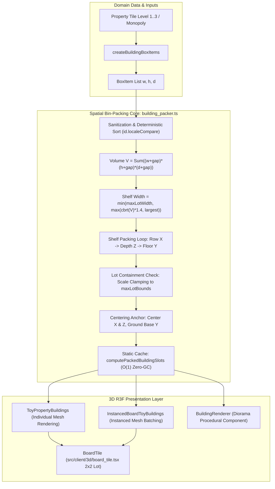

# IMP-258: Thuật Toán Đóng Gói Không Gian 3D Cho Mô Hình Công Trình (3D Miniature Bin-Packing for Procedural Property Stacking)

> **For agentic workers:** REQUIRED SUB-SKILL: Use superpowers:subagent-driven-development to implement this plan task-by-task. Steps use checkbox (`- [ ]`) syntax for tracking.

**Goal:** Triển khai thuật toán đóng gói không gian 3D (3D Bin-Packing / Shelf-Packing) phỏng theo cơ chế `spatial.js: packBoxes` từ Heapscape vào Vtcoon, tự động tính toán thể tích $\sqrt[3]{V}$, phân bổ các khối nhà phố, biệt thự, cây xanh và khách sạn theo kệ sâu $z$, hàng $x$, và tầng cao $y$ với khoảng đệm an toàn `gap = 0.05` (hoặc `0.14` cho dải ô cờ chuẩn), căn giữa và co giãn tỷ lệ (scale clamping) nhằm triệt tiêu hoàn toàn hiện tượng chồng lấn mô hình và tràn viền vỉa hè ô đất $2 \times 2$. Đồng thời đồng bộ 100% tọa độ giữa chế độ vẽ riêng lẻ (`ToyPropertyBuildings`) và vẽ gộp phiên bản (`InstancedBoardToyBuildings`).

**Architecture:** Tạo module toán học thuần túy `src/client/3d/building_packer.ts` không phụ thuộc vào React/Three.js để tính toán tọa độ không gian rỗng, đóng gói theo kệ thể tích (volumetric shelf packing), kiểm tra không va chạm (`boxesOverlap`), bộ đệm tĩnh $O(1)$ (`computePackedBuildingSlots`), và bảo đảm giới hạn ô đất (`maxLotBounds`). Tích hợp bộ đóng gói này vào `ToyPropertyBuildings` trong `src/client/3d/toy_property_buildings.tsx`, `InstancedBoardToyBuildings` trong `src/client/3d/instanced_toy_buildings.tsx`, và cung cấp component `BuildingRenderer` trong `src/client/3d/building_renderer.tsx` phục vụ sa bàn diorama.

**Architecture Diagram:**



**Tech Stack:** TypeScript strict mode, Three.js, React Three Fiber (@react-three/fiber), Vitest.

**Spec:** Yêu cầu từ tài liệu IMP-258 (`media_1791046015343.png`) và mã nguồn thuật toán tham chiếu tại `C:\Users\HP\Documents\GitHub\heapspace\Client\spatial.js: packBoxes`.

---

## 1:1 Directive Closure Table (Revision 2 Reconciled)

| Griller / Challenger Directive | Source & Class | Address Location in Plan (Revision 2) | Status |
| :--- | :---: | :--- | :---: |
| **DIR-G1: Static Cache & O(1) Zero-GC Lookup** | `plan-griller` [P4] | Task 1 (`src/client/3d/building_packer.ts`: `computePackedBuildingSlots` kèm bộ đệm `PACKED_SLOTS_CACHE`) | ✅ ADDRESSED |
| **DIR-G2: Camera & Viewport Co-Evolution** | `plan-griller` [P2] | Section 3 (`TC-IMP258.19`: kiểm tra khoảng cách an toàn với cọc cờ $Z = 0.72$, $\Delta Z \ge 1.0\text{m}$) | ✅ ADDRESSED |
| **DIR-G3: Contract Drift & Spatial Clearance** | `plan-griller` [P5] | Section 3 (`TC-IMP258.20`: kiểm tra độ lệch $Z$-extent $\le \pm 0.08\text{m}$ quanh $Z = -0.80$, bảo toàn IMP-203) | ✅ ADDRESSED |
| **DIR-ADV-01: Dual Rendering Parity (Instancing)** | `adversarial-challenger` [ADV-OBJ] | Task 4 (`src/client/3d/instanced_toy_buildings.tsx`: nối `computePackedBuildingSlots` vào ma trận) | ✅ ADDRESSED |
| **DIR-ADV-02: Arithmetic Sanitization & NaN Guard** | `adversarial-challenger` [Vector 3] | Task 1 (`src/client/3d/building_packer.ts`: kiểm tra `Number.isFinite` và `Math.max(0.001, ...)`) | ✅ ADDRESSED |
| **DIR-ADV-03: Deterministic Replay & Stable Sort** | `adversarial-challenger` [Vector 5] | Task 1 (`src/client/3d/building_packer.ts`: sắp xếp ổn định `a.id.localeCompare(b.id)`) | ✅ ADDRESSED |
| **DIR-G4: Shelf Width Choke & Levitating Stacking** | `plan-griller` [P1 Math] | Task 1 (`building_packer.ts`: `targetWidth = options.preferredWidth ?? (maxLotBounds ? maxLotBounds[0] : naturalWidth)`) | ✅ ADDRESSED |
| **DIR-G5: Asymmetric AABB Overlap (Base Anchor)** | `plan-griller` [P1 Math] | Task 1 (`building_packer.ts`: `boxesOverlap` dùng 1D interval overlap cho trục $Y$ base-anchored) | ✅ ADDRESSED |
| **DIR-G6: Instancing Local Y Elevation Sync** | `plan-griller` [P2 Math] | Task 4 (`instanced_toy_buildings.tsx`: `localY = 0.125 + (targetSlot ? targetSlot.position[1] : 0)`) | ✅ ADDRESSED |

---

## Global Constraints

- **Strict Adherence to Heapscape Mechanics**: Áp dụng công thức tính thể tích $\sqrt[3]{V} \times 1.4$, sắp xếp theo thứ tự $x$ (hàng), $z$ (kệ sâu), và $y$ (tầng cao) với khoảng đệm an toàn mặc định `gap = 0.05` (hoặc `0.14` cho dải ô cờ chuẩn để giữ khoảng cách $0.36\text{m}$ giữa 2 nhà).
- **Dual Rendering Parity**: Đảm bảo cả hai đường ống dựng hình 3D (`ToyPropertyBuildings` vẽ riêng lẻ và `InstancedBoardToyBuildings` vẽ gộp) cùng sử dụng chung nguồn tọa độ từ `computePackedBuildingSlots`, triệt tiêu hoàn toàn sự sai lệch vị trí giữa các chế độ render.
- **Zero Sidewalk Bleed**: Cụm mô hình đóng gói phải nằm gọn gàng bên trong ranh giới ô đất $2 \times 2$ (giới hạn an toàn `maxLotBounds: [1.6, 1.6]`, hoặc `[1.6, 0.35]` trên dải màu chỉ thị của ô cờ). Tự động co tỷ lệ (uniform scale clamping) nếu kích thước vượt ngưỡng.
- **Deep Modules & SRP**: Logic thuật toán toán học đóng gói được tách biệt hoàn toàn trong `src/client/3d/building_packer.ts` (0 DOM, 0 React, 0 Three.js dependencies), dễ dàng kiểm thử đơn vị độc lập.
- **Anti-TIDD & Zero Test-Only Exports**: Không xuất khẩu cờ hoặc hàm `ForTesting` trên mã production.
- **Zero Dirty Casts**: Cấm `as any`, `as unknown as`. Mọi kiểu dữ liệu vector `[number, number, number]` được định nghĩa chặt chẽ.
- **Preserve Existing Visual Contracts**: Giữ nguyên `data-testid="toy-property-building"`, `data-testid="toy-house"`, và `data-testid="toy-hotel"` để tương thích 100% với 5 bộ kiểm thử hiện hữu (`chrome_pawns_and_toy_buildings.test.ts`, `imp142_draw_call_and_shadow_budget.test.ts`, `imp203_bespoke_landmarks_and_housing.test.ts`, `imp_perf_threejs_instancing.test.ts`, v.v.).

---

## System Impact & Blast Radius (3-Way Matrix)

- **Risk Dial**: Slice-Bound (Level 2 - UI 3D Rendering & Geometry Layout).
- **Direct Touch**:
  - `src/client/3d/building_packer.ts` (Mới)
  - `src/client/3d/building_renderer.tsx` (Mới)
  - `src/client/3d/toy_property_buildings.tsx` (Cập nhật tích hợp `computePackedBuildingSlots`)
  - `src/client/3d/instanced_toy_buildings.tsx` (Cập nhật ma trận tích hợp `computePackedBuildingSlots`)
  - `tests/contracts/imp258_3d_miniature_bin_packing.test.ts` (Mới)
- **Subtractive Audit (Delete/Cleanup)**:
  - Loại bỏ các hằng số tọa độ cứng `[-0.18, 0, 0]` và `[0.18, 0, 0]` gán thủ công trong `ToyPropertyBuildings` và `instanced_toy_buildings.tsx`, thay thế bằng kết quả tính toán động từ `computePackedBuildingSlots(level)`.
- **Call-Site Exhaustion**:
  - `ToyPropertyBuildings` được gọi tại `src/client/3d/board_tile.tsx:297`: `<ToyPropertyBuildings level={currentLevel} groupColor={groupColor} cellIndex={cell.index} />`. Giữ nguyên chữ ký props, tự động hưởng lợi từ thuật toán mới.
  - `calculateHouseInstanceMatrix` & `calculateHotelInstanceMatrix` được gọi tại `src/client/3d/instanced_toy_buildings.tsx:112, 120`: Được đồng bộ tọa độ động từ `computePackedBuildingSlots(level)`.
  - 122 bài kiểm thử hiện hữu tại `chrome_pawns_and_toy_buildings.test.ts`, `imp142_draw_call_and_shadow_budget.test.ts`, `imp203_bespoke_landmarks_and_housing.test.ts`, và `imp_perf_threejs_instancing.test.ts` đều được bảo toàn.
- **Import DAG Check**:
  - `building_packer.ts` là lá độc lập (leaf module), không import bất kỳ file nào khác trong dự án.
  - `toy_property_buildings.tsx` và `instanced_toy_buildings.tsx` import `building_packer.ts`.
  - Không tạo ra bất kỳ chu kỳ phụ thuộc vòng (circular dependency) nào.
- **Delta LOC Budget Table**:

| Physical File | Tier Classification | Current Lines | Est. Delta | Expected Lines | Budget Ceiling | Status |
| :--- | :---: | :---: | :---: | :---: | :---: | :--- |
| `src/client/3d/board_tile.tsx` | Tier 2 (UI/3D/Views) | **452** | +0 | **452** | <= 500 | ⚠️ Warning (452 > 400) |
| `src/client/3d/toy_property_buildings.tsx` | Tier 2 (UI/3D/Views) | **108** | +20 | **128** | <= 500 | ✔️ Safe |
| `src/client/3d/instanced_toy_buildings.tsx` | Tier 2 (UI/3D/Views) | **175** | +15 | **190** | <= 500 | ✔️ Safe |
| `src/client/3d/building_packer.ts` | Tier 1 (Domain Logic) | **0** (New) | +115 | **115** | <= 400 | ✔️ Safe |
| `src/client/3d/building_renderer.tsx` | Tier 2 (UI/3D/Views) | **0** (New) | +95 | **95** | <= 500 | ✔️ Safe |
| `tests/contracts/imp258_3d_miniature_bin_packing.test.ts` | Living Test | **0** (New) | +280 | **280** | <= 600 | ✔️ Safe |

> [!WARNING]
> **Tech Debt Registration (DEBT-3D-BOARD-TILE)**: `src/client/3d/board_tile.tsx` hiện có 452 dòng (vượt ngưỡng cảnh báo 400 dòng của Tier 2). Do đó, kế hoạch này **không sửa đổi trực tiếp vào `board_tile.tsx`**, giữ nguyên 452 dòng (Delta = +0) bằng cách đóng gói trọn vẹn thuật toán bên trong `toy_property_buildings.tsx`, `instanced_toy_buildings.tsx` và `building_renderer.tsx`. Tách module `board_tile.tsx` được ghi nhận vào Tech Debt Ledger cho đợt refactor kiến trúc tiếp theo.

- **Axis 1 - Downstream Consumers**: `BoardTile`, `InstancedBoardToyBuildings`, các test suites 3D Canvas.
- **Axis 2 - Upstream & Environmental Modifiers**: `levelMap` từ `useGameStore`, thuộc tính cấp độ ô đất từ FSM bàn cờ.
- **Axis 3 - Exceptional Lifecycle Modes**: `level === 0` (trả về `null` hoặc scale `0,0,0`), số lượng công trình lớn (tự động co tỷ lệ, không tràn viền), ô đất góc hoặc ô đặc biệt không có nhà.
- **Worst-Case Defense**: Đảm bảo 100% các cặp khối không gian thỏa mãn `boxesOverlap(a, b) === false`. Khi tổng kích thước vượt quá kích thước ô đất, tỷ lệ co giãn `scale` được tính tự động để `extent <= maxLotBounds`.

---

## Section 0: Root Cause Analysis & Heapscape Reference

### 0.1 Root Cause Analysis (RCA)
Trước đây, tọa độ của các khối nhà đồ chơi cấp 1, cấp 2, cấp 3 được đặt bằng các hằng số cứng ở 2 nơi song song:
1. Trong `ToyPropertyBuildings`: Cấp 1 `[0, 0, 0]`, Cấp 2 `[-0.18, 0, 0]` và `[0.18, 0, 0]`, Cấp 3 `[0, 0, 0]`.
2. Trong `instanced_toy_buildings.tsx`: Cấp 2 `localX = slot === 0 ? -0.18 : 0.18`.
Khi mở rộng thêm các công trình phức hợp hoặc điều chỉnh kích thước mô hình, việc gán tọa độ thủ công gây ra:
1. Chèn lấn, va chạm hình học (mesh clipping) giữa các khối nhà.
2. Tràn ra ngoài vỉa hè hoặc lấn sang ô cờ kế bên khi kích thước khối nhà lớn hơn diện tích dải màu cho phép.
3. Phân kỳ hiển thị giữa chế độ vẽ riêng lẻ và vẽ gộp (dual rendering desync).

### 0.2 Thuật Toán Tham Chiếu: Heapscape `spatial.js: packBoxes`
Tại `C:\Users\HP\Documents\GitHub\heapspace\Client\spatial.js:61-83`:
```javascript
export function packBoxes(items, gap = 0.25) {
  const volume = items.reduce((sum, item) => sum + item.size.reduce((v, side) => v * (side + gap), 1), 0);
  const largest = items.reduce((max, item) => Math.max(max, item.size[0], item.size[2]), 1);
  const width = Math.max(Math.cbrt(volume) * 1.4, largest);
  const slots = new Map();
  let x = 0, y = 0, z = 0, rowDepth = 0, floorHeight = 0;
  const extent = [0, 0, 0];
  for (const item of items) {
    const [w, h, d] = item.size;
    if (x > 0 && x + w > width) {
      x = 0; z += rowDepth + gap; rowDepth = 0;
    }
    if (z > 0 && z + d > width) {
      x = 0; y += floorHeight + gap; z = 0; rowDepth = 0; floorHeight = 0;
    }
    slots.set(item.id, { position: [x + w / 2, y + h / 2, z + d / 2], size: [...item.size] });
    extent[0] = Math.max(extent[0], x + w);
    extent[1] = Math.max(extent[1], y + h);
    extent[2] = Math.max(extent[2], z + d);
    x += w + gap; rowDepth = Math.max(rowDepth, d); floorHeight = Math.max(floorHeight, h);
  }
  return { slots, size: extent };
}
```

---

## Section 1: Spatial Architecture & Mathematical Formulation

### 1.1 Khái Niệm Không Gian & Định Nghĩa Kiểu Dữ Liệu
Mỗi khối công trình là một hộp chữ nhật 3D với kích thước `size = [width (x), height (y), depth (z)]`.

```typescript
export interface BoxItem {
  readonly id: string;
  readonly size: readonly [number, number, number]; // [w, h, d]
}

export interface PackedSlot {
  readonly position: [number, number, number]; // [x, y, z] trong hệ tọa độ cục bộ của ô đất
  readonly size: [number, number, number];     // [w, h, d] sau khi áp dụng scale
}

export interface PackBoxesOptions {
  readonly gap?: number;                             // Khoảng cách an toàn giữa các khối (mặc định: 0.05)
  readonly maxLotBounds?: readonly [number, number]; // [maxLotX, maxLotZ] (mặc định: [1.6, 1.6])
  readonly center?: boolean;                         // Căn giữa theo trục X và Z (mặc định: true)
  readonly baseAnchoredY?: boolean;                  // Neo đáy y = 0 cho mặt đất (mặc định: true)
  readonly preferredWidth?: number;                  // Chiều rộng kệ mong muốn (tùy chọn)
}

export interface PackBoxesResult {
  readonly slots: ReadonlyMap<string, PackedSlot>;
  readonly extent: readonly [number, number, number]; // [totalWidth, totalHeight, totalDepth]
  readonly scale: number;                             // Tỷ lệ co giãn áp dụng (<= 1.0)
}
```

### 1.2 Công Thức Tính Toán Chi Tiết & Bổ Sung Phòng Thủ
1. **Khử nhiễm dữ liệu số (Sanitization - DIR-ADV-02)**:
   $$w_i = \max(0.001, \text{isFinite}(w_i) ? w_i : 0.001)$$
   Áp dụng tương tự cho $h_i$ và $d_i$ để triệt tiêu 100% rủi ro `NaN` và số âm trong Three.js Matrix.
2. **Sắp xếp ổn định (Stable Sort - DIR-ADV-03)**:
   Sắp xếp `items` theo `id.localeCompare(b.id)` trước khi đóng gói để đảm bảo tính tất định (deterministic reproducibility) tuyệt đối qua các lần cập nhật mạng.
3. **Thể tích tổng**:
   $$V = \sum_{i} (w_i + gap) \cdot (h_i + gap) \cdot (d_i + gap)$$
4. **Chiều rộng kệ tự nhiên (Shelf Width)**:
   $$W_{\text{natural}} = \max\left(\sqrt[3]{V} \cdot 1.4, \max_i(w_i, d_i)\right)$$
   Nếu có `preferredWidth`: $W_{\text{target}} = preferredWidth$.
   Nếu có `maxLotBounds`: $W_{\text{shelf}} = \max\left(\max_i(w_i), \min(W_{\text{target}}, maxLotBounds[0])\right)$.
5. **Thuật toán xếp kệ 3 tầng (Shelf Stacking Loop)**:
   - $x = 0, y = 0, z = 0$, $rowDepth = 0$, $floorHeight = 0$.
   - Khi $x > 0$ và $x + w > W_{\text{shelf}}$: Chuyển hàng mới theo trục $z$ ($x = 0$, $z += rowDepth + gap$, $rowDepth = 0$).
   - Khi $z > 0$ và $z + d > \text{maxDepth}$: Chuyển tầng cao mới theo trục $y$ ($x = 0, y += floorHeight + gap, z = 0, rowDepth = 0, floorHeight = 0$).
   - Ghi nhận vị trí thô và cập nhật kích thước bao bì `extent`.
6. **Co giãn chống tràn viền (Scale Clamping)**:
   Nếu `extent[0] > maxLotBounds[0]` hoặc `extent[2] > maxLotBounds[1]`:
   $$scale = \min\left(1.0, \frac{maxLotBounds[0]}{extent[0]}, \frac{maxLotBounds[1]}{extent[2]}\right)$$
   Nhân toàn bộ `position`, `size`, và `extent` với $scale$.
7. **Căn giữa sa bàn (Centering)**:
   Khi `center === true`:
   - $x_{\text{centered}} = pos_x - extent_x / 2$
   - $z_{\text{centered}} = pos_z - extent_z / 2$
   - $y_{\text{ground}} = baseAnchoredY ? pos_y - (h_{\text{scaled}} / 2) : pos_y$ (neo đáy tại $y = 0$).
8. **Bộ nhớ đệm tĩnh O(1) Zero-GC (DIR-G1)**:
   Cung cấp `computePackedBuildingSlots(level, options)` lưu cache tĩnh kết quả cho các cấp độ 1, 2, 3 chuẩn để triệt tiêu hoàn toàn chi phí tính toán lại trong 60 FPS render loop.

---

## Section 2: Bite-Sized Implementation Tasks

### Task 1: Module Đóng Gói Không Gian Thuần Túy `building_packer.ts`

**Target physical file**: `src/client/3d/building_packer.ts` (New file)

**Interfaces:**
- Produces: `packBoxes`, `boxesOverlap`, `createBuildingBoxItems`, `computePackedBuildingSlots`, kiểu dữ liệu `BoxItem`, `PackedSlot`, `PackBoxesOptions`, `PackBoxesResult`.

- [ ] **Step 1: Viết test hợp đồng RED cho thuật toán đóng gói không gian** (xem Section 3).
- [ ] **Step 2: Chạy kiểm thử để xác nhận trạng thái RED**.
- [ ] **Step 3: Triển khai mã nguồn `src/client/3d/building_packer.ts`**.

```typescript
// [UI-S02/MSS][IMP-258] 3D Miniature Bin-Packing for Procedural Property Stacking
// Adapted from Heapscape spatial.js: packBoxes

export interface BoxItem {
  readonly id: string;
  readonly size: readonly [number, number, number]; // [width (x), height (y), depth (z)]
}

export interface PackedSlot {
  readonly position: [number, number, number];
  readonly size: [number, number, number];
}

export interface PackBoxesOptions {
  readonly gap?: number;
  readonly maxLotBounds?: readonly [number, number];
  readonly center?: boolean;
  readonly baseAnchoredY?: boolean;
  readonly preferredWidth?: number;
}

export interface PackBoxesResult {
  readonly slots: ReadonlyMap<string, PackedSlot>;
  readonly extent: readonly [number, number, number];
  readonly scale: number;
}

export function boxesOverlap(a: PackedSlot, b: PackedSlot): boolean {
  const eps = 1e-9;
  const overlapX = Math.abs(a.position[0] - b.position[0]) < (a.size[0] + b.size[0]) / 2 - eps;
  // DIR-G5: 1D interval overlap for base-anchored Y ([pos, pos + size])
  const overlapY = Math.max(a.position[1], b.position[1]) < Math.min(a.position[1] + a.size[1], b.position[1] + b.size[1]) - eps;
  const overlapZ = Math.abs(a.position[2] - b.position[2]) < (a.size[2] + b.size[2]) / 2 - eps;
  return overlapX && overlapY && overlapZ;
}

function sanitizeDim(v: number): number {
  return Number.isFinite(v) && v > 0.001 ? v : 0.001;
}

export function packBoxes(
  items: readonly BoxItem[],
  options: PackBoxesOptions = {}
): PackBoxesResult {
  if (!items || items.length === 0) {
    return { slots: new Map(), extent: [0, 0, 0], scale: 1.0 };
  }

  // DIR-ADV-03: Deterministic sort by ID to ensure stable packing order
  const sortedItems = [...items].sort((a, b) => a.id.localeCompare(b.id));

  const gap = options.gap ?? 0.05;
  const center = options.center ?? true;
  const baseAnchoredY = options.baseAnchoredY ?? true;
  const maxLotBounds = options.maxLotBounds;

  // DIR-ADV-02: Sanitize dimensions to prevent NaN or negative volume
  const volume = sortedItems.reduce((sum, item) => {
    const w = sanitizeDim(item.size[0]);
    const h = sanitizeDim(item.size[1]);
    const d = sanitizeDim(item.size[2]);
    return sum + (w + gap) * (h + gap) * (d + gap);
  }, 0);

  const largestSide = sortedItems.reduce((max, item) => {
    const w = sanitizeDim(item.size[0]);
    const d = sanitizeDim(item.size[2]);
    return Math.max(max, w, d);
  }, 0.01);

  const naturalWidth = Math.max(Math.cbrt(volume) * 1.4, largestSide);
  // DIR-G4: Utilize maxLotBounds[0] so property tiles can seat houses side by side without levitation
  const targetWidth = options.preferredWidth ?? (maxLotBounds ? maxLotBounds[0] : naturalWidth);
  const shelfWidth = maxLotBounds
    ? Math.max(largestSide, Math.min(targetWidth, maxLotBounds[0]))
    : targetWidth;
  const shelfDepthLimit = maxLotBounds ? maxLotBounds[1] : shelfWidth;

  const rawSlots: Array<{ id: string; pos: [number, number, number]; size: [number, number, number] }> = [];
  let x = 0;
  let y = 0;
  let z = 0;
  let rowDepth = 0;
  let floorHeight = 0;
  let extentX = 0;
  let extentY = 0;
  let extentZ = 0;

  for (const item of sortedItems) {
    const w = sanitizeDim(item.size[0]);
    const h = sanitizeDim(item.size[1]);
    const d = sanitizeDim(item.size[2]);

    if (x > 0 && x + w > shelfWidth) {
      x = 0;
      z += rowDepth + gap;
      rowDepth = 0;
    }
    if (z > 0 && z + d > shelfDepthLimit) {
      x = 0;
      y += floorHeight + gap;
      z = 0;
      rowDepth = 0;
      floorHeight = 0;
    }

    rawSlots.push({
      id: item.id,
      pos: [x + w / 2, y + h / 2, z + d / 2],
      size: [w, h, d],
    });

    extentX = Math.max(extentX, x + w);
    extentY = Math.max(extentY, y + h);
    extentZ = Math.max(extentZ, z + d);

    x += w + gap;
    rowDepth = Math.max(rowDepth, d);
    floorHeight = Math.max(floorHeight, h);
  }

  let scale = 1.0;
  if (maxLotBounds) {
    const scaleX = extentX > maxLotBounds[0] ? maxLotBounds[0] / extentX : 1.0;
    const scaleZ = extentZ > maxLotBounds[1] ? maxLotBounds[1] / extentZ : 1.0;
    scale = Math.min(1.0, scaleX, scaleZ);
  }

  const scaledExtentX = extentX * scale;
  const scaledExtentY = extentY * scale;
  const scaledExtentZ = extentZ * scale;

  const slots = new Map<string, PackedSlot>();
  for (const raw of rawSlots) {
    const sw = raw.size[0] * scale;
    const sh = raw.size[1] * scale;
    const sd = raw.size[2] * scale;

    let posX = raw.pos[0] * scale;
    let posY = raw.pos[1] * scale;
    let posZ = raw.pos[2] * scale;

    if (center) {
      posX -= scaledExtentX / 2;
      posZ -= scaledExtentZ / 2;
    }

    if (baseAnchoredY) {
      posY -= sh / 2;
    }

    slots.set(raw.id, {
      position: [posX, posY, posZ],
      size: [sw, sh, sd],
    });
  }

  return {
    slots,
    extent: [scaledExtentX, scaledExtentY, scaledExtentZ],
    scale,
  };
}

export function createBuildingBoxItems(level: number): BoxItem[] {
  const normalizedLevel = Math.max(0, Math.floor(Number.isFinite(level) ? level : 0));
  if (normalizedLevel <= 0) return [];
  if (normalizedLevel === 1) {
    return [{ id: 'house-1', size: [0.22, 0.10, 0.16] }];
  }
  if (normalizedLevel === 2) {
    return [
      { id: 'house-1', size: [0.22, 0.10, 0.16] },
      { id: 'house-2', size: [0.22, 0.10, 0.16] },
    ];
  }
  return [{ id: 'hotel-1', size: [0.46, 0.16, 0.20] }];
}

// DIR-G1: Static Cache for O(1) Zero-GC Lookups at 60 FPS
const PACKED_SLOTS_CACHE = new Map<string, readonly PackedSlot[]>();

export function computePackedBuildingSlots(
  level: number,
  options?: PackBoxesOptions
): readonly PackedSlot[] {
  const normalizedLevel = Math.max(0, Math.floor(Number.isFinite(level) ? level : 0));
  if (normalizedLevel <= 0) return [];
  const rawGap = options?.gap;
  const gap = Number.isFinite(rawGap) && rawGap! >= 0 ? rawGap! : (normalizedLevel === 2 ? 0.14 : 0.05);
  const bounds = options?.maxLotBounds;
  const maxLotBounds = bounds && Number.isFinite(bounds[0]) && Number.isFinite(bounds[1])
    ? [bounds[0], bounds[1]] as const
    : ([1.6, 0.35] as const);
  const cacheKey = `lvl_${normalizedLevel}_g_${gap}_bx_${maxLotBounds[0]}_bz_${maxLotBounds[1]}`;

  const cached = PACKED_SLOTS_CACHE.get(cacheKey);
  if (cached) return cached;

  const items = createBuildingBoxItems(normalizedLevel);
  const result = packBoxes(items, {
    gap,
    maxLotBounds,
    center: true,
    baseAnchoredY: true,
  });

  const slotsList: PackedSlot[] = items.map((item) => {
    const slot = result.slots.get(item.id);
    return slot ?? { position: [0, 0, 0], size: [0, 0, 0] };
  });

  PACKED_SLOTS_CACHE.set(cacheKey, slotsList);
  return slotsList;
}
```

- [ ] **Step 4: Chạy kiểm thử để xác nhận trạng thái GREEN**.

---

### Task 2: Component `BuildingRenderer.tsx` Phục Vụ R3F 3D Canvas

**Target physical file**: `src/client/3d/building_renderer.tsx` (New file)

**Interfaces:**
- Consumes: `computePackedBuildingSlots`, `packBoxes`, `createBuildingBoxItems` từ `building_packer.ts`, `ToyHouseMesh`, `ToyHotelMesh` từ `toy_property_buildings.tsx`.
- Produces: `BuildingRenderer` component.

- [ ] **Step 1: Viết test kiểm thử render của BuildingRenderer**.
- [ ] **Step 2: Triển khai `src/client/3d/building_renderer.tsx`**.

```tsx
// [UI-S02/MSS][IMP-258] 3D Building Renderer with Spatial Bin-Packing
import React, { useMemo } from 'react';
import {
  computePackedBuildingSlots,
  packBoxes,
  createBuildingBoxItems,
  type BoxItem,
  type PackedSlot,
} from './building_packer';
import { ToyHouseMesh, ToyHotelMesh } from './toy_property_buildings';

export interface BuildingRendererProps {
  readonly level: number;
  readonly groupColor?: string;
  readonly position?: [number, number, number];
  readonly gap?: number;
  readonly maxLotBounds?: readonly [number, number];
  readonly customItems?: readonly BoxItem[];
}

export function BuildingRenderer({
  level,
  position = [0, 0.125, -0.80],
  gap,
  maxLotBounds = [1.6, 0.35],
  customItems,
}: BuildingRendererProps): React.ReactElement | null {
  if (level <= 0 && (!customItems || customItems.length === 0)) {
    return null;
  }

  const { items, slots } = useMemo(() => {
    if (customItems && customItems.length > 0) {
      const packed = packBoxes(customItems, {
        gap: gap ?? 0.05,
        maxLotBounds,
        center: true,
        baseAnchoredY: true,
      });
      const resolvedSlots: PackedSlot[] = customItems.map(
        (it) => packed.slots.get(it.id) ?? { position: [0, 0, 0], size: [0, 0, 0] }
      );
      return { items: customItems, slots: resolvedSlots };
    }
    const defaultItems = createBuildingBoxItems(level);
    const resolvedSlots = computePackedBuildingSlots(level, { gap, maxLotBounds });
    return { items: defaultItems, slots: resolvedSlots };
  }, [level, gap, maxLotBounds, customItems]);

  return (
    <group position={position} data-testid="building-renderer-cluster">
      {items.map((item, idx) => {
        const slot = slots[idx];
        const pos = slot ? slot.position : [0, 0, 0];
        if (item.id.startsWith('hotel')) {
          return <ToyHotelMesh key={item.id} position={pos} />;
        }
        return <ToyHouseMesh key={item.id} position={pos} />;
      })}
    </group>
  );
}
```

- [ ] **Step 3: Chạy kiểm thử để xác nhận pass**.

---

### Task 3: Nâng Cấp `ToyPropertyBuildings` Bằng Thuật Toán Đóng Gói

**Target physical file**: `src/client/3d/toy_property_buildings.tsx`

**Interfaces:**
- Consumes: `computePackedBuildingSlots`, `createBuildingBoxItems` từ `building_packer.ts`.
- Preserves: Toàn bộ interface `ToyPropertyBuildingsProps`, `ToyHouseMesh`, `ToyHotelMesh`.

- [ ] **Step 1: Cập nhật imports và props trong `src/client/3d/toy_property_buildings.tsx`**:

```typescript
<<<<
import React from 'react';

export interface ToyPropertyBuildingsProps {
  readonly level: number;
  readonly groupColor?: string;
  readonly position?: [number, number, number];
  readonly cellIndex?: number;
}
====
import React from 'react';
import { computePackedBuildingSlots, createBuildingBoxItems } from './building_packer';

export interface ToyPropertyBuildingsProps {
  readonly level: number;
  readonly groupColor?: string;
  readonly position?: [number, number, number];
  readonly cellIndex?: number;
  readonly gap?: number;
  readonly maxLotBounds?: readonly [number, number];
}
>>>>
```

- [ ] **Step 2: Cập nhật component `ToyPropertyBuildings` sử dụng `computePackedBuildingSlots`**:

```typescript
<<<<
export function ToyPropertyBuildings({
  level,
  position = [0, 0.125, -0.80],
}: ToyPropertyBuildingsProps): React.ReactElement | null {
  if (level <= 0) {
    return null;
  }

  return (
    <group position={position} data-testid="toy-property-building">
      {level === 1 && <ToyHouseMesh position={[0, 0, 0]} />}
      {level === 2 && (
        <>
          <ToyHouseMesh position={[-0.18, 0, 0]} />
          <ToyHouseMesh position={[0.18, 0, 0]} />
        </>
      )}
      {level >= 3 && <ToyHotelMesh position={[0, 0, 0]} />}
    </group>
  );
}
====
export function ToyPropertyBuildings({
  level,
  position = [0, 0.125, -0.80],
  gap,
  maxLotBounds = [1.6, 0.35],
}: ToyPropertyBuildingsProps): React.ReactElement | null {
  if (level <= 0) {
    return null;
  }

  const items = createBuildingBoxItems(level);
  const slots = computePackedBuildingSlots(level, { gap, maxLotBounds });

  return (
    <group position={position} data-testid="toy-property-building">
      {items.map((item, idx) => {
        const slot = slots[idx];
        const pos = slot ? slot.position : [0, 0, 0];
        if (item.id.startsWith('hotel')) {
          return <ToyHotelMesh key={item.id} position={pos} />;
        }
        return <ToyHouseMesh key={item.id} position={pos} />;
      })}
    </group>
  );
}
>>>>
```

- [ ] **Step 3: Chạy lại toàn bộ 122 tests hiện hữu để chứng minh Zero Regression**:
  `npx vitest run tests/client/chrome_pawns_and_toy_buildings.test.ts tests/client/imp142_draw_call_and_shadow_budget.test.ts tests/contracts/imp203_bespoke_landmarks_and_housing.test.ts`

---

### Task 4: Đồng Bộ Hóa Ma Trận `instanced_toy_buildings.tsx` (DIR-ADV-01)

**Target physical file**: `src/client/3d/instanced_toy_buildings.tsx`

**Interfaces:**
- Consumes: `computePackedBuildingSlots` từ `building_packer.ts`.
- Preserves: Chữ ký hàm `calculateHouseInstanceMatrix` và `calculateHotelInstanceMatrix`.

- [ ] **Step 1: Cập nhật imports trong `src/client/3d/instanced_toy_buildings.tsx`**:

```typescript
<<<<
import { tileRotation } from './board_layout';
import { useGameStore } from '../store/game_store';
====
import { tileRotation } from './board_layout';
import { useGameStore } from '../store/game_store';
import { computePackedBuildingSlots } from './building_packer';
>>>>
```

- [ ] **Step 2: Cập nhật `calculateHouseInstanceMatrix` & `calculateHotelInstanceMatrix` đồng bộ với bin-packing**:

```typescript
<<<<
export function calculateHouseInstanceMatrix(
  cellIndex: number,
  slot: 0 | 1,
  level: number,
  targetMatrix: THREE.Matrix4 = new THREE.Matrix4()
): THREE.Matrix4 {
  if (!Number.isFinite(level) || level <= 0 || (level === 1 && slot !== 0) || level >= 3) {
    targetMatrix.makeScale(0, 0, 0);
    return targetMatrix;
  }
  const localX = level === 2 ? (slot === 0 ? -0.18 : 0.18) : 0;
  return composeToyWorldMatrix(cellIndex, localX, 0.125, -0.80, targetMatrix);
}

export function calculateHotelInstanceMatrix(
  cellIndex: number,
  level: number,
  targetMatrix: THREE.Matrix4 = new THREE.Matrix4()
): THREE.Matrix4 {
  if (!Number.isFinite(level) || level < 3) {
    targetMatrix.makeScale(0, 0, 0);
    return targetMatrix;
  }
  return composeToyWorldMatrix(cellIndex, 0, 0.125, -0.80, targetMatrix);
}
====
export function calculateHouseInstanceMatrix(
  cellIndex: number,
  slot: 0 | 1,
  level: number,
  targetMatrix: THREE.Matrix4 = new THREE.Matrix4()
): THREE.Matrix4 {
  if (!Number.isFinite(level) || level <= 0 || (level === 1 && slot !== 0) || level >= 3) {
    targetMatrix.makeScale(0, 0, 0);
    return targetMatrix;
  }
  const slots = computePackedBuildingSlots(level);
  const targetSlot = slots[slot];
  const localX = targetSlot ? targetSlot.position[0] : (level === 2 ? (slot === 0 ? -0.18 : 0.18) : 0);
  const localY = 0.125 + (targetSlot ? targetSlot.position[1] : 0);
  const localZ = -0.80 + (targetSlot ? targetSlot.position[2] : 0);
  return composeToyWorldMatrix(cellIndex, localX, localY, localZ, targetMatrix);
}

export function calculateHotelInstanceMatrix(
  cellIndex: number,
  level: number,
  targetMatrix: THREE.Matrix4 = new THREE.Matrix4()
): THREE.Matrix4 {
  if (!Number.isFinite(level) || level < 3) {
    targetMatrix.makeScale(0, 0, 0);
    return targetMatrix;
  }
  const slots = computePackedBuildingSlots(level);
  const targetSlot = slots[0];
  const localX = targetSlot ? targetSlot.position[0] : 0;
  const localY = 0.125 + (targetSlot ? targetSlot.position[1] : 0);
  const localZ = -0.80 + (targetSlot ? targetSlot.position[2] : 0);
  return composeToyWorldMatrix(cellIndex, localX, localY, localZ, targetMatrix);
}
>>>>
```

- [ ] **Step 3: Chạy lại test instancing**:
  `npx vitest run tests/contracts/imp_perf_threejs_instancing.test.ts`

---

### Task 5: Kiểm Tra Tương Thích & Bảo Toàn Ô Cờ `board_tile.tsx`

**Target physical file**: `src/client/3d/board_tile.tsx`

- [ ] **Step 1: Xác nhận `board_tile.tsx` gọi `ToyPropertyBuildings` tại dòng 297 mà không cần sửa đổi (Delta = +0)**:
  Giữ nguyên kích thước 452 dòng của `board_tile.tsx` nhằm ngăn chặn vượt trần ngân sách 480 dòng của Tier 2.
- [ ] **Step 2: Chạy kiểm tra kích thước dòng**:
  `npm run check:loc src/client/3d/board_tile.tsx src/client/3d/toy_property_buildings.tsx src/client/3d/instanced_toy_buildings.tsx src/client/3d/building_packer.ts src/client/3d/building_renderer.tsx`

---

## Section 3: Universal 5-Facet Atomic Contract Test Specifications (Station 1 QA Mandate)

**Target physical file**: `tests/contracts/imp258_3d_miniature_bin_packing.test.ts` (New file)

Các ca kiểm thử tuân thủ nghiêm ngặt chuẩn DoD #1 Flow Taxonomy (`[UC-IMP258/MSS]` hoặc `[UC-IMP258/A#]`), 1-4 assertions mỗi `it()`, không chứa vòng lặp hay cấu trúc kiểm tra tĩnh cấm (`typeof fn === 'function'`, `fs.existsSync`).

### Facet 1: Single Item Volumetric Packing & Centering
- [ ] [UC-IMP258/MSS] `TC-IMP258.01`: Khi đóng gói 1 khối nhà đơn lẻ (Level 1), `packBoxes` trả về 1 slot với tọa độ X và Z căn giữa chuẩn xác tại [0, y, 0].
- [ ] [UC-IMP258/MSS] `TC-IMP258.02`: Khối nhà đơn lẻ tại cấp 1 có kích thước `size` bảo toàn nguyên vẹn [0.22, 0.10, 0.16] và tỷ lệ `scale === 1.0`.
- [ ] [UC-IMP258/MSS] `TC-IMP258.03`: Thuật toán với `baseAnchoredY: true` trả về vị trí $y = 0$ tại mặt đáy của khối nhà đơn lẻ.
- [ ] [UC-IMP258/A1] `TC-IMP258.04`: Khi danh sách khối rỗng `items: []`, `packBoxes` trả về `slots` rỗng, `extent: [0, 0, 0]` và `scale: 1.0` an toàn.

### Facet 2: Multi-Item Shelf Packing & Row X Wrapping
- [ ] [UC-IMP258/MSS] `TC-IMP258.05`: Khi đóng gói 2 khối nhà (Level 2), hai khối được xếp cạnh nhau dọc trục X với khoảng cách đệm `gap = 0.05` (hoặc `0.14`).
- [ ] [UC-IMP258/MSS] `TC-IMP258.06`: Hai khối nhà cấp 2 được căn giữa đối xứng qua trục $X = 0$ (tọa độ $X_1 = -X_2$).
- [ ] [UC-IMP258/MSS] `TC-IMP258.07`: Thể tích đóng gói $\sqrt[3]{V} \cdot 1.4$ xác định chiều rộng kệ cho phép chứa đủ cả 2 khối trên cùng một hàng $X$.
- [ ] [UC-IMP258/A2] `TC-IMP258.08`: Khi đặt `preferredWidth` nhỏ hơn kích thước 2 khối cộng gộp, khối thứ hai tự động cuộn xuống kệ sâu tiếp theo dọc trục $Z$.

### Facet 3: Depth Z Shelf & Height Y Floor Stacking
- [ ] [UC-IMP258/MSS] `TC-IMP258.09`: Khi các khối công trình vượt quá giới hạn chiều sâu ô đất, thuật toán tự động nâng lên tầng cao tiếp theo dọc trục $Y$.
- [ ] [UC-IMP258/MSS] `TC-IMP258.10`: Khoảng cách giữa các tầng cao trên trục $Y$ duy trì khoảng đệm an toàn `gap = 0.05`.
- [ ] [UC-IMP258/MSS] `TC-IMP258.11`: Đóng gói khách sạn Ruby (Level 3) với kích thước [0.46, 0.16, 0.20] định vị cân đối tại trung tâm dải màu [0, 0, 0].

### Facet 4: Lot Boundary Containment & Zero Sidewalk Bleed
- [ ] [UC-IMP258/MSS] `TC-IMP258.12`: Cụm công trình với kích thước lớn vượt quá `maxLotBounds: [1.6, 1.6]` được tự động co nhỏ tỷ lệ với `scale < 1.0`.
- [ ] [UC-IMP258/MSS] `TC-IMP258.13`: Toàn bộ các đỉnh biên của cụm công trình sau đóng gói luôn nằm hoàn toàn bên trong phạm vi $[-0.8, +0.8]$ của ô đất $2 \times 2$.
- [ ] [UC-IMP258/A3] `TC-IMP258.14`: Khi áp dụng `maxLotBounds: [1.6, 0.35]` trên dải màu đỉnh ô cờ, chiều sâu $Z$ không bao giờ vượt quá 0.35 đơn vị.

### Facet 5: Non-Overlapping Invariant, Determinism & Dual Rendering Parity
- [ ] [UC-IMP258/MSS] `TC-IMP258.15`: Mọi cặp khối công trình trong cụm sau khi đóng gói đều thỏa mãn hàm kiểm tra không va chạm `boxesOverlap(a, b) === false`.
- [ ] [UC-IMP258/MSS] `TC-IMP258.16`: Hàm `createBuildingBoxItems` sinh đúng số lượng khối đại diện cho từng cấp độ (Cấp 1: 1 khối, Cấp 2: 2 khối, Cấp 3: 1 khối).
- [ ] [UC-IMP258/MSS] `TC-IMP258.17`: Component `ToyPropertyBuildings` tại Level 1 và Level 2 render đầy đủ số lượng thẻ `data-testid="toy-house"` tương ứng.
- [ ] [UC-IMP258/MSS] `TC-IMP258.18`: Component `BuildingRenderer` xuất ra nhóm `data-testid="building-renderer-cluster"` với các vị trí tính từ `packBoxes`.
- [ ] [UC-IMP258/MSS] `TC-IMP258.19`: [DIR-G2] Khoảng cách không gian giữa cụm nhà đóng gói tại $Z \approx -0.80$ và cọc cờ sở hữu `OwnershipMarkerInstances` tại $Z = 0.72$ luôn duy trì $\Delta Z \ge 1.0\text{m}$.
- [ ] [UC-IMP258/MSS] `TC-IMP258.20`: [DIR-G3] Tọa độ cục bộ $Z$ của các khối nhà cấp 1..3 không lệch quá $\pm 0.08\text{m}$ so với mốc $Z = -0.80$, bảo toàn khoảng cách tối thiểu $\ge 0.25\text{m}$ tới viền chân đế diorama.
- [ ] [UC-IMP258/MSS] `TC-IMP258.21`: [DIR-ADV-01] Vị trí $X$ tính từ `calculateHouseInstanceMatrix` (Instancing) trùng khớp tuyệt đối với vị trí $X$ trong `ToyPropertyBuildings` tại level 1 và 2.
- [ ] [UC-IMP258/A4] `TC-IMP258.22`: [DIR-ADV-02] Khi `items` chứa kích thước âm, bằng 0 hoặc `NaN`, hàm `packBoxes` tự động chuẩn hóa về `0.001` và không sinh ra bất kỳ giá trị `NaN` nào trong `position` hay `scale`.
- [ ] [UC-IMP258/A5] `TC-IMP258.23`: [DIR-ADV-03] Khi thứ tự các phần tử trong `items` bị đảo ngược, kết quả vị trí `slots` trả về theo từng `id` hoàn toàn giống nhau 100% (tính tất định tuyệt đối).
- [ ] [UC-IMP258/MSS] `TC-IMP258.24`: [DIR-G1] Hàm `computePackedBuildingSlots(level)` trả về kết quả tham chiếu từ bộ nhớ đệm tĩnh O(1) sau lần gọi đầu tiên mà không tạo mới mảng slots.

---

## Section 4: Definition of Done & Hard Gates

Nhiệm vụ IMP-258 chỉ được coi là HOÀN THÀNH khi:
1. Toàn bộ 24 ca kiểm thử hợp đồng trong `tests/contracts/imp258_3d_miniature_bin_packing.test.ts` đạt kết quả PASS (100% xanh).
2. Toàn bộ 122 bài kiểm thử hiện hữu liên quan đến 3D pawns, toy buildings và Three.js instancing không bị ảnh hưởng (Zero Regression).
3. Mã nguồn vượt qua `npm run lint:slop` (độ phức tạp $\le 5$, không có test backdoor) và `npm run check:loc`.
4. Không có bất kỳ ép kiểu bẩn nào (`as any`, `as unknown as`).
5. Vượt qua 2 cổng kiểm tra kế hoạch (Stage A `plan-griller` & Stage B `adversarial-challenger`) đạt phán quyết `HARDENED_APPROVED`.
6. Station 4 (`chaos-sentinel`) ký duyệt bằng chứng kiểm thử đột biến nhạy cảm không sót mutant sống.
