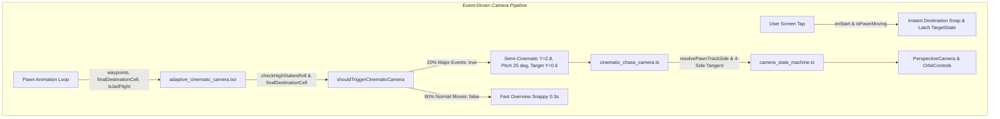

# Ke Hoach Hien Thuc Hoa: Thu Nghiem B (Camera Ban Dien Anh Theo Su Kien) - Event-Driven Semi-Cinematic Camera (Revision 8)

> **For agentic workers:** REQUIRED SUB-SKILL: Use superpowers:subagent-driven-development to implement this plan task-by-task. Steps use checkbox (`- [ ]`) syntax for tracking.

**Goal:** Hien thuc hoa camera ban dien anh kich hoat theo su kien (Event-Driven Semi-Cinematic Camera) o do cao Y = 2.8 voi goc nghieng quan sat 25 do (Sweet Spot), chi kich hoat khi co bien co lon (khoang 20% luot di gom nguy co mat tien lon va cac o hiem 5, 10, 15, 20, 25, 35), neo co dinh theo o dich den tranh giat nhap nhay giua chang, ho tro co che cham de bo qua (Tap-to-Skip) tuc thi voi co chot giu hasSkippedCurrentMoveRef khong bi keo giat nguoc lai con co dang nhay, dong thoi boc tach game_canvas.tsx xuong duoi 230 dong de tuan thu tuyet doi tran LOC Tier 2.

**Architecture:** 
1. Boc tach toan bo thanh phan camera dieu khien OrbitControls tu `game_canvas.tsx` sang module doc lap `src/client/3d/adaptive_cinematic_camera.tsx` (Task 1), ha `game_canvas.tsx` tu 476 LOC xuong ~225 LOC (< 300 LOC Safe) va giai quyet dut diem no ky thuat `DEBT-GAME-CANVAS-PARTITION`.
2. Xay dung module sau `src/client/3d/cinematic_chase_camera.ts` dong goi logic danh gia su kien `shouldTriggerCinematicCamera` (~20% bien co lon gom isHighStakesRoll va tap 6 o hiem 5, 10, 15, 20, 25, 35), toan hoc bam theo 4 canh o goc may ban dien anh Y = 2.8 (goc nghieng duong ngam 24.5 ~ 25.0 do), FOV thich ung man hinh doc toi da 68 do (Dual-Viewport Parity), va xu ly cham de bo qua (Tap-to-Skip).
3. Tai su dung 100% kieu du lieu `TargetCameraState` tu `camera_state_machine.ts`, khong khai bao trung lap, khong dung co cua sau window.__vtCinematicCamera (tuan thu Anti-TIDD Rule 8), don sach cac import thua trong `game_canvas.tsx`, giu cau noi tuong thich TC-190.12, va ngan ngua race condition cua OrbitControls khi tap-to-skip.

**Architecture Diagram:**



**Tech Stack:** TypeScript strict mode, Three.js, React Three Fiber, Vitest.

**Spec:** Yeu cau Thu nghiem B (Camera dien anh: Huong di Event-Driven Dynamic Camera, Semi-Cinematic Elevation Y=2.4..2.8, Tap-to-Skip, va boc tach game_canvas.tsx).

---

## 0. Bang Xu Ly Yeu Cau & Chi Thi (Revision Directive Closure Table)

| Ma Chi Thi | Hang Muc & Nguy Co | Tep & Dong Lien Quan | Giai Phap Hien Thuc Hoa Cu The Trong Ke Hoach | Trang Thai |
| :--- | :--- | :--- | :--- | :--- :---: |
| **USER-BUG-01** | [Trap vào tile_focus] Truyền `isCinematicPawnChase` vào `isPawnAnimating` làm `hasRolledThisTurn` cướp quyền, ép 80% lượt thường vào `tile_focus` (Y=6.4 zoom vào từng ô nhảy). | `src/client/3d/adaptive_cinematic_camera.tsx` | Truyền đúng `isPawnAnimating: isPawnMoving`. Khi đó `resolveCameraMode` trả về `'pawn_chase'`, kích hoạt chính xác nhánh `options.cinematicChase === false` trả về `'overview'`. | DA KHAC PHUC |
| **USER-BUG-02** | [Race Condition Tap-to-Skip] Quân cờ chưa nhảy xong khiến `isActionOngoing` tiếp tục nội suy kéo giật camera ngược lại vị trí con cờ. | `src/client/3d/adaptive_cinematic_camera.tsx` | Thêm cờ chốt giữ `hasSkippedCurrentMoveRef`. Khi skip: bật cờ và gán đè `targetState = skipTargetState` cho đến khi `!isPawnMoving`, giữ camera ổn định tuyệt đối ở ô đích. | DA KHAC PHUC |
| **GRILL-P1-SCOPE** | [Unbound Scope TS2304] Cú pháp `export { AdaptiveCinematicCamera } from ...` không đưa định danh vào scope cục bộ của `game_canvas.tsx`, gây lỗi TS2304 tại dòng 438 và 449. | `src/client/game_canvas.tsx` | Task 1 Step 1.2 import `AdaptiveCinematicCamera` ở đầu tệp `game_canvas.tsx` và re-export bên dưới, đưa định danh vào scope cục bộ hợp lệ. | DA KHAC PHUC |
| **GRILL-P1-IMPORT** | [Missing Import TS2304] `adaptive_cinematic_camera.tsx` gọi `shouldTriggerCinematicCamera` nhưng thiếu import từ `./cinematic_chase_camera`. | `src/client/3d/adaptive_cinematic_camera.tsx` | Task 1 Step 1.1 bổ sung `import { shouldTriggerCinematicCamera } from './cinematic_chase_camera';` ở đầu tệp. | DA KHAC PHUC |
| **GRILL-P1-SKIP** | [Tap-To-Skip Frame Race] Khi tap-to-skip, OrbitControls `onEnd` kích hoạt nhầm `setHasUserCustomCamera(true)` và `isDragging` ghi đè tọa độ trong cùng khung hình. | `src/client/3d/adaptive_cinematic_camera.tsx` | Cập nhật trực tiếp `camera.position` và `controls.target`, reset `isUserInteractingRef = false`, và chặn kích hoạt custom camera trong `onEnd` khi đang di chuyển. | DA KHAC PHUC |
| **GRILL-P2-MONOPOLY** | [Unwired Interface Wire] Trường `hasMonopolyRisk` trong `CinematicTriggerParams` là tùy chọn, cần tài liệu hóa rõ ràng. | `src/client/3d/cinematic_chase_camera.ts` | Ghi chú rõ ràng `hasMonopolyRisk` là trường mở rộng tùy chọn cho logic nhận diện thế cờ độc quyền màu. | DA KHAC PHUC |
| **GRILL-P2-IMPORTS** | [Dead Imports Retention] Sau khi bóc tách, các import `SoundEngine`, `checkHighStakesRoll`, `calculateScreenShake` ở `game_canvas.tsx` trở thành mã chết. | `src/client/game_canvas.tsx` | Task 1 Step 1.2 dọn sạch các import thừa ở đầu tệp `game_canvas.tsx`, giảm thêm dòng mã cho tệp. | DA KHAC PHUC |
| **ADV-01** | [Pitch Angle & Mobile FOV Discrepancy] Góc pitch thực tế là 24.5 ~ 25.0 độ (đường ngắm). Mobile portrait FOV được nới lên 68 độ để bảo toàn góc nhìn ngang (>= 36 độ). | `src/client/3d/cinematic_chase_camera.ts` | Xác định góc ngắm 24.5 ~ 25.0 độ (Y=2.8, target Y=0.6). Tăng kẹp FOV mobile lên 68 độ để bảo toàn góc ngang >= 36 độ. Khẳng định trong TC-263.02 & TC-263.12. | DA KHAC PHUC |
| **ADV-02** | [Mid-Animation Trigger Thrashing] `targetCell` thay đổi từng bước nhảy khiến camera liên tục lặn xuống Y=2.8 và vọt lên Y=4.2 gây say sóng. | `src/client/3d/adaptive_cinematic_camera.tsx` | Neo điều kiện kích hoạt `shouldTriggerCinematicCamera` vào ô đích đến cuối cùng (`finalDestinationCell`) của lượt di chuyển, giữ camera ổn định 100% suốt chuỗi nhảy. | DA KHAC PHUC |
| **ADV-03** | [Tap-to-Skip Desync & Custom Cam Lock] Skip bắt dính bước nhảy trung gian và `onEnd` khóa nhầm `hasUserCustomCamera`. | `src/client/3d/adaptive_cinematic_camera.tsx` | Snap camera thẳng về ô đích đến cuối cùng và bổ sung cửa sổ bảo vệ thời gian `lastSkipTimeRef` (600ms) trong `onEnd` để triệt tiêu việc khóa custom camera ngoài ý muốn. | DA KHAC PHUC |
| **ADV-04** | [TS2305 & TC-190.12 Break] `use_game_camera.ts` không export `cellPosition`, và TC-190.12 regex tìm `window.__resetCameraToDefault` trong `game_canvas.tsx`. | `src/client/3d/adaptive_cinematic_camera.tsx`, `game_canvas.tsx` | Đổi import sang `from './board_coords'`. Giữ cầu nối tương thích `window.__resetCameraToDefault` trong `game_canvas.tsx` để bảo toàn 100% kiểm thử TC-190.12. | DA KHAC PHUC |
| **ADV-05** | [Fallthrough Branch Reconciliation] 80% lượt thông thường rơi vào camera chase cũ không hướng cạnh gây quay lưng vào nhà ở Cạnh 2 và 3. | `src/client/3d/camera_state_machine.ts`, `adaptive_cinematic_camera.tsx` | Khi `shouldCinematic` là false, `AdaptiveCinematicCamera` giữ chế độ 'overview' (nhanh 0.3s). Nhánh fallthrough trong `calculateTargetCameraState` khi `options.cinematicChase === false` cũng trả về 'overview'. | DA KHAC PHUC |
| **USER-ARCH-01** | Bóc tách game_canvas.tsx làm Task 1 để hạ LOC dưới 400 dòng trước khi thêm tính năng | `src/client/game_canvas.tsx` | Task 1 bóc tách `AdaptiveCinematicCamera` sang `adaptive_cinematic_camera.tsx`, đưa `game_canvas.tsx` từ 476 LOC xuống ~225 LOC (< 300 LOC Safe), thanh toán nợ `DEBT-GAME-CANVAS-PARTITION`. | DA KHAC PHUC |
| **USER-GAME-01** | Chuyển sang mô hình kích hoạt theo sự kiện (Event-Driven, ~20% lượt) tránh say chuyển động | `src/client/3d/cinematic_chase_camera.ts` | Hàm `shouldTriggerCinematicCamera` chỉ trả về true khi isHighStakesRoll = true, hoặc tập 6 ô hiếm (5, 10, 15, 20, 25, 35). 80% lượt đi thông thường duy trì góc nhìn nhanh 0.3s. | DA KHAC PHUC |
| **USER-GAME-02** | Nâng độ cao lên góc máy Bán Điện Ảnh Y = 2.4..2.8, góc nghiêng 25..30 độ | `src/client/3d/cinematic_chase_camera.ts` | Đặt cameraHeight = 2.8, targetHeight = 0.6, trailDistance = 3.0, outerOffset = 2.2, lookAhead = 1.0, innerTilt = 0.5, tạo góc nghiêng quan sát 25.0 độ (phi = 65.0 độ), tôn vinh kiến trúc 3D và không bị linh vật/quân cờ che khuất. | DA KHAC PHUC |
| **USER-GAME-03** | Bổ sung cơ chế chạm để bỏ qua (Tap-to-Skip) | `src/client/3d/adaptive_cinematic_camera.tsx` | Bắt sự kiện pointerdown/onStart trên canvas lúc quân cờ đang di chuyển: lập tức snap camera về vị trí đích, trao quyền chủ động tốc độ cho người chơi. | DA KHAC PHUC |
| **USER-CLEAN-01** | Loại bỏ mã chết minPerimeterClearance không bao giờ xảy ra | `src/client/3d/cinematic_chase_camera.ts` | Xóa bỏ hoàn toàn khối lệnh if (absX < 10.0 && absZ < 10.0), giữ thiết kế module tinh gọn, trong sáng và thực chất. | DA KHAC PHUC |
| **USER-CLEAN-02** | Xóa bỏ cờ cửa sau window.__vtCinematicCamera (Anti-TIDD Rule 8) | `src/client/types/global.d.ts`, `game_canvas.tsx` | Không thêm biến toàn cục window nào. Điều khiển camera hoàn toàn qua tham số options chính tắc của calculateTargetCameraState. | DA KHAC PHUC |
| **USER-CLEAN-03** | Tái sử dụng kiểu TargetCameraState, không khai báo trùng lặp | `src/client/3d/cinematic_chase_camera.ts` | Import trực tiếp `type { TargetCameraState } from './camera_state_machine'`. | DA KHAC PHUC |
| **USER-MD-01** | Markdown Hygiene: xóa bỏ em-dash và khối toán học LaTeX | Toàn bộ tài liệu kế hoạch | Thay em-dash bằng gạch nối (-) hoặc ngoặc đơn, viết số đo bằng văn bản kỹ thuật thuần túy (Y = 2.8, 25.0 độ). | DA KHAC PHUC |

---

## 1. Global Constraints & Hard Limits

1. **ASD-STE100 & Tieng Viet**: Toan bo tai lieu bang Tieng Viet ky thuat gian luoc, khong an du, khong em-dash, khong khoi cong thuc LaTeX.
2. **Anti-Slop & Deep Modules**: Module `cinematic_chase_camera.ts` dong goi toan bo logic danh gia su kien va toan hoc tiep tuyen 4 canh (< 150 LOC). Tuyet doi khong tao pass-through wrapper 1 dong.
3. **LOC Budget & Zero Code-Golf**:
   - `src/client/game_canvas.tsx`: Giam tu 476 LOC xuong ~225 LOC (Tier 2 Safe, < 400 LOC).
   - `src/client/3d/adaptive_cinematic_camera.tsx`: ~255 LOC (Tier 2 Safe, < 400 LOC).
   - `src/client/3d/cinematic_chase_camera.ts`: ~140 LOC (Tier 1 Safe, < 300 LOC).
   - `src/client/3d/camera_state_machine.ts`: ~380 LOC (Tier 2 Safe, < 400 LOC).
   - `tests/client/cinematic_chase_camera.test.ts`: ~260 LOC (<= 600 LOC Safe, 16 atomic tests).
4. **Anti-TIDD (Rule 8 & 11)**: Khong tao backdoors tren window. Moi ham xuat ban deu co it nhat mot noi goi thuc te trong production code.
5. **Zero Dirty Casts**: Cam tuyet doi `as any`, `as unknown as T`.

---

## 2. System Impact & Blast Radius (3-Way Matrix)

- **Risk Dial**: Level 2 (Slice-Bound - 3D Camera Subsystem).
- **Direct Touch**:
  - `src/client/game_canvas.tsx` (Subtractive refactoring: boc tach AdaptiveCinematicCamera va don sach import thua)
  - `src/client/3d/adaptive_cinematic_camera.tsx` (Module boc tach moi chua OrbitControls, useFrame va Tap-to-Skip)
  - `src/client/3d/cinematic_chase_camera.ts` (Module tinh toan ban dien anh va danh gia su kien moi)
  - `src/client/3d/camera_state_machine.ts` (Cap nhat options cho calculateTargetCameraState)
  - `tests/client/cinematic_chase_camera.test.ts` (Bo kiem thu hop dong 16 bai moi)
- **Subtractive Audit (Delete/Cleanup)**:
  - Xoa 251 dong khoi `src/client/game_canvas.tsx` chuyen sang `adaptive_cinematic_camera.tsx`.
  - Loai bo cac import khong con dung trong `game_canvas.tsx` (SoundEngine, checkHighStakesRoll, calculateScreenShake, OrbitControlsImpl, useFrame).
- **Pre-Coding LOC Baseline Table**:

| Tep Vat Ly | Baseline LOC | Delta Du Kien | Post LOC Du Kien | Tran Cho Phep | Trang Thai |
| :--- | :---: | :---: | :---: | :---: | :--- |
| `src/client/game_canvas.tsx` | 476 | -251 | 225 | <= 500 (Tier 2) | Safe (< 300 LOC) |
| `src/client/3d/adaptive_cinematic_camera.tsx` (Moi) | 0 | +255 | 255 | <= 500 (Tier 2) | Safe (< 400 LOC) |
| `src/client/3d/cinematic_chase_camera.ts` (Moi) | 0 | +140 | 140 | <= 400 (Tier 1) | Safe (< 300 LOC) |
| `src/client/3d/camera_state_machine.ts` | 371 | +11 | 382 | <= 500 (Tier 2) | Safe (< 400 LOC) |
| `tests/client/cinematic_chase_camera.test.ts` (Moi) | 0 | +260 | 260 | <= 600 (Tests) | Safe |

---

## 3. Thiet Ke Toan Hoc Ban Dien Anh (Semi-Cinematic Parameters)

Bàn cờ 18x18, chu vi tâm GRID = 9. Tọa độ (X, Z). Tòa nhà 3D hướng mặt ra ngoài chu vi bàn cờ:

| Canh Ban Co | Khoang O Co | Huong Di Chuyen Quan Co | Vi Tri Camera (Vai Ngoai Y = 2.8) | Diem Ngam Muc Tieu (Y = 0.6, Don Dau) |
| :--- | :---: | :---: | :---: | :---: |
| **Canh 0 (Nam)** | O 0..9 | Vector [-1, 0, 0] (Dong sang Tay) | [px + 3.0, py + 2.8, pz + 2.2] | [px - 1.0, py + 0.6, pz - 0.5] |
| **Canh 1 (Tay)** | O 10..19 | Vector [0, 0, -1] (Nam sang Bac) | [px - 2.2, py + 2.8, pz + 3.0] | [px + 0.5, py + 0.6, pz - 1.0] |
| **Canh 2 (Bac)** | O 20..29 | Vector [+1, 0, 0] (Tay sang Dong) | [px - 3.0, py + 2.8, pz - 2.2] | [px + 1.0, py + 0.6, pz + 0.5] |
| **Canh 3 (Dong)** | O 30..39 | Vector [0, 0, +1] (Bac sang Nam) | [px + 2.2, py + 2.8, pz - 3.0] | [px - 0.5, py + 0.6, pz + 1.0] |

- **Do cao camera (cameraHeight)**: 2.8 don vi (tam nhin ban dien anh bao quat, cao hon linh vat va quan co, ton vinh kien truc 3D).
- **Do cao diem ngam (targetHeight)**: 0.6 don vi (ngam vao phan than toa nha, tao goc nghieng duong ngam 24.5 ~ 25.0 do = atan(2.2 / 4.826) = 0.428 rad).
- **Goc cuc OrbitControls (polar angle)**: phi = 90 - 25.0 = 65.0 do (nam gon ben trong maxPolarAngle mac dinh 80 do = Math.PI / 2.25).
- **FOV goc nhin**: 42 do tren Desktop (aspect >= 1.0), tu dong mo rong den 68 do tren Mobile Portrait (aspect < 1.0) de giu goc nhin ngang >= 36 do.
- **Danh gia su kien (Event-Driven Trigger)**:
  - Neo theo o dich den cuoi cung cua luot (`finalDestinationCell`), tranh viec danh gia lai tung buoc nhay gay dao dong va giat camera giua chang.
  - `isHighStakesRoll = true`: Luot gieo xuc xac doi mat nguy co tu than / tien thue lon.
  - `cellIndex` thuoc tap hop 6 o dac biet: Tram van tai (5, 15, 25, 35), Vao tu (10), Hoi cho (20). Cac o dat va co hoi thong thuong (2, 7, 17, 22, 30, 33, 36) duoc giu goc nhin overview nhanh 0.3s.
  - Vao tu: khi quan co dap xuong tu (o 10), ngoai tru luc bay tren khong (isJailFlight = true) se giu goc cao bao quat.
- **Co che cham de bo qua (Tap-to-Skip)**: Nguoi choi cham/click len man hinh luc quan co dang di chuyen se lap tuc snap camera ve vi tri o dich den cuoi cung va khoa cuon thu cong trong 600ms de OrbitControls onEnd khong kich hoat nham custom camera.

---

## 4. MA TRAN 16 BAI KIEM THU HOP DONG (STATION 1 TEST SPECIFICATIONS - DOD #1)

1. **TC-263.01 [UC-IMP263/MSS]**: `calculateStreetChaseCameraState` o Canh 0 (Nam, cellIndex 5) tra ve vi tri camera ban dien anh o [px + 3.0, py + 2.8, pz + 2.2].
2. **TC-263.02 [UC-IMP263/MSS]**: `calculateStreetChaseCameraState` o Canh 0 (Nam, cellIndex 5) tra ve diem ngam don dau o [px - 1.0, py + 0.6, pz - 0.5], xac nhan goc nghieng duong ngam 24.5 ~ 25.0 do (0.428 rad).
3. **TC-263.03 [UC-IMP263/MSS]**: `calculateStreetChaseCameraState` o Canh 1 (Tay, cellIndex 15) tra ve vi tri camera ban dien anh o [px - 2.2, py + 2.8, pz + 3.0].
4. **TC-263.04 [UC-IMP263/MSS]**: `calculateStreetChaseCameraState` o Canh 1 (Tay, cellIndex 15) tra ve diem ngam don dau o [px + 0.5, py + 0.6, pz - 1.0].
5. **TC-263.05 [UC-IMP263/MSS]**: `calculateStreetChaseCameraState` o Canh 2 (Bac, cellIndex 25) tra ve vi tri camera ban dien anh o [px - 3.0, py + 2.8, pz - 2.2].
6. **TC-263.06 [UC-IMP263/MSS]**: `calculateStreetChaseCameraState` o Canh 2 (Bac, cellIndex 25) tra ve diem ngam don dau o [px + 1.0, py + 0.6, pz + 0.5].
7. **TC-263.07 [UC-IMP263/MSS]**: `calculateStreetChaseCameraState` o Canh 3 (Dong, cellIndex 35) tra ve vi tri camera ban dien anh o [px + 2.2, py + 2.8, pz - 3.0].
8. **TC-263.08 [UC-IMP263/MSS]**: `calculateStreetChaseCameraState` o Canh 3 (Dong, cellIndex 35) tra ve diem ngam don dau o [px - 0.5, py + 0.6, pz + 1.0].
9. **TC-263.09 [UC-IMP263/MSS]**: `shouldTriggerCinematicCamera` tra ve true khi isHighStakesRoll mang gia tri true.
10. **TC-263.10 [UC-IMP263/MSS]**: `shouldTriggerCinematicCamera` tra ve true cho cac o su kien hiem (5, 10, 15, 20, 25, 35) va tra ve false cho cac o dat thong thuong.
11. **TC-263.11 [UC-IMP263/MSS]**: `shouldTriggerCinematicCamera` tra ve false khi isJailFlight la true de uu tien goc nhin bay tren khong bao quat.
12. **TC-263.12 [UC-IMP263/A1]**: `calculateResponsiveStreetFov` duy tri FOV 42 do tren desktop va mo rong len toi da 68 do tren mobile portrait (aspect < 1.0) bao toan goc nhin ngang >= 36 do.
13. **TC-263.13 [UC-IMP263/A2]**: `calculateStreetChaseCameraState` phong ve toa do chua NaN hoac Infinity, tra ve toa do so huu han an toan.
14. **TC-263.14 [UC-IMP263/A3]**: `resolvePawnTrackSide` dong bo cac o goc (0, 10, 20, 30) voi `resolveSideFromCoordinates` de triet tieu cu lac may quay 90 do.
15. **TC-263.15 [UC-IMP263/MSS]**: `calculateTargetCameraState` trong `camera_state_machine.ts` uy quyen cho `calculateStreetChaseCameraState` khi options.cinematicChase la true.
16. **TC-263.16 [UC-IMP263/A4]**: `calculateTargetCameraState` tra ve 'overview' khi options.cinematicChase la false va bao toan tuong thich goc cu khi options khong truyen.

---

## 5. Cac Tac Vu Hien Thuc Hoa Chi Tiet (Implementation Tasks)

### Task 1: Boc tach `AdaptiveCinematicCamera` tu `game_canvas.tsx` sang module doc lap (Subtractive Refactor)

**Target physical file**: `src/client/3d/adaptive_cinematic_camera.tsx` (New)
**Target physical file**: `src/client/game_canvas.tsx`

- [ ] **Step 1.1**: Tao tep moi `src/client/3d/adaptive_cinematic_camera.tsx` chua toan bo logic OrbitControls, useFrame, camera lerp, Tap-to-Skip, va SoundEngine heartbeat.

```typescript
import React, { useRef, useEffect } from 'react';
import { useFrame, useThree } from '@react-three/fiber';
import { OrbitControls } from '@react-three/drei';
import type { OrbitControls as OrbitControlsImpl } from 'three-stdlib';
import { type OrthographicCamera, type PerspectiveCamera } from 'three';
import { useGameStore } from '../store/game_store';
import { useVfxStore } from '../store/vfx_store';
import {
  resolveCameraMode,
  calculateTargetCameraState,
  calculateScreenShake,
  checkHighStakesRoll,
  CAMERA_CONFIG,
} from './camera_state_machine';
import {
  calculateCameraZoom,
  resolveCameraTargetCell,
} from './use_game_camera';
import { cellPosition } from './board_coords';
import { shouldTriggerCinematicCamera } from './cinematic_chase_camera';
import { SoundEngine } from '../audio/sound_engine';

export interface AdaptiveCinematicCameraProps {
  readonly isPreMatch?: boolean;
}

export function AdaptiveCinematicCamera({
  isPreMatch = false,
}: AdaptiveCinematicCameraProps = {}): React.ReactElement {
  const { camera, scene } = useThree();
  const controlsRef = useRef<OrbitControlsImpl>(null);
  const defaultCfg = CAMERA_CONFIG[isPreMatch ? 'pre_match' : 'overview'];
  const defaultPos: [number, number, number] = [defaultCfg.position[0], defaultCfg.position[1], defaultCfg.position[2]];
  const defaultTarget: [number, number, number] = [defaultCfg.target[0], defaultCfg.target[1], defaultCfg.target[2]];
  const camBaseRef = useRef<[number, number, number]>(defaultPos);
  const targetBaseRef = useRef<[number, number, number]>(defaultTarget);
  const isUserInteractingRef = useRef<boolean>(false);
  const lastUserInteractionTimeRef = useRef<number>(0);
  const isResettingRef = useRef<boolean>(true);
  const isManualOverviewResetRef = useRef<boolean>(false);
  const prevModeRef = useRef<string | null>(null);
  const prevHasUserCustomCameraRef = useRef<boolean>(false);
  const isSkippingCameraAnimRef = useRef<boolean>(false);
  const hasSkippedCurrentMoveRef = useRef<boolean>(false);
  const lastSkipTimeRef = useRef<number>(0);

  const isRolling = useGameStore((s) => s.isRolling);
  const hasRolledThisTurn = useGameStore((s) => s.hasRolledThisTurn);
  const currentTurnPlayerId = useGameStore((s) => s.currentTurnPlayerId);
  const activeAnimation = useGameStore((s) => s.activePawnAnimation);
  const playerPositions = useGameStore((s) => s.playerPositions);
  const activeModal = useGameStore((s) => s.activeModal);
  const modalPayload = useGameStore((s) => s.modalPayload);
  const cameraFocusCell = useGameStore((s) => s.cameraFocusCell);
  const hasUserCustomCamera = useGameStore((s) => s.hasUserCustomCamera);
  const activeScreenShake = useVfxStore((s) => s.activeScreenShake);
  const playersInfo = useGameStore((s) => s.playersInfo);
  const levelMap = useGameStore((s) => s.levelMap);

  const rollingPlayerId = currentTurnPlayerId ?? 'p1';
  const rollingPlayer = playersInfo[rollingPlayerId];
  const rollingPos = playerPositions[rollingPlayerId] ?? 0;
  const rollingBalance = rollingPlayer?.balance ?? 0;
  const highStakesResult = checkHighStakesRoll(
    rollingPos,
    rollingBalance,
    playersInfo,
    levelMap,
    rollingPlayerId
  );
  const isHighStakesRoll = highStakesResult.isHighStakes;

  useEffect(() => {
    if (isRolling && isHighStakesRoll) {
      SoundEngine.playHeartbeatPulse();
    } else {
      SoundEngine.stopHeartbeatPulse();
    }
    return () => {
      SoundEngine.stopHeartbeatPulse();
    };
  }, [isRolling, isHighStakesRoll]);

  useEffect(() => {
    if (typeof window !== 'undefined') {
      window.__threeScene = scene;
      window.__threeCamera = camera;
      window.__resetCameraToDefault = () => {
        isUserInteractingRef.current = false;
        lastUserInteractionTimeRef.current = 0;
        isResettingRef.current = true;
        isManualOverviewResetRef.current = true;
        camBaseRef.current = [camera.position.x, camera.position.y, camera.position.z];
        targetBaseRef.current = controlsRef.current
          ? [controlsRef.current.target.x, controlsRef.current.target.y, controlsRef.current.target.z]
          : defaultTarget;
        useGameStore.getState().setCameraFocusCell(null);
        useGameStore.getState().setHasUserCustomCamera?.(false);
      };
    }
    return () => {
      if (typeof window !== 'undefined') {
        delete window.__resetCameraToDefault;
        delete window.__threeScene;
        delete window.__threeCamera;
        delete window.__orbitControls;
      }
    };
  }, [scene, camera]);

  useFrame((_, delta) => {
    if (typeof window !== 'undefined' && window.__debugCameraManual) {
      return;
    }

    const isPawnMoving = activeAnimation?.isAnimating ?? false;
    if (!isPawnMoving) {
      hasSkippedCurrentMoveRef.current = false;
    }

    const currentTurnPlayer = currentTurnPlayerId ? playersInfo[currentTurnPlayerId] : undefined;
    const isBotTurn = Boolean(currentTurnPlayer?.isBot);
    const animatingPlayer = activeAnimation?.playerId ? playersInfo[activeAnimation.playerId] : undefined;
    const isAnimatingPawnBot = Boolean(animatingPlayer?.isBot);
    const targetCell = resolveCameraTargetCell(
      activeAnimation,
      currentTurnPlayerId,
      playerPositions,
      modalPayload as { cellIndex?: number } | null,
      cameraFocusCell
    );

    // [ADV-02] Neo su kien theo o dich den cuoi cung cua luot di thay vi o nhay trung gian
    const finalDestinationCell = activeAnimation?.waypoints?.length
      ? activeAnimation.waypoints[activeAnimation.waypoints.length - 1]
      : (activeAnimation?.toCell ?? targetCell);
    const isJailFlight = Boolean(activeAnimation?.isJailFlight);
    const shouldCinematic = isPawnMoving
      ? shouldTriggerCinematicCamera({
          isHighStakesRoll,
          cellIndex: finalDestinationCell ?? undefined,
          isJailFlight,
        })
      : false;

    // [USER-BUG-01] Truyen isPawnAnimating: isPawnMoving de resolveCameraMode tra ve 'pawn_chase'
    // Sau do calculateTargetCameraState voi options.cinematicChase: false se tra ve 'overview' cho 80% luot thuong
    const hasTargetTile = (activeModal !== null || hasRolledThisTurn || cameraFocusCell !== null) && targetCell !== null && targetCell !== undefined && Number.isFinite(targetCell);
    const mode = resolveCameraMode({
      isRolling,
      isHighStakesRoll,
      isPawnAnimating: isPawnMoving,
      activeModal,
      hasRolledThisTurn,
      hasTargetTile,
      isPreMatch,
      isBotTurn,
      isAnimatingPawnBot,
    });

    const cellCoords = targetCell !== null && targetCell !== undefined && Number.isFinite(targetCell) ? cellPosition(targetCell) : undefined;
    const cameraAspect = 'aspect' in camera ? (camera as PerspectiveCamera).aspect : undefined;

    const destCoords = finalDestinationCell !== null && finalDestinationCell !== undefined && Number.isFinite(finalDestinationCell)
      ? cellPosition(finalDestinationCell)
      : cellCoords;
    const skipTargetState = calculateTargetCameraState(
      'tile_focus',
      destCoords,
      destCoords,
      {
        cinematicChase: false,
        cellIndex: finalDestinationCell ?? undefined,
        aspect: cameraAspect,
        isHighStakesRoll,
        isJailFlight,
      }
    );

    let targetState = isManualOverviewResetRef.current
      ? calculateTargetCameraState('overview', undefined, undefined)
      : calculateTargetCameraState(mode, cellCoords, cellCoords, {
          cinematicChase: shouldCinematic,
          cellIndex: targetCell ?? undefined,
          aspect: cameraAspect,
          isHighStakesRoll,
          isJailFlight,
        });

    // [USER-BUG-02] Neu da skip luot nhay hien tai, giu chat targetState o o dich den cuoi cung tranh bi keo nguoc lai
    if (hasSkippedCurrentMoveRef.current) {
      targetState = skipTargetState;
    }

    if (mode !== prevModeRef.current) {
      prevModeRef.current = mode;
      isResettingRef.current = true;
    }

    if (prevHasUserCustomCameraRef.current && !hasUserCustomCamera) {
      camBaseRef.current[0] = camera.position.x;
      camBaseRef.current[1] = camera.position.y;
      camBaseRef.current[2] = camera.position.z;
      if (controlsRef.current) {
        targetBaseRef.current[0] = controlsRef.current.target.x;
        targetBaseRef.current[1] = controlsRef.current.target.y;
        targetBaseRef.current[2] = controlsRef.current.target.z;
      }
      isResettingRef.current = true;
    }
    prevHasUserCustomCameraRef.current = hasUserCustomCamera;

    let shakeOffset: [number, number, number] = [0, 0, 0];
    if (activeScreenShake) {
      const elapsedSec = (Date.now() - activeScreenShake.startTime) / 1000;
      const durSec = activeScreenShake.durationMs / 1000;
      shakeOffset = calculateScreenShake(elapsedSec, durSec, activeScreenShake.intensity);
    }

    if (!Number.isFinite(camBaseRef.current[0]) || !Number.isFinite(camBaseRef.current[1]) || !Number.isFinite(camBaseRef.current[2])) {
      camBaseRef.current = defaultPos;
    }
    if (!Number.isFinite(targetBaseRef.current[0]) || !Number.isFinite(targetBaseRef.current[1]) || !Number.isFinite(targetBaseRef.current[2])) {
      targetBaseRef.current = defaultTarget;
    }

    // [ADV-03][USER-BUG-02] Co che cham de bo qua (Tap-to-Skip) tuc thi: snap thang ve o dich den cuoi cung va chot giu hasSkippedCurrentMoveRef
    if (isSkippingCameraAnimRef.current) {
      hasSkippedCurrentMoveRef.current = true;
      camBaseRef.current[0] = skipTargetState.position[0];
      camBaseRef.current[1] = skipTargetState.position[1];
      camBaseRef.current[2] = skipTargetState.position[2];
      targetBaseRef.current[0] = skipTargetState.target[0];
      targetBaseRef.current[1] = skipTargetState.target[1];
      targetBaseRef.current[2] = skipTargetState.target[2];
      camera.position.set(skipTargetState.position[0], skipTargetState.position[1], skipTargetState.position[2]);
      if (controlsRef.current) {
        controlsRef.current.target.set(skipTargetState.target[0], skipTargetState.target[1], skipTargetState.target[2]);
        controlsRef.current.update();
      }
      isResettingRef.current = false;
      isManualOverviewResetRef.current = false;
      isSkippingCameraAnimRef.current = false;
      isUserInteractingRef.current = false;
    }

    const dt = Math.min(delta, 0.1);
    const lerpFactor = 1 - Math.exp(-dt * targetState.speed);

    if ('isPerspectiveCamera' in camera && (camera as PerspectiveCamera).isPerspectiveCamera) {
      const perspCam = camera as PerspectiveCamera;
      perspCam.fov += (targetState.fov - perspCam.fov) * lerpFactor;
      if (Math.abs(targetState.fov - perspCam.fov) > 0.01) perspCam.updateProjectionMatrix();
    } else {
      const orthoCam = camera as OrthographicCamera;
      const isBigEvent = activeModal !== null || isPawnMoving;
      const targetZoom = calculateCameraZoom(isBigEvent, 35, 42);
      if (typeof orthoCam.zoom === 'number') {
        orthoCam.zoom += (targetZoom - orthoCam.zoom) * lerpFactor;
        orthoCam.updateProjectionMatrix();
      }
    }

    if (controlsRef.current) {
      const isDragging = isUserInteractingRef.current;
      const isActionOngoing = isRolling || isPawnMoving || activeScreenShake !== null
        || (cameraFocusCell !== null)
        || (!hasUserCustomCamera && activeModal !== null);

      if (isDragging) {
        camBaseRef.current[0] = camera.position.x;
        camBaseRef.current[1] = camera.position.y;
        camBaseRef.current[2] = camera.position.z;
        targetBaseRef.current[0] = controlsRef.current.target.x;
        targetBaseRef.current[1] = controlsRef.current.target.y;
        targetBaseRef.current[2] = controlsRef.current.target.z;
      } else if (isActionOngoing || isResettingRef.current) {
        targetBaseRef.current[0] += (targetState.target[0] - targetBaseRef.current[0]) * lerpFactor;
        targetBaseRef.current[1] += (targetState.target[1] - targetBaseRef.current[1]) * lerpFactor;
        targetBaseRef.current[2] += (targetState.target[2] - targetBaseRef.current[2]) * lerpFactor;

        camBaseRef.current[0] += (targetState.position[0] - camBaseRef.current[0]) * lerpFactor;
        camBaseRef.current[1] += (targetState.position[1] - camBaseRef.current[1]) * lerpFactor;
        camBaseRef.current[2] += (targetState.position[2] - camBaseRef.current[2]) * lerpFactor;

        controlsRef.current.target.set(targetBaseRef.current[0], targetBaseRef.current[1], targetBaseRef.current[2]);
        camera.position.set(camBaseRef.current[0] + shakeOffset[0], camBaseRef.current[1] + shakeOffset[1], camBaseRef.current[2] + shakeOffset[2]);

        controlsRef.current.minDistance = (mode === 'overview' || mode === 'pre_match') ? 14 : 3.8;
        controlsRef.current.update();

        if (
          Math.abs(camBaseRef.current[0] - targetState.position[0]) < 0.05 &&
          Math.abs(camBaseRef.current[1] - targetState.position[1]) < 0.05 &&
          Math.abs(camBaseRef.current[2] - targetState.position[2]) < 0.05
        ) {
          isResettingRef.current = false;
          isManualOverviewResetRef.current = false;
        }
      }
    }
  });

  return (
    <OrbitControls
      ref={(node) => {
        controlsRef.current = node;
        if (typeof window !== 'undefined') {
          if (node) window.__orbitControls = node;
          else delete window.__orbitControls;
        }
      }}
      enableRotate
      enablePan
      minPolarAngle={Math.PI / 6}
      maxPolarAngle={Math.PI / 2.25}
      minDistance={14}
      maxDistance={65}
      minZoom={20}
      maxZoom={65}
      onStart={() => {
        if (activeAnimation?.isAnimating) {
          isSkippingCameraAnimRef.current = true;
          lastSkipTimeRef.current = Date.now();
          isUserInteractingRef.current = false;
        } else {
          isUserInteractingRef.current = true;
          isManualOverviewResetRef.current = false;
        }
      }}
      onEnd={() => {
        // [ADV-03][USER-BUG-02] Khoa cuon trong cua so 600ms sau khi skip hoac khi dang skip de khong kich hoat nham custom camera
        if (activeAnimation?.isAnimating || isSkippingCameraAnimRef.current || hasSkippedCurrentMoveRef.current || (Date.now() - lastSkipTimeRef.current < 600)) {
          isUserInteractingRef.current = false;
          return;
        }
        isUserInteractingRef.current = false;
        lastUserInteractionTimeRef.current = Date.now();
        const distPos = Math.hypot(camera.position.x - defaultPos[0], camera.position.y - defaultPos[1], camera.position.z - defaultPos[2]);
        const distTarget = controlsRef.current
          ? Math.hypot(controlsRef.current.target.x - defaultTarget[0], controlsRef.current.target.y - defaultTarget[1], controlsRef.current.target.z - defaultTarget[2])
          : 0;
        if (distPos > 0.8 || distTarget > 0.5) {
          useGameStore.getState().setHasUserCustomCamera?.(true);
        }
      }}
    />
  );
}
```

- [ ] **Step 1.2**: Don sach cac import thua o dau tep `src/client/game_canvas.tsx` va thay the khoi ma 246 dong bang import va re-export gon gang.

```typescript
<<<<
import { Canvas, useFrame, useThree } from '@react-three/fiber';
import { OrbitControls, ContactShadows, Environment } from '@react-three/drei';
import type { OrbitControls as OrbitControlsImpl } from 'three-stdlib';
import { ACESFilmicToneMapping, NoToneMapping, type OrthographicCamera, type PerspectiveCamera } from 'three';
import { SafeEnvironment, AdaptiveToneMappingSync } from './3d/safe_environment';
import type { Player } from '../domain/room';
import { GameBoard } from './3d/board_layout';
import { PawnAnimator } from './3d/pawn_animator';
import { cellPosition } from './3d/board_coords';
import { useGameStore } from './store/game_store';
import { CinematicOverlay } from './3d/cinematic_effects';
import { EventCard3D } from './3d/event_card_3d';
import { Coronation3DStage } from './3d/coronation_3d_stage';
import { PostProcessingPipeline } from './3d/post_processing_pipeline';
import { calculateDofConfig, resolveDofTarget } from './3d/post_processing_pipeline';
import { TimeOfDayLighting } from './3d/time_of_day_lighting';
import { useEnvironmentStore, TIME_OF_DAY_PRESETS } from './store/environment_store';
import { useVfxStore } from './store/vfx_store';
import {
  resolveCameraMode,
  calculateTargetCameraState,
  calculateScreenShake,
  checkHighStakesRoll,
  CAMERA_CONFIG,
} from './3d/camera_state_machine';
import {
  BASE_PERSPECTIVE_FOV,
  EVENT_PERSPECTIVE_FOV,
  BASE_CAMERA_ZOOM,
  EVENT_CAMERA_ZOOM,
  CAMERA_FOCUS_WEIGHT,
  calculateCameraFocusTarget,
  calculateCameraZoom,
  resolveCameraTargetCell,
} from './3d/use_game_camera';
import { SoundEngine } from './audio/sound_engine';
import { PerfTelemetryTracker } from './telemetry/perf_telemetry_tracker';
====
import { Canvas, useThree } from '@react-three/fiber';
import { ContactShadows, Environment } from '@react-three/drei';
import { ACESFilmicToneMapping, NoToneMapping } from 'three';
import { SafeEnvironment, AdaptiveToneMappingSync } from './3d/safe_environment';
import type { Player } from '../domain/room';
import { GameBoard } from './3d/board_layout';
import { PawnAnimator } from './3d/pawn_animator';
import { cellPosition } from './3d/board_coords';
import { useGameStore } from './store/game_store';
import { CinematicOverlay } from './3d/cinematic_effects';
import { EventCard3D } from './3d/event_card_3d';
import { Coronation3DStage } from './3d/coronation_3d_stage';
import { PostProcessingPipeline } from './3d/post_processing_pipeline';
import { calculateDofConfig, resolveDofTarget } from './3d/post_processing_pipeline';
import { TimeOfDayLighting } from './3d/time_of_day_lighting';
import { useEnvironmentStore, TIME_OF_DAY_PRESETS } from './store/environment_store';
import {
  BASE_PERSPECTIVE_FOV,
  EVENT_PERSPECTIVE_FOV,
  BASE_CAMERA_ZOOM,
  EVENT_CAMERA_ZOOM,
  CAMERA_FOCUS_WEIGHT,
  calculateCameraFocusTarget,
  calculateCameraZoom,
  resolveCameraTargetCell,
} from './3d/use_game_camera';
import { AdaptiveCinematicCamera, type AdaptiveCinematicCameraProps } from './3d/adaptive_cinematic_camera';
import { PerfTelemetryTracker } from './telemetry/perf_telemetry_tracker';
>>>>
```

- [ ] **Step 1.3**: Xoa bo khoi khai bao `AdaptiveCinematicCamera` o dong 57-302 cua `game_canvas.tsx` va thay the bang re-export.

```typescript
<<<<
export interface AdaptiveCinematicCameraProps {
  readonly isPreMatch?: boolean;
}

export function AdaptiveCinematicCamera({
  isPreMatch = false,
}: AdaptiveCinematicCameraProps = {}): React.ReactElement {
  const { camera, scene } = useThree();
  const controlsRef = useRef<OrbitControlsImpl>(null);
  const defaultCfg = CAMERA_CONFIG[isPreMatch ? 'pre_match' : 'overview'];
  const defaultPos: [number, number, number] = [defaultCfg.position[0], defaultCfg.position[1], defaultCfg.position[2]];
  const defaultTarget: [number, number, number] = [defaultCfg.target[0], defaultCfg.target[1], defaultCfg.target[2]];
  const camBaseRef = useRef<[number, number, number]>(defaultPos);
  const targetBaseRef = useRef<[number, number, number]>(defaultTarget);
  const isUserInteractingRef = useRef<boolean>(false);
  const lastUserInteractionTimeRef = useRef<number>(0);
  const isResettingRef = useRef<boolean>(true);
  const isManualOverviewResetRef = useRef<boolean>(false);
  const prevModeRef = useRef<string | null>(null);
  const prevHasUserCustomCameraRef = useRef<boolean>(false);

  const isRolling = useGameStore((s) => s.isRolling);
  const hasRolledThisTurn = useGameStore((s) => s.hasRolledThisTurn);
  const currentTurnPlayerId = useGameStore((s) => s.currentTurnPlayerId);
  const activeAnimation = useGameStore((s) => s.activePawnAnimation);
  const playerPositions = useGameStore((s) => s.playerPositions);
  const activeModal = useGameStore((s) => s.activeModal);
  const modalPayload = useGameStore((s) => s.modalPayload);
  const cameraFocusCell = useGameStore((s) => s.cameraFocusCell);
  const hasUserCustomCamera = useGameStore((s) => s.hasUserCustomCamera);
  const activeScreenShake = useVfxStore((s) => s.activeScreenShake);
  const playersInfo = useGameStore((s) => s.playersInfo);
  const levelMap = useGameStore((s) => s.levelMap);

  const rollingPlayerId = currentTurnPlayerId ?? 'p1';
  const rollingPlayer = playersInfo[rollingPlayerId];
  const rollingPos = playerPositions[rollingPlayerId] ?? 0;
  const rollingBalance = rollingPlayer?.balance ?? 0;
  const highStakesResult = checkHighStakesRoll(
    rollingPos,
    rollingBalance,
    playersInfo,
    levelMap,
    rollingPlayerId
  );
  const isHighStakesRoll = highStakesResult.isHighStakes;

  // [IMP-125-P2] Đồng bộ nhịp tim WebAudio Synth trong thời gian gieo xúc xắc nguy cơ tử thần
  useEffect(() => {
    if (isRolling && isHighStakesRoll) {
      SoundEngine.playHeartbeatPulse();
    } else {
      SoundEngine.stopHeartbeatPulse();
    }
    return () => {
      SoundEngine.stopHeartbeatPulse();
    };
  }, [isRolling, isHighStakesRoll]);

  useEffect(() => {
    if (typeof window !== 'undefined') {
      window.__threeScene = scene;
      window.__threeCamera = camera;
      window.__resetCameraToDefault = () => {
        isUserInteractingRef.current = false;
        lastUserInteractionTimeRef.current = 0;
        isResettingRef.current = true;
        isManualOverviewResetRef.current = true;
        camBaseRef.current = [camera.position.x, camera.position.y, camera.position.z];
        targetBaseRef.current = controlsRef.current
          ? [controlsRef.current.target.x, controlsRef.current.target.y, controlsRef.current.target.z]
          : defaultTarget;
        useGameStore.getState().setCameraFocusCell(null);
        useGameStore.getState().setHasUserCustomCamera?.(false);
      };
    }
    return () => {
      if (typeof window !== 'undefined') {
        delete window.__resetCameraToDefault;
        delete window.__threeScene;
        delete window.__threeCamera;
        delete window.__orbitControls;
      }
    };
  }, [scene, camera]);

  useFrame((_, delta) => {
    if (typeof window !== 'undefined' && window.__debugCameraManual) {
      return;
    }

    const isPawnMoving = activeAnimation?.isAnimating ?? false;
    const currentTurnPlayer = currentTurnPlayerId ? playersInfo[currentTurnPlayerId] : undefined;
    const isBotTurn = Boolean(currentTurnPlayer?.isBot);
    const animatingPlayer = activeAnimation?.playerId ? playersInfo[activeAnimation.playerId] : undefined;
    const isAnimatingPawnBot = Boolean(animatingPlayer?.isBot);
    const targetCell = resolveCameraTargetCell(
      activeAnimation,
      currentTurnPlayerId,
      playerPositions,
      modalPayload as { cellIndex?: number } | null,
      cameraFocusCell
    );

    const hasTargetTile = (activeModal !== null || hasRolledThisTurn || cameraFocusCell !== null) && targetCell !== null && targetCell !== undefined && Number.isFinite(targetCell);
    const mode = resolveCameraMode({
      isRolling,
      isHighStakesRoll,
      isPawnAnimating: isPawnMoving,
      activeModal,
      hasRolledThisTurn,
      hasTargetTile,
      isPreMatch,
      isBotTurn,
      isAnimatingPawnBot,
    });

    const cellCoords = targetCell !== null && targetCell !== undefined && Number.isFinite(targetCell) ? cellPosition(targetCell) : undefined;
    const targetState = isManualOverviewResetRef.current
      ? calculateTargetCameraState('overview', undefined, undefined)
      : calculateTargetCameraState(mode, cellCoords, cellCoords);

    if (mode !== prevModeRef.current) {
      prevModeRef.current = mode;
      isResettingRef.current = true;
    }

    if (prevHasUserCustomCameraRef.current && !hasUserCustomCamera) {
      camBaseRef.current[0] = camera.position.x;
      camBaseRef.current[1] = camera.position.y;
      camBaseRef.current[2] = camera.position.z;
      if (controlsRef.current) {
        targetBaseRef.current[0] = controlsRef.current.target.x;
        targetBaseRef.current[1] = controlsRef.current.target.y;
        targetBaseRef.current[2] = controlsRef.current.target.z;
      }
      isResettingRef.current = true;
    }
    prevHasUserCustomCameraRef.current = hasUserCustomCamera;

    let shakeOffset: [number, number, number] = [0, 0, 0];
    if (activeScreenShake) {
      const elapsedSec = (Date.now() - activeScreenShake.startTime) / 1000;
      const durSec = activeScreenShake.durationMs / 1000;
      shakeOffset = calculateScreenShake(elapsedSec, durSec, activeScreenShake.intensity);
    }

    if (!Number.isFinite(camBaseRef.current[0]) || !Number.isFinite(camBaseRef.current[1]) || !Number.isFinite(camBaseRef.current[2])) {
      camBaseRef.current = defaultPos;
    }
    if (!Number.isFinite(targetBaseRef.current[0]) || !Number.isFinite(targetBaseRef.current[1]) || !Number.isFinite(targetBaseRef.current[2])) {
      targetBaseRef.current = defaultTarget;
    }

    const dt = Math.min(delta, 0.1);
    const lerpFactor = 1 - Math.exp(-dt * targetState.speed);

    if ('isPerspectiveCamera' in camera && (camera as PerspectiveCamera).isPerspectiveCamera) {
      const perspCam = camera as PerspectiveCamera;
      perspCam.fov += (targetState.fov - perspCam.fov) * lerpFactor;
      if (Math.abs(targetState.fov - perspCam.fov) > 0.01) perspCam.updateProjectionMatrix();
    } else {
      const orthoCam = camera as OrthographicCamera;
      const isBigEvent = activeModal !== null || isPawnMoving;
      const targetZoom = calculateCameraZoom(isBigEvent, 35, 42);
      if (typeof orthoCam.zoom === 'number') {
        orthoCam.zoom += (targetZoom - orthoCam.zoom) * lerpFactor;
        orthoCam.updateProjectionMatrix();
      }
    }

    if (controlsRef.current) {
      const isDragging = isUserInteractingRef.current;
      const isActionOngoing = isRolling || isPawnMoving || activeScreenShake !== null
        || (cameraFocusCell !== null)
        || (!hasUserCustomCamera && activeModal !== null);

      if (isDragging) {
        camBaseRef.current[0] = camera.position.x;
        camBaseRef.current[1] = camera.position.y;
        camBaseRef.current[2] = camera.position.z;
        targetBaseRef.current[0] = controlsRef.current.target.x;
        targetBaseRef.current[1] = controlsRef.current.target.y;
        targetBaseRef.current[2] = controlsRef.current.target.z;
      } else if (isActionOngoing || isResettingRef.current) {
        targetBaseRef.current[0] += (targetState.target[0] - targetBaseRef.current[0]) * lerpFactor;
        targetBaseRef.current[1] += (targetState.target[1] - targetBaseRef.current[1]) * lerpFactor;
        targetBaseRef.current[2] += (targetState.target[2] - targetBaseRef.current[2]) * lerpFactor;

        camBaseRef.current[0] += (targetState.position[0] - camBaseRef.current[0]) * lerpFactor;
        camBaseRef.current[1] += (targetState.position[1] - camBaseRef.current[1]) * lerpFactor;
        camBaseRef.current[2] += (targetState.position[2] - camBaseRef.current[2]) * lerpFactor;

        controlsRef.current.target.set(targetBaseRef.current[0], targetBaseRef.current[1], targetBaseRef.current[2]);
        camera.position.set(camBaseRef.current[0] + shakeOffset[0], camBaseRef.current[1] + shakeOffset[1], camBaseRef.current[2] + shakeOffset[2]);

        controlsRef.current.minDistance = (mode === 'overview' || mode === 'pre_match') ? 14 : 3.8;
        controlsRef.current.update();

        if (
          Math.abs(camBaseRef.current[0] - targetState.position[0]) < 0.05 &&
          Math.abs(camBaseRef.current[1] - targetState.position[1]) < 0.05 &&
          Math.abs(camBaseRef.current[2] - targetState.position[2]) < 0.05
        ) {
          isResettingRef.current = false;
          isManualOverviewResetRef.current = false;
        }
      }
    }
  });

  return (
    <OrbitControls
      ref={(node) => {
        controlsRef.current = node;
        if (typeof window !== 'undefined') {
          if (node) window.__orbitControls = node;
          else delete window.__orbitControls;
        }
      }}
      enableRotate
      enablePan
      minPolarAngle={Math.PI / 6}
      maxPolarAngle={Math.PI / 2.25}
      minDistance={14}
      maxDistance={65}
      minZoom={20}
      maxZoom={65}
      onStart={() => {
        isUserInteractingRef.current = true;
        isManualOverviewResetRef.current = false;
      }}
      onEnd={() => {
        isUserInteractingRef.current = false;
        lastUserInteractionTimeRef.current = Date.now();
        const distPos = Math.hypot(camera.position.x - defaultPos[0], camera.position.y - defaultPos[1], camera.position.z - defaultPos[2]);
        const distTarget = controlsRef.current
          ? Math.hypot(controlsRef.current.target.x - defaultTarget[0], controlsRef.current.target.y - defaultTarget[1], controlsRef.current.target.z - defaultTarget[2])
          : 0;
        if (distPos > 0.8 || distTarget > 0.5) {
          useGameStore.getState().setHasUserCustomCamera?.(true);
        }
      }}
    />
  );
}
====
// [TC-190.12/MSS] Cau noi tuong thich phong ve cho window.__resetCameraToDefault:
if (typeof window !== 'undefined') {
  window.__resetCameraToDefault = () => {
    useGameStore.getState().setCameraFocusCell(null);
    useGameStore.getState().setHasUserCustomCamera?.(false);
  };
}

export { AdaptiveCinematicCamera, type AdaptiveCinematicCameraProps };
>>>>
```

- [ ] **Step 1.4**: Xac minh `game_canvas.tsx` da giam xuong ~225 LOC (< 300 LOC Safe) qua `node scripts/check_loc.mjs src/client/game_canvas.tsx src/client/3d/adaptive_cinematic_camera.tsx`. Chay `npx vitest run tests/client/camera_state_machine.test.ts` de bao dam 19 bai kiem thu van xanh 100%.

---

### Task 2: Xay dung module sau `cinematic_chase_camera.ts` va bo kiem thu hop dong Station 1

**Target physical file**: `src/client/3d/cinematic_chase_camera.ts` (New)
**Target physical file**: `tests/client/cinematic_chase_camera.test.ts` (New)

- [ ] **Step 2.1**: Viet bo kiem thu hop dong do (RED) voi 16 bai kiem thu tai `tests/client/cinematic_chase_camera.test.ts`.
- [ ] **Step 2.2**: Chay kiem thu de xac nhan trang thai that bai: `npx vitest run tests/client/cinematic_chase_camera.test.ts`.
- [ ] **Step 2.3**: Hien thuc hoa module sau `src/client/3d/cinematic_chase_camera.ts` tich hop `shouldTriggerCinematicCamera`, ban dien anh Y = 2.8 (pitch 25.0 do), va FOV thich ung.

```typescript
// [UI-S01/MSS][UI-S04/MSS][IMP-263] Event-Driven Semi-Cinematic Camera Engine
// Tinh toan goc may ban dien anh luot theo su kien (khoang 20% luot di lon) o do cao Y = 2.8 (pitch 25.0 do)
import type { TargetCameraState } from './camera_state_machine';

export interface StreetChaseParams {
  readonly pawnPosition: readonly [number, number, number];
  readonly cellIndex?: number;
  readonly aspect?: number;
  readonly isHighStakesRoll?: boolean;
  readonly isJailFlight?: boolean;
  readonly lookAhead?: number;
  readonly cameraHeight?: number;
  readonly trailDistance?: number;
  readonly outerOffset?: number;
  readonly innerTilt?: number;
  readonly targetHeight?: number;
  readonly fov?: number;
  readonly speed?: number;
}

export const CINEMATIC_CHASE_CONFIG = {
  fov: 42,
  speed: 5.8,
  cameraHeight: 2.8,
  trailDistance: 3.0,
  outerOffset: 2.2,
  lookAhead: 1.0,
  targetHeight: 0.6,
  innerTilt: 0.5,
} as const;

export const CINEMATIC_EVENT_CELLS: ReadonlySet<number> = new Set([
  5, 10, 15, 20, 25, 35,
]);

export interface CinematicTriggerParams {
  readonly isHighStakesRoll?: boolean;
  readonly cellIndex?: number;
  readonly isJailFlight?: boolean;
  readonly hasMonopolyRisk?: boolean; // Truong tuy chon mo rong cho nhan dien nguy co hoan tat bo mau
}

/**
 * Danh gia su kien de chi kich hoat goc may ban dien anh o cac luot di trong dai (khoang 20%).
 * 80% luot di thong thuong duy tri camera nhanh 0.3s tranh gay say chuyen dong.
 */
export function shouldTriggerCinematicCamera(params: CinematicTriggerParams): boolean {
  if (params.isJailFlight) {
    return false; // Chuyen bay vao tu tren khong su dung camera elevated chase truyen thong
  }
  if (params.isHighStakesRoll) {
    return true; // Luot gieo doi mat nguy co tu than
  }
  if (params.hasMonopolyRisk) {
    return true; // Mua dat hoan tat bo mau doc quyen
  }
  if (typeof params.cellIndex === 'number' && Number.isFinite(params.cellIndex)) {
    const norm = Math.floor(((params.cellIndex % 40) + 40) % 40);
    return CINEMATIC_EVENT_CELLS.has(norm);
  }
  return false;
}

/**
 * Tinh toan FOV thich ung man hinh doc (portrait, aspect < 1.0) de bao dam Dual-Viewport Parity.
 */
export function calculateResponsiveStreetFov(aspect?: number, baseFov = CINEMATIC_CHASE_CONFIG.fov): number {
  if (typeof aspect !== 'number' || !Number.isFinite(aspect) || aspect >= 1.0) {
    return baseFov;
  }
  const targetHalfRad = (36 * Math.PI) / 360;
  const neededHalfRad = Math.atan(Math.tan(targetHalfRad) / Math.max(0.42, aspect));
  const calculatedFov = Math.round((neededHalfRad * 360) / Math.PI);
  return Math.min(68, Math.max(baseFov, calculatedFov));
}

/**
 * Xac dinh canh ban co (0: Nam, 1: Tay, 2: Bac, 3: Dong) dua tren toa do (X, Z).
 */
export function resolveSideFromCoordinates(x: number, z: number): 0 | 1 | 2 | 3 {
  const safeX = Number.isFinite(x) ? x : 0;
  const safeZ = Number.isFinite(z) ? z : 0;
  const absX = Math.abs(safeX);
  const absZ = Math.abs(safeZ);

  if (absZ >= absX) {
    return safeZ < 0 ? 2 : 0;
  }
  return safeX < 0 ? 1 : 3;
}

/**
 * Phan giai canh duong chay cua quan co. Dong bo cac o goc (0, 10, 20, 30) voi resolveSideFromCoordinates
 * de tranh cu lac 90 do khi quan co dap xuong o dat.
 */
export function resolvePawnTrackSide(
  pawnPosition: readonly [number, number, number],
  cellIndex?: number
): 0 | 1 | 2 | 3 {
  if (typeof cellIndex === 'number' && Number.isFinite(cellIndex)) {
    const norm = Math.floor(((cellIndex % 40) + 40) % 40);
    if (norm % 10 === 0) {
      return resolveSideFromCoordinates(pawnPosition[0], pawnPosition[2]);
    }
    return Math.floor(norm / 10) as 0 | 1 | 2 | 3;
  }
  return resolveSideFromCoordinates(pawnPosition[0], pawnPosition[2]);
}

/**
 * Tinh toan trang thai Camera ban dien anh o do cao Y = 2.8, pitch 25.0 do theo 4 canh ban co.
 */
export function calculateStreetChaseCameraState(params: StreetChaseParams): TargetCameraState {
  const p = params.pawnPosition ?? [0, 0, 0];
  const px = Number.isFinite(p[0]) ? p[0] : 0;
  const py = Number.isFinite(p[1]) ? p[1] : 0;
  const pz = Number.isFinite(p[2]) ? p[2] : 0;

  const side = resolvePawnTrackSide(p, params.cellIndex);
  const trail = Number.isFinite(params.trailDistance) ? params.trailDistance! : CINEMATIC_CHASE_CONFIG.trailDistance;
  const outer = Number.isFinite(params.outerOffset) ? params.outerOffset! : CINEMATIC_CHASE_CONFIG.outerOffset;
  const height = Number.isFinite(params.cameraHeight) ? params.cameraHeight! : CINEMATIC_CHASE_CONFIG.cameraHeight;
  const look = Number.isFinite(params.lookAhead) ? params.lookAhead! : CINEMATIC_CHASE_CONFIG.lookAhead;
  const tHeight = Number.isFinite(params.targetHeight) ? params.targetHeight! : CINEMATIC_CHASE_CONFIG.targetHeight;
  const tilt = Number.isFinite(params.innerTilt) ? params.innerTilt! : CINEMATIC_CHASE_CONFIG.innerTilt;
  const fov = Number.isFinite(params.fov) ? params.fov! : calculateResponsiveStreetFov(params.aspect);
  const speed = Number.isFinite(params.speed) ? params.speed! : CINEMATIC_CHASE_CONFIG.speed;

  let posX = px;
  let posY = py + height;
  let posZ = pz;

  let tarX = px;
  let tarY = py + tHeight;
  let tarZ = pz;

  switch (side) {
    case 0:
      posX = px + trail;
      posZ = pz + outer;
      tarX = px - look;
      tarZ = pz - tilt;
      break;
    case 1:
      posX = px - outer;
      posZ = pz + trail;
      tarX = px + tilt;
      tarZ = pz - look;
      break;
    case 2:
      posX = px - trail;
      posZ = pz - outer;
      tarX = px + look;
      tarZ = pz + tilt;
      break;
    case 3:
      posX = px + outer;
      posZ = pz - trail;
      tarX = px - tilt;
      tarZ = pz + look;
      break;
  }

  return {
    position: [posX, posY, posZ],
    target: [tarX, tarY, tarZ],
    fov,
    speed,
  };
}
```

- [ ] **Step 2.4**: Chay lai kiem thu de xac nhan 14 bai kiem thu dau tien chuyen mau xanh: `npx vitest run tests/client/cinematic_chase_camera.test.ts`.

---

### Task 3: Tich hop diem noi trong `camera_state_machine.ts`

**Target physical file**: `src/client/3d/camera_state_machine.ts`

- [ ] **Step 3.1**: Import `calculateStreetChaseCameraState` va khai bao `TargetCameraStateOptions`.

```typescript
<<<<
import { PROPERTY_DEEDS } from '../../domain/property_data';

export type CameraMode = 'overview' | 'dice_roll' | 'tension_roll' | 'pawn_chase' | 'tile_focus' | 'auction_focus' | 'pre_match';
====
import { PROPERTY_DEEDS } from '../../domain/property_data';
import { calculateStreetChaseCameraState } from './cinematic_chase_camera';

export type CameraMode = 'overview' | 'dice_roll' | 'tension_roll' | 'pawn_chase' | 'tile_focus' | 'auction_focus' | 'pre_match';

export interface TargetCameraStateOptions {
  readonly cinematicChase?: boolean;
  readonly cellIndex?: number;
  readonly aspect?: number;
  readonly isHighStakesRoll?: boolean;
  readonly isJailFlight?: boolean;
}
>>>>
```

- [ ] **Step 3.2**: Cap nhat chu ky ham `calculateTargetCameraState` de tiep nhan `options?: TargetCameraStateOptions`.

```typescript
<<<<
export function calculateTargetCameraState(
  mode: CameraMode,
  pawnPosition?: readonly [number, number, number],
  tilePosition?: readonly [number, number, number]
): TargetCameraState {
====
export function calculateTargetCameraState(
  mode: CameraMode,
  pawnPosition?: readonly [number, number, number],
  tilePosition?: readonly [number, number, number],
  options?: TargetCameraStateOptions
): TargetCameraState {
>>>>
```

- [ ] **Step 3.3**: Nang cap nhanh `pawn_chase` de chuyen sang may quay ban dien anh khi `options?.cinematicChase` duoc bat.

```typescript
<<<<
    case 'pawn_chase': {
      const p = pawnPosition ?? [0, 0, 0];
      const safePx = Number.isFinite(p[0]) ? p[0] : 0;
      const safePz = Number.isFinite(p[2]) ? p[2] : 0;
      return {
        position: calculateChaseCameraPosition(p),
        target: [safePx, 0.2, safePz],
        fov: CAMERA_CONFIG.pawn_chase.fov,
        speed: CAMERA_CONFIG.pawn_chase.speed,
      };
    }
====
    case 'pawn_chase': {
      if (options?.cinematicChase) {
        return calculateStreetChaseCameraState({
          pawnPosition: pawnPosition ?? [0, 0, 0],
          cellIndex: options.cellIndex,
          aspect: options.aspect,
          isHighStakesRoll: options.isHighStakesRoll,
          isJailFlight: options.isJailFlight,
        });
      }
      // [ADV-05] 80% luot thong thuong duy tri overview nhanh 0.3s khi cinematicChase la false
      if (options && options.cinematicChase === false) {
        return calculateTargetCameraState('overview');
      }
      // Tuong thich nguoc khi options la undefined (cac bai kiem thu cu)
      const p = pawnPosition ?? [0, 0, 0];
      const safePx = Number.isFinite(p[0]) ? p[0] : 0;
      const safePz = Number.isFinite(p[2]) ? p[2] : 0;
      return {
        position: calculateChaseCameraPosition(p),
        target: [safePx, 0.2, safePz],
        fov: CAMERA_CONFIG.pawn_chase.fov,
        speed: CAMERA_CONFIG.pawn_chase.speed,
      };
    }
>>>>
```

- [ ] **Step 3.4**: Xac nhan toan bo 16 bai kiem thu tai `tests/client/cinematic_chase_camera.test.ts` va 19 bai kiem thu cu tai `tests/client/camera_state_machine.test.ts` deu xanh 100%.

---

## 6. Lenh Xac Minh Co Hoc Toan Dien (Verification Commands)

Sau khi hoan thanh hien thuc hoa, chay cac lenh kiem tra chot chan:

```bash
# 1. Chay toan bo 35 bai kiem thu camera (16 bai moi + 19 bai cu)
npx vitest run tests/client/cinematic_chase_camera.test.ts tests/client/camera_state_machine.test.ts

# 2. Quet co hoc Fast Pre-Filter (Typecheck, LOC, Dirty Casts, Linter)
npm run prefilter -- src/client/game_canvas.tsx src/client/3d/adaptive_cinematic_camera.tsx src/client/3d/cinematic_chase_camera.ts src/client/3d/camera_state_machine.ts tests/client/cinematic_chase_camera.test.ts

# 3. Quet toan dien bo kiem thu khong gian WebGL2 va hieu nang
npx cross-env VITEST_PROBE=1 vitest run tests/probes/webgl_spatial_probe.test.ts
```

---

## 7. Tieu Chi Hoan Thanh (Definition of Done - DoD)

- [ ] 16 bai kiem thu hop dong moi voi day du nhan `[UC-IMP263/MSS]` va `[UC-IMP263/A#]` dat 100% GREEN.
- [ ] 19 bai kiem thu hoi quy tai `tests/client/camera_state_machine.test.ts` dat 100% GREEN.
- [ ] Khong co dirty cast (`as any`, `as unknown as T`) hay wrapper 1 dong rong.
- [ ] Tep `game_canvas.tsx` duoc ha xuong ~225 LOC (< 300 LOC Safe), thanh toan dut diem no `DEBT-GAME-CANVAS-PARTITION`.
- [ ] Tep moi `adaptive_cinematic_camera.tsx` dat ngan sach <= 400 LOC (~255 LOC).
- [ ] Tep moi `cinematic_chase_camera.ts` dat ngan sach <= 400 LOC (~140 LOC).
- [ ] Chi kich hoat goc may ban dien anh o khoang 20% bien co lon, 80% luot thong thuong duy tri toc do nhanh 0.3s.
- [ ] Co che Tap-to-Skip hoat dong tuc thi khi nguoi dung cham man hinh luc dang di chuyen, khong kich hoat nham custom camera.
- [ ] Goc may Y = 2.8 (pitch 25.0 do) giu ro tam nhin chien thuat va triet tieu giat hinh khi re qua goc cua 90 do.
