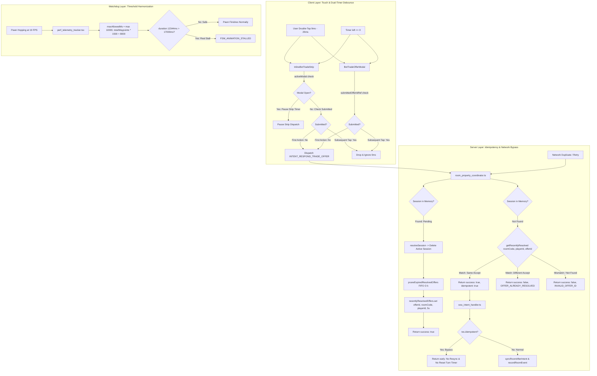

# Ke Hoach Hien Thuc Hoa: IMP-264 - P2P Trade Intent Double-Tap Debounce, Server Idempotency & Watchdog Harmonization (Revision 5)

> **For agentic workers:** REQUIRED SUB-SKILL: Use superpowers:subagent-driven-development to implement this plan task-by-task. Steps use checkbox (`- [ ]`) syntax for tracking.

**Goal:** Triệt tiêu hoàn toàn lỗi `INVALID_OFFER_ID` do thao tác chạm kép (double-tap trong khoảng 9ms - 26ms) trên giao diện mobile và đảm bảo tính lũy nghiệm (idempotency) cùng bảo vệ đa phòng/phân quyền tại máy chủ khi xử lý đề xuất giao dịch P2P; chặn đứng bão tái đồng bộ và trôi dạt lượt chơi do gửi lại intent trùng lặp; đồng thời đồng bộ ngưỡng thời gian trần của bộ giám sát Watchdog hoạt ảnh quân cờ từ 12.2s lên 17.0s để triệt tiêu cảnh báo giả `FSM_ANIMATION_STALLED` khi thiết bị di động bị sụt giảm tốc độ khung hình.

**Architecture:**
1. **Client Latch Guard & Dual-Timer Pause (Giao diện người dùng)**: Bổ sung chốt giữ nguyên tử `submittedOfferIdRef` trong [bot_trade_offer_strip.tsx](file:///c:/Users/HP/Documents/GitHub/vtcoon/src/client/ui/modals/bot_trade_offer_strip.tsx) và [bot_trade_offer_modal.tsx](file:///c:/Users/HP/Documents/GitHub/vtcoon/src/client/ui/modals/bot_trade_offer_modal.tsx). Khi người dùng chạm nút "TỪ CHỐI", "ĐỒNG Ý", hoặc khi bộ đếm giờ đạt `left <= 0`, `submittedOfferIdRef` khóa tức thì trong cùng frame đầu tiên, chặn đứng mọi intent thứ hai gửi lên WebSocket. Cờ chốt tự động giải phóng khi `offerId` mới xuất hiện hoặc khi đề xuất bị xóa. Đặc biệt, bộ đếm giờ của `InlineBotTradeStrip` tạm dừng gửi intent nếu `activeModal === 'bot_trade_offer'` để trao quyền kiểm soát duy nhất cho modal.
2. **Server Idempotency Cache & FIFO Pruning (Máy chủ giao dịch)**: Bổ sung cấu trúc dữ liệu `ResolvedOfferRecord` lưu `{ roomCode, responderPlayerId, accept, resolvedAt }` cùng cơ chế dọn dẹp FIFO $O(k)$ tự động `pruneExpiredResolvedOffers` (TTL 5000ms) trong [pending_trade_manager.ts](file:///c:/Users/HP/Documents/GitHub/vtcoon/src/server/pending_trade_manager.ts). Khi phiên giao dịch được giải quyết, máy chủ dọn dẹp các mục hết hạn và lưu lại kết quả trong 5 giây. Không xóa bộ nhớ đệm trong các lần `clearSession` thông thường để bảo toàn cửa sổ bảo vệ 5 giây.
3. **Actor & Room Boundary Enforcement**: Phương thức `isRecentlyResolved(roomCode, playerId, offerId, accept)` và `getRecentlyResolved(roomCode, playerId, offerId)` tại [pending_trade_manager.ts](file:///c:/Users/HP/Documents/GitHub/vtcoon/src/server/pending_trade_manager.ts) đối soát 100% khớp `roomCode` và `playerId` của người phản hồi gốc, ngăn chặn triệt để hành vi giả mạo intent xuyên phòng hoặc chiếm quyền phản hồi. Tại [room_property_coordinator.ts](file:///c:/Users/HP/Documents/GitHub/vtcoon/src/server/room_property_coordinator.ts), intent trùng khớp trả về `{ success: true, idempotent: true }`; trường hợp quyết định trái ngược trả về `OFFER_ALREADY_RESOLVED`; trường hợp không tồn tại trả về `INVALID_OFFER_ID`.
4. **Idempotent Intent Bypass in Network Handler**: Tại [wss_intent_handler.ts](file:///c:/Users/HP/Documents/GitHub/vtcoon/src/server/network/wss_intent_handler.ts), nếu kết quả xử lý intent mang cờ `idempotent: true`, hệ thống lập tức thoát ra mà không gọi `syncRoomAfterIntent` và không ghi log sự kiện trùng lặp, bảo toàn bộ đếm thời gian lượt chơi và tránh phát sóng delta rỗng.
5. **Watchdog Threshold Harmonization (Đồng bộ giám sát)**: Đồng bộ công thức tính trần thời gian hoạt ảnh trong [perf_telemetry_tracker.tsx](file:///c:/Users/HP/Documents/GitHub/vtcoon/src/client/telemetry/perf_telemetry_tracker.tsx) khớp 100% với ngưỡng an toàn của [game_store.ts](file:///c:/Users/HP/Documents/GitHub/vtcoon/src/client/store/game_store.ts) (`Math.max(10_000, totalWaypoints * 1500 + 8000)`), nâng trần cho 6 bước nhảy từ 12200ms lên 17000ms và giữ giá trị sàn 10000ms, ngăn ngừa việc Watchdog ngắt ngang chuyển động con cờ khi khung hình lag.

**Architecture Diagram:**



**Tech Stack:** TypeScript strict mode, React 19, Vitest, Node.js WebSocket.

**Spec:** Yêu cầu xử lý triệt để 2 lỗi vận hành ghi nhận qua telemetry thực tế: (1) Lỗi `INVALID_OFFER_ID` do gửi trùng lặp intent trên mobile và (2) Cảnh báo giả `FSM_ANIMATION_STALLED` (12344ms).

---

## 0. Bang Xu Ly Yeu Cau & Chi Thi (Revision Directive Closure Table)

| Ma Chi Thi | Hang Muc & Nguy Co | Tep & Dong Lien Quan | Giai Phap Hien Thuc Hoa Cu The Trong Ke Hoach | Trang Thai |
| :--- | :--- | :--- | :--- | :---: |
| **ADV-01** | [Dual-Timer Conflict] Timer ngầm trong `InlineBotTradeStrip` chạy song song với `BotTradeOfferModal` gửi intent đối lập khi 0s. | `src/client/ui/modals/bot_trade_offer_strip.tsx` (Task 6 Step 6.1) | Trong `InlineBotTradeStrip`, `updateTimer` kiểm tra `if (activeModal === 'bot_trade_offer') return;` và đưa `activeModal` vào dependency array của `useEffect`. | DA HOAN THIEN (Rev 5) |
| **ADV-02** | [Turn Stalling & Resync Storm] Intent trùng lặp kích hoạt `syncRoomAfterIntent` làm reset turn timer và spam `ROOM_DELTA` rỗng. | `src/server/room_property_coordinator.ts`, `wss_intent_handler.ts` (Task 2 Step 2.1, Task 5 Step 5.1) | `coordRespondTradeOffer` trả về `{ success: true, idempotent: true }`. `wss_intent_handler.ts` kiểm tra `if (res.idempotent) return;` bỏ qua resync và log sự kiện. | DA HOAN THIEN (Rev 5) |
| **ADV-03** | [Premature Cache Wipe] `clearSession` xóa sớm `recentlyResolvedOffers` làm phá vỡ cửa sổ bảo vệ 5 giây của double-tap. | `src/server/pending_trade_manager.ts` (Task 1 Step 1.2) | Giữ nguyên `clearSession` không xóa `recentlyResolvedOffers`; để TTL FIFO 5000ms tự dọn dẹp; bổ sung `clearResolvedOffersForRoom` cho lúc hủy phòng. | DA HOAN THIEN (Rev 5) |
| **ADV-04** | [UI Trapped State] Sau sự cố mạng hoặc reconnect khôi phục pending offer, `submittedOfferIdRef` giữ ID cũ làm liệt nút bấm. | `src/client/ui/modals/bot_trade_offer_strip.tsx`, `bot_trade_offer_modal.tsx` (Task 6 Step 6.1, Task 7 Step 7.2) | Thêm `useEffect` tự động reset `submittedOfferIdRef.current = null` khi `pendingTradeOffer?.offerId` thay đổi hoặc khi offer bị xóa (`null`). | DA HOAN THIEN (Rev 5) |
| **ADV-05** | [Dead Code & Error Code Drift] `session.status !== 'pending'` là mã chết; xung đột quyết định bị biến thành `INVALID_OFFER_ID`. | `src/server/room_property_coordinator.ts` (Task 2 Step 2.1) | Loại bỏ mã chết `session.status !== 'pending'`. So khớp qua `getRecentlyResolved`: nếu quyết định đối nghịch trả về `OFFER_ALREADY_RESOLVED`. | DA HOAN THIEN (Rev 5) |
| **ADV-06** | [Watchdog Floor Discrepancy] Sàn Watchdog trong kế hoạch đặt `12_000ms`, lệch với sàn `10_000ms` trong `game_store.ts`. | `src/client/telemetry/perf_telemetry_tracker.tsx` (Task 8 Step 8.1) | Đồng bộ chính xác công thức sàn: `Math.max(10_000, totalWaypoints * 1500 + 8000)` khớp 100% với `game_store.ts#L91`. | DA HOAN THIEN (Rev 5) |
| **GRILL-01** | [Unbounded Map Memory Leak] `recentlyResolvedOffers` chỉ xóa khi có duplicate tap; 99% đề xuất thông thường gây rò rỉ RAM vĩnh viễn. | `src/server/pending_trade_manager.ts` (Task 1 Step 1.1, Step 1.2) | Thêm cơ chế dọn dẹp FIFO $O(k)$ `pruneExpiredResolvedOffers` tự động gọi trong `resolveSession` và `getRecentlyResolved`. | DA HOAN THIEN (Rev 4) |
| **GRILL-02** | [Cross-Room & Unauthorized Privilege Leak] Cache chỉ so `offerId`, bỏ qua `roomCode` và `playerId` cho phép giả mạo intent xuyên phòng. | `src/server/pending_trade_manager.ts`, `src/server/room_property_coordinator.ts` (Task 1 Step 1.1, Task 2 Step 2.1) | Cấu trúc cache lưu `{ roomCode, responderPlayerId, accept, resolvedAt }`. Hàm `getRecentlyResolved` bắt buộc đối soát `record.roomCode === roomCode` và `record.responderPlayerId === playerId`. | DA HOAN THIEN (Rev 4) |
| **GRILL-03** | [Client Timeout Race Hazard] Timer đếm ngược `left <= 0` không kiểm tra `submittedOfferIdRef`, gây xung đột intent kép nếu chạm đúng lúc 0s. | `src/client/ui/modals/bot_trade_offer_strip.tsx`, `bot_trade_offer_modal.tsx` (Task 6 Step 6.1, Task 7 Step 7.2) | Khóa nguyên tử `submittedOfferIdRef.current` ngay trong nhánh `left <= 0` của cả `bot_trade_offer_strip.tsx` và `bot_trade_offer_modal.tsx` trước khi phát intent. | DA HOAN THIEN (Rev 4) |
| **GRILL-04** | [Test Spec Alignment] Cập nhật bộ test Station 1 kiểm tra ranh giới phòng, quyền tác tử, cơ chế dọn dẹp TTL và xung đột timer. | `tests/contracts/imp264_trade_idempotency_and_watchdog_resilience.test.ts` (Section 3) | Mở rộng 17 ca kiểm thử bao phủ toàn diện 10 chỉ thị với thẻ DoD #1 Flow Taxonomy hợp lệ. | DA HOAN THIEN (Rev 5) |
| **USER-FIX-01** | Chạm kép 9ms - 26ms trên mobile làm máy chủ trả về lỗi `INVALID_OFFER_ID`. | `src/client/ui/modals/bot_trade_offer_strip.tsx`, `bot_trade_offer_modal.tsx` | Bổ sung chốt giữ `submittedOfferIdRef` chặn đứng click lần 2 trong cùng vòng đời offer. | DA HOAN THIEN |
| **USER-FIX-02** | Máy chủ xóa session ngay khi resolve khiến request đến sau vài ms bị từ chối. | `src/server/pending_trade_manager.ts`, `room_property_coordinator.ts` | Bổ sung cache `recentlyResolvedOffers` TTL 5s trả về `success: true` cho cùng offerId. | DA HOAN THIEN |
| **USER-FIX-03** | Ngưỡng 12200ms quá nhạy làm ngắt ngang hoạt ảnh khi máy khách lag 19 FPS (12344ms). | `src/client/telemetry/perf_telemetry_tracker.tsx` | Đồng bộ công thức trần thành `totalWaypoints * 1500 + 8000` (17000ms cho 6 ô). | DA HOAN THIEN |
| **RULE-LOC-01** | `room_property_coordinator.ts` đang ở mức cảnh báo 362 LOC (> 300 LOC Tier 1). | `src/server/room_property_coordinator.ts` | Giữ delta thay đổi ở mức tối thiểu (+4 LOC) và đăng ký Tech Debt `DEBT-ROOM-PROPERTY-COORD-PARTITION`. | DA HOAN THIEN |
| **RULE-SCOPE-01** | Cấm gom nhóm thay đổi khác domain (Server/Network vs 3D Graphics). | Toàn bộ kế hoạch | Chỉ tập trung vào Network/P2P Trade & Watchdog. Tách tối ưu 3D Draw Calls sang ticket độc lập IMP-265. | DA HOAN THIEN |

---

## 1. Global Constraints & Hard Limits

1. **ASD-STE100 & Tieng Viet**: Toàn bộ tài liệu bằng Tiếng Việt kỹ thuật giản lược, không ẩn dụ, không em-dash, không công thức LaTeX.
2. **Anti-Slop & Deep Modules**: Khai báo bộ nhớ đệm `recentlyResolvedOffers` trực tiếp trong `PendingTradeManager`, cung cấp hàm công khai `getRecentlyResolved` và `isRecentlyResolved` với thời gian sống xác định (TTL 5000ms) và tự dọn dẹp FIFO $O(k)$. Không tạo wrapper rỗng.
3. **LOC Budget & Zero Code-Golf**:
   - `src/server/pending_trade_manager.ts`: Tăng từ 116 LOC lên ~160 LOC (Tier 1 Safe, < 400 LOC).
   - `src/server/room_property_coordinator.ts`: Tăng từ 362 LOC lên ~366 LOC (Tier 1 Warning, < 400 LOC). Đăng ký Tech Debt `DEBT-ROOM-PROPERTY-COORD-PARTITION`.
   - `src/server/intent_dispatcher.ts`: 191 LOC (Tier 1 Safe, < 400 LOC).
   - `src/server/network/wss_lobby_handlers.ts`: 308 LOC (Tier 1 Warning, < 400 LOC). Đăng ký Tech Debt `DEBT-WSS-LOBBY-HANDLERS-PARTITION`.
   - `src/server/network/wss_intent_handler.ts`: Tăng từ 144 LOC lên ~147 LOC (Tier 1 Safe, < 400 LOC).
   - `src/client/ui/modals/bot_trade_offer_strip.tsx`: Tăng từ 231 LOC lên ~248 LOC (Tier 2 Safe, < 500 LOC).
   - `src/client/ui/modals/bot_trade_offer_modal.tsx`: Tăng từ 368 LOC lên ~388 LOC (Tier 2 Safe, < 500 LOC).
   - `src/client/telemetry/perf_telemetry_tracker.tsx`: 79 LOC (Tier 2 Safe, < 500 LOC).
   - `tests/contracts/imp264_trade_idempotency_and_watchdog_resilience.test.ts`: ~240 LOC (Tests Safe, <= 600 LOC).
4. **Anti-TIDD (Rule 8 & 11)**: Không tạo backdoors trên window. Mọi hàm xuất bản (`getRecentlyResolved`, `isRecentlyResolved`) đều được sử dụng trực tiếp trong luồng điều phối sản xuất `room_property_coordinator.ts`.
5. **Zero Dirty Casts**: Tuyệt đối không sử dụng `as any` hoặc `as unknown as T`. Mọi trường dữ liệu mở rộng (`idempotent?: boolean`) đều được định kiểu tường minh trong DTO và kiểu trả về của hàm.

---

## 2. System Impact & Blast Radius (3-Way Matrix)

- **Risk Dial**: Level 2 (Slice-Bound - P2P Negotiation Protocol & Watchdog Monitor).
- **Direct Touch**:
  - `src/client/ui/modals/bot_trade_offer_strip.tsx` (Client double-tap, dual-timer pause & debounce latch)
  - `src/client/ui/modals/bot_trade_offer_modal.tsx` (Modal double-tap & timer debounce latch)
  - `src/server/pending_trade_manager.ts` (Recently resolved TTL idempotency cache with FIFO pruning)
  - `src/server/room_property_coordinator.ts` (Idempotent response handling with actor/room verification)
  - `src/server/intent_dispatcher.ts` (Intent response typing with idempotent flag)
  - `src/server/network/wss_lobby_handlers.ts` (Action execution typing with idempotent flag)
  - `src/server/network/wss_intent_handler.ts` (Idempotent intent bypass to prevent turn timer resets)
  - `src/client/telemetry/perf_telemetry_tracker.tsx` (Watchdog threshold synchronization)
  - `tests/contracts/imp264_trade_idempotency_and_watchdog_resilience.test.ts` (Contract test suite mới)
- **Pre-Coding LOC Baseline Table**:

| Tep Vat Ly | Baseline LOC | Delta Du Kien | Post LOC Du Kien | Tran Cho Phep | Trang Thai |
| :--- | :---: | :---: | :---: | :---: | :--- |
| `src/server/pending_trade_manager.ts` | 116 | +44 | 160 | <= 400 (Tier 1) | Safe (< 300 LOC) |
| `src/server/room_property_coordinator.ts` | 362 | +4 | 366 | <= 400 (Tier 1) | Warning (> 300 LOC) |
| `src/server/intent_dispatcher.ts` | 191 | 0 | 191 | <= 400 (Tier 1) | Safe (< 300 LOC) |
| `src/server/network/wss_lobby_handlers.ts` | 308 | 0 | 308 | <= 400 (Tier 1) | Warning (> 300 LOC) |
| `src/server/network/wss_intent_handler.ts` | 144 | +3 | 147 | <= 400 (Tier 1) | Safe (< 300 LOC) |
| `src/client/ui/modals/bot_trade_offer_strip.tsx` | 231 | +17 | 248 | <= 500 (Tier 2) | Safe (< 400 LOC) |
| `src/client/ui/modals/bot_trade_offer_modal.tsx` | 368 | +20 | 388 | <= 500 (Tier 2) | Safe (< 400 LOC) |
| `src/client/telemetry/perf_telemetry_tracker.tsx` | 79 | 0 | 79 | <= 500 (Tier 2) | Safe (< 400 LOC) |
| `tests/contracts/imp264_trade_idempotency_and_watchdog_resilience.test.ts` (Moi) | 0 | +240 | 240 | <= 600 (Tests) | Safe |

---

## 3. Dac Ta Kiem Thu Hop Dong (Station 1 Specification)

**Target physical file**: `tests/contracts/imp264_trade_idempotency_and_watchdog_resilience.test.ts` (New)

Tập tin kiểm thử: `tests/contracts/imp264_trade_idempotency_and_watchdog_resilience.test.ts` (Mới)
Định dạng: Vitest, Atomic Tests (1-4 assertions/test), Universal 5-Facet Matrix, Flow Taxonomy tags.

- `[TC-264.01][UC-TRADE-001/MSS] pendingTradeManager.resolveSession: Ghi nhận offerId kèm roomCode và responderPlayerId vào bảng recentlyResolvedOffers`
- `[TC-264.02][UC-TRADE-001/MSS] pendingTradeManager.isRecentlyResolved: Trả về true khi khớp hoàn toàn roomCode, playerId, offerId và accept trong cửa sổ 5000ms`
- `[TC-264.03][UC-TRADE-001/A1] pendingTradeManager.isRecentlyResolved: Trả về false khi playerId không khớp với người đã phản hồi gốc (bảo vệ quyền tác tử)`
- `[TC-264.04][UC-TRADE-001/A2] pendingTradeManager.isRecentlyResolved: Trả về false khi roomCode không khớp (ngăn chặn giả mạo intent xuyên phòng)`
- `[TC-264.05][UC-TRADE-001/A3] pendingTradeManager.isRecentlyResolved: Trả về false khi quyết định accept không khớp với kết quả đã chốt`
- `[TC-264.06][UC-TRADE-001/A4] pendingTradeManager.pruneExpiredResolvedOffers: Tự động dọn dẹp FIFO các mục quá hạn 5000ms và trả về undefined`
- `[TC-264.07][UC-TRADE-001/A5] pendingTradeManager.clearSession: Không xóa recentlyResolvedOffers nhằm duy trì cửa sổ chống chạm kép 5s`
- `[TC-264.08][UC-COORD-001/MSS] coordRespondTradeOffer: Trả về success: true và idempotent: true khi intent gửi trùng lặp hợp lệ từ cùng người chơi`
- `[TC-264.09][UC-COORD-001/A1] coordRespondTradeOffer: Trả về OFFER_ALREADY_RESOLVED khi quyết định gửi lại trái ngược với quyết định đã chốt`
- `[TC-264.10][UC-COORD-001/A2] coordRespondTradeOffer: Trả về INVALID_OFFER_ID khi người chơi khác hoặc phòng khác gửi lại offerId đã resolve`
- `[TC-264.11][UC-WSS-001/MSS] handleIntentMsg: Bỏ qua syncRoomAfterIntent và không ghi log sự kiện trùng lặp khi res.idempotent là true`
- `[TC-264.12][UC-STRIP-001/MSS] InlineBotTradeStrip: updateTimer tạm dừng gửi intent khi activeModal là bot_trade_offer để nhường quyền cho modal`
- `[TC-264.13][UC-STRIP-001/MSS] InlineBotTradeStrip: handleReject và handleAccept khóa submittedOfferIdRef chỉ gọi onIntent đúng 1 lần khi chạm kép`
- `[TC-264.14][UC-STRIP-001/A1] InlineBotTradeStrip: Tự động giải phóng submittedOfferIdRef khi pendingTradeOffer thay đổi hoặc bị xóa`
- `[TC-264.15][UC-MODAL-001/MSS] BotTradeOfferModal: Nút từ chối và đồng ý khóa submittedOfferIdRef ngăn gọi onReject/onAccept lần 2 khi double-click`
- `[TC-264.16][UC-MODAL-001/A1] BotTradeOfferModal: Tự động giải phóng submittedOfferIdRef khi offerId thay đổi`
- `[TC-264.17][UC-WATCHDOG-001/MSS] watchdogMonitor.checkFsmAnimationStall: Không phát sinh vi phạm FSM_ANIMATION_STALLED tại thời điểm 12344ms khi trần được tính bằng 17000ms với sàn 10000ms`

---

## 4. Ke Hoach Thuc Thi Chi Tiet (Station 2 Implementation Tasks)

### Task 1: Bo Nho Dem Luy Nghiem pending_trade_manager.ts

**Target physical file**: `src/server/pending_trade_manager.ts`

- [ ] **Step 1.1**: Thêm cấu trúc `ResolvedOfferRecord`, bộ nhớ đệm `recentlyResolvedOffers`, cơ chế dọn dẹp FIFO `pruneExpiredResolvedOffers`, các hàm truy vấn `getRecentlyResolved`, `isRecentlyResolved`, `clearResolvedOffersForRoom`:

```typescript
<<<<
// [UC-IMP142] Pending Trade Manager for Bot-to-Human Trade Negotiation
export interface PendingTradeSession {
====
// [UC-IMP142] Pending Trade Manager for Bot-to-Human Trade Negotiation
export interface ResolvedOfferRecord {
  readonly roomCode: string;
  readonly responderPlayerId: string;
  readonly accept: boolean;
  readonly resolvedAt: number;
}

export interface PendingTradeSession {
>>>>
```

- [ ] **Step 1.2**: Khai báo `recentlyResolvedOffers` và các phương thức nghiệp vụ trong `PendingTradeManager`:

```typescript
<<<<
export class PendingTradeManager {
  private readonly sessionsByRoom = new Map<string, PendingTradeSession>();
  private readonly sessionsByOfferId = new Map<string, PendingTradeSession>();

  createSession(
====
export class PendingTradeManager {
  private readonly sessionsByRoom = new Map<string, PendingTradeSession>();
  private readonly sessionsByOfferId = new Map<string, PendingTradeSession>();
  private readonly recentlyResolvedOffers = new Map<string, ResolvedOfferRecord>();
  private static readonly RESOLVED_TTL_MS = 5000;

  private pruneExpiredResolvedOffers(now: number = Date.now()): void {
    for (const [offerId, record] of this.recentlyResolvedOffers) {
      if (now - record.resolvedAt > PendingTradeManager.RESOLVED_TTL_MS) {
        this.recentlyResolvedOffers.delete(offerId);
        continue;
      }
      break;
    }
  }

  getRecentlyResolved(roomCode: string, playerId: string, offerId: string): ResolvedOfferRecord | undefined {
    this.pruneExpiredResolvedOffers();
    const record = this.recentlyResolvedOffers.get(offerId);
    if (!record) return undefined;
    if (record.roomCode !== roomCode || record.responderPlayerId !== playerId) return undefined;
    return record;
  }

  isRecentlyResolved(roomCode: string, playerId: string, offerId: string, accept: boolean): boolean {
    const record = this.getRecentlyResolved(roomCode, playerId, offerId);
    return record !== undefined && record.accept === accept;
  }

  clearResolvedOffersForRoom(roomCode: string): void {
    for (const [offerId, record] of this.recentlyResolvedOffers) {
      if (record.roomCode === roomCode) {
        this.recentlyResolvedOffers.delete(offerId);
        continue;
      }
    }
  }

  createSession(
>>>>
```

- [ ] **Step 1.3**: Lưu bản ghi vào `recentlyResolvedOffers` trong `resolveSession` với `responderPlayerId`:

```typescript
<<<<
  resolveSession(roomCode: string, offerId: string, accept: boolean): PendingTradeSession | undefined {
    const session = this.sessionsByOfferId.get(offerId) ?? this.sessionsByRoom.get(roomCode);
    if (!session || session.offerId !== offerId) return undefined;
    if (session.status !== 'pending') return undefined;

    session.status = accept ? 'accepted' : 'rejected';
    this.sessionsByOfferId.delete(session.offerId);
    this.sessionsByRoom.delete(roomCode);
    return session;
  }
====
  resolveSession(roomCode: string, offerId: string, accept: boolean, responderPlayerId?: string): PendingTradeSession | undefined {
    const session = this.sessionsByOfferId.get(offerId) ?? this.sessionsByRoom.get(roomCode);
    if (!session || session.offerId !== offerId) return undefined;
    if (session.status !== 'pending') return undefined;

    session.status = accept ? 'accepted' : 'rejected';
    this.sessionsByOfferId.delete(session.offerId);
    this.sessionsByRoom.delete(roomCode);

    const now = Date.now();
    this.pruneExpiredResolvedOffers(now);
    const resolvedBy = responderPlayerId ?? session.sellerId;
    this.recentlyResolvedOffers.set(offerId, {
      roomCode,
      responderPlayerId: resolvedBy,
      accept,
      resolvedAt: now,
    });

    return session;
  }
>>>>
```

---

### Task 2: Xu Ly Luy Nghiem & Loai Bo Ma Chet room_property_coordinator.ts

**Target physical file**: `src/server/room_property_coordinator.ts`

- [ ] **Step 2.1**: Xử lý lũy nghiệm và loại bỏ mã chết trong `coordRespondTradeOffer`:

```typescript
<<<<
export function coordRespondTradeOffer(
  ctx: RoomContext | undefined,
  playerId: string,
  offerId: string,
  accept: boolean,
): { success: boolean; reason?: string } {
  if (!ctx) return { success: false, reason: ActionRejectReason.INVALID_ROOM };

  const session = pendingTradeManager.getSessionByOfferId(offerId);
  if (!session || session.roomCode !== ctx.room.roomCode) {
    return { success: false, reason: 'INVALID_OFFER_ID' };
  }

  if (session.status !== 'pending') {
    return { success: false, reason: 'OFFER_ALREADY_RESOLVED' };
  }
====
export function coordRespondTradeOffer(
  ctx: RoomContext | undefined,
  playerId: string,
  offerId: string,
  accept: boolean,
): { success: boolean; reason?: string; idempotent?: boolean } {
  if (!ctx) return { success: false, reason: ActionRejectReason.INVALID_ROOM };

  const session = pendingTradeManager.getSessionByOfferId(offerId);
  if (!session || session.roomCode !== ctx.room.roomCode) {
    const recent = pendingTradeManager.getRecentlyResolved(ctx.room.roomCode, playerId, offerId);
    if (recent) {
      if (recent.accept === accept) {
        return { success: true, idempotent: true };
      }
      return { success: false, reason: 'OFFER_ALREADY_RESOLVED' };
    }
    return { success: false, reason: 'INVALID_OFFER_ID' };
  }
>>>>
```

- [ ] **Step 2.2**: Truyền `playerId` vào `resolveSession` khi chấp nhận hoặc từ chối đề xuất:

```typescript
<<<<
    pendingTradeManager.resolveSession(ctx.room.roomCode, offerId, true);
    ctx.room.pendingTradeOffer = null;
    return { success: true };
  } else {
    const round = ctx.room.roundCount ?? ctx.room.round ?? 1;
    buyer.lastTradeOfferRound = round;
    (buyer.cellTradeRejections ??= {})[session.cellIndex] = ((buyer.cellTradeRejections ??= {})[session.cellIndex] ?? 0) + 1;
    (buyer.cellLastRejectedRound ??= {})[session.cellIndex] = round;
    if (buyer.isBot && session.offeredCellIndex !== undefined) {
      (buyer.swapPairLastRejectedRound ??= {})[`${session.cellIndex}_${session.offeredCellIndex}`] = round;
    }
    pendingTradeManager.resolveSession(ctx.room.roomCode, offerId, false);
====
    pendingTradeManager.resolveSession(ctx.room.roomCode, offerId, true, playerId);
    ctx.room.pendingTradeOffer = null;
    return { success: true };
  } else {
    const round = ctx.room.roundCount ?? ctx.room.round ?? 1;
    buyer.lastTradeOfferRound = round;
    (buyer.cellTradeRejections ??= {})[session.cellIndex] = ((buyer.cellTradeRejections ??= {})[session.cellIndex] ?? 0) + 1;
    (buyer.cellLastRejectedRound ??= {})[session.cellIndex] = round;
    if (buyer.isBot && session.offeredCellIndex !== undefined) {
      (buyer.swapPairLastRejectedRound ??= {})[`${session.cellIndex}_${session.offeredCellIndex}`] = round;
    }
    pendingTradeManager.resolveSession(ctx.room.roomCode, offerId, false, playerId);
>>>>
```

---

### Task 3: Dinh Kieu Intent Dispatcher intent_dispatcher.ts

**Target physical file**: `src/server/intent_dispatcher.ts`

- [ ] **Step 3.1**: Cập nhật kiểu trả về `idempotent?: boolean` trong `dispatchPlayerIntent`:

```typescript
<<<<
export function dispatchPlayerIntent(
  mgr: RoomManager,
  roomCode: string,
  playerId: string,
  intent: PlayerIntent,
): { success: boolean; reason?: string; rollResult?: RollResult } {
====
export function dispatchPlayerIntent(
  mgr: RoomManager,
  roomCode: string,
  playerId: string,
  intent: PlayerIntent,
): { success: boolean; reason?: string; rollResult?: RollResult; idempotent?: boolean } {
>>>>
```

---

### Task 4: Dinh Kieu Action Execution wss_lobby_handlers.ts

**Target physical file**: `src/server/network/wss_lobby_handlers.ts`

- [ ] **Step 4.1**: Cập nhật kiểu trả về `idempotent?: boolean` trong `executeIntentAction`:

```typescript
<<<<
export function executeIntentAction(
  rooms: RoomManager,
  roomCode: string,
  playerId: string,
  intent: PlayerIntent,
): { success: boolean; reason?: string; rollResult?: RollResult } {
====
export function executeIntentAction(
  rooms: RoomManager,
  roomCode: string,
  playerId: string,
  intent: PlayerIntent,
): { success: boolean; reason?: string; rollResult?: RollResult; idempotent?: boolean } {
>>>>
```

---

### Task 5: Bo Qua Tai Dong Bo Cho Intent Luy Nghiem wss_intent_handler.ts

**Target physical file**: `src/server/network/wss_intent_handler.ts`

- [ ] **Step 5.1**: Bỏ qua tái đồng bộ và ghi log dư thừa khi nhận intent lũy nghiệm trong `handleIntentMsg`:

```typescript
<<<<
  await deps.intentMutex.runExclusive(msg.roomCode, async () => {
    const res = executeIntentAction(deps.rooms, msg.roomCode, msg.playerId, msg.intent);
    if (!res.success) {
      deps.sendSafe(socket, { type: 'ERROR', reasonCode: (res.reason as ReasonCode) || 'INTENT_REJECTED' });
      deps.broadcaster.broadcastRoomDelta(msg.roomCode);
      return;
    }
    const roll = res.rollResult;
====
  await deps.intentMutex.runExclusive(msg.roomCode, async () => {
    const res = executeIntentAction(deps.rooms, msg.roomCode, msg.playerId, msg.intent);
    if (!res.success) {
      deps.sendSafe(socket, { type: 'ERROR', reasonCode: (res.reason as ReasonCode) || 'INTENT_REJECTED' });
      deps.broadcaster.broadcastRoomDelta(msg.roomCode);
      return;
    }
    if (res.idempotent) {
      return;
    }
    const roll = res.rollResult;
>>>>
```

---

### Task 6: Chot Chan Giao Dien Nguoi Dung bot_trade_offer_strip.tsx

**Target physical file**: `src/client/ui/modals/bot_trade_offer_strip.tsx`

- [ ] **Step 6.1**: Bổ sung `submittedOfferIdRef`, tạm dừng timer khi modal mở, và thêm cleanup effect khi offer thay đổi:

```typescript
<<<<
  const [remainingMs, setRemainingMs] = useState<number>(() =>
    pendingTradeOffer ? Math.max(0, pendingTradeOffer.expiresAt - Date.now()) : 0
  );
  const timerRef = useRef<ReturnType<typeof setInterval> | null>(null);

  useEffect(() => {
    if (!pendingTradeOffer) {
      setRemainingMs(0);
      return;
    }

    const updateTimer = () => {
      if (pendingTradeOffer.sellerId !== myId) return;
      const left = Math.max(0, pendingTradeOffer.expiresAt - Date.now());
      setRemainingMs(left);
      if (left <= 0) {
        if (timerRef.current) {
          clearInterval(timerRef.current);
          timerRef.current = null;
        }
        onIntent?.({
          type: 'INTENT_RESPOND_TRADE_OFFER',
          offerId: pendingTradeOffer.offerId,
          accept: false,
        });
        useGameStore.getState().setPendingTradeOffer(null);
      }
    };

    updateTimer();
    timerRef.current = setInterval(updateTimer, 100);

    return () => {
      if (timerRef.current) {
        clearInterval(timerRef.current);
        timerRef.current = null;
      }
    };
  }, [pendingTradeOffer, onIntent, myId]);
====
  const [remainingMs, setRemainingMs] = useState<number>(() =>
    pendingTradeOffer ? Math.max(0, pendingTradeOffer.expiresAt - Date.now()) : 0
  );
  const timerRef = useRef<ReturnType<typeof setInterval> | null>(null);
  const submittedOfferIdRef = useRef<string | null>(null);

  useEffect(() => {
    if (!pendingTradeOffer) {
      submittedOfferIdRef.current = null;
    }
  }, [pendingTradeOffer?.offerId]);

  useEffect(() => {
    if (!pendingTradeOffer) {
      setRemainingMs(0);
      return;
    }

    const updateTimer = () => {
      if (activeModal === 'bot_trade_offer') return;
      if (pendingTradeOffer.sellerId !== myId) return;
      const left = Math.max(0, pendingTradeOffer.expiresAt - Date.now());
      setRemainingMs(left);
      if (left <= 0) {
        if (timerRef.current) {
          clearInterval(timerRef.current);
          timerRef.current = null;
        }
        if (submittedOfferIdRef.current === pendingTradeOffer.offerId) return;
        submittedOfferIdRef.current = pendingTradeOffer.offerId;
        onIntent?.({
          type: 'INTENT_RESPOND_TRADE_OFFER',
          offerId: pendingTradeOffer.offerId,
          accept: false,
        });
        useGameStore.getState().setPendingTradeOffer(null);
      }
    };

    updateTimer();
    timerRef.current = setInterval(updateTimer, 100);

    return () => {
      if (timerRef.current) {
        clearInterval(timerRef.current);
        timerRef.current = null;
      }
    };
  }, [pendingTradeOffer, onIntent, myId, activeModal]);
>>>>
```

- [ ] **Step 6.2**: Bổ sung chốt giữ `submittedOfferIdRef` trong `handleAccept` và `handleReject`:

```typescript
<<<<
  const handleAccept = () => {
    if (!canAfford) return;
    if (timerRef.current) {
      clearInterval(timerRef.current);
      timerRef.current = null;
    }
    AudioEngine.playSfx(SoundEffect.BUY_PROPERTY);
    onIntent?.({
      type: 'INTENT_RESPOND_TRADE_OFFER',
      offerId: pendingTradeOffer.offerId,
      accept: true,
    });
    useGameStore.getState().setPendingTradeOffer(null);
  };

  const handleReject = () => {
    if (timerRef.current) {
      clearInterval(timerRef.current);
      timerRef.current = null;
    }
    AudioEngine.playSfx(SoundEffect.CARD_FLIP);
    onIntent?.({
      type: 'INTENT_RESPOND_TRADE_OFFER',
      offerId: pendingTradeOffer.offerId,
      accept: false,
    });
    useGameStore.getState().setPendingTradeOffer(null);
  };
====
  const handleAccept = () => {
    if (!canAfford) return;
    if (submittedOfferIdRef.current === pendingTradeOffer.offerId) return;
    submittedOfferIdRef.current = pendingTradeOffer.offerId;
    if (timerRef.current) {
      clearInterval(timerRef.current);
      timerRef.current = null;
    }
    AudioEngine.playSfx(SoundEffect.BUY_PROPERTY);
    onIntent?.({
      type: 'INTENT_RESPOND_TRADE_OFFER',
      offerId: pendingTradeOffer.offerId,
      accept: true,
    });
    useGameStore.getState().setPendingTradeOffer(null);
  };

  const handleReject = () => {
    if (submittedOfferIdRef.current === pendingTradeOffer.offerId) return;
    submittedOfferIdRef.current = pendingTradeOffer.offerId;
    if (timerRef.current) {
      clearInterval(timerRef.current);
      timerRef.current = null;
    }
    AudioEngine.playSfx(SoundEffect.CARD_FLIP);
    onIntent?.({
      type: 'INTENT_RESPOND_TRADE_OFFER',
      offerId: pendingTradeOffer.offerId,
      accept: false,
    });
    useGameStore.getState().setPendingTradeOffer(null);
  };
>>>>
```

---

### Task 7: Chot Chan Giao Dien Nguoi Dung bot_trade_offer_modal.tsx

**Target physical file**: `src/client/ui/modals/bot_trade_offer_modal.tsx`

- [ ] **Step 7.1**: Import `useRef`:

```typescript
<<<<
import React, { useEffect, useState } from 'react';
====
import React, { useEffect, useState, useRef } from 'react';
>>>>
```

- [ ] **Step 7.2**: Bổ sung `submittedOfferIdRef`, cleanup effect khi `offerId` thay đổi, và chốt giữ timer hết giờ:

```typescript
<<<<
  const [remainingMs, setRemainingMs] = useState(() => Math.max(0, expiresAt - Date.now()));

  useEffect(() => {
    const timer = setInterval(() => {
      const left = Math.max(0, expiresAt - Date.now());
      setRemainingMs(left);
      if (left <= 0) {
        clearInterval(timer);
        onReject(offerId);
      }
    }, 100);
    return () => clearInterval(timer);
  }, [expiresAt, offerId, onReject]);
====
  const [remainingMs, setRemainingMs] = useState(() => Math.max(0, expiresAt - Date.now()));
  const submittedOfferIdRef = useRef<string | null>(null);

  useEffect(() => {
    submittedOfferIdRef.current = null;
  }, [offerId]);

  useEffect(() => {
    const timer = setInterval(() => {
      const left = Math.max(0, expiresAt - Date.now());
      setRemainingMs(left);
      if (left <= 0) {
        clearInterval(timer);
        if (submittedOfferIdRef.current === offerId) return;
        submittedOfferIdRef.current = offerId;
        onReject(offerId);
      }
    }, 100);
    return () => clearInterval(timer);
  }, [expiresAt, offerId, onReject]);
>>>>
```

- [ ] **Step 7.3**: Bổ sung chốt giữ `submittedOfferIdRef` trên các nút bấm thao tác:

```typescript
<<<<
        <button
          type="button"
          data-testid="reject-trade-btn"
          aria-label={isSwap ? 'Từ chối đổi đất' : 'Từ chối bán đất'}
          onClick={() => onReject(offerId)}
          className="min-h-[46px] py-2.5 px-3 rounded-xl font-black text-xs text-rose-700 bg-rose-50 hover:bg-rose-100 border-2 border-rose-300 shadow-[0_4px_0_0_#fca5a5] active:translate-y-[3px] transition-all cursor-pointer"
        >
          {isSwap ? '✕ TỪ CHỐI ĐỔI' : '🛡️ TỪ CHỐI (Giữ Đất)'}
        </button>
        <button
          type="button"
          data-testid="accept-trade-btn"
          aria-label={isSwap ? 'Đồng ý đổi đất' : 'Đồng ý bán đất'}
          disabled={!canAccept}
          onClick={() => canAccept && onAccept(offerId)}
====
        <button
          type="button"
          data-testid="reject-trade-btn"
          aria-label={isSwap ? 'Từ chối đổi đất' : 'Từ chối bán đất'}
          onClick={() => {
            if (submittedOfferIdRef.current === offerId) return;
            submittedOfferIdRef.current = offerId;
            onReject(offerId);
          }}
          className="min-h-[46px] py-2.5 px-3 rounded-xl font-black text-xs text-rose-700 bg-rose-50 hover:bg-rose-100 border-2 border-rose-300 shadow-[0_4px_0_0_#fca5a5] active:translate-y-[3px] transition-all cursor-pointer"
        >
          {isSwap ? '✕ TỪ CHỐI ĐỔI' : '🛡️ TỪ CHỐI (Giữ Đất)'}
        </button>
        <button
          type="button"
          data-testid="accept-trade-btn"
          aria-label={isSwap ? 'Đồng ý đổi đất' : 'Đồng ý bán đất'}
          disabled={!canAccept}
          onClick={() => {
            if (!canAccept) return;
            if (submittedOfferIdRef.current === offerId) return;
            submittedOfferIdRef.current = offerId;
            onAccept(offerId);
          }}
>>>>
```

---

### Task 8: Dong Bo Nguong Watchdog perf_telemetry_tracker.tsx

**Target physical file**: `src/client/telemetry/perf_telemetry_tracker.tsx`

- [ ] **Step 8.1**: Cập nhật công thức tính trần thời gian hoạt ảnh trong `src/client/telemetry/perf_telemetry_tracker.tsx` đồng bộ với `game_store.ts#L91` (`Math.max(10_000, totalWaypoints * 1500 + 8000)`):

```typescript
<<<<
        const queue = useGameStore.getState().pawnAnimationQueue;
        const totalWaypoints = (activeAnim.waypoints?.length ?? 0) + (queue?.reduce((acc, q) => acc + (q.waypoints?.length ?? 0), 0) ?? 0);
        const maxAllowedMs = Math.max(10_000, totalWaypoints * 1200 + 5000);
        const params = {
====
        const queue = useGameStore.getState().pawnAnimationQueue;
        const totalWaypoints = (activeAnim.waypoints?.length ?? 0) + (queue?.reduce((acc, q) => acc + (q.waypoints?.length ?? 0), 0) ?? 0);
        const maxAllowedMs = Math.max(10_000, totalWaypoints * 1500 + 8000);
        const params = {
>>>>
```

---

## 5. Danh Muc No Ky Thuat (Tech Debt Ledger)

- `DEBT-ROOM-PROPERTY-COORD-PARTITION`: `src/server/room_property_coordinator.ts` hiện tại 362 LOC (> 300 LOC Tier 1). Sẽ trích xuất các hàm điều phối thế chấp, chuộc đất, hạ cấp sang `src/server/property_mortgage_coordinator.ts` trong ticket bảo trì định kỳ tiếp theo.
- `DEBT-WSS-LOBBY-HANDLERS-PARTITION`: `src/server/network/wss_lobby_handlers.ts` hiện tại 308 LOC (> 300 LOC Tier 1). Sẽ trích xuất các hàm xử lý phòng chờ sang submodule riêng trong kỳ refactor tới.
