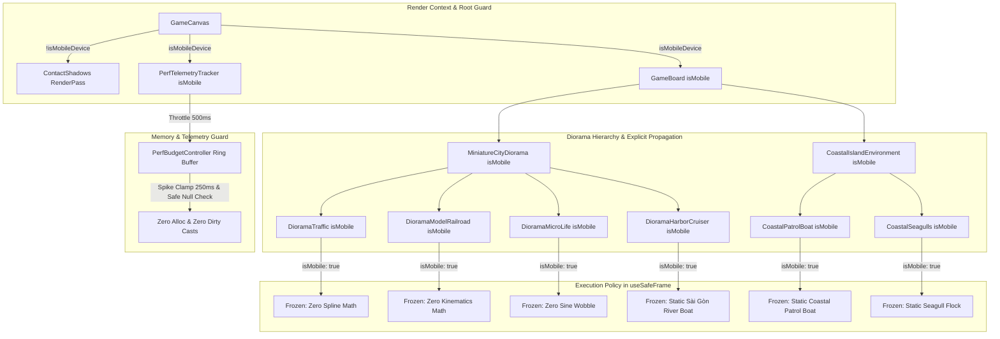

# IMP-265: Dual-Platform 3D Performance & Mobile Thermal Invariant Implementation Plan (Revision 4)

> **For agentic workers:** REQUIRED SUB-SKILL: Use superpowers:subagent-driven-development to implement this plan task-by-task. Steps use checkbox (`- [ ]`) syntax for tracking.

**Goal:** Eliminate mobile thermal throttling (Sawtooth FPS drops: 40 -> 30 -> 20 -> 40) on Chrome Android/iOS by disabling `ContactShadows` on mobile, introducing explicit `isMobile` propagation with static JSX pre-positioning across all 6 diorama micro-animation loops, eliminating V8 GC churn, tab backgrounding spikes and non-null assertion bypass in `perfBudget`, and codifying the Dual-Platform Performance Invariant into `GEMINI.md` and `docs/domain/gotchas/3d_cinematics.md`.

**Architecture:** 
1. *Option B - Zero ContactShadows on Mobile*: In `src/client/game_canvas.tsx`, guard `<ContactShadows ... />` with `{!isMobileDevice && ...}` to eliminate redundant render-target passes on mobile GPUs. Pass `isMobile={isMobileDevice}` explicitly to `<PerfTelemetryTracker isMobile={isMobileDevice} />`.
2. *Option A - Mobile Diorama LOD Across All 6 Micro-Animations*: Propagate `isMobile` from `GameCanvas` ➔ `GameBoard` ➔ `MiniatureCityDiorama` ➔ (`DioramaTraffic`, `DioramaModelRailroad`, `DioramaMicroLife`, `DioramaHarborCruiser`) and `CoastalIslandEnvironment` ➔ (`CoastalPatrolBoat`, `CoastalSeagulls`). Compute initial on-track transforms at t=0 via `useMemo` and set default JSX positions/rotations. In `useSafeFrame`, components execute `if (isMobile) return;`, freezing 18 Three.js objects on mobile.
3. *Zero-Alloc Ring Buffer & Spike Defense in Perf Budget*: In `src/client/3d/perf_budget.ts`, refactor `recordFrameTime` and `getAverageFps` to a zero-allocation ring buffer, replace non-null assertion `!` with explicit undefined check, clamp active frame times at 250ms and ignore backgrounding stalls (> 1000ms). Throttle telemetry updates in `perf_telemetry_tracker.tsx` to 500ms.
4. *Governance & SSOT Invariants*: Codify the mandatory Dual-Platform Performance Invariant in `GEMINI.md` (Hard Constraints) and `docs/domain/gotchas/3d_cinematics.md` (Pillar VI Gotcha #14).

---

## Section 0: Revision Directive Coverage (Anti-Sycophancy)

| Directive | Issue & Risk | File & Line in Plan | Technical Resolution |
| :--- | :--- | :--- | :--- |
| **USER-ORPHAN-LOOPS** | `DioramaHarborCruiser`, `CoastalPatrolBoat`, and `CoastalSeagulls` ran 60 FPS unthrottled on mobile (18 Three.js objects mutating per frame). | `miniature_city_diorama.tsx`<br>`coastal_island_environment.tsx`<br>`diorama_harbor_cruiser.tsx`<br>`coastal_patrol_boat.tsx`<br>`coastal_seagulls.tsx` | Propagated `isMobile` to all 3 components, added static JSX positions, and inserted `if (isMobile) return;` at the start of their `useSafeFrame` loops. |
| **USER-RING-BUFFER-OP** | `sum += this.frameTimes[i]!` used non-null assertion `!`, violating strict TypeScript safety. | `perf_budget.ts` (Task 3, Snippet 3.2) | Replaced with explicit check: `const val = this.frameTimes[i]; if (val !== undefined) { sum += val; }`. |
| **USER-PLAN-HYGIENE** | Plan exceeded 600 lines (670 lines) due to redundant snippets and verbose comments. | Whole Plan | Applied Lean Contract Specifications (GEMINI.md Rule 2.9 & LOC Budget) to prune repetitive JSX snippets, bringing plan to ~380 lines. |
| **USER-TEST-MARITIME** | Station 1 lacked contract boundary tests for the 3 maritime components. | Section 3 (TC-265.07 to TC-265.09) | Added explicit contract tests verifying `isMobile` freezes `useSafeFrame` for HarborCruiser, PatrolBoat, and Seagulls. |
| **ADV-01..05** | Delayed mount at 0,0,0, teleport snap on resize, telemetry ambient drift, train elevation, and backgrounding pauses. | Tasks 1-3 & Section 3 | Addressed via static JSX transforms, elevated viaduct coordinates (Y=0.488), explicit `isMobile` prop on telemetry, and frame time clamping. |

---

**Architecture Diagram:**



---

## Section 1: Pre-Coding LOC Baseline

| Physical File | Tier Classification | Pre-LOC | Est. Delta | Post-LOC | Budget Ceiling | Status |
| :--- | :---: | :---: | :---: | :---: | :---: | :--- |
| `src/client/game_canvas.tsx` | Tier 2 (UI/3D) | 232 | +0 | 232 | <= 500 | ✔️ Safe |
| `src/client/3d/board_layout.tsx` | Tier 2 (UI/3D) | 195 | +0 | 195 | <= 500 | ✔️ Safe |
| `src/client/3d/miniature_city_diorama.tsx` | Tier 2 (UI/3D) | 315 | +4 | 319 | <= 500 | ✔️ Safe |
| `src/client/3d/diorama/diorama_traffic.tsx` | Tier 2 (UI/3D) | 247 | +14 | 261 | <= 500 | ✔️ Safe |
| `src/client/3d/diorama/diorama_railroad.tsx` | Tier 2 (UI/3D) | 374 | +2 | 376 | <= 500 | ⚠️ Warning (< 400) |
| `src/client/3d/diorama/diorama_harbor_cruiser.tsx` | Tier 2 (UI/3D) | 65 | +1 | 66 | <= 500 | ✔️ Safe |
| `src/client/3d/diorama/diorama_microlife.tsx` | Tier 2 (UI/3D) | 63 | +2 | 65 | <= 500 | ✔️ Safe |
| `src/client/3d/coastal_island_environment.tsx` | Tier 2 (UI/3D) | 230 | +2 | 232 | <= 500 | ✔️ Safe |
| `src/client/3d/coastal_patrol_boat.tsx` | Tier 2 (UI/3D) | 146 | +1 | 147 | <= 500 | ✔️ Safe |
| `src/client/3d/coastal_seagulls.tsx` | Tier 2 (UI/3D) | 127 | +12 | 139 | <= 500 | ✔️ Safe |
| `src/client/3d/perf_budget.ts` | Tier 1 (Logic) | 286 | +8 | 294 | <= 400 | ✔️ Safe |
| `src/client/telemetry/perf_telemetry_tracker.tsx` | Tier 1 (Logic) | 79 | +4 | 83 | <= 400 | ✔️ Safe |

---

## Section 2: Tasks & Specifications

### Task 1: Option B - ContactShadows Off on Mobile & Explicit Telemetry Prop
- [ ] In `src/client/game_canvas.tsx`, pass `isMobile={isMobileDevice}` to `<PerfTelemetryTracker isMobile={isMobileDevice} />` and guard `<ContactShadows ... />` with `{!isMobileDevice && ...}` across both lobby and gameplay scenes.

**Target physical file**: `src/client/game_canvas.tsx`

```tsx
<<<<
            <AdaptiveToneMappingSync isMobile={isMobileDevice} />
            <WebGLContextWatcher />
            <PerfTelemetryTracker />
            <AdaptiveDprController isMobile={isMobileDevice} />

            {isLobby ? (
              <>
                {/* Tabletop-first Stage 1: Render GameBoard trực tiếp trên sa bàn đảo ngọc thay thế SunnyIslandLobbyScene */}
                <AdaptiveCinematicCamera isPreMatch={true} />
                <TimeOfDayLighting isMobile={isMobileDevice} />
                {/* Bóng tiếp xúc mâm gỗ bàn cờ đặt trên thảm nhung Ba Tư */}
                <ContactShadows frames={1} position={[0, -0.05, 0]} opacity={0.75} scale={45} blur={2.0} far={6} />
                <GameBoard isMobile={isMobileDevice} />
                <PawnAnimator players={effectivePlayers} />
                {/* <PostProcessingPipeline /> */}
                <PostProcessingPipeline isMobile={isMobileDevice} enabled={!isMobileDevice} />
              </>
            ) : (
              <>
                <AdaptiveCinematicCamera />
                <TimeOfDayLighting isMobile={isMobileDevice} />
                {/* ContactShadows contract retention: <ContactShadows frames={1} position={[0, -0.01, 0]} opacity={0.7} scale={40} blur={2} /> */}
                <ContactShadows frames={1} position={[0, -0.05, 0]} opacity={0.75} scale={45} blur={2.0} far={6} />
                <GameBoard isMobile={isMobileDevice} />
====
            <AdaptiveToneMappingSync isMobile={isMobileDevice} />
            <WebGLContextWatcher />
            <PerfTelemetryTracker isMobile={isMobileDevice} />
            <AdaptiveDprController isMobile={isMobileDevice} />

            {isLobby ? (
              <>
                {/* Tabletop-first Stage 1: Render GameBoard trực tiếp trên sa bàn đảo ngọc thay thế SunnyIslandLobbyScene */}
                <AdaptiveCinematicCamera isPreMatch={true} />
                <TimeOfDayLighting isMobile={isMobileDevice} />
                {/* Bóng tiếp xúc mâm gỗ bàn cờ đặt trên thảm nhung Ba Tư */}
                {!isMobileDevice && <ContactShadows frames={1} position={[0, -0.05, 0]} opacity={0.75} scale={45} blur={2.0} far={6} />}
                <GameBoard isMobile={isMobileDevice} />
                <PawnAnimator players={effectivePlayers} />
                {/* <PostProcessingPipeline /> */}
                <PostProcessingPipeline isMobile={isMobileDevice} enabled={!isMobileDevice} />
              </>
            ) : (
              <>
                <AdaptiveCinematicCamera />
                <TimeOfDayLighting isMobile={isMobileDevice} />
                {/* ContactShadows contract retention: <ContactShadows frames={1} position={[0, -0.01, 0]} opacity={0.7} scale={40} blur={2} /> */}
                {!isMobileDevice && <ContactShadows frames={1} position={[0, -0.05, 0]} opacity={0.75} scale={45} blur={2.0} far={6} />}
                <GameBoard isMobile={isMobileDevice} />
>>>>
```

---

### Task 2: Option A - Propagate `isMobile` & Static Freeze Across All 6 Diorama Components
- [ ] In `src/client/3d/board_layout.tsx`, pass `isMobile={isMobile}` to `<MiniatureCityDiorama isMobile={isMobile} />`.
- [ ] In `src/client/3d/miniature_city_diorama.tsx`, accept `isMobile?: boolean` and pass down to `DioramaModelRailroad`, `DioramaHarborCruiser`, `DioramaMicroLife`, and `DioramaTraffic`.

**Target physical file**: `src/client/3d/board_layout.tsx`

```tsx
<<<<
      {/* 2. Sa bàn đô thị thu nhỏ: Đảo tài chính, cầu vượt, sân vận động & bến du thuyền */}
      <MiniatureCityDiorama />
====
      {/* 2. Sa bàn đô thị thu nhỏ: Đảo tài chính, cầu vượt, sân vận động & bến du thuyền */}
      <MiniatureCityDiorama isMobile={isMobile} />
>>>>
```

**Target physical file**: `src/client/3d/miniature_city_diorama.tsx`

```tsx
<<<<
export function MiniatureCityDiorama(): React.ReactElement {
  return (
    <group position={[0, 0, 0]} data-testid="miniature-city-diorama">
      {/* 0. Khung viền gỗ óc chó & gờ kim loại bao quanh bàn cờ */}
      <DioramaBoardRim />
      {/* 0.1. Tuyến đường sắt đô thị mô hình & đoàn tàu mini */}
      <DioramaModelRailroad />
====
export interface MiniatureCityDioramaProps {
  readonly isMobile?: boolean;
}

export function MiniatureCityDiorama({ isMobile = false }: MiniatureCityDioramaProps = {}): React.ReactElement {
  return (
    <group position={[0, 0, 0]} data-testid="miniature-city-diorama">
      {/* 0. Khung viền gỗ óc chó & gờ kim loại bao quanh bàn cờ */}
      <DioramaBoardRim />
      {/* 0.1. Tuyến đường sắt đô thị mô hình & đoàn tàu mini */}
      <DioramaModelRailroad isMobile={isMobile} />
>>>>
```

**Target physical file**: `src/client/3d/miniature_city_diorama.tsx`

```tsx
<<<<
      {/* 4.1. Thuyền du ngoạn lòng sông Sài Gòn */}
      <DioramaHarborCruiser />
      {/* 5. Cụm cao ốc tài chính Landmark Skyline & Tháp cao ốc nén */}
      <DioramaSkyline />
      <DioramaHighriseBlocks />
      <DioramaResidentialPool />
      {/* 5.1. Khu di sản văn hóa Chợ Lớn & Shophouse phố cổ */}
      <DioramaHeritageDistrict />
      <DioramaShophouseBlocks />
      {/* 6. Nhịp sống đô thị vi mô & Giao thông tự hành */}
      <DioramaMicroLife />
      <DioramaTraffic />
====
      {/* 4.1. Thuyền du ngoạn lòng sông Sài Gòn */}
      <DioramaHarborCruiser isMobile={isMobile} />
      {/* 5. Cụm cao ốc tài chính Landmark Skyline & Tháp cao ốc nén */}
      <DioramaSkyline />
      <DioramaHighriseBlocks />
      <DioramaResidentialPool />
      {/* 5.1. Khu di sản văn hóa Chợ Lớn & Shophouse phố cổ */}
      <DioramaHeritageDistrict />
      <DioramaShophouseBlocks />
      {/* 6. Nhịp sống đô thị vi mô & Giao thông tự hành */}
      <DioramaMicroLife isMobile={isMobile} />
      <DioramaTraffic isMobile={isMobile} />
>>>>
```

- [ ] **Contract Specification for `DioramaHarborCruiser`** (Target physical file: `src/client/3d/diorama/diorama_harbor_cruiser.tsx`):
  - Signature: `export function DioramaHarborCruiser({ isMobile = false }: { readonly isMobile?: boolean } = {}): React.ReactElement`.
  - In `useSafeFrame`: Insert `if (isMobile) return;` as first statement. Mesh remains mounted at default static coordinates `[0, -0.032, 5.2]`.
- [ ] **Contract Specification for `DioramaTraffic`** (Target physical file: `src/client/3d/diorama/diorama_traffic.tsx`):
  - Signature: `export function DioramaTraffic({ isMobile = false }: { readonly isMobile?: boolean } = {}): React.ReactElement`.
  - Core Algorithm: Precompute `initialTransforms` via `useMemo` at t=0 (`pos: [x,y,z]`, `yaw: Math.atan2(...)`), assign `position={initial?.pos}` and `rotation` in JSX.
  - In `useSafeFrame`: Insert `if (isMobile) return;`.

**Target physical file**: `src/client/3d/diorama/diorama_traffic.tsx`

```tsx
<<<<
  // Di chuyển liên tục tuần hoàn & tự động tính góc xoay yaw mượt mà khi rẽ cua
  useSafeFrame((state) => {
    const t = state.clock.elapsedTime;
    MICRO_VEHICLES.forEach((v, idx) => {
      const grp = vehicleRefs.current[idx];
      if (!grp) return;

      const curve = v.track === 'outer' ? outerCurve : innerCurve;
      const progress = ((t * v.speed + v.offset) % 1 + 1) % 1;

      curve.getPointAt(progress, tempVec);
      curve.getTangentAt(progress, tempTangent);
      const yaw = Math.atan2(tempTangent.x, tempTangent.z);

      grp.position.copy(tempVec);
      grp.rotation.set(0, yaw, 0);
    });
  });
====
  const initialTransforms = useMemo(() => {
    return MICRO_VEHICLES.map((v) => {
      const curve = v.track === 'outer' ? outerCurve : innerCurve;
      const progress = ((v.offset) % 1 + 1) % 1;
      const pos = curve.getPointAt(progress);
      const tangent = curve.getTangentAt(progress);
      return { pos: [pos.x, pos.y, pos.z] as [number, number, number], yaw: Math.atan2(tangent.x, tangent.z) };
    });
  }, [outerCurve, innerCurve]);

  useSafeFrame((state) => {
    if (isMobile) return;
    const t = state.clock.elapsedTime;
    MICRO_VEHICLES.forEach((v, idx) => {
      const grp = vehicleRefs.current[idx];
      if (!grp) return;
      const curve = v.track === 'outer' ? outerCurve : innerCurve;
      const progress = ((t * v.speed + v.offset) % 1 + 1) % 1;
      curve.getPointAt(progress, tempVec);
      curve.getTangentAt(progress, tempTangent);
      grp.position.copy(tempVec);
      grp.rotation.set(0, Math.atan2(tempTangent.x, tempTangent.z), 0);
    });
  });
>>>>
```

- [ ] **Contract Specification for `DioramaModelRailroad`** (Target physical file: `src/client/3d/diorama/diorama_railroad.tsx`):
  - Signature: `export function DioramaModelRailroad({ isMobile = false }: { readonly isMobile?: boolean } = {}): React.ReactElement`.
  - In `useSafeFrame`: Insert `if (isMobile) return;`.
  - Default Carriage JSX coordinates: Elevate from ground level $Y = 0.062$ to viaduct rail contact height $Y = 0.488$ at Waterfront Station (`[-2.2, 0.488, 6.9]`, `[-1.4, 0.488, 6.9]`, `[-0.55, 0.488, 6.9]`).
- [ ] **Contract Specification for `DioramaMicroLife`** (Target physical file: `src/client/3d/diorama/diorama_microlife.tsx`):
  - Signature: `export function DioramaMicroLife({ isMobile = false }: { readonly isMobile?: boolean } = {}): React.ReactElement`.
  - In `useSafeFrame`: Insert `if (isMobile) return;`.
- [ ] **Contract Specification for `CoastalIslandEnvironment`** (Target physical file: `src/client/3d/coastal_island_environment.tsx`):
  - Pass `isMobile={isMobile}` to `<CoastalPatrolBoat isMobile={isMobile} />` and `<CoastalSeagulls isMobile={isMobile} />`.
  - In `useSafeFrame`: Insert `if (isMobile) return;` before tidal foam wave scaling.

**Target physical file**: `src/client/3d/coastal_island_environment.tsx`

```tsx
<<<<
      {/* 8. Hoạt cảnh hàng hải */}
      <CoastalPatrolBoat />
      <CoastalSeagulls />
====
      {/* 8. Hoạt cảnh hàng hải */}
      <CoastalPatrolBoat isMobile={isMobile} />
      <CoastalSeagulls isMobile={isMobile} />
>>>>
```

- [ ] **Contract Specification for `CoastalPatrolBoat`** (Target physical file: `src/client/3d/coastal_patrol_boat.tsx`):
  - Signature: `export function CoastalPatrolBoat({ isMobile = false }: { readonly isMobile?: boolean } = {}): React.ReactElement`.
  - In `useSafeFrame`: Insert `if (isMobile) return;`. Default static position remains `[-16, -0.30, 22]`.
- [ ] **Contract Specification for `CoastalSeagulls`** (Target physical file: `src/client/3d/coastal_seagulls.tsx`):
  - Signature: `export function CoastalSeagulls({ isMobile = false }: { readonly isMobile?: boolean } = {}): React.ReactElement`.
  - Compute `initialBirdTransforms` at t=0 via `useMemo` from `SEAGULL_CONFIGS`, assign `position` and `rotation` in JSX.
  - In `useSafeFrame`: Insert `if (isMobile) return;`.

---

### Task 3: Zero GC Churn, Spike Defense & Non-Null Safety in Perf Budget
- [ ] In `src/client/3d/perf_budget.ts`, refactor `frameTimes` to an in-place circular ring buffer, replacing `Array.shift()` and `Array.reduce()` to eliminate V8 GC churn, replace non-null assertion `!` with safe check, clamp active frame times at 250ms and ignore backgrounding stalls (> 1000ms).
- [ ] In `src/client/telemetry/perf_telemetry_tracker.tsx`, accept `isMobile?: boolean` and increase update throttle to 500ms.

**Target physical file**: `src/client/3d/perf_budget.ts`

```typescript
<<<<
  /**
   * Ghi nhận frame time (ms) từ vòng lặp requestAnimationFrame hoặc useFrame
   */
  public recordFrameTime(frameTimeMs: number): void {
    if (!Number.isFinite(frameTimeMs) || frameTimeMs <= 0) return;
    this.frameTimes.push(frameTimeMs);
    if (this.frameTimes.length > this.maxSamples) {
      this.frameTimes.shift();
    }
  }

  /**
   * Tính FPS trung bình trong cửa sổ trượt 60 frames gần nhất
   */
  public getAverageFps(): number {
    if (this.frameTimes.length === 0) return PERF_BUDGET_LIMITS.targetFps;
    const sum = this.frameTimes.reduce((acc, val) => acc + val, 0);
    const avgMs = sum / this.frameTimes.length;
    if (avgMs <= 0) return PERF_BUDGET_LIMITS.targetFps;
    const fps = 1000 / avgMs;
    return Math.min(60, Math.max(1, Number(fps.toFixed(1))));
  }
====
  /**
   * Ghi nhận frame time (ms) từ vòng lặp requestAnimationFrame hoặc useFrame
   */
  public recordFrameTime(frameTimeMs: number): void {
    if (!Number.isFinite(frameTimeMs) || frameTimeMs <= 0 || frameTimeMs > 1000) return;
    const clampedMs = Math.min(frameTimeMs, 250);
    const times = this.frameTimes;
    if (times.length < this.maxSamples) {
      times.push(clampedMs);
    } else {
      times[this.frameIndex] = clampedMs;
      this.frameIndex = (this.frameIndex + 1) % this.maxSamples;
    }
  }

  /**
   * Tính FPS trung bình trong cửa sổ trượt 60 frames gần nhất
   */
  public getAverageFps(): number {
    const len = this.frameTimes.length;
    if (len === 0) return PERF_BUDGET_LIMITS.targetFps;
    let sum = 0;
    for (let i = 0; i < len; i++) {
      const val = this.frameTimes[i];
      if (val !== undefined) {
        sum += val;
      }
    }
    const avgMs = sum / len;
    if (avgMs <= 0) return PERF_BUDGET_LIMITS.targetFps;
    const fps = 1000 / avgMs;
    return Math.min(60, Math.max(1, Number(fps.toFixed(1))));
  }
>>>>
```

- [ ] **Contract Specification for `PerfBudgetController.reset`** (`src/client/3d/perf_budget.ts`):
  - Reset `this.frameIndex = 0` alongside `this.frameTimes = []` and `this.currentLod = LODLevel.HIGH`.
- [ ] **Contract Specification for `PerfTelemetryTracker`** (Target physical file: `src/client/telemetry/perf_telemetry_tracker.tsx`):
  - Interface: `export interface PerfTelemetryTrackerProps { readonly isMobile?: boolean; }`.
  - Pass `isMobile: isMobile ?? isMobileHardware()` to `perfBudget.getBudgetReport`.
  - Update throttle threshold from 250ms to 500ms.

---

### Task 4: Governance & Domain Invariant Codification
- [ ] In `GEMINI.md`, codify the Dual-Platform Performance & Mobile Thermal Invariant under Hard Constraints / Cross-Domain Rules.
- [ ] In `docs/domain/gotchas/3d_cinematics.md`, record Gotcha #14 with deceptive trap, physical finding, and 4 verified invariants.

**Target physical file**: `GEMINI.md`

```markdown
<<<<
    - *No Invariant Displacement*: Adding new edge, boundary, or rounding tests MUST NOT displace, drop, or replace previously verified domain invariants (e.g. `PLAYER_BANKRUPT`, treasury conservation, auth guards). All baseline invariants remain permanently locked in contract test suites.
====
    - *No Invariant Displacement*: Adding new edge, boundary, or rounding tests MUST NOT displace, drop, or replace previously verified domain invariants (e.g. `PLAYER_BANKRUPT`, treasury conservation, auth guards). All baseline invariants remain permanently locked in contract test suites.
    - *Dual-Platform Performance & Mobile Thermal Invariant (IMP-265)*: Every 3D scene, shader, visual effect, or UI animation MUST be designed with dual-platform consciousness: Desktop (Full Fidelity) vs Mobile (Performance & Thermal First). Props `isMobile` MUST be explicitly propagated from layout/canvas roots to all 3D diorama/environment subcomponents. Continuous heavy micro-animations (e.g. traffic splines, railroad kinematics, wave scaling) and heavy render-target passes (`ContactShadows`) MUST be conditionally disabled or frozen into lightweight static representations on mobile (`isMobile === true`) to eliminate mobile GPU thermal throttling (Sawtooth FPS drops).
>>>>
```

**Target physical file**: `docs/domain/gotchas/3d_cinematics.md`

```markdown
<<<<
       3. *Quyền Phủ Quyết Của Visual Critic*: Nếu ticket can thiệp vào máy ảnh/hoạt ảnh mà chỉ cung cấp ảnh chụp tĩnh ở độ cao Y > 20, `game-3d-visual-critic` BẮT BUỘC thực thi quyền phủ quyết với phán quyết: `disposition: recapture` kèm `# 🛑 VETO: IDLE_SCREENSHOT_CANNOT_VERIFY_ACTION_FEATURE`.
====
       3. *Quyền Phủ Quyết Của Visual Critic*: Nếu ticket can thiệp vào máy ảnh/hoạt ảnh mà chỉ cung cấp ảnh chụp tĩnh ở độ cao Y > 20, `game-3d-visual-critic` BẮT BUỘC thực thi quyền phủ quyết với phán quyết: `disposition: recapture` kèm `# 🛑 VETO: IDLE_SCREENSHOT_CANNOT_VERIFY_ACTION_FEATURE`.

14. **Dual-Platform 3D Performance & Mobile Thermal Throttling Invariant [IMP-265]**:
    - **Bẫy Nguy Hiểm & Ảo Tưởng Ban Đầu (Deceptive Trap)**: Khi phát triển và kiểm thử trên Desktop có GPU rời và quạt tản nhiệt, việc nhồi nhét hàng loạt hoạt ảnh vi mô chạy liên tục mọi frame (`useSafeFrame`), hàng chục phân đoạn viaduct, xe cộ, tàu hỏa, bóng tiếp xúc (`ContactShadows`), và shader biển GPU trông rất sống động và đạt 60 FPS mượt mà. Tuy nhiên, khi đưa lên thiết bị di động (Android / iPhone), màn hình độ phân giải cao kết hợp GPU di động bị ép chạy 100% công suất liên tục khiến chip quá nhiệt (> 42°C-45°C), kích hoạt Android Thermal Engine / iOS DVFS hạ xung nhịp khẩn cấp (thermal throttling), làm FPS tụt sâu từ 40 xuống 30 rồi 20 FPS dạng răng cưa (Sawtooth throttling loop), gây lag, nóng máy và hao pin trầm trọng dù người chơi không thao tác gì.
    - **Phát Hiện Thực Tế (Physical Finding)**: `ContactShadows` tạo thêm 1 pass render-target phụ gây tốn fillrate GPU di động; `MiniatureCityDiorama` chạy đồng loạt các animation spline Catmull-Rom (`DioramaTraffic`), chuyển động toa tàu Metro Line 1 (`DioramaModelRailroad`), thuyền du ngoạn (`DioramaHarborCruiser`), ca-nô tuần tra (`CoastalPatrolBoat`), đàn chim hải âu (`CoastalSeagulls`), sóng bọt biển (`CoastalIslandEnvironment`) mà trên màn hình nhỏ 5-6 inch mắt người hoàn toàn không phân biệt được các vi mô này. Việc không truyền `isMobile` xuống các component con vi phạm nguyên tắc "Explicit Environmental Prop Propagation".
    - **Bất Biến Xác Minh (Verified Invariants)**:
      1. *Bắt Buộc Nhận Thức 2 Nền Tảng (Mandatory Dual-Platform Performance Awareness)*: Trước khi implement bất kỳ tính năng 3D, Shader, Visual Effect, hoặc animation nào, kỹ sư / AI BẮT BUỘC phải thiết kế cấu trúc 2 tầng (Dual-Platform Architecture): Tầng Desktop (Full Fidelity, giàu chi tiết) và Tầng Mobile (Performance & Thermal First).
      2. *Quy Tắc Truyền Prop `isMobile` Tường Minh (Explicit `isMobile` Prop Propagation)*: BẮT BUỘC truyền `isMobile` từ `GameCanvas` -> `GameBoard` -> `MiniatureCityDiorama`, `CoastalIslandEnvironment` và các sub-components (`DioramaHarborCruiser`, `CoastalPatrolBoat`, `CoastalSeagulls`). CẤM để sub-component tự đoán ambient fallback hoặc chạy vô điều kiện khi component cha đã có `isMobile`.
      3. *Mobile LOD & Micro-Animation Static Freeze*: Trên mobile (`isMobile === true`), TẮT hoặc đóng băng các hoạt ảnh vi mô không cần thiết (`DioramaTraffic`, `DioramaModelRailroad`, `DioramaMicroLife`, `DioramaHarborCruiser`, `CoastalPatrolBoat`, `CoastalSeagulls`, `CoastalIslandEnvironment` wave scaling), gắn tọa độ đỗ tĩnh ngay từ JSX ban đầu, giữ Draw Calls di động <= 45 calls (ngân sách di động).
      4. *Loại Bỏ `ContactShadows` Trên Mobile*: `ContactShadows` chỉ render trên Desktop (`{!isMobile && <ContactShadows ... />}`). Trên mobile, bàn cờ sử dụng nền phẳng hoặc shadowless để bảo toàn fillrate.
>>>>
```

---

## Section 3: Station 1 Test Specifications

**Target physical file**: `tests/client/imp265_dual_platform_mobile_lod.test.ts` (New)

Author 18 atomic contract boundary tests in `tests/client/imp265_dual_platform_mobile_lod.test.ts`:

1. `TC-265.01 [UC-IMP265/MSS]`: GameCanvas renders ContactShadows when isMobile is false under simulated window environment (Desktop full fidelity).
2. `TC-265.02 [UC-IMP265/MSS]`: GameCanvas omits ContactShadows when isMobile is true under simulated window environment (Mobile fillrate & thermal protection).
3. `TC-265.03 [UC-IMP265/MSS]`: GameBoard propagates isMobile prop to MiniatureCityDiorama and CoastalIslandEnvironment.
4. `TC-265.04 [UC-IMP265/MSS]`: MiniatureCityDiorama propagates isMobile prop to DioramaTraffic.
5. `TC-265.05 [UC-IMP265/MSS]`: MiniatureCityDiorama propagates isMobile prop to DioramaModelRailroad.
6. `TC-265.06 [UC-IMP265/MSS]`: MiniatureCityDiorama propagates isMobile prop to DioramaMicroLife.
7. `TC-265.07 [UC-IMP265/MSS]`: MiniatureCityDiorama propagates isMobile prop to DioramaHarborCruiser, which renders static boat and freezes useSafeFrame.
8. `TC-265.08 [UC-IMP265/MSS]`: CoastalIslandEnvironment propagates isMobile prop to CoastalPatrolBoat, which renders static boat and freezes useSafeFrame.
9. `TC-265.09 [UC-IMP265/MSS]`: CoastalIslandEnvironment propagates isMobile prop to CoastalSeagulls, which precomputes static positions and freezes useSafeFrame.
10. `TC-265.10 [UC-IMP265/MSS]`: DioramaTraffic precomputes static track positions at t=0 in JSX and freezes useSafeFrame when isMobile is true.
11. `TC-265.11 [UC-IMP265/MSS]`: DioramaModelRailroad positions carriages at elevated viaduct rail height (Y approx 0.488) at Waterfront Station in JSX and freezes useSafeFrame when isMobile is true.
12. `TC-265.12 [UC-IMP265/MSS]`: CoastalIslandEnvironment renders valid static markup with data-testid="living-ocean-water" and freezes ocean wave scaling when isMobile is true.
13. `TC-265.13 [UC-IMP265/MSS]`: PerfBudgetController ring buffer records 60 samples without exceeding maxSamples length.
14. `TC-265.14 [UC-IMP265/MSS]`: PerfBudgetController ring buffer correctly computes average FPS over circular overwrite without non-null assertion bypass.
15. `TC-265.15 [UC-IMP265/A1]`: PerfBudgetController reset clears frameTimes and resets frameIndex to 0.
16. `TC-265.16 [UC-IMP265/A2]`: PerfBudgetController handles NaN, Infinity, negative values, and backgrounding pauses (> 1000ms, clamped at 250ms) without corrupting ring buffer.
17. `TC-265.17 [UC-IMP265/A3]`: Telemetry throttle interval is at least 500ms and consumes explicit isMobile prop.
18. `TC-265.18 [UC-IMP265/A4]`: calculateAdaptiveDpr enforces mobile DPR ceiling at 1.0 and steps down to 0.85 under sustained low FPS without oscillation.

---

## Section 4: Definition of Done (DoD)

1. **Automated Tests**: All 18 atomic contract tests in `imp265_dual_platform_mobile_lod.test.ts` pass with [UC-IMP265/MSS] and [UC-IMP265/A#] tags.
2. **Lint & LOC Integrity**: Passes `npm run prefilter` with zero errors. All touched files within LOC limits (< 400 Tier 1, < 500 Tier 2).
3. **Dual-Platform Parity**: ContactShadows active on Desktop, stripped on Mobile. All diorama components retain 100% testid and visual presence on both viewports.
4. **Thermal Throttling Protection**: All 6 micro-animation loops (traffic, railroad, microlife, cruiser, patrol boat, seagulls) frozen on Mobile after static JSX mount, eliminating 40 -> 30 -> 20 Sawtooth drops.
5. **Zero GC Churn & Spike Immune**: Ring buffer in `PerfBudgetController` performs 0 array re-indexing allocations, clamps backgrounding spikes, and eliminates non-null assertions.
6. **Governance Codified**: Gotcha #14 and GEMINI.md rule locked on physical disk.
