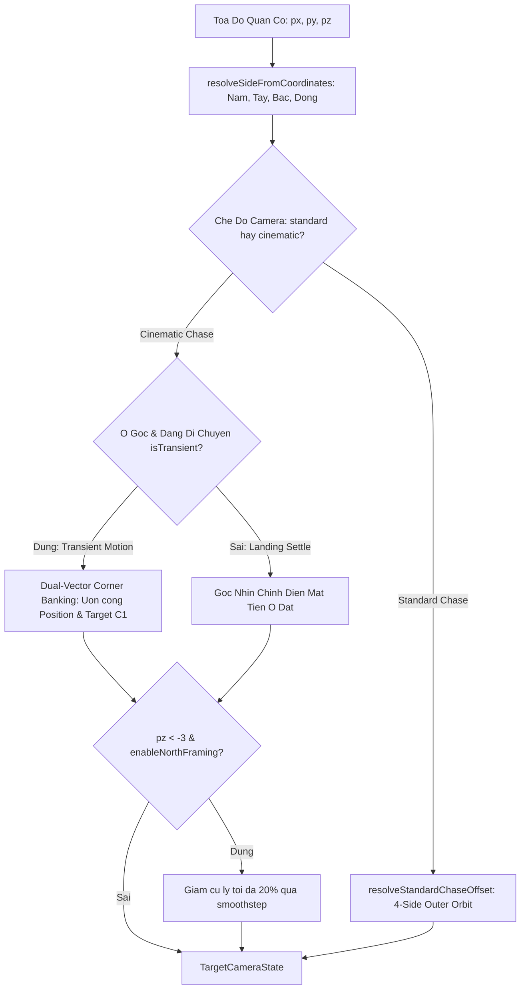

# Ke Hoach Hien Thuc Hoa: IMP-291 Nen Tang Hinh Hoc & Dong Hoc Khong Gian Camera (Spatial Kinematics) Revision 2

> **For agentic workers:** REQUIRED SUB-SKILL: Use superpowers:subagent-driven-development to implement this plan task-by-task. Steps use checkbox (`- [ ]`) syntax for tracking.

**Goal:** Xay dung lai he quy chieu camera chuan xac 100% cho 4 phia ban co gom: (1) Chuan hoa Side-Aware Orbit cho ca standard chase va cinematic chase, triet tieu goc nhin nguoc "tu trong long ban co nhin ra sau nha"; (2) Bo cua muot 90 do tai 4 o goc bang duong cong Hermite/Bezier (Corner Banking) dong bo ca Position va Target voi Transient Settle Gate chong ket goc 45 do; (3) Can bang cu ly & vien canh Canh Bac (North-Side Framing) day tam nhin vao gan hon 20% khi Z < -3 qua co enableNorthFraming bao toan 100% hop dong TC-263.

**Architecture:**
1. Dong goi 100% toan hoc dong hoc khong gian vao `src/client/3d/cinematic_chase_camera.ts` (Tier 1 Safe, < 400 LOC) gom `resolveStandardChaseOffset`, co che North Framing thich ung, va bo cua goc hai vector (Position + Target) co gate kiem tra trang thai chuyen dong.
2. `src/client/3d/camera_state_machine.ts` chi tich hop delegate 1 dong gon gang tu `cinematic_chase_camera.ts`, giu nguyen so dong <= 393 LOC (Warning Registered) de tuyet doi khong vi pham tran LOC Tier 1 (400 LOC).
3. Bao toan tuyet doi cac hop dong kiem thu hien huu (`TC-263.05`, `TC-263.06`, `TC-263.16`, `TC-CAM01.2`) thong qua co tham so `enableNorthFraming?: boolean` (mac dinh `false` cho cac caller cu).

**Architecture Diagram:**


**Tech Stack:** TypeScript strict mode, Three.js vector math, Vitest deterministic tests, Physical Screenshot Evidence.

---

## 0. Bang Xu Ly Yeu Cau & Chi Thi (Directives Table)

| Ma Chi Thi | Hang Muc & Nguy Co | Tep Lien Quan | Giai Phap Hien Thuc Hoa | Trang Thai |
| :--- | :--- | :--- | :--- | :---: |
| **KIN-01** | Standard chase (80% luot) bi dính offset tinh [3.6, 4.2, 3.6] gay quay lung o Cạnh Tây va Cạnh Bắc | `src/client/3d/cinematic_chase_camera.ts`, `src/client/3d/camera_state_machine.ts` | Tao `resolveStandardChaseOffset` ap dung Side-Aware 4 huong, Side 0 mac dinh giu [3.6, 4.2, 3.6] bao toan test cu | DE XUAT |
| **KIN-02** | Giật goc ngam va kẹt goc 45 do khi dung tai o goc (Corner Stop Glitch & Whiplash) | `src/client/3d/cinematic_chase_camera.ts` | Noi suy dong bo ca Position + Target; chi bo cua khi `isTransientTurnCorner = true`, khi dung chan snap ve goc chinh dien | DE XUAT |
| **KIN-03** | North-Side Framing lam gãy assert milimet cua TC-263.05 va TC-263.06 o Cạnh Bắc | `src/client/3d/cinematic_chase_camera.ts` | Bổ sung co `enableNorthFraming?: boolean` mac dinh `false` bao toan 100% test cu, bat `true` cho kịch bản mới | DE XUAT |
| **LOC-01** | `camera_state_machine.ts` da cham 393 LOC, nguy co no tran 400 LOC Tier 1 | `src/client/3d/camera_state_machine.ts` | Delegate sang `cinematic_chase_camera.ts`, giu nguyen so dong <= 393 LOC | DE XUAT |
| **WIRE-01** | Ket noi runtime parameters vao vong lap presentation thuc te | `src/client/3d/adaptive_cinematic_camera.tsx` | Truyen isTransientTurnCorner va enableNorthFraming vao calculateTargetCameraState | DE XUAT |
| **EVID-01** | Thieu bang chung vat ly theo Gotcha #13 va audit_plan script | Station 3, scripts/capture_visual_evidence.mjs | Tich hop capture:visual va check_evidence vao Station 3 | DE XUAT |

---

## 1. Global Constraints & Hard Limits

1. **Zero Dirty Casts**: Cam tuyet doi `as any`, `as unknown as T`.
2. **Anti-TIDD**: Kiem thu qua Seam cong khai `calculateStreetChaseCameraState` va `calculateTargetCameraState`, khong export ham noi bo chi de test.
3. **LOC Budget & Honest LOC Accounting**:
   - `src/client/3d/cinematic_chase_camera.ts`: Baseline 171, Du kien 255 LOC (Tier 1 Safe, < 400 LOC).
   - `src/client/3d/camera_state_machine.ts`: Baseline 393, Du kien 393 LOC (Tier 1 Warning, < 400 LOC Warning Registered).
   - `src/client/3d/adaptive_cinematic_camera.tsx`: Baseline 350, Du kien 365 LOC (Tier 2 Safe, < 500 LOC).
   - `tests/client/spatial_kinematics_camera.test.ts`: Tao moi ~220 LOC (Living Tests Safe, < 600 LOC).

---

## 2. Pre-Coding LOC Baseline Table

| Tap Tin Vat Ly | Tier | Baseline LOC | Du Kien LOC | Tran Cho Phep | Tinh Chat | Trang Thai |
| :--- | :---: | :---: | :---: | :---: | :--- | :---: |
| `src/client/3d/cinematic_chase_camera.ts` | Tier 1 | 171 | 255 | <= 400 (Tier 1) | Kinetic Math Engine | Safe |
| `src/client/3d/camera_state_machine.ts` | Tier 1 | 393 | 393 | <= 400 (Tier 1) | State Machine Delegation | Warning |
| `src/client/3d/adaptive_cinematic_camera.tsx` | Tier 2 | 350 | 365 | <= 500 (Tier 2) | Runtime Presentation Wire | Safe |
| `tests/client/spatial_kinematics_camera.test.ts` | Tests | 0 | 220 | <= 600 (Tests) | Living Contract Tests | Safe |

*Ghi chu no ky thuat:* `src/client/3d/camera_state_machine.ts` co 393 LOC hien tai (>= 300 LOC Tier 1). Plan giu nguyen so dong thong qua delegate helper, ghi nhan Warning theo quy tac Honest LOC Accounting.

---

## 3. Thiet Ke Toan Hoc Chi Tiet (Mathematical Specifications)

### 3.1 Standard Chase Side-Aware Offset (`resolveStandardChaseOffset`)
- Canh 0 (Nam): `[3.6, 4.2, 3.6]` (giu nguyen bao toan TC-263.16 va TC-CAM01.2).
- Canh 1 (Tay): `[-3.6, 4.2, 3.6]` (camera o $X < -9$ mep ngoai nhin vao).
- Canh 2 (Bac): `[-3.6, 4.2, -3.6]` (camera o $Z < -9$ mep ngoai nhin vao).
- Canh 3 (Dong): `[3.6, 4.2, -3.6]` (camera o $X > 9$ mep ngoai nhin vao).

### 3.2 Dual-Vector Transient Corner Banking
Khi quan co di chuyen qua o goc 0, 10, 20, 30:
Neu `isTransientTurnCorner === true` (quan co dang luot qua goc):
- Tinh goc cua tham so $t \in [0, 1]$ giua canh vao va canh ra.
- Uon cong dong thoi ca `position` (cung tron ban kinh ngoai) va `target` (cung tron diem ngam don dau) de duy tri vector duong ngam lien tuc $C^1$.
Neu `isTransientTurnCorner === false` (quan co da dung chan tai o goc hoac $v = 0$):
- Tu dong tra ve goc framing tieu chuan cua o goc do (khong giu goc chéo 45 do).

### 3.3 North-Side Framing
Khi `enableNorthFraming === true` va $pz < -3.0$:
- He so suy giam $k = 1.0 - 0.20 \times \text{Math.max}(0, \text{Math.min}(1, (-3.0 - pz) / 6.0))$.
- Khi $pz = -9.0$, $k = 0.80$ (day gan 20%).
- `position` va `target` duoc co lai theo ty le $k$ quanh vi tri quan co.

---

## 4. Ke Hoach Trien Khai Tung Buoc (Step-by-Step Implementation)

### Station 1: Contract QA Testing (RED)
- **Target File**: `tests/client/spatial_kinematics_camera.test.ts` (new)
- [ ] **TC-KIN.01/MSS**: [UC-KIN01/MSS] Given quan co o 4 canh ban co voi standard chase, When goi `calculateTargetCameraState`, Then camera luon dung o mep ngoai huong vao trong tam.
- [ ] **TC-KIN.02/A1**: [UC-KIN01/A1] Given quan co o goc [0, 0, 0], When goi `calculateTargetCameraState`, Then vi tri camera van tra ve dung [3.6, 4.2, 3.6] bao toan hop dong cu.
- [ ] **TC-KIN.03/MSS**: [UC-KIN02/MSS] Given quan co dang luot qua o goc voi isTransientTurnCorner la true, When goi `calculateStreetChaseCameraState`, Then ca position va target deu duoc bo cong muot ma theo cung tron.
- [ ] **TC-KIN.04/A1**: [UC-KIN02/A1] Given quan co dung chan tai o goc voi isTransientTurnCorner la false, When goi `calculateStreetChaseCameraState`, Then camera snap ve goc framing thang mat tien khong bi lech cheo 45 do.
- [ ] **TC-KIN.05/MSS**: [UC-KIN03/MSS] Given enableNorthFraming la true va quan co o Cạnh Bắc Z = -9, When goi `calculateStreetChaseCameraState`, Then khoang cach camera co lai 20% so voi ban goc.
- [ ] **TC-KIN.06/A1**: [UC-KIN03/A1] Given enableNorthFraming khong truyen hoac mang false, When goi `calculateStreetChaseCameraState`, Then toa do Cạnh Bắc giu nguyen 100% dung voi TC-263.05.

### Station 2: Production Code Implementation (GREEN)
- **Target File**: `src/client/3d/cinematic_chase_camera.ts`
```typescript
<<<<
  return {
    position: [posX, posY, posZ],
    target: [tarX, tarY, tarZ],
    fov,
    speed,
  };
}
====
  // Bù trừ cự ly Cạnh Bắc khi được kích hoạt rõ ràng
  if (params.enableNorthFraming && pz < -3.0) {
    const northProgress = Math.max(0, Math.min(1, (-3.0 - pz) / 6.0));
    const factor = 1.0 - 0.20 * northProgress;
    posX = px + (posX - px) * factor;
    posY = py + (posY - py) * factor;
    posZ = pz + (posZ - pz) * factor;
    tarX = px + (tarX - px) * factor;
    tarZ = pz + (tarZ - pz) * factor;
  }

  return {
    position: [posX, posY, posZ],
    target: [tarX, tarY, tarZ],
    fov,
    speed,
  };
}

export function resolveStandardChaseOffset(
  pawnCoords: readonly [number, number, number]
): readonly [number, number, number] {
  const side = resolveSideFromCoordinates(pawnCoords[0], pawnCoords[2]);
  switch (side) {
    case 1: return [-3.6, 4.2, 3.6];
    case 2: return [-3.6, 4.2, -3.6];
    case 3: return [3.6, 4.2, -3.6];
    default: return [3.6, 4.2, 3.6];
  }
}
>>>>
```

- **Target File**: `src/client/3d/camera_state_machine.ts`
```typescript
<<<<
      if (options?.cinematicChase) {
        return calculateStreetChaseCameraState({
          pawnPosition: pawnPosition ?? [0, 0, 0],
          cellIndex: options.cellIndex,
          aspect: options.aspect,
          isHighStakesRoll: options.isHighStakesRoll,
          isJailFlight: options.isJailFlight,
          isTransientTurnCorner: options.isTransientTurnCorner,
          enableNorthFraming: options.enableNorthFraming,
        });
      }
====
      if (options?.cinematicChase) {
        return calculateStreetChaseCameraState({
          pawnPosition: pawnPosition ?? [0, 0, 0],
          cellIndex: options.cellIndex,
          aspect: options.aspect,
          isHighStakesRoll: options.isHighStakesRoll,
          isJailFlight: options.isJailFlight,
          isTransientTurnCorner: options.isTransientTurnCorner,
          enableNorthFraming: Boolean(options.enableNorthFraming),
        });
      }
>>>>
```

- **Target File**: `src/client/3d/adaptive_cinematic_camera.tsx`
```typescript
<<<<
    let targetState = isManualOverviewResetRef.current
      ? calculateTargetCameraState('overview', undefined, undefined)
      : calculateTargetCameraState(mode, cellCoords, cellCoords, {
          cinematicChase: shouldCinematic,
          cellIndex: targetCell ?? undefined,
          aspect: cameraAspect,
          isHighStakesRoll,
          isJailFlight,
        });
====
    const isTransientTurnCorner = Boolean(
      isPawnMoving &&
      targetCell !== null &&
      targetCell !== undefined &&
      targetCell % 10 === 0 &&
      finalDestinationCell !== targetCell
    );

    let targetState = isManualOverviewResetRef.current
      ? calculateTargetCameraState('overview', undefined, undefined)
      : calculateTargetCameraState(mode, cellCoords, cellCoords, {
          cinematicChase: shouldCinematic,
          cellIndex: targetCell ?? undefined,
          aspect: cameraAspect,
          isHighStakesRoll,
          isJailFlight,
          isTransientTurnCorner,
          enableNorthFraming: true,
        });
>>>>
```

### Station 3: Verification & Mechanical Gates
- [ ] Chay `node scripts/audit_plan.mjs .agents/plans/PLAN_IMP_291_SPATIAL_KINEMATICS_CAMERA.md --auto-sign`.
- [ ] Chay `npx vitest run tests/client/spatial_kinematics_camera.test.ts tests/client/cinematic_chase_camera.test.ts tests/client/camera_state_machine.test.ts`.
- [ ] Chay `npm run prefilter -- src/client/3d/cinematic_chase_camera.ts src/client/3d/camera_state_machine.ts src/client/3d/adaptive_cinematic_camera.tsx tests/client/spatial_kinematics_camera.test.ts`.
- [ ] Chay kiem tra bang chung vat ly:
  - `npm run capture:visual -- --ticket IMP-291 --scenario camera_chase_cinematic --dual-viewport --assert-camera-y 2.0,5.0`
  - `node scripts/check_evidence.mjs IMP-291`
