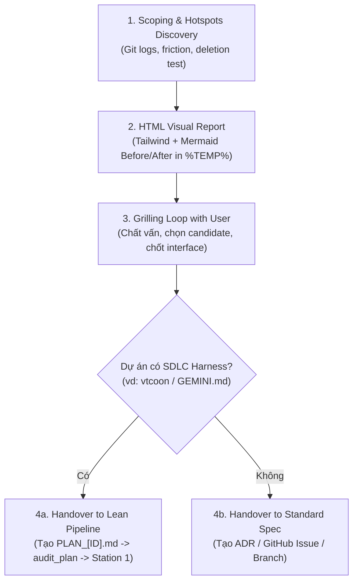

# Improve Codebase Architecture

Surface architectural friction across the codebase and propose **deepening opportunities**: high-leverage refactors that turn shallow, fragmented modules into deep ones. The primary goals are maintainability, testability, locality, and AI-navigability.

---

## 1. Role in the Engineering Ecosystem & SDLC Boundary

> [!IMPORTANT]
> **Vị trí trong quy trình SDLC**: Skill này là **Công cụ Thăm dò & Chẩn đoán Chiến lược (Pre-SDLC / On-Demand Discovery)**.
> - **KHÔNG** tự ý kích hoạt ở giữa vòng lặp của một ticket đang chạy (Station 1 RED $\rightarrow$ Station 2 GREEN $\rightarrow$ Station 3 $\rightarrow$ Station 4).
> - **CHỈ chạy thủ công (Manual / On-Demand)** khi:
>   1. Người dùng yêu cầu rà soát kiến trúc ("quét kiến trúc", "cải thiện cấu trúc", "tìm module nông").
>   2. Chuẩn bị khởi động một Epic lớn hoặc đợt tái cấu trúc diện rộng (Tech Debt Paydown).
>   3. Đánh giá lại độ sâu của các module sau nhiều vòng thêm tính năng mới.

---

## 2. Shared Vocabulary & Principles

Skill này bắt buộc dựa trên hệ từ vựng và nguyên lý thiết kế chuẩn từ skill **`codebase-design`** (và [`docs/domain/gotchas/deep_modules.md`](file:///c:/Users/HP/Documents/GitHub/vtcoon/docs/domain/gotchas/deep_modules.md) nếu có):

- **Module**: Bất kỳ thực thể nào có interface và implementation (hàm, class, package, subsystem). Cấm gọi chung chung là "component", "service", "unit".
- **Interface**: Toàn bộ bề mặt caller cần biết để sử dụng đúng: chữ ký hàm, invariants, thứ tự gọi, error modes, cấu hình.
- **Seam**: Vị trí giao diện tồn tại nơi hành vi có thể thay đổi mà không phải chỉnh sửa tại chỗ. Cấm gọi là "boundary".
- **Adapter**: Vật cụ thể thỏa mãn interface tại seam. *Quy tắc: 1 adapter = seam giả định/thừa; 2 adapters = seam thực thụ*.
- **Depth**: Đòn bẩy (*leverage*) tại interface: tỷ lệ giữa hành vi ẩn giấu bên trong so với độ phức tạp của interface phải học.
- **Locality**: Thay đổi, lỗi và kiến thức gom về 1 chỗ duy nhất thay vì rải rác khắp caller.
- **The Deletion Test**: Tưởng tượng xóa module đó đi. Nếu độ phức tạp biến mất $\rightarrow$ đó là module nông (pass-through). Nếu độ phức tạp bùng phát và phân tán ra $N$ nơi gọi $\rightarrow$ module đó thực sự có giá trị.

---

## 3. Quy Trình Vận Hành 4 Bước (Execution Workflow)

### Bước 1: Khảo sát & Nhận diện Điểm nóng (Scoping & Hotspot Discovery)

- **YAGNI & Hotspots First**: Đào sâu module mang lại lợi nhuận cao nhất cho những phần code thường xuyên biến động.
  - Nếu người dùng chỉ định một module/subsystem cụ thể: Tập trung quét ngay khu vực đó.
  - Nếu quét toàn diện repo: Kiểm tra lịch sử commit (`git log --oneline -n 100`) để định vị các file "điểm nóng" (hotspots) bị sửa đổi liên tục.
- **Tra cứu Tri thức Miền (Domain Knowledge)**:
  - Nếu dự án có [`docs/domain/gotchas/`](file:///c:/Users/HP/Documents/GitHub/vtcoon/docs/domain/gotchas/): Đọc ngay các gotcha liên quan trước khi quét (đặc biệt là `deep_modules.md`, `fsm_lifecycle.md`, `economy_treasury.md`, `ui_ergonomics.md`).
  - Nếu dự án có `GLOSSARY.md` hoặc `docs/adr/`: Đọc để nắm vững thuật ngữ nghiệp vụ và các quyết định kiến trúc đã chốt.
- **Phát hiện Mùi Mã Nguồn (Architectural Smells)**:
  - Nơi nào hiểu 1 logic nghiệp vụ phải nhảy qua 4-5 file wrapper mỏng dính?
  - Nơi nào interface to gần bằng implementation (shallow)?
  - Nơi nào trích xuất hàm pure chỉ để dễ viết unit test, nhưng bug thật sự nằm ở cách lắp ghép các hàm đó (mất tính locality)?
  - Nơi nào rò rỉ seam (ví dụ: UI component trực tiếp can thiệp hoặc tính toán lại logic domain)?
  - Nơi nào vi phạm trần LOC của dự án (ví dụ: Tier 1 $> 400$ LOC, Tier 2 $> 500$ LOC trong `GEMINI.md`)?

### Bước 2: Xuất Báo Cáo Trực Quan Dạng HTML (Visual HTML Report)

- **Vị trí lưu trữ**: Ghi file HTML độc lập vào thư mục tạm của hệ điều hành để không làm ô nhiễm git tree:
  - Windows: `%TEMP%\architecture-review-<timestamp>.html`
  - Linux/macOS: `$TMPDIR/architecture-review-<timestamp>.html` (hoặc `/tmp/`)
- **Ngôn ngữ hiển thị**: Tuân thủ chính sách ngôn ngữ của dự án. Với dự án quy định tiếng Việt (`GEMINI.md`), toàn bộ tiêu đề, mô tả điểm nghẽn (Problem), giải pháp (Solution) và lợi ích (Wins) hiển thị bằng **tiếng Việt** (giữ nguyên các danh từ kỹ thuật chuẩn: `module`, `interface`, `seam`, `adapter`, `depth`, `locality`, `leverage`).
- **Nội dung thẻ Candidate Card**:
  - Tên đề xuất và danh sách file liên quan.
  - Sơ đồ **Before vs. After** trực quan (sử dụng Mermaid flowchart/sequence hoặc CSS/SVG tùy biến theo mẫu tại [`HTML-REPORT.md`](file:///c:/Users/HP/Documents/GitHub/vtcoon/.agents/skills/improve-codebase-architecture/HTML-REPORT.md)).
  - Badge độ tự tin: `Strong` (khuyến nghị cao), `Worth exploring` (đáng cân nhắc), `Speculative` (thử nghiệm).
  - Badge phân loại phụ thuộc: `in-process`, `local-substitutable`, `ports & adapters`, `mock`.
  - Mục **Top Recommendation**: Đề xuất ứng viên số 1 nên ưu tiên xử lý trước kèm lý do.
- **Mở trình duyệt tự động**:
  - Windows: `start <path>`
  - macOS: `open <path>`
  - Linux: `xdg-open <path>`
  - Thông báo đường dẫn tuyệt đối cho người dùng trong phản hồi.

### Bước 3: Vòng lặp Phản biện & Thẩm vấn (Grilling Loop)

Sau khi mở báo cáo HTML, **KHÔNG tự ý sửa code ngay**. Hỏi người dùng:
> *"Bạn muốn đi sâu thảo luận và triển khai ứng viên nào trong báo cáo trên?"*

Khi người dùng chọn một ứng viên:
1. Thực hiện grilling loop: Xác định rõ ràng các ràng buộc, phân loại phụ thuộc, interface dự kiến sẽ che giấu những gì, và những test nào sẽ tồn tại sau khi refactor.
2. Nếu cần khám phá nhiều phương án thiết kế interface khác nhau, kích hoạt quy trình **"Design It Twice"** từ skill `codebase-design`.
3. Nếu phát sinh thuật ngữ mới $\rightarrow$ cập nhật vào `GLOSSARY.md` hoặc domain doc.

### Bước 4: Ráp nối mượt mà vào Quy Trình SDLC (Seamless SDLC Handover)

Đây là điểm mấu chốt để skill ăn khớp hoàn hảo với hệ thống quản trị dự án:

#### Trường hợp A: Dự án có Hệ Thống Harness / SDLC (như `vtcoon`)
- **Sinh Micro-Slice Roadmap hoặc Đề xuất Ticket**:
  - Gán mã ticket chuẩn (ví dụ: `IMP-[ID]-[slug]`).
  - Soạn thảo Lean Plan tại `.agents/plans/PLAN_[ID].md` ($\le 200$ dòng, không code-dump, xác định rõ Causal Root Scope và tuân thủ trần LOC).
- **Chạy Mechanical Plan Audit**:
  - Chạy `node scripts/audit_plan.mjs .agents/plans/PLAN_[ID].md --auto-sign`.
- **Kích hoạt Adversarial Gate** (nếu chạm FSM, State, hoặc Kinh tế).
- **Chờ Human Gate**: Người dùng duyệt ("đồng ý").
- **Chuyển giao cho 4 Trạm SDLC**:
  - Station 1 (RED): `qa-tester` viết contract test (Adversarial Inversion).
  - Station 2 (GREEN): `implementer` viết minimal code.
  - Station 3: Chạy `npm run prefilter` và architecture review.
  - Station 4: Chạy `npm run sentinel` và sinh báo cáo nghiệm thu bằng `npm run report -- [ID]`.

#### Trường hợp B: Dự án Tiêu Chuẩn (Generic Project không có Harness)
- Ghi nhận quyết định kiến trúc vào `docs/adr/ADR-xxxx.md`.
- Tạo GitHub Issue hoặc branch mới để thực hiện TDD theo quy trình thông thường.

---

## 4. Bảng Tra Cứu Xử Lý Phụ Thuộc (Dependency Treatment)

Khi đề xuất giải pháp đào sâu trong Candidate Card, luôn phân loại theo 4 nhóm sau:

| Nhóm Phụ Thuộc | Bản chất | Chiến lược Đào Sâu (Deepening Strategy) | Chiến lược Kiểm Thử (Testing Strategy) |
| :--- | :--- | :--- | :--- |
| **1. In-process** | Tính toán thuần túy, in-memory, 0 I/O | Hợp nhất thẳng các module nông vào module sâu. Không cần adapter. | Test trực tiếp qua interface mới. |
| **2. Local-substitutable** | Database/Storage có bản chạy local (PGLite, SQLite in-memory, mock FS) | Module sâu nuốt trọn logic truy vấn. Seam nằm nội bộ. | Test với local stand-in chạy trực tiếp trong test runner. |
| **3. Remote but owned** | Microservice nội bộ, API backend cùng đội ngũ | Định nghĩa 1 **Port** tại seam. Production dùng HTTP/gRPC adapter, test dùng In-Memory adapter. | Test module sâu với In-Memory adapter; 1 bộ contract test riêng cho Network adapter. |
| **4. True external** | Dịch vụ bên thứ ba không kiểm soát (Stripe, Twilio, OAuth) | Inject external port tại seam. | Test cung cấp mock adapter mô phỏng hành vi bên ngoài. |
