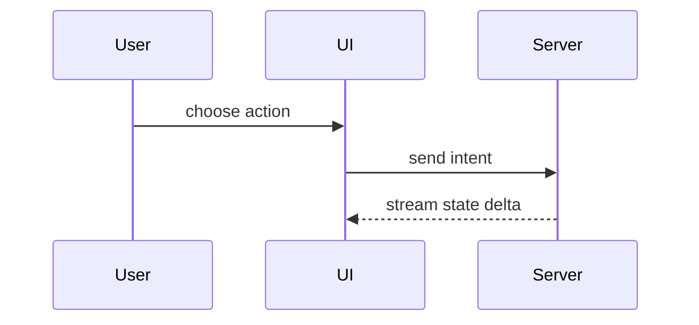

Use this template for writing the PR body or ticket summary:

```markdown
## Summary

<diagram, diff-sketch, or tree>

## Evidence

- **Before:** <screenshot/output/failing test run>
  **After:** <screenshot/output/passing test run>

## Merge Danger

**Door:** <one-way or two-way>

<optional: description>

**Blast Radius:** <one-word or brief description>

<optional: potential ramifications of merge>
```

## Sections

Skip all preambles and keep prose brief. Use the project domain language from `docs/domain/gotchas/` and glossary.

### Summary

Pick the smallest view that makes the key architectural change clear.

- Show logic or an algorithm as pseudocode:

```text
on(save)
  if content is unchanged
    return cached result
  write new content
  return fresh result
```

- Show runtime control flow as a call tree:

```text
submitForm
  createSession
    persistPrompt
    launchAgent
  navigateToSession
```

- Show UI structure as a component tree, including state and module boundaries that matter:

```text
<SessionPage> (src/client/ui/routes/session.tsx)
  useSessionEvents()
  <SessionToolbar>
    <RunSkillButton> (src/client/ui/components)
```

- Show file responsibility or a broad refactor as a shallow file tree:

```text
src/
├── commands/       # parses user actions
├── sessions/       # owns session state
└── transport/      # sends API requests
```

- Show component interaction, control flow, or data flow with Mermaid:



- Use `diff` when the point is what changes and the surrounding shape already exists. Match the diff shape to the topic.

For a component change:

```diff
 <SessionPage>
   useSessionEvents()
   <SessionToolbar>
+    <RunSkillButton />
   <SessionTimeline>
+    <SkillResultCard />
```

For a file-layout change:

```diff
 src/
 ├── commands/
+│   └── show-me.ts       # expands command
 ├── sessions/
-└── transport.ts
+└── transport/
+    ├── client.ts
+    └── stream.ts
```

For a call-tree or call-stack change:

```diff
 submitForm
   createSession
     persistPrompt
+    expandSkillMention
     launchAgent
-  navigateToSession
+  navigateToSession
+    subscribeToEvents
```

For a state or control-flow change:

```diff
 on(save)
-  write content
+  if content is unchanged
+    return cached result
+  write new content
+  invalidate cache
```

- Show the whole block when most of it is new, when omitted context would hide ownership or order, or when the user needs a copyable target shape:

```ts
function expandSkill(command: string): string {
  const skillName = command.slice(1);
  return `use the ${skillName} skill`;
}
```

#### Guidance

Place each visual next to the short text it supports. Keep only the calls, files, props, states, and boundaries needed to answer the current question or resolve the current discussion point.

You may use one of these, you may use several, it is unlikely you will use all of them. Use your judgement and don't overwhelm the user.

### Evidence

Concrete physical evidence that the change works. Show a before and after.

- **S-Tier:** Visual evidence (Dual-viewport desktop & mobile screenshots for UI changes).
- **A-Tier:** Execution-based evidence (Vitest exit status 0, passing contract tests, terminal outputs).

### Merge Danger

Describe whether it's a one-way or two-way door:
- **Two-Way Door:** Pure visual/CSS, spacing, isolated helper logic, or fully encapsulated internal refactor with 100% parity. Reversible autonomously.
- **One-Way Door:** DB schemas, wire protocols, breaking public contracts, auth/security changes, or irreversible state mutations. Mandates human review sign-off.

The blast radius is the potential impact or scope of the changes. Consider all possibilities: layout shift, breakages for downstream consumers, mobile responsiveness, socket latency.
