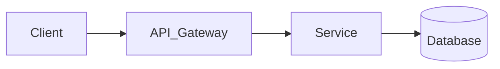

# CẨM NANG THỰC CHIẾN AI-NATIVE SDLC TRÊN GOOGLE ANTIGRAVITY 2.0
> **Phiên bản**: 2026 Enterprise Edition (Harness Engineering, Lean Memory, Superhuman Terminal Engine, Context Offloading & Universal Visual UI/UX Governance)  
> **Kiến trúc**: The Triad Stack (`mattpocock_skills` + `superpowers-antigravity` + `backup` + `google/skills`)  
> **Tiêu chuẩn khoa học**: Đúc kết từ OpenAI Harness Engineering, Nash (Least New Structure & 6 Slop Flags), Kasong (Closed-Loop Engineering), Anshu Chimala (Apple Aesthetic & Anti-AI-Tells), Vercel design.md (Finite Token Governance), Philipp Schmid (Superhuman Bash & Context Offloading), Matt Pocock (Reduce Slop), Pragmatic Anti-Dogma, Richard Seroter (JIT Skills), arXiv:2608.20195, Sharon Y. Barr 5-Gate Testing, Kartik Mehta AutoQA, và Bitter Lesson in Agent Harness.

---

## MỤC LỤC
1. [TRIẾT LÝ: Harness Engineering, Terminal Engine & Universal Visual UI/UX Governance](#1-triết-lý-harness-engineering-terminal-engine--universal-visual-uiux-governance)
2. [KIẾN TRÚC BỘ NHỚ PHÂN CẤP 3 TẦNG (Lean Indexed Memory)](#2-kiến-trúc-bộ-nhớ-phân-cấp-3-tầng-lean-indexed-memory)
3. [CƠ CHẾ KỸ NĂNG HẠT GIỐNG (Seed Skill & JIT Dispatcher)](#3-cơ-chế-kỹ-năng-hạt-giống-seed-skill--jit-dispatcher)
4. [SƠ ĐỒ DÒNG CHẢY KẾT HỢP CÁC KỸ NĂNG (The Artifact Pipeline)](#4-sơ-đồ-dòng-chảy-kết-hợp-các-kỹ-năng-the-artifact-pipeline)
5. [HỆ THỐNG TRUY XUẤT NGUỒN GỐC ARTIFACTS (3-Bucket Taxonomy, 4D ADR & Universal design.md)](#5-hệ-thống-truy-xuất-nguồn-gốc-artifacts-3-bucket-taxonomy-4d-adr--universal-designmd)
6. [5 NGUYÊN TẮC KIỂM THỬ ĐỈNH CAO (Testing Integrity)](#6-5-nguyên-tắc-kiểm-thử-đỉnh-cao-testing-integrity)
7. [GIAI ĐOẠN 1: Khởi Tạo Dự Án & Cài Đặt Cấp Project (Setup 1 Lần)](#giai-đoạn-1-khởi-tạo-dự-án--cài-đặt-cấp-project-setup-1-lần)
8. [GIAI ĐOẠN 2: Trọn Bộ 4 Subagents Native AG 2.0 Sẵn Sàng Sử Dụng](#giai-đoạn-2-trọn-bộ-4-subagents-native-ag-20-sẵn-sàng-sử-dụng)
9. [KỊCH BẢN THỰC CHIẾN: Greenfield, Feature Slices, Bug/CR (Sign-off Test) & Brownfield](#9-kịch-bản-thực-chiến-từ-số-0-greenfield-đến-từng-tính-năng-feature)
10. [GIAI ĐOẠN 8: Nén Bộ Nhớ & Chuyển Phiên (Session Handoff & Visual Mining)](#giai-đoạn-8-nén-bộ-nhớ--chuyển-phiên-session-handoff--visual-mining)
11. [BẢNG TRA CỨU CÂU LỆNH NHANH (Cheat Sheet & Slash Commands)](#bảng-tra-cứu-câu-lệnh-nhanh-cheat-sheet--slash-commands)
12. [QUY TRÌNH TUẦN TỰ TOÀN DIỆN TỪ A-Z (The Master SDLC Workflow)](#12-quy-trình-tuần-tự-toàn-diện-từ-a-z-the-master-sdlc-workflow)

---

## 1. TRIẾT LÝ: Harness Engineering, Terminal Engine & Universal Visual UI/UX Governance

```text
[QUY TẮC BẢO VỆ TUYỆT ĐỐI & CÂN BẰNG THỰC TẾ]
├── 1. AI TUYỆT ĐỐI CẤM TỰ CHẠY GIT COMMIT / PUSH:
│      AI chỉ thi công trong nhánh cô lập (Workspace: "branch"), chạy test và xuất gói nghiệm thu.
│      Con người tự tay chạy `git diff` kiểm tra và tự gõ `git commit` ("If nobody stops me, I'm weather").
│
├── 2. NGUYÊN TẮC TERMINAL/BASH SIÊU VIỆT & NÉN NGỮ CẢNH (PHILIPP SCHMID):
│      "Bài học Đắng cay (The Bitter Lesson): LỚP THỰC THI TERMINAL TỔNG QUÁT ĐÁNH BẠI MỌI CÔNG CỤ THỦ CÔNG."
│      • Sửa file Nguyên tử (Atomic Multi-file Edit): Kiểm tra đếm số lần xuất hiện trước khi ghi đè, tránh sửa dở dang.
│      • Nén Ngữ cảnh Dữ liệu Lớn (Context Offloading): Không đổ 20,000 dòng log/diff lớn vào prompt.
│        Chạy script Python/SQLite tại máy local để tổng hợp và chỉ nạp bản tóm tắt <10 dòng vào ngữ cảnh.
│      • Cô lập tuyệt đối bằng Git Worktree: Dùng `Workspace: "branch"` để Subagents thi công không làm bẩn Workspace gốc.
│
├── 3. QUẢN TRỊ THỊ GIÁC ĐA DẠNG & GU THẨM MỸ ĐỈNH CAO (APPLE AESTHETICS + VERCEL TOKEN GOVERNANCE):
│      `design.md` LÀ BỘ HIẾN PHÁP THỊ GIÁC CHO MỌI ĐẦU RA MẮT THẤY ĐƯỢC (Web, Mobile, PDF, Chart, CLI):
│      • Chọn rõ Trường Phái Thẩm Mỹ (Aesthetic Archetype): Swiss Editorial, Tactile Warm Minimal, Data Terminal...
│      • Danh sách Diệt Dấu Vết AI (Anti-AI-Tells Checklist): CẤM gradient tím-xanh rập khuôn, CẤM thẻ nổi 3 lớp bóng mờ,
│        CẤM icon trang trí thừa, CẤM câu chữ sáo rỗng vô hồn ("Streamline your workflow effortlessly").
│      • Cắt gọt Triệt để (Aggressive Subtraction): Xóa bỏ mọi thành phần trang trí không phục vụ tương tác trực tiếp.
│      • Phân tách Kiến trúc Token (Vercel): Prompt chỉ đọc Bảng Token Schema mỏng (<40 dòng). Toàn bộ CSS/Theme nặng
│        nằm ở Môi trường Thực thi Local (Browser/Puppeteer PDF/Flutter Engine). AI CẤM tự phát minh style ngẫu nhiên.
│      • Phân định Trách nhiệm (Division of Labor): `design.md` giữ Theme & Bản sắc riêng của dự án; Design Skills giữ
│        Nguyên lý Tương tác (Interaction Principles). Gọi Skill theo yêu cầu (On-Demand), cấm dùng Skill áp đặt
│        template cứng nhắc khiến mọi dự án nhìn giống hệt nhau (chống AI Sameness).
│
├── 4. VÒNG LẶP KỸ THUẬT HỆ THỐNG KHÉP KÍN (KASONG CLOSED-LOOP ENGINEERING):
│      • Căn chỉnh Mục tiêu (Goal Alignment): Dùng Socratic grilling loại bỏ 100% giả định ngầm, lập SSOT Spec.
│      • Thám hiểm Đường đi (Path Exploration): Đánh giá ma trận 4 chiều (Phức tạp, Bảo trì, Chi phí, Khả năng đảo ngược).
│      • Giữ vững Đường ray (Staying on Track): Phân tích tác động thay đổi (Change Impact Analysis) cho Brownfield,
│        triệt phá bẫy False Green bằng API Contract + E2E User Journey test thực tế.
│
├── 5. NGUYÊN TẮC GIẢM CODE SLOP: TỐI THIỂU HÓA CẤU TRÚC MỚI (LEAST NEW STRUCTURE - NASH):
│      "Đừng tối ưu hóa để có ít dòng code hơn. Hãy tối ưu hóa để đưa vào ÍT CẤU TRÚC MỚI NHẤT mà vẫn thỏa mãn yêu cầu."
│      • Rà soát diff ở Cổng Nghiệm Thu (Acceptance Gate) để xóa tối đa mà không vi phạm hành vi trong Spec.
│      • Quét 6 Cờ Đỏ Slop: Trừu tượng hóa 1 lần (YAGNI), Trùng lặp tính năng, Mở rộng suy đoán, Dependencies thừa,
│        File sửa ngoài quan hệ nhân quả, Comment/Wrapper sinh ra chỉ để bao biện cho sự phức tạp tự đẻ ra.
│      • Đặt Ngân sách Dòng Code linh hoạt (LOC Budget): Max +30 đến +50 LOC per ticket.
│      • Cyclomatic Complexity <= 5 (Nhưng CẤM xé nhỏ hàm <5 dòng gây phân mảnh code).
│      • CHỐNG BẪY CODE GOLF: Cấm viết code gộp dòng khó đọc/tắt mắt chỉ để giảm LOC.
│
├── 6. CƯỠNG CHẾ KIẾN TRÚC TẤT ĐỊNH (DETERMINISTIC ARCHITECTURE ENFORCEMENT - NICK TUNE):
│      "Rào chắn cơ học của Trình biên dịch/Linter luôn đánh bại rào chắn đạo đức trong Markdown."
│      • Kiến trúc không chỉ viết trong Markdown/ADR mà phải được gác cổng bằng Linter/Boundary check của từng ngôn ngữ
│        (TypeScript: eslint-plugin-boundaries, Python: import-linter, Go: internal packages, C#/Java: ArchUnit, Flutter: import_lint).
│      • Nếu AI import vi phạm ranh giới tầng (Domain import DB, UI gọi trực tiếp SQL) ➔ Build/Lint BÁO ĐỎ lập tức trong 0.1s!
│
├── 7. ARTIFACTS BẤT BIẾN & CÀI ĐẶT CÔ LẬP CẤP PROJECT:
│      Mọi file có Timestamp: `[loại]_[tên]_[YYYYMMDD_HHMMSS].md`. Toàn bộ nằm trong `.agents/`.
│
├── 8. 5 NGUYÊN LÝ KỶ NGUYÊN AI & TRACEABILITY MÁY ĐỌC (SIMON MARTINELLI - AIUP 2026):
│      • Nguyên lý 11 (Đặc tả trường tồn hơn mã nguồn): Mã nguồn chỉ là bản xuất xưởng (build artifact).
│        Khi có xung đột giữa code và spec, mặc định coi CODE LÀ SAI.
│      • Nguyên lý 12 (Thứ tự 3 độc giả): Xếp hạng độc giả: Stakeholder ➔ Engineer ➔ AI Agent.
│        Cấm viết mã giả (pseudo-code) cho AI đọc nếu làm mất tính dễ hiểu của nghiệp vụ.
│      • Nguyên lý 13 (Chính xác hành vi quan sát, im lặng về cơ chế): Tuân thủ nghiêm ngặt 3 Vùng
│        (Zone 1: Observable, Zone 2: Domain Entity reference, Zone 3: Banned Mechanism Blocklist).
│      • Nguyên lý 14 (Kiểm thử mang chân lý): Kiểm thử là chốt chặn duy nhất đảm bảo tính an toàn
│        khi tái sinh toàn bộ hệ thống bằng AI.
│      • Nguyên lý 15 (Thay đổi đặc tả trước): Mọi tính năng mới, Change Request (CR), hay Bug
│        đều là một sự thay đổi trên Use Case. Sửa spec trước, sinh code và test sau. CẤM hotfix trực tiếp trên code!
│      • Chuỗi Định danh Theo Epic: FR-XXX ➔ UC-[EPIC]-NNN ➔ A# ➔ BR-[EPIC]-NNN ➔ Code ➔ Test.
│
├── 9. KIẾN TRÚC PHÒNG THỦ 2 LỚP TRONG AG 2.0 (TWO-TIER DEFENSE ARCHITECTURE):
│      • Lớp 1 (Cổng Cơ học Tất định - AG 2.0 Lifecycle Hooks): Chặn lệnh cấm (git commit/push),
│        tự động quét Mechanism Blocklist (JWT, SQL) trong spec, kiểm tra nhãn vết [UC-...] và đếm dòng file.
│        Chạy ngầm bằng script local 0ms, 0 Token, bảo đảm chặn 100% không phụ thuộc trí nhớ LLM.
│      • Lớp 2 (Cổng Thẩm định Nhận thức - Native Subagents): `spec-reviewer` và `code-reviewer`
│        được giải phóng khỏi việc vặt cơ bắp, tập trung 100% vào logic cấp cao (soi Intent nghiệp vụ,
│        kiểm toán 6 cờ đỏ slop, kiểm tra vòng lặp kín, kiểm toán Test State Isolation).
│
├── 10. CƠ CHẾ CHỜ KHÔNG TỐN TOKEN (ZERO-POLLING & ASYNC HARNESS - PRERNA KAKKAR, GOOGLE CLOUD):
│      • CẤM Tuyệt đối In-Loop Polling: Agent cấm chạy vòng lặp ReAct gọi tool kiểm tra trạng thái (`while/sleep/get_operation`)
│        khi chờ tác vụ chạy lâu (Docker build, DB migrate, test suite). Mỗi lần poll nạp lại 100% ngữ cảnh, đốt 5x chi phí và 11x token.
│      • Chờ Phản Ứng (Reactive Wakeup): Tác vụ dài (>10s) phải đưa vào Background Task (`manage_task`). Agent DỪNG LƯỢT ngay lập tức
│        (0 Token trong thời gian chờ). AG 2.0 Harness tự động nạp kết quả và đánh thức Agent khi tiến trình kết thúc.
│      • Rào Chắn Treo Lệnh (Hanging Process Gate): Tự động cưỡng chế hủy (Kill) mọi tiến trình terminal không xuất log sau 60 giây.
│      • Thiết Kế Tool/API Hướng Agent: Khi viết API nội bộ cho Agent gọi, cung cấp webhook/callback hoặc timeout rõ ràng kèm `operation_id`.
│
├── 11. TRẢI NGHIỆM KHÔNG CẦN GHI NHỚ & THÍCH ỨNG LINH HOẠT (ZERO-MEMORIZATION & FLUID ADAPTATION):
│      • Con người là Giám đốc Sản phẩm, Agent là Thư ký Kỹ thuật: Con người tuyệt đối KHÔNG phải nhớ mã ID (`UC-XXX-NNN`),
│        cú pháp lệnh, hay cấu trúc cây thư mục. Toàn bộ ID là công cụ để máy tự truy vết.
│      • Bản Đồ GPS Tự Động: Con người chỉ cần gõ 1 câu duy nhất: "Dự án tới đâu rồi? Tiếp theo làm gì?" (hoặc "Làm tiếp"),
│        Agent tự đọc `_epic_ledger.md` để xác định lát cắt tiếp theo và đề xuất hành động (Con người chỉ cần gõ "OK").
│      • 3 Cơ Chế Xử Lý Khi Đổi Ý:
│        - Micro-Delta Prompt: Nói ý muốn bằng tiếng Việt đời thường ("Bỏ nhập SĐT, chỉ cần Email"), Agent tự tìm Use Case, tự cập nhật Spec ➔ Test ➔ Code.
│        - Spike / Prototype Mode: Kích hoạt `prototype` code nháp trên giao diện khi ý tưởng chưa rõ, sau đó Agent tự trích xuất ngược ra Use Case 3.0.
│        - Kill & Prune: Xóa dứt khoát tính năng khỏi Ledger và codebase khi không còn giá trị sử dụng.
│
└── 12. PHÂN LOẠI RỦI RO (2-BUCKET APPROACH) & CONTRACT-FIRST CODEGEN (ANTI-SLOP 2026):
       • Phân loại rủi ro 2 xô (Risk-Based 2-Bucket Approach):
         - Bucket 1 (Low-Stakes / Khám phá): Script migrate 1 lần, internal tool nhỏ, demo prototype ➔ Tối đa tốc độ,
           cho phép AI tự do thi công nhanh, miễn là test chạy qua, không bắt viết spec hay rào cản nặng nề.
         - Bucket 2 (High-Stakes / Lõi nghiệp vụ): Auth, Payment, Ledger tiền, DB Schema, Data Integrity ➔ Bắt buộc
           áp dụng 100% Use Case 3.0, 3 Zones, Transaction Rollback, 2-Tier Defense và con người duyệt từng dòng diff.
       • Contract-First Codegen (Triệt tiêu bẫy AI tự bịa shape dữ liệu): OpenAPI / Protobuf / JSON Schema là SSOT duy nhất.
         Chạy công cụ sinh code tự động ra Types/DTOs/Zod schemas. AI chỉ được nối logic, CẤM tự gõ interface dữ liệu thủ công.
       • Khóa cứng Trình biên dịch (Strict Compiler Flags): Bật `strict: true`, `noUncheckedIndexedAccess`, `<Nullable>enable</Nullable>`.
         Khi compiler đã bảo đảm biến không thể null/undefined, CẤM Agent viết code phòng thủ rác (`if (x != null)`) làm tăng độ phức tạp.
```


---

## 2. KIẾN TRÚC BỘ NHỚ PHÂN CẤP 3 TẦNG (Lean Indexed Memory)

*(Giải quyết triệt để bài toán: Không làm phình to file Rule, chống hiện tượng "Rule Fatigue" và loạn ngữ cảnh).*

```text
┌────────────────────────────────────────────────────────────────────────────────────────┐
│               TẦNG 1: NHÂN LÕI BẤT BIẾN (LEAN KERNEL - DƯỚI 80 DÒNG)                   │
│               File: `%USERPROFILE%\.gemini\gemini.md` (Global) & Project `GEMINI.md`   │
│               • Rào chắn sinh tử: Cấm git commit, Atomic Edit, Universal UI Governance │
│               • Hoạt động như BẢNG CON TRỎ CHỈ MỤC (Index Pointers) dẫn link đến Tầng 2│
└───────────────────────────────────┬────────────────────────────────────────────────────┘
                                    │
    ┌───────────────────────────────┴───────────────────────────────┐
    ▼                                                               ▼
[TẦNG 2: CHỈ MỤC ĐỘNG & SỔ CÁI]                     [TẦNG 3: GIÀN GIÁO KỸ THUẬT (HARNESS)]
(Chỉ nạp đúng lúc khi cần - JIT)                    (Đóng gói độc lập vào Skills & Subagents)
• `docs/epics/[epic]/_epic_ledger.md`: Sổ cái tiến độ  • `use-case-creator`: Vét cạn Extensions
• `docs/domain/CONTEXT.md`: Từ điển thuật ngữ       • `implementer.md`: TDD + Atomic Edit (Branch)
• `docs/domain/adr/`: Quyết định kiến trúc & 4D     • `code-reviewer.md`: Quét 6 Cờ Đỏ & UI Audit
• `docs/domain/design.md`: Quản trị Visual UI/UX    • `google/skills`: Nạp động giữa phiên
• `skill-dispatcher`: Nạp skill con khi cần         
```

---

## 3. CƠ CHẾ KỸ NĂNG HẠT GIỐNG (Seed Skill & JIT Dispatcher)

```text
[KHO TỔNG DƯ TRỮ (146 SKILLS SẠCH)] ────┐
📁 `%USERPROFILE%\Documents\GitHub\backup\skills_backup\` (Hoặc đường dẫn kho kỹ năng của bạn)
                                        │
[KHO CHÍNH THỨC GOOGLE (google/skills)] ──┼──► [SEED SKILL: `skill-dispatcher` (<40 dòng)]
📁 `https://github.com/google/skills`   │     (Nằm sẵn trong `.agents/skills/`)
                                        │                     │
                                        │                     ▼ (Khi phát hiện công nghệ mới)
                                        └────────► [TỰ ĐỘNG COPY VÀO DỰ ÁN TRONG 0.1 GIÂY]
                                                   • Chỉ nạp đúng Docker/Postgres/Flutter khi cần
                                                   • Chống trùng lặp (Idempotent 100%)
```

---

## 4. SƠ ĐỒ DÒNG CHẢY KẾT HỢP CÁC KỸ NĂNG (The Artifact Pipeline)

```text
[LƯỢT 1: KHÁM PHÁ Ý TƯỞNG & ĐỊNH HÌNH VISUAL ARCHETYPE (MỌI LOẠI DỰ ÁN)]
Bạn gõ: /grill-me + nạp `shaping` + `risk-assessment`
    │   ├── Bóc tách 100% giả định ngầm bằng vấn đáp Socratic
    │   └── Chốt Appetite, No-gos và chọn Visual Archetype
    │
    ▼ (Sinh ra: docs/domain/CONTEXT.md & docs/domain/design.md)
[LƯỢT 2: ĐẶC TẢ USE-CASE 3.0 & MA TRẬN KIẾN TRÚC 4 CHIỀU]
Bạn gõ: nạp `use-case-creator` + `openapi`
    │   ├── Tạo Use-Case 3.0 (Happy path, Extensions 3a/3b, Abstract Business Rules)
    │   ├── Đánh giá 4D Architecture Decision (Phức tạp, Bảo trì, Chi phí, Khả năng đảo ngược)
    │   └── Vẽ sơ đồ kiến trúc trực quan (Mermaid/PlantUML)
    │
    ▼ (Sinh ra: docs/epics/[epic]/UC-[EPIC]-[NNN]-[kebab-name].md & docs/domain/adr/ADR-[NNNN]-[kebab-name].md)
[LƯỢT 3: CẮT LÁT DỌC & PHÂN TÍCH TÁC ĐỘNG THAY ĐỔI (BROWNFIELD / GREENFIELD)]
Bạn gõ: nạp `use-case-slicing` + `to-tickets`
    │   ├── Nếu là Brownfield (sửa code cũ): Chạy Change Impact Analysis rà soát ripple effects
    │   └── Bẻ lát cắt Tracer Bullets khép kín (UI -> API -> DB), gắn LOC Budget max +50 LOC
    │
    ▼ (Sinh ra: docs/epics/[epic]/_epic_ledger.md & issues/[EPIC]-S[NN]-[kebab-name].md)
[LƯỢT 4: SUBAGENT THI CÔNG TDD ATOMIC EDIT & QUẢN TRỊ VISUAL DESIGN]
Bạn gõ: Gọi `implementer` (Workspace: "branch") + nạp `atdd-quality-gates` + đọc `design.md`
    │   ├── Gọi `scout` (Model: flash) định vị [file.ts#L20-L45] + Kéo Skill chuyên sâu nếu thiếu
    │   └── Chạy Adversarial TDD (Sửa nhiều file nguyên tử, Context Offloading qua script local)
    │
    ▼ (Code hoàn tất 100% xanh trong nhánh cô lập, kiểm soát Cyclomatic <= 5, chuẩn UI/UX Tokens)
[LƯỢT 5: KIỂM TOÁN TỐI THIỂU HÓA CẤU TRÚC (6 CỜ ĐỎ SLOP) & VISUAL AUDIT]
Bạn gõ: Gọi `spec-reviewer` + `code-reviewer` (Chạy đồng thời tại Acceptance Gate)
    │   ├── spec-reviewer: Đối chiếu 100% tiêu chí trong spec.md gốc
    │   └── code-reviewer: Quét 6 Cờ Đỏ Slop (Nash) + `vertical-slice-completeness` (6 tầng) + UI `design.md`
    │
    ▼ (Sinh ra: docs/reports/audits/audit_[TIMESTAMP].md & Gói Nghiệm Thu)
[BƯỚC CUỐI CÙNG: CON NGƯỜI NGHIỆM THU & TỰ COMMIT TRÊN TERMINAL]
```

---

## 5. HỆ THỐNG TRUY XUẤT NGUỒN GỐC ARTIFACTS (3-Bucket Taxonomy, 4D ADR & Universal design.md)

Mọi tài liệu bắt buộc phải được lưu vào **3 Thùng Chứa (3-Bucket Taxonomy)** cố định:

```text
docs/
├── epics/                          <── Bucket 1: Cho các Epic lớn đa giai đoạn
│   └── [tên_epic]/
│       ├── _epic_ledger.md          <── Sổ cái theo dõi tiến độ của Epic (Single Source of Truth)
│       ├── shaping_boundaries.md    <── Ranh giới Bounded Context & Appetite
│       ├── UC-[EPIC]-[NNN]-[kebab].md <── Đặc tả Use Case 3.0 (Cockburn 10.1 & Martinelli)
│       └── BR-[EPIC]-[NNN].md       <── Quy tắc nghiệp vụ độc lập (nếu tách rời)
├── domain/                         <── Bucket 2: Từ điển nghiệp vụ & Quyết định kiến trúc & Visual UI/UX
│   ├── CONTEXT.md                   <── Từ điển thuật ngữ miền (Ubiquitous Language)
│   ├── use_cases.puml               <── Sơ đồ Use Case tổng thể toàn hệ thống
│   ├── entity_model.md              <── Mô hình thực thể DUY NHẤT (Single Source of Truth)
│   ├── design.md                    <── Chuẩn Quản trị Visual UI/UX (Web, Mobile, PDF, CLI)
│   └── adr/                         <── Nhật ký quyết định kiến trúc 4 chiều (ADR-0001-use-postgres.md)
├── test_cases/                     <── Kịch bản kiểm thử E2E liên Use Case (TC-[EPIC]-[NNN].md)
└── reports/                        <── Bucket 3: Báo cáo kiểm định, chẩn đoán & bàn giao
    ├── audits/                      <── Báo cáo audit kiến trúc, bảo mật (audit_[TIMESTAMP].md)
    ├── diagnostics/                 <── Báo cáo phân tích bug (diag_[TIMESTAMP].md)
    └── handoff/                     <── Báo cáo nén trạng thái bàn giao phiên (handoff_[TIMESTAMP].md)
issues/                             <── Thư mục chứa ticket thi công từng lát cắt
└── [EPIC]-S[NN]-[kebab-name].md     <── Ticket thi công lát cắt khép kín (Ví dụ: AUTH-S01-mss-registration.md)
```

### 5.0 CHUỖI ARTIFACTS & ĐỊNH DANH TRUY XUẤT NGUỒN GỐC (AIUP TRACEABILITY CHAIN)
Trong kỷ nguyên AI, các mã định danh không phải quy ước đặt tên mà là **Giao diện máy đọc (Machine Interfaces)** để kiểm chứng tự động:

```text
[CHUỖI ARTIFACT CHAIN TRONG AI UNIFIED PROCESS]
docs/vision.md (Viết tay - Định vị tầm nhìn & danh từ lõi)
     │
     ▼
docs/requirements.md (FR-XXX user stories, NFR-XXX catalog)
     │
     ├──────────────────────────┐
     ▼                          ▼
docs/domain/use_cases.puml  docs/domain/entity_model.md
(Mục lục hệ thống)        (Mô hình thực thể DUY NHẤT)
     │                          │
     └─────────────┬────────────┘
                   ▼
        docs/epics/[epic]/UC-[EPIC]-[NNN]-[kebab-name].md (MSS, Alt Flows, BR-[EPIC]-NNN)
                   │
                   ▼
        docs/test_cases/TC-[EPIC]-[NNN]-[name].md (Hành trình kiểm thử E2E liên Use Case)
                   │
                   ▼
        [/implement UC-[EPIC]-[NNN]] (Code sinh ra + Unit/Integration Tests)
```

- **Chuỗi Truy Xuất Nguồn Gốc (The Traceability Chain)**:
  `FR-005` (Yêu cầu chức năng) ➔ `UC-AUTH-001` (Use Case theo Epic) ➔ `A2` (Luồng thay thế) ➔ `BR-AUTH-002` (Quy tắc nghiệp vụ) ➔ `AUTH-S02-duplicate-email.md` (Ticket) ➔ `Code` ➔ `Test`.
- **Định Danh Có Tiền Tố Epic (Epic-Scoped Identifiers - Martinelli)**:
  Mọi định danh đều gắn mã phân hệ độc lập để tránh xung đột khi chạy song song: `UC-[EPIC]-NNN`, `BR-[EPIC]-NNN`, `TC-[EPIC]-NNN` (Ví dụ: `UC-EVENT-001`, `BR-EVENT-001`, `UC-AUTH-001`, `BR-AUTH-001`).
- **Quy tắc DRY Tuyệt đối**: Mỗi thông tin chỉ nằm ở một file duy nhất:
  - Cấu trúc bảng, kiểu dữ liệu: Nằm duy nhất tại `docs/domain/entity_model.md`. Use Case cấm định nghĩa lại.
  - Sơ đồ mục lục: Nằm duy nhất tại `docs/domain/use_cases.puml` (PlantUML để Git diff trực quan).
  - Quy tắc nghiệp vụ (`BR-[EPIC]-NNN`): Đánh số tăng dần trong từng Epic để dễ quản lý cục bộ.

---

### 5.1 BẢNG QUY TẮC ĐẶT TÊN CHUẨN ĐỒNG BỘ (ENTERPRISE ARTIFACT NAMING MATRIX)
Để đảm bảo truy xuất nguồn gốc (Traceability) tự động 100% bằng máy và script, toàn bộ artifact trong dự án bắt buộc tuân theo định dạng chuẩn sau:

| Tiền Tố / Phân Loại | Định Dạng Chuẩn Enterprise | Ví Dụ Cụ Thể | Mục Đích & Phạm Vi Quản Lý |
| :--- | :--- | :--- | :--- |
| **UC- (Use Case)** | `docs/epics/{epic}/UC-{EPIC}-{NNN}-{goal-kebab}.md` | `docs/epics/auth/UC-AUTH-001-user-registration.md` | Đặc tả Use Case 3.0 (Trùng khớp 100% với tên trong `use_cases.puml`). |
| **BR- (Business Rule)** | `BR-{EPIC}-{NNN}` (trong UC hoặc file `BR-...md`) | `BR-AUTH-001: Mật khẩu tối thiểu 8 ký tự` | Quy tắc nghiệp vụ độc lập, đánh số tăng dần theo từng Epic. |
| **ADR- (Architecture)** | `docs/domain/adr/ADR-{NNNN}-{title-kebab}.md` | `docs/domain/adr/ADR-0001-use-postgresql-for-ledger.md` | Quyết định kiến trúc 4D theo chuẩn MADR 3.0. |
| **S- (Slice Ticket)** | `issues/{EPIC}-S{NN}-{kebab-name}.md` | `issues/AUTH-S01-mss-registration.md` | Ticket thi công lát cắt kỹ thuật khép kín (UI ➔ API ➔ DB). |
| **TC- (Test Case E2E)**| `docs/test_cases/TC-{EPIC}-{NNN}-{name}.md` | `docs/test_cases/TC-AUTH-001-e2e-signup-flow.md` | Kịch bản kiểm thử E2E liên kết nhiều Use Case. |
| **BUG- (Regression)** | `tests/regressions/bug_{TIMESTAMP}_{slug}.test.ts` | `tests/regressions/bug_20260906_token_expiry.test.ts` | Kho hồi quy tự lớn lên, lưu vết vĩnh viễn mọi lỗi đã sửa. |
| **REPORT- (Báo Cáo)** | `docs/reports/{audits\|handoff}/{type}_{TIMESTAMP}.md` | `docs/reports/audits/audit_20260906_gate.md` | Báo cáo kiểm toán chất lượng và bàn giao phiên làm việc. |
| **LEDGER- (Sổ Cái)** | `docs/epics/{epic}/_epic_ledger.md` | `docs/epics/auth/_epic_ledger.md` | Sổ cái duy nhất theo dõi tiến độ và trạng thái các lát cắt của Epic. |

### Mẫu Chuẩn ADR 4 Chiều (`docs/domain/adr/NNNN-[name].md`):
```markdown
# ADR-0001: [Tiêu đề Quyết định Kiến trúc]
**Ngày:** [YYYY-MM-DD] | **Trạng thái:** [Accepted / Proposed]

## 1. Bối Cảnh & Vấn Đề
[Mô tả thách thức kỹ thuật cần giải quyết]

## 2. Ma Trận Đánh Giá 4 Chiều (4D Evaluation Matrix)
| Chiều Đánh Giá | Đánh Giá Lựa Chọn Được Chọn | So Với Lựa Chọn Thay Thế |
| :--- | :--- | :--- |
| **1. Độ phức tạp thi công** | Thấp / Trung bình (Triển khai nhanh) | Phương án B tốn gấp 3 thời gian setup |
| **2. Độ phức tạp bảo trì** | Khớp nối lỏng, dễ mở rộng, ít nợ kỹ thuật | Phương án B dính chặt vào thư viện độc quyền |
| **3. Chi phí & Thời gian** | Thư viện chuẩn mã nguồn mở, không tốn license | Phương án B đòi hỏi dịch vụ Cloud trả phí |
| **4. Khả năng đảo ngược (Reversibility)**| Cao (Dễ dàng thay đổi nếu không hiệu quả) | Phương án B bị khóa cứng nhà cung cấp (Vendor Lock-in) |

## 3. Sơ Đồ Kiến Trúc Trực Quan (Visual Architecture)


## 4. Quyết Định & Hệ Quả
- **Quyết định:** Chọn [Giải pháp A].
- **Hệ quả tích cực:** [Lợi ích mang lại].
- **Đánh đổi (Trade-offs):** [Hạn chế chấp nhận và phương án xử lý].
```

### 5.1 Phân Định Trách Nhiệm UI/UX: `design.md` (Theme) vs `Design Skills` (Nguyên Lý On-Demand)
*(Chống căn bệnh "Dự án nào sinh ra nhìn cũng y hệt nhau" do áp đặt template cứng nhắc)*:
- **`docs/domain/design.md` (Nắm Giữ Bản Sắc & Theme Của Riêng Dự Án)**:
  - Quản lý cố định trong repo: Font chữ, bảng màu, độ bo góc (radius), khoảng cách lưới, component styles và brand principles.
  - Đảm bảo dự án không bị đổi phong cách đột ngột khi bạn đổi hoặc nâng cấp các Skill bên ngoài.
- **`Design Skills` (Nắm Giữ Nguyên Lý Tương Tác & Phán Đoán - Principles & Judgment)**:
  - Đánh giá UX khách quan: Animation này có cần thiết không? Phản hồi tương tác (feedback) có mượt và chính xác không?
  - Dạy AI *Tại sao* nên làm và *Khi nào không nên làm* (Skills khuếch đại phán đoán, không thay thế phán đoán).
- **Nguyên tắc Gọi Theo Nhu Cầu (On-Demand Calling)**:
  - Chỉ gọi các skill kỹ thuật chuyên sâu (như GSAP, micro-transitions, motion) khi component thực sự cần chuyển động phức tạp.
  - Tuyệt đối không ép chạy các bộ review thiết kế cồng kềnh cho các tác vụ hiển thị giao diện thông thường.

### Mẫu Chuẩn Của File `docs/domain/design.md` (Apple Aesthetic + Vercel Token):
```markdown
# UNIVERSAL VISUAL UI/UX GOVERNANCE (DESIGN.MD)

## 1. AESTHETIC ARCHETYPE (LINH HỒN THIẾT KẾ)
- Target Domain: [Web App / Flutter Mobile / PDF Invoice / Data Dashboard / CLI TUI]
- Archetype: [Swiss High-Density Editorial / Tactile Warm Minimal / Cyberpunk Terminal]
- Mood & Tone: Tương phản cao, bố cục chặt chẽ, tối giản màu sắc, không rườm rà.

## 2. ANTI-AI-TELLS (DANH SÁCH DIỆT DẤU VẾT AI RẬP KHUÔN)
- ❌ CẤM gradient tím-xanh chuyển tiếp (Purple-to-blue gradient).
- ❌ CẤM các thẻ nổi (floating cards) có 3 lớp bóng mờ nhạt vô nghĩa.
- ❌ CẤM icon trang trí thừa nếu không có tương tác người dùng.
- ❌ CẤM câu chữ sáo rỗng (Copy phải ngắn gọn, mang tính nghiệp vụ thực tế).
- ❌ Mobile: CẤM touch target dưới 48x48dp, cấm chữ chính dưới 13sp.
- ❌ PDF: CẤM vi phạm ngắt trang khổ giấy A4, cấm màu nền tốn mực in.

## 3. FINITE SEMANTIC TOKENS (CHUẨN LỚP MỎNG VERCEL)
- Colors: Surface `#FFFFFF`, Background `#F9FAFB`, Text Primary `#111827`, Accent `#0066FF`.
- Typography: Heading Bold, Body Regular, Monospace Data.
- Spacing: Lưới 4px (p-2, p-4, gap-4) hoặc 8dp cho Mobile.

## 4. AGGRESSIVE SUBTRACTION (CẮT GỌT TRIỆT ĐỂ)
- Mọi thành phần trên giao diện/PDF/Dashboard phải phục vụ một mục đích tương tác/đọc số liệu rõ ràng.
- Nếu một đường viền hoặc hình khối không giúp người dùng hiểu thông tin nhanh hơn ➔ XÓA BỎ.
```

---

## 6. 5 NGUYÊN TẮC KIỂM THỬ ĐỈNH CAO (Testing Integrity)

1. **Thử Thách Đối Nghịch (Adversarial Inversion - Sharon Y. Barr)**: Trước khi kết luận test pass, `implementer` bắt buộc phải cố tình sửa sai 1 dòng logic để chứng minh bài test **thực sự chuyển sang màu ĐỎ**. Tránh 100% bẫy "Test Xanh Giả Tạo" (False Green).
2. **Quy Tắc Mock Có Chọn Lọc (Selective Layered Mocking)**:
   - *Unit Test (Logic)*: Cho phép Mock Service/Repository để test nhanh in-memory (5ms).
   - *Integration Test (Dữ liệu)*: **CẤM MOCK DATABASE**. Bắt buộc chạy trên Database Test thật (tên DB có đuôi `_test`).
   - *Tác vụ I/O (Email, Thanh toán)*: Bắt buộc Mock để an toàn.
3. **Kho Hồi Quy Tự Lớn Lên (Self-Growing Regression Corpus - Kartik Mehta AutoQA)**: Mọi bug tìm thấy khi debug đều được lưu vĩnh viễn vào `tests/regressions/bug_[TIMESTAMP].test.ts`. Mọi đợt test tương lai đều chạy lại kho bug này trước tiên.
4. **Hiến Pháp Ràng Buộc (Shared Constitution - Uncle Bob Swarm-Forge)**: Toàn bộ Subagents bị ràng buộc bởi luật trong `gemini.md` và làm việc trong Git Worktrees độc lập (`Workspace: "branch"`).
5. **Cách Ly Dữ Liệu & Tối Ưu Vòng Lặp Phản Hồi (State Isolation & Fast Feedback - Cory House / Thoughtworks)**:
   - *Cấm Order-Dependent Tests*: Mọi bài test phải độc lập 100%, không bài test nào được pass nhờ dữ liệu của bài test trước để lại. Định kỳ chạy test với cờ ngẫu nhiên (`--randomize`).
   - *Transactional Rollback per test*: Sử dụng cơ chế `BEGIN ... ROLLBACK` sau mỗi test để database luôn sạch 100% mà tốc độ đạt <10ms/test, triệt tiêu 100% nguy cơ Flaky Test đánh lừa AI Agent.
   - *Batch Seed Inserts*: Gom nhóm các lệnh chèn dữ liệu mẫu (1 query batch thay vì 50 query rời rạc) để rút ngắn tối đa vòng lặp phản hồi của Agent (<30 giây).

---

## GIAI ĐOẠN 1: Khởi Tạo Dự Án & Cài Đặt Cấp Project (Setup 1 Lần)

### 0. CHECKLIST MÔI TRƯỜNG TIÊN QUYẾT (PRE-PROJECT PREREQUISITES FOR FRESHERS)
Trước khi khởi tạo bất kỳ dự án nào, bạn (người lập trình) mở cửa sổ **Command Prompt (cmd)** trên máy tính và chạy các lệnh kiểm tra sau để chắc chắn máy tính đã cài đặt đủ công cụ nền tảng:

```cmd
git --version
python --version
node --version
dotnet --version
```
> [!IMPORTANT]
> **Quy ước ký hiệu trong tài liệu hướng dẫn này**:
> - 💻 `[TERMINAL CMD]`: Lệnh mà BẠN tự gõ vào cửa sổ dòng lệnh Terminal / Command Prompt của máy tính.
> - 💬 `[CHAT AG 2.0]`: Lời nhắc (Prompt) mà BẠN copy/paste hoặc gõ vào ô chat của Antigravity để Agent thực thi.
> - `%USERPROFILE%`: Đại diện cho thư mục người dùng cá nhân của bạn trên Windows (ví dụ `C:\Users\TenCuaBan`). Thay đường dẫn này bằng đường dẫn thực tế trên máy của bạn.

---

### 1.0 CHECKLIST CÀI ĐẶT TRƯỚC KHI BẮT ĐẦU (PRE-PROJECT GLOBAL SETTINGS)
Trước khi gõ bất kỳ prompt nào, bạn kiểm tra 4 setting hệ điều hành & môi trường IDE:
1. **Setting Terminal**: Windows OS bắt buộc cấu hình shell mặc định là CMD hoặc gọi lệnh qua `cmd /c "lệnh 1; lệnh 2"`. Tuyệt đối không dùng bash wrappers.
2. **Setting Workspace**: Mở đúng thư mục dự án trong Antigravity IDE (ví dụ: `C:\Projects\my-app`) để IDE gán làm Active Workspace gốc.
3. **Setting MCP Servers**: Bật MCP Server `context7` để Agent luôn tra cứu tài liệu thư viện mới nhất (thay vì hallucinate từ training weights).
4. **Setting Kho Kỹ Năng Gốc**: Đảm bảo đường dẫn `%USERPROFILE%\Documents\GitHub\backup\skills_backup\` (hoặc thư mục lưu trữ kỹ năng thực tế trên máy bạn) tồn tại để `skill-dispatcher` tự động copy kỹ năng JIT khi cần.

---

### Bước 1.1: Tạo khung thư mục chuẩn & Khóa cứng Trình Biên Dịch (Strict Compiler Settings)
```cmd
mkdir C:\Projects\my-app
cd /d C:\Projects\my-app
mkdir .agents\agents .agents\skills .agents\scripts docs\epics docs\domain docs\domain\adr docs\test_cases docs\reports\audits docs\reports\diagnostics docs\reports\handoff tests\regressions issues
```

**Cấu hình Compiler nghiêm ngặt (Chống AI sinh code phòng thủ rác - Null Checks vô nghĩa)**:
- *TypeScript (`tsconfig.json`)*:
  ```json
  {
    "compilerOptions": {
      "strict": true,
      "noUncheckedIndexedAccess": true,
      "exactOptionalPropertyTypes": true,
      "noImplicitOverride": true
    }
  }
  ```
- *C# (`Directory.Build.props` hoặc `.csproj`)*:
  ```xml
  <PropertyGroup>
    <Nullable>enable</Nullable>
    <TreatWarningsAsErrors>true</TreatWarningsAsErrors>
  </PropertyGroup>
  ```
- *Python (`pyproject.toml`)*:
  ```toml
  [tool.mypy]
  strict = true
  disallow_untyped_defs = true
  ```

### Bước 1.2: Cài đặt Kỹ Năng Tinh Hoa vào Kho Kỹ Năng Gốc (`backup/skills_backup/`)
*(Thu hoạch có chọn lọc - Loại bỏ 100% mã Bash Linux, lệnh Git tự động và mẫu User Story lỗi thời)*:

1. **Từ `mattpocock_skills/skills/`**:
   - Thu hoạch các kỹ năng sạch: `grilling`, `grill-me`, `domain-modeling`, `codebase-design`, `writing-for-agents`, `teach`, `prototype`.
   - Giữ nguyên các kỹ năng đã tinh chỉnh sẵn trong kho: `tdd`, `improve-codebase-architecture`, `grill-with-docs`.
   - **BLACKLIST (CẤM COPY)**: `to-spec` (vi phạm Use Case 3.0), `to-tickets` (xung đột Slicing), `setup-matt-pocock-skills` (tạo tracker ngoài), `git-guardrails-claude-code`, `wizard`, các file `.sh`.
2. **Từ `superpowers-antigravity/skills/`**:
   - Thu hoạch các kỹ năng kiểm soát độc lập: `verification-before-completion`, `browser-testing`, `receiving-code-review`, `dispatching-parallel-agents`, `systematic-debugging` (đã lọc bỏ file `.sh` và test scratch).
   - Khử tiền tố: Xóa chuỗi `superpowers:` trong các file markdown để gọi trực tiếp trong AG 2.0.
   - **BLACKLIST (CẤM COPY)**: `using-superpowers`, `writing-plans`, `brainstorming`, `executing-plans`, `subagent-driven-development` (chuỗi đơn khối xung đột Slicing), `using-git-worktrees`, `finishing-a-development-branch` (vi phạm luật No-Git), `hooks/purity-check.sh` (Bash Linux).
3. **8 Kỹ năng Cốt Lõi Kiến Trúc Sẵn Có Trong `backup/skills_backup/`**:
   - `shaping`, `risk-assessment`, `use-case-creator`, `use-case-slicing`, `openapi`, `atdd-quality-gates`, `vertical-slice-completeness`, `de-sloppify`.

4. **Nạp sẵn Bộ Kỹ Năng Cốt Lõi (Core Skills Seed) vào Dự án ngay tại Day-0**:
   *(Antigravity 2.0 chỉ lập chỉ mục (index) các skill nằm thực tế trong `.agents/skills/`. Do đó, bắt buộc phải copy sẵn các skill cốt lõi vào dự án ngay từ Day-0)*:
   ```cmd
   python -c "import shutil, os; backup=os.path.expanduser(r'~/Documents/GitHub/backup/skills_backup'); target=r'.agents/skills'; [shutil.copytree(os.path.join(backup, s), os.path.join(target, s), dirs_exist_ok=True) for s in ['use-case-creator', 'use-case-slicing', 'atdd-quality-gates', 'vertical-slice-completeness', 'de-sloppify', 'tdd', 'verification-before-completion', 'systematic-debugging', 'domain-modeling']]"
   ```

5. **Tạo Seed Skill Dispatcher (`.agents/skills/skill-dispatcher/SKILL.md`) Trong Từng Dự Án**:
```markdown
---
name: skill-dispatcher
description: Điều phối và tự động copy các kỹ năng chuyên sâu từ kho backup hoặc google/skills vào dự án khi có yêu cầu.
---
# LOCAL SKILL DISPATCHER
Khi phát hiện dự án cần kỹ năng chuyên sâu (Docker, Postgres, Flutter, Go, Cloud SQL, Stripe...):
1. Kiểm tra nếu `.agents/skills/[tên_kỹ_năng]` chưa tồn tại:
2. Tự động copy từ `%USERPROFILE%\Documents\GitHub\backup\skills_backup\[tên_kỹ_năng]` vào `.agents/skills/`.
3. Nếu là dịch vụ Google Cloud, npx skills add google/skills [tên_kỹ_năng].
4. Kích hoạt và áp dụng ngay cho phiên làm việc hiện tại.
```

### Bước 1.3: Cấu Trúc Hệ Thống Luật & Tạo File `GEMINI.md` Chuẩn Mực (<80 Dòng)

#### 1.3.0 KIẾN TRÚC PHÂN TẦNG VÀ PHÂN BỔ LUẬT (RULE HIERARCHY & BEST PRACTICES)
Antigravity tự động tìm và nạp các file luật Markdown theo cơ chế kế thừa phân cấp từ ngoài vào trong:

```text
[TẦNG 1: GLOBAL RULES] (%USERPROFILE%\.gemini\gemini.md)
   │ (Áp dụng cho TOÀN BỘ dự án trên máy tính - Machine-wide)
   ▼
[TẦNG 2: PROJECT / WORKSPACE RULES] (C:\Projects\my-app\GEMINI.md)
   │ (Áp dụng cho TOÀN BỘ repository này - Repository-wide)
   ▼
[TẦNG 3: SUBDIRECTORY RULES] (C:\Projects\my-app\src\frontend\GEMINI.md)
     (Chỉ áp dụng cục bộ cho thư mục con tương ứng - Folder-scoped)

* NGUYÊN TẮC KẾ THỪA & GHI ĐÈ: Càng vào sâu, độ ưu tiên CÀNG CAO.
  Project Rule có quyền siết chặt hoặc ghi đè luật của Global Rule.
```

##### A. Phân biệt `GEMINI.md` và `AGENTS.md`:
- **`GEMINI.md`**: Định danh bản địa (Native) của Google Antigravity / Gemini CLI. Được ưu tiên phát hiện ngay lập tức.
- **`AGENTS.md`**: Chuẩn mở trung lập (Vendor-neutral) của cộng đồng Agentic AI. Antigravity tự động nhận diện như một Alias tương đương 100%.
- **Khuyến nghị Best Practice**: Chỉ nên dùng **duy nhất 1 file** (`GEMINI.md` HOẶC `AGENTS.md`) trong cùng một thư mục để tránh trùng lặp token. Với Antigravity, ưu tiên đặt tên là `GEMINI.md`.

##### B. Bảng phân bổ nội dung theo Best Practice (Separation of Concerns):
| Nội Dung / Phạm Vi | Đặt ở Global Rule (`~/.gemini/gemini.md`) | Đặt ở Project Rule (`./GEMINI.md`) | Đặt ở Subdirectory (`src/...`) |
| :--- | :---: | :---: | :---: |
| **Môi trường HĐH & Shell** | ✅ `cmd /c`, cấm bash wrapper | ❌ Không lặp lại | ❌ |
| **Phong cách giao tiếp User**| ✅ ASD-STE100, sơ đồ text, ngôn ngữ | ❌ Không lặp lại | ❌ |
| **An toàn mã nguồn (No-Git)** | ✅ CẤM AI tự chạy commit/push | ❌ Không lặp lại | ❌ |
| **Bảo vệ treo lệnh Terminal** | ✅ Timeout tiến trình >60 giây | ❌ Không lặp lại | ❌ |
| **Tech Stack & Compiler** | ❌ Không đưa vào (mỗi repo 1 khác) | ✅ Cờ strict (TS, C#, Python) | ❌ |
| **Baseline NFR của hệ thống** | ❌ Không đưa vào | ✅ Timeout 3s, cấm N+1, 60fps | ❌ |
| **Kỷ luật Lát cắt & Kiến trúc**| ❌ Không đưa vào | ✅ Max 400 dòng, Cyclo <= 5, MSS | ❌ |
| **Con trỏ tài liệu (Pointers)** | ❌ Không đưa vào | ✅ Trỏ `CONTEXT.md`, `design.md` | ❌ |
| **Quy chuẩn chuyên sâu tầng** | ❌ Không đưa vào | ❌ Không đưa vào | ✅ Token CSS, SQL Rollback |

##### C. 4 Nguyên tắc vàng khi viết File Luật (Rule Design Principles):
1. **Ngân sách ngắn gọn (<80 - 100 dòng)**: File luật luôn bị tiêm ngầm vào mọi lượt prompt. File dài gây lãng phí token và làm loãng khả năng chú ý của mô hình (Context Drift).
2. **Rules $\neq$ Skills**: File luật chỉ chứa **Rào chắn cấm đoán / Tiêu chuẩn xuất xưởng** (CẤM làm X, PHẢI giữ Y). Quy trình hướng dẫn nhiều bước phải đưa vào `SKILL.md` để nạp theo nhu cầu (Progressive Disclosure).
3. **Rules $\neq$ Hooks**: Những gì máy móc kiểm tra tự động được (chặn lệnh git, đếm số dòng, lọc từ cấm), hãy viết vào `.agents/hooks.json` (chạy 0 token, 0ms). File luật chỉ dành để định hướng tư duy lập trình.
4. **Không viết luật suy đoán**: Chỉ đưa vào file luật các rào chắn từ những lỗi/bug thực tế đã từng xảy ra.

---

#### 1.3.1 NỘI DUNG FILE `GEMINI.md` MẪU TẠI GỐC DỰ ÁN
Tạo file `C:\Projects\my-app\GEMINI.md`:
```markdown
# AGENTS CONSTITUTION (PROJECT HARNESS)

## 1. HARD CONSTRAINTS (LUẬT BẤT BIẾN & CONTEXT OFFLOADING)
- Windows Terminal: Bắt buộc dùng `cmd /c`, chuỗi lệnh `;`.
- Git Control: CẤM tự ý chạy `git commit`/`git push`. Con người kiểm soát 100%.
- Atomic Edits: Khi sửa nhiều file, kiểm tra đếm số lần xuất hiện trước khi ghi đè để tránh sửa nửa chừng.
- Context Offloading: CẤM đổ log/diff hàng nghìn dòng vào prompt. Chạy script local xử lý và nạp bản tóm tắt <10 dòng.
- Universal Visual UI/UX Governance: Với bất kỳ sản phẩm có đầu ra thị giác (Web, Mobile, PDF, Dashboard, Chart, CLI TUI), bắt buộc tuân thủ `docs/domain/design.md`. Chỉ dùng Token Schema mỏng trong prompt; CSS/Theme/Style nặng nằm ở môi trường thực thi local.
- Least New Structure (Anti-Slop): Tối ưu hóa để đưa vào ít cấu trúc mới nhất (không trừu tượng hóa 1 lần, không YAGNI, không dependency thừa).
- File Size & Complexity: Max 400 dòng/file, 30 dòng/hàm. Cyclomatic Complexity <= 5.
- Slice Scope Confinement: Chỉ thi công đúng các luồng được giao trong Ticket hiện tại (Slice 1 chỉ làm MSS). Tuyệt đối cấm tiện tay làm trước Alternative Flows của các Slice sau.
- Test State Isolation: CẤM Order-Dependent Tests (chạy test độc lập với `--randomize`). Bắt buộc Transactional Rollback sau mỗi test để DB luôn sạch 100% (chống Flaky Test lừa AI). Dữ liệu test bắt buộc dùng Literal Data cụ thể.
- Zero-Polling & Background Offloading (Google Cloud LRO): CẤM Agent chạy vòng lặp in-loop poll/sleep chờ lệnh. Tác vụ dài (>10s như build Docker, migrate DB, test suite lớn) phải đưa vào Background Task, dừng lượt ngay để Reactive Wakeup đánh thức. Cưỡng chế kill tiến trình treo >60s.
- Zero-Memorization Interaction: Con người giao tiếp bằng tiếng Việt tự nhiên ("Làm tiếp", "Đổi nút này"). Agent tự tra cứu Ledger, tự tìm Use Case, tự báo cáo và đề xuất (Con người chỉ cần gõ "OK").

## 2. DEFINITION OF DONE (TIÊU CHUẨN XUẤT XƯỞNG)
Một task chỉ được coi là hoàn thành khi:
1. Có bài test tự động chứng minh vượt qua Thử thách đối nghịch (Adversarial Inversion) và gắn nhãn truy xuất `[UC-XXX/MSS]` hoặc `[UC-XXX/A#]`.
2. Vượt qua bộ lọc 6 Cờ Đỏ Slop tại Cổng Nghiệm Thu (Không thừa cấu trúc mới, Cyclomatic <= 5, đúng Visual UI/UX tokens).
3. Được Subagent `spec-reviewer` (phê duyệt đúng phạm vi Slice, 0 anti-patterns) và `code-reviewer` phê duyệt (Approved).
4. Được ghi nhận vào Sổ Cái `_epic_ledger.md` và con người tự commit trên Git.

## 3. PROJECT NFR BASELINE (RÀO CHẮN VẬN HÀNH THEO LOẠI ỨNG DỤNG)
*(Xác lập 1 lần, mọi slice kế thừa ngầm - Không cần lặp lại nhiều lần)*:
- Web API: Mọi lệnh gọi ngoại vi bắt buộc có `timeout` (max 3s). Bắt buộc phân trang (limit <= 100), cấm N+1 query.
- Mobile: UI Thread giữ 60fps (cấm tính toán nặng/JSON lớn trên main thread). Touch target min 48x48dp.
- CLI Tool: Cold startup < 100ms, RAM tiêu thụ < 50MB, exit code chuẩn (0: OK, 1: Error).
- Batch/PDF: Không buffer toàn bộ dữ liệu vào RAM (phải stream). Đảm bảo ngắt trang chuẩn khổ giấy in.

## 4. INDEXED POINTERS (CON TRỎ BỘ NHỚ & SKILL DISPATCHER - JIT)
Khi cần thông tin chuyên sâu, BẮT BUỘC đọc các file chỉ mục sau:
- Thuật ngữ nghiệp vụ ➔ Đọc `docs/domain/CONTEXT.md`
- Quyết định kiến trúc & 4D Matrix ➔ Đọc `docs/domain/adr/`
- Chuẩn Giao diện & Thị giác UI/UX ➔ Đọc `docs/domain/design.md` (nếu dự án có đầu ra thị giác)
- Trạng thái & Task tiếp theo ➔ Đọc `docs/epics/[epic]/_epic_ledger.md`
- Kỹ năng chuyên sâu (Docker, DB, Cloud...) ➔ Dùng `skill-dispatcher` copy từ `%USERPROFILE%\Documents\GitHub\backup\skills_backup\`
```

---

### Bước 1.4: Cấu hình AG 2.0 Lifecycle Hooks (`.agents/hooks.json`)
*(Tạo Cổng Cơ Học Tất Định: Chặn lệnh Git vi phạm, tự động quét Zone 3 Blocklist & Traceability - Chi phí 0 Token, 0ms)*:

Tạo file `.agents/hooks.json`:
```json
{
  "git-safety-gate": {
    "PreToolUse": [
      {
        "matcher": "run_command",
        "hooks": [
          {
            "type": "command",
            "command": "python .agents/scripts/use_case_guard.py --check-command",
            "timeout": 5
          }
        ]
      }
    ]
  },
  "spec-and-traceability-guard": {
    "PostToolUse": [
      {
        "matcher": "write_to_file",
        "hooks": [
          {
            "type": "command",
            "command": "python .agents/scripts/use_case_guard.py --audit-file",
            "timeout": 5
          }
        ]
      },
      {
        "matcher": "replace_file_content",
        "hooks": [
          {
            "type": "command",
            "command": "python .agents/scripts/use_case_guard.py --audit-file",
            "timeout": 5
          }
        ]
      }
    ]
  }
}
```

---

### Bước 1.5: Script Gác Cổng Tự Động (`.agents/scripts/use_case_guard.py`)
*(Script Python chuẩn, không dùng thư viện ngoài, tự động thực thi khi Agent thao tác file)*:

Tạo file `.agents/scripts/use_case_guard.py`:
```python
import sys
import re
import os

ZONE_3_BLOCKLIST = [
    r'\bJWT\b', r'\bSQL\b', r'\bSELECT\b', r'\bINSERT\b', r'\bUPDATE\b',
    r'\bDELETE\s+FROM\b', r'\bbcrypt\b', r'\bsalt\b', r'\bSMTP\b',
    r'\bHTTP\s+(GET|POST|PUT|DELETE)\b', r'\bregex\b', r'\bException\b'
]

VAGUE_WORDS_BLOCKLIST = [
    r'\bappropriately\b', r'\bhandles\s+the\s+error\b', r'\betc\.?\b',
    r'\band\s+so\s+on\b', r'\bshows?\s+the\s+relevant\s+data\b', r'\bas\s+needed\b'
]

def check_command():
    cmd = os.environ.get('AG_TOOL_COMMAND', '') or (' '.join(sys.argv[2:]) if len(sys.argv) > 2 else '')
    if any(banned in cmd.lower() for banned in ['git commit', 'git push', 'git merge']):
        print("ERROR [Safety Gate]: AI is forbidden from running git commit/push. User controls Git.")
        sys.exit(1)

def audit_file():
    target_file = os.environ.get('AG_TOOL_TARGET_FILE', '') or (sys.argv[2] if len(sys.argv) > 2 else '')
    if not target_file or not os.path.exists(target_file):
        return

    with open(target_file, 'r', encoding='utf-8', errors='ignore') as f:
        lines = f.readlines()

    # 1. Kiểm soát ngân sách file (>400 dòng)
    if len(lines) > 400:
        print(f"WARNING [Budget]: {target_file} has {len(lines)} lines (budget max 400 lines). Extract logic!")

    norm_path = target_file.replace('\\', '/')
    # 2. Quét từ khóa cấm Zone 3 & The Blank Check trong các file spec Use Case
    if '/docs/epics/' in norm_path and norm_path.endswith('.md') and ('UC-' in norm_path or 'spec_' in norm_path):
        content = ''.join(lines)
        for pattern in ZONE_3_BLOCKLIST:
            if re.search(pattern, content, re.IGNORECASE):
                print(f"ERROR [Zone 3 Leak]: Found banned technical mechanism: {pattern}")
                print("ACTION: Rewrite spec using observable behavior or reference docs/domain/entity_model.md.")
                sys.exit(1)
        for pattern in VAGUE_WORDS_BLOCKLIST:
            if re.search(pattern, content, re.IGNORECASE):
                print(f"ERROR [The Blank Check]: Found vague delegated decision word: {pattern}")
                print("ACTION: Be concrete (state exact message, column, or quantity). Delegate consciously or not at all.")
                sys.exit(1)

    # 3. Quét nhãn vết truy xuất nguồn gốc trong file test
    if '/tests/' in norm_path or norm_path.endswith('.test.ts') or norm_path.endswith('_test.py') or norm_path.endswith('_test.go'):
        content = ''.join(lines)
        if not re.search(r'\[UC-[A-Z]+-\d+', content):
            print(f"WARNING [Traceability]: Test file {target_file} lacks traceability tag [UC-[EPIC]-NNN].")

if __name__ == '__main__':
    mode = sys.argv[1] if len(sys.argv) > 1 else ''
    if mode == '--check-command':
        check_command()
    elif mode == '--audit-file':
        audit_file()
```

---

### Bước 1.6: BẢN ĐỒ ĐIỀU HƯỚNG THAO TÁC THEO BƯỚC (IN-PROJECT ACTION MATRIX)
Khi bắt đầu bất kỳ dự án nào, bạn chỉ cần nhìn vào bản đồ này để biết chính xác: **Đang ở bước nào ➔ Thao tác gì ➔ Gõ gì vào đâu (Terminal hay Chat AG 2.0) ➔ Agent/Skill nào chạy ➔ Sản phẩm đầu ra cần kiểm tra**:

| Chặng Vận Hành | Bước / Lượt Chat | Thao tác Cụ Thể (Gõ gì vào đâu) | Kỹ Năng / Subagent | Sản Phẩm Đầu Ra Cần Nghiệm Thu |
| :--- | :--- | :--- | :--- | :--- |
| **1. SETUP (1 Lần)** | **Day 0 Setup** | 💻 `[TERMINAL CMD]` Chạy lệnh tạo thư mục, cài kỹ năng, tạo `GEMINI.md`, `hooks.json`, `use_case_guard.py` và 4 subagents. | Bạn (Human) | Repo có đủ `.agents/`, `docs/`, `issues/`, `GEMINI.md`, `hooks.json` |
| **2. TỪ SỐ 0**<br>*(Walking Skeleton - Slice 00)* | **Lượt 1: Inception** | 💬 `[CHAT AG 2.0]` Gõ: `/grill-me Tôi muốn làm ứng dụng [Tên]. Hãy chốt tầm nhìn và tech stack.` | `shaping`, `risk-assessment` | `docs/vision.md`, `docs/requirements.md` |
| | **Lượt 2: Spec Slice 00** | 💬 `[CHAT AG 2.0]` Gõ: `Hãy viết spec Slice 00 (Bộ xương sống đơn giản nhất kết nối từ UI -> DB) và dựng PlantUML.` | `use-case-creator` | `docs/domain/use_cases.puml`, `entity_model.md`, `docs/epics/infrastructure/UC-INFRA-000-walking-skeleton.md` |
| | **Lượt 3: Tickets** | 💬 `[CHAT AG 2.0]` Gõ: `Bẻ spec Slice 00 thành ticket giàn giáo (Linter boundary, DB test connection).` | `use-case-slicing` | `docs/epics/infrastructure/_epic_ledger.md` + `issues/INFRA-S00-scaffold.md` |
| | **Lượt 4: Thi công** | 💬 `[CHAT AG 2.0]` Gõ: `Gọi subagent implementer thi công ticket issues/INFRA-S00-scaffold.md trong Workspace: 'branch'.` | `implementer` | Tracer bullet 0 thông từ UI đến DB test |
| | **Lượt 5: Chốt nền** | 💬 `[CHAT AG 2.0]` Gõ: `Gọi code-reviewer kiểm toán nền móng`<br>➔ 💻 `[TERMINAL CMD]` Bạn tự gõ `git commit`. | `code-reviewer` + Bạn | Initial commit an toàn trên Git |
| **3. TÍNH NĂNG MỚI**<br>*(Feature Slices)* | **Lượt 1: Bounded Context**| 💬 `[CHAT AG 2.0]` Gõ: `/grill-me Tôi muốn làm tính năng [Epic]. Hãy phỏng vấn chốt ranh giới & NFRs.` | `shaping`, `risk-assessment` | `docs/epics/[epic]/shaping_boundaries.md` |
| | **Lượt 2: Use Case 3.0** | 💬 `[CHAT AG 2.0]` Gõ: `Viết spec chi tiết UC-[EPIC]-NNN, BR-[EPIC]-NNN, tuân thủ 3 Zones, Blocklist và 4D ADR.` | `use-case-creator`, `openapi` | `docs/epics/[epic]/UC-[EPIC]-[NNN]-[kebab-name].md`, `docs/domain/adr/ADR-[NNNN]-[kebab-name].md` |
| | **Lượt 3: Cắt Lát Ticket** | 💬 `[CHAT AG 2.0]` Gõ: `Bẻ spec thành tickets: Slice 1 LUÔN LÀ MSS alone; gom Alt flows vào các slice sau; LOC max +50.` | `use-case-slicing`, `to-tickets` | `docs/epics/[epic]/_epic_ledger.md` + `issues/[EPIC]-S[NN]-[kebab-name].md` |
| | **Lượt 4: Thi Công TDD** | 💬 `[CHAT AG 2.0]` Gõ: `Gọi implementer thi công ticket issues/[EPIC]-S[NN]-[kebab-name].md trong Workspace: 'branch' (Literal data, DB rollback).` | `implementer` | Code + Unit/Integration test pass 100% |
| | **Lượt 5: Kiểm Toán 2 Cổng**| 💬 `[CHAT AG 2.0]` Gõ: `Gọi spec-reviewer (đối chiếu spec, 0 anti-patterns) và code-reviewer (6 cờ đỏ slop, --randomize).` | `spec-reviewer` + `code-reviewer` | Báo cáo 2 cổng APPROVED 100% |
| | **Lượt 6: Nghiệm Thu** | 💻 `[SMOKE CHECK & COMMIT]` Bấm thử tính năng thực tế 30s (chống bẫy test xanh nhưng sai thế giới thực) ➔ Tự gõ `git commit -m "feat([epic]): ..."` ➔ Đánh dấu `DONE` trong ledger. | Bạn (Human Gate) | Tính năng chạy thật chuẩn xác, Git commit sạch |
| **4. SỬA LỖI / ĐỔI YÊU CẦU**<br>*(Bug / CR)* | **Bước 1: Phép thử** | 💻 `[MANUAL TEST]` Chạy Sign-off Test: Khách từng duyệt? ➔ CR; Chạy sai spec? ➔ Bug. CẤM vá code trực tiếp. | Bạn / `spec-reviewer` | Xác định rõ là CR hay Bug |
| | **Bước 2: Consistency** | 💬 `[CHAT AG 2.0]` Yêu cầu AI cập nhật 5 tầng: PUML ➔ Entity ➔ Spec ➔ Test Cases ➔ Chạy lại `/implement`. | AI (Consistency Engine) | Traceability chain cập nhật đồng bộ 100% |
| **5. HỆ THỐNG CŨ**<br>*(Brownfield)* | **Khảo Sát & Baseline** | 💬 `[CHAT AG 2.0]` Dựng PUML + Entity Model tầng cao (Recover intent, not transcribe code) ➔ Họp Baseline Review. | `scout`, SE + RE | Chốt `Spec Baseline` cho module sắp sửa |
| **6. CHUYỂN PHIÊN**<br>*(Handoff)* | **Hết phiên làm việc** | 💬 `[CHAT AG 2.0]` Gõ: `/handoff Đóng gói tiến độ vào docs/reports/handoff/` ➔ Bấm **New Conversation** (Token về 0). | `/handoff` | Bộ nhớ nén gọn, chat sau đọc `_epic_ledger.md` |

---

### 📖 TỪ ĐIỂN BÌNH DÂN CHO NGƯỜI MỚI (FRESHER PLAIN-LANGUAGE GLOSSARY)
Nếu bạn là Fresher hoặc lần đầu tiếp xúc với các thuật ngữ kiến trúc phần mềm, hãy đọc bảng đối chiếu này để hiểu bản chất bằng các ví dụ đời thường 1 câu:

| Thuật ngữ Kiến trúc Senior | Tên dân dã cho Fresher | Ý nghĩa đời thường 1 câu |
| :--- | :--- | :--- |
| **Walking Skeleton (Tracer Bullet)** | **Bộ xương biết đi** | Một ứng dụng thô sơ nhất chỉ có 1 nút bấm kết nối thẳng tới Database thật để chứng minh toàn bộ đường ống hoạt động. |
| **Main Success Scenario (MSS)** | **Đường cao tốc** | Kịch bản lý tưởng khi người dùng làm đúng mọi thứ và không có bất kỳ lỗi nào xảy ra (mọi thứ suôn sẻ từ A đến Z). |
| **Alternative Flows (Alt Flows)** | **Đường rẽ / Đường vòng** | Các ngã rẽ xử lý sự cố hoặc tình huống ngoại lệ (nhập sai mật khẩu, mất mạng, tài khoản bị khóa, hết hàng). |
| **Vertical Slice** | **Lát cắt bánh kem** | Cắt dọc qua tất cả các tầng (Giao diện ➔ API ➔ Database) một miếng nhỏ dùng được ngay, thay vì xây xong tầng này mới sang tầng khác. |
| **Deterministic Guardrails / Zero-token Hooks** | **Thanh chắn Barie tự động** | Tập lệnh tự động chặn đứng các lỗi sai cơ bản (như vi phạm git, từ ngữ mơ hồ) ngay lập tức mà không tốn tiền gọi AI. |
| **Adversarial Inversion** | **Phép thử cố tình phá hoại** | Cố tình sửa sai logic 1 dòng để chứng minh bài test tự động thực sự báo ĐỎ, tránh bị lừa bởi bài test luôn báo xanh giả. |
| **Least New Structure** | **Chống chế thêm bánh xe** | Tuyệt đối không viết thêm class, interface hay cấu trúc phức tạp khi một hàm đơn giản đã giải quyết trọn vẹn bài toán. |
| **Context Offloading** | **Nén phao thi** | Không đưa toàn bộ hàng nghìn dòng log hay code vào chat; chạy script bên ngoài để rút gọn thành 5-10 dòng tóm tắt trước khi gửi AI. |
| **Epic Ledger** | **Sổ cái công nhật** | Bảng danh sách công việc (`_epic_ledger.md`) ghi rõ việc nào đã xong `[x]`, việc nào đang làm để đổi phiên chat không bị quên. |
| **Workspace: "branch"** | **Phòng thí nghiệm cách ly** | Môi trường rẽ nhánh riêng để AI thử nghiệm và chạy test; chỉ khi bài test xanh 100% thì mới đưa mã nguồn vào dự án chính. |

---

## GIAI ĐOẠN 2: Trọn Bộ 4 Subagents Native AG 2.0 Sẵn Sàng Sử Dụng

Tạo 4 file sau trong thư mục `.agents/agents/`:

### 1. File `.agents/agents/scout.md` (Trinh Sát - Định Vị Tọa Độ & Nạp Skill JIT)
```markdown
---
name: scout
description: Trinh sát codebase, tra cứu tài liệu và nạp kỹ năng chuyên sâu JIT. BẮT BUỘC định vị File:Dòng (file.ts#L20-L45).
subagent: true
mainAgent: false
model: flash
tools: [view_file, list_dir, find_by_name, grep_search, run_command]
---
# NHIỆM VỤ TRINH SÁT (SCOUT PROTOCOL)
1. **Quyền hạn**: Trinh sát và nạp Skill. CẤM sửa code nguồn dự án.
2. **Nạp Skill JIT**: Nếu phát hiện bài toán cần kỹ năng chuyên sâu (Docker, Postgres, Flutter, Cloud...), tự động chạy `skill-dispatcher` copy từ `%USERPROFILE%\Documents\GitHub\backup\skills_backup\` vào `.agents/skills/`.
3. **Context Offloading**: Nếu tra cứu log hoặc file lớn, dùng script lọc/tóm tắt trước khi trả về kết quả.
4. **Định dạng bắt buộc**: Mọi vị trí đề xuất can thiệp phải dùng link: `[đường/dẫn/file.ts#Ldòng_bắt_đầu-Ldòng_kết_thúc]`.
5. **Mẫu báo cáo**:
```markdown
### 📍 TỌA ĐỘ MÃ NGUỒN CẦN CAN THIỆP
| # | Vị trí chính xác (File:Dòng) | Hành động | Mô tả ngắn gọn |
| :-: | :--- | :---: | :--- |
| 1 | `[src/services/auth.ts#L25-L42]` | MODIFY | Bổ sung kiểm tra hết hạn token |
### 📦 KỸ NĂNG CHUYÊN SÂU ĐÃ NẠP (JIT SKILLS)
- Đã nạp: `.agents/skills/postgresql-best-practices/` (từ kho backup nội bộ).
```
```

### 2. File `.agents/agents/implementer.md` (Lập Trình Viên Thi Công - Universal Visual UI/UX & TDD)
```markdown
---
name: implementer
description: Lập trình viên thi công lát cắt tính năng theo TDD đối nghịch, Atomic Edit và Universal Visual UI/UX trong không gian cô lập.
subagent: true
mainAgent: false
model: inherit
tools: [view_file, write_to_file, replace_file_content, list_dir, find_by_name, grep_search, run_command]
---
# NHIỆM VỤ THI CÔNG (IMPLEMENTER PROTOCOL)
1. **Cô lập**: Luôn chạy trong `Workspace: "branch"` (Git Worktree cách ly).
2. **Atomic Multi-file Edit**: Khi thay đổi nhiều file, kiểm tra đếm số vị trí trùng khớp trước khi ghi đè. Nếu lỗi ➔ Dừng ngay, không để lại cây mã nguồn bị dở dang.
3. **Slice Scope Confinement (Kỷ Luật Lát Cắt)**: Khi thi công ticket Slice N, CHỈ ĐƯỢC PHÉP viết mã cho luồng quy định trong ticket đó (Ví dụ: Slice 1 chỉ làm Main Success Scenario). TUYỆT ĐỐI CẤM tiện tay sinh mã hoặc giao diện cho các Alternative Flows thuộc về các Slice sau.
4. **Universal Visual UI/UX Governance**: Khi tạo đầu ra thị giác (Web, App Mobile, PDF Report, Dashboard, Chart, CLI TUI), bắt buộc đọc `docs/domain/design.md`.
   - Tuân thủ Aesthetic Archetype và quy tắc Cắt gọt Triệt để (Aggressive Subtraction).
   - Tuyệt đối CẤM dính bẫy Anti-AI-Tells (không gradient tím xanh rập khuôn, không thẻ bóng đổ rác, không copy sáo rỗng).
5. **Quy Trình Thi Công 3-Pass (Three-Pass Implementation Loop - Anti-Slop)**:
   - *Pass 1 (Make it Work - Adversarial TDD)*: Viết test trước (Red) ➔ Viết code tối thiểu để test chuyển sang màu XANH (Green) ➔ Inversion Test (sửa sai 1 dòng xem test có ĐỎ không). Mọi test bắt buộc gắn nhãn truy xuất nguồn gốc `[UC-XXX/MSS]` hoặc `[UC-XXX/A#]` và `[BR-XXX]`.
   - *Pass 2 (Make it Lean - Prune & Simplify)*: Rà soát lại diff vừa viết: Xóa bỏ các helper/interface chỉ dùng 1 lần (YAGNI), nén LOC lại 15–20% mà toàn bộ test suite vẫn PASS 100%.
   - *Pass 3 (Quality & Anti-Code-Golf Gate)*: Đo lường Cyclomatic Complexity ($\le 5$). CẤM BẪY CODE GOLF: Giữ code rõ ràng, không viết one-liner ma thuật, không viết dòng quá dài, không gộp tắt mắt. Tests được miễn trừ khỏi áp lực giảm LOC.
7. **Literal Test Data & Failure Postconditions**:
   - Dữ liệu test bắt buộc là dữ liệu thực tế cụ thể (Literal Data: `"Acme Corp"`, `"ISBN 978-0-13-235088-4"`, số nguyên 5). CẤM dùng string mơ hồ (`"test"`, `"valid_user"`).
   - Với các test của Alternative Flow kết thúc bằng `Use case ends`, BẮT BUỘC viết assertion kiểm tra Failure Postconditions (giao dịch DB rollback sạch sẽ, không có bản ghi dở dang).
   - CẤM kiểm thử NFR trên database rỗng. Bắt buộc tạo mock dataset có hình thái thực tế (tối thiểu 20-50 records) để đo lường số lượng query (chống lỗi N+1) và độ trễ.
8. **Context Offloading**: Chạy test và linter qua script Terminal; chỉ nạp kết quả lỗi tóm tắt vào ngữ cảnh chat.
9. **Mẫu báo cáo**:
```markdown
### 🚀 KẾT QUẢ THI CÔNG TICKET: [MÃ_TICKET]
| File thao tác | Hành động | LOC Thêm | Cyclomatic | Trạng thái |
| :--- | :---: | :---: | :---: | :---: |
| `[src/services/auth.ts#L25-L45]` | MODIFY | +20 lines | 3 | Pass Linter |
| `[tests/unit/auth.test.ts#L1-L30]` | NEW | +30 lines | 2 | 4 tests pass |
### 🧪 BẰNG CHỨNG KIỂM THỬ (EVIDENCE)
- **Atomic Edit**: 4 files updated in 1 pass (0 partial errors).
- **Architecture Boundary Check**: PASS (Không vi phạm import chéo tầng theo quy chuẩn dự án).
- **NFR Realistic Test**: PASS (Đã kiểm thử trên dataset thực tế, 0 lỗi N+1 query, có timeout).
- **Visual UI/UX Compliance**: Khớp 100% Token Schema & Archetype trong `docs/domain/design.md`.
- **Anti-AI-Tells Check**: PASS (Không gradient/shadows/copy rác).
- **Inversion Check**: PASS (Đảo điều kiện logic ➔ Test báo ĐỎ lập tức).
- **Database Test**: Chạy migration trên `app_test` thành công.
```
```

### 3. File `.agents/agents/spec-reviewer.md` (Chuyên Gia Đối Chiếu Spec)
```markdown
---
name: spec-reviewer
description: Đối chiếu từng dòng diff với file spec.md gốc để chống trôi dạt yêu cầu (Speed Drift). CẤM SỬA FILE.
subagent: true
mainAgent: false
model: inherit
tools: [view_file, list_dir, find_by_name, grep_search]
---
# NHIỆM VỤ ĐỐI CHIẾU ĐẶC TẢ (SPEC INTEGRITY PROTOCOL)
1. **Quyền hạn**: CHỈ ĐỌC (Read-only). CẤM sửa file.
2. **Đối chiếu**: Đọc file `docs/specs/spec.md` gốc, so sánh từng Acceptance Criteria với diff code mới.
3. **Thẩm quyền Tối cao (Principle 11 & 15)**:
   - Đặc tả trường tồn hơn mã nguồn (The specification outlives the code). Khi có sự bất đồng giữa code và spec, **MẶC ĐỊNH COI CODE LÀ SAI**. Tuyệt đối cấm sửa spec để hợp thức hóa code sai.
   - Mọi bug fix hay Change Request bắt buộc phải có cập nhật trên spec trước khi duyệt code.
4. **Cổng Kiểm Định Đặc Tả 23 Tiêu Chí Vàng (Martinelli 10.1 Specification Checklist & Anti-Patterns)**:
   Trước khi chuyển trạng thái Use Case sang `Reviewed` hoặc `Approved`, bắt buộc kiểm tra đối chiếu qua 6 nhóm tiêu chuẩn:
   - *Nhóm 1 (Identity & Structure - Tiêu chí 1-5)*: Tên là mục tiêu tác nhân chính; Khớp nguyên văn với `docs/domain/use_cases.puml` và file dạng `UC-[EPIC]-NNN-<kebab>.md`; 1 UC/file (Sea-level test 2–20 phút); Dòng Goal nêu rõ kết quả quan sát được; Nối vết ít nhất 1 `FR-XXX`.
   - *Nhóm 2 (Pre & Postconditions - Tiêu chí 6-8)*: Precondition do hệ thống cưỡng chế và CẤM kiểm tra lại trong luồng; Success postconditions nêu rõ mọi bản ghi tạo/sửa; Failure postconditions không rỗng và bao phủ mọi "Use case ends" (không để lại trạng thái dở dang).
   - *Nhóm 3 (Main Success Scenario - Tiêu chí 9-13)*: 3–9 bước đánh số liên tục không ngắt quãng; Chủ ngữ nắm bóng đứng đầu, thì hiện tại chủ động; Chứa đủ cả 3 loại (Interaction, Validation, State change); Validation dùng chữ "validates" (cấm "checks whether", cấm if-statement); Không dính cơ chế UI (click chuột, dialog, dropdown).
   - *Nhóm 4 (Alternative Flows - Tiêu chí 14-17)*: Mọi validation ở luồng chính đều có 1 luồng rẽ tương ứng; Trigger nêu rõ phát hiện và gắn mốc `(step N)`; Mọi luồng kết thúc bằng `continues at step N` hoặc `Use case ends` (tuyệt đối không để luồng mở); Gom nhóm lỗi con ("Save fails", cấm liệt kê 5 lỗi DB tủn mủn).
   - *Nhóm 5 (Business Rules & References - Tiêu chí 18-20)*: Mọi `(BR-[EPIC]-NNN)` trích dẫn phải tồn tại và được trích dẫn ít nhất 1 lần; Mọi danh từ thực thể phải có trong `docs/domain/entity_model.md` (cấm vẽ bảng thuộc tính); OpenAPI/Mockups/NFRs chỉ được tham chiếu, cấm sao chép lại.
   - *Nhóm 6 (The Three-Reader Test - Tiêu chí 21-23)*: Zone 3 blocklist sạch 100% (cấm JWT, SQL, bcrypt, HTTP verbs, regex); Stakeholder xác nhận nghiệm thu được; Regeneration check (câu văn vẫn đúng nếu đổi framework sang năm).
   - *Phán quyết*: Dính bất kỳ vi phạm nào trong 23 tiêu chí trên ➔ Đánh giá **REJECTED (Yêu cầu hoàn thiện spec)** ngay lập tức.
5. **Kiểm Định Ranh Giới Lát Cắt & Truy Xuất Nguồn Gốc (Slice Scope & Traceability Gate)**:
   - *Nhãn Truy xuất*: Mọi method và test case mới phải gắn nhãn nguồn `[UC-XXX/MSS]` hoặc `[UC-XXX/A#]` và `[BR-XXX]`.
   - *Chặn tràn phạm vi Slice*: Nếu ticket là Slice 1 (Basic Flow), nhưng diff xuất hiện code/giao diện xử lý của Alternative Flows (A1, A2...) $\rightarrow$ Đánh giá **REJECTED (Vi phạm Slice Scope - Tràn tính năng sớm)**.
   - *Bảo đảm Hợp đồng Thất bại*: Mọi luồng rẽ kết thúc bằng `Use case ends` bắt buộc có test assertion chứng minh Failure Postconditions (rollback dữ liệu sạch sẽ).
6. **Mẫu báo cáo**:
```markdown
### 📋 BÁO CÁO ĐỐI CHIẾU ĐẶC TẢ
| Tiêu chí trong Spec | Tình trạng trong Code | Đánh giá | Ghi chú |
| :--- | :--- | :---: | :--- |
| 1. Session hết hạn sau 15m (BR-002) | `[src/auth.ts#L32]` | ✔️ PASS | Đúng `expiresIn: '15m'` |
| 2. Mã lỗi 403 khi bị khóa (A1) | `[src/auth.ts#L55]` | ✔️ PASS | Có test case mã 403 |
### 🎯 KẾT LUẬN: [APPROVED / REJECTED]
```
```

### 4. File `.agents/agents/code-reviewer.md` (Kiểm Toán Cổng Nghiệm Thu - 6 Cờ Đỏ Slop & Visual Audit)
```markdown
---
name: code-reviewer
description: Rà soát Cổng Nghiệm Thu (Acceptance Gate): Tối thiểu hóa Cấu trúc mới (Least New Structure), quét 6 Cờ Đỏ Slop (Nash), Visual UI/UX Audit, quét 6 tầng. CẤM SỬA FILE.
subagent: true
mainAgent: false
model: inherit
tools: [view_file, list_dir, find_by_name, grep_search, run_command]
---
# NHIỆM VỤ KIỂM TOÁN CỔNG NGHIỆM THU (ACCEPTANCE GATE & DE-SLOP PROTOCOL)
1. **Quyền hạn**: CHỈ ĐỌC (Read-only) + Chạy test. CẤM sửa file.
2. **Mệnh lệnh cốt lõi (Nash Directive)**:
   > *"Rà soát bản diff với mục tiêu XÓA BỎ TỐI ĐA cấu trúc mới mà không làm vi phạm hành vi được yêu cầu trong Spec. Không tối ưu hóa số dòng code mù quáng, hãy tối ưu hóa để đưa vào ÍT CẤU TRÚC MỚI NHẤT."*
3. **Bộ lọc 6 Cờ Đỏ Diệt Slop (The 6 Slop Flags Checklist)**:
   - 🚩 **Flag 1: Trừu tượng hóa 1 lần (Single-use Abstraction)**: Có interface, helper class nào chỉ được dùng duy nhất 1 chỗ không? (YAGNI).
   - 🚩 **Flag 2: Trùng lặp tính năng (Duplicated Capability)**: Có tự code lại thứ mà codebase hoặc thư viện đã hỗ trợ không?
   - 🚩 **Flag 3: Mở rộng suy đoán (Speculative Extensibility)**: Có cấu hình, param thừa cho tương lai không ai yêu cầu không?
   - 🚩 **Flag 4: Dependencies không cần thiết (Unnecessary Dependencies)**: Có thêm package npm/pip ngoài vô ích không?
   - 🚩 **Flag 5: File sửa ngoài quan hệ nhân quả (Outside Causal Path)**: Có sửa các file không liên quan trực tiếp đến ticket không?
   - 🚩 **Flag 6: Comment/Wrapper bao biện (Self-introduced Complexity)**: Có viết type/wrapper/comment chỉ để giải thích cho sự phức tạp do chính thay đổi tự bày ra không?
   - *Yêu cầu*: Với mỗi cờ phát hiện, đề xuất phương án tinh gọn hơn và chứng minh bộ test nghiệm thu vẫn pass 100%.
4. **Kiểm toán Thị giác, Kiến trúc & NFRs**:
   - UNIVERSAL VISUAL UI/UX AUDIT: Đối chiếu đầu ra thị giác với `docs/domain/design.md` (diệt Anti-AI-Tells, đúng Token Schema).
   - Quét đủ 6 tầng theo `vertical-slice-completeness` (Entity -> Mapping -> DTO -> Query -> Client -> UI).
   - Kiểm toán NFR: Kiểm tra có query trong vòng lặp (N+1) không, có lệnh gọi ngoại vi thiếu timeout không, có tính toán nặng block UI thread không.
    - KIỂM TOÁN CÁCH LY TRẠNG THÁI TEST (Test State Isolation Audit): Chạy test với cờ ngẫu nhiên hóa (`--randomize`) để triệt tiêu Order-Dependent tests. Xác minh mọi test ghi DB đều có Transaction Rollback (`BEGIN...ROLLBACK`) bảo đảm DB sạch 100%.
5. **Giao Thức TRIM & Quét Dọn Tàn Dư Thử Nghiệm (Trajectory Redundancy Purge - arXiv 2026)**:
   - *Quét Tàn Dư Trajectory*: Kiểm tra `git status --porcelain`. Phát hiện và XÓA BỎ 100% các file nháp tạm thời, package cài thử không dùng, biến/hàm mồ côi (orphaned code) do các lần thử nghiệm thất bại của Agent để lại trước khi chốt nghiệm thu.
   - *Quét Dead-Code Tự Động*: Chạy `knip` (TypeScript/Node) hoặc compiler analyzer tương đương để diệt sạch unreferenced exports, unused variables/types.
6. **Mẫu Báo Cáo: Gói Nghiệm Thu 1 Trang Đa Nền Tảng (The 1-Page Universal Reviewer Packet)**:
*(Thiết kế để lập trình viên hoặc Tech Lead nắm toàn bộ bản chất thay đổi trong 30 giây đối với mọi loại dự án: Web, Backend API, Mobile, CLI, Data/Worker)*:

```markdown
### 📦 GÓI NGHIỆM THU LÁT CẮT (1-PAGE REVIEWER PACKET): [MÃ_TICKET]

#### 1. Ý định & Phạm vi Cho phép (Authorized Scope & Intent)
- **Use Case / Slice**: `[UC-XXX/MSS]` hoặc `[UC-XXX/A#]`
- **Loại hình phần mềm**: [Web App | REST API | Mobile App | CLI Tool | Batch/Worker]
- **Tóm tắt 1 câu (ELI5)**: [Mô tả mục tiêu người dùng đạt được sau lát cắt này mà một fresher đọc cũng hiểu trong 20s].

#### 2. Bán kính ảnh hưởng (Blast Radius First - Cái gì có thể vỡ?)
- **Vùng ảnh hưởng trực tiếp**: [Tên Service, Table, hoặc Component bị thay đổi].
- **Kịch bản rủi ro cao nhất (Highest-Risk Part)**: [Nếu đoạn code này có bug ẩn, lỗi xấu nhất xảy ra là gì? Ví dụ: Không lưu được đơn hàng, nhưng không làm chết server].

#### 3. Bản đồ thay đổi mã nguồn (Change Map & Why)
| Tọa độ chính xác (File:Dòng) | Hành động | Vì sao thay đổi? (Why) |
| :--- | :---: | :--- |
| `[src/auth/service.ts#L25-L45]` | MODIFY | Thêm hàm kiểm tra token và phân quyền RBAC |
| `[tests/integration/auth_test.go#L1-L35]` | NEW | Integration test kiểm thử DB rollback |

#### 4. Bằng chứng kiểm thử & TDD Đối nghịch (Adversarial Evidence)
- **Thử thách Đối nghịch (Inversion Check)**: ĐÃ CHỨNG MINH ĐỎ (Cố tình đảo điều kiện logic ➔ Bài test `test_token_expiry` lập tức thất bại).
- **Trạng thái Test Suite**: PASS 100% ([N] unit tests: [X]ms, [M] integration tests: [Y]ms trên database `_test` thật).
- **Test State Isolation**: PASS (Transactional Rollback sau mỗi test, chạy `--randomize` không có lỗi phụ thuộc thứ tự).

#### 5. Kiểm toán 6 Cờ Đỏ Slop (Least New Structure)
- **Net LOC Delta**: +[N] dòng (Nằm trong ngân sách $\le +50$ LOC, Deletions: -[M] dòng).
- **Độ phức tạp**: Cyclomatic lớn nhất = [K] ($\le 5$). Không dùng mẹo Code Golf, không nén cú pháp bất thường.
- **6 Cờ Đỏ Slop**: 0 Abstraction 1 lần, 0 Dependency rác, 0 Code mồ côi (TRIM Purge sạch sẽ).

#### 6. Bằng chứng Hành vi Thực tế (Proof of Behavior by Software Type)
- *Web / UI*: Ảnh chụp màn hình giao diện kiểm tra qua `/browser` (Console: 0 lỗi).
- *Backend / API*: Output curl/HTTP test thật với mã trạng thái `200 OK` (JSON response đúng contract).
- *CLI Tool*: Exit code `0` và bản chụp output text trên Terminal.
- *Batch / Worker*: Log xử lý stream dữ liệu và thời gian hoàn thành.

### 🎯 PHÁN QUYẾT: [APPROVED - READY TO COMMIT / REJECTED - NEEDS REFACTOR]
```
```

---

## 9. KỊCH BẢN THỰC CHIẾN: TỪ SỐ 0 (GREENFIELD) ĐẾN TỪNG TÍNH NĂNG (FEATURE)

### 9.1 KỊCH BẢN KHỞI TẠO DỰ ÁN TỪ SỐ 0 (GREENFIELD WALKING SKELETON / SLICE 00)
*(Chỉ chạy 1 lần duy nhất khi bắt đầu một dự án mới tinh để thông giàn giáo, dựng Linter Boundary, kết nối DB test và chốt initial commit).*

#### 🟢 LƯỢT 1: Định hình Tầm nhìn Hệ thống & Chọn Tech Stack (Project Inception)
- **Bạn gõ vào chat**:
  > *"/grill-me Tôi muốn xây dựng dự án [Tên sản phẩm, ví dụ: Hệ thống Quản lý Bán hàng SaaS]. Hãy áp dụng skill `shaping` và `risk-assessment` để chất vấn tôi về:
  > 1. Tầm nhìn tổng thể và đối tượng người dùng chính.
  > 2. Các ranh giới miền nghiệp vụ (Bounded Contexts: Auth, Inventory, Billing...).
  > 3. Tech Stack đề xuất (kèm Ma trận 4D ADR) và loại hình ứng dụng (Web API, Mobile, CLI...).
  > 4. Phong cách thị giác (Aesthetic Archetype) phù hợp."*
- **Sản phẩm xuất ra**: `docs/domain/CONTEXT.md`, `docs/domain/design.md`, `docs/domain/adr/0001-tech-stack.md`.

#### 🟢 LƯỢT 2: Đặc tả "Bộ Xương Sống" Đầu Tiên (Walking Skeleton Spec / Slice 00)
- **Bạn gõ vào chat**:
  > *"Dựa vào kết quả ở Lượt 1, hãy dùng skill `use-case-creator` để viết đặc tả cho 'Bộ Xương Sống' (Walking Skeleton - Slice 00) vào file `docs/epics/infrastructure/UC-INFRA-000-walking-skeleton.md`. Yêu cầu:
  > - Đặc tả 1 luồng tối giản: Khởi chạy app ➔ Màn hình hiển thị trạng thái kết nối ➔ Gọi API `/api/health` ➔ Truy vấn kiểm tra DB connection thành công.
  > - Xác lập Baseline NFRs (timeout, cấu trúc thư mục phân tầng, rào chắn linter boundaries)."*
- **Sản phẩm xuất ra**: `docs/epics/infrastructure/UC-INFRA-000-walking-skeleton.md`.

#### 🟢 LƯỢT 3: Tạo Ticket Cài Đặt Môi Trường & Giàn Giáo (Scaffold Tickets)
- **Bạn gõ vào chat**:
  > *"Đọc file spec vừa tạo. Dùng `to-tickets` tạo các ticket kỹ thuật khởi tạo vào `issues/`:
  > - Ticket INFRA-S00: Khởi tạo mã nguồn dự án (package.json / go.mod / pubspec...), cài đặt linter boundary cơ học (Nick Tune), và tạo file `GEMINI.md`.
  > - Ticket INFRA-S01: Dựng luồng Walking Skeleton (Endpoint `/health` + Test kết nối DB test thật).
  > Ghi nhận tiến độ vào `docs/epics/infrastructure/_epic_ledger.md`."*
- **Sản phẩm xuất ra**: `docs/epics/infrastructure/_epic_ledger.md` và các file `issues/INFRA-S00-scaffold.md`, `issues/INFRA-S01-walking-skeleton.md`.

#### 🟢 LƯỢT 4: Subagent Thi Công Thông Giàn Giáo (Scaffolding & Tracer Bullet 0)
- **Bạn gõ vào chat**:
  > *"Gọi subagent `implementer` thi công ticket `issues/INFRA-S00-scaffold.md` và `issues/INFRA-S01-walking-skeleton.md` trong Workspace: 'branch'. Yêu cầu: Thiết lập đúng ranh giới phân tầng, chạy thử nghiệm test kết nối database thật (`_test`), và chứng minh linter boundary hoạt động tốt."*
- **Sản phẩm xuất ra**: Toàn bộ khung dự án chạy được, 1 bài test Integration đầu tiên chuyển màu XANH.

#### 🟢 LƯỢT 5: Kiểm Toán Nền Móng & Chốt Git Commit Đầu Tiên
- **Bạn gõ vào chat**:
  > *"Gọi `code-reviewer` kiểm toán nền móng vừa dựng: Đảm bảo không có dependency rác (quét 6 cờ đỏ), linter boundaries hoạt động chuẩn xác, và test DB pass 100%."*
- **Sau khi duyệt**: Bạn mở Terminal và gõ:
  ```cmd
  git init
  git add .
  git commit -m "chore: initialize project harness, linter boundaries and walking skeleton"
  ```

---

### 9.2 KỊCH BẢN VÒNG LẶP PHÁT TRIỂN TÍNH NĂNG (FEATURE SLICES)
*(Áp dụng cho mọi tính năng tiếp theo sau khi đã có Bộ Xương Sống - Ví dụ: Xây dựng Tính Năng Đăng Nhập & Phân Quyền - User Auth & RBAC)*

### 🟢 LƯỢT CHAT 1: Định hình ranh giới & Universal Visual UI/UX Archetype
- **Bạn gõ vào chat**:
  > *"/grill-me Tôi muốn làm tính năng Đăng nhập và Phân quyền User. Hãy áp dụng skill `shaping` để chốt ranh giới (Appetite 1 ngày, No-gos) và skill `risk-assessment` để chất vấn tôi về các rủi ro vận hành & NFRs (Brute force, Token leak, Timeout, quy mô tải)."*
- **Sản phẩm xuất ra**: `docs/domain/CONTEXT.md`, `docs/domain/design.md` (cho mọi dự án có đầu ra thị giác: Web/Mobile/PDF/Report/Dashboard/CLI) và `docs/epics/auth/shaping_boundaries.md`.

---

### 🟢 LƯỢT CHAT 2: Đóng khung Use-Case 3.0, API Contract & Quyết định Kiến trúc 4D
- **Bạn gõ vào chat**:
  > *"Dựa vào kết quả phỏng vấn ở trên, hãy dùng skill `use-case-creator` và `openapi` để viết bản đặc tả vào file `docs/epics/auth/UC-AUTH-001-user-registration.md`. Yêu cầu: Tuân thủ Mechanism Blocklist (tuyệt đối không đưa các từ khóa kỹ thuật như JWT, SQL, bcrypt, regex vào spec nghiệp vụ). Viết rõ Basic Scenario (Happy path), Extensions (3a: Sai mật khẩu, 3b: Bị khóa), Request/Response JSON Schema, tự động bốc tách Abstract Business Rules (BR-AUTH-001, BR-AUTH-002...) và LIÊN KẾT TRỰC TIẾP các Business Rules cùng Slice NFR Delta vào từng bước tương ứng của Use Case (ví dụ: Bước 3 [BR-AUTH-001, NFR: Timeout 3s, No N+1]). Nếu CRUD thông thường thì ghi 'Inherit Project Baseline NFRs' để chống phình token. Đồng thời ghi lại quyết định kiến trúc kèm Ma trận Đánh giá 4 Chiều (Phức tạp thi công, Bảo trì, Chi phí/Thời gian, Khả năng đảo ngược) và sơ đồ Mermaid vào `docs/domain/adr/ADR-0001-user-auth-architecture.md`."*
- **Sản phẩm xuất ra**: File `docs/epics/auth/UC-AUTH-001-user-registration.md` và `docs/domain/adr/ADR-0001-user-auth-architecture.md`.

---

### 🟢 LƯỢT CHAT 3: Cắt lát dọc khép kín, Phân tích tác động & TẠO TICKETS (KÈM LOC BUDGET)
- **Bạn gõ vào chat**:
  > *"Hãy đọc file spec vừa tạo. 
  > - Nếu đây là sửa đổi logic trên hệ thống đang chạy (Brownfield), hãy chạy Phân tích tác động thay đổi (Change Impact Analysis) để rà soát ripple effects lên các module/API hiện có.
  > - Sau đó dùng skill `use-case-slicing` kết hợp `to-tickets` để bẻ bản spec thành các Lát Cắt Dọc khép kín (UI -> API -> DB). Đảm bảo Slice 01 LUÔN LÀ Basic Flow (Happy path) đơn lẻ để nghiệm thu sớm; các Slice tiếp theo mới gom các Alternative Flows theo độ ưu tiên nghiệp vụ. Mỗi ticket đặt Ngân sách dòng code tối đa linh hoạt (LOC Budget max +50 dòng, cấm Code Golf) và ghi nhận vào Sổ Cái `docs/epics/auth/_epic_ledger.md`."*
- **Sản phẩm xuất ra**: `docs/epics/auth/_epic_ledger.md` và các file `issues/AUTH-S01-mss-registration.md`, `issues/AUTH-S02-rate-limiting.md`.

---

### 🟢 LƯỢT CHAT 4: Subagent thi công theo TDD 2 vòng lặp (ATDD, Boundary Check & Visual Tokens)
- **Bạn gõ vào chat**:
  > *"Gọi subagent `implementer` thi công ticket `issues/AUTH-S01-mss-registration.md` trong Workspace: 'branch'. Yêu cầu áp dụng skill `atdd-quality-gates` (Integration test ngoài trước, Unit test trong sau), tuân thủ LOC Budget max +50 dòng, Atomic Multi-file Edit, vượt qua Architectural Boundary Check (cấm import chéo tầng theo quy chuẩn dự án), tạo Realistic Mock Dataset để kiểm thử NFR (chống test trên database rỗng), đọc `docs/domain/design.md` (nếu làm Web/Mobile/PDF/Report/Dashboard/CLI) để bám sát Aesthetic Archetype, diệt Anti-AI-Tells và chạy Thử thách đối nghịch (Inversion test)."*
- **Sản phẩm xuất ra**: Code hoàn tất và test pass 100% trong nhánh cô lập.

---

### 🟢 LƯỢT CHAT 5: Kiểm toán Cổng Nghiệm Thu (Acceptance Gate - 6 Cờ Đỏ Slop & Visual Audit)
- **Bạn gõ vào chat**:
  > *"Gọi subagent `code-reviewer` và `spec-reviewer` thẩm định nhánh vừa làm tại Cổng Nghiệm Thu. Yêu cầu:
  > 1. `spec-reviewer`: Đối chiếu 100% tiêu chí nghiệm thu trong spec.md gốc.
  > 2. `code-reviewer`: Rà soát diff theo nguyên tắc Least New Structure, quét sạch 6 Cờ Đỏ Slop (trừu tượng hóa 1 lần, YAGNI, dependency thừa...), kiểm tra Visual Audit (design.md) và quét đủ 6 tầng bằng `vertical-slice-completeness`."*
- **Sản phẩm xuất ra**: Báo cáo kiểm toán Cổng Nghiệm Thu Pass 100% xuất hiện trên màn hình chat.

---

### 🟢 BƯỚC CUỐI CÙNG (CỦA BẠN): Nghiệm Thu Thực Tế (Smoke Check) & Tự Commit
1. **Kiểm tra hành vi thực tế (Smoke Check - "Touch the Floor")**:
   - Khởi chạy ứng dụng và bấm thử luồng vừa viết trong 30 giây (hoặc gõ `/browser` để kiểm tra giao diện thật).
   - *Mục đích*: Bắt triệt để bẫy "Bài test xanh nhưng chạy trên thế giới ảo do AI tự tưởng tượng" (Hallucinated World Trap).
2. **Commit mã nguồn an toàn**: Bạn mở Terminal máy tính và gõ:
   ```cmd
   git status
   git diff
   git commit -m "feat(auth): implement happy path login slice"
   ```
3. Cập nhật trạng thái `Slice 01` trong `docs/epics/auth/_epic_ledger.md` thành `DONE`.

---

### 9.3 KỊCH BẢN XỬ LÝ YÊU CẦU THAY ĐỔI (CR) VÀ BÁO LỖI (BUG)
*(Nguyên tắc Vàng: "All Work is a Change to a Use Case" - Tuyệt đối không có lệnh phụ `/bug` hay `/hotfix`)*

```text
[Yêu cầu Thay đổi / Báo lỗi]
            |
            v
    [Sign-off Test]
      |-- Khách từng duyệt bản mô tả cũ? --------> [ENHANCEMENT / CR]
      |                                              (Tạo Version mới cho Use Case)
      `-- Hệ thống chạy sai so với spec đã duyệt? -> [BUG]
                                                     (Sửa spec nếu thiếu luồng / Sửa test)
            |
            v
   [Cập nhật docs/epics/[epic]/UC-[EPIC]-[NNN]-*.md trước]
            |
            v
   [Cập nhật hoặc thêm TC-[EPIC]-NNN vào docs/test_cases/]
            |
            v
   [Chạy lại /implement thi công theo Slice mới]
            |
            v
   [spec-reviewer & code-reviewer thẩm định trước khi commit]
```

- **Phép Thử Phê Duyệt (The Sign-off Test)**:
  - *Enhancement/CR*: Nếu khách hàng từng phê duyệt bản mô tả cũ, bất kỳ yêu cầu điều chỉnh nào đều là Yêu cầu Thay đổi. Cập nhật Use Case spec lên phiên bản tiếp theo.
  - *Bug*: Nếu mã nguồn chạy sai lệch so với Use Case spec đã được phê duyệt, đây là Lỗi. Bổ sung Alternative Flow bị thiếu hoặc siết chặt Business Rule/Test Case.
- **AI As Consistency Engine (Chuỗi 5 Bước Đồng Bộ Xuôi Dòng - Martinelli)**:
  Khi yêu cầu nghiệp vụ thay đổi hoặc phát hiện thiếu sót logic miền, AI đóng vai trò là cỗ máy duy trì tính nhất quán, tự động cập nhật đồng bộ 5 tầng theo đúng thứ tự:
  1. *Tái sinh Sơ đồ Use Case* (`docs/domain/use_cases.puml`): Cập nhật quan hệ Actor - Use Case nếu có luồng/tác nhân mới.
  2. *Cập nhật Mô hình Thực thể* (`docs/domain/entity_model.md`): Bổ sung thuộc tính/quan hệ nếu dữ liệu miền thay đổi.
  3. *Chỉnh sửa Bản Đặc tả Use Case* (`docs/epics/[epic]/UC-[EPIC]-[NNN]-[kebab-name].md`): Cập nhật các bước và Business Rules `BR-[EPIC]-NNN`.
  4. *Cập nhật Test Cases Hành trình* (`docs/test_cases/TC-[EPIC]-*.md`): Cập nhật assertions và dữ liệu kiểm thử thực tế (Literal Data).
  5. *Sinh lại Mã nguồn & Test Suite* (`/implement`): Thi công code mới và chạy test để bảo đảm Traceability Chain pass 100%.
- **Kỷ Luật Thực Thi**:
  1. Tuyệt đối cấm sửa mã nguồn trực tiếp (No hotfixes). Vá code trước khi sửa spec làm gãy đổ chuỗi truy xuất nguồn gốc (Traceability Chain).
  2. Mọi thay đổi đều bắt đầu từ file đặc tả `docs/epics/[epic]/UC-[EPIC]-[NNN]-[kebab-name].md`.

---

### 9.4 KỊCH BẢN KỸ NGHỆ NGƯỢC HỆ THỐNG HIỆN HỮU (BROWNFIELD SYSTEMS)
*(Áp dụng khi tiếp nhận dự án có sẵn mã nguồn nhưng thiếu vắng đặc tả chuẩn)*

```text
[Mã nguồn Hiện hữu]
       |
       +---> (1) Khảo sát Tầng cao: Dựng docs/domain/entity_model.md & use_cases.puml
       |     (Nắm bức tranh tổng thể, CẤM chép code thành văn bản - Recover Intent, Not Transcribe Code)
       |
       +---> (2) Đặc tả theo Lát Cắt Sắp Sửa: Chỉ viết Fully Dressed Spec cho module sắp can thiệp
       |
       `---> (3) Phiên Rà Soát Đường Cơ Sở (Baseline Review):
             [SE: Biết code đang làm gì] <==== Đối chiếu ====> [BA/RE: Biết hệ thống nên làm gì]
                                                |
                                                v
                                  [Chốt Spec Baseline Chuẩn]
                                                |
                                                v
                                  [Áp dụng quy trình AIUP chuẩn]
```

1. **Phục Hồi Ý Đồ (Recover Intent), Không Chép Code (Transcribe Code)**:
   - Mục đích là tìm hiểu *nghiệp vụ mong muốn đạt được điều gì*, không phải dịch ngược từng dòng lệnh if/else thành câu văn.
2. **Đặc Tả Tiệm Tiến (Just-in-Time Spec)**:
   - Không lãng phí thời gian đặc tả 100% hệ thống cũ cùng lúc. Chỉ lập `entity_model.md` và `use_cases.puml` ở tầng cao, sau đó viết spec chi tiết cho đúng Use Case chuẩn bị sửa đổi.
3. **Phiên Rà Soát Đường Cơ Sở (The Baseline Review)**:
   - Kỹ sư phần mềm (SE) và Kỹ sư yêu cầu (RE/BA) cùng rà soát để loại bỏ các logic rác hoặc tính năng lỗi thời trong code cũ, chốt văn bản đặc tả cơ sở chuẩn mực (`Spec Baseline`) trước khi cho AI sinh mã mới.

---

### 9.5 KỊCH BẢN THÍCH ỨNG LINH HOẠT KHI "ĐỔI Ý" & GIAO TIẾP ZERO-MEMORIZATION
*(Giải phóng 100% gánh nặng ghi nhớ cho con người và xử lý mượt mà khi yêu cầu thay đổi liên tục)*

```text
[BẠN CÓ Ý TƯỞNG MỚI / ĐỔI Ý]
       │
       ├── 1. Đổi ý nhỏ / Tinh chỉnh tham số ──> [Micro-Delta Prompt] ──> [Agent tự sửa Spec 1 dòng ➔ Sửa Test ➔ Sửa Code]
       │
       ├── 2. Chưa rõ luồng, muốn thử nghiệm ──> [Spike / Prototype Mode] ─> [Code thử trên nhánh nháp] ─> [Ưng ý] ─> [Agent dịch ngược ra Spec]
       │
       └── 3. Bỏ hẳn tính năng cũ ─────────────> [Kill & Prune] ─────────> [Xóa Slice trong Ledger ➔ Xóa Test & Code thừa]
```

1. **Nguyên Tắc Zero-Memorization**:
   - Con người là Giám đốc Sản phẩm, AI là Thư ký Kỹ thuật.
   - Con người tuyệt đối không cần nhớ mã số `UC-XXX-NNN`, tên file spec hay lệnh phức tạp.
   - Chỉ cần 1 câu lệnh GPS vạn năng:
     > *"Dự án đang tới đâu rồi? Tiếp theo làm gì?"* (hoặc chỉ gõ: *"Làm tiếp"*).
   - Agent tự đọc `docs/epics/[epic]/_epic_ledger.md`, xác định trạng thái các ô `[x]` và `[ ]`, báo cáo ngắn gọn bằng tiếng Việt và đề xuất hành động tiếp theo. Con người chỉ cần gõ `"OK"`.

2. **3 Cơ Chế Xử Lý Khi Đổi Ý (Pragmatic Adaptation)**:
   - **Cơ Chế 1: Micro-Delta Prompting (Đổi ý bằng ngôn ngữ tự nhiên)**:
     - Gõ trực tiếp ý muốn: *"Chỗ đăng ký tôi không muốn nhập số điện thoại nữa, chỉ cần email thôi."*
     - Agent tự dùng `grep_search` quét tìm Use Case liên quan, tự cập nhật lại trường trong file spec, sửa assert trong test và sửa code. Con người không phải đụng tay vào tài liệu.
   - **Cơ Chế 2: Spike Mode (Khám phá trước ➔ Hợp thức hóa sau)**:
     - Khi chưa biết rõ mình muốn gì, kích hoạt kỹ năng `prototype` trong nhánh cô lập (`Workspace: "branch"`):
       > *"Tôi muốn thử nghiệm tính năng [Tên ý tưởng] nhưng chưa chốt luồng. Bật Spike Mode viết code nháp nhanh nhất có thể để tôi bấm thử."*
     - Sau khi bấm thử và ưng ý:
       > *"Luồng này chuẩn rồi. Hãy trích xuất ngược từ code nháp này thành Use Case [Tên Tính Năng], ghi vào docs/epics/[epic]/, rồi viết lại test suite chuẩn Detroit TDD."*
   - **Cơ Chế 3: Kill & Prune (Vứt bỏ dứt khoát)**:
     - Khi tính năng không còn cần thiết, ra lệnh: *"Hủy bỏ tính năng [Tên tính năng], xóa test và code liên quan, đánh dấu DEPRECATED trong docs/epics/[epic]/_epic_ledger.md."* Tuyệt đối không giữ code thừa dưới dạng comment.

---

## GIAI ĐOẠN 8: Nén Bộ Nhớ & Chuyển Phiên (Session Handoff & Visual Mining)

1. **Trích xuất Component UI/Visual mới (nếu có)**: Nếu Slice vừa xong tạo ra UI Component hoặc mẫu xuất PDF/Chart/CLI mới chất lượng, cập nhật quy chuẩn của nó vào `docs/domain/design.md`.
2. **Gõ lệnh Handoff**:
   > *"/handoff Đóng gói trạng thái lát cắt vừa hoàn thành vào docs/reports/handoff/ và đúc kết 1 bài học kỹ thuật vào file GEMINI.md của dự án."*
3. **Mở Chat Mới**: Bấm **New Conversation** (Token về 0).
4. **Làm Ticket Tiếp Theo**: Chat: *"Đọc `@docs/epics/[epic]/_epic_ledger.md`, tiếp tục làm Slice 02."*

---

## BẢNG TRA CỨU CÂU LỆNH NHANH (CHEAT SHEET & SLASH COMMANDS)

| Tình huống thực tế | Lời chat chuẩn | Kỹ năng AI nạp ngầm | Sản phẩm sinh ra |
| :--- | :--- | :--- | :--- |
| **Bắt đầu ý tưởng mới** | `/grill-me [Ý tưởng]` | `grill-me`, `shaping`, `risk-assessment` | `CONTEXT.md`, `design.md`, `shaping.md` |
| **Viết đặc tả & Kiến trúc 4D** | `Dùng use-case-creator và openapi viết spec kèm ADR 4D` | `use-case-creator`, `openapi` | `spec_[TIMESTAMP].md`, `adr/*.md` |
| **Cắt lát, Phân tích tác động & Lập tickets**| `Chạy Change Impact Analysis (nếu Brownfield), chia slice`| `use-case-slicing`, `to-tickets` | `_epic_ledger.md`, `issues/*.md` |
| **Thi công an toàn TDD** | `Gọi implementer thi công ticket #N trong branch (boundary check)`| `atdd-quality-gates`, `tdd` | Code xanh, sạch kiến trúc |
| **Kiểm toán Cổng Nghiệm Thu** | `Gọi spec-reviewer và code-reviewer quét 6 Cờ Đỏ Slop & UI` | `vertical-slice-completeness`, `de-sloppify`| `report_qa_[TIMESTAMP].md` |
| **Nghiệm thu & Commit** | Bạn tự chạy `git diff` và `git commit` | (Con người kiểm soát) | Commit sạch trên Git |
| **Gặp bug khó / Thuật toán**| `/boost [Mô tả vấn đề hóc búa]` | `DeepInvestigator` / `DeepCoder` | Fix triệt me bug khó |
| **Test giao diện web thật** | `/browser [URL & Thao tác kiểm tra]` | Chrome DevTools MCP | Ảnh chụp & Log UI thật |
| **Refactor lớn xuyên đêm** | `/goal [Mục tiêu nén Cyclomatic & LOC]`| Chế độ tự hành Autonomous Loop | Nén gọn code, test pass 100% |
| **Ghi nhớ luật mới** | `/learn [Quy tắc cần nhớ vĩnh viễn]` | Cập nhật cấu hình | Lưu luật vào hệ thống |
| **Nén bộ nhớ sang task mới**| `/handoff` ➔ Mở Chat mới | `handoff`, `convention-learner` | `handoff_[TIMESTAMP].md` |

---

### 📑 THẺ VIẾT BƯỚC TRA CỨU NHANH (THE STEP-WRITING CARD - CHƯƠNG 10.3)
*(Bản tra cứu chia đôi màn hình split-pane khi lập trình viên hoặc AI soạn thảo Use Case)*

```text
[BẢN TRA CỨU NGỮ PHÁP SOẠN THẢO USE CASE]
Luồng chính (Main Success Scenario - 3 đến 9 bước):
1. Một câu duy nhất. Thì hiện tại. Thể chủ động.
2. Từ đầu tiên = Người nắm bóng (Actor hoặc System).
3. Cấu trúc ngữ pháp: [Chủ ngữ] - [Động từ] - [Tân ngữ] - [Cụm giới từ].
4. Nêu Ý định (Intent), không nêu động tác click chuột; 1 bước cho 1 chiều dữ liệu; Đặt biệt danh cho dữ liệu.
5. "Validates that…", TUYỆT ĐỐI KHÔNG dùng "checks whether" (chống rẽ nhánh if/else).
6. Cụ thể hóa những gì quan sát được: Tên cột, số lượng, nội dung thông báo.
7. Im lặng tuyệt đối về cơ chế: Cấm giao thức, cấm schema, cấm tên component, cấm SQL/JWT/HTTP.
8. 3–9 bước. Bước cuối cùng = Mục tiêu hoàn thành.

Luồng rẽ (Alternative Flows - A#):
1. ### A#: <Tên điều kiện rẽ nhánh>
2. Trigger: <Hệ thống phát hiện điều gì> (gắn mốc: step N)
3. 1..n bước (tuân thủ đúng 8 luật ngữ pháp ở trên)
4. Kết thúc: "Use case continues at step N." HOẶC "Use case ends." (Zero open-ended flows).
5. Mọi luồng có "Use case ends" bắt buộc phải được bao phủ bởi Failure Postconditions.
```

---

### 💡 HƯỚNG DẪN KÍCH HOẠT CHẾ ĐỘ TỰ HÀNH `/goal`: TÁI CẤU TRÚC NÉN ĐỘ PHỨC TẠP ĐỊNH KỲ
*(Mô hình Adversarial Complexity Reduction - Joseph Viviano)*

- **Thời điểm sử dụng**: Cuối tuần hoặc sau khi kết thúc trọn vẹn 1 Epic lớn (sau 5-10 lát cắt) để đại phẫu thuật dọn sạch nợ kỹ thuật toàn bộ dự án.
- **Lời chat mẫu chuẩn kích hoạt `/goal`**:
  > *"/goal Hãy tối ưu hóa toàn bộ mã nguồn trong thư mục `src/`: Giảm tối đa Cyclomatic Complexity (mục tiêu $\le 4$), triệt tiêu các cấu trúc thừa (Least New Structure) mà không làm suy giảm chức năng nghiệp vụ. RÀO CHẮN BẤT BIẾN: Toàn bộ bài test tự động trong `tests/` phải luôn luôn PASS 100%. Nếu bất kỳ thay đổi nào làm test ĐỎ ➔ Phải tự động revert ngay lập tức và thử giải pháp khác. Hãy chạy vòng lặp liên tục cho đến khi không thể tối ưu thêm."*
- **Lưu ý chi phí (Cost Warning)**: Lệnh `/goal` chạy tự hành liên tục không dừng nên sẽ tiêu tốn lượng token và chi phí API lớn hơn các lượt chat thông thường. Tuyệt đối không dùng cho các sửa đổi nhỏ lẻ hàng ngày; chỉ dùng cho các đợt đại tu toàn diện!

---

### 🚨 QUY TẮC CỨU HỘ KHI GẶP LỖI (TROUBLESHOOTING SAD-PATH FOR FRESHERS)
Khi bạn chạy lệnh trong Terminal gặp lỗi đỏ, hoặc Subagent báo test thất bại, **ĐỪNG HOẢNG LOẠN VÀ ĐỪNG CỐ SỬA BỪA BẰNG TAY**. Hãy làm đúng 3 bước cứu hộ sau:

```text
[LỖI TERMINAL / TEST ĐỎ]
       │
       ▼
[Bước 1: Copy chính xác 3-5 dòng thông báo lỗi / Stack Trace cuối cùng]
       │
       ▼
[Bước 2: Dán vào ô Chat AG 2.0 theo mẫu câu cứu hộ chuẩn]
       │
       ▼
[Bước 3: AI tự phân tích nguyên nhân gốc (Root Cause) và sửa tự động]
```

**Mẫu câu cứu hộ chuẩn (Copy & Paste vào Chat AG 2.0)**:
> *"Tôi vừa chạy lệnh và gặp lỗi sau đây trong Terminal:*  
> *```*  
> *[Dán 3-5 dòng thông báo lỗi vào đây]*  
> *```*  
> *Hãy kiểm tra lại mã nguồn tại đúng tọa độ gây lỗi, giải thích ngắn gọn nguyên nhân gốc bằng 1 câu tiếng Việt đơn giản, và sửa lại mã để lệnh chạy thành công mà không làm hỏng các bài test khác."*


---

## 12. QUY TRÌNH TUẦN TỰ TOÀN DIỆN TỪ A-Z (THE MASTER SDLC WORKFLOW)

*(Bản đồ tác chiến tiêu chuẩn chuẩn hóa cho mọi dự án AI-Native từ số 0 đến xuất xưởng, dùng làm cẩm nang đối chiếu vĩnh viễn).*

```text
[BẢN ĐỒ DÒNG CHẢY 4 CHẶNG BẢN LỀ CỦA DỰ ÁN AI-NATIVE]

┌──────────────────────────────────────────────────────────────────────────────────┐
│ CHẶNG 0: KHỞI TẠO NỀN MÓNG DỰ ÁN (DAY-0 SETUP - CHẠY 1 LẦN DUY NHẤT)             │
│ • Tạo khung 5 thư mục: docs/, issues/, tests/, .agents/, src/                    │
│ • Tạo GEMINI.md (<50 dòng: Khóa cứng Windows cmd /c, cấm git, NFRs, DoD)        │
│ • Tạo .agents/hooks.json & .agents/scripts/ (use_case_guard.py - Chặn Git & Zone3)│
│ • Tạo 4 Native Subagents trong .agents/agents/ (scout, implementer, 2 reviewers) │
│ • Nạp bộ Core Skills từ backup/skills_backup/ vào .agents/skills/ (use-case, tdd) │
└────────────────────────────────────────┬─────────────────────────────────────────┘
                                         │
                                         ▼
┌──────────────────────────────────────────────────────────────────────────────────┐
│ CHẶNG 1: PHÂN LOẠI XUẤT PHÁT ĐIỂM & THIẾT LẬP BỘ NHỚ SSOT                        │
│                                                                                  │
│ ├── NHÁNH A (Dự án mới từ ý tưởng thô):                                          │
│ │   • Gõ: /grill-me + shaping + risk-assessment để chốt ranh giới & NFRs         │
│ │   • Xuất ra: docs/domain/CONTEXT.md, design.md, 4D ADR                         │
│ │                                                                                │
│ └── NHÁNH B (Đã có sẵn tài liệu thiết kế/specs chi tiết như VTCoOn):             │
│     • BỎ QUA HOÀN TOÀN /grill-me (Tránh đốt token và lặp lại câu hỏi thừa)       │
│     • Ingestion & Chuẩn hóa vào 3 Thùng: requirements.md, entity_model.md        │
│                                                                                  │
│ ──► KẾT QUẢ CHUNG CỦA CHẶNG 1:                                                   │
│     1. Dựng sơ đồ mục lục toàn hệ thống: docs/domain/use_cases.puml              │
│     2. Lập Sổ Cái Tiến Độ Lát Cắt: docs/epics/[epic]/_epic_ledger.md              │
└────────────────────────────────────────┬─────────────────────────────────────────┘
                                         │
                                         ▼
┌──────────────────────────────────────────────────────────────────────────────────┐
│ CHẶNG 2: VÒNG LẶP THI CÔNG LÁT CẮT KỸ THUẬT (VERTICAL SLICE EXECUTION LOOP)       │
│ (Chuẩn hóa cho: Greenfield từ số 0, Brownfield lớn, và các Slice phức tạp nhiều tầng)│
│                                                                                  │
│ 1. CẮT LÁT CẮT (JIT SLICING): issues/[EPIC]-S[NN]-[name].md                     │
│    • Khóa chặt phạm vi: Slice 1 chỉ MSS, không làm trước Alternative Flows A#.    │
│    • Thiết lập hợp đồng kiểm thử nghiệm thu (Acceptance Test Contracts).         │
│                                                                                  │
│ 2. TRINH SÁT BỐI CẢNH (CONTEXT RECONNAISSANCE - SCOUT):                          │
│    • Nhánh Greenfield (src/ rỗng): Kiểm tra Test Harness (package.json, runner). │
│    • Nhánh Brownfield (codebase lớn): Phân tích tác động lan tỏa (Impact Graph). │
│                                                                                  │
│ 3. BẺ NHỎ KẾ HOẠCH THI CÔNG (MICRO-TASK BREAKDOWN - writing-plans):              │
│    • TUYỆT ĐỐI CẤM code ngay! Bẻ Slice thành danh sách Micro-Tasks tuần tự.       │
│    • Mỗi Micro-Task: 1 mục tiêu đơn nhất, LOC budget <= 50-80 dòng, 1 test đỏ/xanh.│
│                                                                                  │
│ 4. THI CÔNG TDD VI MÔ TỪNG TASK (MICRO-EXECUTION LOOP - executing-plans):        │
│    • Task 0 (Nếu Greenfield): Dựng Minimal Test Harness (1 test mẫu PASS).       │
│    • Lặp tuần tự cho từng Task (Task 1 -> Task 2 -> Task N):                     │
│      - Pass 1 (Make it Work): Viết Test Đỏ trước ➔ Viết Code Xanh tối thiểu.      │
│      - Pass 2 (Make it Lean): Xóa abstraction 1 lần (YAGNI), de-sloppify.        │
│      - Pass 3 (Verification): Chạy test cô lập, kiểm chứng Adversarial Inversion. │
│    • Khi gặp lỗi/Test Đỏ: Gọi diagnosing-bugs (Chẩn đoán khoa học, cấm sửa mò). │
│                                                                                  │
│ 5. HỢP ĐỒNG NGHIỆM THU TÍCH HỢP (ACCEPTANCE SUITE INTEGRATION):                  │
│    • Chạy toàn bộ các hợp đồng kiểm thử nghiệm thu [TC-xx.x/MSS] & [TC-xx.x/A#]. │
│                                                                                  │
│ 6. KIỂM TOÁN 2 CỔNG ĐỘC LẬP:                                                     │
│    • Cổng 1 (Spec Gate): Gọi spec-reviewer (23 tiêu chí Martinelli, chặn rò rỉ). │
│    • Cổng 2 (Code Gate): Gọi code-reviewer (6 Cờ Đỏ Slop Nash, Token schema).   │
│                                                                                  │
│ 7. NGHIỆM THU THỰC TẾ, GÕ GIT COMMIT & HANDOFF CHUYỂN PHIÊN:                     │
│    • Smoke test 30s ➔ Con người TỰ TAY gõ git commit ➔ Đánh dấu [x] vào Sổ Cái. │
│    • Gõ /handoff dọn sạch ngữ cảnh (Token về 0) trước khi sang Slice tiếp theo.   │
└────────────────────────────────────────┬─────────────────────────────────────────┘
                                         │
                                         ▼
┌──────────────────────────────────────────────────────────────────────────────────┐
│ CHẶNG 3: VẬN HÀNH ĐẶC BIỆT & QUẢN TRỊ BỘ NHỚ (SPECIAL OPERATIONS)                │
│ • Khi gặp Bug / CR: Phép thử Sign-off ➔ Sửa Spec trước ➔ Chạy lại vòng lặp       │
│ • Khi gặp ca khó (Concurrency, FSM bug): Gõ `/boost` để deep reasoning 3 pha     │
│ • Khi tối ưu đại phẫu cuối tuần: Gõ `/goal` để nén độ phức tạp tự hành           │
│ • Khi kết thúc phiên: Gõ `/handoff` ➔ Bấm New Conversation (Token về 0)          │
└──────────────────────────────────────────────────────────────────────────────────┘
```

---

### BẢNG TRA CỨU HÀNH ĐỘNG CHI TIẾT TỪNG BƯỚC (STEP-BY-STEP ACTION CHEAT SHEET)
*(Áp dụng thực chiến cho mọi quy mô dự án: Từ Greenfield số 0 đến Brownfield khổng lồ)*

| Bước | Tên Công Việc | Thao Tác Chi Tiết & Mẫu Prompt Copy-Paste | Model | Sản Phẩm Nghiệm Thu |
| :---: | :--- | :--- | :---: | :--- |
| **0.1** | Tạo thư mục chuẩn | 💻 `[CMD]` `mkdir .agents\agents .agents\scripts docs\epics docs\domain docs\domain\adr docs\test_cases docs\reports\audits issues tests` | - | Khung thư mục tiêu chuẩn |
| **0.2** | Cài hiến pháp | 💬 `[AG 2.0]` Tạo `GEMINI.md` (<50 dòng: nén luật NFRs, DoD, cấm tự ý git commit) | Flash | `GEMINI.md` |
| **0.3** | Cài rào chắn cơ học | 💬 `[AG 2.0]` Tạo `.agents/hooks.json` và `.agents/scripts/use_case_guard.py` | Flash | Cổng chặn cơ học 0ms, 0-token |
| **0.4** | Cài 4 Subagents | 💬 `[AG 2.0]` Tạo 4 file trong `.agents/agents/` (`scout`, `implementer`, 2 reviewers) | Flash | 4 agent chuyên trách độc lập |
| **0.5** | Nạp Bộ Kỹ Năng | 💻 `[CMD]` Đồng bộ kỹ năng cốt lõi từ `backup\skills_backup\` vào `.agents/skills/` | - | `.agents/skills/` có đủ 46 skills |
| **1.1** | Phân loại đầu vào | • Nếu ý tưởng thô: 💬 Gõ `/grill-me + shaping`<br>• Nếu đã có spec chi tiết: 💬 Bỏ qua `/grill-me`, nạp tài liệu vào `docs/` | Sonnet / Flash | Bộ tài liệu SSOT hoàn chỉnh |
| **1.2** | Dựng bản đồ Use Case | 💬 `[AG 2.0]` Dùng `use-case-creator` lập sơ đồ mục lục `docs/domain/use_cases.puml` | Flash / Sonnet | File PlantUML 3 cột chuẩn |
| **1.3** | Lập Sổ Cái Tiến Độ | 💬 `[AG 2.0]` Dựng `docs/epics/[epic]/_epic_ledger.md` (phân bổ Use Cases vào Slices) | Flash | Sổ Cái tiến độ theo dõi |
| **2.1** | Cắt Lát Cắt (JIT) | 💬 `[AG 2.0]` Dùng **[Mẫu Prompt P-2.1]** cắt 1 ticket vào `issues/[TICKET].md` (Khóa phạm vi MSS, test contracts)<br>*(Quy tắc JIT: CẤM cắt sẵn nhiều ticket)* | Flash | File `issues/[TICKET].md` |
| **2.2** | Trinh sát bối cảnh | 💬 `[AG 2.0]` Gọi `scout` trinh sát hiện trạng mã nguồn:<br>• **Greenfield (Slice 00):** Dùng **[Mẫu Prompt P-2.2A]** khảo sát nền móng & Target File Map<br>• **Brownfield (Từ S01):** Dùng **[Mẫu Prompt P-2.2B]** phân tích Change Impact | Flash | Báo cáo hiện trạng & tọa độ tác động |
| **2.3a** | Lập Kế Hoạch Bẻ Nhỏ | 💬 `[AG 2.0]` Dùng **[Mẫu Prompt P-2.3a]** kích hoạt `writing-plans` bẻ Slice thành **Micro-Tasks DAG** (Mỗi Task $\le 50-80$ LOC, có test con) | Sonnet 4.6 | Kế Hoạch Thi Công (Task DAG) |
| **2.3b** | Khởi tạo Test Harness<br>*(Chỉ làm ở Slice 00)* | 💬 `[AG 2.0]` Dùng **[Mẫu Prompt P-2.3b]** gọi `implementer` dựng Test Runner tối thiểu (`package.json`, `tsconfig.json`, `vitest`...) ➔ Chạy smoke test PASS | Flash / Sonnet | Lệnh `npm test` chạy PASS trên CMD |
| **2.3c** | Thi công TDD Vi Mô<br>*(Lặp cho từng Task)* | 💬 `[AG 2.0]` Dùng **[Mẫu Prompt P-2.3c]** gọi `implementer` thi công từng Task trong `Workspace: "branch"` (Pass 1: Test Đỏ/Xanh ➔ Pass 2: Nén Lean ➔ Pass 3: Quality Gate) | Sonnet 4.6 | Mã nguồn + Test con PASS 100% |
| **2.3d** | Chẩn đoán lỗi khoa học<br>*(Nếu gặp Test Đỏ)* | 💬 `[AG 2.0]` Khi test đỏ hóc búa, dùng **[Mẫu Prompt P-2.3d]** kích hoạt `diagnosing-bugs` (Lập giả thuyết ➔ Tìm chứng cứ ➔ Sửa đúng gốc, cấm sửa mò) | Sonnet 4.6 | Báo cáo chẩn đoán & bản sửa đúng gốc |
| **2.3e** | Nghiệm thu tích hợp | 💬 `[AG 2.0]` Dùng **[Mẫu Prompt P-2.3e]** gọi `implementer` chạy toàn bộ Test Suite để nghiệm thu tất cả Test Contracts `[TC-xx.x/MSS]` và `[TC-xx.x/A#]` | Flash / Sonnet | 100% Test Contracts PASS |
| **2.4** | Kiểm toán 2 Cổng | 💬 `[AG 2.0]` Dùng **[Mẫu Prompt P-2.4]** gọi đồng thời `spec-reviewer` (đạt 23 tiêu chí) và `code-reviewer` (sạch 6 cờ đỏ slop Nash) | Sonnet / Flash | Báo cáo 2 cổng APPROVED 100% |
| **2.5** | Nghiệm thu & Commit | 💻 `[CMD]` Chạy lệnh **[Lệnh Terminal P-2.5]**: Smoke test 30s ➔ Tự gõ `git commit` trên CMD ➔ Đánh dấu `[x]` vào Sổ Cái `_epic_ledger.md` | Bạn (Human) | Git commit sạch, không lỗi |
| **2.6** | Chuyển phiên chat | 💬 `[AG 2.0]` Dùng **[Mẫu Lệnh P-2.6]**: Gõ `/handoff` ➔ Bấm **New Conversation** (Ngữ cảnh về 0, không bị bloat trước khi sang Slice mới) | Flash | Tài liệu bàn giao gọn, sạch |
| **3.1** | Xử lý bài toán khó | 💬 `[AG 2.0]` Gõ `/boost [bài toán phức tạp]` để kích hoạt deep reasoning 3 pha | Sonnet / Opus | Lời giải FSM / Thuật toán sạch |
| **3.2** | Đại phẫu cuối tuần | 💬 `[AG 2.0]` Gõ `/goal` để tự động tối ưu hóa nén độ phức tạp toàn bộ dự án | Sonnet / Flash | Codebase tinh gọn, Cyclomatic <= 4 |

---

## 12.1 SỔ TAY PROMPTS THỰC CHIẾN COPY-PASTE CHO JUNIOR (JUNIOR PROMPT COOKBOOK)
*(Dành cho lập trình viên Junior: Chỉ việc sao chép chính xác đoạn text trong ô, điền thông tin trong ngoặc vuông `[...]` và gửi vào Chat Antigravity)*

```text
[SƠ ĐỒ TRÌNH TỰ SỬ DỤNG CÁC MẪU PROMPT TRONG 1 LÁT CẮT]

   [P-2.1: Cắt Ticket JIT] ──► Tạo issues/[TICKET].md
              │
              ▼
   [P-2.2A (Greenfield) HOẶC P-2.2B (Brownfield)] ──► Báo cáo Trinh Sát
              │
              ▼
   [P-2.3a: Lập Kế Hoạch Bẻ Nhỏ] ──► Danh sách Micro-Tasks (DAG)
              │
              ▼ (Chỉ chạy 1 lần ở Slice 00)
   [P-2.3b: Dựng Test Harness] ──► package.json, vitest ➔ 1 smoke test PASS
              │
              ▼
   [P-2.3c: Thi Công TDD Từng Task] ◄──┐ (Lặp lại cho từng Task 1, 2, 3...)
              │                         │
              ├─► Nếu gặp Test Đỏ ──────┴──► [P-2.3d: Chẩn Đoán Lỗi Khoa Học]
              ▼
   [P-2.3e: Nghiệm Thu Tích Hợp Lát Cắt] ──► 100% Test Contracts PASS
              │
              ▼
   [P-2.4: Kiểm Toán 2 Cổng Độc Lập] ──► spec-reviewer & code-reviewer APPROVED
              │
              ▼
   [P-2.5: Con Người Nghiệm Thu & Commit] ──► Tự gõ git commit trên CMD
              │
              ▼
   [P-2.6: Bàn Giao Ngữ Cảnh (Handoff)] ──► Gõ /handoff ➔ Bấm New Conversation
```

---

### 📋 MẪU P-2.1: CẮT TICKET LÁT CẮT (JIT SLICING)
- **Khi nào dùng**: Khi bắt đầu một Slice mới (sau khi Slice trước đã hoàn thành và commit xong).
- **Model**: `Flash`
- **Copy & Paste vào Chat AG 2.0**:
```text
Hãy đọc Sổ Cái docs/epics/[TÊN_EPIC]/_epic_ledger.md và cấu trúc mã nguồn hiện có trong src/.

Kích hoạt skill use-case-slicing để tạo tệp ticket issues/[MÃ_TICKET].md cho [TÊN_SLICE, ví dụ: Slice 01 - Vòng lặp lượt chơi cơ bản].

Yêu cầu kỹ thuật bắt buộc:
1. Kế thừa chính xác cấu trúc thư mục và kiểu dữ liệu hiện hữu từ Slice trước, không tự phát sinh cấu trúc mới.
2. [Nếu là Slice 01]: CHỈ thi công kịch bản chính (Main Success Scenario - MSS). Tuyệt đối cấm làm trước các luồng rẽ nhánh hoặc xử lý ngoại lệ (Alternative Flows A#) của các slice sau.
3. Thiết lập ngân sách mã nguồn dự kiến (LOC budget <= 50-100 dòng) và 3-5 hợp đồng kiểm thử nghiệm thu [TC-xx.x/MSS].
4. CHỈ tạo tệp ticket và DỪNG LẠI để tôi duyệt, TUYỆT ĐỐI CHƯA VIẾT CODE lúc này.
```

---

### 📋 MẪU P-2.2A: TRINH SÁT NỀN MÓNG KỸ THUẬT (DÀNH CHO GREENFIELD - SLICE 00)
- **Khi nào dùng**: Khi bắt đầu dự án mới tinh từ số 0, thư mục `src/` còn rỗng.
- **Model**: `Flash`
- **Copy & Paste vào Chat AG 2.0**:
```text
Hãy gọi subagent scout (Model: flash) khảo sát nền móng kỹ thuật cho Slice 00 Greenfield:
1. Kiểm tra toolchain local (Node.js, npm, compiler) và xác nhận trạng thái thư mục src/.
2. Đọc GEMINI.md và issues/[MÃ_TICKET_S00].md để trích xuất các ràng buộc kỹ thuật bắt buộc và 4 hợp đồng kiểm thử [TC-00.x].
3. Xuất Bản đồ tọa độ tệp mục tiêu (Target File Map) dự kiến cho toàn bộ Slice 00 (đặt tên file chuẩn, cấu trúc rõ ràng).
Báo cáo ngắn gọn dưới 20 dòng, TUYỆT ĐỐI KHÔNG sửa mã nguồn.
```

---

### 📋 MẪU P-2.2B: TRINH SÁT MÃ NGUỒN & TÁC ĐỘNG LAN TỎA (DÀNH CHO BROWNFIELD - TỪ SLICE 01 TRỞ ĐI)
- **Khi nào dùng**: Khi dự án đã có mã nguồn, cần sửa đổi hoặc thêm tính năng mới mà không làm vỡ code cũ.
- **Model**: `Flash`
- **Copy & Paste vào Chat AG 2.0**:
```text
Hãy gọi subagent scout (Model: flash) trinh sát hiện trạng mã nguồn cho ticket issues/[MÃ_TICKET].md:
1. Định vị chính xác tọa độ các file:dòng liên quan cần can thiệp [file.ts#L10-L30].
2. Phân tích tác động lan tỏa (Change Impact Analysis): Hàm này, class này hoặc kiểu dữ liệu này đang được gọi ở đâu trong src/? Có nguy cơ làm hỏng bài test cũ nào không?
Báo cáo ngắn gọn dưới 15 dòng, TUYỆT ĐỐI KHÔNG sửa mã nguồn.
```

---

### 📋 MẪU P-2.3a: LẬP KẾ HOẠCH BẺ NHỎ (MICRO-TASK BREAKDOWN DAG)
- **Khi nào dùng**: Ngay sau khi Scout báo cáo xong, TRƯỚC KHI viết bất kỳ dòng code nào.
- **Model**: `Sonnet 4.6`
- **Copy & Paste vào Chat AG 2.0**:
```text
Dựa trên ticket issues/[MÃ_TICKET].md và báo cáo của scout, hãy kích hoạt skill writing-plans để bẻ lát cắt này thành danh sách các Micro-Tasks tuần tự:
1. Bẻ nhỏ thành chuỗi Task tuần tự (Task 1 -> Task 2 -> Task N). Mỗi Task có phạm vi hẹp (LOC budget <= 50-80 dòng), giải quyết 1 mục tiêu kỹ thuật cụ thể.
2. Mỗi Task phải chỉ rõ:
   - Tệp cần tạo hoặc sửa (đúng theo Target File Map).
   - Hợp đồng kiểm thử con (Test Contract) tương ứng.
   - Tiêu chuẩn hoàn thành (DoD).
3. [Nếu là Slice 00 Greenfield]: Bắt buộc đưa "Task 0: Khởi tạo Test Harness tối thiểu (package.json, tsconfig.json, vitest)" lên vị trí đầu tiên.
4. DỪNG LẠI xuất bản kế hoạch để tôi duyệt, TUYỆT ĐỐI CHƯA VIẾT CODE lúc này.
```

---

### 📋 MẪU P-2.3b: KHỞI TẠO TEST RUNNER HARNESS (CHỈ CHẠY 1 LẦN Ở SLICE 00)
- **Khi nào dùng**: Khi kế hoạch bước 2.3a đã được duyệt và dự án chưa có môi trường chạy test.
- **Model**: `Flash` hoặc `Sonnet 4.6`
- **Copy & Paste vào Chat AG 2.0**:
```text
Hãy gọi subagent implementer trong Workspace: "branch" thi công Task 0 (Khởi tạo Test Runner Harness tối thiểu):
1. Tạo package.json với dependencies tối thiểu (typescript, vitest).
2. Tạo tsconfig.json (tuân thủ nghiêm ngặt strict: true theo GEMINI.md) và vitest.config.ts.
3. Tạo 1 bài test mẫu tests/smoke.test.ts để kiểm tra môi trường chạy test.
4. Chạy lệnh "npm test" trên CMD Windows và chứng minh bài test PASS 100%.
Báo cáo kết quả và dừng lại để tôi kiểm tra.
```

---

### 📋 MẪU P-2.3c: THI CÔNG TDD TỪNG MICRO-TASK (MICRO-EXECUTION LOOP)
- **Khi nào dùng**: Thi công lần lượt từng Task trong bản kế hoạch (Task 1 ➔ Task 2 ➔ Task N).
- **Model**: `Sonnet 4.6`
- **Copy & Paste vào Chat AG 2.0**:
```text
Hãy gọi subagent implementer trong Workspace: "branch" thi công [ĐIỀN TÊN TASK, ví dụ: Task 1 - Logic Nhịp tim 5s & Thời gian ân hạn 60s] theo đúng quy trình TDD 3-Pass:

1. Pass 1 (Make it Work - Adversarial TDD):
   - Viết bài test con trước trong tests/ (Red).
   - Viết mã nguồn tối thiểu trong src/ để test chuyển sang màu Xanh (Green).
   - Thử nghiệm Inversion Test: Cố tình sửa sai 1 dòng logic để chứng minh test chuyển sang màu ĐỎ.
2. Pass 2 (Make it Lean - De-sloppify):
   - Rà soát nén mã nguồn, loại bỏ abstraction thừa chỉ dùng 1 lần (YAGNI).
3. Pass 3 (Quality Gate):
   - Đảm bảo Cyclomatic Complexity <= 5, hàm <= 30 dòng, file <= 400 dòng.
   - [Nếu có UI]: Tuân thủ nghiêm ngặt UI tokens trong docs/domain/design.md.

Báo cáo tóm tắt diff thay đổi (file:dòng) và kết quả chạy test.
```

---

### 📋 MẪU P-2.3d: CHẨN ĐOÁN LỖI KHOA HỌC KHI GẶP TEST ĐỎ (SCIENTIFIC DEBUGGING)
- **Khi nào dùng**: Khi chạy test ở bước 2.3c hoặc 2.3e bị báo ĐỎ (FAIL).
- **Model**: `Sonnet 4.6`
- **Copy & Paste vào Chat AG 2.0**:
```text
Bài test đang bị ĐỎ tại [ĐIỀN TÊN BÀI TEST HOẶC DÁN 3-5 DÒNG STACK TRACE LỖI].

Kích hoạt skill diagnosing-bugs:
1. TUYỆT ĐỐI CẤM sửa mã nguồn ngay lập tức (chặn đứng hành vi sửa mò / shotgun debugging).
2. Phân tích thông báo lỗi và thiết lập giả thuyết nguyên nhân gốc (Root Cause Hypothesis).
3. Thu thập chứng cứ thực nghiệm từ mã nguồn và log thực thi để chứng minh hoặc bác bỏ giả thuyết.
4. Đưa ra phương án sửa chữa tối thiểu và chỉ thực hiện sửa khi đã chắc chắn 100% nguyên nhân.
5. Chạy lại bài test và lưu ca lỗi này vào tests/regressions/ nếu là lỗi logic nghiêm trọng.
```

---

### 📋 MẪU P-2.3e: CHẠY NGHIỆM THU TÍCH HỢP TOÀN BỘ LÁT CẮT
- **Khi nào dùng**: Sau khi tất cả các Micro-Tasks trong Slice đã thi công xong.
- **Model**: `Sonnet 4.6`
- **Copy & Paste vào Chat AG 2.0**:
```text
Hãy gọi subagent implementer chạy toàn bộ Test Suite của lát cắt issues/[MÃ_TICKET].md:
1. Chạy toàn bộ các bài test con và bài test tích hợp liên quan đến lát cắt này.
2. Đối chiếu chứng minh đạt 100% các Hợp đồng kiểm thử nghiệm thu [TC-xx.1] đến [TC-xx.n] được quy định trong ticket.
3. Chạy test suite với cờ ngẫu nhiên (--randomize) để đảm bảo không có bài test nào bị phụ thuộc thứ tự (State Isolation).
Báo cáo kết quả tổng kết: Số lượng test PASS, độ phủ và xác nhận toàn bộ xanh 100%.
```

---

### 📋 MẪU P-2.4: KIỂM TOÁN 2 CỔNG ĐỘC LẬP (ACCEPTANCE GATE)
- **Khi nào dùng**: Sau khi toàn bộ test của lát cắt đã xanh 100%.
- **Model**: `Sonnet 4.6`
- **Copy & Paste vào Chat AG 2.0**:
```text
Hãy gọi đồng thời 2 subagent spec-reviewer và code-reviewer để kiểm toán lát cắt issues/[MÃ_TICKET].md:

1. Subagent spec-reviewer:
   - Đối chiếu 100% tiêu chí nghiệp vụ của Use Case trong docs/domain/use_cases.puml và sổ cái.
   - Kiểm tra rò rỉ cơ chế Zone 3 (SQL, JWT, tên giao thức trong spec) và xác thực Failure Postconditions.
2. Subagent code-reviewer:
   - Kiểm toán 6 Cờ Đỏ Slop Nash: Không abstraction thừa (YAGNI), không thư viện ngoài dư thừa.
   - Đo lường Cyclomatic Complexity <= 5, không dính bẫy Code Golf (one-liner ma thuật).
   - Kiểm tra tuân thủ Visual UI/UX tokens trong docs/domain/design.md (nếu có UI).

Yêu cầu xuất biên bản thẩm định: Ghi rõ [APPROVED] hoặc [REJECTED] kèm danh sách lỗi cụ thể (nếu có).
```

---

### 📋 MẪU P-2.5: CON NGƯỜI NGHIỆM THU & TỰ GÕ GIT COMMIT (HUMAN GATE)
- **Khi nào dùng**: Sau khi 2 cổng Reviewer đã APPROVED 100%. BẠN (con người) tự thực hiện trên CMD Terminal.
- **Thao tác 3 bước trên Command Prompt (cmd)**:
```cmd
REM Bước 1: Chạy lại toàn bộ test suite để kiểm chứng lần cuối
npm test

REM Bước 2: Kiểm tra danh sách các file thay đổi
git status

REM Bước 3: Tự tay gõ lệnh commit an toàn (AI tuyệt đối cấm gõ lệnh này)
git add .
git commit -m "feat([tên_epic]): hoàn thành [MÃ_TICKET] - [TÊN_TÍNH_NĂNG]"
```

---

### 📋 MẪU P-2.6: BÀN GIAO NGỮ CẢNH & CHUYỂN PHIÊN (SESSION HANDOFF)
- **Khi nào dùng**: Ngay sau khi đã gõ git commit xong 1 Slice, chuẩn bị chuyển sang Slice tiếp theo.
- **Model**: `Flash`
- **Copy & Paste vào Chat AG 2.0**:
```text
/handoff Hãy tổng hợp trạng thái vừa hoàn thành của issues/[MÃ_TICKET].md:
1. Cập nhật đánh dấu [x] DONE vào Sổ Cái docs/epics/[TÊN_EPIC]/_epic_ledger.md.
2. Tạo tài liệu bàn giao nén gọn chứa danh sách file đã tạo, các hợp đồng test đã PASS, và danh sách Suggested Skills cho phiên tiếp theo.
3. Lọc sạch mọi thông tin nhạy cảm (API keys, secrets).
Sau khi xuất tài liệu bàn giao, hãy nhắc tôi bấm nút New Conversation để bắt đầu Slice tiếp theo với bộ nhớ sạch 100%.
```


---

## 12.2 BA TRẠM KIỂM SOÁT CHỐT CHẶN TRONG 1 LÁT CẮT (THE 3 QUALITY GATES)
*(Quy chuẩn kiểm định không khoan nhượng: Trong suốt vòng đời của 1 Slice chỉ có đúng 3 thời điểm dừng lại để kiểm tra)*

```text
[VÒNG ĐỜI 1 LÁT CẮT & 3 TRẠM KIỂM SOÁT CHỐT CHẶN]

  [Cắt Ticket 2.1 ➔ Trinh Sát 2.2 ➔ Lập Kế Hoạch 2.3a]
                           │
                           ▼
  =======================================================
  🛑 TRẠM 1: CỔNG THẨM ĐỊNH KẾ HOẠCH (PLAN REVIEW GATE)
  • Thời điểm: Ngay sau khi lập Kế Hoạch 2.3a, TRƯỚC KHI viết code.
  • Cơ chế: Tự động hóa qua `spec-reviewer` HOẶC Con người soi 5 Tiêu Chuẩn Vàng.
  • Tiêu chí: DAG đúng thứ tự, bao phủ 100% Test Contracts, LOC <= 80/task.
  =======================================================
                           │ (APPROVED)
                           ▼
  [Thi công Task 0 Test Harness 2.3b ➔ Thi công Micro-Tasks 2.3c]
                           │
                           ▼
  =======================================================
  🛑 TRẠM 2: CỔNG ĐỐI NGHỊCH TỪNG TASK (ADVERSARIAL INVERSION GATE)
  • Thời điểm: Trong quá trình viết từng Task nhỏ (Pass 1 TDD).
  • Cơ chế: Tự động hóa qua bài test tự động (Automated Unit/Integration Test).
  • Tiêu chí: Cố tình sửa sai logic 1 dòng ➔ Test BẮT BUỘC PHẢI ĐỎ.
              (Triệt tiêu 100% bẫy test xanh giả tạo False Green).
  =======================================================
                           │ (ALL TASKS GREEN)
                           ▼
  [Nghiệm thu tích hợp toàn bộ Slice 2.3e]
                           │
                           ▼
  =======================================================
  🛑 TRẠM 3: CỔNG XUẤT XƯỞNG & THẾ GIỚI THỰC (ACCEPTANCE & HUMAN GATE)
  • Thời điểm: Sau khi toàn bộ các Task đã tích hợp xong.
  • Cơ chế: 
    1. Cổng AI Độc Lập: `spec-reviewer` (23 tiêu chí) + `code-reviewer` (6 cờ đỏ Slop).
    2. Cổng Con Người (Human Gate): Chạy smoke test 30 giây trên trình duyệt/CMD.
  • Tiêu chí: 2 Reviewer APPROVED ➔ Con người tự tay gõ `git commit`.
  =======================================================
                           │ (COMMITTED)
                           ▼
  [Chuyển Phiên: Gõ /handoff ➔ Bấm New Conversation ➔ Sang Slice sau]
```

### Hướng Dẫn Chi Tiết Cách Vận Hành Từng Trạm Cho Junior:

#### 1. Tại Trạm 1 (Plan Gate - Trước khi viết code):
- **Có cần mở chat mới không?**: **KHÔNG**. Chat tiếp tục ngay trong phiên hội thoại hiện tại vì ngữ cảnh đang nhẹ (<15k tokens) và AI đang nắm trọn vẹn mạch tư duy của Slice.
- **Cách tự động hóa**: Sau khi Agent xuất bản Kế hoạch 2.3a, bạn gửi ngay lệnh:
  > *"Hãy gọi subagent `spec-reviewer` (Model: flash) đối chiếu bản Kế Hoạch vừa lập với `issues/[MÃ_TICKET].md` theo 5 Tiêu Chuẩn Vàng (DAG thứ tự, độ bao phủ hợp đồng, ngân sách LOC, ranh giới lát cắt, hiến pháp GEMINI.md). Nếu APPROVED thì cho phép bắt đầu 2.3b; nếu REJECTED thì chỉ ra lỗi cụ thể để sửa lại kế hoạch."*
- **Quyền quyết định**: Bạn chỉ cần đọc lướt báo cáo thẩm định của `spec-reviewer`, nếu thấy chữ `[APPROVED]` thì gõ: *"Tiến hành Bước 2.3b"*.

#### 2. Tại Trạm 2 (Adversarial Inversion Gate - Trong khi viết từng Task):
- **Cách hoạt động**: Tự động 100% trong mã nguồn kiểm thử.
- Khi `implementer` viết bài test con cho từng Task (như Heartbeat 5s hay Disconnect Grace 60s), `implementer` phải xuất ra bằng chứng:
  - *Ảnh chụp hoặc log chứng minh*: Khi hàm xử lý trả về sai thời gian (ví dụ 10s thay vì 5s) ➔ Test báo lỗi ĐỎ rực rỡ.
  - Sau khi đưa code chuẩn vào ➔ Test chuyển sang XANH hoàn toàn.
- **Junior cần làm gì?**: Chỉ cần nhìn vào báo cáo của `implementer`, thấy có dòng ghi nhận: *"Inversion Test: PASS (Failed when timeout altered)"* là đạt chuẩn.

#### 3. Tại Trạm 3 (Acceptance & Human Gate - Xuất xưởng toàn bộ Slice):
- **Cổng AI**: Bạn gửi prompt `P-2.4` gọi đồng thời `spec-reviewer` và `code-reviewer`. Hai subagent này đọc độc lập và xuất báo cáo `[APPROVED]`.
- **Cổng Con Người (Không thể tự động hóa - Bắt buộc con người làm)**:
  - Bạn mở Terminal CMD gõ: `npm test` để tận mắt thấy toàn bộ bài test chạy xanh trên máy của bạn.
  - Bạn tự gõ `git add .` và `git commit -m "..."`. AI tuyệt đối bị cấm tự động commit để bảo vệ an toàn kho mã nguồn của bạn.


---

### 💡 QUY TẮC ĐẶT TÊN KHI LÀM NHIỀU SLICE TRONG CÙNG 1 PHIÊN CHAT (MULTI-SLICE IN SINGLE CONVERSATION)
*(Dành cho trường hợp bạn không mở New Conversation sau mỗi Slice mà tiếp tục làm liên tiếp các Slice trong cùng 1 cửa sổ chat)*:

```text
[NGUY CƠ KHI DÙNG FILE CỐ ĐỊNH implementation_plan.md TRONG CÙNG 1 PHIÊN]
Slice 00 ──► Ghi implementation_plan.md
                │
Slice 01 ──► GHI ĐÈ & XÓA SẠCH KẾ HOẠCH SLICE 00! (Mất toàn bộ lịch sử)

──────────────────────────────────────────────────────────────────────────

[GIẢI PHÁP BẢO VỆ 100%: QUY TẮC ĐỊNH DANH THEO MÃ LÁT CẮT]
docs/plans/
  ├── GAME-S00_walking_skeleton_plan.md  <── Lưu trữ vĩnh cửu kế hoạch Slice 00
  ├── GAME-S01_turn_loop_plan.md         <── Lưu trữ vĩnh cửu kế hoạch Slice 01
  └── GAME-S02_property_trading_plan.md  <── Lưu trữ vĩnh cửu kế hoạch Slice 02
```

1. **Khóa cứng quy tắc đặt tên Kế Hoạch**:
   - Khi ra lệnh cho AI ở Bước 2.3a, BẮT BUỘC chỉ định đường dẫn lưu:  
     `docs/plans/[MÃ_TICKET]_plan.md` (hoặc nhúng vào chính `issues/[MÃ_TICKET].md`).
   - Tệp `implementation_plan.md` trong bộ nhớ IDE chỉ được coi là bản hiển thị tạm thời (Transient View), không phải bản lưu trữ chính.

2. **Lệnh phân cách ngữ cảnh (Soft Context Reset Prompt)**:
   - Khi vừa kết thúc Slice N và chuẩn bị sang Slice N+1 trong cùng 1 phiên chat, gửi câu lệnh phân cách sau:
     > *"CHỐT HOÀN TẤT [MÃ_TICKET_CŨ]. Bây giờ hãy chuyển trọng tâm ngữ cảnh 100% sang lát cắt mới: [MÃ_TICKET_MỚI]. Không suy đoán hoặc áp dụng các logic của lát cắt cũ vào lát cắt mới này."*

3. **Dấu hiệu cảnh báo bắt buộc phải mở New Conversation**:
   - Nếu bạn làm đến Slice thứ 2 hoặc thứ 3 trong cùng 1 phiên và thấy:
     - AI phản hồi chậm khác thường (>20 giây).
     - AI bắt đầu lặp lại các đoạn code của Slice trước hoặc nói nhầm tên file.
     ➔ **ĐÂY LÀ DẤU HIỆU BỘ NHỚ BỊ TRÀN (Context Drift)**. Lúc này BẮT BUỘC gõ `/handoff` và bấm **New Conversation** ngay lập tức để làm mới 100% năng lực tư duy.


> [!IMPORTANT]
> **Quy Tắc Vàng Về Cắt Lát Độc Bản (Just-In-Time Slicing vs Big Design Up Front):**
> 1. **Tại sao không cắt sẵn toàn bộ Ticket từ đầu?**
>    - **Kế thừa sự thật:** Lát cắt sau (S01, S02...) bắt buộc phải đứng trên nền tảng mã nguồn, tên file và kiểu dữ liệu THỰC TẾ mà lát cắt trước vừa sinh ra. Cắt trước trên giả định sẽ dẫn đến việc spec bị lệch (stale) và phải xóa đi viết lại.
>    - **Chống ô nhiễm ngữ cảnh (Anti-Attention Drift):** Nếu thư mục `issues/` chứa sẵn nhiều ticket, AI rất dễ bị đọc lẫn lộn yêu cầu của slice tương lai vào slice hiện tại.
>    - **Quy hoạch nằm ở Ledger, Thi công nằm ở Ticket:** Sổ Cái `_epic_ledger.md` giữ tầm nhìn toàn cục; còn tệp `issues/` chỉ mở ra từng nhát một ngay trước khi lập trình (Just-In-Time).
> 2. **Khi nào nên mở New Conversation?**
>    - Khi chuyển từ pha Lập kế hoạch (đã tốn nhiều chục nghìn tokens để phân tích Use Case / PUML) sang pha Thi công mã nguồn (Coding).
>    - Khi hoàn tất 1 Slice và chuyển sang Slice tiếp theo.
>    - Toàn bộ trạng thái đã nằm an toàn trên đĩa cứng (`GEMINI.md`, `_epic_ledger.md`, `issues/`). Mở New Conversation (Token = 0) giúp AI có 100% năng lực tư duy, không bị lag, không bị ảo giác.

> 3. **Làm MSS là làm gì? (Nguyên tắc Slice 1 - Basic Flow Alone):**
>    - **MSS (Main Success Scenario - Kịch bản thành công chính / Đường hạnh phúc - Happy Path):** Là chuỗi hành động mà mọi việc diễn ra hoàn hảo từ đầu đến cuối, không gặp bất kỳ lỗi lầm, rẽ nhánh hay ngoại lệ nào.
>      - *Ví dụ:* Đến lượt ➔ Lắc xúc xắc ra 8 ➔ Quân cờ đi 8 ô ➔ Dừng chân an toàn.
>    - **Alternative Flows (A# - Kịch bản rẽ nhánh / Ngoại lệ):** Là các tình huống bất thường (Đổ ra đôi được đi tiếp; Đổ đôi 3 lần bị bắt vào tù; Hết giờ 60s biến thành Bot; Mất mạng rớt kết nối...).
>    - **Tại sao Slice 1 CHỈ LÀM MSS?**
>      - Nếu ngay từ lát cắt đầu tiên đã cố gắng nhồi nhét cả 10 tình huống lỗi, mã nguồn sẽ phình to gấp 5 lần, sinh ra vô số cờ rác (flag), khó viết test và dễ gãy kiến trúc.
>      - Làm MSS trước giúp hệ thống "chạy thông suốt một mạch" từ đầu đến cuối. Khi con đường chính đã vững chắc, các Slice sau chỉ việc đắp thêm các nhánh rẽ A# vào mà không sợ gãy móng.
>
> 4. **Mẫu Prompt Chuẩn Hóa Khi Gửi Lệnh Cắt Slice Tiếp Theo (Slice 01, Slice 02...):**
>    *(Sử dụng mẫu này mỗi khi chuyển sang lát cắt mới để đảm bảo AI không sinh mã rác và khóa chặt phạm vi):*
>    ```text
>    Hãy đọc Sổ Cái docs/epics/gameplay/_epic_ledger.md và các file mã nguồn hiện có trong src/ vừa hoàn thành ở Slice trước.
>    
>    Kích hoạt skill use-case-slicing để lập ticket thi công cho [SLICE TIẾP THEO, VD: Slice 01] tại đường dẫn:
>    issues/[MÃ TICKET, VD: GAME-S01-turn-loop.md]
>    
>    Yêu cầu kỹ thuật bắt buộc:
>    1. Kế thừa chính xác cấu trúc thư mục, kiểu dữ liệu và WebSocket interface hiện hữu, không tự phát sinh cấu trúc mới.
>    2. [Nếu là Slice 01]: CHỈ thi công kịch bản chính (Main Success Scenario - MSS). Tuyệt đối cấm làm trước các luồng rẽ nhánh hoặc xử lý ngoại lệ (Alternative Flows) của các slice sau.
>    3. Giới hạn ngân sách mã nguồn dự kiến (LOC budget <= 50-100 dòng) và thiết lập 3-5 hợp đồng kiểm thử [TC-xx.x/MSS].
>    4. CHỈ tạo tệp ticket và DỪNG LẠI để tôi duyệt phạm vi, TUYỆT ĐỐI CHƯA VIẾT CODE lúc này.
>    ```
