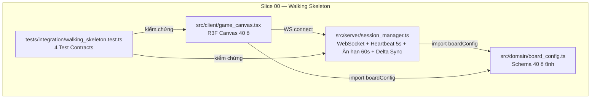
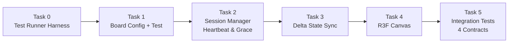

# Slice 00: Bộ Xương Sống Kỹ Thuật (Walking Skeleton) — Bản Kế Hoạch Thi Công

> **Dành cho agentic workers:** KỸ NĂNG BẮT BUỘC: Sử dụng `subagent-driven-development` để thực thi kế hoạch theo từng Task. Các bước sử dụng cú pháp checkbox (`- [ ]`) để theo dõi tiến trình.

**Mục tiêu:** Thiết lập đường ống kỹ thuật khép kín (End-to-End Tracer Bullet) kết nối Client R3F ↔ Server WebSocket, bao phủ 3 Use Cases (`UC-GAME-004`, `UC-GAME-006`, `UC-GAME-009`) và 4 Hợp Đồng Kiểm Thử.

**Kiến trúc:**
Server WebSocket quản lý phiên kết nối với heartbeat 5s và ân hạn 60s. Client R3F Canvas nhận delta state và dựng giao diện sa bàn 40 ô. Tầng domain chứa schema tĩnh `boardConfig` chia sẻ giữa Client và Server. Bộ kiểm thử tích hợp xác minh toàn bộ 4 hợp đồng.

**Sơ đồ kiến trúc:**



**Công nghệ:** TypeScript (Strict), Vite, Vitest, React, @react-three/fiber, ws (WebSocket)

**Ticket gốc:** [issues/GAME-S00-walking-skeleton.md](file:///c:/Users/HP/Documents/GitHub/vtcoon/issues/GAME-S00-walking-skeleton.md)

## Ràng Buộc Toàn Cục (Global Constraints)

| Ràng buộc | Giá trị |
|---|---|
| Ngân sách LOC toàn Slice | < 400 dòng (mã + test) |
| Giới hạn LOC/file | ≤ 400 dòng |
| Giới hạn LOC/hàm | ≤ 30 dòng |
| Cyclomatic Complexity | ≤ 5 |
| TypeScript mode | `strict: true`, `noUncheckedIndexedAccess: true` |
| Heartbeat interval | 5 giây |
| Ân hạn mất kết nối | 60 giây |
| Delta state payload | < 10 KB |
| Test style | Detroit Classical TDD + Adversarial Inversion |
| Terminal | Windows `cmd /c`, không dùng bash |
| Git | AI tuyệt đối không chạy lệnh git |

## DAG Phụ Thuộc (Dependency Order)



> [!IMPORTANT]
> Mỗi Task phải chạy PASS toàn bộ test hiện có trước khi chuyển sang Task tiếp theo. TUYỆT ĐỐI không bỏ qua bước "xác nhận test ĐỎ" (Adversarial Inversion).

---

### Task 0: Khởi Tạo Test Runner Harness (Nền Móng Dự Án)

**Mục tiêu:** Tạo cấu hình tối thiểu để `vitest run` chạy được 1 smoke test PASS trên CMD Windows.

**Ngân sách:** ~50 LOC (package.json + tsconfig.json + vitest.config.ts + smoke test)

**Tệp:**
- Tạo mới: `package.json`
- Tạo mới: `tsconfig.json`
- Tạo mới: `vitest.config.ts`
- Tạo mới: `tests/smoke.test.ts`

**Giao diện (Interfaces):**
- Tiêu thụ: Không (Task đầu tiên, greenfield)
- Sản xuất: Test runner Vitest hoạt động, TypeScript compiler, cấu trúc thư mục `src/` và `tests/`

- [ ] **Bước 0.1: Tạo `package.json`**

```json
{
  "name": "vtcoon",
  "version": "0.0.0",
  "private": true,
  "type": "module",
  "scripts": {
    "test": "vitest run",
    "test:watch": "vitest"
  },
  "devDependencies": {
    "typescript": "^5.8.0",
    "vitest": "^3.2.0",
    "@types/node": "^24.0.0"
  },
  "dependencies": {
    "react": "^19.1.0",
    "react-dom": "^19.1.0",
    "@react-three/fiber": "^9.1.0",
    "three": "^0.175.0",
    "@types/three": "^0.175.0",
    "ws": "^8.18.0",
    "@types/ws": "^8.18.0"
  }
}
```

- [ ] **Bước 0.2: Tạo `tsconfig.json`**

```json
{
  "compilerOptions": {
    "target": "ES2022",
    "module": "ESNext",
    "moduleResolution": "bundler",
    "jsx": "react-jsx",
    "strict": true,
    "noUncheckedIndexedAccess": true,
    "esModuleInterop": true,
    "skipLibCheck": true,
    "forceConsistentCasingInFileNames": true,
    "outDir": "dist",
    "rootDir": ".",
    "baseUrl": ".",
    "paths": {
      "@domain/*": ["src/domain/*"],
      "@server/*": ["src/server/*"],
      "@client/*": ["src/client/*"]
    }
  },
  "include": ["src", "tests"]
}
```

- [ ] **Bước 0.3: Tạo `vitest.config.ts`**

```typescript
import { defineConfig } from 'vitest/config';

export default defineConfig({
  test: {
    include: ['tests/**/*.test.ts'],
    environment: 'node',
    globals: false,
  },
  resolve: {
    alias: {
      '@domain': new URL('./src/domain', import.meta.url).pathname,
      '@server': new URL('./src/server', import.meta.url).pathname,
      '@client': new URL('./src/client', import.meta.url).pathname,
    },
  },
});
```

- [ ] **Bước 0.4: Tạo smoke test `tests/smoke.test.ts`**

```typescript
import { describe, it, expect } from 'vitest';

describe('Smoke Test — Test Runner Harness', () => {
  it('xác nhận Vitest hoạt động trên CMD Windows', () => {
    expect(1 + 1).toBe(2);
  });
});
```

- [ ] **Bước 0.5: Cài đặt dependencies và chạy test**

Chạy: `cmd /c "cd c:\Users\HP\Documents\GitHub\vtcoon && npm install && npx vitest run"`
Kỳ vọng: 1 test PASS, exit code 0

**Tiêu chuẩn hoàn thành Task 0:**
- [x] `npm install` không lỗi
- [x] `npx vitest run` báo 1 test PASS
- [x] TypeScript compiler không báo lỗi

---

### Task 1: Schema Dữ Liệu Tĩnh 40 Ô Sa Bàn

**Mục tiêu:** Định nghĩa cấu trúc dữ liệu TypeScript cho 40 ô bàn cờ từ [entity_model.md](file:///c:/Users/HP/Documents/GitHub/vtcoon/docs/domain/entity_model.md). Slice 00 chỉ cần schema tối thiểu (id, tên, loại ô) — CHƯA cần logic tính phí hay nâng cấp.

**Ngân sách:** ~60 LOC (board_config.ts ~40 + test ~20)

**Tệp:**
- Tạo mới: [`src/domain/board_config.ts`](file:///c:/Users/HP/Documents/GitHub/vtcoon/src/domain/board_config.ts)
- Tạo mới: [`tests/domain/board_config.test.ts`](file:///c:/Users/HP/Documents/GitHub/vtcoon/tests/domain/board_config.test.ts)

**Giao diện (Interfaces):**
- Tiêu thụ: Không
- Sản xuất:
  - `CellType` — Enum loại ô: `Go`, `Property`, `Tax`, `Chance`, `CommunityChest`, `Railroad`, `Utility`, `Jail`, `FreeParking`, `GoToJail`
  - `BoardCell` — Interface: `{ readonly index: number; readonly name: string; readonly type: CellType }`
  - `BOARD_CONFIG` — Mảng `readonly BoardCell[]` đúng 40 phần tử

- [ ] **Bước 1.1: Viết test thất bại `tests/domain/board_config.test.ts`**

```typescript
import { describe, it, expect } from 'vitest';
import { BOARD_CONFIG, CellType } from '../../src/domain/board_config';

describe('[UC-GAME-009/MSS] Board Config — Schema 40 ô', () => {
  it('BOARD_CONFIG chứa đúng 40 phần tử', () => {
    expect(BOARD_CONFIG).toHaveLength(40);
  });

  it('mỗi ô có index, name, type hợp lệ', () => {
    for (const cell of BOARD_CONFIG) {
      expect(cell.index).toBeGreaterThanOrEqual(0);
      expect(cell.index).toBeLessThan(40);
      expect(cell.name.length).toBeGreaterThan(0);
      expect(Object.values(CellType)).toContain(cell.type);
    }
  });

  it('ô đầu tiên (index 0) là ô Khởi Hành (Go)', () => {
    expect(BOARD_CONFIG[0]?.type).toBe(CellType.Go);
  });
});
```

- [ ] **Bước 1.2: Chạy test xác nhận ĐỎ**

Chạy: `cmd /c "cd c:\Users\HP\Documents\GitHub\vtcoon && npx vitest run tests/domain/board_config.test.ts"`
Kỳ vọng: FAIL — module `../../src/domain/board_config` không tồn tại

- [ ] **Bước 1.3: Thi công `src/domain/board_config.ts`**

Tạo file với enum `CellType`, interface `BoardCell`, và mảng hằng `BOARD_CONFIG` chứa đúng 40 phần tử theo bố cục từ [entity_model.md](file:///c:/Users/HP/Documents/GitHub/vtcoon/docs/domain/entity_model.md). Chỉ cần 3 trường `index`, `name`, `type` — không thêm giá mua, phí dừng chân hay bất kỳ logic nghiệp vụ nào.

- [ ] **Bước 1.4: Chạy test xác nhận XANH**

Chạy: `cmd /c "cd c:\Users\HP\Documents\GitHub\vtcoon && npx vitest run"`
Kỳ vọng: Toàn bộ test (smoke + board_config) PASS

- [ ] **Bước 1.5: Adversarial Inversion — Cố tình phá hỏng**

Xóa 1 phần tử khỏi `BOARD_CONFIG` (ví dụ phần tử cuối), chạy test lại.
Kỳ vọng: Test `BOARD_CONFIG chứa đúng 40 phần tử` báo ĐỎ.
Sau đó hoàn nguyên lại code đúng.

**Tiêu chuẩn hoàn thành Task 1:**
- [x] `BOARD_CONFIG` có đúng 40 phần tử
- [x] Tất cả test PASS
- [x] Adversarial Inversion thành công (test ĐỎ khi sửa sai → XANH khi phục hồi)

---

### Task 2: Quản Lý Phiên — Heartbeat 5s & Ân Hạn 60s

**Mục tiêu:** Thi công `SessionManager` xử lý kết nối WebSocket, heartbeat ping/pong 5s, và cơ chế ân hạn 60s khi mất kết nối. Bao phủ `[TC-00.1/MSS]`, `[TC-00.3/A1]`, `[TC-00.4/A2]`.

**Ngân sách:** ~80 LOC (session_manager.ts ~55 + test ~25)

**Tệp:**
- Tạo mới: [`src/server/session_manager.ts`](file:///c:/Users/HP/Documents/GitHub/vtcoon/src/server/session_manager.ts)
- Tạo mới: [`tests/server/session_manager.test.ts`](file:///c:/Users/HP/Documents/GitHub/vtcoon/tests/server/session_manager.test.ts)

**Giao diện (Interfaces):**
- Tiêu thụ: Không (WebSocket được inject qua constructor, không import `ws` trực tiếp trong domain)
- Sản xuất:
  - `SessionState` — Enum: `Connected`, `GracePeriod`, `Disconnected`
  - `Session` — Interface: `{ readonly id: string; state: SessionState; lastPongAt: number }`
  - `SessionManager` — Class:
    - `addSession(id: string): Session`
    - `removeSession(id: string): void`
    - `handlePong(id: string): void`
    - `checkHeartbeats(): void` — kiểm tra từng phiên, nếu quá 5s không pong → chuyển `GracePeriod`, nếu quá 60s → chuyển `Disconnected` và gọi cleanup
    - `getSession(id: string): Session | undefined`

- [ ] **Bước 2.1: Viết test thất bại `tests/server/session_manager.test.ts`**

```typescript
import { describe, it, expect, beforeEach, vi } from 'vitest';
import { SessionManager, SessionState } from '../../src/server/session_manager';

describe('SessionManager — Heartbeat & Grace Period', () => {
  let manager: SessionManager;

  beforeEach(() => {
    vi.useFakeTimers();
    manager = new SessionManager();
  });

  it('[TC-00.1/MSS] [UC-GAME-004/MSS] thêm phiên → trạng thái Connected', () => {
    const session = manager.addSession('player-1');
    expect(session.state).toBe(SessionState.Connected);
  });

  it('[TC-00.3/A1] [UC-GAME-006/A1] quá 5s không pong → chuyển GracePeriod', () => {
    manager.addSession('player-1');
    vi.advanceTimersByTime(6_000);
    manager.checkHeartbeats();
    expect(manager.getSession('player-1')?.state).toBe(SessionState.GracePeriod);
  });

  it('[TC-00.4/A2] [UC-GAME-006/A2] quá 60s không pong → chuyển Disconnected', () => {
    manager.addSession('player-1');
    vi.advanceTimersByTime(61_000);
    manager.checkHeartbeats();
    expect(manager.getSession('player-1')).toBeUndefined();
  });

  it('[TC-00.1/MSS] nhận pong trong ân hạn → phục hồi Connected', () => {
    manager.addSession('player-1');
    vi.advanceTimersByTime(6_000);
    manager.checkHeartbeats();
    manager.handlePong('player-1');
    expect(manager.getSession('player-1')?.state).toBe(SessionState.Connected);
  });
});
```

- [ ] **Bước 2.2: Chạy test xác nhận ĐỎ**

Chạy: `cmd /c "cd c:\Users\HP\Documents\GitHub\vtcoon && npx vitest run tests/server/session_manager.test.ts"`
Kỳ vọng: FAIL — module không tồn tại

- [ ] **Bước 2.3: Thi công `src/server/session_manager.ts`**

Triển khai class `SessionManager` với:
- Hằng số: `HEARTBEAT_INTERVAL_MS = 5_000`, `GRACE_PERIOD_MS = 60_000`
- `addSession()`: tạo `Session` mới với `state = Connected`, `lastPongAt = Date.now()`
- `handlePong()`: cập nhật `lastPongAt` và phục hồi `state = Connected`
- `checkHeartbeats()`: duyệt sessions, tính `elapsed = now - lastPongAt`:
  - `elapsed > GRACE_PERIOD_MS` → xóa phiên (cleanup)
  - `elapsed > HEARTBEAT_INTERVAL_MS` → đặt `state = GracePeriod`
- `getSession()` / `removeSession()`: truy xuất / xóa thủ công

- [ ] **Bước 2.4: Chạy toàn bộ test xác nhận XANH**

Chạy: `cmd /c "cd c:\Users\HP\Documents\GitHub\vtcoon && npx vitest run"`
Kỳ vọng: Toàn bộ test PASS

- [ ] **Bước 2.5: Adversarial Inversion**

Sửa `GRACE_PERIOD_MS` thành `30_000`. Chạy test TC-00.4 (advance 61s).
Kỳ vọng: Vẫn PASS (vì 61s > 30s). Sửa thành `120_000`.
Kỳ vọng: Test ĐỎ (61s < 120s → session chưa bị xóa). Hoàn nguyên lại `60_000`.

**Tiêu chuẩn hoàn thành Task 2:**
- [x] 3 hợp đồng TC-00.1, TC-00.3, TC-00.4 test PASS
- [x] Adversarial Inversion chứng minh test nhạy với giá trị sai

---

### Task 3: Đồng Bộ Vi Sai Delta State

**Mục tiêu:** Mở rộng `SessionManager` để phát gói tin delta state cho client kết nối, bao phủ `[TC-00.2/MSS]`. Xác minh payload < 10KB.

**Ngân sách:** ~50 LOC (mở rộng session_manager.ts ~25 + test ~25)

**Tệp:**
- Sửa đổi: [`src/server/session_manager.ts`](file:///c:/Users/HP/Documents/GitHub/vtcoon/src/server/session_manager.ts) — thêm `broadcastDelta()` và `DeltaPayload`
- Tạo mới: [`tests/server/delta_sync.test.ts`](file:///c:/Users/HP/Documents/GitHub/vtcoon/tests/server/delta_sync.test.ts)

**Giao diện (Interfaces):**
- Tiêu thụ: `SessionManager`, `BOARD_CONFIG` từ Task 1-2
- Sản xuất:
  - `DeltaPayload` — Interface: `{ readonly tick: number; readonly cells: ReadonlyArray<{ index: number; ownerId: string | null }> }`
  - `SessionManager.broadcastDelta(payload: DeltaPayload): void` — phát delta cho tất cả phiên `Connected`
  - `SessionManager.getLastDelta(): DeltaPayload | undefined` — lấy bản delta cuối cùng đã phát

- [ ] **Bước 3.1: Viết test thất bại `tests/server/delta_sync.test.ts`**

```typescript
import { describe, it, expect, beforeEach } from 'vitest';
import { SessionManager } from '../../src/server/session_manager';
import type { DeltaPayload } from '../../src/server/session_manager';

describe('[TC-00.2/MSS] [UC-GAME-009/MSS] Delta State Sync', () => {
  let manager: SessionManager;

  beforeEach(() => {
    manager = new SessionManager();
    manager.addSession('player-1');
  });

  it('broadcastDelta lưu delta payload', () => {
    const delta: DeltaPayload = {
      tick: 1,
      cells: [{ index: 0, ownerId: null }],
    };
    manager.broadcastDelta(delta);
    expect(manager.getLastDelta()).toEqual(delta);
  });

  it('delta payload serialized < 10KB', () => {
    const delta: DeltaPayload = {
      tick: 1,
      cells: Array.from({ length: 40 }, (_, i) => ({
        index: i,
        ownerId: null,
      })),
    };
    const sizeBytes = new TextEncoder().encode(JSON.stringify(delta)).length;
    expect(sizeBytes).toBeLessThan(10_240);
  });
});
```

- [ ] **Bước 3.2: Chạy test xác nhận ĐỎ**

Chạy: `cmd /c "cd c:\Users\HP\Documents\GitHub\vtcoon && npx vitest run tests/server/delta_sync.test.ts"`
Kỳ vọng: FAIL — `broadcastDelta` / `DeltaPayload` chưa tồn tại

- [ ] **Bước 3.3: Mở rộng `src/server/session_manager.ts`**

Thêm:
- Interface `DeltaPayload` (export)
- Property private `lastDelta: DeltaPayload | undefined`
- Phương thức `broadcastDelta(payload)`: lưu `lastDelta`, ghi nhật ký phiên nhận
- Phương thức `getLastDelta()`: trả `lastDelta`

> [!IMPORTANT]
> Slice 00 chưa có WebSocket transport thực. `broadcastDelta` ở giai đoạn này chỉ lưu trữ delta trong bộ nhớ — sẽ được kết nối qua `ws` khi tích hợp thực tế trong Slice tiếp theo.

- [ ] **Bước 3.4: Chạy toàn bộ test xác nhận XANH**

Chạy: `cmd /c "cd c:\Users\HP\Documents\GitHub\vtcoon && npx vitest run"`
Kỳ vọng: Toàn bộ test PASS

- [ ] **Bước 3.5: Adversarial Inversion**

Sửa `broadcastDelta` để KHÔNG lưu `lastDelta` (bỏ dòng gán). Chạy test.
Kỳ vọng: Test `broadcastDelta lưu delta payload` ĐỎ. Hoàn nguyên.

**Tiêu chuẩn hoàn thành Task 3:**
- [x] TC-00.2 test PASS
- [x] Payload 40 ô serialized < 10KB
- [x] Adversarial Inversion thành công

---

### Task 4: Khung Giao Diện R3F Canvas

**Mục tiêu:** Dựng component React Three Fiber hiển thị 40 ô sa bàn cơ bản từ `BOARD_CONFIG`. Slice 00 dựng ô dạng box đơn giản — CHƯA cần hiệu ứng 3D phức tạp.

**Ngân sách:** ~60 LOC (game_canvas.tsx ~50 + test ~10)

**Tệp:**
- Tạo mới: [`src/client/game_canvas.tsx`](file:///c:/Users/HP/Documents/GitHub/vtcoon/src/client/game_canvas.tsx)
- Tạo mới: [`tests/client/game_canvas.test.ts`](file:///c:/Users/HP/Documents/GitHub/vtcoon/tests/client/game_canvas.test.ts)

**Giao diện (Interfaces):**
- Tiêu thụ: `BOARD_CONFIG`, `BoardCell` từ Task 1
- Sản xuất:
  - `BoardCellMesh` — Component R3F: nhận `cell: BoardCell`, dựng `<mesh>` tại vị trí tính theo `index`
  - `GameCanvas` — Component React: bọc `<Canvas>` chứa 40 `BoardCellMesh`

- [ ] **Bước 4.1: Viết test tối thiểu `tests/client/game_canvas.test.ts`**

```typescript
import { describe, it, expect } from 'vitest';
import { BOARD_CONFIG } from '../../src/domain/board_config';

describe('Game Canvas — Kiểm tra tiền điều kiện', () => {
  it('BOARD_CONFIG có đủ 40 ô để dựng Canvas', () => {
    expect(BOARD_CONFIG).toHaveLength(40);
  });

  it('mỗi ô có name không rỗng để hiển thị label', () => {
    for (const cell of BOARD_CONFIG) {
      expect(cell.name.length).toBeGreaterThan(0);
    }
  });
});
```

> [!NOTE]
> R3F component không thể unit-test trực tiếp trong môi trường Node (thiếu WebGL context). Test ở Task 4 chỉ kiểm tra dữ liệu đầu vào. Kiểm thử visual sẽ do người dùng thực hiện thủ công và test tích hợp ở Task 5.

- [ ] **Bước 4.2: Chạy test xác nhận XANH (test tiền điều kiện)**

Chạy: `cmd /c "cd c:\Users\HP\Documents\GitHub\vtcoon && npx vitest run tests/client/game_canvas.test.ts"`
Kỳ vọng: PASS (dữ liệu đã có từ Task 1)

- [ ] **Bước 4.3: Thi công `src/client/game_canvas.tsx`**

Triển khai:
- Hàm `cellPosition(index: number): [number, number, number]` — tính tọa độ 2D bố cục bàn cờ hình vuông 10×10 (mỗi cạnh 10 ô, xoay theo chiều kim đồng hồ)
- Component `BoardCellMesh({ cell }: { cell: BoardCell })` — dựng `<mesh position={...}><boxGeometry /><meshStandardMaterial /></mesh>`
- Component `GameCanvas()` — dựng `<Canvas><ambientLight /><directionalLight />{BOARD_CONFIG.map(cell => <BoardCellMesh key={cell.index} cell={cell} />)}</Canvas>`

- [ ] **Bước 4.4: Chạy toàn bộ test xác nhận XANH**

Chạy: `cmd /c "cd c:\Users\HP\Documents\GitHub\vtcoon && npx vitest run"`
Kỳ vọng: Toàn bộ test PASS (TypeScript compile không lỗi)

**Tiêu chuẩn hoàn thành Task 4:**
- [x] `game_canvas.tsx` compile không lỗi TypeScript
- [x] Component export `GameCanvas` và `BoardCellMesh`
- [x] Toàn bộ test suite PASS

---

### Task 5: Hợp Đồng Kiểm Thử Tích Hợp 4 Luồng

**Mục tiêu:** Viết bộ test tích hợp xác minh toàn bộ 4 Test Contracts (`TC-00.1` đến `TC-00.4`) theo đặc tả từ [ticket](file:///c:/Users/HP/Documents/GitHub/vtcoon/issues/GAME-S00-walking-skeleton.md). Đây là test nghiệm thu cuối cùng cho Slice 00.

**Ngân sách:** ~60 LOC

**Tệp:**
- Tạo mới: [`tests/integration/walking_skeleton.test.ts`](file:///c:/Users/HP/Documents/GitHub/vtcoon/tests/integration/walking_skeleton.test.ts)

**Giao diện (Interfaces):**
- Tiêu thụ: `SessionManager`, `SessionState`, `DeltaPayload` từ Task 2-3; `BOARD_CONFIG` từ Task 1
- Sản xuất: Không (task kiểm thử thuần túy)

- [ ] **Bước 5.1: Viết test tích hợp `tests/integration/walking_skeleton.test.ts`**

```typescript
import { describe, it, expect, beforeEach, vi } from 'vitest';
import {
  SessionManager,
  SessionState,
} from '../../src/server/session_manager';
import type { DeltaPayload } from '../../src/server/session_manager';
import { BOARD_CONFIG } from '../../src/domain/board_config';

describe('Walking Skeleton — 4 Hợp Đồng Kiểm Thử Tích Hợp', () => {
  let manager: SessionManager;

  beforeEach(() => {
    vi.useFakeTimers();
    manager = new SessionManager();
  });

  it('[TC-00.1/MSS] [UC-GAME-004/MSS] Client kết nối → Server chấp thuận, heartbeat 5s duy trì', () => {
    const session = manager.addSession('player-1');
    expect(session.state).toBe(SessionState.Connected);
    // Mô phỏng 3 chu kỳ heartbeat thành công
    for (let i = 0; i < 3; i++) {
      vi.advanceTimersByTime(4_000);
      manager.handlePong('player-1');
      manager.checkHeartbeats();
      expect(manager.getSession('player-1')?.state).toBe(SessionState.Connected);
    }
  });

  it('[TC-00.2/MSS] [UC-GAME-009/MSS] Server phát delta → Client nhận đúng trạng thái', () => {
    manager.addSession('player-1');
    const delta: DeltaPayload = {
      tick: 1,
      cells: BOARD_CONFIG.map((cell) => ({
        index: cell.index,
        ownerId: null,
      })),
    };
    manager.broadcastDelta(delta);
    const received = manager.getLastDelta();
    expect(received?.tick).toBe(1);
    expect(received?.cells).toHaveLength(40);
    // Xác minh payload < 10KB
    const sizeBytes = new TextEncoder().encode(JSON.stringify(received)).length;
    expect(sizeBytes).toBeLessThan(10_240);
  });

  it('[TC-00.3/A1] [UC-GAME-006/A1] Gián đoạn mạng → Ân hạn 60s, giữ trạng thái', () => {
    manager.addSession('player-1');
    vi.advanceTimersByTime(6_000);
    manager.checkHeartbeats();
    expect(manager.getSession('player-1')?.state).toBe(SessionState.GracePeriod);
    // State vẫn còn trong bộ nhớ (chưa bị xóa)
    expect(manager.getSession('player-1')).toBeDefined();
  });

  it('[TC-00.4/A2] [UC-GAME-006/A2] Quá 60s → Mất kết nối vĩnh viễn, giải phóng tài nguyên', () => {
    manager.addSession('player-1');
    vi.advanceTimersByTime(61_000);
    manager.checkHeartbeats();
    // Phiên đã bị xóa hoàn toàn
    expect(manager.getSession('player-1')).toBeUndefined();
  });
});
```

- [ ] **Bước 5.2: Chạy test xác nhận XANH**

Chạy: `cmd /c "cd c:\Users\HP\Documents\GitHub\vtcoon && npx vitest run tests/integration/walking_skeleton.test.ts"`
Kỳ vọng: 4 test PASS

- [ ] **Bước 5.3: Adversarial Inversion — Phá hỏng từng hợp đồng**

Thực hiện lần lượt:
1. Sửa `HEARTBEAT_INTERVAL_MS = 999_999` → TC-00.3 ĐỎ (6s < 999s, không chuyển GracePeriod). Hoàn nguyên.
2. Sửa `GRACE_PERIOD_MS = 999_999` → TC-00.4 ĐỎ (61s < 999s, session chưa xóa). Hoàn nguyên.
3. Sửa `broadcastDelta` thành no-op → TC-00.2 ĐỎ. Hoàn nguyên.
4. Sửa `addSession` trả `state = Disconnected` → TC-00.1 ĐỎ. Hoàn nguyên.

- [ ] **Bước 5.4: Chạy toàn bộ test suite lần cuối**

Chạy: `cmd /c "cd c:\Users\HP\Documents\GitHub\vtcoon && npx vitest run"`
Kỳ vọng: Toàn bộ test suite PASS (smoke + domain + server + integration)

**Tiêu chuẩn hoàn thành Task 5:**
- [x] 4 hợp đồng kiểm thử PASS
- [x] Adversarial Inversion thành công cho cả 4 hợp đồng
- [x] Nhãn truy vết `[UC-GAME-004/MSS]`, `[UC-GAME-006/A1]`, `[UC-GAME-006/A2]`, `[UC-GAME-009/MSS]` có mặt trong tên test

---

## Kế Hoạch Xác Minh (Verification Plan)

### Kiểm Thử Tự Động
```
cmd /c "cd c:\Users\HP\Documents\GitHub\vtcoon && npx vitest run"
```
Kỳ vọng: Toàn bộ test PASS, exit code 0.

### Kiểm Tra Thủ Công
- Người dùng chạy `npm run dev` (khi có Vite dev server ở Slice sau) để xác minh R3F Canvas hiển thị 40 ô trên trình duyệt.
- Người dùng xem xét và commit thay đổi vào git.

### Kiểm Duyệt
- `spec-reviewer`: Xác minh 100% bao phủ Test Contracts từ ticket.
- `code-reviewer`: Xác minh tuân thủ LOC budget, TS strict, và 6 Cờ Đỏ Slop.

---

## Tổng Kết Ngân Sách LOC

| Task | Tệp | LOC ước tính |
|---|---|---|
| 0 | package.json, tsconfig.json, vitest.config.ts, smoke.test.ts | ~50 |
| 1 | board_config.ts + test | ~60 |
| 2 | session_manager.ts + test | ~80 |
| 3 | delta_sync mở rộng + test | ~50 |
| 4 | game_canvas.tsx + test | ~60 |
| 5 | walking_skeleton.test.ts | ~60 |
| **Tổng** | | **~360 LOC** |

> [!CAUTION]
> Ngân sách tổng ~360 LOC, sát giới hạn 400 LOC. Trong quá trình thi công, nếu bất kỳ file nào có nguy cơ vượt 400 dòng, PHẢI tách module ngay lập tức.
