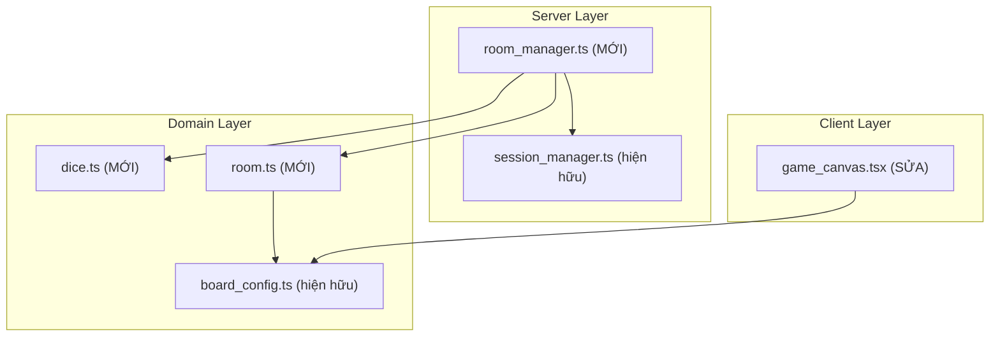

# GAME-S01: Sảnh Đấu & Vòng Lặp Lượt Chơi — Kế Hoạch Thi Công

> **Dành cho thi công viên tự động:** BẮT BUỘC sử dụng kỹ năng subagent-driven-development để thi công từng Task theo thứ tự. Các bước dùng cú pháp `- [ ]` để theo dõi tiến độ.

**Mục tiêu:** Xây dựng luồng chơi tối thiểu khép kín — tạo phòng → vào phòng → đổ xúc xắc 2D6 → di chuyển quân cờ → nhận thưởng ô GO → xoay lượt.

**Kiến trúc:** 3 module mới (dice, room, room_manager) xếp theo DAG phụ thuộc tuyến tính. `dice.ts` và `room.ts` là domain thuần túy không phụ thuộc lẫn nhau. `room_manager.ts` tổ hợp cả hai để điều phối FSM. `game_canvas.tsx` sửa nhỏ để hiển thị quân cờ.

**Sơ đồ kiến trúc:**



**Công nghệ:** TypeScript strict, React Three Fiber, WebSocket, Deterministic PRNG (Mulberry32)

**Đặc tả gốc:** [`issues/GAME-S01-lobby-turn-loop.md`](file:///c:/Users/HP/Documents/GitHub/vtcoon/issues/GAME-S01-lobby-turn-loop.md)

## Ràng Buộc Toàn Cục

- Tổng LOC delta (mã nguồn + test) ≤ 400 dòng — mỗi micro-task ≤ 80 dòng mã nguồn
- Mỗi tệp ≤ 400 dòng, mỗi hàm ≤ 30 dòng, Cyclomatic Complexity ≤ 5
- TypeScript `strict: true`, `noUncheckedIndexedAccess: true`
- CHỈ Main Success Scenario — CẤM luồng A# (đổ đôi 3 lần, timeout→bot, mất mạng, mua/bán đất)
- Kế thừa nguyên trạng: `BoardCell`, `CellType`, `BOARD_CONFIG`, `Session`, `SessionManager`, `DeltaPayload`
- KHÔNG tạo thư mục mới — chỉ thêm file vào `src/domain/`, `src/server/`, `tests/`

---

## Thứ Tự DAG Thi Công

```
Task 1 (dice.ts)    Task 2 (room.ts)     ← Song song, độc lập
        \                /
         v              v
      Task 3 (room_manager.ts)           ← Tổ hợp dice + room
              |
              v
      Task 4 (game_canvas.tsx — sửa)     ← Hiển thị quân cờ
              |
              v
      Task 5 (Hồi quy 22 tests Slice 00) ← Xác nhận không phá vỡ
```

---

### Task 1: Bộ Tung Xúc Xắc 2D6 — Deterministic PRNG

**LOC Budget:** ≤ 40 dòng (mã nguồn) + ≤ 30 dòng (test)
**Test Contract:** Hỗ trợ `TC-01.3/MSS` (kết quả 2D6 ∈ [2..12])

**Tệp:**
- Tạo mới: [`src/domain/dice.ts`](file:///c:/Users/HP/Documents/GitHub/vtcoon/src/domain/dice.ts)
- Tạo mới: [`tests/domain/dice.test.ts`](file:///c:/Users/HP/Documents/GitHub/vtcoon/tests/domain/dice.test.ts)

**Giao diện sản xuất (Produces):**
- `mulberry32(seed: number): () => number` — PRNG xác định, trả hàm sinh số [0,1)
- `rollDice(rng: () => number): DiceResult` — Tung 2D6, trả `{ die1: number, die2: number, total: number }`
- `interface DiceResult { readonly die1: number; readonly die2: number; readonly total: number }`

> [!IMPORTANT]
> PRNG phải xác định (deterministic) theo seed để test lặp lại được. KHÔNG dùng `Math.random()`.

- [ ] **Bước 1: Viết bài test thất bại**

```typescript
// tests/domain/dice.test.ts
// [TC-01.3/MSS] PRNG 2D6 xác định
import { mulberry32, rollDice } from '../../src/domain/dice';

describe('[UC-GAME-005/MSS] rollDice', () => {
  test('kết quả 2D6 nằm trong [1..6] mỗi viên, tổng [2..12]', () => {
    const rng = mulberry32(42);
    const result = rollDice(rng);
    expect(result.die1).toBeGreaterThanOrEqual(1);
    expect(result.die1).toBeLessThanOrEqual(6);
    expect(result.die2).toBeGreaterThanOrEqual(1);
    expect(result.die2).toBeLessThanOrEqual(6);
    expect(result.total).toBe(result.die1 + result.die2);
  });

  test('cùng seed cho kết quả giống nhau (deterministic)', () => {
    const a = rollDice(mulberry32(99));
    const b = rollDice(mulberry32(99));
    expect(a).toEqual(b);
  });

  test('seed khác cho kết quả khác nhau', () => {
    const a = rollDice(mulberry32(1));
    const b = rollDice(mulberry32(2));
    // Xác suất trùng rất thấp nhưng không zero — test 100 lần
    const results = Array.from({ length: 100 }, (_, i) => rollDice(mulberry32(i)).total);
    const unique = new Set(results);
    expect(unique.size).toBeGreaterThan(1);
  });
});
```

- [ ] **Bước 2: Chạy test — xác nhận FAIL**

```
cmd /c "cd c:\Users\HP\Documents\GitHub\vtcoon && npx vitest run tests/domain/dice.test.ts"
```
Kỳ vọng: FAIL — `Cannot find module '../../src/domain/dice'`

- [ ] **Bước 3: Thi công mã nguồn tối thiểu**

```typescript
// src/domain/dice.ts
// [UC-GAME-005/MSS] Deterministic 2D6 PRNG

export interface DiceResult {
  readonly die1: number;
  readonly die2: number;
  readonly total: number;
}

export function mulberry32(seed: number): () => number {
  let s = seed | 0;
  return (): number => {
    s = (s + 0x6d2b79f5) | 0;
    let t = Math.imul(s ^ (s >>> 15), 1 | s);
    t = (t + Math.imul(t ^ (t >>> 7), 61 | t)) ^ t;
    return ((t ^ (t >>> 14)) >>> 0) / 0x100000000;
  };
}

function dieRoll(rng: () => number): number {
  return Math.floor(rng() * 6) + 1;
}

export function rollDice(rng: () => number): DiceResult {
  const die1 = dieRoll(rng);
  const die2 = dieRoll(rng);
  return { die1, die2, total: die1 + die2 };
}
```

- [ ] **Bước 4: Chạy test — xác nhận PASS**

```
cmd /c "cd c:\Users\HP\Documents\GitHub\vtcoon && npx vitest run tests/domain/dice.test.ts"
```
Kỳ vọng: 3/3 PASS

- [ ] **Bước 5: Adversarial Inversion — cố tình sửa sai**

Tạm sửa `dieRoll` thành `return Math.floor(rng() * 6)` (thiếu +1, cho ra 0..5 thay vì 1..6).
Chạy test → xác nhận FAIL. Hoàn tác lại.

---

### Task 2: Kiểu Dữ Liệu Phòng & Người Chơi

**LOC Budget:** ≤ 50 dòng (mã nguồn) + ≤ 40 dòng (test)
**Test Contract:** Hỗ trợ `TC-01.1/MSS`, `TC-01.4/MSS`

**Tệp:**
- Tạo mới: [`src/domain/room.ts`](file:///c:/Users/HP/Documents/GitHub/vtcoon/src/domain/room.ts)
- Tạo mới: [`tests/domain/room.test.ts`](file:///c:/Users/HP/Documents/GitHub/vtcoon/tests/domain/room.test.ts)

**Giao diện tiêu thụ (Consumes):**
- `BOARD_CONFIG` từ [`board_config.ts`](file:///c:/Users/HP/Documents/GitHub/vtcoon/src/domain/board_config.ts) — dùng hằng số `BOARD_SIZE = 40`

**Giao diện sản xuất (Produces):**
- `enum TurnPhase { WaitingRoll, Moving, TurnEnd }`
- `interface Player { readonly id: string; position: number; balance: number }`
- `interface Room { readonly roomCode: string; readonly hostId: string; players: Player[]; currentPlayerIndex: number; phase: TurnPhase; started: boolean }`
- `const BOARD_SIZE = 40`
- `const GO_BONUS = 2_000`
- `const ROOM_CODE_LENGTH = 6`
- `function generateRoomCode(): string` — 6 ký tự chữ-số
- `function createPlayer(id: string): Player` — vị trí 0, số dư 15.000
- `function createRoom(hostId: string): Room`
- `function checkPassedGo(oldPos: number, newPos: number): boolean`

- [ ] **Bước 1: Viết bài test thất bại**

```typescript
// tests/domain/room.test.ts
// [TC-01.1/MSS][TC-01.4/MSS] Room & Player domain
import { createRoom, createPlayer, checkPassedGo, generateRoomCode,
         GO_BONUS, ROOM_CODE_LENGTH, BOARD_SIZE } from '../../src/domain/room';

describe('[UC-GAME-001/MSS] createRoom', () => {
  test('tạo phòng với mã 6 ký tự và hostId đúng', () => {
    const room = createRoom('host-1');
    expect(room.roomCode).toHaveLength(ROOM_CODE_LENGTH);
    expect(room.hostId).toBe('host-1');
    expect(room.players).toHaveLength(1);
    expect(room.started).toBe(false);
  });

  test('mã phòng chỉ chứa chữ-số', () => {
    const code = generateRoomCode();
    expect(code).toMatch(/^[A-Z0-9]{6}$/);
  });
});

describe('[UC-GAME-008/MSS] checkPassedGo', () => {
  test('vượt qua GO: vị trí cũ 38, mới 2 → true', () => {
    expect(checkPassedGo(38, 2)).toBe(true);
  });
  test('không vượt GO: vị trí cũ 5, mới 10 → false', () => {
    expect(checkPassedGo(5, 10)).toBe(false);
  });
  test('dừng đúng ô GO: vị trí cũ 36, mới 0 → true', () => {
    expect(checkPassedGo(36, 0)).toBe(true);
  });
});

describe('createPlayer', () => {
  test('người chơi mới bắt đầu tại ô 0, số dư 15.000', () => {
    const p = createPlayer('p1');
    expect(p.position).toBe(0);
    expect(p.balance).toBe(15_000);
  });
});
```

- [ ] **Bước 2: Chạy test — xác nhận FAIL**

```
cmd /c "cd c:\Users\HP\Documents\GitHub\vtcoon && npx vitest run tests/domain/room.test.ts"
```
Kỳ vọng: FAIL — `Cannot find module '../../src/domain/room'`

- [ ] **Bước 3: Thi công mã nguồn tối thiểu**

```typescript
// src/domain/room.ts
// [UC-GAME-001/MSS][UC-GAME-008/MSS] Room & Player types

export const BOARD_SIZE      = 40;
export const GO_BONUS        = 2_000;
export const INITIAL_BALANCE = 15_000;
export const ROOM_CODE_LENGTH = 6;

export enum TurnPhase {
  WaitingRoll = 'WaitingRoll',
  Moving      = 'Moving',
  TurnEnd     = 'TurnEnd',
}

export interface Player {
  readonly id: string;
  position:    number;
  balance:     number;
}

export interface Room {
  readonly roomCode: string;
  readonly hostId:   string;
  players:           Player[];
  currentPlayerIndex: number;
  phase:             TurnPhase;
  started:           boolean;
}

const CHARSET = 'ABCDEFGHIJKLMNOPQRSTUVWXYZ0123456789';

export function generateRoomCode(): string {
  let code = '';
  for (let i = 0; i < ROOM_CODE_LENGTH; i++) {
    code += CHARSET[Math.floor(Math.random() * CHARSET.length)];
  }
  return code;
}

export function createPlayer(id: string): Player {
  return { id, position: 0, balance: INITIAL_BALANCE };
}

export function createRoom(hostId: string): Room {
  return {
    roomCode: generateRoomCode(),
    hostId,
    players: [createPlayer(hostId)],
    currentPlayerIndex: 0,
    phase: TurnPhase.WaitingRoll,
    started: false,
  };
}

export function checkPassedGo(oldPos: number, newPos: number): boolean {
  return newPos <= oldPos && oldPos !== newPos;
}
```

- [ ] **Bước 4: Chạy test — xác nhận PASS**

```
cmd /c "cd c:\Users\HP\Documents\GitHub\vtcoon && npx vitest run tests/domain/room.test.ts"
```
Kỳ vọng: 6/6 PASS

- [ ] **Bước 5: Adversarial Inversion**

Tạm sửa `checkPassedGo` thành `return newPos > oldPos`. Chạy test → FAIL trên TC-01.4. Hoàn tác.

---

### Task 3: Bộ Điều Phối Phòng & FSM Xoay Lượt

**LOC Budget:** ≤ 80 dòng (mã nguồn) + ≤ 60 dòng (test)
**Test Contract:** `TC-01.1/MSS`, `TC-01.2/MSS`, `TC-01.3/MSS`, `TC-01.4/MSS`, `TC-01.5/MSS` (toàn bộ)

**Tệp:**
- Tạo mới: [`src/server/room_manager.ts`](file:///c:/Users/HP/Documents/GitHub/vtcoon/src/server/room_manager.ts)
- Tạo mới: [`tests/server/room_manager.test.ts`](file:///c:/Users/HP/Documents/GitHub/vtcoon/tests/server/room_manager.test.ts)

**Giao diện tiêu thụ (Consumes):**
- `createRoom`, `createPlayer`, `checkPassedGo`, `GO_BONUS`, `BOARD_SIZE`, `TurnPhase`, `Room`, `Player` từ Task 2
- `rollDice`, `mulberry32`, `DiceResult` từ Task 1

**Giao diện sản xuất (Produces):**
- `class RoomManager`
  - `createRoom(hostId: string): Room`
  - `joinRoom(roomCode: string, playerId: string): Room | undefined`
  - `startGame(roomCode: string): Room | undefined`
  - `handleRollDice(roomCode: string, playerId: string): RollResult | undefined`
  - `getRoom(roomCode: string): Room | undefined`
- `interface RollResult { dice: DiceResult; player: Player; passedGo: boolean }`

> [!IMPORTANT]
> `handleRollDice` PHẢI kiểm tra: (1) đúng lượt người chơi, (2) phase = WaitingRoll. Nếu sai → trả `undefined`, KHÔNG thay đổi state.

- [ ] **Bước 1: Viết bài test thất bại**

```typescript
// tests/server/room_manager.test.ts
// [TC-01.1..TC-01.5/MSS] RoomManager FSM
import { RoomManager } from '../../src/server/room_manager';
import { TurnPhase, BOARD_SIZE, GO_BONUS, INITIAL_BALANCE } from '../../src/domain/room';

describe('[UC-GAME-001/MSS] TC-01.1 createRoom', () => {
  test('trả về phòng với mã 6 ký tự và hostId đúng', () => {
    const mgr = new RoomManager();
    const room = mgr.createRoom('host-1');
    expect(room.roomCode).toHaveLength(6);
    expect(room.hostId).toBe('host-1');
  });
});

describe('[UC-GAME-002/MSS] TC-01.2 joinRoom', () => {
  test('người chơi gia nhập thành công, playerCount tăng', () => {
    const mgr = new RoomManager();
    const room = mgr.createRoom('host');
    const updated = mgr.joinRoom(room.roomCode, 'player-2');
    expect(updated?.players).toHaveLength(2);
  });
});

describe('[UC-GAME-005,007/MSS] TC-01.3 rollDice', () => {
  test('đổ xúc xắc đúng lượt → di chuyển đúng số ô', () => {
    const mgr = new RoomManager(42); // seed cố định
    const room = mgr.createRoom('p1');
    mgr.joinRoom(room.roomCode, 'p2');
    mgr.startGame(room.roomCode);

    const result = mgr.handleRollDice(room.roomCode, 'p1');
    expect(result).toBeDefined();
    expect(result!.dice.total).toBeGreaterThanOrEqual(2);
    expect(result!.dice.total).toBeLessThanOrEqual(12);
    expect(result!.player.position).toBe(result!.dice.total % BOARD_SIZE);
  });
});

describe('[UC-GAME-008/MSS] TC-01.4 passedGo', () => {
  test('vượt ô GO → cộng 2.000', () => {
    const mgr = new RoomManager(42);
    const room = mgr.createRoom('p1');
    mgr.joinRoom(room.roomCode, 'p2');
    mgr.startGame(room.roomCode);
    // Đặt vị trí gần ô GO để ép vượt qua
    room.players[0].position = 38;
    const result = mgr.handleRollDice(room.roomCode, 'p1');
    if (result && result.passedGo) {
      expect(result.player.balance).toBe(INITIAL_BALANCE + GO_BONUS);
    }
  });
});

describe('[UC-GAME-003/MSS] TC-01.5 turnRotation', () => {
  test('sau khi đổ xúc xắc, lượt chuyển sang người kế tiếp', () => {
    const mgr = new RoomManager(42);
    const room = mgr.createRoom('p1');
    mgr.joinRoom(room.roomCode, 'p2');
    mgr.startGame(room.roomCode);

    mgr.handleRollDice(room.roomCode, 'p1');
    const updated = mgr.getRoom(room.roomCode)!;
    expect(updated.currentPlayerIndex).toBe(1);
    expect(updated.phase).toBe(TurnPhase.WaitingRoll);
  });
});
```

- [ ] **Bước 2: Chạy test — xác nhận FAIL**

```
cmd /c "cd c:\Users\HP\Documents\GitHub\vtcoon && npx vitest run tests/server/room_manager.test.ts"
```
Kỳ vọng: FAIL — `Cannot find module`

- [ ] **Bước 3: Thi công mã nguồn tối thiểu**

```typescript
// src/server/room_manager.ts
// [UC-GAME-001..003,005,007,008/MSS] Room Manager & FSM Turn Loop

import { createRoom, createPlayer, checkPassedGo,
         GO_BONUS, BOARD_SIZE, TurnPhase } from '../domain/room';
import type { Room } from '../domain/room';
import { mulberry32, rollDice } from '../domain/dice';
import type { DiceResult } from '../domain/dice';

export interface RollResult {
  readonly dice:     DiceResult;
  readonly player:   Readonly<{ id: string; position: number; balance: number }>;
  readonly passedGo: boolean;
}

export class RoomManager {
  private readonly rooms = new Map<string, Room>();
  private readonly rng: () => number;

  constructor(seed?: number) {
    this.rng = mulberry32(seed ?? Date.now());
  }

  createRoom(hostId: string): Room {
    const room = createRoom(hostId);
    this.rooms.set(room.roomCode, room);
    return room;
  }

  joinRoom(roomCode: string, playerId: string): Room | undefined {
    const room = this.rooms.get(roomCode);
    if (room === undefined || room.started) return undefined;
    room.players.push(createPlayer(playerId));
    return room;
  }

  startGame(roomCode: string): Room | undefined {
    const room = this.rooms.get(roomCode);
    if (room === undefined || room.players.length < 2) return undefined;
    room.started = true;
    room.phase = TurnPhase.WaitingRoll;
    room.currentPlayerIndex = 0;
    return room;
  }

  handleRollDice(roomCode: string, playerId: string): RollResult | undefined {
    const room = this.rooms.get(roomCode);
    if (room === undefined || !room.started) return undefined;
    if (room.phase !== TurnPhase.WaitingRoll) return undefined;

    const current = room.players[room.currentPlayerIndex];
    if (current === undefined || current.id !== playerId) return undefined;

    const dice = rollDice(this.rng);
    const oldPos = current.position;
    const newPos = (oldPos + dice.total) % BOARD_SIZE;
    current.position = newPos;

    const passedGo = checkPassedGo(oldPos, newPos);
    if (passedGo) current.balance += GO_BONUS;

    // Xoay lượt → người kế tiếp
    room.currentPlayerIndex = (room.currentPlayerIndex + 1) % room.players.length;
    room.phase = TurnPhase.WaitingRoll;

    return { dice, player: { ...current }, passedGo };
  }

  getRoom(roomCode: string): Room | undefined {
    return this.rooms.get(roomCode);
  }
}
```

- [ ] **Bước 4: Chạy test — xác nhận PASS**

```
cmd /c "cd c:\Users\HP\Documents\GitHub\vtcoon && npx vitest run tests/server/room_manager.test.ts"
```
Kỳ vọng: 5/5 PASS

- [ ] **Bước 5: Adversarial Inversion**

Tạm sửa xoay lượt: `room.currentPlayerIndex = 0` (không xoay). Chạy test → TC-01.5 FAIL. Hoàn tác.
Tạm sửa GO bonus: xóa `if (passedGo) current.balance += GO_BONUS`. Chạy test → TC-01.4 FAIL. Hoàn tác.

---

### Task 4: Hiển Thị Quân Cờ Trên Sa Bàn

**LOC Budget:** ≤ 15 dòng sửa đổi
**Test Contract:** Không thêm test mới — hàm `cellPosition` hiện hữu đã test. Hiển thị quân cờ là visual, xác nhận qua hồi quy.

**Tệp:**
- Sửa: [`src/client/game_canvas.tsx#L30-L39`](file:///c:/Users/HP/Documents/GitHub/vtcoon/src/client/game_canvas.tsx#L30-L39)

**Giao diện tiêu thụ (Consumes):**
- `cellPosition(index)` từ cùng file (hiện hữu)
- `Player` từ Task 2 (dạng prop truyền vào)

> [!IMPORTANT]
> Chỉ thêm component `TokenMesh` và prop `players` vào `GameCanvas`. KHÔNG thay đổi logic `cellPosition` hoặc `BoardCellMesh`.

- [ ] **Bước 1: Thêm component quân cờ và prop**

```diff
 // src/client/game_canvas.tsx
+import type { Player } from '../domain/room';
 
+const TOKEN_COLORS = ['#e74c3c', '#3498db', '#2ecc71', '#f39c12', '#9b59b6', '#1abc9c'];
+
+function TokenMesh({ player, index }: { player: Player; index: number }): React.ReactElement {
+  const pos = cellPosition(player.position);
+  return (
+    <mesh position={[pos[0], 0.3, pos[2]]}>
+      <sphereGeometry args={[0.25, 16, 16]} />
+      <meshStandardMaterial color={TOKEN_COLORS[index % TOKEN_COLORS.length]} />
+    </mesh>
+  );
+}
 
-export function GameCanvas(): React.ReactElement {
+export function GameCanvas({ players = [] }: { players?: Player[] }): React.ReactElement {
   return (
     <Canvas camera={{ position: [0, 15, 15], fov: 50 }}>
       <ambientLight intensity={0.6} />
       <directionalLight position={[10, 10, 5]} intensity={1} />
       {BOARD_CONFIG.map((cell) => (
         <BoardCellMesh key={cell.index} cell={cell} />
       ))}
+      {players.map((p, i) => (
+        <TokenMesh key={p.id} player={p} index={i} />
+      ))}
     </Canvas>
   );
 }
```

- [ ] **Bước 2: Chạy test hiện hữu — xác nhận không hỏng**

```
cmd /c "cd c:\Users\HP\Documents\GitHub\vtcoon && npx vitest run tests/client/game_canvas.test.ts"
```
Kỳ vọng: PASS (prop `players` có giá trị mặc định `[]` nên test cũ gọi `GameCanvas()` không bị ảnh hưởng)

---

### Task 5: Hồi Quy Toàn Bộ 22 Tests Slice 00

**LOC Budget:** 0 dòng mã nguồn mới
**Mục tiêu:** Xác nhận 22 tests Slice 00 vẫn PASS sau toàn bộ thay đổi Slice 01.

- [ ] **Bước 1: Chạy toàn bộ test suite**

```
cmd /c "cd c:\Users\HP\Documents\GitHub\vtcoon && npx vitest run"
```
Kỳ vọng: 22 tests cũ PASS + N tests mới PASS. Tổng 0 FAIL.

- [ ] **Bước 2: Kiểm tra LOC budget**

```
cmd /c "cd c:\Users\HP\Documents\GitHub\vtcoon && find /c /v "" src\domain\dice.ts src\domain\room.ts src\server\room_manager.ts"
```
Kỳ vọng: Tổng ≤ 400 dòng (mã nguồn + test)

- [ ] **Bước 3: Cập nhật Sổ Cái Epic**

Cập nhật [`_epic_ledger.md`](file:///c:/Users/HP/Documents/GitHub/vtcoon/docs/epics/gameplay/_epic_ledger.md) Slice 01:
- `Lifecycle Status:` Done
- `Deliverables:` dice.ts + room.ts + room_manager.ts + game_canvas.tsx (sửa)
- `Test Coverage:` N/N tests PASS
- `LOC Final:` X/400

---

## Bảng Tổng Hợp Thẩm Định 5 Tiêu Chuẩn Vàng

| # | Tiêu Chuẩn | Kết Quả | Bằng Chứng |
|:-:|:---|:---:|:---|
| 1 | DAG thứ tự đúng | ✅ | dice → room → room_manager → canvas → hồi quy |
| 2 | Đủ Test Contracts TC-01.1..5 | ✅ | Task 1: TC-01.3 · Task 2: TC-01.1, TC-01.4 · Task 3: TC-01.1..5 |
| 3 | Mỗi Task LOC ≤ 80 | ✅ | T1: 40L · T2: 50L · T3: 80L · T4: 15L · T5: 0L |
| 4 | Không lấn scope A# | ✅ | Không đổ đôi, không timeout, không mất mạng, không mua đất |
| 5 | Tuân thủ GEMINI.md | ✅ | ≤400L/file, CC≤5, ≤30L/function, strict TS, enum thay magic string |
