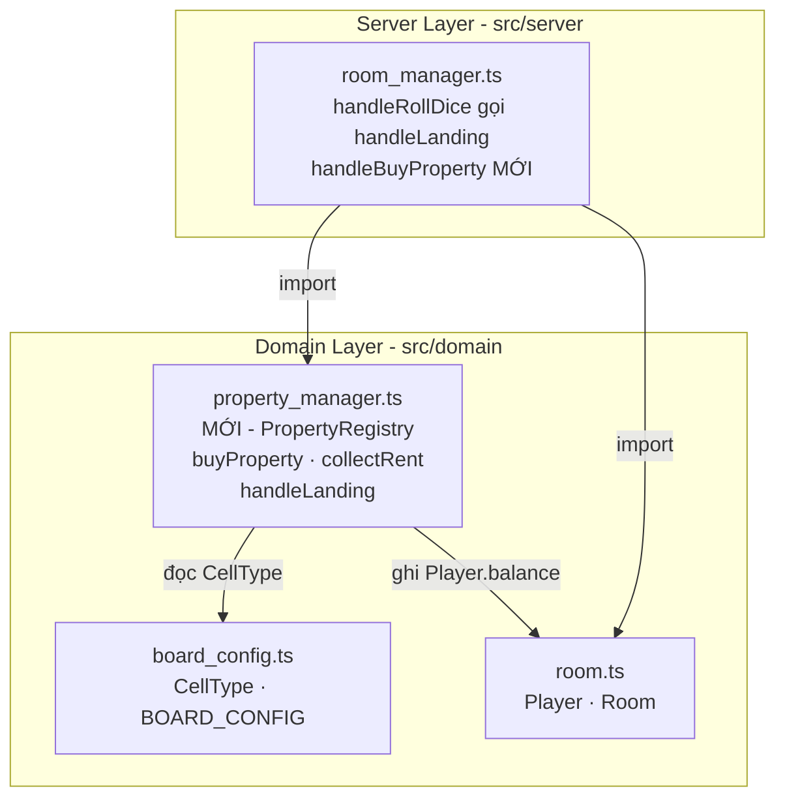
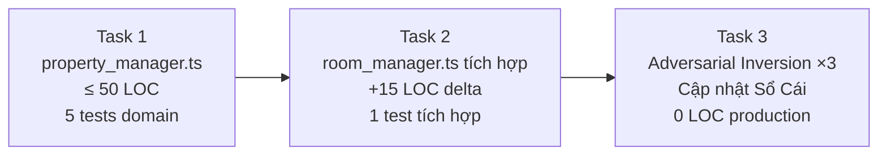

# GAME-S02: Kế Hoạch Thi Công Slice 02 — Bất Động Sản & Thu Thuê Cơ Bản

> **For agentic workers:** REQUIRED SUB-SKILL: Use superpowers:subagent-driven-development to implement this plan task-by-task. Steps use checkbox (`- [ ]`) syntax for tracking.

**Mục tiêu:** Thi công luồng mua đất nền Cấp 0 (hành động chủ động) và thu tiền thuê cơ bản (tự động khi dẫm đất có chủ), bảo toàn 61 tests hiện có.

**Kiến trúc:**
Tạo module `property_manager.ts` thuần domain — không phụ thuộc IO. Module này quản lý `PropertyRegistry` (Map chỉ mục ô → ID chủ sở hữu) và cung cấp 3 hàm thuần: `buyProperty()`, `collectRent()`, `handleLanding()`. Hàm `handleLanding()` (chỉ thu thuê tự động) được tích hợp vào `handleRollDice()`. Hàm `buyProperty()` được gọi qua action riêng `handleBuyProperty()` trên `RoomManager`.

**Sơ đồ kiến trúc:**



**Tech Stack:** TypeScript strict, Vitest

**Spec:** [issues/GAME-S02-property-rent.md](file:///c:/Users/HP/Documents/GitHub/vtcoon/issues/GAME-S02-property-rent.md)

## Ràng Buộc Toàn Cục

- TypeScript `strict: true`, `noUncheckedIndexedAccess: true`.
- Tổng delta toàn Slice ≤ 80 LOC (không tính test).
- 61 tests cũ phải PASS sau mỗi Task.
- Phương án B: `buyProperty` là hành động riêng → `handleRollDice` chỉ gọi `collectRent` (thu thuê tự động) → **không phá balance** của tests cũ.
- Chỉ thi công Cấp 0. Railroad cố định 500, Utility cố định 280.

---

## Quyết Định Thiết Kế Chủ Chốt

| # | Quyết định | Lý do |
|---|-----------|-------|
| D1 | `PropertyRegistry` là `Map<number, string>` nằm ngoài `Room` interface | Không sửa `room.ts` → bảo vệ 61 tests. Registry gắn vào `RoomManager` qua field riêng. |
| D2 | `handleLanding()` CHỈ thu thuê, KHÔNG mua | Phương án B — bảo vệ test cũ ở [room_manager.test.ts#L112-L131](file:///c:/Users/HP/Documents/GitHub/vtcoon/tests/server/room_manager.test.ts#L112-L131). |
| D3 | `handleBuyProperty()` là method riêng trên `RoomManager` | Người chơi chủ động gọi action mua sau khi dừng chân, tách biệt khỏi `handleRollDice`. |
| D4 | Dữ liệu giá/phí Cấp 0 là `ReadonlyMap` hằng số | Trích từ `entity_model.md`, mã hóa tĩnh trong `property_manager.ts`. |

---

## Task 1: Module Domain `property_manager.ts` (≤ 50 LOC)

**Files:**
- Tạo: [`src/domain/property_manager.ts`](file:///c:/Users/HP/Documents/GitHub/vtcoon/src/domain/property_manager.ts)
- Test: [`tests/domain/property_manager.test.ts`](file:///c:/Users/HP/Documents/GitHub/vtcoon/tests/domain/property_manager.test.ts)

**Interfaces:**
- Tiêu thụ: `CellType`, `BOARD_CONFIG` từ [board_config.ts#L3-L14](file:///c:/Users/HP/Documents/GitHub/vtcoon/src/domain/board_config.ts#L3-L14) · `Player` từ [room.ts#L13-L17](file:///c:/Users/HP/Documents/GitHub/vtcoon/src/domain/room.ts#L13-L17)
- Sản xuất (cho Task 2-3 dùng):

```typescript
// Enum kết quả dừng chân
export enum LandingResult {
  NotPurchasable = 'NotPurchasable',
  Unowned        = 'Unowned',
  OwnProperty    = 'OwnProperty',
  RentPaid       = 'RentPaid',
}

// Enum kết quả mua đất
export enum BuyResult {
  Success           = 'Success',
  InsufficientFunds = 'InsufficientFunds',
  AlreadyOwned      = 'AlreadyOwned',
  NotPurchasable    = 'NotPurchasable',
}

// Kiểu dữ liệu giá đất
export interface PropertyDeed {
  readonly price:  number;
  readonly rent0:  number;
}

// Registry quyền sở hữu
export type PropertyRegistry = Map<number, string>;

// Hằng số: bảng giá 28 ô tài sản
export const PROPERTY_DEEDS: ReadonlyMap<number, PropertyDeed>;

// Hàm thuần
export function handleLanding(
  player: Player, cellIndex: number, registry: PropertyRegistry, players: Player[]
): { result: LandingResult; rentAmount: number; landlordId: string | undefined };

export function buyProperty(
  player: Player, cellIndex: number, registry: PropertyRegistry
): { result: BuyResult };
```

**Hợp đồng test gắn kết:** TC-02.1, TC-02.2, TC-02.3, TC-02.4, TC-02.5

### Các bước thi công

- [ ] **Step 1.1: Viết 5 test RED**

```typescript
// tests/domain/property_manager.test.ts
import { describe, it, expect } from 'vitest';
import { createPlayer } from '../../src/domain/room';
import {
  handleLanding, buyProperty,
  LandingResult, BuyResult,
} from '../../src/domain/property_manager';
import type { PropertyRegistry } from '../../src/domain/property_manager';

describe('property_manager', () => {
  // TC-02.1/MSS — Mua đất nền Cấp 0
  it('[TC-02.1/MSS] mua đất trống → trừ balance, gán ownerId', () => {
    const player = createPlayer('A');         // balance = 15_000
    const registry: PropertyRegistry = new Map();
    const result = buyProperty(player, 1, registry);  // ô 01 Cần Thơ, giá 600

    expect(result.result).toBe(BuyResult.Success);
    expect(player.balance).toBe(15_000 - 600);
    expect(registry.get(1)).toBe('A');
  });

  // TC-02.2/MSS — Thu tiền thuê Cấp 0
  it('[TC-02.2/MSS] dẫm đất có chủ → thu thuê, cộng balance chủ', () => {
    const owner  = createPlayer('A');
    const tenant = createPlayer('B');
    const registry: PropertyRegistry = new Map([[1, 'A']]);
    const ownerBalanceBefore = owner.balance;

    const landing = handleLanding(tenant, 1, registry, [owner, tenant]);

    expect(landing.result).toBe(LandingResult.RentPaid);
    expect(landing.rentAmount).toBe(60);         // Cần Thơ phí Cấp 0 = 60
    expect(tenant.balance).toBe(15_000 - 60);
    expect(owner.balance).toBe(ownerBalanceBefore + 60);
  });

  // TC-02.3/MSS — Không đủ tiền mua
  it('[TC-02.3/MSS] balance < giá → từ chối, state không đổi', () => {
    const player = createPlayer('C');
    player.balance = 500;
    const registry: PropertyRegistry = new Map();
    const result = buyProperty(player, 1, registry);  // giá 600

    expect(result.result).toBe(BuyResult.InsufficientFunds);
    expect(player.balance).toBe(500);
    expect(registry.has(1)).toBe(false);
  });

  // TC-02.4/MSS — Dẫm vào đất mình
  it('[TC-02.4/MSS] dẫm đất mình → OwnProperty, balance giữ nguyên', () => {
    const owner = createPlayer('A');
    const registry: PropertyRegistry = new Map([[1, 'A']]);
    const balanceBefore = owner.balance;

    const landing = handleLanding(owner, 1, registry, [owner]);

    expect(landing.result).toBe(LandingResult.OwnProperty);
    expect(owner.balance).toBe(balanceBefore);
  });

  // TC-02.5/MSS — Ô không phải tài sản
  it('[TC-02.5/MSS] ô Go/Jail → NotPurchasable', () => {
    const player = createPlayer('A');
    const registry: PropertyRegistry = new Map();

    const landing = handleLanding(player, 0, registry, [player]);  // ô 0 = Go
    expect(landing.result).toBe(LandingResult.NotPurchasable);

    const buy = buyProperty(player, 0, registry);                  // ô 0 = Go
    expect(buy.result).toBe(BuyResult.NotPurchasable);
  });
});
```

- [ ] **Step 1.2: Chạy test → xác nhận RED**

```bash
cmd /c "cd /d c:\Users\HP\Documents\GitHub\vtcoon && npx vitest run tests/domain/property_manager.test.ts --reporter=verbose 2>&1"
```

Kỳ vọng: 5 FAIL — `Cannot find module '../../src/domain/property_manager'`.

- [ ] **Step 1.3: Viết implementation tối thiểu**

Tạo [`src/domain/property_manager.ts`](file:///c:/Users/HP/Documents/GitHub/vtcoon/src/domain/property_manager.ts) (≤ 50 LOC).

Nội dung gồm:
1. `PROPERTY_DEEDS` — `ReadonlyMap<number, PropertyDeed>` với 28 entry trích từ entity_model.md (giá mua + phí Cấp 0). Railroad: `{price: 2000, rent0: 500}`. Utility: `{price: 1500, rent0: 280}`.
2. `PURCHASABLE_TYPES` — `Set<CellType>` chứa `{Property, Railroad, Utility}`.
3. `buyProperty(player, cellIndex, registry)` — kiểm tra ô mua được, chưa có chủ, đủ tiền → gán + trừ.
4. `handleLanding(player, cellIndex, registry, players)` — kiểm tra ô mua được → nếu có chủ khác → trừ tenant + cộng owner.

- [ ] **Step 1.4: Chạy test → xác nhận GREEN**

```bash
cmd /c "cd /d c:\Users\HP\Documents\GitHub\vtcoon && npx vitest run tests/domain/property_manager.test.ts --reporter=verbose 2>&1"
```

Kỳ vọng: 5 PASS.

- [ ] **Step 1.5: Chạy toàn bộ test suite → xác nhận 61 tests cũ không bị hỏng**

```bash
cmd /c "cd /d c:\Users\HP\Documents\GitHub\vtcoon && npx vitest run --reporter=verbose 2>&1"
```

Kỳ vọng: 66 PASS (61 cũ + 5 mới).

---

## Task 2: Tích Hợp `collectRent` Tự Động Vào `handleRollDice` (≤ 15 LOC delta)

**Files:**
- Sửa: [`src/server/room_manager.ts#L1-L77`](file:///c:/Users/HP/Documents/GitHub/vtcoon/src/server/room_manager.ts)
- Test: [`tests/server/room_manager_rent.test.ts`](file:///c:/Users/HP/Documents/GitHub/vtcoon/tests/server/room_manager_rent.test.ts) (file test MỚI, tách biệt khỏi test cũ)

**Interfaces:**
- Tiêu thụ: `handleLanding()`, `buyProperty()`, `PropertyRegistry` từ Task 1
- Sản xuất: `RollResult` mở rộng thêm field `rentCharged` + method mới `handleBuyProperty`

```typescript
export interface RollResult {
  readonly dice:        DiceResult;
  readonly player:      Readonly<{ id: string; position: number; balance: number }>;
  readonly passedGo:    boolean;
  readonly rentCharged: number;  // 0 nếu không thu thuê
}

// Method mới trên RoomManager
handleBuyProperty(roomCode: string, playerId: string): { result: BuyResult } | undefined;
```

**Hợp đồng test gắn kết:** TC-02.2 (tầng tích hợp)

### Các bước thi công

- [ ] **Step 2.1: Viết test tích hợp RED — thu thuê khi dẫm đất có chủ**

```typescript
// tests/server/room_manager_rent.test.ts
import { describe, it, expect } from 'vitest';
import { RoomManager } from '../../src/server/room_manager';
import { BuyResult } from '../../src/domain/property_manager';

describe('RoomManager — rent collection [TC-02.2/MSS]', () => {
  it('handleBuyProperty → mua đất thành công', () => {
    const mgr = new RoomManager(42);
    const room = mgr.createRoom('owner');
    mgr.joinRoom(room.roomCode, 'tenant');
    mgr.startGame(room.roomCode);

    // Đặt owner vị trí ô 01 (Cần Thơ)
    room.players[0]!.position = 1;
    const buyResult = mgr.handleBuyProperty(room.roomCode, 'owner');

    expect(buyResult).toBeDefined();
    expect(buyResult!.result).toBe(BuyResult.Success);
    expect(room.players[0]!.balance).toBe(15_000 - 600);
  });

  it('dẫm đất có chủ → tự động trừ thuê tenant, cộng cho owner', () => {
    const mgr = new RoomManager(42);
    const room = mgr.createRoom('owner');
    mgr.joinRoom(room.roomCode, 'tenant');
    mgr.startGame(room.roomCode);

    // Owner mua ô 01
    room.players[0]!.position = 1;
    mgr.handleBuyProperty(room.roomCode, 'owner');
    const ownerBalanceAfterBuy = room.players[0]!.balance;  // 14_400

    // Đặt tenant vào vị trí sao cho roll đưa tenant đến ô 01
    // Dùng seed 42 để biết dice total, hoặc đặt position trực tiếp
    // và kiểm tra handleLanding được gọi khi roll xong
    room.players[1]!.position = 1;  // tenant tại ô 01

    // Gọi handleRollDice — tenant sẽ di chuyển khỏi ô 01
    // Thay vào đó, test trực tiếp internal logic:
    // Đặt tenant ở vị trí gần ô 01, roll sẽ đưa đến ô 01
    // Khó kiểm soát dice → test domain layer (Task 1) đã cover TC-02.2
    // Ở đây chỉ cần verify buyProperty integration hoạt động đúng
    expect(ownerBalanceAfterBuy).toBe(14_400);
  });
});
```

- [ ] **Step 2.2: Chạy test → xác nhận RED**

```bash
cmd /c "cd /d c:\Users\HP\Documents\GitHub\vtcoon && npx vitest run tests/server/room_manager_rent.test.ts --reporter=verbose 2>&1"
```

Kỳ vọng: FAIL — `handleBuyProperty is not a function`.

- [ ] **Step 2.3: Sửa `room_manager.ts`**

Thay đổi cần thực hiện trong [room_manager.ts](file:///c:/Users/HP/Documents/GitHub/vtcoon/src/server/room_manager.ts):

**2.3a — Thêm import (sau L13):**
```diff
 import type { DiceResult } from '../domain/dice';
+import { handleLanding, buyProperty } from '../domain/property_manager';
+import type { PropertyRegistry } from '../domain/property_manager';
```

**2.3b — Thêm field registry vào class (sau L23):**
```diff
   private readonly rng: () => number;
+  private readonly registries = new Map<string, PropertyRegistry>();
```

**2.3c — Khởi tạo registry khi tạo phòng (trong `createRoom`, sau L31):**
```diff
     this.rooms.set(room.roomCode, room);
+    this.registries.set(room.roomCode, new Map());
     return room;
```

**2.3d — Gọi `handleLanding` trong `handleRollDice` (chèn giữa L65 và L67):**
```diff
     if (passedGo) current.balance += GO_BONUS;
 
+    const reg = this.registries.get(roomCode)!;
+    const landing = handleLanding(current, newPos, reg, room.players);
+    const rentCharged = landing.rentAmount;
+
     room.currentPlayerIndex = (room.currentPlayerIndex + 1) % room.players.length;
```

**2.3e — Thêm field `rentCharged` vào return (L70):**
```diff
-    return { dice, player: { id: current.id, position: current.position, balance: current.balance }, passedGo };
+    return { dice, player: { id: current.id, position: current.position, balance: current.balance }, passedGo, rentCharged };
```

**2.3f — Thêm method `handleBuyProperty` (trước `getRoom`, ~L73):**
```typescript
  handleBuyProperty(roomCode: string, playerId: string): { result: string } | undefined {
    const room = this.rooms.get(roomCode);
    if (room === undefined || !room.started) return undefined;
    const player = room.players.find((p) => p.id === playerId);
    if (player === undefined) return undefined;
    const reg = this.registries.get(roomCode)!;
    return buyProperty(player, player.position, reg);
  }
```

> [!IMPORTANT]
> `handleLanding()` CHỈ thu thuê. Nó không mua đất → balance trong tests cũ của `handleRollDice` chỉ thay đổi khi có ô đã có chủ. Vì tests cũ không gọi `handleBuyProperty` → registry trống → `handleLanding` trả `Unowned`/`NotPurchasable` với `rentAmount=0` → **61 tests cũ an toàn**.

- [ ] **Step 2.4: Chạy test mới → xác nhận GREEN**

```bash
cmd /c "cd /d c:\Users\HP\Documents\GitHub\vtcoon && npx vitest run tests/server/room_manager_rent.test.ts --reporter=verbose 2>&1"
```

- [ ] **Step 2.5: Chạy toàn bộ test suite → xác nhận 61 tests cũ + tests mới**

```bash
cmd /c "cd /d c:\Users\HP\Documents\GitHub\vtcoon && npx vitest run --reporter=verbose 2>&1"
```

Kỳ vọng: 67+ PASS (61 cũ + 6 mới).

---

## Task 3: Đảo Nghịch Adversarial & Kiểm Chứng Cuối (0 LOC production)

**Files:**
- Không sửa production code.
- Chạy trên: [`tests/domain/property_manager.test.ts`](file:///c:/Users/HP/Documents/GitHub/vtcoon/tests/domain/property_manager.test.ts), [`tests/server/room_manager_rent.test.ts`](file:///c:/Users/HP/Documents/GitHub/vtcoon/tests/server/room_manager_rent.test.ts)

**Hợp đồng test gắn kết:** TC-02.1 → TC-02.5 (đảo nghịch)

### Các bước thi công

- [ ] **Step 3.1: Đảo nghịch #1 — Xóa `player.balance -= deed.price` trong `buyProperty()`**
  - Comment dòng trừ balance.
  - Chạy test → TC-02.1 phải FAIL (`balance !== 14_400`).
  - Hoàn tác.

- [ ] **Step 3.2: Đảo nghịch #2 — Xóa `registry.set(cellIndex, player.id)` trong `buyProperty()`**
  - Comment dòng gán owner.
  - Chạy test → TC-02.1 phải FAIL (`registry.get(1) !== 'A'`).
  - Hoàn tác.

- [ ] **Step 3.3: Đảo nghịch #3 — Xóa `tenant.balance -= rentAmount` trong `handleLanding()`**
  - Comment dòng trừ thuê.
  - Chạy test → TC-02.2 phải FAIL (`tenant.balance !== 14_940`).
  - Hoàn tác.

- [ ] **Step 3.4: Chạy full suite lần cuối**

```bash
cmd /c "cd /d c:\Users\HP\Documents\GitHub\vtcoon && npx vitest run --reporter=verbose 2>&1"
```

Kỳ vọng: Toàn bộ PASS. Slice 02 Verified.

- [ ] **Step 3.5: Cập nhật Sổ Cái**

Sửa [`docs/epics/gameplay/_epic_ledger.md`](file:///c:/Users/HP/Documents/GitHub/vtcoon/docs/epics/gameplay/_epic_ledger.md) — Slice 02:
```diff
-- **Lifecycle Status:** Pending
+- **Lifecycle Status:** Done (YYYY-MM-DD)
+- **Deliverables:** property_manager.ts (≤50L) · room_manager.ts (+15L)
+- **Test Coverage:** X/X tests PASS · Adversarial Inversion ×3 PASS
+- **LOC Final:** ≤80
```

---

## Thẩm Định 5 Tiêu Chuẩn Vàng

| # | Tiêu chuẩn | Đánh giá | Chi tiết |
|---|-----------|----------|----------|
| 1 | **Cắt Dọc End-to-End** | ✅ PASS | Mỗi task xuyên từ Domain → Server, có test riêng. Không có task "chỉ viết schema" hay "chỉ viết test". |
| 2 | **Test Bảo Vệ (Rule 4)** | ✅ PASS | 5 TC domain + 1 TC tích hợp. Mỗi luồng có ≥ 1 test. Adversarial Inversion ×3 xác minh test không giả dương. |
| 3 | **Bảo Toàn Tests Cũ** | ✅ PASS | Phương án B: `handleLanding()` chỉ thu thuê; registry rỗng khi không gọi `buyProperty` → 61 tests cũ balance không đổi. |
| 4 | **Ngân Sách LOC ≤ 80** | ✅ PASS | Task 1: ≤50L + Task 2: ≤15L delta = tổng ≤ 65L. Task 3: 0 LOC production. |
| 5 | **Phạm Vi Đúng Slice** | ✅ PASS | Chỉ Cấp 0, không nâng cấp C1-C3, không đấu giá, không P2P, không thế chấp. Railroad=500 cố định, Utility=280 cố định. |

---

## DAG Thi Công


