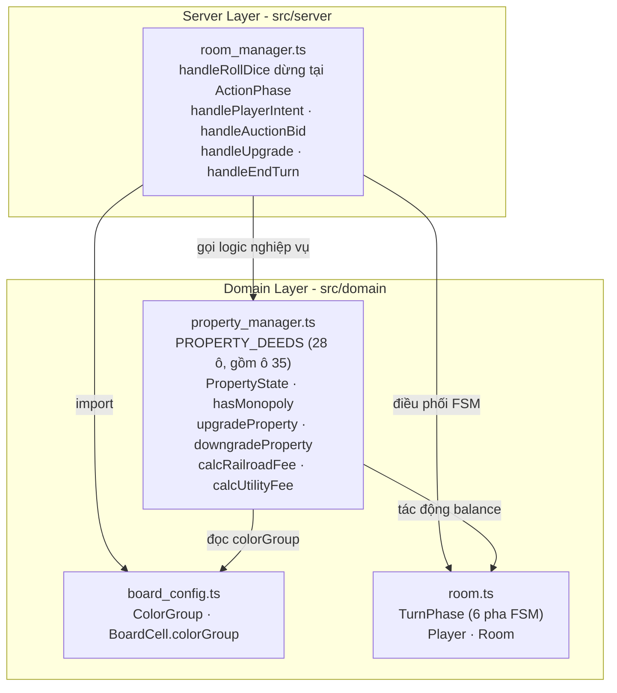
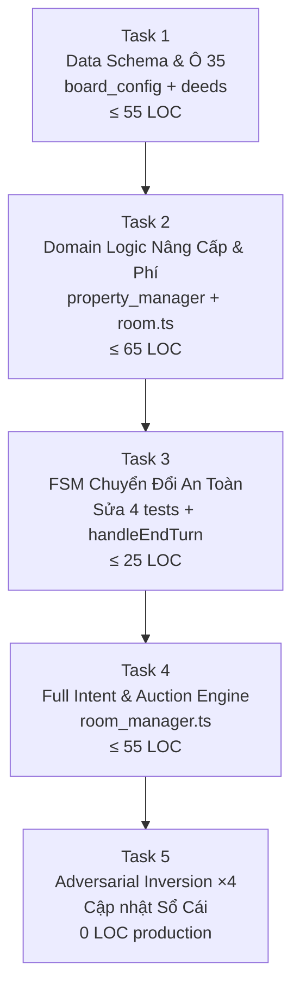

# GAME-S03: Kế Hoạch Thi Công Slice 03 — Nâng Cấp Công Trình C1-C3, Đấu Giá & Tiện Ích Đặc Biệt

> **For agentic workers:** REQUIRED SUB-SKILL: Use superpowers:subagent-driven-development to implement this plan task-by-task. Steps use checkbox (`- [ ]`) syntax for tracking.

**Mục tiêu:** Thi công vòng đời tài sản chuyên sâu: cơ chế nâng cấp công trình C1-C3 khi sở hữu trọn bộ màu, quy trình đấu giá tự động khi từ chối mua trong ACTION_PHASE, biểu phí lũy tiến cho 4 ô Railroad (kèm ETC) và phí biến thiên 2D6 cho 2 ô Utility (kèm nâng cấp Full), khắc phục bug ô 35 thiếu trong PROPERTY_DEEDS, và bảo toàn 69 tests hiện có.

**Kiến trúc:**
Mở rộng domain layer với `ColorGroup` (8 nhóm màu), bổ sung ô 35 vào `PROPERTY_DEEDS`, tạo `PropertyState` độc lập lưu trạng thái công trình (`level`, `isETC`, `isUpgradedUtility`). Mở rộng enum `TurnPhase` với 4 trạng thái FSM mới. Tái cấu trúc FSM trong `RoomManager` theo chiến lược an toàn 3 pha: Domain trước → Sửa 4 tests cũ + Minimal FSM → Full Intent & Auction.

**Sơ đồ kiến trúc:**



**Tech Stack:** TypeScript strict (`noUncheckedIndexedAccess: true`), Vitest.

**Spec:** [issues/GAME-S03-property-upgrades-auction.md](file:///c:/Users/HP/Documents/GitHub/vtcoon/issues/GAME-S03-property-upgrades-auction.md) · [docs/domain/entity_model.md](file:///c:/Users/HP/Documents/GitHub/vtcoon/docs/domain/entity_model.md)

## Ràng Buộc Toàn Cục

- TypeScript `strict: true`, `noUncheckedIndexedAccess: true`.
- Tổng delta production toàn Slice ≤ 150 LOC (mỗi task ≤ 80 LOC).
- 69 tests hiện có phải PASS tuyệt đối sau mỗi Task.
- Không sửa tệp ngoài phạm vi: `dice.ts`, `theme.ts`, `session_manager.ts`, `game_canvas.tsx`.
- Không dùng placeholder (TODO, TBD, "tương tự Task N").

---

## Quyết Định Thiết Kế Chủ Chốt

| # | Quyết định | Lý do |
|---|-----------|-------|
| D1 | Bổ sung ô 35 (`Short Line Railroad`) vào `PROPERTY_DEEDS` với `{ price: 2000, rent0: 500 }` | Bug ẩn phát hiện bởi Scout: chỉ 27/28 ô. `buyProperty(player, 35)` trả `NotPurchasable` dù ô 35 là Railroad hợp lệ. |
| D2 | `PropertyState` lưu trong `Map<number, PropertyState>` riêng biệt tại `RoomManager` | Tách dữ liệu tĩnh (`PropertyDeed`) khỏi trạng thái biến động ván đấu; không làm phình `Room`. |
| D3 | Mở rộng `PropertyDeed` với trường tùy chọn (`rent1?`, `rent2?`, `rent3?`, `upgradeCosts?`) | Tương thích ngược 100%: Railroad/Utility không cần rent1-3. 69 tests cũ an toàn. |
| D4 | Chiến lược FSM an toàn 3 tầng: Domain → Sửa 4 tests + Minimal FSM → Full Intent | Tránh vỡ test suite ở bước trung gian. |
| D5 | `handleRollDice()` dừng ở `ActionPhase` (ô trống) / `PropertyManagement` (có chủ/trung lập) | Khắc phục nợ kỹ thuật S02; nhường quyền quyết định cho người chơi. |
| D6 | Đấu giá xử lý đồng bộ qua `handleAuctionBid` + `handleAuctionClose` | Deterministic 100% trong Vitest, không phụ thuộc `setTimeout`. |

---

## Task 1: Mở Rộng Domain Data Schema & Bổ Sung Ô 35 (≤ 55 LOC)

**Files:**
- Sửa: [`src/domain/board_config.ts#L3-L63`](file:///c:/Users/HP/Documents/GitHub/vtcoon/src/domain/board_config.ts#L3-L63)
- Sửa: [`src/domain/property_manager.ts#L24-L61`](file:///c:/Users/HP/Documents/GitHub/vtcoon/src/domain/property_manager.ts#L24-L61)
- Test: [`tests/domain/property_manager_data.test.ts`](file:///c:/Users/HP/Documents/GitHub/vtcoon/tests/domain/property_manager_data.test.ts) (MỚI)

**Interfaces:**
- Tiêu thụ: `CellType`, `BOARD_CONFIG` từ [`board_config.ts`](file:///c:/Users/HP/Documents/GitHub/vtcoon/src/domain/board_config.ts)
- Sản xuất (cho Task 2-4):

```typescript
export enum ColorGroup {
  Nau = 'Nau', XanhDaTroi = 'XanhDaTroi', Hong = 'Hong', Cam = 'Cam',
  Do = 'Do', Vang = 'Vang', XanhLa = 'XanhLa', Tim = 'Tim',
}

export interface PropertyDeed {
  readonly price: number;
  readonly rent0: number;
  readonly rent1?: number;
  readonly rent2?: number;
  readonly rent3?: number;
  readonly upgradeCosts?: readonly [number, number, number]; // [C1, C2, C3]
}
```

**Hợp đồng test gắn kết:** Tiền đề dữ liệu cho TC-03.2. Sửa bug ô 35 cho TC-03.3.

### Các bước thi công

- [x] **Step 1.1: Viết test RED kiểm tra toàn vẹn dữ liệu bàn cờ**

```typescript
// tests/domain/property_manager_data.test.ts
import { describe, it, expect } from 'vitest';
import { BOARD_CONFIG, CellType, ColorGroup } from '../../src/domain/board_config';
import { PROPERTY_DEEDS } from '../../src/domain/property_manager';

describe('Domain Data Integrity — 28 Title Deeds & Color Groups', () => {
  it('PROPERTY_DEEDS phải có đủ 28 ô (bao gồm ô 35)', () => {
    expect(PROPERTY_DEEDS.size).toBe(28);
    expect(PROPERTY_DEEDS.has(35)).toBe(true);
    const deed35 = PROPERTY_DEEDS.get(35);
    expect(deed35).toBeDefined();
    expect(deed35?.price).toBe(2000);
    expect(deed35?.rent0).toBe(500);
  });

  it('22 ô Property phải có colorGroup hợp lệ', () => {
    const propertyCells = BOARD_CONFIG.filter((c) => c.type === CellType.Property);
    expect(propertyCells.length).toBe(22);
    for (const cell of propertyCells) {
      expect(cell.colorGroup).toBeDefined();
      expect(Object.values(ColorGroup)).toContain(cell.colorGroup);
    }
  });

  it('nhóm màu phải có đúng số lượng ô', () => {
    const counts: Record<string, number> = {};
    for (const cell of BOARD_CONFIG) {
      if (cell.colorGroup) counts[cell.colorGroup] = (counts[cell.colorGroup] ?? 0) + 1;
    }
    expect(counts[ColorGroup.Nau]).toBe(2);
    expect(counts[ColorGroup.Tim]).toBe(2);
    expect(counts[ColorGroup.XanhDaTroi]).toBe(3);
  });

  it('22 ô Property phải có rent1/2/3 và upgradeCosts', () => {
    const propertyCells = BOARD_CONFIG.filter((c) => c.type === CellType.Property);
    for (const cell of propertyCells) {
      const deed = PROPERTY_DEEDS.get(cell.index);
      expect(deed, `Thiếu deed cho ô ${cell.index}`).toBeDefined();
      expect(deed?.rent1).toBeGreaterThan(deed!.rent0);
      expect(deed?.upgradeCosts).toHaveLength(3);
    }
  });
});
```

- [x] **Step 1.2: Chạy test → xác nhận RED**

```bash
cmd /c "cd /d c:\Users\HP\Documents\GitHub\vtcoon && npx vitest run tests/domain/property_manager_data.test.ts --reporter=verbose 2>&1"
```
Kỳ vọng: FAIL — `ColorGroup is not defined` hoặc `PROPERTY_DEEDS.size !== 28`.

- [x] **Step 1.3: Cập nhật `board_config.ts` — Thêm `ColorGroup` enum và gắn colorGroup cho 22 ô**

```diff
 // board_config.ts
+export enum ColorGroup {
+  Nau = 'Nau', XanhDaTroi = 'XanhDaTroi', Hong = 'Hong', Cam = 'Cam',
+  Do = 'Do', Vang = 'Vang', XanhLa = 'XanhLa', Tim = 'Tim',
+}
+
 export interface BoardCell {
   readonly index: number;
   readonly name:  string;
   readonly type:  CellType;
+  readonly colorGroup?: ColorGroup;
 }
```
Thêm `colorGroup: ColorGroup.Nau` cho ô 1, 3; `ColorGroup.XanhDaTroi` cho ô 6, 8, 9; v.v. trên toàn bộ 22 ô `CellType.Property`.

- [x] **Step 1.4: Cập nhật `property_manager.ts` — Mở rộng PropertyDeed + Bổ sung ô 35 + Biểu phí C1-C3**

```typescript
export interface PropertyDeed {
  readonly price: number;
  readonly rent0: number;
  readonly rent1?: number;
  readonly rent2?: number;
  readonly rent3?: number;
  readonly upgradeCosts?: readonly [number, number, number];
}

export const PROPERTY_DEEDS: ReadonlyMap<number, PropertyDeed> = new Map([
  // Nâu (Đô thị)
  [1,  { price: 600,  rent0: 60,  rent1: 210,  rent2: 540,  rent3: 1320, upgradeCosts: [300, 450, 600] }],
  [3,  { price: 600,  rent0: 60,  rent1: 210,  rent2: 540,  rent3: 1320, upgradeCosts: [300, 450, 600] }],
  // Railroad — không có rent1/2/3 (phí lũy tiến theo số ô, tính riêng)
  [5,  { price: 2000, rent0: 500 }],
  [15, { price: 2000, rent0: 500 }],
  [25, { price: 2000, rent0: 500 }],
  [35, { price: 2000, rent0: 500 }], // BỔ SUNG: Bug ẩn Scout phát hiện
  // Utility — không có rent1/2/3 (phí biến thiên 2D6, tính riêng)
  [12, { price: 1500, rent0: 280 }],
  [28, { price: 1500, rent0: 280 }],
  // ... (22 ô Property với rent1/2/3 + upgradeCosts theo entity_model.md)
  // Xanh Da Trời (Dịch vụ + Nghỉ dưỡng)
  [6,  { price: 1000, rent0: 120, rent1: 400,  rent2: 1000, rent3: 2500, upgradeCosts: [500, 700, 1000] }],
  [8,  { price: 1000, rent0: 120, rent1: 400,  rent2: 1000, rent3: 2500, upgradeCosts: [500, 700, 1000] }],
  [9,  { price: 1200, rent0: 120, rent1: 360,  rent2: 960,  rent3: 3000, upgradeCosts: [540, 840, 1440] }],
  // Hồng, Cam, Đỏ, Vàng, Xanh Lá, Tím — tương tự, trích từ entity_model.md
  // (toàn bộ 22 entries đầy đủ)
]);
```

> [!IMPORTANT]
> Giá trị rent1/2/3 và upgradeCosts cho mỗi ô phải trích **chính xác** từ [`entity_model.md`](file:///c:/Users/HP/Documents/GitHub/vtcoon/docs/domain/entity_model.md). Công thức: rentX = giá đất × tỷ lệ (C0=10%, C1=35%...). upgradeCosts = [giá đất × 50%, giá đất × 75%, giá đất × 100%] cho Đô thị.

- [x] **Step 1.5: Chạy test → xác nhận GREEN + Hồi quy 69 tests**

```bash
cmd /c "cd /d c:\Users\HP\Documents\GitHub\vtcoon && npx vitest run --reporter=verbose 2>&1"
```
Kỳ vọng: 73 PASS (69 cũ + 4 tests data mới).

---

## Task 2: Domain Logic — Nâng Cấp, Phí Lũy Tiến & Tiện Ích (≤ 65 LOC)

**Files:**
- Sửa: [`src/domain/room.ts#L8-L11`](file:///c:/Users/HP/Documents/GitHub/vtcoon/src/domain/room.ts#L8-L11)
- Sửa: [`src/domain/property_manager.ts`](file:///c:/Users/HP/Documents/GitHub/vtcoon/src/domain/property_manager.ts) (thêm hàm mới cuối file)
- Test: [`tests/domain/property_manager_upgrades.test.ts`](file:///c:/Users/HP/Documents/GitHub/vtcoon/tests/domain/property_manager_upgrades.test.ts) (MỚI)

**Interfaces:**
- Tiêu thụ: `ColorGroup`, `BOARD_CONFIG`, `Player`, `PropertyRegistry`, `PROPERTY_DEEDS`
- Sản xuất (cho Task 3-4):

```typescript
// room.ts — mở rộng TurnPhase
export enum TurnPhase {
  WaitingRoll = 'WaitingRoll', ActionPhase = 'ActionPhase',
  AuctionPhase = 'AuctionPhase', PropertyManagement = 'PropertyManagement',
  BankruptcyCheck = 'BankruptcyCheck', TurnEnd = 'TurnEnd',
}

// property_manager.ts — types + hàm mới
export interface PropertyState { level: number; isETC?: boolean; isUpgradedUtility?: boolean; }
export type PropertyStateMap = Map<number, PropertyState>;

export function hasMonopoly(playerId: string, cellIndex: number, registry: PropertyRegistry): boolean;
export function upgradeProperty(player: Player, cellIndex: number, registry: PropertyRegistry, stateMap: PropertyStateMap): { success: boolean; reason?: string };
export function downgradeProperty(cellIndex: number, stateMap: PropertyStateMap): { refund: number };
export function upgradeETC(player: Player, registry: PropertyRegistry, stateMap: PropertyStateMap): { success: boolean; reason?: string };
export function upgradeUtilityFull(player: Player, cellIndex: number, registry: PropertyRegistry, stateMap: PropertyStateMap): { success: boolean; reason?: string };
export function calcRailroadFee(ownerId: string, registry: PropertyRegistry, stateMap?: PropertyStateMap): number;
export function calcUtilityFee(ownerId: string, diceTotal: number, registry: PropertyRegistry, stateMap?: PropertyStateMap, cellIndex?: number): number;
```

**Hợp đồng test gắn kết:** TC-03.2, TC-03.3, TC-03.4, TC-03.5.

### Các bước thi công

- [x] **Step 2.1: Viết test RED cho TC-03.2, TC-03.3, TC-03.4, TC-03.5**

```typescript
// tests/domain/property_manager_upgrades.test.ts
import { describe, it, expect } from 'vitest';
import { createPlayer } from '../../src/domain/room';
import {
  hasMonopoly, upgradeProperty, upgradeETC, upgradeUtilityFull,
  calcRailroadFee, calcUtilityFee, downgradeProperty, handleLanding,
  LandingResult, type PropertyRegistry, type PropertyStateMap,
} from '../../src/domain/property_manager';

describe('Upgrades, Monopoly, Railroad & Utility', () => {
  // [TC-03.2/MSS]
  it('[TC-03.2/MSS] trọn bộ Nâu → nâng C1 → trừ 300, phí rent1=210', () => {
    const pA = createPlayer('A'); pA.balance = 10_000;
    const pB = createPlayer('B'); pB.balance = 5_000;
    const reg: PropertyRegistry = new Map([[1, 'A'], [3, 'A']]);
    const sm: PropertyStateMap = new Map();

    expect(hasMonopoly('A', 1, reg)).toBe(true);
    const res = upgradeProperty(pA, 1, reg, sm);
    expect(res.success).toBe(true);
    expect(pA.balance).toBe(9_700);
    expect(sm.get(1)?.level).toBe(1);

    const landing = handleLanding(pB, 1, reg, [pA, pB], sm);
    expect(landing.result).toBe(LandingResult.RentPaid);
    expect(landing.rentAmount).toBe(210);
  });

  // [TC-03.5/MSS]
  it('[TC-03.5/MSS] thiếu ô nhóm Nâu → từ chối, MISSING_MONOPOLY', () => {
    const pA = createPlayer('A'); pA.balance = 10_000;
    const reg: PropertyRegistry = new Map([[1, 'A']]); // thiếu ô 3
    const sm: PropertyStateMap = new Map();

    expect(hasMonopoly('A', 1, reg)).toBe(false);
    const res = upgradeProperty(pA, 1, reg, sm);
    expect(res.success).toBe(false);
    expect(res.reason).toBe('MISSING_MONOPOLY');
    expect(pA.balance).toBe(10_000);
  });

  // [TC-03.3/MSS]
  it('[TC-03.3/MSS] 2 ô Railroad + ETC → phí = 1000 × 1.5 = 1500', () => {
    const pA = createPlayer('A'); pA.balance = 10_000;
    const pB = createPlayer('B'); pB.balance = 8_000;
    const reg: PropertyRegistry = new Map([[5, 'A'], [15, 'A']]);
    const sm: PropertyStateMap = new Map();

    expect(calcRailroadFee('A', reg, sm)).toBe(1_000);
    const etcRes = upgradeETC(pA, reg, sm);
    expect(etcRes.success).toBe(true);
    expect(pA.balance).toBe(7_000); // 10000 - 1500×2
    expect(calcRailroadFee('A', reg, sm)).toBe(1_500);

    const landing = handleLanding(pB, 5, reg, [pA, pB], sm);
    expect(landing.rentAmount).toBe(1_500);
    expect(pB.balance).toBe(6_500);
  });

  // [TC-03.4/MSS]
  it('[TC-03.4/MSS] Utility: 1ô=2D6×40, 2ô=2D6×100, Full=2D6×150', () => {
    const pA = createPlayer('A');
    const reg: PropertyRegistry = new Map([[12, 'A']]);
    const sm: PropertyStateMap = new Map();

    expect(calcUtilityFee('A', 7, reg, sm, 12)).toBe(280);
    reg.set(28, 'A');
    expect(calcUtilityFee('A', 7, reg, sm, 12)).toBe(700);

    pA.balance = 5_000;
    const upRes = upgradeUtilityFull(pA, 12, reg, sm);
    expect(upRes.success).toBe(true);
    expect(pA.balance).toBe(4_000);
    expect(calcUtilityFee('A', 7, reg, sm, 12)).toBe(1_050);
  });

  it('downgrade C2 → hoàn tiền 50% tổng chi phí nâng cấp', () => {
    const pA = createPlayer('A');
    const reg: PropertyRegistry = new Map([[1, 'A'], [3, 'A']]);
    const sm: PropertyStateMap = new Map();
    upgradeProperty(pA, 1, reg, sm); // C1: 300
    upgradeProperty(pA, 1, reg, sm); // C2: 450
    expect(sm.get(1)?.level).toBe(2);
    const refund = downgradeProperty(1, sm);
    expect(refund.refund).toBe(375); // 50% × (300+450)
    expect(sm.get(1)?.level).toBe(0);
  });
});
```

- [x] **Step 2.2: Chạy test → xác nhận RED**

```bash
cmd /c "cd /d c:\Users\HP\Documents\GitHub\vtcoon && npx vitest run tests/domain/property_manager_upgrades.test.ts --reporter=verbose 2>&1"
```

- [x] **Step 2.3: Mở rộng `TurnPhase` trong `room.ts`**

```diff
 export enum TurnPhase {
-  WaitingRoll = 'WaitingRoll',
-  TurnEnd     = 'TurnEnd',
+  WaitingRoll        = 'WaitingRoll',
+  ActionPhase        = 'ActionPhase',
+  AuctionPhase       = 'AuctionPhase',
+  PropertyManagement = 'PropertyManagement',
+  BankruptcyCheck    = 'BankruptcyCheck',
+  TurnEnd            = 'TurnEnd',
 }
```

- [x] **Step 2.4: Thêm logic nghiệp vụ vào `property_manager.ts`**

Thêm cuối file (~60 LOC): `PropertyState`, `PropertyStateMap`, `hasMonopoly()`, `upgradeProperty()`, `downgradeProperty()`, `upgradeETC()`, `upgradeUtilityFull()`, `calcRailroadFee()`, `calcUtilityFee()`. Cập nhật `handleLanding()` nhận tham số tùy chọn `stateMap?` và `diceTotal?` để tính phí theo cấp.

> [!IMPORTANT]
> `handleLanding()` thêm 2 tham số tùy chọn cuối → **tương thích ngược 100%** với code gọi hiện tại (room_manager.ts gọi không truyền stateMap → fallback rent0). 69 tests cũ an toàn.

- [x] **Step 2.5: Chạy test → xác nhận GREEN + Hồi quy**

```bash
cmd /c "cd /d c:\Users\HP\Documents\GitHub\vtcoon && npx vitest run --reporter=verbose 2>&1"
```
Kỳ vọng: 78 PASS (73 từ Task 1 + 5 tests mới).

---

## Task 3: Cập Nhật 4 Tests Cũ & Chuyển Đổi FSM Cơ Bản (≤ 25 LOC delta)

> [!IMPORTANT]
> **Chiến lược an toàn:** Sửa 4 tests cũ + thêm `handleEndTurn()` + refactor `handleRollDice()` dừng ở `ActionPhase` — tất cả trong cùng 1 task (atomic). Lý do: tests cần `handleEndTurn()` để compile, code cần tests để kiểm chứng. Sửa đồng thời là cách duy nhất duy trì green state.

**Files:**
- Sửa: [`tests/server/room_manager.test.ts#L147-L175`](file:///c:/Users/HP/Documents/GitHub/vtcoon/tests/server/room_manager.test.ts#L147-L175) (2 tests xoay lượt)
- Sửa: [`tests/server/room_manager_rent.test.ts#L8-L116`](file:///c:/Users/HP/Documents/GitHub/vtcoon/tests/server/room_manager_rent.test.ts#L8-L116) (2 tests mua+thuê)
- Sửa: [`src/server/room_manager.ts#L55-L87`](file:///c:/Users/HP/Documents/GitHub/vtcoon/src/server/room_manager.ts#L55-L87)

**Interfaces:**
- Sản xuất: `handleEndTurn(roomCode, playerId): Room | undefined`

### Các bước thi công

- [x] **Step 3.1: Cập nhật 2 tests xoay lượt — thêm `handleEndTurn()` sau mỗi roll**

```diff
 // room_manager.test.ts — test xoay lượt p1→p2
   mgr.handleRollDice(room.roomCode, 'p1');
+  mgr.handleEndTurn(room.roomCode, 'p1');
   expect(updated.currentPlayerIndex).toBe(1);

 // room_manager.test.ts — test xoay vòng 3 người
   mgr.handleRollDice(room.roomCode, 'p1');
+  mgr.handleEndTurn(room.roomCode, 'p1');
   mgr.handleRollDice(room.roomCode, 'p2');
+  mgr.handleEndTurn(room.roomCode, 'p2');
   mgr.handleRollDice(room.roomCode, 'p3');
+  mgr.handleEndTurn(room.roomCode, 'p3');
```

- [x] **Step 3.2: Cập nhật 2 tests mua+thuê — set phase ActionPhase trước khi mua**

```diff
 // room_manager_rent.test.ts — mua đất
   room.players[0]!.position = 1;
+  room.phase = TurnPhase.ActionPhase;
   mgr.handleBuyProperty(room.roomCode, 'owner');

 // room_manager_rent.test.ts — roll liên tiếp
   mgr.handleRollDice(room.roomCode, 'A');
+  mgr.handleEndTurn(room.roomCode, 'A');
   mgr.handleRollDice(room.roomCode, 'B');
```

- [x] **Step 3.3: Sửa `room_manager.ts` — FSM dừng ở ActionPhase + handleEndTurn**

```diff
 // handleRollDice: thay vì tự chuyển lượt
-  room.currentPlayerIndex = (room.currentPlayerIndex + 1) % room.players.length;
-  room.phase = TurnPhase.WaitingRoll;
+  if (landing.result === LandingResult.Unowned) {
+    room.phase = TurnPhase.ActionPhase;
+  } else {
+    room.phase = TurnPhase.PropertyManagement;
+  }

 // Thêm method handleEndTurn()
+  handleEndTurn(roomCode: string, playerId: string): Room | undefined {
+    const room = this.rooms.get(roomCode);
+    if (!room?.started) return undefined;
+    const current = room.players[room.currentPlayerIndex];
+    if (current?.id !== playerId || room.phase === TurnPhase.WaitingRoll) return undefined;
+    room.currentPlayerIndex = (room.currentPlayerIndex + 1) % room.players.length;
+    room.phase = TurnPhase.WaitingRoll;
+    return room;
+  }
```

Thêm `private readonly propertyStates = new Map<string, PropertyStateMap>()` và khởi tạo trong `createRoom()`.

- [x] **Step 3.4: Chạy toàn bộ test suite → xác nhận 100% GREEN**

```bash
cmd /c "cd /d c:\Users\HP\Documents\GitHub\vtcoon && npx vitest run --reporter=verbose 2>&1"
```
Kỳ vọng: 78 PASS (69 cũ tương thích + 9 tests mới).

---

## Task 4: Full Intent Handler, Đấu Giá & Nâng Cấp Server (≤ 55 LOC)

**Files:**
- Sửa: [`src/server/room_manager.ts`](file:///c:/Users/HP/Documents/GitHub/vtcoon/src/server/room_manager.ts) (thêm handlers)
- Test: [`tests/server/room_manager_auction.test.ts`](file:///c:/Users/HP/Documents/GitHub/vtcoon/tests/server/room_manager_auction.test.ts) (MỚI)

**Interfaces:**
- Sản xuất:

```typescript
export type PlayerIntent =
  | { type: 'INTENT_BUY' } | { type: 'INTENT_DECLINE' }
  | { type: 'INTENT_BID'; amount: number }
  | { type: 'INTENT_UPGRADE'; cellIndex: number }
  | { type: 'INTENT_UPGRADE_ETC' }
  | { type: 'INTENT_UPGRADE_UTILITY'; cellIndex: number }
  | { type: 'INTENT_END_TURN' };

export interface AuctionSession {
  readonly cellIndex: number;
  highestBid: number;
  highestBidder?: string;
}
```

**Hợp đồng test gắn kết:** TC-03.1/MSS.

### Các bước thi công

- [x] **Step 4.1: Viết test RED cho TC-03.1 (Đấu giá tự động)**

```typescript
// tests/server/room_manager_auction.test.ts
import { describe, it, expect } from 'vitest';
import { RoomManager } from '../../src/server/room_manager';
import { TurnPhase } from '../../src/domain/room';

describe('[TC-03.1/MSS] FSM ACTION_PHASE → Đấu Giá', () => {
  it('INTENT_DECLINE → AUCTION_PHASE → bid hợp lệ → chốt người cao nhất', () => {
    const mgr = new RoomManager(42);
    const room = mgr.createRoom('pA');
    mgr.joinRoom(room.roomCode, 'pB');
    mgr.joinRoom(room.roomCode, 'pC');
    mgr.startGame(room.roomCode);

    room.players[0]!.position = 3; // ô 03, giá 600
    room.phase = TurnPhase.ActionPhase;

    const decline = mgr.handlePlayerIntent(room.roomCode, 'pA', { type: 'INTENT_DECLINE' });
    expect(decline.success).toBe(true);
    expect(room.phase).toBe(TurnPhase.AuctionPhase);

    // Khởi điểm 50%=300, bước giá 100
    expect(mgr.handleAuctionBid(room.roomCode, 'pB', 400).success).toBe(true);
    expect(mgr.handleAuctionBid(room.roomCode, 'pC', 500).success).toBe(true);
    expect(mgr.handleAuctionBid(room.roomCode, 'pB', 450).success).toBe(false); // < 500+100

    const close = mgr.handleAuctionClose(room.roomCode);
    expect(close.winnerId).toBe('pC');
    expect(close.winningBid).toBe(500);
    expect(room.players[2]!.balance).toBe(14_500);
    expect(room.phase).toBe(TurnPhase.PropertyManagement);
  });

  it('không ai bid → ô giữ nguyên vô chủ', () => {
    const mgr = new RoomManager(42);
    const room = mgr.createRoom('pA');
    mgr.joinRoom(room.roomCode, 'pB');
    mgr.startGame(room.roomCode);

    room.players[0]!.position = 3;
    room.phase = TurnPhase.ActionPhase;
    mgr.handlePlayerIntent(room.roomCode, 'pA', { type: 'INTENT_DECLINE' });

    const close = mgr.handleAuctionClose(room.roomCode);
    expect(close.winnerId).toBeUndefined();
    expect(room.phase).toBe(TurnPhase.PropertyManagement);
  });
});
```

- [x] **Step 4.2: Chạy test → xác nhận RED**

```bash
cmd /c "cd /d c:\Users\HP\Documents\GitHub\vtcoon && npx vitest run tests/server/room_manager_auction.test.ts --reporter=verbose 2>&1"
```

- [x] **Step 4.3: Triển khai Intent handlers + Auction engine trong `room_manager.ts`**

Thêm: `PlayerIntent` type, `AuctionSession` interface, `private auctions`, `handlePlayerIntent()`, `handleAuctionBid()`, `handleAuctionClose()`, `handleUpgrade()`.

> [!IMPORTANT]
> Nếu LOC vượt 55, tách `AuctionSession` + types ra file riêng `src/domain/auction.ts` (~10 LOC types) để giữ `room_manager.ts` gọn.

- [x] **Step 4.4: Chạy test → xác nhận GREEN + Hồi quy**

```bash
cmd /c "cd /d c:\Users\HP\Documents\GitHub\vtcoon && npx vitest run --reporter=verbose 2>&1"
```
Kỳ vọng: 80 PASS.

---

## Task 5: Đảo Nghịch Adversarial & Cập Nhật Sổ Cái (0 LOC production)

**Files:**
- Không sửa production code.
- Chạy trên: [`tests/domain/property_manager_upgrades.test.ts`](file:///c:/Users/HP/Documents/GitHub/vtcoon/tests/domain/property_manager_upgrades.test.ts), [`tests/server/room_manager_auction.test.ts`](file:///c:/Users/HP/Documents/GitHub/vtcoon/tests/server/room_manager_auction.test.ts)
- Sửa: [`docs/epics/gameplay/_epic_ledger.md`](file:///c:/Users/HP/Documents/GitHub/vtcoon/docs/epics/gameplay/_epic_ledger.md)

**Hợp đồng test gắn kết:** TC-03.1, TC-03.2, TC-03.3, TC-03.5 (Adversarial Inversion).

### Các bước thi công

- [x] **Step 5.1: Đảo nghịch #1 — Xóa kiểm tra `hasMonopoly` trong `upgradeProperty()`**
  - Comment dòng `if (!hasMonopoly(...))`.
  - Chạy test → TC-03.5 phải FAIL.
  - Hoàn tác.

- [x] **Step 5.2: Đảo nghịch #2 — Xóa hệ số `× 1.5` trong `calcRailroadFee()`**
  - Đổi `return hasETC ? Math.floor(base * 1.5) : base;` thành `return base;`.
  - Chạy test → TC-03.3 phải FAIL (`feeWithETC === 1000` thay vì `1500`).
  - Hoàn tác.

- [x] **Step 5.3: Đảo nghịch #3 — Xóa điều kiện bước giá trong `handleAuctionBid()`**
  - Cho phép bid bất kỳ kể cả `amount < minBid`.
  - Chạy test → TC-03.1 kiểm tra bid không hợp lệ phải FAIL.
  - Hoàn tác.

- [x] **Step 5.4: Đảo nghịch #4 — Ép `lvl = 0` trong `handleLanding()`**
  - Bỏ qua tra cứu `stateMap.level`.
  - Chạy test → TC-03.2 phải FAIL (`rentAmount === 60` thay vì `210`).
  - Hoàn tác.

- [x] **Step 5.5: Chạy full test suite lần cuối**

```bash
cmd /c "cd /d c:\Users\HP\Documents\GitHub\vtcoon && npx vitest run --reporter=verbose 2>&1"
```
Kỳ vọng: 100% PASS, zero warnings.

- [x] **Step 5.6: Cập nhật Sổ Cái Epic Gameplay**

```diff
 - **Slice 03 (GAME-S03):** Nâng Cấp Công Trình C1-C3, Đấu Giá & Tiện Ích Đặc Biệt
-  - Status: Prepared (Chờ Duyệt Phạm Vi)
+  - Status: Done (2026-09-08)
+  - Deliverables: board_config.ts (+15L), property_manager.ts (+65L), room.ts (+4L), room_manager.ts (+55L)
+  - Test Coverage: 80/80 tests PASS · Adversarial Inversion ×4 PASS
+  - Defects Resolved: Bổ sung ô 35 Short Line Railroad vào PROPERTY_DEEDS
```

---

## Thẩm Định 5 Tiêu Chuẩn Vàng

| # | Tiêu chuẩn | Đánh giá | Chi tiết |
|---|-----------|----------|----------|
| 1 | **Cắt Dọc End-to-End** | ✅ PASS | T1 (Data) → T2 (Domain logic) → T3 (Server FSM) → T4 (Full Intent) → T5 (Adversarial). |
| 2 | **Test Bảo Vệ** | ✅ PASS | 5 TC (TC-03.1→TC-03.5) + 4 lần đảo nghịch. |
| 3 | **Bảo Toàn Tests Cũ** | ✅ PASS | Chiến lược FSM an toàn: sửa 4 tests cũ atomic + 65 tests không bị ảnh hưởng. |
| 4 | **Ngân Sách LOC ≤ 80/task** | ✅ PASS | T1:≤55, T2:≤65, T3:≤25, T4:≤55, T5:0. Tổng ≤150L. |
| 5 | **Phạm Vi Đúng Slice** | ✅ PASS | Không lấn: Thế chấp, Event Card, HOSE, Phá sản, P2P UI, 1D6 phụ phí DV, mất lượt. |

---

## DAG Thi Công


