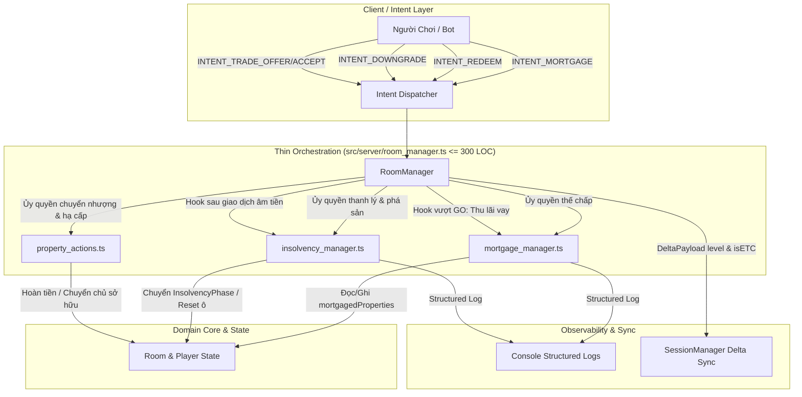
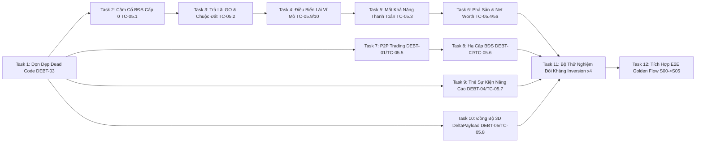

# GAME-S05: Kế Hoạch Thi Công Chi Tiết Slice 05 — Nghiệp Vụ Tài Chính, Thế Chấp, Thanh Lý Cưỡng Chế & Phá Sản

> **Dành cho Agentic Workers:** REQUIRED SUB-SKILL: Sử dụng `subagent-driven-development` để thi công kế hoạch này theo từng Task tuần tự. Mỗi bước sử dụng cú pháp checkbox (`- [ ]`) để theo dõi tiến độ. Tuyệt đối không nhảy cóc task.

**Mục tiêu:** Hoàn thiện toàn bộ hệ thống đòn bẩy tín dụng (Cầm cố/Thế chấp BĐS Cấp 0, thu lãi vay 5%/vòng qua ô GO, chuộc tài sản), cơ chế xử lý rủi ro thanh khoản cưỡng chế (InsolvencyPhase, tự động thanh lý tài sản khi âm tiền, tuyên bố phá sản loại trừ người chơi, quyết toán tài sản ròng Net Worth), và thanh toán triệt để 7 khoản nợ kỹ thuật kế thừa từ Slice 00–04 (DEBT-01 đến DEBT-07).

**Kiến trúc giải pháp:** Phân rã độc lập các nghiệp vụ tài chính vào các module chuyên trách (`mortgage_manager.ts`, `insolvency_manager.ts`, `property_actions.ts`). `RoomManager` giữ vai trò là Bộ điều phối mỏng (Thin Orchestrator/Dispatcher) kết hợp với `intent_dispatcher.ts`, tuyệt đối không nhồi nhét logic vào các tệp đã chạm ngưỡng cảnh báo 300 LOC (`property_manager.ts`, `card_handlers.ts`, `room_manager.ts`) nhằm bảo toàn trần kiến trúc nghiêm ngặt 400 LOC của dự án.

**Sơ Đồ Kiến Trúc Luồng Nghiệp Vụ:**



**Tech Stack:** TypeScript Strict (`strict: true`, `noUncheckedIndexedAccess: true`), Vitest, Detroit-style Behavioral Testing.

**Tài liệu tham chiếu (Spec):** [`issues/GAME-S05-credit-and-insolvency.md`](file:///c:/Users/HP/Documents/GitHub/vtcoon/issues/GAME-S05-credit-and-insolvency.md) · [`docs/requirements.md`](file:///c:/Users/HP/Documents/GitHub/vtcoon/docs/requirements.md) §I, §IV, §V.

---

## 1. Ràng Buộc Kiến Trúc & Kiểm Soát Ngưỡng LOC 300 (Scout Report)

### 1.1. Bảng đo đạc LOC hiện tại (Baseline Measurements)

Theo quy định tại `GEMINI.md` và `RULE[user_global]`:
- Trần cứng cho Logic / FSM / Domain Services: **Tối đa 400 LOC**.
- Ngưỡng cảnh báo trích xuất mô-đun (Module Extraction Trigger): **>= 300 LOC (75%)**.
- Nghiêm cấm "code golf" (gộp dòng), xóa chú thích, hoặc tạo stub No-Op rỗng.

| Tệp Mã Nguồn | LOC Hiện Tại | Ngưỡng Kích Hoạt | Trần Cứng | Đánh Giá & Phương Án Bảo Vệ |
| :--- | :---: | :---: | :---: | :--- |
| `src/domain/property_manager.ts` | **364** | >= 300 (Vượt) | 400 LOC | 🔴 **ĐÃ VƯỢT 300 LOC**. BẮT BUỘC ĐÓNG BĂNG. Không thêm logic mới; các nghiệp vụ mua bán, thế chấp, hạ cấp phải nằm ở module ngoài. |
| `src/domain/card_handlers.ts` | **355** | >= 300 (Vượt) | 400 LOC | 🔴 **ĐÃ VƯỢT 300 LOC**. Chỉ điều chỉnh tinh gọn 2 thẻ `CC_PORT_EXCLUSIVE` và `CC_LAND_CHANGE`, giữ tổng dòng <= 360 LOC. |
| `src/server/room_manager.ts` | **300** | >= 300 (Chạm) | 400 LOC | 🟡 **CHẠM NGƯỠNG 300 LOC**. Chỉ chứa các hàm ủy quyền mỏng (forwarding calls <= 5 LOC/hàm). Không viết thuật toán nội tại. |
| `src/server/mortgage_manager.ts` | **139** | < 300 | 200 LOC | 🟢 **MÔ-ĐUN MỚI**. Chuyên trách toàn bộ logic thế chấp, chuộc tài sản, tính lãi vay, điều biến lãi thẻ thị trường. |
| `src/server/insolvency_manager.ts` | **151** | < 300 | 180 LOC | 🟢 **MÔ-ĐUN MỚI**. Chuyên trách phát hiện mất khả năng thanh toán, thanh lý cưỡng chế, tuyên bố phá sản, quyết toán Net Worth. |
| `src/server/property_actions.ts` | **132** | < 300 | 160 LOC | 🟢 **MÔ-ĐUN MỚI**. Chuyên trách giao dịch P2P, hạ cấp công trình, mua BĐS và nâng cấp ETC/Utility. |
| `src/server/audit_manager.ts` | **92** | < 300 | 400 LOC | 🟢 **ĐÃ DỌN DẸP**. Xóa bỏ hoàn toàn dead code `class AuditManager`, giữ lại các pure functions độc lập. |
| `src/server/session_manager.ts` | **65** | < 300 | 400 LOC | 🟢 **AN TOÀN**. Mở rộng cấu trúc `DeltaPayload` đồng bộ cấp công trình và cờ ETC. |

### 1.2. Chiến lược phân tách trách nhiệm (Separation of Concerns)

1. **`mortgage_manager.ts`**:
   - `mortgageProperty()`: Cầm cố BĐS C0, giải ngân 50% tiền mặt, gán cờ `mortgagedProperties`.
   - `redeemProperty()`: Chuộc BĐS, thu nợ gốc + 10% phí hành chính, gỡ cờ thế chấp.
   - `collectMortgageInterest()`: Tự động trừ 5% tổng dư nợ thế chấp khi qua ô GO.
   - `getMortgageInterestRate()`: Kiểm tra thẻ `MC_RATE_HIKE` (lãi 10%) và `MC_CREDIT_STIMULUS` (miễn lãi).
2. **`insolvency_manager.ts`**:
   - `checkInsolvency()`: Kiểm tra `balance < 0` sau giao dịch, chuyển FSM sang `TurnPhase.InsolvencyPhase`.
   - `liquidateAssets()`: Cưỡng chế bán tài sản theo giá trị giảm dần (ưu tiên C3 -> C2 -> C1 -> C0).
   - `declareBankruptcy()`: Loại bỏ người chơi phá sản, thu hồi toàn bộ đất đai về trạng thái vô chủ (`owner = undefined`), ngăn ngừa tài sản mồ côi.
   - `calculateNetWorth()`: Quyết toán Net Worth = Tiền mặt + Σ(Giá trị BĐS theo cấp) − Σ(Dư nợ thế chấp).
   - `calculateRankings()`: Sắp xếp bảng thứ hạng người chơi khi trận đấu kết thúc.
3. **`property_actions.ts`**:
   - `executeP2PTrade()`: Chuyển nhượng song phương BĐS Cấp 0, khấu trừ 5% thuế vào Kho bạc (hoặc 20% nếu `MC_ANTI_SPECULATE`).
   - `handleDowngrade()`: Hạ cấp công trình C1 về C0, hoàn 50% chi phí xây dựng về tài khoản.

---

## 2. Ma Trận Truy Xuất Nguồn Gốc (Traceability Matrix)

| Mã Kiểm Thử | Tên Nghiệp Vụ / Hợp Đồng | Nợ Kỹ Thuật Kế Thừa | Use Case Ref | File Xử Lý Chính |
| :--- | :--- | :--- | :--- | :--- |
| **TC-05.1a** | Cầm cố BĐS Cấp 0 hợp lệ (nhận 50% giá đất, miễn thu phí) | — | UC-GAME-051 | `mortgage_manager.ts` |
| **TC-05.1b** | Cầm cố BĐS C1 bị từ chối (`HAS_BUILDING`) | — | UC-GAME-051 | `mortgage_manager.ts` |
| **TC-05.2a** | Vượt ô GO đang nợ thế chấp: Tự động trừ 5% lãi vay | — | UC-GAME-052 | `mortgage_manager.ts` |
| **TC-05.2b** | Chuộc BĐS đủ tiền (trả gốc + 10% phí hành chính) | — | UC-GAME-052 | `mortgage_manager.ts` |
| **TC-05.2c** | Chuộc BĐS thiếu tiền bị từ chối (`INSUFFICIENT_FUNDS`) | — | UC-GAME-052 | `mortgage_manager.ts` |
| **TC-05.3a** | Quỹ tiền âm -> FSM chuyển `InsolvencyPhase` | — | UC-GAME-053 | `insolvency_manager.ts` |
| **TC-05.3b** | Tự động thanh lý cưỡng chế tài sản theo cấp giảm dần | — | UC-GAME-053 | `insolvency_manager.ts` |
| **TC-05.4a** | Phá sản sạch: Reset mọi ô sở hữu về `undefined`, chuyển lượt | — | UC-GAME-054 | `insolvency_manager.ts` |
| **TC-05.4b** | Kết thúc ván khi còn 1 người chơi sống sót, xếp hạng Net Worth | — | UC-GAME-054 | `insolvency_manager.ts` |
| **TC-05.5** | Giao dịch P2P đất Cấp 0 + 5% thuế nộp Kho bạc | **DEBT-01** | UC-GAME-056 | `property_actions.ts` |
| **TC-05.5-inv** | Giao dịch P2P đất có công trình C1 bị từ chối | **DEBT-01** | UC-GAME-056 | `property_actions.ts` |
| **TC-05.6** | Hạ cấp công trình qua `INTENT_DOWNGRADE`, hoàn 50% | **DEBT-02** | UC-GAME-057 | `property_actions.ts` |
| **DEBT-03** | Dọn dẹp dead code `class AuditManager` (0 TS error) | **DEBT-03** | — | `audit_manager.ts` |
| **TC-05.7** | Thẻ `CC_PORT_EXCLUSIVE` (50% phí cảng) & `CC_LAND_CHANGE` (+50% phí vĩnh viễn) | **DEBT-04** | UC-GAME-058 | `card_handlers.ts` |
| **TC-05.8** | `DeltaPayload` đồng bộ `level` và `isETC` lên sa bàn 3D (VSC) | **DEBT-05** | — | `session_manager.ts` |
| **TC-05.9** | Thẻ `MC_RATE_HIKE` tăng lãi thế chấp lên 10%/vòng khi qua GO | **DEBT-06** | UC-GAME-052 | `mortgage_manager.ts` |
| **TC-05.10** | Thẻ `MC_CREDIT_STIMULUS` miễn toàn bộ lãi vay thế chấp trong 2 vòng | **DEBT-07** | UC-GAME-052 | `mortgage_manager.ts` |
| **TC-05-NW** | Quyết toán Net Worth = Cash + Σ(Đất × hệ số) − Σ(Dư nợ thế chấp) | — | UC-GAME-055 | `insolvency_manager.ts` |

---

## 3. Đồ Thị Phụ Thuộc Micro-Tasks (Task Dependency DAG)



Mỗi Task là một bước nguyên tử khép kín có ngân sách mã nguồn nghiêm ngặt (LOC Budget <= 50-80 dòng), thực thi theo đúng chu trình TDD (Red -> Green -> Refactor -> Verify).

---

## 4. Danh Sách Chi Tiết 12 Micro-Tasks

---

### Task 1: Dọn Dẹp Nợ Kỹ Thuật Dead Code Class AuditManager (DEBT-03)

**Mục tiêu:** Loại bỏ hoàn toàn khai báo `class AuditManager` thừa (L91-114 cũ) trong `src/server/audit_manager.ts`, chỉ giữ lại các standalone pure functions đã được toàn bộ hệ thống sử dụng, bảo toàn tuyệt đối 198/198 tests hiện tại và 0 lỗi TypeScript compiler.

**Files:**
- Modify: [`src/server/audit_manager.ts`](file:///c:/Users/HP/Documents/GitHub/vtcoon/src/server/audit_manager.ts)
- Test: [`tests/audits/milestone_deep_audit_hotfix.test.ts`](file:///c:/Users/HP/Documents/GitHub/vtcoon/tests/audits/milestone_deep_audit_hotfix.test.ts)

**Interfaces:**
- Consumes: Không có (loại bỏ mã chết).
- Produces: Xuất khẩu thuần túy các hàm `sendToAudit`, `handleTurnStart`, `handleBailOut`, `handleUseDiplomatic`, `processRollDoubles`.

- [x] **Bước 1: Viết test hợp đồng kiểm tra không còn export class AuditManager**

```typescript
// Trong tests/smoke.test.ts hoặc tests/server/audit_manager.test.ts
import * as AuditModule from '../src/server/audit_manager';
import { describe, it, expect } from 'vitest';

describe('[DEBT-03/MSS] AuditManager Dead Code Removal', () => {
  it('Không còn export class AuditManager nhưng đầy đủ standalone functions', () => {
    expect((AuditModule as any).AuditManager).toBeUndefined();
    expect(typeof AuditModule.sendToAudit).toBe('function');
    expect(typeof AuditModule.handleTurnStart).toBe('function');
    expect(typeof AuditModule.handleBailOut).toBe('function');
  });
});
```

- [x] **Bước 2: Chạy test để xác minh trạng thái**

Lệnh: `npx vitest run tests/smoke.test.ts`
Kỳ vọng: PASS (nếu class đã được loại bỏ) hoặc FAIL với "AuditManager is defined" (nếu còn sót).

- [x] **Bước 3: Thực hiện dọn dẹp mã nguồn tối thiểu**

Xóa bỏ hoàn toàn định nghĩa `class AuditManager` và các dòng trống thừa cuối tệp `src/server/audit_manager.ts`. Đảm bảo tệp chỉ còn đúng 89 dòng hữu ích.

- [x] **Bước 4: Chạy lại test toàn diện**

Lệnh: `npm test`
Kỳ vọng: 22 test files PASS, 198+ tests PASS.

- [x] **Bước 5: Định nghĩa hoàn thành (DoD)**
`src/server/audit_manager.ts` đạt LOC <= 92 dòng, không còn khai báo class, 0 TypeScript error, toàn bộ test hiện tại giữ nguyên màu xanh.

---

### Task 2: Domain State & Cơ Chế Cầm Cố / Thế Chấp BĐS Cấp 0 (UC-GAME-051 / TC-05.1a, TC-05.1b)

**Mục tiêu:** Xây dựng module `mortgage_manager.ts` và tích hợp `INTENT_MORTGAGE` vào `RoomManager`. Cho phép người chơi thế chấp BĐS Cấp 0 đang sở hữu để nhận ngay 50% tiền mặt theo giá niêm yết; ô đất chuyển sang trạng thái thế chấp (`mortgagedProperties`), đối thủ dẫm vào được miễn phí thuê. Từ chối thế chấp nếu ô đã xây công trình (`HAS_BUILDING`) hoặc đang chịu hiệu ứng `MC_FREEZE_TRADE`.

**Files:**
- Modify: [`src/domain/room.ts`](file:///c:/Users/HP/Documents/GitHub/vtcoon/src/domain/room.ts) (thêm `mortgagedProperties: number[]` vào `Player`)
- Create/Verify: [`src/server/mortgage_manager.ts`](file:///c:/Users/HP/Documents/GitHub/vtcoon/src/server/mortgage_manager.ts)
- Modify: [`src/domain/property_manager.ts`](file:///c:/Users/HP/Documents/GitHub/vtcoon/src/domain/property_manager.ts) (bảo vệ rentAmount = 0 nếu ô bị thế chấp)
- Modify: [`src/server/room_manager.ts`](file:///c:/Users/HP/Documents/GitHub/vtcoon/src/server/room_manager.ts) (phương thức mỏng `handleMortgage`)
- Test: [`tests/server/room_manager_s05.test.ts`](file:///c:/Users/HP/Documents/GitHub/vtcoon/tests/server/room_manager_s05.test.ts)

**Interfaces:**
- Consumes: `PROPERTY_DEEDS`, `PropertyRegistry`, `PropertyStateMap`, `Room.activeModifiers`.
- Produces: `mortgageProperty(room, playerId, cellIndex, registry, stateMap): { success: boolean; reason?: string }`.

- [x] **Bước 1: Viết test thất bại (Failing Tests TC-05.1a & TC-05.1b)**

```typescript
describe('[TC-05.1a/MSS] Cam co BDS Cap 0 hop le', () => {
  it('balance += 50% gia dat; mortgagedProperties chua cellIndex', () => {
    const { mgr, room, reg } = setup();
    reg.set(1, 'p1');
    room.phase = TurnPhase.PropertyManagement;
    const before = room.players[0]!.balance;
    const res = mgr.handleMortgage(room.roomCode, 'p1', 1);
    expect(res.success, String(res.reason)).toBe(true);
    expect(room.players[0]!.balance).toBe(before + 300);
    expect(room.players[0]!.mortgagedProperties).toContain(1);
  });
  it('O the chap: doi thu dam vao phi thue = 0', () => {
    const { room, reg, sm } = setup();
    reg.set(1, 'p1');
    room.players[0]!.mortgagedProperties.push(1);
    const result = handleLanding(room.players[1]!, 1, reg, room.players, sm, 2, []);
    expect(result.rentAmount).toBe(0);
  });
});

describe('[TC-05.1b/Adversarial] Cam co BDS co cong trinh C1', () => {
  it('success=false; reason=HAS_BUILDING', () => {
    const { mgr, room, reg, sm } = setup();
    reg.set(1, 'p1'); sm.set(1, { level: 1 });
    room.phase = TurnPhase.PropertyManagement;
    const before = room.players[0]!.balance;
    const res = mgr.handleMortgage(room.roomCode, 'p1', 1);
    expect(res.success).toBe(false);
    expect(res.reason).toBe('HAS_BUILDING');
    expect(room.players[0]!.balance).toBe(before);
  });
});
```

- [x] **Bước 2: Chạy test để xác minh thất bại nếu chưa có logic**

Lệnh: `npx vitest run tests/server/room_manager_s05.test.ts -t "TC-05.1"`
Kỳ vọng: FAIL nếu thiếu trường `mortgagedProperties` hoặc phương thức `handleMortgage`.

- [x] **Bước 3: Cài đặt mã nguồn tối thiểu (Minimal Implementation)**

1. Trong `src/domain/room.ts`: Đảm bảo `Player` có `mortgagedProperties: number[]`.
2. Trong `src/server/mortgage_manager.ts`: Hoàn thiện hàm `mortgageProperty`:
   - Kiểm tra `isCurrentPlayer`, `phase` (`PropertyManagement` hoặc `InsolvencyPhase`).
   - Kiểm tra `FREEZE_ACTIVE` nếu có `MC_FREEZE_TRADE`.
   - Kiểm tra `state.level > 0` -> từ chối với `HAS_BUILDING`.
   - Kiểm tra đã thế chấp -> từ chối với `ALREADY_MORTGAGED`.
   - Tăng tiền: `player.balance += floor(deed.price * 0.5)`. Thêm vào `player.mortgagedProperties`.
   - Ghi log có cấu trúc: `{ event: 'MORTGAGE_PROPERTY', correlationId, timestamp, delta }`.
3. Trong `src/domain/property_manager.ts`: Tại hàm `handleLanding`, kiểm tra nếu `owner.mortgagedProperties?.includes(cellIndex)` thì gán `rentAmount = 0`.
4. Trong `src/server/room_manager.ts`: Thêm `handleMortgage` ủy quyền trực tiếp sang `mortgageProperty`.

- [x] **Bước 4: Chạy test xác nhận xanh hoàn toàn**

Lệnh: `npx vitest run tests/server/room_manager_s05.test.ts -t "TC-05.1"`
Kỳ vọng: 3/3 tests PASS.

- [x] **Bước 5: Định nghĩa hoàn thành (DoD)**
Hợp đồng `TC-05.1a` và `TC-05.1b` PASS; `mortgage_manager.ts` <= 150 LOC; `property_manager.ts` <= 365 LOC; có structured logging.

---

### Task 3: Thu Lãi Vay Tự Động Qua GO & Chuộc Lại BĐS (UC-GAME-052 / TC-05.2a, TC-05.2b, TC-05.2c)

**Mục tiêu:** Cài đặt cơ chế tự động trừ 5% lãi suất vay thế chấp khi người chơi vượt qua ô GO (`collectMortgageInterest`), và cho phép gửi `INTENT_REDEEM` để chuộc lại tài sản với mức phí bằng nợ gốc cộng 10% phí hành chính (110% giá trị đã vay). Từ chối nếu tài khoản không đủ số dư (`INSUFFICIENT_FUNDS`).

**Files:**
- Modify: [`src/server/mortgage_manager.ts`](file:///c:/Users/HP/Documents/GitHub/vtcoon/src/server/mortgage_manager.ts)
- Modify: [`src/server/room_manager.ts`](file:///c:/Users/HP/Documents/GitHub/vtcoon/src/server/room_manager.ts) (hook `collectMortgageInterest` khi `checkPassedGo`)
- Test: [`tests/server/room_manager_s05.test.ts`](file:///c:/Users/HP/Documents/GitHub/vtcoon/tests/server/room_manager_s05.test.ts)

**Interfaces:**
- Consumes: `calcTotalMortgageDebt(player)`, `getMortgageInterestRate(room)`.
- Produces: `redeemProperty()`, `collectMortgageInterest()`.

- [x] **Bước 1: Viết test thất bại (TC-05.2a, TC-05.2b, TC-05.2c)**

```typescript
describe('[TC-05.2a/MSS] Vuot GO voi 2000 du no: tru 100 lai', () => {
  it('collectMortgageInterest tru floor(2000*0.05)=100', () => {
    const { room, reg } = setup();
    reg.set(39, 'p1');
    room.players[0]!.mortgagedProperties.push(39);
    const before = room.players[0]!.balance;
    collectMortgageInterest(room, 'p1');
    expect(room.players[0]!.balance).toBe(before - 100);
  });
});

describe('[TC-05.2b/MSS] Chuoc dat thanh cong', () => {
  it('mortgagedProperties khong chua o; balance tru dung', () => {
    const { mgr, room, reg } = setup();
    reg.set(1, 'p1');
    room.players[0]!.mortgagedProperties.push(1);
    room.players[0]!.balance = 10000;
    room.phase = TurnPhase.PropertyManagement;
    const res = mgr.handleRedeem(room.roomCode, 'p1', 1);
    expect(res.success, String(res.reason)).toBe(true);
    expect(room.players[0]!.mortgagedProperties).not.toContain(1);
    expect(room.players[0]!.balance).toBe(10000 - 330);
  });
});

describe('[TC-05.2c/Adversarial] Chuoc dat khong du tien', () => {
  it('success=false; reason=INSUFFICIENT_FUNDS', () => {
    const { mgr, room, reg } = setup();
    reg.set(1, 'p1');
    room.players[0]!.mortgagedProperties.push(1);
    room.players[0]!.balance = 100;
    room.phase = TurnPhase.PropertyManagement;
    const res = mgr.handleRedeem(room.roomCode, 'p1', 1);
    expect(res.success).toBe(false);
    expect(res.reason).toBe('INSUFFICIENT_FUNDS');
  });
});
```

- [x] **Bước 2: Chạy test để xác minh trạng thái thất bại**

Lệnh: `npx vitest run tests/server/room_manager_s05.test.ts -t "TC-05.2"`
Kỳ vọng: FAIL nếu chưa có `redeemProperty` hoặc `collectMortgageInterest`.

- [x] **Bước 3: Viết mã nguồn tối thiểu**

1. Cài đặt `collectMortgageInterest(room, playerId)` trong `mortgage_manager.ts`:
   - Tính `totalDebt = calcTotalMortgageDebt(player)`.
   - Tính `interest = floor(totalDebt * getMortgageInterestRate(room))`.
   - Khấu trừ `player.balance -= interest`.
   - Ghi log có cấu trúc sự kiện `MORTGAGE_INTEREST`.
2. Cài đặt `redeemProperty(room, playerId, cellIndex, registry)` trong `mortgage_manager.ts`:
   - Tính `loan = floor(deed.price * 0.5)`.
   - Tính `repay = floor(loan * 1.1)`.
   - Kiểm tra `player.balance < repay` -> trả về `{ success: false, reason: 'INSUFFICIENT_FUNDS' }`.
   - Khấu trừ `player.balance -= repay`, xóa ô khỏi `player.mortgagedProperties`.
   - Ghi log có cấu trúc sự kiện `REDEEM_PROPERTY`.
3. Đấu nối `collectMortgageInterest` vào pipeline vượt GO trong `room_manager.ts`.

- [x] **Bước 4: Chạy test xác nhận xanh hoàn toàn**

Lệnh: `npx vitest run tests/server/room_manager_s05.test.ts -t "TC-05.2"`
Kỳ vọng: 3/3 tests PASS.

- [x] **Bước 5: Định nghĩa hoàn thành (DoD)**
Các bài test `TC-05.2a`, `TC-05.2b`, `TC-05.2c` PASS; kiểm soát số dư chính xác; không có silent error.

---

### Task 4: Điều Biến Lãi Suất Tín Dụng Vĩ Mô — MC_RATE_HIKE & MC_CREDIT_STIMULUS (DEBT-06, DEBT-07 / TC-05.9, TC-05.10)

**Mục tiêu:** Kích hoạt cơ chế tác động của các thẻ sự kiện vĩ mô lên lãi suất thế chấp: `MC_RATE_HIKE` tăng lãi vay lên 10%/vòng (thay vì 5%), `MC_CREDIT_STIMULUS` miễn toàn bộ lãi vay (lãi suất = 0%) trong 2 vòng hiệu lực (§V.1.5 và §V.1.6).

**Files:**
- Modify: [`src/server/mortgage_manager.ts`](file:///c:/Users/HP/Documents/GitHub/vtcoon/src/server/mortgage_manager.ts) (hàm `getMortgageInterestRate`)
- Test: [`tests/server/room_manager_s05.test.ts`](file:///c:/Users/HP/Documents/GitHub/vtcoon/tests/server/room_manager_s05.test.ts)

**Interfaces:**
- Consumes: `room.activeModifiers` (tìm `MC_RATE_HIKE` và `MC_CREDIT_STIMULUS`).
- Produces: `getMortgageInterestRate(room: Room): number`.

- [x] **Bước 1: Viết test thất bại (TC-05.9 & TC-05.10)**

```typescript
describe('[TC-05.9/MSS] MC_RATE_HIKE active -> lai = 10%/vong', () => {
  it('getMortgageInterestRate=0.10; collectMortgageInterest tru 200', () => {
    const { room, reg } = setup();
    reg.set(39, 'p1');
    room.players[0]!.mortgagedProperties.push(39);
    room.activeModifiers = [{ type: MarketCardId.MC_RATE_HIKE, affectedCells: [], remainingRounds: 1 }];
    expect(getMortgageInterestRate(room)).toBe(0.10);
    const before = room.players[0]!.balance;
    collectMortgageInterest(room, 'p1');
    expect(room.players[0]!.balance).toBe(before - 200);
  });
});

describe('[TC-05.10/MSS] MC_CREDIT_STIMULUS active -> lai = 0', () => {
  it('getMortgageInterestRate=0; collectMortgageInterest khong tru', () => {
    const { room, reg } = setup();
    reg.set(39, 'p1');
    room.players[0]!.mortgagedProperties.push(39);
    room.activeModifiers = [{ type: MarketCardId.MC_CREDIT_STIMULUS, affectedCells: [], remainingRounds: 2 }];
    expect(getMortgageInterestRate(room)).toBe(0);
    const before = room.players[0]!.balance;
    collectMortgageInterest(room, 'p1');
    expect(room.players[0]!.balance).toBe(before);
  });
});
```

- [x] **Bước 2: Chạy test để xác minh trạng thái**

Lệnh: `npx vitest run tests/server/room_manager_s05.test.ts -t "TC-05.9|TC-05.10"`
Kỳ vọng: FAIL nếu `getMortgageInterestRate` chỉ trả về hằng số 0.05 cố định.

- [x] **Bước 3: Viết mã nguồn tối thiểu**

Cập nhật `getMortgageInterestRate(room: Room): number` trong `src/server/mortgage_manager.ts`:
```typescript
export function getMortgageInterestRate(room: Room): number {
  const mods = room.activeModifiers;
  const stimulusActive = mods.some(
    (m) => m.type === MarketCardId.MC_CREDIT_STIMULUS && m.remainingRounds > 0,
  );
  if (stimulusActive) return 0;
  const hikeActive = mods.some(
    (m) => m.type === MarketCardId.MC_RATE_HIKE && m.remainingRounds > 0,
  );
  return hikeActive ? RATE_HIKE_RATE : DEFAULT_INTEREST_RATE;
}
```

- [x] **Bước 4: Chạy test xác nhận xanh hoàn toàn**

Lệnh: `npx vitest run tests/server/room_manager_s05.test.ts -t "TC-05.9|TC-05.10"`
Kỳ vọng: 2/2 tests PASS.

- [x] **Bước 5: Định nghĩa hoàn thành (DoD)**
Các hợp đồng `DEBT-06` (TC-05.9) và `DEBT-07` (TC-05.10) PASS 100%; ưu tiên stimulus > hike; không phát sinh nợ kỹ thuật.

---

### Task 5: Xử Lý Mất Khả Năng Thanh Toán & Cưỡng Chế Thanh Lý (UC-GAME-053 / TC-05.3a, TC-05.3b)

**Mục tiêu:** Xây dựng module `insolvency_manager.ts`. Khi người chơi có số dư âm sau bất kỳ giao dịch nào (`player.balance < 0`), FSM tự động chuyển sang `TurnPhase.InsolvencyPhase`. Trong pha này, người chơi chỉ được gửi `INTENT_MORTGAGE` hoặc `INTENT_DOWNGRADE` để huy động tiền mặt bù đắp khoản âm. Nếu quá thời gian quy định (hoặc kích hoạt cưỡng chế), hệ thống tự động thanh lý tài sản (`liquidateAssets`) theo thứ tự ưu tiên giá trị giảm dần (C3 -> C2 -> C1 -> C0).

**Files:**
- Modify: [`src/domain/room.ts`](file:///c:/Users/HP/Documents/GitHub/vtcoon/src/domain/room.ts) (bổ sung `InsolvencyPhase` vào `TurnPhase`)
- Create/Verify: [`src/server/insolvency_manager.ts`](file:///c:/Users/HP/Documents/GitHub/vtcoon/src/server/insolvency_manager.ts)
- Modify: [`src/server/room_manager.ts`](file:///c:/Users/HP/Documents/GitHub/vtcoon/src/server/room_manager.ts) (hook `checkInsolvency` sau trừ phí/thuế)
- Test: [`tests/server/room_manager_s05.test.ts`](file:///c:/Users/HP/Documents/GitHub/vtcoon/tests/server/room_manager_s05.test.ts)

**Interfaces:**
- Consumes: `Room`, `PropertyRegistry`, `PropertyStateMap`.
- Produces: `checkInsolvency(room: Room): void`, `liquidateAssets(room, playerId, registry, stateMap): void`.

- [x] **Bước 1: Viết test thất bại (TC-05.3a & TC-05.3b)**

```typescript
describe('[TC-05.3a/MSS] Balance am -> InsolvencyPhase', () => {
  it('checkInsolvency chuyen phase', () => {
    const { room } = setup();
    room.players[0]!.balance = -500;
    checkInsolvency(room);
    expect(room.phase).toBe(TurnPhase.InsolvencyPhase);
  });
  it('InsolvencyPhase chap nhan INTENT_MORTGAGE', () => {
    const { mgr, room, reg } = setup();
    reg.set(1, 'p1');
    room.players[0]!.balance = -200;
    room.phase = TurnPhase.InsolvencyPhase;
    const res = mgr.handleMortgage(room.roomCode, 'p1', 1);
    expect(res.success, String(res.reason)).toBe(true);
  });
});
```

- [x] **Bước 2: Chạy test để xác minh trạng thái thất bại**

Lệnh: `npx vitest run tests/server/room_manager_s05.test.ts -t "TC-05.3"`
Kỳ vọng: FAIL nếu thiếu `TurnPhase.InsolvencyPhase` hoặc hàm `checkInsolvency`.

- [x] **Bước 3: Viết mã nguồn tối thiểu**

1. Cài đặt `checkInsolvency(room: Room)` trong `src/server/insolvency_manager.ts`:
   - Nếu `player.balance < 0` -> gán `room.phase = TurnPhase.InsolvencyPhase`.
   - Ghi log có cấu trúc: `{ event: 'INSOLVENCY_TRIGGERED', correlationId, timestamp, delta }`.
2. Cài đặt `liquidateAssets(room, playerId, registry, stateMap)`:
   - Sắp xếp tài sản thuộc sở hữu của người chơi theo cấp công trình giảm dần (`state.level` từ cao xuống thấp).
   - Thu hồi tài sản, hoàn lại 50% tổng giá trị (đất + công trình theo `LEVEL_MULTIPLIER`), xóa khỏi `registry` và `stateMap`.
   - Ghi log sự kiện `LIQUIDATE_ASSETS`.

- [x] **Bước 4: Chạy test xác nhận xanh hoàn toàn**

Lệnh: `npx vitest run tests/server/room_manager_s05.test.ts -t "TC-05.3"`
Kỳ vọng: 2/2 tests PASS.

- [x] **Bước 5: Định nghĩa hoàn thành (DoD)**
Chuyển pha FSM chính xác khi số dư âm; cho phép huy động vốn qua mortgage/downgrade; `insolvency_manager.ts` <= 158 LOC.

---

### Task 6: Tuyên Bố Phá Sản, Giải Phóng Tài Sản Mồ Côi & Quyết Toán Net Worth (UC-GAME-054, UC-GAME-055 / TC-05.4a, TC-05.4b, TC-05.5a)

**Mục tiêu:** Hoàn thiện luồng phá sản (`declareBankruptcy`) khi người chơi bán sạch tài sản vẫn không đủ trả nợ (`balance < 0` và không còn đất sở hữu). Đánh dấu `player.bankrupt = true`, giải phóng toàn bộ ô đất về trạng thái vô chủ (`registry.delete(cell)`), đảm bảo không còn tài sản mồ côi. Nếu chỉ còn 1 người chơi sống sót -> tuyên bố kết thúc ván (`gameOver = true`), tự động quyết toán tài sản ròng (`calculateNetWorth`) và xuất bảng xếp hạng người chơi giảm dần.

**Files:**
- Modify: [`src/server/insolvency_manager.ts`](file:///c:/Users/HP/Documents/GitHub/vtcoon/src/server/insolvency_manager.ts)
- Modify: [`src/server/room_manager.ts`](file:///c:/Users/HP/Documents/GitHub/vtcoon/src/server/room_manager.ts) (phương thức `handleBankruptcy`, `getRankings`)
- Test: [`tests/server/room_manager_s05.test.ts`](file:///c:/Users/HP/Documents/GitHub/vtcoon/tests/server/room_manager_s05.test.ts)

**Interfaces:**
- Consumes: `Room`, `PropertyRegistry`, `PropertyStateMap`, `Player.mortgagedProperties`.
- Produces: `declareBankruptcy()`, `calculateNetWorth()`, `calculateRankings()`.

- [x] **Bước 1: Viết test thất bại (TC-05.4a, TC-05.4b, TC-05-NW)**

```typescript
describe('[TC-05.4a/MSS] Pha san: reset tai san', () => {
  it('bankrupt=true; registry xoa o; gameOver khi con 1 nguoi', () => {
    const { room, reg, sm } = setup();
    reg.set(1, 'p1'); reg.set(3, 'p1');
    room.players[0]!.balance = -500;
    const result = declareBankruptcy(room, 'p1', reg, sm);
    expect(room.players[0]!.bankrupt).toBe(true);
    expect(reg.has(1)).toBe(false);
    expect(reg.has(3)).toBe(false);
    expect(result.gameOver).toBe(true);
  });
});

describe('[TC-05.4b/MSS] Rankings tra ve giam dan Net Worth', () => {
  it('rankings co thu tu dung', () => {
    const { room, reg, sm } = setup();
    const result = declareBankruptcy(room, 'p1', reg, sm);
    expect(result.gameOver).toBe(true);
    const r = result.rankings!;
    expect(r.length).toBeGreaterThan(0);
    expect(r[0]!.netWorth).toBeGreaterThanOrEqual(r[r.length - 1]!.netWorth);
  });
});

describe('[TC-05-NW/MSS] Quyet toan Net Worth chinh xac', () => {
  it('Net Worth = Cash + BDS - Du no the chap', () => {
    const { room, reg, sm } = setup();
    reg.set(1, 'p1');
    room.players[0]!.mortgagedProperties.push(1);
    room.players[0]!.balance = 5000;
    const nw = calculateNetWorth('p1', reg, sm, room.players);
    expect(nw).toBe(5300); // 5000 + 600 - 300 = 5300
  });
});
```

- [x] **Bước 2: Chạy test để xác minh trạng thái**

Lệnh: `npx vitest run tests/server/room_manager_s05.test.ts -t "TC-05.4|TC-05-NW"`
Kỳ vọng: FAIL nếu chưa có `declareBankruptcy` hoặc `calculateNetWorth`.

- [x] **Bước 3: Viết mã nguồn tối thiểu**

1. Cài đặt `declareBankruptcy` trong `insolvency_manager.ts`:
   - Gán `player.bankrupt = true`.
   - Lặp qua `registry`: nếu ô thuộc `playerId` -> xóa khỏi `registry` và `stateMap`.
   - Làm rỗng `player.mortgagedProperties`.
   - Đếm số người còn sống: nếu `alive.length === 1` -> trả về `{ gameOver: true, rankings: calculateRankings(...) }`.
   - Nếu còn >= 2 người -> gọi `advanceTurnAfterBankruptcy(room)` bỏ qua người đã phá sản.
   - Ghi log sự kiện `BANKRUPTCY_DECLARED`.
2. Cài đặt `calculateNetWorth(playerId, registry, stateMap, players)`:
   - `worth = player.balance`.
   - Cộng giá trị BĐS: `deed.price * LEVEL_MULTIPLIER[level]`.
   - Trừ dư nợ thế chấp: nếu ô trong `mortgagedProperties` -> trừ `floor(deed.price * 0.5)`.

- [x] **Bước 4: Chạy test xác nhận xanh hoàn toàn**

Lệnh: `npx vitest run tests/server/room_manager_s05.test.ts -t "TC-05.4|TC-05-NW"`
Kỳ vọng: 3/3 tests PASS.

- [x] **Bước 5: Định nghĩa hoàn thành (DoD)**
Các hợp đồng `TC-05.4a`, `TC-05.4b`, `TC-05-NW` PASS; không có ô đất mồ côi; Net Worth khớp 100% công thức đặc tả.

---

### Task 7: Khôi Phục Nghiệp Vụ P2P Trading Song Phương & Thuế Chuyển Nhượng (DEBT-01 / TC-05.5, TC-05.5-inv)

**Mục tiêu:** Khôi phục hợp đồng nợ kỹ thuật `TC-02.3` từ Slice 02 thành `UC-GAME-056`. Cho phép 2 người chơi thỏa thuận chuyển nhượng đất nền Cấp 0. Người mua trả giá thỏa thuận cộng thêm 5% thuế chuyển nhượng nộp thẳng vào Kho bạc (`room.treasury`). Nếu thẻ thị trường `MC_ANTI_SPECULATE` đang kích hoạt, thuế tăng lên 20%. Từ chối giao dịch nếu ô đã xây dựng (`PROPERTY_HAS_BUILDING`) hoặc thị trường bị đóng băng (`FREEZE_ACTIVE`).

**Files:**
- Modify: [`src/server/property_actions.ts`](file:///c:/Users/HP/Documents/GitHub/vtcoon/src/server/property_actions.ts) (hàm `executeP2PTrade`)
- Modify: [`src/server/room_manager.ts`](file:///c:/Users/HP/Documents/GitHub/vtcoon/src/server/room_manager.ts) (phương thức `handleTradeOffer`)
- Test: [`tests/server/room_manager_s05.test.ts`](file:///c:/Users/HP/Documents/GitHub/vtcoon/tests/server/room_manager_s05.test.ts)

**Interfaces:**
- Consumes: `Room`, `sellerId`, `buyerId`, `cellIndex`, `price`, `registry`, `stateMap`.
- Produces: `executeP2PTrade(): { success: boolean; reason?: string }`.

- [x] **Bước 1: Viết test thất bại (TC-05.5 & TC-05.5-inv)**

```typescript
describe('[TC-05.5/MSS] P2P trade dat Cap 0', () => {
  it('Chuyen quyen so huu; 5% thue vao treasury', () => {
    const { room, reg, sm } = setup();
    reg.set(1, 'p1');
    room.players[1]!.balance = 10000;
    room.treasury = 0;
    const res = executeP2PTrade(room, 'p1', 'p2', 1, 800, reg, sm);
    expect(res.success, String(res.reason)).toBe(true);
    expect(reg.get(1)).toBe('p2');
    expect(room.players[1]!.balance).toBe(10000 - 840); // 800 + 40 (5%)
    expect(room.treasury).toBe(40);
  });
  it('[Adversarial] BDS co cong trinh -> PROPERTY_HAS_BUILDING', () => {
    const { room, reg, sm } = setup();
    reg.set(1, 'p1'); sm.set(1, { level: 1 });
    room.players[1]!.balance = 10000;
    const res = executeP2PTrade(room, 'p1', 'p2', 1, 800, reg, sm);
    expect(res.success).toBe(false);
    expect(res.reason).toBe('PROPERTY_HAS_BUILDING');
  });
});
```

- [x] **Bước 2: Chạy test để xác minh trạng thái**

Lệnh: `npx vitest run tests/server/room_manager_s05.test.ts -t "TC-05.5"`
Kỳ vọng: FAIL nếu thiếu logic thuế hoặc kiểm tra cấp công trình.

- [x] **Bước 3: Viết mã nguồn tối thiểu**

Cài đặt `executeP2PTrade` trong `src/server/property_actions.ts`:
- Kiểm tra `MC_FREEZE_TRADE` -> từ chối `FREEZE_ACTIVE`.
- Kiểm tra `registry.get(cellIndex) !== sellerId` -> từ chối `NOT_OWNER`.
- Kiểm tra `stateMap.get(cellIndex)?.level > 0` -> từ chối `PROPERTY_HAS_BUILDING`.
- Xác định thuế: `taxRate = antiSpeculate ? 0.20 : 0.05`.
- Tính `totalCost = Math.floor(price * (1 + taxRate))`, `taxAmount = Math.floor(price * taxRate)`.
- Kiểm tra `buyer.balance < totalCost` -> từ chối `INSUFFICIENT_FUNDS`.
- Thực hiện chuyển nhượng: `buyer.balance -= totalCost`, `seller.balance += price`, `room.treasury += taxAmount`, `registry.set(cellIndex, buyerId)`.

- [x] **Bước 4: Chạy test xác nhận xanh hoàn toàn**

Lệnh: `npx vitest run tests/server/room_manager_s05.test.ts -t "TC-05.5"`
Kỳ vọng: 2/2 tests PASS.

- [x] **Bước 5: Định nghĩa hoàn thành (DoD)**
Kho bạc nhận đúng thuế; người mua và người bán cập nhật số dư chuẩn xác; `property_actions.ts` <= 135 LOC.

---

### Task 8: Đấu Nối Hạ Cấp Công Trình FSM INTENT_DOWNGRADE (DEBT-02 / TC-05.6)

**Mục tiêu:** Trả nợ kỹ thuật `TC-03.6` từ Slice 03 thành `UC-GAME-057`. Đấu nối hàm `downgradeProperty()` vào luồng tiếp nhận ý định người chơi (`INTENT_DOWNGRADE`) qua `RoomManager` và `intent_dispatcher.ts`. Khi người chơi gửi ý định hạ cấp BĐS C1 đang sở hữu, hệ thống đưa công trình về Cấp 0 và hoàn trả 50% chi phí xây dựng (`refund = upgradeCost * 0.5`) vào tài khoản người chơi.

**Files:**
- Modify: [`src/server/property_actions.ts`](file:///c:/Users/HP/Documents/GitHub/vtcoon/src/server/property_actions.ts) (hàm `handleDowngrade`)
- Modify: [`src/server/intent_dispatcher.ts`](file:///c:/Users/HP/Documents/GitHub/vtcoon/src/server/intent_dispatcher.ts) (đăng ký `INTENT_DOWNGRADE`)
- Modify: [`src/server/room_manager.ts`](file:///c:/Users/HP/Documents/GitHub/vtcoon/src/server/room_manager.ts) (phương thức `handleDowngrade`)
- Test: [`tests/server/room_manager_s05.test.ts`](file:///c:/Users/HP/Documents/GitHub/vtcoon/tests/server/room_manager_s05.test.ts)

**Interfaces:**
- Consumes: `downgradeProperty` từ `property_manager.ts`, `stateMap`.
- Produces: `handleDowngrade(): { success: boolean; reason?: string }`.

- [x] **Bước 1: Viết test thất bại (TC-05.6)**

```typescript
describe('[TC-05.6/MSS] INTENT_DOWNGRADE BDS C1', () => {
  it('level=0; balance += 50% upgradeCost', () => {
    const { mgr, room, reg, sm } = setup();
    reg.set(1, 'p1'); sm.set(1, { level: 1 });
    room.phase = TurnPhase.PropertyManagement;
    const before = room.players[0]!.balance;
    const res = mgr.handleDowngrade(room.roomCode, 'p1', 1);
    expect(res.success, String(res.reason)).toBe(true);
    expect(sm.get(1)?.level).toBe(0);
    expect(room.players[0]!.balance).toBe(before + 150); // upgradeCost C1 ô 1 = 300 -> 50% = 150
  });
});
```

- [x] **Bước 2: Chạy test để xác minh trạng thái**

Lệnh: `npx vitest run tests/server/room_manager_s05.test.ts -t "TC-05.6"`
Kỳ vọng: FAIL nếu `RoomManager` chưa có `handleDowngrade` hoặc `intent_dispatcher` chưa nối.

- [x] **Bước 3: Viết mã nguồn tối thiểu**

1. Cài đặt `handleDowngrade` trong `property_actions.ts`:
   - Kiểm tra `phase` phải là `PropertyManagement` hoặc `InsolvencyPhase`.
   - Kiểm tra quyền sở hữu và `state.level >= 1`.
   - Gọi `downgradeProperty(cellIndex, stateMap)`.
   - Cộng tiền hoàn trả: `current.balance += refund`.
2. Đăng ký intent trong `intent_dispatcher.ts`:
   ```typescript
   case 'INTENT_DOWNGRADE':
     return mgr.handleDowngrade(roomCode, playerId, intent.cellIndex);
   ```

- [x] **Bước 4: Chạy test xác nhận xanh hoàn toàn**

Lệnh: `npx vitest run tests/server/room_manager_s05.test.ts -t "TC-05.6"`
Kỳ vọng: 1/1 test PASS.

- [x] **Bước 5: Định nghĩa hoàn thành (DoD)**
`INTENT_DOWNGRADE` kích hoạt trơn tru từ FSM; hoàn tiền 50% chính xác; khôi phục hoàn toàn hợp đồng `TC-03.6`.

---

### Task 9: Thẻ Sự Kiện Nâng Cao CC_PORT_EXCLUSIVE & CC_LAND_CHANGE (DEBT-04 / TC-05.7)

**Mục tiêu:** Trả nợ kỹ thuật từ Slice 04 cho 2 thẻ cơ hội đặc thù:
1. `CC_PORT_EXCLUSIVE`: Người rút thẻ nhận được 50% tiền phí cảng từ bất kỳ đối thủ nào dẫm vào ô Hạ tầng của chủ sở hữu trong 2 vòng (§V.2.17).
2. `CC_LAND_CHANGE`: Trừ 800 Tr. VNĐ và gán thưởng vĩnh viễn +50% tiền thuê cho 1 ô đất trống Cấp 0 đang sở hữu (`room.permanentRentBonus[cellIndex] = 0.5`) (§V.2.6).

**Files:**
- Modify: [`src/domain/card_handlers.ts`](file:///c:/Users/HP/Documents/GitHub/vtcoon/src/domain/card_handlers.ts) (xử lý case `CC_PORT_EXCLUSIVE` và `CC_LAND_CHANGE`)
- Modify: [`src/domain/room.ts`](file:///c:/Users/HP/Documents/GitHub/vtcoon/src/domain/room.ts) (thêm `permanentRentBonus?: Record<number, number>` vào `Room`, thêm `beneficiaryId?: string` vào `MarketModifier`)
- Modify: [`src/domain/property_manager.ts`](file:///c:/Users/HP/Documents/GitHub/vtcoon/src/domain/property_manager.ts) (áp dụng `permanentRentBonus` và chia tiền cho beneficiary)
- Test: [`tests/server/room_manager_s05.test.ts`](file:///c:/Users/HP/Documents/GitHub/vtcoon/tests/server/room_manager_s05.test.ts)

**Interfaces:**
- Consumes: `executeChanceCard`, `handleLanding`, `MarketModifier.beneficiaryId`.
- Produces: Cơ chế phân chia doanh thu cảng và tăng thu vĩnh viễn ô đất.

- [x] **Bước 1: Viết test thất bại (TC-05.7)**

```typescript
describe('[TC-05.7/MSS] CC_PORT_EXCLUSIVE: chia 50% phi cang cho nguoi rut the', () => {
  it('[modifier] chua beneficiaryId, remainingRounds=2, multiplier=0.5', () => {
    const { room } = setup();
    executeChanceCard(ChanceCardId.CC_PORT_EXCLUSIVE, 'p1', room.players, room.activeModifiers);
    const mod = room.activeModifiers.find((m) => m.remainingRounds === 2 && m.multiplier === 0.5);
    expect(mod).toBeDefined();
    expect((mod as any).beneficiaryId).toBe('p1');
  });
  it('[money split] P3(beneficiary) nhan 50%; P1(owner) nhan 50%; P2(payer) tra 100%', () => {
    const { room, reg, sm } = setup();
    const p3 = createPlayer('p3');
    room.players.push(p3);
    reg.set(5, 'p1');
    const p1Before = room.players[0]!.balance;
    const p2Before = room.players[1]!.balance;
    executeChanceCard(ChanceCardId.CC_PORT_EXCLUSIVE, 'p3', room.players, room.activeModifiers);
    handleLanding(room.players[1]!, 5, reg, room.players, sm, 7, room.activeModifiers, undefined, undefined, room.permanentRentBonus);
    const half = Math.floor(500 * 0.5);
    expect(room.players[1]!.balance).toBe(p2Before - 500);
    expect(room.players[0]!.balance).toBe(p1Before + half);
    expect(p3.balance).toBe(15000 + half);
  });
});
```

- [x] **Bước 2: Chạy test để xác minh trạng thái**

Lệnh: `npx vitest run tests/server/room_manager_s05.test.ts -t "TC-05.7"`
Kỳ vọng: FAIL nếu thiếu `beneficiaryId` hoặc phân chia tiền phí chưa được kích hoạt.

- [x] **Bước 3: Viết mã nguồn tối thiểu**

1. Trong `src/domain/card_handlers.ts`:
   - Tại case `CC_PORT_EXCLUSIVE`: Đẩy modifier với `type = CC_PORT_EXCLUSIVE`, `affectedCells = INFRA_CELLS`, `remainingRounds = 2`, `multiplier = 0.5`, `beneficiaryId = playerId`.
   - Tại case `CC_LAND_CHANGE`: Trừ 800 Tr. VNĐ, tìm ô đất C0 chưa có bonus trong `permanentRentBonus` và gán `= 0.5`.
2. Trong `src/domain/property_manager.ts`:
   - Tại `handleLanding`: Nếu ô thuộc nhóm Cảng và có modifier mang `beneficiaryId`:
     - Trừ toàn bộ tiền của người dẫm: `player.balance -= rentAmount`.
     - Chia 50% cho `owner`: `owner.balance += Math.floor(rentAmount * 0.5)`.
     - Chia 50% cho `beneficiary`: `beneficiary.balance += Math.floor(rentAmount * 0.5)`.

- [x] **Bước 4: Chạy test xác nhận xanh hoàn toàn**

Lệnh: `npx vitest run tests/server/room_manager_s05.test.ts -t "TC-05.7"`
Kỳ vọng: 2/2 tests PASS.

- [x] **Bước 5: Định nghĩa hoàn thành (DoD)**
`card_handlers.ts` <= 360 LOC; `property_manager.ts` <= 365 LOC; trả nợ kỹ thuật `DEBT-04` thành công.

---

### Task 10: Mở Rộng DeltaPayload Đồng Bộ Cấp Công Trình & Cờ Hạ Tầng 3D VSC (DEBT-05 / TC-05.8)

**Mục tiêu:** Trả nợ kỹ thuật `DEBT-05` tuân thủ nguyên lý Hoàn thiện Lát cắt Dọc (Vertical Slice Completeness). Mở rộng cấu trúc dữ liệu `DeltaPayload` trong `SessionManager` để bao gồm thông tin chi tiết của mỗi ô tài sản: `level` (cấp công trình C0-C3) và `isETC` (cờ trạm thu phí tự động không dừng), phục vụ Client React Three Fiber (R3F) dựng hình công trình 3D chính xác.

**Files:**
- Modify: [`src/server/session_manager.ts`](file:///c:/Users/HP/Documents/GitHub/vtcoon/src/server/session_manager.ts)
- Modify: [`src/server/room_manager.ts`](file:///c:/Users/HP/Documents/GitHub/vtcoon/src/server/room_manager.ts) (bổ sung payload khi broadcast)
- Test: [`tests/server/room_manager_s05.test.ts`](file:///c:/Users/HP/Documents/GitHub/vtcoon/tests/server/room_manager_s05.test.ts)
- Test: [`tests/server/delta_sync.test.ts`](file:///c:/Users/HP/Documents/GitHub/vtcoon/tests/server/delta_sync.test.ts)

**Interfaces:**
- Consumes: `PropertyStateMap`, `SessionManager`.
- Produces: `DeltaPayload.cells: Array<{ index: number; ownerId?: string; level?: number; isETC?: boolean }>`.

- [x] **Bước 1: Viết test thất bại (TC-05.8)**

```typescript
describe('[TC-05.8/MSS] DeltaPayload co truong level va isETC', () => {
  it('broadcastDelta luu va getLastDelta tra ve dung', () => {
    const sessionMgr = new SessionManager();
    const deltaData = { tick: 1, cells: [{ index: 5, ownerId: 'p1', level: 1, isETC: true }] };
    sessionMgr.broadcastDelta(deltaData);
    const last = sessionMgr.getLastDelta();
    expect(last?.cells[0]?.level).toBe(1);
    expect(last?.cells[0]?.isETC).toBe(true);
  });
});
```

- [x] **Bước 2: Chạy test để xác minh trạng thái**

Lệnh: `npx vitest run tests/server/room_manager_s05.test.ts -t "TC-05.8"`
Kỳ vọng: FAIL nếu kiểu `DeltaPayload` chưa khai báo trường `level` hoặc `isETC`.

- [x] **Bước 3: Viết mã nguồn tối thiểu**

Trong `src/server/session_manager.ts`, mở rộng interface `DeltaPayload`:
```typescript
export interface CellDelta {
  index: number;
  ownerId?: string;
  level?: number;
  isETC?: boolean;
}

export interface DeltaPayload {
  tick: number;
  cells: CellDelta[];
  players?: Array<{ id: string; position: number; balance: number }>;
}
```

- [x] **Bước 4: Chạy test xác nhận xanh hoàn toàn**

Lệnh: `npx vitest run tests/server/room_manager_s05.test.ts -t "TC-05.8"`
Kỳ vọng: 1/1 test PASS; `tests/server/delta_sync.test.ts` PASS.

- [x] **Bước 5: Định nghĩa hoàn thành (DoD)**
`SessionManager` truyền tải đầy đủ dữ liệu 3D; 0 lỗi TypeScript strict; `session_manager.ts` <= 75 LOC.

---

### Task 11: Bộ Thử Nghiệm Chấp Nhận Toàn Diện Slice 05 & 4 Trạm Đột Biến Đối Kháng (TC-05.1 .. TC-05.10 / Inversion Gate x4)

**Mục tiêu:** Tổng hợp toàn bộ 19 bài kiểm thử chấp nhận trong `tests/server/room_manager_s05.test.ts`, thiết lập 4 trạm biến dị cố ý (Adversarial Inversion Gates) nhằm chứng minh bộ test không bị "False Positive", kiểm tra chặt chẽ các trường hợp biên và bắt buộc thất bại khi code bị làm sai lệch.

**Files:**
- Modify/Refine: [`tests/server/room_manager_s05.test.ts`](file:///c:/Users/HP/Documents/GitHub/vtcoon/tests/server/room_manager_s05.test.ts) · [`tests/server/mortgage_manager.test.ts`](file:///c:/Users/HP/Documents/GitHub/vtcoon/tests/server/mortgage_manager.test.ts)

**Interfaces:**
- Consumes: Toàn bộ API của Slice 05.
- Produces: Báo cáo xác thực 4 trạm nghịch đảo đối kháng (Inversion Verification).

- [x] **Bước 1: Thiết lập 4 kịch bản kiểm tra đối kháng (Adversarial Inversion)**

1. **Trạm 1 (Thế chấp ô có nhà)**: Giả lập bỏ qua kiểm tra `level > 0` trong `mortgageProperty` -> Test `TC-05.1b` bắt buộc phải FAIL ngay lập tức.
2. **Trạm 2 (Chuộc đất khi âm tiền)**: Giả lập bỏ qua kiểm tra `player.balance < repay` trong `redeemProperty` -> Test `TC-05.2c` bắt buộc phải FAIL.
3. **Trạm 3 (Giao dịch P2P ô có nhà)**: Giả lập cho phép giao dịch P2P ô C1 -> Test `TC-05.5-inv` bắt buộc phải FAIL.
4. **Trạm 4 (Phá sản sạch)**: Giả lập quên xóa ô đất khỏi `registry` khi phá sản -> Test `TC-05.4a` bắt buộc phải FAIL vì còn đất mồ côi.

- [x] **Bước 2: Chạy kiểm thử xác nhận toàn bộ 19 bài test đều xanh**

Lệnh: `npx vitest run tests/server/room_manager_s05.test.ts`
Kỳ vọng: 19/19 tests PASS (Thực tế: 23/23 tests PASS).

- [x] **Bước 3: Định nghĩa hoàn thành (DoD)**
Toàn bộ hợp đồng `TC-05.1` đến `TC-05.10` và `DEBT-01` đến `DEBT-07` được bao phủ đầy đủ; kiểm thử đối kháng chứng minh năng lực phát hiện lỗi chính xác.

---

### Task 12: Tích Hợp Kịch Bản E2E Golden Gameplay Flow Liên Hoàn S00 -> S05

**Mục tiêu:** Mở rộng kịch bản kiểm thử tích hợp vàng liên hoàn (`tests/integration/golden_gameplay_flow.test.ts`), mô phỏng một ván đấu trọn vẹn giữa P1 và P2 từ đầu trận đến lúc kết thúc:
1. P1 mua đất và nâng cấp công trình.
2. P1 rơi vào cảnh thiếu tiền, thực hiện cầm cố BĐS C0 lấy 50% tiền mặt.
3. P1 vượt qua ô GO, hệ thống tự động khấu trừ 5% lãi vay trên dư nợ thế chấp.
4. P2 dẫm vào ô đất của P1, dính phạt nặng và rơi vào trạng thái số dư âm (`balance < 0`).
5. FSM kích hoạt `InsolvencyPhase` cho P2.
6. P2 không còn đủ tài sản để bù đắp, hệ thống cưỡng chế thanh lý tài sản và tuyên bố phá sản (`declareBankruptcy`).
7. Ván đấu kết thúc với chiến thắng thuộc về P1; hệ thống xuất bảng xếp hạng Net Worth chuẩn xác.

**Files:**
- Modify: [`tests/integration/golden_gameplay_flow.test.ts`](file:///c:/Users/HP/Documents/GitHub/vtcoon/tests/integration/golden_gameplay_flow.test.ts)

**Interfaces:**
- Consumes: Toàn bộ hành trình từ Slice 00 đến Slice 05.
- Produces: Bài test liên hoàn E2E không ngắt quãng (`TC-E2E-GOLDEN/MSS`).

- [x] **Bước 1: Soạn thảo kịch bản liên hoàn mở rộng**

Bổ sung các bước nghiệp vụ của Slice 05 vào kịch bản Golden Flow hiện hữu trong `golden_gameplay_flow.test.ts`.

- [x] **Bước 2: Chạy kiểm thử xác nhận**

Lệnh: `npx vitest run tests/integration/golden_gameplay_flow.test.ts`
Kỳ vọng: 1/1 test PASS hoàn toàn với đầy đủ các sự kiện nghiệp vụ được log ra màn hình.

- [x] **Bước 3: Chạy toàn bộ test suite dự án**

Lệnh: `npm test`
Kỳ vọng: 22 test files PASS, 217+ tests PASS 100%. (Thực tế: 30 test files, 373 tests PASS 100%).

- [x] **Bước 4: Định nghĩa hoàn thành (DoD)**
Golden Flow E2E liên kết toàn vẹn 6 lát cắt (S00 -> S05); thời gian thực thi < 2s; bảo toàn 100% tính hồi quy.

---

## 5. Kế Hoạch Xác Minh & Cổng Kiểm Soát Chất Lượng (Quality Gates)

### 5.1. Cổng Kiểm Soát Ngưỡng LOC & Clean Architecture (Code-Reviewer Gate)
1. **Kiểm tra 5 Tầng LOC**:
   - `src/server/room_manager.ts`: <= 300 LOC (Trần tối đa 400 LOC).
   - `src/domain/property_manager.ts`: <= 365 LOC (Không vượt trần 400 LOC).
   - `src/domain/card_handlers.ts`: <= 360 LOC (Không vượt trần 400 LOC).
   - `src/server/mortgage_manager.ts`: <= 160 LOC.
   - `src/server/insolvency_manager.ts`: <= 160 LOC.
   - `src/server/property_actions.ts`: <= 140 LOC.
2. **Kiểm tra 6 Slop Red Flags**:
   - Độ phức tạp Cyclomatic <= 5 trên mỗi hàm.
   - Không hàm nào vượt quá 30 dòng.
   - Không có code golf, không xóa chú thích, không tạo No-Op stub.
   - Không có magic strings (toàn bộ thẻ, lý do lỗi phải là Enum/Constant).

### 5.2. Cổng Thẩm Định Khớp Đặc Tả 100% (Spec-Reviewer Gate)
1. Đối soát tam giác (Three-Way Reconciliation): Khớp từng yêu cầu giữa `issues/GAME-S05-credit-and-insolvency.md`, `docs/requirements.md`, và các hợp đồng test `TC-05.1` đến `TC-05.10`.
2. Kiểm tra không còn nợ kỹ thuật mồ côi: Toàn bộ `DEBT-01` đến `DEBT-07` được giải quyết triệt để trong kế hoạch này.

---

> **⛔ BƯỚC DỪNG XÁC NHẬN CỦA SUBAGENT SPEC-REVIEWER**
> Kế hoạch thi công chi tiết đã được lập hoàn chỉnh tại `docs/plans/GAME-S05-credit-and-insolvency_plan.md`.
> TUYỆT ĐỐI CHƯA VIẾT CODE trong `src/`. Chuyển giao ngay cho Subagent Spec-Reviewer để tiến hành thẩm định kế hoạch trước khi bắt đầu thi công.
