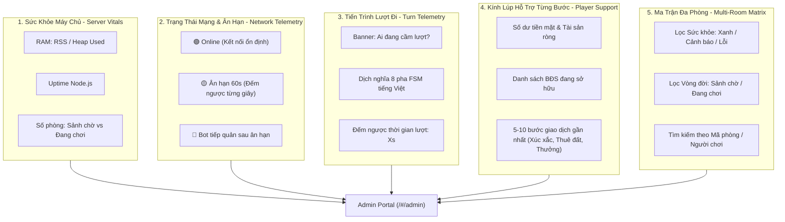

# Kế Hoạch Kỹ Thuật Tổng Thể: Đài Quan Sát Hỗ Trợ Người Chơi Từng Bước & Giám Sát Đa Phòng (IMP-166)

> **Mã số ticket**: IMP-166  
> **Tên tính năng**: Admin Step-by-Step Player Support & Multi-Room Live Telemetry Portal  
> **Triết lý cốt lõi**: **Thuần túy Quan sát & Hỗ trợ (Pure Read-Only Monitoring & Deep Visibility)**  
> **Nguyên tắc bất biến**: Tuyệt đối **KHÔNG** thêm các nút can thiệp cưỡng chế (`Force End Turn`, `Force Start`, v.v.) làm sai lệch trạng thái FSM, gây desync giữa các client, hoặc tạo lỗ hổng gian lận. Toàn bộ tính năng phục vụ việc **minh bạch hóa thông tin** để Admin nắm trọn tình hình hệ thống và hỗ trợ người chơi thật từng bước một (step-by-step).

---

## 1. Trả Lời Về Cơ Chế Lưu Trữ Log Hệ Thống

> [!NOTE]
> **Câu hỏi của Admin**: *"Bất kỳ game nào cũng phải có log được lưu lại bất kể dài ngắn thì có sẵn chưa?"*

### Thực Trạng Hiện Tại (Đã Có Sẵn 100% từ IMP-28)
Hệ thống **đã có sẵn cơ chế lưu trữ bền vững (Persistent Crash-Resilient Logging)** thông qua module [`PersistentRoomLogger`](file:///c:/Users/HP/Documents/GitHub/vtcoon/src/server/logging/persistent_room_logger.ts):
1. **Lưu tự động mọi bàn chơi**: Bất kể phòng kéo dài 10 giây hay 60 phút, ngay khi sự kiện đầu tiên phát sinh, server lập tức tạo tệp log chuyên biệt theo định dạng:
   `server_logs/rooms/<ROOMCODE>_<TIMESTAMP>.jsonl`
2. **Khả năng chịu lỗi (Crash Resilience)**: Dữ liệu được ghi thẳng xuống đĩa thông qua `appendFileSync` kèm tệp mục lục tổng hợp `rooms_manifest.json`. Kể cả khi server bị sập đột ngột (crash/OOM), các sự kiện đã diễn ra trước đó không bao giờ bị mất.
3. **Tra cứu & Tải về từ Admin Portal**: Tab `📁 Lịch Sử` trên giao diện Admin đã hỗ trợ tải trọn gói:
   - 📥 File JSONL sự kiện nguyên bản.
   - 📄 File JSON tổng hợp.
   - 💾 Hộp đen chuẩn đoán (Black Box JSON) kèm mã Vitest tái hiện lỗi (`buildReproCode`).

### Điểm Nâng Cấp Thiết Yếu Của IMP-166
Mặc dù log đã được lưu, nhưng nội dung ghi nhận hiện tại chỉ ở dạng chuỗi kỹ thuật thô sơ (ví dụ: `Người chơi p1: INTENT_ROLL`), thiếu các thông tin thực tế của ván đấu (đổ được mấy nút, đến ô nào, bị trừ bao nhiêu tiền thuê, số dư sau đó là bao nhiêu) và thiếu trường `playerId` trong cấu trúc log.
**IMP-166 sẽ làm giàu dữ liệu sự kiện (Event Data Enrichment)** ngay tại nguồn để phục vụ việc giải đáp thắc mắc người chơi tức thì.

---

## 2. Toàn Cảnh Các Chiều Quản Trị Của Một Admin Hệ Thống

Để vận hành an toàn và hỗ trợ người chơi chuyên nghiệp trong giai đoạn Pilot Test (2–4 người chơi thật trên Render), Admin cần nắm trọn 5 chiều thông tin sau:



---

## 3. Kiến Trúc Kỹ Thuật & Khắc Phục Triệt Để Phản Biện (Zero-Trust Resolution)

Bản kế hoạch này đã hấp thụ toàn bộ kết quả thẩm định nghiêm ngặt từ `PLAN_AUDIT_IMP166.md`, loại bỏ hoàn toàn các rủi ro kỹ thuật:

| Điểm Mù Đã Phát Hiện | Giải Pháp Triệt Để Trong IMP-166 |
| :--- | :--- |
| **P1.1: Ghost Enum `TurnPhase.JailDecision`** | Loại bỏ hoàn toàn ký hiệu ma. Dùng đúng 8 giá trị `TurnPhase` thực tế trong `room.ts`, kết hợp kiểm tra `player.inAudit` khi `WaitingRoll` để dịch nghĩa: *"Đang trong diện Kiểm toán (Đóng bảo lãnh / Thẻ ngoại giao)"*. |
| **P1.2: Đứt gãy nguồn đếm ngược lượt** | Bổ sung `timeRemainingProvider?: (roomCode: string) => number` trong `AdminManager` và tiêm từ `this.turnOrchestrator.getTimeRemaining(rc)` tại `wss_server.ts`. Không tạo temporal dead zone. |
| **P1.3: Lệch pha Wire & Client Hook** | Thêm `vitals?: ServerVitals` vào `ADMIN_ROOM_LIST` trong `network_types.ts`. Cập nhật `handleRoomListUpdate` và state `serverVitals` trong `use_admin_portal.ts` để giữ trọn vẹn dữ liệu lượt đi. |
| **P1.4: Thiếu `playerId` & dữ liệu giao dịch** | Bổ sung `playerId?: string` vào `AdminRoomLogEntry`. Làm giàu chuỗi `payloadSummary` tại `wss_intent_handler.ts` (lấy từ `RollResult`: số nút xúc xắc, ô cờ đến, tiền thuê, thưởng qua vạch, số dư mới). |
| **P2.1: Tràn viền lưới thẻ người chơi** | Sử dụng micro-badge tinh gọn: `🟡 Ân hạn 42s` kèm `title` hiển thị chi tiết khi rê chuột. |
| **P2.2: Xung đột bộ lọc Sidebar 360px** | Tách riêng 2 hàng lọc độc lập: Hàng trên lọc Sức khỏe (`Tất Cả / Xanh / Cảnh Báo / Lỗi`), Hàng dưới lọc Vòng đời (`Tất Cả / Sảnh Chờ / Đang Chơi`). |
| **P2.3: Banner lượt giả trong sảnh chờ** | Chắn điều kiện `if (!selectedRoomDetail.started)` ➔ Render thông báo: *"⏳ Sảnh chờ — Đang tập hợp người chơi (X/4)"*. |
| **P2.4: Phình to tải định kỳ 4s** | Không gắn mảng giao dịch vào `AdminRoomSummary` định kỳ. Kính lúp hỗ trợ sẽ trích xuất 5-10 bước trực tiếp từ danh sách `logs` đã stream về client. |
| **P2.5: Rò rỉ timer cô nhi cho Vitals** | Gửi kèm `vitals` trực tiếp trong phản hồi `ADMIN_ROOM_LIST` (kéo theo chu kỳ 4s của client). Server không chạy `setInterval` riêng cho vitals. |

---

## 4. Danh Mục Thay Đổi Tệp Nguồn Cụ Thể

### Nhóm 1: Server Types, Wire Protocol & Logging

#### [MODIFY] [admin_types.ts](file:///c:/Users/HP/Documents/GitHub/vtcoon/src/server/network/admin_types.ts)
* Mở rộng `AdminPlayerSummary`:
  ```ts
  export interface AdminPlayerSummary {
    readonly id: string;
    readonly balance: number;
    readonly position: number;
    readonly isBot: boolean;
    readonly bankrupt: boolean;
    readonly propertyCount: number;
    readonly netWorth: number;
    // Bổ sung telemetry mạng:
    readonly isConnected?: boolean;
    readonly inGracePeriod?: boolean;
    readonly graceSecondsLeft?: number;
  }
  ```
* Mở rộng `AdminRoomSummary`:
  ```ts
  export interface AdminRoomSummary {
    // ... các trường hiện tại ...
    readonly currentTurnPlayerId?: string;
    readonly currentTurnStepName?: string;
    readonly turnSecondsLeft?: number;
  }
  ```
* Bổ sung `playerId` vào `AdminRoomLogEntry`:
  ```ts
  export interface AdminRoomLogEntry {
    readonly id: string;
    readonly roomCode: string;
    readonly timestamp: number;
    readonly source: 'SERVER' | 'PLAYER' | 'BOT' | 'SYSTEM';
    readonly action: string;
    readonly playerId?: string;
    readonly payloadSummary: string;
  }
  ```
* Định nghĩa `ServerVitals`:
  ```ts
  export interface ServerVitals {
    readonly memoryRssMb: number;
    readonly memoryHeapUsedMb: number;
    readonly uptimeSeconds: number;
    readonly totalRooms: number;
    readonly liveRooms: number;
    readonly lobbyRooms: number;
  }
  ```

#### [MODIFY] [network_types.ts](file:///c:/Users/HP/Documents/GitHub/vtcoon/src/server/network/network_types.ts)
* Cập nhật thông điệp phản hồi danh sách phòng kèm vitals:
  ```ts
  | { readonly type: 'ADMIN_ROOM_LIST'; readonly rooms: readonly AdminRoomSummary[]; readonly vitals?: ServerVitals }
  ```

---

### Nhóm 2: Server Inspector, Reconnect & Telemetry Wiring

#### [MODIFY] [reconnect_manager.ts](file:///c:/Users/HP/Documents/GitHub/vtcoon/src/server/network/reconnect_manager.ts)
* Bổ sung helper truy vấn trạng thái ân hạn 60s cho Admin:
  ```ts
  isPlayerInGrace(roomCode: string, playerId: string): boolean {
    const key = `${roomCode.trim().toUpperCase()}:${playerId}`;
    return this.graceTimers.has(key);
  }

  getGraceRemainingSeconds(roomCode: string, playerId: string): number {
    const key = `${roomCode.trim().toUpperCase()}:${playerId}`;
    const startTime = this.graceStartTimes.get(key);
    if (!startTime) return 0;
    const elapsed = Date.now() - startTime;
    return Math.max(0, Math.ceil((this.gracePeriodMs - elapsed) / 1000));
  }
  ```

#### [MODIFY] [admin_inspector.ts](file:///c:/Users/HP/Documents/GitHub/vtcoon/src/server/network/admin_inspector.ts)
* Xây dựng hàm dịch nghĩa 8 pha FSM chuẩn xác kết hợp cờ `inAudit`:
  ```ts
  export function resolveTurnStepName(room: Room, currPlayer?: Player): string {
    if (!room.started) return 'Sảnh chờ (Chưa bắt đầu)';
    if (room.phase === TurnPhase.TurnEnd) return 'Kết thúc lượt';
    if (currPlayer?.inAudit && room.phase === TurnPhase.WaitingRoll) {
      return 'Đang trong diện Kiểm toán (Đóng bảo lãnh / Thẻ Ngoại Giao)';
    }
    switch (room.phase) {
      case TurnPhase.WaitingRoll:        return 'Chờ gieo xúc xắc';
      case TurnPhase.ActionPhase:        return 'Đang chọn hành động (Mua đất / Nâng cấp / Kết thúc lượt)';
      case TurnPhase.AuctionPhase:       return 'Đang diễn ra phiên đấu giá BĐS';
      case TurnPhase.PropertyManagement: return 'Quản lý tài sản (Xây dựng / Thế chấp)';
      case TurnPhase.InsolvencyPhase:    return 'Xử lý khủng hoảng nợ / Bán tài sản trả nợ';
      case TurnPhase.BankruptcyCheck:    return 'Kiểm tra điều kiện phá sản';
      case TurnPhase.HosePhase:          return 'Thực hiện sự kiện Vòi Rồng / Thiên tai';
      default:                           return `Pha: ${room.phase}`;
    }
  }
  ```
* Bổ sung tính toán `currentTurnPlayerId`, `currentTurnStepName`, `turnSecondsLeft` trong `buildRoomSummary`.
* Ánh xạ thông tin mạng `isConnected`, `inGracePeriod`, `graceSecondsLeft` vào từng `AdminPlayerSummary`.

#### [MODIFY] [admin_manager.ts](file:///c:/Users/HP/Documents/GitHub/vtcoon/src/server/network/admin_manager.ts)
* Hỗ trợ tiêm provider và quản lý dịch vụ:
  ```ts
  setTimeRemainingProvider(provider: (roomCode: string) => number): void;
  setReconnectManager(reconnects: ReconnectManager): void;
  setSessionManager(sessions: SessionManager): void;
  getServerVitals(): ServerVitals;
  ```
* Đóng gói `vitals` vào phản hồi tin nhắn `ADMIN_ROOM_LIST`.
* Ghi nhận trường `playerId` khi gọi `recordRoomEvent`.

#### [MODIFY] [wss_server.ts](file:///c:/Users/HP/Documents/GitHub/vtcoon/src/server/network/wss_server.ts)
* Tiêm provider thời gian và reconnect manager vào `adminManager` (tương tự như `broadcaster`):
  ```ts
  this.adminManager.setTimeRemainingProvider((rc) => this.turnOrchestrator.getTimeRemaining(rc));
  this.adminManager.setReconnectManager(this.reconnects);
  this.adminManager.setSessionManager(this.sessions);
  ```

#### [MODIFY] [intent_dispatcher.ts](file:///c:/Users/HP/Documents/GitHub/vtcoon/src/server/intent_dispatcher.ts) & [wss_intent_handler.ts](file:///c:/Users/HP/Documents/GitHub/vtcoon/src/server/network/wss_intent_handler.ts)
* Cho phép `INTENT_ROLL` trả về đối tượng `rollResult`.
* Làm giàu chuỗi `payloadSummary` khi ghi log:
  ```ts
  if (roll) {
    payloadSummary = `Người chơi ${msg.playerId}: Gieo xúc xắc [${roll.dice.dice[0]}, ${roll.dice.dice[1]}] -> Đến ô ${roll.player.position}`;
    if (roll.rentCharged > 0) payloadSummary += ` (Trả tiền thuê ${roll.rentCharged.toLocaleString('vi-VN')} Tr.)`;
    if (roll.passedGo) payloadSummary += ' (Qua ô Bắt Đầu +2.000 Tr.)';
    payloadSummary += ` | Số dư: ${roll.player.balance.toLocaleString('vi-VN')} Tr.`;
  }
  deps.adminManager.recordRoomEvent(msg.roomCode, {
    source: player?.isBot ? 'BOT' : 'PLAYER',
    action: msg.intent.type,
    playerId: msg.playerId,
    payloadSummary,
  });
  ```

---

### Nhóm 3: Giao Diện Người Dùng Admin Portal

#### [MODIFY] [use_admin_portal.ts](file:///c:/Users/HP/Documents/GitHub/vtcoon/src/client/ui/admin/use_admin_portal.ts)
* Bổ sung state `serverVitals: ServerVitals | null`.
* Trong `handleRoomListUpdate`: sao chép đầy đủ `currentTurnPlayerId`, `currentTurnStepName`, `turnSecondsLeft` sang `selectedRoomDetail`.
* Cập nhật `serverVitals` khi nhận thông điệp `ADMIN_ROOM_LIST`.

#### [MODIFY] [admin_portal.tsx](file:///c:/Users/HP/Documents/GitHub/vtcoon/src/client/ui/admin/admin_portal.tsx)
* **Header Server Vitals**: Hiển thị widget tài nguyên thanh lịch:
  `RAM: 145MB / 512MB` | `Uptime: 24h` | `Tổng phòng: 3 (Sảnh: 1, Chơi: 2)`.
* **Sidebar Bộ Lọc Hai Trục**:
  * Hàng 1 (Sức khỏe): `[Tất Cả]` | `[🟢 Xanh]` | `[🟡 Cảnh Báo]` | `[🔴 Lỗi]`.
  * Hàng 2 (Vòng đời): `[Tất Cả]` | `[⏳ Sảnh Chờ]` | `[⚔️ Đang Chơi]`.

#### [MODIFY] [admin_live_view.tsx](file:///c:/Users/HP/Documents/GitHub/vtcoon/src/client/ui/admin/admin_live_view.tsx)
* **Khối 1: Banner Lượt Hiện Tại (Turn Step Indicator)**:
  * Nếu `!selectedRoomDetail.started`: Hiển thị banner sảnh chờ `⏳ Sảnh chờ — Đang tập hợp người chơi (${playerCount}/4 người)`.
  * Nếu `selectedRoomDetail.started`: Hiển thị banner lượt đi:
    `👉 Lượt của: [p2]` | `📍 Trạng thái: Đang chọn hành động (Mua đất / Nâng cấp)` | `⏳ Thời gian còn lại: 35s`.
* **Khối 2: Thẻ Người Chơi & Đèn Báo Mạng**:
  * Thêm micro-badge: `🟢 Online` | `🟡 Ân hạn 42s` (hover tooltip chi tiết) | `🤖 Bot`.
  * Thẻ người chơi có thể bấm chọn (`selectedPlayerId`) kèm hiệu ứng viền sáng amber.
* **Khối 3: Kính Lúp Hỗ Trợ Từng Bước (Player Support Inspector)**:
  * Khi chọn một người chơi, hiển thị panel hỗ trợ ngay bên dưới:
    * Thống kê tài chính: Tiền mặt, Tài sản ròng, Danh sách ô đất sở hữu (kèm tên ô và cấp nhà).
    * Lịch sử 5-10 bước gần nhất của người chơi đó (trích xuất tức thì từ `logs`):
      `[15:10:02] Gieo xúc xắc [3, 4] -> Đến ô 14 [Đà Lạt]`
      `[15:10:06] Trả tiền thuê 2.000 Tr. cho p1 | Số dư: 3.500 Tr.`
    * Nút đóng kính lúp (hoặc bấm lại vào thẻ để tắt).

---

## 5. Kế Hoạch Kiểm Thử Quy Chuẩn (Verification Plan)

### Automated Test Suite: `tests/server/imp166_admin_support_telemetry.test.ts`
Xây dựng tối thiểu 18 test cases theo Ma trận 4 Góc (Universal 4-Facet Matrix):

1. **Biên Nghiệp Vụ (Boundary)**:
   - `TC-IMP166.01`: `getServerVitals` trả về đúng số liệu RAM RSS/Heap (MB) dương và số lượng phòng chính xác.
   - `TC-IMP166.02`: `resolveTurnStepName` ánh xạ đầy đủ 8 pha `TurnPhase` và không bị throw exception.
   - `TC-IMP166.03`: `resolveTurnStepName` trả về trạng thái Kiểm toán khi `player.inAudit === true` tại `WaitingRoll`.
   - `TC-IMP166.04`: Khi phòng chưa bắt đầu (`!room.started`), `currentTurnStepName` thể hiện đúng trạng thái Sảnh chờ.
2. **Tính Phản Ứng & Truyền Dữ Liệu (Reactivity & Data Pipe)**:
   - `TC-IMP166.05`: `timeRemainingProvider` cập nhật đúng số giây còn lại từ `TurnOrchestrator` vào `AdminRoomSummary`.
   - `TC-IMP166.06`: Khi người chơi mất kết nối, `inGracePeriod` chuyển thành `true` và `graceSecondsLeft` đếm ngược chính xác.
   - `TC-IMP166.07`: Khi người chơi kết nối lại trong thời gian ân hạn, `inGracePeriod` trở về `false` và `isConnected: true`.
   - `TC-IMP166.08`: `ADMIN_ROOM_LIST` truyền tải đầy đủ trường `vitals` đến client.
   - `TC-IMP166.09`: `use_admin_portal` merge chính xác `currentTurnPlayerId`, `currentTurnStepName`, `turnSecondsLeft` khi nhận poll định kỳ.
3. **Dọn Sạch & Vòng Đời (Disposal & Zero-Leak)**:
   - `TC-IMP166.10`: Server không chạy bất kỳ timer ngầm định kỳ nào cho `serverVitals` (100% pull-driven).
   - `TC-IMP166.11`: Khi đóng phòng (`ADMIN_ACTION_SUCCESS: TERMINATE_ROOM`), các tài nguyên liên quan được giải phóng sạch sẽ.
4. **Phòng Thủ Lỗi & Dữ Liệu Sự Kiện (Error Defense & Event Enrichment)**:
   - `TC-IMP166.12`: `recordRoomEvent` lưu trữ chính xác trường `playerId` vào cấu trúc log.
   - `TC-IMP166.13`: `INTENT_ROLL` ghi nhận đầy đủ xúc xắc, ô đến, tiền thuê và số dư mới vào `payloadSummary`.
   - `TC-IMP166.14`: Kính lúp hỗ trợ lọc chính xác log của player được chọn mà không làm lẫn lộn sự kiện của người chơi khác.

### Lệnh Xác Minh Hệ Thống:
```cmd
cmd /c "npm test"
cmd /c "npx tsc --noEmit"
cmd /c "npm run lint:ui"
cmd /c "npm run lint:slop"
```
