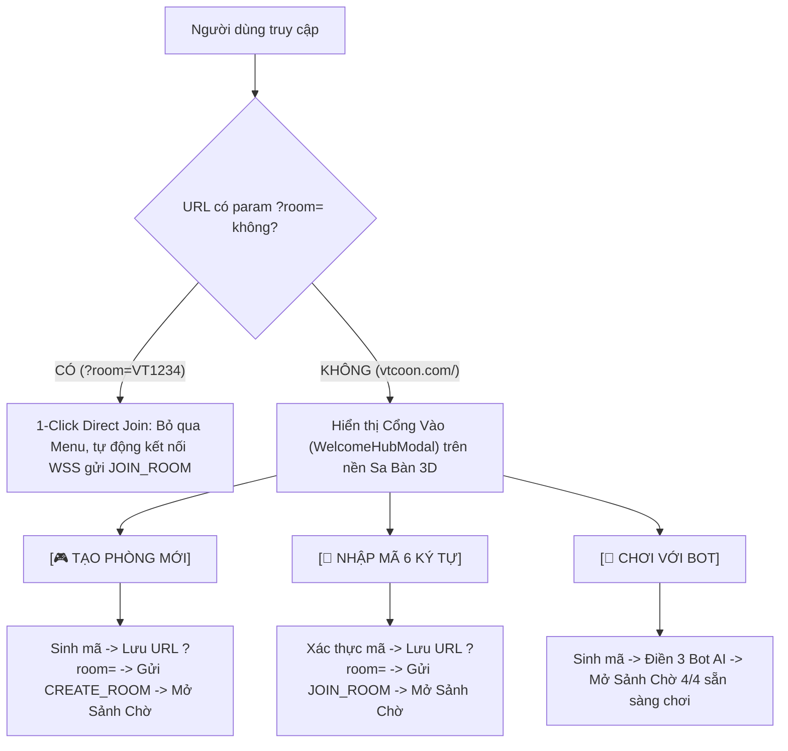

# Kế Hoạch Kỹ Thuật Tổng Thể: Cổng Vào Trò Chơi (Welcome Hub) & Kiểm Soát Tạo Phòng Có Chủ Đích (IMP-168)

> **Mã số ticket**: IMP-168  
> **Tên tính năng**: Welcome Hub & Controlled Intentional Room Creation  
> **Triết lý**: Triệt tiêu triệt để rác I/O và bộ nhớ máy chủ (Zero Ghost Lobbies Invariant). Chỉ khởi tạo phòng khi người dùng có hành động chủ đích (Explicit User Intent).  
> **Phân tầng kỹ thuật**: Tier 2 (Full Rigor) — Đụng chạm Network Wire, Zustand Store, Client Session Lifecycle, và UI Component mới.  
> **Đã tích hợp phản biện**: Tiếp thu 100% phát hiện từ [`PLAN_AUDIT_IMP168.md`](file:///c:/Users/HP/Documents/GitHub/vtcoon/.agents/audit/PLAN_AUDIT_IMP168.md) và 3 điểm tinh chỉnh an toàn từ người dùng.

---

## 1. Bối Cảnh & Phân Tích Điểm Nghẽn Hiện Tại

### 1.1. Hiện trạng cơ chế tự động (Auto-Spawn Trap)
1. Khi bất kỳ ai (người dùng, Google/Facebook crawler, hoặc người chơi F5) truy cập vào URL gốc (`https://vtcoon.com/`), hàm `getInitialLobbyConfig()` tại [`src/client/offline_landing.ts`](file:///c:/Users/HP/Documents/GitHub/vtcoon/src/client/offline_landing.ts) tự động:
   - Sinh ngẫu nhiên mã phòng 6 ký tự `VTxxxx`.
   - Ép URL thành `?room=VTxxxx` qua `history.replaceState`.
   - Gán `isHost = true`.
2. [`use_app_session.ts`](file:///c:/Users/HP/Documents/GitHub/vtcoon/src/client/network/use_app_session.ts) khởi chạy `useGameWs` với `autoConnect: true`.
3. Ngay khi kết nối WebSocket mở, `performWsHandshake()` ([`ws_message_handler.ts`](file:///c:/Users/HP/Documents/GitHub/vtcoon/src/client/network/ws_message_handler.ts)) tự động gửi `{ type: 'CREATE_ROOM', roomCode, playerId: 'p1' }`.
4. Server (`wss_lobby_handlers.ts`) lập tức:
   - Cấp phát đối tượng `Room` trong RAM.
   - Ghi file nhật ký đĩa `server_logs/rooms/VTxxxx_timestamp.jsonl`.
   - Phát sóng phòng mới lên Đài quan sát Admin (`/#/admin`).

### 1.2. Hậu quả thực tế
- **Spam phòng rác (Ghost Lobbies)**: Người dùng vào xem web 2 giây rồi tắt tab vẫn để lại 1 phòng mồ côi trong RAM suốt 3 phút và 1 file log rác trên đĩa.
- **Rối mắt trên Admin Portal**: Danh sách phòng tràn ngập các phòng `1/4 người` không bao giờ chơi.
- **Trải nghiệm gò bó**: Người chơi không có nơi nhập mã phòng 6 ký tự khi được bạn bè đọc mã qua chat/điện thoại; không có nút thoát bàn về trang chủ.

---

## 2. Kiến Trúc Giải Pháp: "Welcome Hub" (Cổng Vào Trò Chơi)

### 2.1. Hai Luồng Vào Trò Chơi Độc Lập


### 2.2. Bất Biến Kiểm Soát Mạng (Network Silence Invariant)
- Khi người dùng ở trạng thái `roomCode === null` (chưa bấm tạo hay vào phòng):
  - **Tuyệt đối KHÔNG kết nối WebSocket** (`autoConnect: false` khi `!roomCode`).
  - **Chốt chặn an toàn kép trong `useGameWs.ts`**: Ngay đầu hàm `connect()`, bắt buộc:
    ```ts
    if (!roomCode) return;
    ```
    loại trừ triệt để nguy cơ mở socket tới `/rooms/null` khi có sự kiện ngoài luồng.
  - Sa bàn 3D (`GameCanvas isLobby`) vẫn render mượt mà ở background với góc quay thư giãn.

---

## 3. Khắc Phục Triệt Để Phản Biện & Điểm Tinh Chỉnh

| Điểm Mù / Tinh Chỉnh | Nguy Cơ Thực Tế | Giải Pháp Trong IMP-168 |
| :--- | :--- | :--- |
| **P1.1: Vòng lặp vô tận `ROOM_NOT_FOUND`** | `ws_message_handler.ts#L84` tự động gửi lại `JOIN_ROOM` khi gặp lỗi này, gây bão spam socket. | Loại bỏ hoàn toàn `ROOM_NOT_FOUND` khỏi khối fallback tự động gửi lại tin nhắn; ngắt kết nối và hiển thị toast lỗi thân thiện trên Welcome Hub. |
| **P1.2: Sập app do `null.trim()`** | `use_app_session.ts#L193` tự gọi `initLobby(null)` làm crash runtime khi `roomCode: null`. | Xóa bỏ khối tự động gọi `initLobby` khi `!roomCode` trong `use_app_session.ts`. |
| **P1.3: Xung đột hợp đồng IMP-74** | Test `imp74_purge_leave_lobby_btn.test.ts` cấm chuỗi "Rời Phòng", "Rời Sảnh" và `data-testid="leave-lobby-btn"`. | Đặt tên nút là **`[🏠 Về Menu]`** với `data-testid="back-to-hub-btn"` và `aria-label="Quay về màn hình chính"`, bảo toàn 100% bộ test IMP-74. |
| **P1.4: Rò rỉ state `playersInfo`** | Khi rời phòng về Menu, `playersInfo` cũ không được xóa sạch, gây lỗi số dư khi tạo phòng sau. | Bổ sung `playersInfo: {}` vào lệnh reset trong `handleLeaveRoom`; thêm prop `onLeaveRoom` vào `PreMatchDeck`. |
| **P1.5: Nguy cơ gãy test `TC-IMP165.01`** | Test `TC-IMP165.01` assert `getInitialLobbyConfig()` bắt buộc sinh mã khi không có `?room=`. | Cập nhật `TC-IMP165.01` assert `createNewRoomConfig()`; bổ sung test mới kiểm tra `getInitialLobbyConfig()` trả về `roomCode: null` (Specification Evolution). |
| **P1.6: Rò rỉ cờ Host trong `sessionStorage`** | Host tạo `VT1234` lưu cờ `vtcoon_host_VT1234 = true`. Khi bấm Về Menu và vào lại bàn đó, bị nhận nhầm Host. | Trong `handleLeaveRoom`: gọi `window.sessionStorage?.removeItem('vtcoon_host_' + roomCode)`. |
| **P2.1: Tràn viền Header 360px** | Thêm nút 44px vào header PreMatchDeck làm phình to quá 336px trên di động. | Trên mobile (`< 640px`) chỉ hiển thị icon `🏠` (`min-h-[44px] min-w-[44px]`), ẩn text `Về Menu` bằng `hidden sm:inline`. |
| **P2.2: Lỗi biên dịch TypeScript** | Chưa khai báo `createCustomRoom` và `joinCustomRoom` trong `LobbyState`. | Khai báo đầy đủ 2 method trong `src/client/store/lobby_types.ts`. |

---

## 4. Danh Mục Thay Đổi Tệp Nguồn Cụ Thể

### Nhóm 1: Client Landing, Network & Session Lifecycle

#### [MODIFY] [offline_landing.ts](file:///c:/Users/HP/Documents/GitHub/vtcoon/src/client/offline_landing.ts)
* Cập nhật `getInitialLobbyConfig(search?: string)`:
  * Nếu có `?room=CODE`: trả về cấu hình tham gia phòng (`{ roomCode: code, playerId: targetPid, isHost, playerName }`).
  * Nếu không có `?room=`: trả về `{ roomCode: null, playerId: '', isHost: false, playerName: '' }`.
  * Không tự động gọi `replaceState` và không ghi `sessionStorage` khi chưa có hành động của người dùng.
* Xuất helper `createNewRoomConfig(isHost = true)` sinh mã ngẫu nhiên 6 ký tự phục vụ khi bấm nút tạo phòng.

#### [MODIFY] [use_game_ws.ts](file:///c:/Users/HP/Documents/GitHub/vtcoon/src/client/network/use_game_ws.ts)
* Tại đầu hàm `connect()`:
  ```ts
  if (!roomCode) return;
  ```
  Chốt chặn 1 dòng phòng thủ an toàn kép, loại trừ 100% việc mở socket đến `/rooms/null`.

#### [MODIFY] [use_app_session.ts](file:///c:/Users/HP/Documents/GitHub/vtcoon/src/client/network/use_app_session.ts)
* Truyền `autoConnect: Boolean(roomCode)` vào `useGameWs`.
* Xóa bỏ khối `if (!roomCode) { const initCfg = getInitialLobbyConfig(); ... }` ở lines 192-199 để không gọi `initLobby(null)`.

#### [MODIFY] [ws_message_handler.ts](file:///c:/Users/HP/Documents/GitHub/vtcoon/src/client/network/ws_message_handler.ts)
* Trong `handleWsError`:
  * Chỉ xử lý fallback `RECONNECT` khi `TOKEN_INVALID` hoặc `TOKEN_EXPIRED`.
  * **LOẠI BỎ `ROOM_NOT_FOUND`** khỏi khối tự động gửi lại tin nhắn `JOIN_ROOM`.
  * Khi gặp `ROOM_NOT_FOUND`: gọi `ctx.onError?.('ROOM_NOT_FOUND')` và ngắt socket an toàn.

#### [MODIFY] [lobby_types.ts](file:///c:/Users/HP/Documents/GitHub/vtcoon/src/client/store/lobby_types.ts)
* Mở rộng interface `LobbyState`:
  ```ts
  readonly createCustomRoom: (isBotSolo?: boolean) => { roomCode: string; playerId: string };
  readonly joinCustomRoom: (code: string) => { success: boolean; reasonCode?: string };
  ```

#### [MODIFY] [lobby_store.ts](file:///c:/Users/HP/Documents/GitHub/vtcoon/src/client/store/lobby_store.ts)
* Triển khai `createCustomRoom`: sinh mã 6 ký tự, gọi `initLobby`, nếu `isBotSolo` thì lấp đầy slot 1, 2, 3 bằng Bot (`toggleBotSlot`).
* Triển khai `joinCustomRoom`: xác thực regex `/^[A-Z0-9]{6}$/`, gọi `initLobby(code, 'p2', false)`.

#### [MODIFY] [use_app_turn_controls.ts](file:///c:/Users/HP/Documents/GitHub/vtcoon/src/client/network/use_app_turn_controls.ts)
* Trong `handleLeaveRoom`:
  * Dọn dẹp cờ Host:
    ```ts
    if (roomCode && typeof window !== 'undefined') {
      window.sessionStorage?.removeItem(`vtcoon_host_${roomCode}`);
    }
    ```
  * Gọi `useLobbyStore.getState().resetLobby()` đưa `roomCode` về `null`.
  * Xóa sạch `playersInfo: {}`, `playerPositions: {}` trong `useGameStore`.
  * Xóa URL param về root (`window.history.replaceState({}, '', window.location.pathname)`).

---

### Nhóm 2: Giao Diện Người Dùng & Bảo Trợ Quy Chuẩn UI Linter

#### [NEW] [welcome_hub_modal.tsx](file:///c:/Users/HP/Documents/GitHub/vtcoon/src/client/ui/lobby/welcome_hub_modal.tsx)
* Tuân thủ 100% 4 quy chuẩn của `npm run lint:ui`:
  1. **Không dùng `gradient-text`**: Logo dùng `text-amber-400` thuần kết hợp đổ bóng `drop-shadow-[0_2px_4px_rgba(0,0,0,0.8)]`.
  2. **Không dùng `bounce-easing`**: Nút bấm dùng `hover:scale-[1.02] active:scale-[0.98] transition-transform duration-150`.
  3. **Không dùng `border-accent-on-rounded`**: Sử dụng bo góc chuẩn mực `rounded-2xl` hoặc `rounded-3xl` đồng nhất viền `border-slate-800`.
  4. **Không dùng `gray-on-color`**: Chữ trên nền màu có độ tương phản cao WCAG AA.
* Bố cục chuẩn công thái học 360px (`max-w-[380px] sm:max-w-[420px] max-h-[90dvh] overflow-y-auto`):
  - Nút chính `[🎮 TẠO PHÒNG MỚI]`: Chiều cao `min-h-[48px]`, `data-testid="create-room-btn"`.
  - Nút `[🤖 CHƠI VỚI BOT]`: Chiều cao `min-h-[48px]`, `data-testid="play-with-bots-btn"`.
  - Khung nhập mã 6 ký tự: Input `min-h-[44px] text-center font-mono font-black tracking-widest text-lg uppercase`, nút `[👉 VÀO BÀN]` `min-h-[44px]`.
  - Nút Hướng Dẫn: `min-h-[44px] min-w-[44px]`.

#### [MODIFY] [pre_match_deck.tsx](file:///c:/Users/HP/Documents/GitHub/vtcoon/src/client/ui/lobby/pre_match_deck.tsx)
* Bổ sung prop `onLeaveRoom?: () => void`.
* Thêm nút `data-testid="back-to-hub-btn"` tại Header:
  - Mobile: icon `🏠` (`min-h-[44px] min-w-[44px]`).
  - Desktop: `🏠 <span className="hidden sm:inline">Về Menu</span>`.
  - Không chứa chuỗi "Rời Phòng", "Rời Sảnh" (bảo toàn IMP-74).

#### [MODIFY] [main.tsx](file:///c:/Users/HP/Documents/GitHub/vtcoon/src/client/main.tsx)
* Khi `!roomCode`:
  - Không gọi `initLobby` tự động khi khởi động app.
  - Render `<WelcomeHubModal />` ở trung tâm màn hình trên nền `<GameCanvas isLobby />`.
  - Ẩn `<PreMatchDeck />`.
* Khi `roomCode` có giá trị:
  - Ẩn `<WelcomeHubModal />`.
  - Hiển thị `<PreMatchDeck onLeaveRoom={handleLeaveRoom} />`.

---

### Nhóm 3: Cập Nhật & Đối Soát Kiểm Thử Kế Thừa (Specification Evolution)

#### [MODIFY] [tests/server/imp165_multiplayer_lobby_sync.test.ts](file:///c:/Users/HP/Documents/GitHub/vtcoon/tests/server/imp165_multiplayer_lobby_sync.test.ts)
* Cập nhật `TC-IMP165.01`: chuyển sang kiểm tra `createNewRoomConfig()` sinh mã hợp lệ `/^[A-Z0-9]{6}$/`.
* Bổ sung test kiểm tra `getInitialLobbyConfig()` không có `?room=` trả về `roomCode: null`, `isHost: false` và không gọi `replaceState`.

---

## 5. Kế Hoạch Kiểm Thử Quy Chuẩn (Station 1 - RED Contract Test)

Tạo tệp test: `tests/client/imp168_welcome_hub_and_room_creation.test.ts` (>= 18 atomic tests theo Ma trận 4 Góc):

1. **Biên Nghiệp Vụ (Boundary)**:
   - `TC-IMP168.01`: Truy cập root URL (`search: ''`) -> `getInitialLobbyConfig` trả về `roomCode: null`, `isHost: false`, không gọi `replaceState`.
   - `TC-IMP168.02`: Truy cập URL có `?room=VT1234` -> `getInitialLobbyConfig` trả về đúng `roomCode: 'VT1234'`, `isHost: false`.
   - `TC-IMP168.03`: Khung nhập mã phòng từ chối chuỗi < 6 ký tự hoặc chứa ký tự đặc biệt.
2. **Tính Phản Ứng & Luồng Dữ Liệu (Reactivity)**:
   - `TC-IMP168.04`: Khi `roomCode === null`, `useAppSession` và `useGameWs.connect()` KHÔNG kích hoạt kết nối WebSocket.
   - `TC-IMP168.05`: Nhấn nút [Tạo Phòng Mới] -> Sinh mã 6 ký tự, cập nhật `history.replaceState(?room=...)`, gọi `CREATE_ROOM`.
   - `TC-IMP168.06`: Nhập mã hợp lệ và nhấn [Vào Bàn] -> Cập nhật URL, gửi `JOIN_ROOM`.
   - `TC-IMP168.07`: Nhấn [Chơi Với Bot] -> Tạo phòng và tự động lấp đầy 3 slot Bot AI.
3. **Dọn Dẹp & Thoát Phòng (Disposal)**:
   - `TC-IMP168.08`: Nhấn nút [Về Menu] (`back-to-hub-btn`) trong PreMatchDeck -> Gọi `LEAVE_ROOM`, xóa reconnect token, xóa cờ `vtcoon_host_VTxxxx` trong sessionStorage, reset `roomCode: null`, đưa URL về root.
   - `TC-IMP168.09`: Xóa sạch `playersInfo` khi rời phòng để chống ô nhiễm ván chơi sau.
4. **Phòng Thủ Lỗi (Error Defense)**:
   - `TC-IMP168.10`: Nhập mã phòng không tồn tại -> Nhận `ROOM_NOT_FOUND`, hiển thị thông báo lỗi thân thiện trên Welcome Hub và KHÔNG rơi vào vòng lặp spam socket vô tận.

---

## 6. Kế Hoạch Xác Minh Tổng Thể
```cmd
cmd /c "npm test"
cmd /c "npx tsc --noEmit"
cmd /c "npm run lint:ui"
cmd /c "npm run lint:slop"
```
