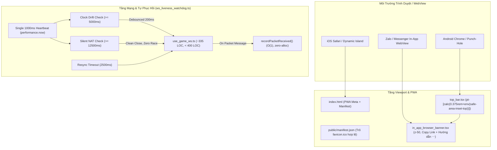

# [IMP-188] Kế Hoạch Triển Khai (REV 2): Tối Ưu Màn Hình Toàn Cảnh (Safe-Area & PWA) & Tăng Cường Độ Bền Mạng 4G / In-App WebView

> **Dành cho Agentic Workers:** YÊU CẦU SUB-SKILL: Sử dụng `writing-plans` và tuân thủ quy trình 3 Trạm (Station 1 RED -> Station 2 GREEN -> Station 3 Review). Các bước theo dõi bằng checkbox (`- [ ]`).
> *(Đã tích hợp 100% chỉ định kiểm toán đối kháng từ `.agents/audit/PLAN_AUDIT_IMP188.md`: Khắc phục triệt để Double-Connect Race, Single 1000ms Heartbeat với monotonic `performance.now()`, chuyển giao toàn bộ Resync Watchdog 2.5s để hạ `use_game_ws.ts` xuống ~335 LOC, bảo vệ banner khỏi Dynamic Island và hỗ trợ Copy Link thoát Zalo).*

**Mục Tiêu:** Xử lý triệt để các rủi ro giao diện và kết nối mạng di động đa nền tảng (iOS Safari, Android Chrome, In-App WebView Zalo/Messenger): Bổ sung `safe-area-inset-top` chống che khuất bởi Dynamic Island & Android Punch-hole Camera; cấu hình PWA Standalone & Apple Web App meta tags; tách mô-đun lá thuần `ws_liveness_watchdog.ts` (Single 1000ms Heartbeat Interval với `performance.now()`, Clock Drift 5s + Client NAT Watchdog 12.5s + Resync Watchdog 2.5s bằng `useRef`, zero re-renders) và hiển thị banner điều hướng thoát WebView Zalo/FB tại `z-50`, kiểm soát nghiêm ngặt ngân sách LOC của `use_game_ws.ts` (< 350 LOC, trần 400 LOC).

**Kiến Trúc & Giải Pháp Tiếp Cận:**
1. **Tầng Giao Diện & Viewport (Gói 3)**:
   - Thêm `pt-[calc(0.375rem+env(safe-area-inset-top))]` tại `<header>` trong [`src/client/ui/top_bar.tsx`](file:///c:/Users/HP/Documents/GitHub/vtcoon/src/client/ui/top_bar.tsx).
   - Bổ sung cấu hình Web App Manifest [`public/manifest.json`](file:///c:/Users/HP/Documents/GitHub/vtcoon/public/manifest.json) với `display: "standalone"`, `orientation: "portrait"`, trỏ icon hợp lệ vào `/favicon.ico` (không dùng ghost asset 404).
   - Bổ sung thẻ `meta` chuyên biệt cho iOS (`apple-mobile-web-app-capable`, `apple-mobile-web-app-status-bar-style`) và `link rel="manifest"` trong [`index.html`](file:///c:/Users/HP/Documents/GitHub/vtcoon/index.html).
2. **Tầng Mạng Di Động & Đồng Bộ Trạng Thái (Gói 1)**:
   - Trích xuất mô-đun thuần [`src/client/network/ws_liveness_watchdog.ts`](file:///c:/Users/HP/Documents/GitHub/vtcoon/src/client/network/ws_liveness_watchdog.ts):
     * **Single 1000ms Heartbeat Pattern**: Duy trì DUY NHẤT 1 `setInterval(1000ms)`. Sử dụng `performance.now()` đơn điệu (monotonic) chống lỗi nhảy giờ NTP.
     * **Zero-Allocation Packet Ingestion**: Hàm `recordPacketReceived()` chỉ gán `lastPacketTimeRef.current = performance.now()` (O(1), 0 timer allocation, chống GC stutter trên R3F 3D Canvas).
     * **Clock Drift Detector**: Mỗi tick kiểm tra `now - lastTickRef.current >= 5000ms` để phát hiện CPU freeze trong Zalo WebView.
     * **Silent NAT Watchdog**: Mỗi tick kiểm tra `now - lastPacketTimeRef.current >= 12500ms` (căn cứ theo `2.5 * HEARTBEAT_INTERVAL_MS = 12.5s` của Server).
     * **Chống Double-Connect Race**: Watchdog KHÔNG gọi cả close lẫn connect cùng lúc. Watchdog chỉ gọi `onDeadSocket()` hoặc gọi `socket.close()` và để handler `socket.onclose` duy nhất kích hoạt reconnect theo cơ chế exponential backoff.
     * **Hấp thụ Resync Watchdog**: Đưa bộ đếm `resyncWatchdog` 2500ms từ `use_game_ws.ts` vào quản lý tập trung trong `ws_liveness_watchdog.ts`.
   - Tạo component [`src/client/ui/in_app_browser_banner.tsx`](file:///c:/Users/HP/Documents/GitHub/vtcoon/src/client/ui/in_app_browser_banner.tsx) nằm ở `z-50 pointer-events-auto`, đệm `pt-[env(safe-area-inset-top)]`, hiển thị chỉ dẫn "Bấm ⋯ ➔ Mở bằng trình duyệt ngoài" kèm nút "📋 Sao chép liên kết" và nút "✕ Bỏ qua" lưu vào `sessionStorage`.

**Sơ Đồ Kiến Trúc (Mermaid):**

**Tech Stack:** React 19, TypeScript 5.8, Tailwind CSS v4, Web App Manifest, WebSocket API, Vitest.

**Spec / Baseline Document:** [`mobile_cross_browser_audit_report.md`](file:///C:/Users/HP/.gemini/antigravity/brain/e766feba-de25-4b15-a359-3eb4186079fa/mobile_cross_browser_audit_report.md) & [`.agents/audit/PLAN_AUDIT_IMP188.md`](file:///c:/Users/HP/Documents/GitHub/vtcoon/.agents/audit/PLAN_AUDIT_IMP188.md).

---

## Global Constraints

- Không dùng `git` command (hoàn toàn do con người kiểm soát).
- Ngân sách LOC: Tier 1 Logic <= 400 LOC, Tier 2 UI <= 500 LOC, Living Tests <= 600 LOC.
- `use_game_ws.ts` hiện tại 394 LOC $\rightarrow$ Subtractive cleanup: xóa toàn bộ `wakeupDebounceTimerRef`, `resyncWatchdogRef`, `handleWakeup` và `useEffect` events (-81 dòng) $\rightarrow$ Đạt kỳ vọng ~335 LOC (< 350 LOC, tuyệt đối < 400 LOC Tier 1).
- Tuyệt đối không dùng `useState` cho bộ đếm nhịp 1s (Clock Drift) hay mốc thời gian packet (NAT Watchdog). Phải dùng 100% `useRef` để đạt Zero Re-renders trên Canvas 3D.
- Dùng `performance.now()` đơn điệu thay vì `Date.now()` để tránh lỗi nhảy giờ NTP.
- 0 lỗi UI Anti-pattern (`npm run lint:ui`).
- Fast in-memory tests (`npm test`) hoàn tất trong <= 5s, pass 100%.

---

## System Impact & Blast Radius (3-Way Matrix)

- **Risk Dial**: Level 2 (Slice-Bound — Mạng Client & Viewport Di Động).
- **Direct Touch**:
  1. [`src/client/ui/top_bar.tsx`](file:///c:/Users/HP/Documents/GitHub/vtcoon/src/client/ui/top_bar.tsx) (UI)
  2. [`index.html`](file:///c:/Users/HP/Documents/GitHub/vtcoon/index.html) (HTML Head)
  3. [`public/manifest.json`](file:///c:/Users/HP/Documents/GitHub/vtcoon/public/manifest.json) (Static Config)
  4. [`src/client/network/ws_liveness_watchdog.ts`](file:///c:/Users/HP/Documents/GitHub/vtcoon/src/client/network/ws_liveness_watchdog.ts) (Mới - Network Helper)
  5. [`src/client/network/use_game_ws.ts`](file:///c:/Users/HP/Documents/GitHub/vtcoon/src/client/network/use_game_ws.ts) (Network Hook)
  6. [`src/client/ui/in_app_browser_banner.tsx`](file:///c:/Users/HP/Documents/GitHub/vtcoon/src/client/ui/in_app_browser_banner.tsx) (Mới - UI Component)
  7. [`src/client/ui/hud_container.tsx`](file:///c:/Users/HP/Documents/GitHub/vtcoon/src/client/ui/hud_container.tsx) (UI Root)
- **Subtractive Audit (Delete/Cleanup)**:
  - Xóa bỏ hoàn toàn: `wakeupDebounceTimerRef` (L104), `resyncWatchdogRef` (L103), các dòng xóa ref (L145-148, L188-191, L211-218, L325-327, L362-365).
  - Xóa bỏ toàn bộ hàm `handleWakeup` (L306-348) và `useEffect` gán listener (L350-371).
  - Di chuyển toàn bộ quyền kiểm soát liveness và resync sang `ws_liveness_watchdog.ts`.
- **Call-Site Exhaustion**:
  - `top_bar.tsx`: Gọi tại `hud_container.tsx#L54` (giữ nguyên props `onLeaveRoom`).
  - `use_game_ws.ts`: Gọi tại `src/client/main.tsx` và các test suite (`use_game_ws_handshake.test.ts`). Chữ ký `UseGameWsOptions` và `UseGameWsReturn` giữ nguyên 100%.
- **Import DAG Check**:
  - `ws_liveness_watchdog.ts` là leaf module, chỉ import React hooks (`useRef`, `useEffect`, `useCallback`). Không import ngược `use_game_ws.ts`. Zero circular dependencies!
- **Delta LOC Budget**:
  - `top_bar.tsx`: Hiện tại 212 LOC + Delta 2 = Dự kiến 214 LOC (< 500 LOC Tier 2).
  - `use_game_ws.ts`: Hiện tại 394 LOC - 81 LOC (xóa refs, wakeup, listeners) + 22 LOC (gọi hook watchdog) = Dự kiến 335 LOC (< 350 LOC, tuyệt đối < 400 LOC Tier 1).
  - `ws_liveness_watchdog.ts`: Mới ~120 LOC (< 400 LOC Tier 1).
  - `in_app_browser_banner.tsx`: Mới ~75 LOC (< 500 LOC Tier 2).
  - `hud_container.tsx`: Hiện tại 111 LOC + Delta 4 = Dự kiến 115 LOC (< 500 LOC Tier 2).
- **Axis 1 - Downstream Consumers**:
  - TopBar người dùng: Render không bị giật, thêm padding đỉnh trên thiết bị có notch/punch-hole.
  - WebSocket Reconnect: Khi mạng 4G bị rớt ngầm hoặc Zalo WebView resume, hook watchdog chủ động gọi `requestResync` hoặc `reconnect`. Không gây tranh chấp 2 socket song song.
- **Axis 2 - Upstream & Environmental Modifiers**:
  - Môi trường Desktop / Chrome không có safe-area-inset-top $\rightarrow$ `env(safe-area-inset-top)` tự động rơi về `0px`, padding giữ nguyên `0.375rem` (6px) hoàn hảo.
  - Môi trường Non-In-App Browser (Safari, Chrome) $\rightarrow$ Banner Zalo tự ẩn (`detectInAppBrowser = false`).
- **Axis 3 - Exceptional Lifecycle Modes**:
  - Máy bị nghẽn CPU (Major Garbage Collection pause 2s): Watchdog ngưỡng 5s không trigger bậy.
  - Mất sóng di động khi qua hầm/thang máy (TCP Half-Open): 12.5s tự động kill socket và kích hoạt lại theo backoff tiêu chuẩn.
- **Worst-Case Defense**:
  - Bọc `sessionStorage` và `navigator.clipboard` trong `try-catch` đề phòng Safari Private Mode chặn lưu trữ hoặc cấm quyền clipboard.
  - Kiểm tra `typeof window !== 'undefined'` và `typeof document !== 'undefined'` cho SSR/JSDOM test runner.

---

## Kế Hoạch Từng Trạm (3-Station Implementation)

### Trạm 1: Viết Bộ Test Hợp Đồng Đối Kháng (Station 1 - RED)
- [ ] **Nhiệm vụ 1.1**: Viết bộ test hợp đồng đối kháng tại `tests/contracts/imp188_mobile_safe_area_and_network_watchdog.test.ts` (Tối thiểu 18 atomic assertions):
  - [TC-188.01] Đảm bảo `top_bar.tsx` chứa class CSS `pt-[calc(0.375rem+env(safe-area-inset-top))]`.
  - [TC-188.02] Đảm bảo `index.html` có thẻ meta `apple-mobile-web-app-capable="yes"`.
  - [TC-188.03] Đảm bảo `index.html` có thẻ meta `apple-mobile-web-app-status-bar-style="black-translucent"`.
  - [TC-188.04] Đảm bảo `index.html` có thẻ `link rel="manifest"` trỏ đến `/manifest.json`.
  - [TC-188.05] Đảm bảo `public/manifest.json` có cấu trúc hợp lệ (`standalone`, `portrait`, `theme_color`) và chỉ trỏ vào asset thực tế `/favicon.ico`.
  - [TC-188.06] `detectInAppBrowser`: Nhận diện chính xác UA Zalo (`Mozilla/5.0 ... Zalo/24.01.01`).
  - [TC-188.07] `detectInAppBrowser`: Nhận diện chính xác UA Facebook In-App (`... FBAN/FBIOS ...`).
  - [TC-188.08] `detectInAppBrowser`: Trả về `false` cho Safari iOS chuẩn và Chrome Android chuẩn.
  - [TC-188.09] `ws_liveness_watchdog`: Khởi tạo và cleanup DUY NHẤT 1 timer interval khi unmount (Disposal).
  - [TC-188.10] `ws_liveness_watchdog`: Nhịp đếm 1000ms thông thường KHÔNG kích hoạt `onWakeup` hay `onDeadSocket`.
  - [TC-188.11] `ws_liveness_watchdog`: Bỏ qua nếu thời gian lệch < 5000ms (Chống False Positive khi GC Pause 2s).
  - [TC-188.12] `ws_liveness_watchdog`: Kích hoạt `onWakeup` debounced khi thời gian lệch $\ge 5000$ms (Bắt Zalo CPU freeze).
  - [TC-188.13] `ws_liveness_watchdog`: `recordPacketReceived` cập nhật `lastPacketTimeRef` O(1) mà không sinh timer mới.
  - [TC-188.14] `ws_liveness_watchdog`: NAT Watchdog không kích hoạt nếu gói tin đến đều đặn (< 12500ms).
  - [TC-188.15] `ws_liveness_watchdog`: NAT Watchdog đóng socket an toàn khi quá 12500ms câm lặng, KHÔNG kích hoạt 2 socket song song.
  - [TC-188.16] `ws_liveness_watchdog`: Quản lý `resyncWatchdog` (2500ms), tự động hủy khi nhận delta mới.
  - [TC-188.17] `InAppBrowserBanner`: Hiển thị chỉ dẫn "⋯" và nút "Sao chép liên kết" (`navigator.clipboard`).
  - [TC-188.18] `InAppBrowserBanner`: Ẩn đi khi người dùng nhấn nút Đóng và lưu cờ vào `sessionStorage`.
- [ ] **Nhiệm vụ 1.2**: Chạy kiểm thử để chứng minh bộ test thất bại (RED) vì mã nguồn chưa được triển khai.

### Trạm 2: Triển Khai Mã Nguồn Tối Thiểu (Station 2 - GREEN)
- [ ] **Nhiệm vụ 2.1**: Cập nhật `src/client/ui/top_bar.tsx` với class đệm an toàn `pt-[calc(0.375rem+env(safe-area-inset-top))]`.
- [ ] **Nhiệm vụ 2.2**: Cập nhật `index.html` bổ sung PWA standalone meta tags và manifest link.
- [ ] **Nhiệm vụ 2.3**: Tạo tệp `public/manifest.json` chuẩn PWA, trỏ icon vào `/favicon.ico`.
- [ ] **Nhiệm vụ 2.4**: Triển khai `src/client/network/ws_liveness_watchdog.ts` thuần túy với `useRef`, `performance.now()`, Single 1000ms Heartbeat.
- [ ] **Nhiệm vụ 2.5**: Tái cấu trúc `src/client/network/use_game_ws.ts` để kết nối `useWsLivenessWatchdog`, xóa sạch refs và timers cũ, hạ LOC xuống ~335 LOC (< 350 LOC, trần 400 LOC).
- [ ] **Nhiệm vụ 2.6**: Triển khai `src/client/ui/in_app_browser_banner.tsx` (z-50, pt-safe-area, Copy Link, Close button) và gắn vào `src/client/ui/hud_container.tsx`.
- [ ] **Nhiệm vụ 2.7**: Chạy bộ test để đạt GREEN 100%, chạy `npm run lint:ui`, `npm run lint:slop`, `npm test`.

### Trạm 3: Thẩm Định Độc Lập & Lưu Trữ Bằng Chứng (Station 3 - REVIEW)
- [ ] **Nhiệm vụ 3.1**: Thu thập bằng chứng tự động qua `npm run gate:quick`.
- [ ] **Nhiệm vụ 3.2**: Gọi subagent `spec-reviewer` và `ui-craft-reviewer` kiểm tra độc lập trên đĩa vật lý.
- [ ] **Nhiệm vụ 3.3**: Cập nhật Bất biến mới #256 vào `docs/domain/gotchas.md` và Domain Index.
- [ ] **Nhiệm vụ 3.4**: Viết báo cáo nghiệm thu hoàn tất vé `IMP-188_report.md` và cập nhật roadmap.
