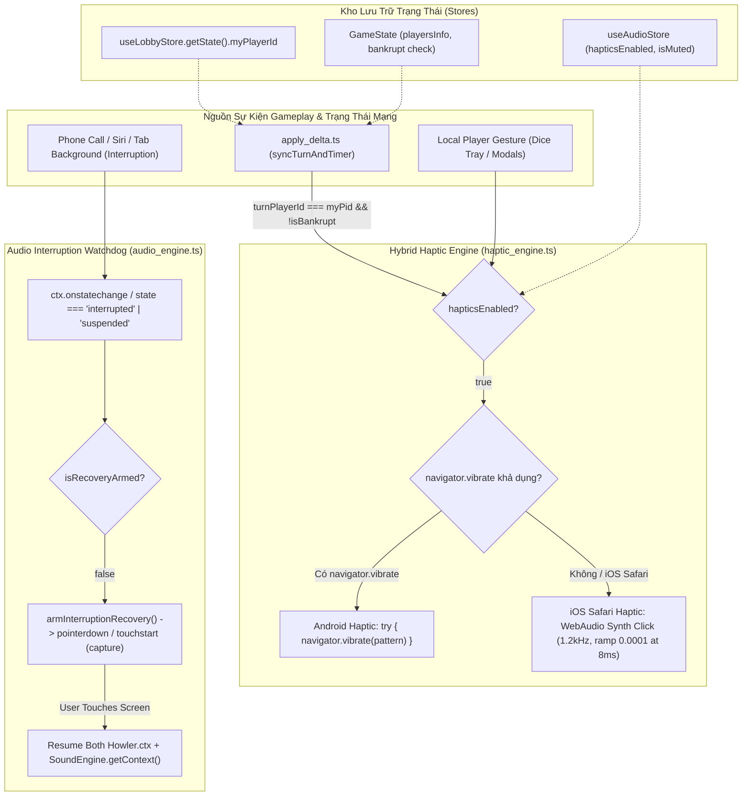

# [IMP-189] Kế Hoạch Triển Khai (REV 2): Phản Hồi Xúc Giác Đa Nền Tảng (Hybrid Haptic Engine) & Phục Hồi Âm Thanh Sau Gián Đoạn (Phone Call / Siri Audio Recovery)

> **Dành cho Agentic Workers:** YÊU CẦU SUB-SKILL: Sử dụng `writing-plans` và tuân thủ quy trình 3 Trạm (Station 1 RED -> Station 2 GREEN -> Station 3 Review). Các bước theo dõi bằng checkbox (`- [ ]`).
> *(Đã tích hợp 100% chỉ định kiểm toán đối kháng từ `.agents/audit/PLAN_AUDIT_IMP189.md`: Triệt tiêu rung oan đối thủ (Actor Partitioning), khắc phục thuộc tính ảo `useLobbyStore.getState().myPlayerId`, xử lý trạng thái `'interrupted'` trên iOS Safari, bảo vệ W3C `exponentialRampToValueAtTime(0.0001)`, bọc an toàn `navigator.vibrate`, cờ `isRecoveryArmed` chống rò rỉ listener, bảo lưu nguyên vẹn 391 LOC của `sound_engine.ts` và 397 LOC của `action_dock.tsx`, giữ nguyên `top_bar.tsx` 360px).*

**Mục Tiêu:** Nâng cấp trải nghiệm xúc giác và âm thanh đa nền tảng (iOS Safari, Android Chrome, In-App WebView):
1. Xây dựng **Hybrid Haptic Engine** độc lập (`haptic_engine.ts`):
   - Kênh **Android**: Kích hoạt rung cơ học `navigator.vibrate` bọc trong `try...catch` với các mẫu nhịp định lượng:
     * Nhấn chạm / Chọn đất / Đặt giá (`15ms`).
     * Đổ xúc xắc (`[25, 30, 25]ms`).
     * Cảnh báo đến lượt đi của tôi (`[40, 50, 40]ms`).
     * Biến cố nặng tác động vào tôi (Phạt thuế, Bị thâu tóm M&A, Vào tù) (`[70, 40, 110]ms`).
   - Kênh **iOS Safari (Giả lập âm học - Acoustic-Tactile Illusion)**: Do WebKit Safari cấm/không hỗ trợ `navigator.vibrate`, tự động chuyển sang phát xung **WebAudio Procedural Synth Click**:
     * Tần số 1.2kHz sine wave, ramp xuống sàn dương an toàn `0.0001` tại 8ms (chống ngoại lệ `RangeError` W3C), dừng tại 10ms và dọn dẹp node qua `osc.onended`.
     * Tự động tắt tiếng nếu người chơi bật chế độ câm (`isMuted: true`).
   - Quản lý tùy chọn rung: Bổ sung cờ `hapticsEnabled` (mặc định `true`) trong `useAudioStore`.
2. Triệt tiêu lỗi **Tịt Âm Thanh Vĩnh Viễn Sau Cuộc Gọi (Phone Call / Siri Audio Interruption Recovery)**:
   - Safari iOS chuyển `AudioContext.state` sang `'interrupted'` khi có cuộc gọi đến hoặc bật Siri.
   - Trong `audio_engine.ts`, lắng nghe `statechange` trên cả `Howler.ctx` và `SoundEngine.getContext()`.
   - Khi phát hiện trạng thái `'interrupted'` hoặc `'suspended'`, kích hoạt cơ chế `armInterruptionRecovery` với cờ `isRecoveryArmed` chống đăng ký trùng lặp, bắt `pointerdown` / `touchstart` với capture phase để hồi sinh AudioContext ngay khi người dùng chạm lại vào màn hình mà không cần tải lại trang.
3. Phân vùng chủ thể nghiêm ngặt (Actor Partitioning - Chống Rung Oan):
   - Tuyệt đối không gắn haptic mù quáng vào `AudioEngine.playSfx(sfx)` toàn cục.
   - Chỉ rung khi:
     * FSM chuyển lượt sang chính người chơi cục bộ (`turnPlayerId === myPid && !isBankrupt`).
     * Người chơi cục bộ thực hiện thao tác gieo xúc xắc hoặc đặt giá.
     * Sự kiện phạt tiền/thâu tóm tác động trực tiếp vào người chơi cục bộ.
4. Kiểm soát ngân sách LOC & Bố cục 360px:
   - Giữ nguyên `sound_engine.ts` ở 391 LOC ($\le 400$ LOC).
   - Giữ nguyên `action_dock.tsx` ở 397 LOC ($\le 400$ LOC).
   - Giữ nguyên `top_bar.tsx` ở 212 LOC (không nhồi nhét nút haptic vào cụm tiện ích 360px).
   - `audio_engine.ts` $\le 320$ LOC (hiện 276 LOC).
   - `haptic_engine.ts` $\le 130$ LOC.

---

## Kiến Trúc & Sơ Đồ Khối (Mermaid)

---

## Kế Hoạch Chi Tiết Theo Trạm

### 🚦 Trạm 1: Hợp Đồng Kiểm Thử Đối Kháng (Station 1 - QA RED)
- [ ] **Nhiệm vụ 1.1**: Tạo tệp kiểm thử hợp đồng `tests/contracts/imp189_hybrid_haptics_and_audio_recovery.test.ts`.
- [ ] **Nhiệm vụ 1.2**: Viết tối thiểu 16 atomic tests theo chuẩn 5-Facet Universal Matrix (1-4 asserts/test, zero loops in `it()`) có gắn nhãn truy vết `[TC-189.xx/MSS]` và `[UC-IMP189]`:
  - `[TC-189.01]` `useAudioStore`: Cung cấp `hapticsEnabled` (mặc định `true`), `setHapticsEnabled`, và `toggleHaptics`.
  - `[TC-189.02]` `HapticEngine`: Bỏ qua rung và click khi `hapticsEnabled === false`.
  - `[TC-189.03]` `HapticEngine.selection`: Gọi `navigator.vibrate(15)` được bọc trong `try...catch` khi `navigator.vibrate` khả dụng.
  - `[TC-189.04]` `HapticEngine.diceRoll`: Gọi `navigator.vibrate([25, 30, 25])`.
  - `[TC-189.05]` `HapticEngine.turnAlert`: Gọi `navigator.vibrate([40, 50, 40])`.
  - `[TC-189.06]` `HapticEngine.heavyImpact`: Gọi `navigator.vibrate([70, 40, 110])`.
  - `[TC-189.07]` `HapticEngine`: Khi `navigator.vibrate` ném lỗi `SecurityError` (iframe không có quyền), nuốt lỗi an toàn không crash app.
  - `[TC-189.08]` `HapticEngine`: Khi `navigator.vibrate` không tồn tại (iOS Safari), phát xung Synth Click 1.2kHz ramp về sàn dương `0.0001` (không dùng 0) và ngắt node sau 10ms.
  - `[TC-189.09]` `HapticEngine`: Không phát Synth Click nếu âm thanh đang bị tắt (`isMuted: true`).
  - `[TC-189.10]` `apply_delta.ts`: Gọi `HapticEngine.turnAlert` khi `turnPlayerId === useLobbyStore.getState().myPlayerId` và người chơi chưa bị phá sản (`!bankrupt`).
  - `[TC-189.11]` `apply_delta.ts`: Bỏ qua `turnAlert` nếu người chơi cục bộ đã phá sản (`bankrupt: true`).
  - `[TC-189.12]` `apply_delta.ts`: Bỏ qua `turnAlert` khi lượt chuyển sang đối thủ (`turnPlayerId !== myPid`) — Chống rung oan.
  - `[TC-189.13]` `AudioEngine`: Khởi tạo listener `statechange` trên AudioContext để theo dõi trạng thái gián đoạn (`interrupted` / `suspended`).
  - `[TC-189.14]` `AudioEngine.resumeAudioContext`: Phục hồi thành công khi AudioContext ở trạng thái `'interrupted'` (đặc thù WebKit iOS sau cuộc gọi/Siri).
  - `[TC-189.15]` `AudioEngine`: Cờ `isRecoveryArmed` ngăn chặn việc đăng ký listener trùng lặp khi `statechange` kích hoạt nhiều lần.
  - `[TC-189.16]` Ngân sách LOC: `sound_engine.ts` giữ nguyên 391 LOC, `action_dock.tsx` giữ nguyên 397 LOC, `top_bar.tsx` giữ nguyên 212 LOC, `audio_engine.ts` $\le 320$ LOC, `haptic_engine.ts` $\le 130$ LOC.
- [ ] **Nhiệm vụ 1.3**: Chạy `npm test -- tests/contracts/imp189_hybrid_haptics_and_audio_recovery.test.ts` và chứng minh thất bại chuẩn Business RED.

---

### 🟢 Trạm 2: Thi Công Tối Thiểu (Station 2 - GREEN Implementation)
- [x] **Nhiệm vụ 2.1**: Nâng cấp `src/client/store/audio_store.ts`:
  - Thêm `hapticsEnabled: boolean` (default: `true`).
  - Thêm `setHapticsEnabled: (enabled: boolean) => void`.
  - Thêm `toggleHaptics: () => void`.
- [x] **Nhiệm vụ 2.2**: Xây dựng mô-đun thuần `src/client/haptics/haptic_engine.ts`:
  - Định nghĩa hằng số các nhịp rung: `SELECTION (15ms)`, `DICE_ROLL ([25, 30, 25]ms)`, `TURN_ALERT ([40, 50, 40]ms)`, `HEAVY_IMPACT ([70, 40, 110]ms)`.
  - Hàm `playTactileClick(ctx?: AudioContext | null)` tạo xung sine 1.2kHz, gain 0.1, ramp về `0.0001` tại 8ms, stop ở 10ms, dọn dẹp qua `osc.onended`.
  - Bọc `try { navigator.vibrate(pattern) } catch {}` phòng vệ ngoại lệ iframe permissions.
  - Tự động fallback sang `playTactileClick` khi `navigator.vibrate` không khả dụng (iOS Safari).
  - Kiểm tra `useAudioStore.getState().hapticsEnabled` trước mọi hành động.
- [x] **Nhiệm vụ 2.3**: Nâng cấp `src/client/audio/audio_engine.ts`:
  - Trong `init()`: Gắn listener `statechange` trên cả `Howler.ctx` và `SoundEngine.getContext()`.
  - Triển khai `armInterruptionRecovery()` với cờ `isRecoveryArmed`.
  - Trong `resumeAudioContext()`: Kiểm tra cả `state === 'suspended' || (state as string) === 'interrupted'` và gọi trực tiếp `ctx.resume()` trên context của SoundEngine.
  - Cung cấp phương thức `dispose()` dọn dẹp các listeners cho kiểm thử.
- [x] **Nhiệm vụ 2.4**: Nâng cấp `src/client/network/apply_delta.ts`:
  - Trong `syncTurnAndTimer`: Khi lượt đổi sang người chơi mới:
    Lấy `myPid = useLobbyStore.getState().myPlayerId`.
    Kiểm tra `const isBankrupt = Boolean(state.playersInfo[myPid]?.bankrupt)`.
    Nếu `turnPlayerId === myPid && !isBankrupt`, kích hoạt `HapticEngine.turnAlert()`.
- [x] **Nhiệm vụ 2.5**: Chạy toàn bộ test suite `npm test` và `npm run lint:ui`, đảm bảo 100% tests PASS và 0 cảnh báo.

---

### 🔍 Trạm 3: Kiểm Toán Độc Lập & Nghiệm Thu (Station 3 - Review & DoD)
- [ ] **Nhiệm vụ 3.1**: Triệu hồi `spec-reviewer` đối soát 100% mã nguồn vật lý trên đĩa và hợp đồng kiểm thử.
- [ ] **Nhiệm vụ 3.2**: Triệu hồi `ui-craft-reviewer` kiểm tra tương tác xúc giác, trạng thái store và 0 vi phạm UI anti-patterns.
- [ ] **Nhiệm vụ 3.3**: Ghi nhận bằng chứng vào `.agents/evidence/imp189_snapshot.json`.
- [ ] **Nhiệm vụ 3.4**: Bổ sung Bất biến kỹ thuật #257 vào `docs/domain/gotchas.md` và Domain Index (`[UI/CRAFT]`, `[3D/RENDER]`).
- [ ] **Nhiệm vụ 3.5**: Lập báo cáo hoàn tất tại `docs/reports/improvements/IMP-189-hybrid-haptics-and-audio-recovery_report.md` và cập nhật `docs/master_roadmap.md`.
