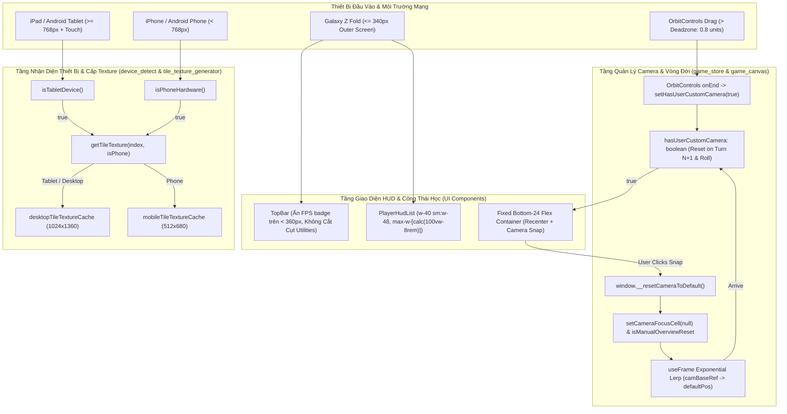

# [IMP-190] Kế Hoạch Triển Khai (REV 2): Thích Ứng Thiết Bị Chuyên Biệt (Tablet 1024px Texture LOD, Foldable 320px Ergonomics & Camera Orbit Snap Button)

> **Dành cho Agentic Workers:** YÊU CẦU SUB-SKILL: Sử dụng `writing-plans` và tuân thủ quy trình 3 Trạm (Station 1 RED -> Station 2 GREEN -> Station 3 Review). Bản kế hoạch REV 2 đã tích hợp toàn bộ các phát hiện từ [Báo Cáo Kiểm Toán Đối Kháng `.agents/audit/PLAN_AUDIT_IMP190.md`](file:///c:/Users/HP/Documents/GitHub/vtcoon/.agents/audit/PLAN_AUDIT_IMP190.md).

**Mục Tiêu:** Hoàn thiện gói cuối cùng (Gói 4) trong chiến lược tối ưu hóa di động đa nền tảng:
1. **Phân Định Tablet & Cấp Phát Texture LOD 1024px Cao Cấp ([`device_detect.ts`](file:///c:/Users/HP/Documents/GitHub/vtcoon/src/client/3d/device_detect.ts), [`tile_texture_generator.ts`](file:///c:/Users/HP/Documents/GitHub/vtcoon/src/client/3d/tile_texture_generator.ts), [`board_tile.tsx`](file:///c:/Users/HP/Documents/GitHub/vtcoon/src/client/3d/board_tile.tsx))**:
   - Khắc phục lỗ hổng [P1 - Broken Lifecycle]: Đấu nối trực tiếp `isTabletDevice()` vào `tile_texture_generator.ts` và `board_tile.tsx`.
   - Bảo toàn tương thích ngược cho `isMobileHardware()` (vẫn trả về `true` cho iPadOS theo contract TC-186.07).
   - Thêm `isPhoneHardware()` (trả về `true` khi là Mobile Hardware nhưng KHÔNG phải Tablet).
   - Thiết bị Tablet (iPadOS, Android Tablet $\ge 768\text{px}$) nạp cache `desktopTileTextureCache` (1024x1360, `scale: 4`, `anisotropy: 8/16`), hiển thị cực kỳ sắc nét trên màn hình Retina 11-13 inch mà không sợ WebKit Jetsam OOM.
2. **Nút Khôi Phục Góc Nhìn Camera Sa Bàn 3D ([`camera_reset_pill.tsx`](file:///c:/Users/HP/Documents/GitHub/vtcoon/src/client/ui/camera_reset_pill.tsx), [`hud_container.tsx`](file:///c:/Users/HP/Documents/GitHub/vtcoon/src/client/ui/hud_container.tsx), [`game_canvas.tsx`](file:///c:/Users/HP/Documents/GitHub/vtcoon/src/client/game_canvas.tsx))**:
   - Khắc phục lỗ hổng [P1 - Hard Snap & State Machine Conflict]:
     * Xóa bỏ lệnh `camera.position.set(...)` 0ms gây giật thị giác. Thay bằng smooth exponential lerp trong `useFrame`.
     * Khi gọi `window.__resetCameraToDefault()`: Xóa `cameraFocusCell` trong store và kích hoạt cờ ghi đè `isManualOverviewResetRef = true` để máy trạng thái camera không giật ngược trở lại ô đất (`tile_focus`).
     * Đặt ngưỡng dung sai sai số (deadzone: khoảng cách vị trí $> 0.8$ hoặc target $> 0.5$) trong OrbitControls `onEnd` trước khi bật nút snap.
   - Khắc phục lỗ hổng [P3 - Ghost Pill Leak]:
     * Khởi tạo `hasUserCustomCamera: false` trong `INITIAL_GAME_STATE`.
     * Tự động reset `hasUserCustomCamera: false` khi bắt đầu gieo xúc xắc (`triggerDiceRoll`), khi chuyển lượt (`syncTurnAndTimer`), và khi quân cờ đang di chuyển.
3. **Bố Cục Kép & Công Thái Học Màn Hình Gập 320px ([`top_bar.tsx`](file:///c:/Users/HP/Documents/GitHub/vtcoon/src/client/ui/top_bar.tsx), [`hud_container.tsx`](file:///c:/Users/HP/Documents/GitHub/vtcoon/src/client/ui/hud_container.tsx), [`player_hud_list.tsx`](file:///c:/Users/HP/Documents/GitHub/vtcoon/src/client/ui/player_hud_list.tsx))**:
   - Khắc phục lỗ hổng [P2 - 91px Overflow trên Fold 320px]:
     * Ẩn hẳn `mobile-fps-badge` trên màn hình $< 360\text{px}` (`hidden min-[360px]:inline-flex sm:hidden`) và thanh phân cách đi kèm, giải phóng ngay 65px.
     * Tinh chỉnh padding `match-info-capsule` và `hud-utilities-cluster` trên `< 360px` để vừa vặn trong 308px khả dụng, bảo đảm không cắt cụt các nút Mute và Nhật Ký.
   - Khắc phục lỗ hổng [P2 - Dual-Pill Clashing & ActionDock Overlap]:
     * Gom `RecenterPawnPill` và `CameraResetPill` vào chung một flex container tại L72 `hud_container.tsx`: `<div className="pointer-events-none fixed bottom-24 left-1/2 -translate-x-1/2 z-20 flex items-center justify-center gap-2 max-w-[95vw]">`.
     * Tự động ẩn `RecenterPawnPill` khi người chơi bấm nút Reset Camera (do `cameraFocusCell` đã được reset về `null`).
4. **Kiểm Soát Ngân Sách LOC & Kiến Trúc**:
   - `device_detect.ts`: $\le 80$ LOC (hiện 44 LOC).
   - `tile_texture_generator.ts`: $\le 240$ LOC (hiện 227 LOC, trần 300 LOC).
   - `board_tile.tsx`: $\le 450$ LOC (hiện 440 LOC, trần 500 LOC).
   - `camera_reset_pill.tsx`: mới, $\le 60$ LOC.
   - `hud_container.tsx`: $\le 125$ LOC (hiện 115 LOC).
   - `game_canvas.tsx`: $\le 435$ LOC (hiện 421 LOC, trần 500 LOC Tier 2).
   - `top_bar.tsx`: $\le 215$ LOC (hiện 212 LOC).
   - `player_hud_list.tsx`: $\le 55$ LOC (hiện 49 LOC).

---

## Kiến Trúc & Sơ Đồ Khối (Mermaid)



---

## Kế Hoạch Chi Tiết Theo Trạm

### 🚦 Trạm 1: Hợp Đồng Kiểm Thử Đối Kháng (Station 1 - QA RED)
- [ ] **Nhiệm vụ 1.1**: Tạo tệp kiểm thử hợp đồng `tests/contracts/imp190_specialized_devices_and_camera_snap.test.ts`.
- [ ] **Nhiệm vụ 1.2**: Viết tối thiểu 16 atomic tests theo chuẩn 5-Facet Universal Matrix (1-4 asserts/test, zero loops in `it()`) có gắn nhãn truy vết `[TC-190.xx/MSS]` và `[UC-IMP190]`:
  - `[TC-190.01]` `device_detect.ts`: `isTabletDevice()` trả về `true` cho iPadOS (Macintosh UA + touch points > 1).
  - `[TC-190.02]` `device_detect.ts`: `isTabletDevice()` trả về `true` cho Android Tablet (`Android` UA không có `Mobile`).
  - `[TC-190.03]` `device_detect.ts`: `isTabletDevice()` trả về `false` cho iPhone và Android Phone chuẩn (`Mobile` UA).
  - `[TC-190.04]` `device_detect.ts`: `isMobileHardware()` tiếp tục trả về `true` cho iPadOS (Bảo tồn hợp đồng kiểm thử hồi quy TC-186.07).
  - `[TC-190.05]` `device_detect.ts`: `isPhoneHardware()` trả về `false` cho Tablet/iPadOS và `true` cho Phone.
  - `[TC-190.06]` `tile_texture_generator.ts`: Hàm `getTileTexture(index)` nạp `desktopTileTextureCache` (1024x1360) khi thiết bị là iPadOS hoặc Android Tablet.
  - `[TC-190.07]` `game_store.ts`: `INITIAL_GAME_STATE` chứa `hasUserCustomCamera: false`, cung cấp action `setHasUserCustomCamera(boolean)`.
  - `[TC-190.08]` `game_store.ts`: `triggerDiceRoll` tự động reset `hasUserCustomCamera: false` để camera bám theo khay xúc xắc và quân cờ.
  - `[TC-190.09]` `CameraResetPill`: Ẩn đi (`return null`) khi `hasUserCustomCamera === false` hoặc khi có modal mở (`activeModal !== null`).
  - `[TC-190.10]` `CameraResetPill`: Hiển thị nút bấm `[🧭 Góc Nhìn Chuẩn]` đạt chuẩn touch target $\ge 44\text{px}$ khi `hasUserCustomCamera === true`.
  - `[TC-190.11]` `CameraResetPill`: Khi nhấp nút, gọi `window.__resetCameraToDefault()`, kích hoạt `HapticEngine.selection()`, và gọi `setHasUserCustomCamera(false)`.
  - `[TC-190.12]` `game_canvas.tsx`: Khi `window.__resetCameraToDefault()` kích hoạt, gọi `setCameraFocusCell(null)` và thực hiện smooth lerp (không gọi hard `camera.position.set(...)`).
  - `[TC-190.13]` `top_bar.tsx`: Thẻ `mobile-fps-badge` chứa class `hidden min-[360px]:inline-flex` để giải phóng 65px không gian trên màn hình gập 320px.
  - `[TC-190.14]` `hud_container.tsx`: Cụm nút nổi kép (`RecenterPawnPill` và `CameraResetPill`) được bọc trong chung một flex container có `gap-2` và `max-w-[95vw]`.
  - `[TC-190.15]` `player_hud_list.tsx`: Sử dụng chiều rộng responsive `w-40 sm:w-48` không vượt quá 50% màn hình 320px.
  - `[TC-190.16]` Ngân sách LOC: `device_detect.ts` $\le 80$ LOC, `tile_texture_generator.ts` $\le 240$ LOC, `board_tile.tsx` $\le 450$ LOC, `camera_reset_pill.tsx` $\le 60$ LOC, `game_canvas.tsx` $\le 450$ LOC, `top_bar.tsx` $\le 220$ LOC, `player_hud_list.tsx` $\le 55$ LOC.
- [ ] **Nhiệm vụ 1.3**: Chạy `npm test -- tests/contracts/imp190_specialized_devices_and_camera_snap.test.ts` và chứng minh thất bại chuẩn Business RED.

---

### 🟢 Trạm 2: Thi Công Tối Thiểu (Station 2 - GREEN Implementation)
- [ ] **Nhiệm vụ 2.1**: Nâng cấp `src/client/3d/device_detect.ts`:
  - Thêm `isTabletDevice(): boolean`.
  - Thêm `isPhoneHardware(): boolean`.
  - Cập nhật `getTileTextureBudget(isMobile: boolean, isTablet?: boolean): TileTextureBudget`.
- [ ] **Nhiệm vụ 2.1b**: Đấu nối đường ống Texture LOD vào `src/client/3d/tile_texture_generator.ts` & `src/client/3d/board_tile.tsx`:
  - Trong `tile_texture_generator.ts`:
    * Import `isPhoneHardware`, `isTabletDevice` từ `./device_detect`.
    * Cập nhật `getTileTexture(index, isMobile = isPhoneHardware())`: nếu `isMobile && !isTabletDevice()` thì dùng mobile cache (512x680), ngược lại dùng desktop cache (1024x1360).
  - Trong `board_tile.tsx`:
    * Cập nhật `const isPhone = propIsMobile !== undefined ? propIsMobile : isPhoneHardware();`.
    * Truyền `isPhone` vào `getTileTexture(cell.index, isPhone)`.
- [ ] **Nhiệm vụ 2.2**: Nâng cấp `src/client/store/game_store_types.ts` & `src/client/store/game_store.ts`:
  - Thêm `hasUserCustomCamera: boolean` (mặc định: `false`) vào `GameState` và `INITIAL_GAME_STATE`.
  - Thêm `setHasUserCustomCamera: (hasUserCustomCamera: boolean) => void`.
  - Trong `triggerDiceRoll`: reset `hasUserCustomCamera: false`.
  - Trong `syncTurnAndTimer` (`apply_delta.ts`): reset `hasUserCustomCamera: false` khi sang lượt người chơi mới.
- [ ] **Nhiệm vụ 2.3**: Tạo component `src/client/ui/camera_reset_pill.tsx`:
  - Kiểm tra `hasUserCustomCamera`, `activeModal`.
  - Nút bấm `[🧭 Góc Nhìn Chuẩn]`, `min-h-[44px]`, tactile shadow, gọi `window.__resetCameraToDefault?.()`, gọi `HapticEngine.selection()`, gọi `setHasUserCustomCamera(false)`.
- [ ] **Nhiệm vụ 2.4**: Nâng cấp `src/client/game_canvas.tsx`:
  - Trong `OrbitControls`:
    * Tại `onEnd`: Đo cự ly lệch vị trí `distPos > 0.8` hoặc target `distTarget > 0.5` mới gọi `setHasUserCustomCamera(true)` (chống chạm nhẹ tap kích hoạt oan).
  - Trong `window.__resetCameraToDefault`:
    * Xóa `camera.position.set(...)`.
    * Gán `camBaseRef.current = [camera.position.x, camera.position.y, camera.position.z]`.
    * Gán `targetBaseRef.current = controlsRef.current ? [controlsRef.current.target.x, controlsRef.current.target.y, controlsRef.current.target.z] : defaultTarget`.
    * Đặt cờ `isResettingRef.current = true` và `isManualOverviewResetRef.current = true`.
    * Gọi `useGameStore.getState().setCameraFocusCell(null)`.
    * Gọi `useGameStore.getState().setHasUserCustomCamera(false)`.
  - Trong `useFrame`:
    * Khi `isManualOverviewResetRef.current === true`, hướng `targetState` về `overview`.
    * Khi cự ly đến overview `< 0.05`, tắt `isResettingRef.current = false` và `isManualOverviewResetRef.current = false`.
- [ ] **Nhiệm vụ 2.5**: Nâng cấp `src/client/ui/hud_container.tsx`:
  - Bọc cả `RecenterPawnPill` và `CameraResetPill` trong một flex container:
    ```tsx
    <div className="pointer-events-none fixed bottom-24 left-1/2 -translate-x-1/2 z-20 flex items-center justify-center gap-2 max-w-[95vw]">
      <RecenterPawnPill ... />
      <CameraResetPill />
    </div>
    ```
- [ ] **Nhiệm vụ 2.6**: Tối ưu công thái học màn hình gập $\le 340\text{px}$:
  - `src/client/ui/top_bar.tsx`:
    * Thêm `hidden min-[360px]:inline-flex sm:hidden` vào `mobile-fps-badge` và divider đi kèm.
    * Tinh chỉnh padding `match-info-capsule` và `hud-utilities-cluster` trên `< 360px`.
  - `src/client/ui/player_hud_list.tsx`: Điều chỉnh `w-40 sm:w-48 md:w-64 max-w-[calc(100vw-8rem)]`.
- [ ] **Nhiệm vụ 2.7**: Chạy toàn bộ test suite `npm test` và `npm run lint:ui`, đảm bảo 100% tests PASS và 0 cảnh báo.

---

### 🔍 Trạm 3: Kiểm Toán Độc Lập & Nghiệm Thu (Station 3 - Review & DoD)
- [ ] **Nhiệm vụ 3.1**: Triệu hồi `spec-reviewer` đối soát 100% mã nguồn vật lý trên đĩa và hợp đồng kiểm thử.
- [ ] **Nhiệm vụ 3.2**: Triệu hồi `ui-craft-reviewer` kiểm tra nút camera pill, công thái học di động 320px và 0 vi phạm UI anti-patterns.
- [ ] **Nhiệm vụ 3.3**: Ghi nhận bằng chứng vào `.agents/evidence/imp190_snapshot.json`.
- [ ] **Nhiệm vụ 3.4**: Bổ sung Bất biến kỹ thuật #258 vào `docs/domain/gotchas.md` và Domain Index (`[UI/CRAFT]`, `[3D/RENDER]`).
- [ ] **Nhiệm vụ 3.5**: Lập báo cáo hoàn tất tại `docs/reports/improvements/IMP-190-specialized-devices-and-camera-snap_report.md` và cập nhật `docs/master_roadmap.md`.
