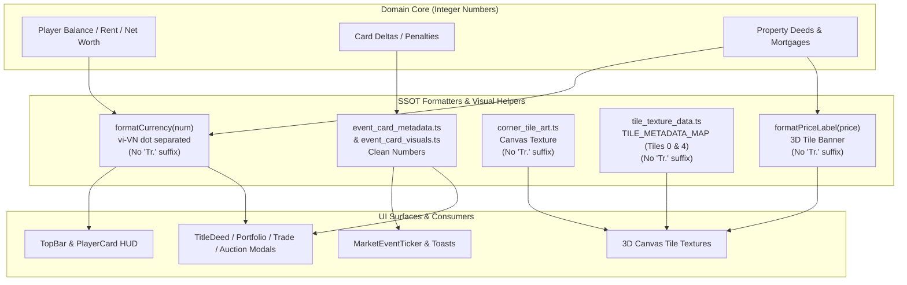

# Kế Hoạch Kỹ Thuật IMP-197: Loại Bỏ Đơn Vị Tiền Tệ "Tr." & Tối Giản Hóa Hiển Thị Tài Chính Toàn Diện

> **For agentic workers:** REQUIRED SUB-SKILL: Sử dụng `superpowers:subagent-driven-development` để thực thi kế hoạch theo từng nhiệm vụ nhỏ. Các bước sử dụng cú pháp checkbox (`- [ ]`) để theo dõi tiến độ.

**Goal:** Loại bỏ hoàn toàn hậu tố đơn vị tiền tệ `"Tr."` và `"Tr"` dư thừa trên toàn bộ bề mặt giao diện trò chơi (HUD, Modal, Thẻ bài, Ticker, Bàn cờ 3D Canvas), chuyển sang phong cách hiển thị tài chính tối giản, thanh lịch với số nguyên phân cách hàng nghìn bằng dấu chấm (ví dụ: `25.000`, `+2.000`, `-500`, `0`), giúp người chơi tự nhiên thấu hiểu giá trị qua ngữ cảnh và biểu tượng (iconography).

**Architecture:** Giữ nguyên toàn bộ cấu trúc dữ liệu miền (`number` integer cho số dư, giá đất, tiền thuê, nợ). Đơn giản hóa các hàm định dạng nguồn đơn nhất (SSOT formatters) gồm `formatCurrency`, `formatPriceLabel`, `corner_tile_art`, `tile_texture_data`. Xóa bỏ các chuỗi đính kèm `"Tr."` trong mô tả thẻ cơ hội/thị trường, nút bấm hỗ trợ định giá modal, và nhãn 3D texture. Đối soát và cập nhật có hệ thống các kiểm thử chấp nhận trong `tests/**` theo đúng quy tắc Specification Evolution (Rule 4), bảo toàn 100% giá trị số sạch và không bao giờ làm suy yếu kiểm thử.

**Architecture Diagram:**



**Tech Stack:** React 19, TypeScript strict mode, Three.js / R3F Canvas Texture, Tailwind CSS, Vitest.

**Spec / Origin:** Yêu cầu người dùng ngày 26/09/2026: *"lập plan bỏ tất cả phần đơn vị tiền 'Tr.' , tôi nghĩ tự người chơi hiểu được"*. Đã qua kiểm toán đối kháng bởi `plan-griller` (Báo cáo: `.agents/audit/PLAN_AUDIT_IMP197.md`).

---

## I. Global Constraints

1. **Clean Typography**: Mọi con số tài chính hiển thị phải tuân thủ định dạng chuẩn tiếng Việt với dấu chấm phân cách hàng nghìn (ví dụ: `25.000`, `1.500`, `0`, `-500`). TUYỆT ĐỐI KHÔNG còn xuất hiện `"Tr."` hay `"Tr"` trong giao diện hiển thị cho người chơi. Nghiêm cấm hiển thị số thô không có dấu chấm phân cách (ví dụ: `1400` ➔ bắt buộc qua `formatCurrency` thành `1.400`).
2. **SSOT Integrity**: Tiền tệ trong logic miền (Domain FSM, Room, Player, Intent) luôn là số nguyên (`number`), không đổi kiểu dữ liệu.
3. **Subtractive Refactoring**: Loại bỏ triệt để các đoạn code thừa như `.replace(' Tr.', '')` ở các consumer (ví dụ: `title_deed_rent_table.tsx:91`).
4. **LOC Tiers (Enforced by lint:slop)**:
   - Tier 1 (Domain / Helpers): Max 400 LOC (hard limit 550 LOC).
   - Tier 2 (UI Modals / 3D Art): Max 500 LOC.
   - **Thiết quân luật `property_portfolio_modal.tsx`**: Tệp hiện dài 494 LOC (trần cứng 500 LOC). Mọi thao tác sửa đổi phải giữ `Delta LOC <= 0`, chỉ thay thế chuỗi in-place trên cùng dòng, tuyệt đối không ngắt dòng mới.
5. **Zero Bug-Codification & Specification Evolution (Rule 4)**: Cập nhật ~126 tệp kiểm thử trong `tests/**` từ kỳ vọng chuỗi có `'Tr.'` sang chuỗi số sạch chuẩn mới (ví dụ: `expect(str).toContain('12.500')`), tuyệt đối không xóa assert hoặc đổi thành `.not.toContain('Tr.')` để tránh tạo ra specification mirage / test rỗng (no-op).

---

## II. System Impact & Blast Radius (3-Way Matrix)

- **Risk Dial**: Slice-Bound (Level 2) — Ảnh hưởng đến định dạng hiển thị toàn bộ UI và các assertion chuỗi trong living test suite; không thay đổi FSM state hay network payload protocol.
- **Direct Touch**:
  - `src/client/ui/ui_helpers.ts` (SSOT Formatter)
  - `src/client/3d/tile_texture_data.ts` (Tiles 0 & 4, formatPriceLabel)
  - `src/client/3d/corner_tile_art.ts` (Corner Tiles 0 & 10)
  - `src/client/ui/modals/title_deed_rent_table.tsx`
  - `src/client/ui/modals/title_deed_modal.tsx`
  - `src/client/ui/modals/auction_modal.tsx`
  - `src/client/ui/modals/auction_district_card.tsx`
  - `src/client/ui/modals/auction_intelligence.ts`
  - `src/client/ui/modals/bond_issuance_tab.tsx`
  - `src/client/ui/modals/bot_trade_offer_modal.tsx`
  - `src/client/ui/modals/trade_modal.tsx`
  - `src/client/ui/modals/property_portfolio_modal.tsx`
  - `src/client/ui/modals/masterplan_components.tsx`
  - `src/client/ui/modals/game_rules_modal.tsx`
  - `src/client/ui/modals/event_card_visuals.ts`
  - `src/client/ui/action_dock.tsx`
  - `src/client/ui/event_card_punchy_summaries.ts`
  - `src/client/ui/market_event_ticker.tsx`
  - `src/client/offline_landing.ts`
  - `src/domain/event_card_metadata.ts`
  - `src/server/network/wss_intent_handler.ts`
  - `src/client/ui/admin/admin_live_view.tsx`
  - `src/server/network/admin_inspector.ts`
  - `src/client/telemetry/invariant_checker.ts`
- **Subtractive Audit (Delete/Cleanup)**:
  - Xóa bỏ `" Tr."` trong `formatCurrency(val)`: `${isNegative ? '-' : ''}${formatted} Tr.` ➔ `${isNegative ? '-' : ''}${formatted}`.
  - Xóa bỏ `" Tr."` trong `formatPriceLabel(price)`: `${price.toLocaleString('vi-VN')} Tr.` ➔ `${price.toLocaleString('vi-VN')}`.
  - Xóa bỏ đoạn mã vá lỗi `.replace(' Tr.', '')` trong `title_deed_rent_table.tsx:91`.
  - Dọn sạch chuỗi hardcode `"Tr."` trong các nút bấm modal (TradeModal `70% Sàn ({formatCurrency(price70)})`, PortfolioModal `Thế Chấp (+{formatCurrency(mortgageVal)})`).
- **Call-Site Exhaustion**:
  - `formatCurrency`: Đã kiểm toán 100% 48 vị trí gọi hàm qua AST/grep. Hàm trả về chuỗi đã format dấu chấm, hoàn toàn tương thích ngược với mọi nơi hiển thị số tiền.
  - `formatPriceLabel`: Đã kiểm toán các vị trí gọi trong `tile_texture_data.ts` và `tile_canvas_cache.ts`.
- **Import DAG Check**: Không thêm hay sửa bất kỳ import/export statement nào, bảo đảm 100% không tạo circular dependencies.
- **Delta LOC Budget**:

| File | Current LOC | Delta LOC | Expected LOC | Tier Limit | Trạng Thái |
|---|---|---|---|---|---|
| `src/client/ui/ui_helpers.ts` | 415 | 0 | 415 | 550 (Warn 400) | ✅ Đạt ngân sách |
| `src/client/ui/modals/property_portfolio_modal.tsx` | 494 | 0 | 494 | 500 (Hard) | ✅ Đạt ngân sách (In-place edit) |
| `src/client/ui/modals/masterplan_components.tsx` | 466 | 0 | 466 | 500 (Hard) | ✅ Đạt ngân sách |
| `src/client/ui/modals/auction_modal.tsx` | 442 | 0 | 442 | 500 (Hard) | ✅ Đạt ngân sách |
| `src/client/ui/modals/trade_modal.tsx` | 437 | 0 | 437 | 500 (Hard) | ✅ Đạt ngân sách |
| `src/client/ui/action_dock.tsx` | 397 | 0 | 397 | 500 (Hard) | ✅ Đạt ngân sách |
| `src/client/3d/corner_tile_art.ts` | 384 | 0 | 384 | 500 (Hard) | ✅ Đạt ngân sách |
| `src/client/ui/admin/admin_live_view.tsx` | 337 | 0 | 337 | 500 (Hard) | ✅ Đạt ngân sách |
| `src/client/ui/modals/event_card_visuals.ts` | 334 | 0 | 334 | 500 (Hard) | ✅ Đạt ngân sách |
| `src/client/ui/modals/title_deed_modal.tsx` | 331 | 0 | 331 | 500 (Hard) | ✅ Đạt ngân sách |
| `src/client/ui/modals/auction_intelligence.ts` | 330 | 0 | 330 | 400 (Hard) | ✅ Đạt ngân sách |
| `src/client/ui/modals/game_rules_modal.tsx` | 326 | 0 | 326 | 500 (Hard) | ✅ Đạt ngân sách |
| `src/domain/event_card_metadata.ts` | 323 | 0 | 323 | 400 (Hard) | ✅ Đạt ngân sách |

- **Axis 1 - Downstream Consumers**: Mọi component HUD, Modal, Floating Numbers, Toast, và 3D textures đều tiêu thụ trực tiếp đầu ra từ `formatCurrency` hoặc `event_card_metadata`. Tất cả sẽ hiển thị con số sạch sẽ. Các kiểm thử assert chuỗi `Tr.` sẽ được cập nhật đồng bộ sang số sạch.
- **Axis 2 - Upstream & Environmental Modifiers**: Không có. Giá trị tính toán thuế, tiền thuê, lãi suất, thẻ phạt không bị biến dạng.
- **Axis 3 - Exceptional Lifecycle Modes**: Khi số dư âm (Insolvency), `formatCurrency(-500)` trả về `"-500"` (trước đây là `"-500 Tr."`). Khi số dư bằng 0, trả về `"0"`. Hoàn toàn bảo vệ kịch bản phá sản, tái kết nối và spectator mode.
- **Worst-Case Defense**: Đảm bảo không làm hỏng tính năng định dạng số của tiếng Việt (ví dụ dấu chấm hàng nghìn `12.500`, dấu âm `-1.200`, làm tròn tránh `-0`). Fallback tóm tắt thẻ (`resolvePunchyEventSummary`) chỉ cắt dấu chấm theo sau bởi khoảng trắng `/\.\s/` để không cắt cụt các con số có dấu chấm hàng nghìn như `1.000`.

---

## III. Bite-Sized Tasks

### Task 1: Contract Test Suite (Station 1 RED)

**Files:**
- Create: `tests/contracts/imp197_currency_unit_declutter.test.ts`
- Target: Verify all formatters and UI copies conform to clean number standard (0 "Tr." instances) using verified physical disk symbols.

- [ ] **Step 1: Write the failing contract tests**

```ts
import { describe, it, expect } from 'vitest';
import { formatCurrency } from '../../src/client/ui/ui_helpers';
import { formatPriceLabel, TILE_METADATA_MAP } from '../../src/client/3d/tile_texture_data';
import { getCardHeroStat } from '../../src/client/ui/modals/event_card_visuals';
import { PUNCHY_EVENT_SUMMARIES } from '../../src/client/ui/event_card_punchy_summaries';
import { CHANCE_CARD_DETAILS, MARKET_CARD_DETAILS } from '../../src/domain/event_card_metadata';
import { ChanceCardId, MarketCardId } from '../../src/domain/event_cards';

describe('IMP-197: Currency Unit Declutter Contract Tests', () => {
  // Facet 1: formatCurrency SSOT
  it('[TC-197.01/MSS][UC-IMP197] formatCurrency formats positive numbers with dot and NO "Tr."', () => {
    expect(formatCurrency(12500)).toBe('12.500');
    expect(formatCurrency(1000)).toBe('1.000');
    expect(formatCurrency(50)).toBe('50');
  });

  it('[TC-197.02/MSS][UC-IMP197] formatCurrency formats zero as "0" with NO "Tr."', () => {
    expect(formatCurrency(0)).toBe('0');
  });

  it('[TC-197.03/MSS][UC-IMP197] formatCurrency formats negative numbers with minus prefix and NO "Tr."', () => {
    expect(formatCurrency(-1200)).toBe('-1.200');
    expect(formatCurrency(-500)).toBe('-500');
  });

  it('[TC-197.04/MSS][UC-IMP197] formatCurrency clamps negative rounding near zero to "0"', () => {
    expect(formatCurrency(-0.2)).toBe('0');
  });

  // Facet 2: 3D Board Tile Texture Labels (Tiles 0 & 4)
  it('[TC-197.05/MSS][UC-IMP197] formatPriceLabel returns clean number with NO "Tr."', () => {
    expect(formatPriceLabel(2000)).toBe('2.000');
    expect(formatPriceLabel(500)).toBe('500');
  });

  it('[TC-197.06/MSS][UC-IMP197] TILE_METADATA_MAP Tile 0 (GO) priceLabel contains "+2.000" with NO "Tr."', () => {
    expect(TILE_METADATA_MAP[0].priceLabel).toBe('+2.000');
  });

  it('[TC-197.07/MSS][UC-IMP197] TILE_METADATA_MAP Tile 4 (Tax) priceLabel & actionLabel contain "NỘP 1.000" with NO "TR."', () => {
    expect(TILE_METADATA_MAP[4].priceLabel).toBe('NỘP 1.000');
    expect(TILE_METADATA_MAP[4].actionLabel).toBe('NỘP 1.000');
  });

  // Facet 3: Event Card Hero Stats
  it('[TC-197.08/MSS][UC-IMP197] getCardHeroStat returns clean value with NO "Tr." for key cards', () => {
    const stockProfit = getCardHeroStat(ChanceCardId.CC_STOCK_PROFIT);
    expect(stockProfit?.value).toBe('+2.500');

    const taxAudit = getCardHeroStat(ChanceCardId.CC_TAX_AUDIT);
    expect(taxAudit?.value).toBe('-500 / ĐẤT TRỐNG');

    const fuelSurge = getCardHeroStat(MarketCardId.MC_FUEL_SURGE);
    expect(fuelSurge?.value).toBe('-500');
  });

  // Facet 4: Event Card Punchy Summaries
  it('[TC-197.09/MSS][UC-IMP197] PUNCHY_EVENT_SUMMARIES contains NO "Tr." in any summary text', () => {
    Object.values(PUNCHY_EVENT_SUMMARIES).forEach((summary) => {
      expect(summary).not.toMatch(/\bTr\./);
      expect(summary).not.toMatch(/\bTr\b/);
    });
  });

  // Facet 5: Event Card Metadata Descriptions
  it('[TC-197.10/MSS][UC-IMP197] CHANCE_CARD_DETAILS contains NO "Tr." in effectDetail or destination', () => {
    Object.values(CHANCE_CARD_DETAILS).forEach((meta) => {
      expect(meta.effectDetail).not.toMatch(/\bTr\./);
      expect(meta.destination).not.toMatch(/\bTr\./);
    });
  });

  it('[TC-197.11/MSS][UC-IMP197] MARKET_CARD_DETAILS contains NO "Tr." in effectDetail or destination', () => {
    Object.values(MARKET_CARD_DETAILS).forEach((meta) => {
      expect(meta.effectDetail).not.toMatch(/\bTr\./);
      expect(meta.destination).not.toMatch(/\bTr\./);
    });
  });
});
```

- [ ] **Step 2: Run contract test to verify failure (Inversion Gate RED)**
  Run: `npx vitest run tests/contracts/imp197_currency_unit_declutter.test.ts`
  Expected: FAIL on assertions checking for absent `"Tr."` and absent `"TR."`.

---

### Task 2: Core Formatter Subtractive Refactor

**Files:**
- Modify: `src/client/ui/ui_helpers.ts:15, 20, 355-356`
- Modify: `src/client/3d/tile_texture_data.ts:28, 32, 78`
- Modify: `src/client/3d/corner_tile_art.ts:82, 184`
- Modify: `src/client/ui/modals/title_deed_rent_table.tsx:91`

- [ ] **Step 1: Update `formatCurrency` in `src/client/ui/ui_helpers.ts`**
  ```diff
  - return '0 Tr.';
  + return '0';
  ...
  - return `${isNegative ? '-' : ''}${formatted} Tr.`;
  + return `${isNegative ? '-' : ''}${formatted}`;
  ```
  Also update helper messages in `ui_helpers.ts:355-356`:
  ```diff
  - desktopText: `Ngân sách âm (${bal} Tr.): Hãy thế chấp hoặc thanh lý tài sản để cứu nợ!`,
  - mobileText: `Âm vốn (${bal} Tr.): Cần thế chấp cứu nợ`,
  + desktopText: `Ngân sách âm (${bal}): Hãy thế chấp hoặc thanh lý tài sản để cứu nợ!`,
  + mobileText: `Âm vốn (${bal}): Cần thế chấp cứu nợ`,
  ```

- [ ] **Step 2: Update 3D Tile Formatter & Tiles 0 & 4 in `src/client/3d/tile_texture_data.ts`**
  ```diff
  - 0:  { title: 'KHỞI HÀNH', subtitle: 'GO', priceLabel: '+2.000 Tr.', bannerColor: '#F59E0B', category: 'XUẤT PHÁT', icon: 'flag' },
  + 0:  { title: 'KHỞI HÀNH', subtitle: 'GO', priceLabel: '+2.000', bannerColor: '#F59E0B', category: 'XUẤT PHÁT', icon: 'flag' },
  ...
  - 4:  { title: 'LỆ PHÍ ĐẤT', subtitle: 'Đăng Ký Đất Đai', priceLabel: 'NỘP 1.000 TR.', actionLabel: 'NỘP 1.000 TR.', bannerColor: '#E11D48', category: 'NGÂN SÁCH', icon: 'tax' },
  + 4:  { title: 'LỆ PHÍ ĐẤT', subtitle: 'Đăng Ký Đất Đai', priceLabel: 'NỘP 1.000', actionLabel: 'NỘP 1.000', bannerColor: '#E11D48', category: 'NGÂN SÁCH', icon: 'tax' },
  ...
  - return `${price.toLocaleString('vi-VN')} Tr.`;
  + return `${price.toLocaleString('vi-VN')}`;
  ```

- [ ] **Step 3: Update Corner Tile Canvas Art in `src/client/3d/corner_tile_art.ts`**
  ```diff
  - ctx.fillText('+2.000 Tr.', 192, 301);
  + ctx.fillText('+2.000', 192, 301);
  ...
  - ctx.fillText('(Nộp Phạt 500 Tr.)', 278, 296);
  + ctx.fillText('(Nộp Phạt 500)', 278, 296);
  ```

- [ ] **Step 4: Clean up obsolete `.replace(' Tr.', '')` in `src/client/ui/modals/title_deed_rent_table.tsx:91`**
  ```diff
  - {rents.map((r) => formatCurrency(r).replace(' Tr.', '')).join(' / ')} Tr.
  + {rents.map((r) => formatCurrency(r)).join(' / ')}
  ```

---

### Task 3: Modal & UI String Literal Declutter

**Files:**
- Modify: `src/client/ui/modals/auction_modal.tsx:375`
- Modify: `src/client/ui/modals/auction_district_card.tsx:192, 201`
- Modify: `src/client/ui/modals/auction_intelligence.ts:90, 100`
- Modify: `src/client/ui/modals/bond_issuance_tab.tsx:56`
- Modify: `src/client/ui/modals/bot_trade_offer_modal.tsx:171`
- Modify: `src/client/ui/modals/property_portfolio_modal.tsx:169, 321, 324, 410, 431, 443` (Strict In-place: Delta LOC = 0)
- Modify: `src/client/ui/modals/title_deed_modal.tsx:45, 50`
- Modify: `src/client/ui/modals/trade_modal.tsx:206, 230-232`
- Modify: `src/client/ui/modals/masterplan_components.tsx:37, 68, 80, 89-92, 299`
- Modify: `src/client/ui/modals/game_rules_modal.tsx:117, 120, 177, 192, 204, 222, 232, 249, 269, 281`
- Modify: `src/client/ui/action_dock.tsx:305, 308`
- Modify: `src/client/offline_landing.ts:115, 161, 172`
- Modify: `src/server/network/wss_intent_handler.ts:91-93`
- Modify: `src/client/ui/admin/admin_live_view.tsx:104, 215, 220, 259, 264`
- Modify: `src/server/network/admin_inspector.ts:24`
- Modify: `src/client/telemetry/invariant_checker.ts:43, 120`

- [ ] **Step 1: Update Auction & Bond Modals**
  - In `auction_modal.tsx:375`:
    `{targetBid === 0 ? 'Bắt Đáy (0)' : (diff > 0 ? `+${diff}` : `${targetBid}`)}`
  - In `auction_district_card.tsx`:
    `500 / 1.000 / 2.000 / 4.000` (bỏ Tr.)
    `Điểm xúc xắc x40 (1 ô) | x100 (2 ô)`
  - In `auction_intelligence.ts`:
    `Lũy tiến cước phí 4 bậc (500 - 4.000). Thu cước mỗi khi đối thủ ghé thăm ga tàu.`
    `Cước phí tính theo điểm xúc xắc x40 (1 tiện ích) hoặc x100 (khi gom đủ 2 tiện ích quốc gia).`
  - In `bond_issuance_tab.tsx:56`:
    `<li>Tối thiểu Net Worth 3.000.</li>`

- [ ] **Step 2: Update Portfolio & Trade Modals with `formatCurrency`**
  - In `property_portfolio_modal.tsx` (In-place edit, LOC stays 494):
    - L169: `{deficitAmount.toLocaleString('vi-VN')}` (bỏ `Tr.`)
    - L321: `formatCurrency(deed.rents[level] ?? deed.rents[0] ?? 0) : '0'`
    - L324: `formatCurrency(deed.price) : '0'`
    - L410: `🏗️ Xây C${upgradeInfo.nextLevel} (${formatCurrency(upgradeInfo.upgradeCost)})`
    - L431: `Thế Chấp (+{formatCurrency(mortgageVal)})`
    - L443: `Giải Chấp (-{formatCurrency(redeemCost)})`
  - In `trade_modal.tsx`:
    - L206: `placeholder="0"`
    - L230: `70% Sàn ({formatCurrency(price70)})`
    - L231: `100% Gốc ({formatCurrency(price100)})`
    - L232: `120% ({formatCurrency(price120)})`
  - In `bot_trade_offer_modal.tsx:171`:
    `0 (Ngang giá)`

- [ ] **Step 3: Update ActionDock, Masterplan, Title Deed & Game Rules**
  - In `action_dock.tsx:305, 308`:
    `aria-label="Nộp 500 bảo lãnh kiểm toán để rời trạm ngay"`
    `<span>Bảo Lãnh (500)</span>`
  - In `title_deed_modal.tsx:45, 50`:
    `Biến Động Xăng Dầu: Phụ thu +500 cước vận tải`
    `Nghị Định 100: Giảm 50% tiền thuê; chốt phạt 800 & giữ xe`
  - In `masterplan_components.tsx`:
    - L37: `Ô số {deedInfo.cellIndex} • Giá mua {formatCurrency(deedInfo.price)}`
    - L68: `{formatCurrency(deedInfo.rents[0])}`
    - L80: `{formatCurrency(deedInfo.mortgageValue)}`
    - L89-92: `C0: {formatCurrency(deedInfo.rents[0])}`, etc.
    - L299: `{deed?.price ? formatCurrency(deed.price) : ''}`
  - In `game_rules_modal.tsx`: Bỏ các chuỗi `Tr.` và `Tr. VNĐ`, giữ nguyên số tiền phân cách dấu chấm.

- [ ] **Step 4: Update Offline Landing, Telemetry & Server Logs**
  - In `offline_landing.ts:115, 161, 172`:
    `-500`, `-1.000`, `+2.000`
  - In `wss_intent_handler.ts:91-93`: Bỏ `Tr.` trong `payloadSummary`.
  - In `admin_live_view.tsx`, `admin_inspector.ts`, `invariant_checker.ts`: Bỏ `Tr` / `Tr.` trong chuỗi hiển thị.

---

### Task 4: Event Cards & Market Ticker Declutter

**Files:**
- Modify: `src/client/ui/modals/event_card_visuals.ts`
- Modify: `src/client/ui/event_card_punchy_summaries.ts`
- Modify: `src/client/ui/market_event_ticker.tsx`
- Modify: `src/domain/event_card_metadata.ts`

- [ ] **Step 1: Update `event_card_visuals.ts`**
  Thay thế toàn bộ các giá trị có `Tr.` thành con số sạch (ví dụ: `'+2.500'`, `'-500 / ĐẤT TRỐNG'`, `'-1.000'`, `'-800 & ĐÓNG BĂNG'`, `'+3.000'`, v.v.).

- [ ] **Step 2: Update `event_card_punchy_summaries.ts`**
  - Thay thế toàn bộ chuỗi tóm tắt trong `PUNCHY_EVENT_SUMMARIES` bỏ chữ `Tr.` (ví dụ: `'Giảm 50% thuê ô DV, phạt 800'`, `'Thưởng 400 & x2 cước Ga Tàu'`, `'Phụ thu 500 cước 4 Ga Tàu'`, v.v.).
  - Bảo đảm an toàn fallback: Sửa logic cắt dấu chấm câu trong `resolvePunchyEventSummary` từ `cleaned.indexOf('.')` sang regex `cleaned.search(/\.\s/)` để không cắt cụt các con số có dấu chấm hàng nghìn như `1.000`.

- [ ] **Step 3: Update `market_event_ticker.tsx`**
  Loại bỏ `Tr.` trong các thông điệp chạy chữ (ticker) thị trường.

- [ ] **Step 4: Update `event_card_metadata.ts`**
  Loại bỏ chữ `Tr.` trong `effectDetail` và `destination` của tất cả các thẻ cơ hội và thị trường (`CHANCE_CARD_DETAILS` và `MARKET_CARD_DETAILS`).

---

### Task 5: Precondition Reconciliation Across Living Test Suites

**Files:**
- Target: ~126 tệp test trong `tests/**` (với ~178 assertion kỳ vọng cụ thể chuỗi `'Tr.'` hoặc `' Tr'`).

- [ ] **Step 1: Quy tắc chuyển đổi assertion bảo toàn giá trị số (Anti-Specification-Mirage Mandate)**
  Nghiêm cấm tuyệt đối việc xóa assert hoặc đổi thành `.not.toContain('Tr.')`. Phải chuyển đổi chính xác sang chuỗi số sạch:
  - `expect(str).toBe('12.500 Tr.')` ➔ `expect(str).toBe('12.500')`.
  - `expect(html).toContain('12.500 Tr.')` ➔ `expect(html).toContain('12.500')`.
  - `expect(formatCurrency(x)).toBe('... Tr.')` ➔ `expect(formatCurrency(x)).toBe('...')`.
  - `getByText(/12\.500 Tr\./)` ➔ `getByText(/12\.500/)`.

- [ ] **Step 2: Kiểm tra đối soát từng nhóm test suite**
  - Chạy `npx vitest run tests/contracts/`
  - Chạy `npx vitest run tests/client/`
  - Chạy `npx vitest run tests/domain/`
  - Chạy `npx vitest run tests/integration/`
  - Chạy `npx vitest run tests/server/`

- [ ] **Step 3: Đảm bảo 100% test suites repo (327 suites) PASS xanh hoàn toàn**
  Chạy: `npm test`
  Expected: 327 test suites PASS, 0 failures.

---

## IV. Definition of Done & Verification

1. **Inversion Gate**: `tests/contracts/imp197_currency_unit_declutter.test.ts` được tạo trước (Station 1 RED) và sau đó chuyển sang PASS (Station 2 GREEN).
2. **Clean Typography**: Không còn bất kỳ ký tự `"Tr."` hay `"TR."` nào xuất hiện trong các formatters, 3D tile textures (cả ô 0 và ô 4), thẻ bài, ticker hay modal người chơi.
3. **Vietnamese Number Formatting**: Tất cả các giá trị tiền tệ đều giữ nguyên định dạng phân cách hàng nghìn bằng dấu chấm (`12.500`, `25.000`, `-500`).
4. **Zero Regressions**: 100% 327 test suites trong dự án pass xanh.
5. **LOC Compliance**: Tất cả các file sửa đổi tuân thủ nghiêm ngặt giới hạn LOC Tiers (`property_portfolio_modal.tsx` giữ nguyên 494 LOC <= 500 LOC).
6. **Station 2.5 Scout Audit**: Subagent `scout` quét toàn bộ file sửa đổi, kiểm tra 5 universal defect archetypes đạt `CLEAN`.
7. **Station 3 Independent Review**: `spec-reviewer`, `code-reviewer`, và `ui-craft-reviewer` ký duyệt sau khi thẩm định đĩa vật lý.
8. **Gotcha Documentation**: Ghi nhận bài học kinh nghiệm về SSOT currency formatting vào `docs/domain/gotchas.md`.
