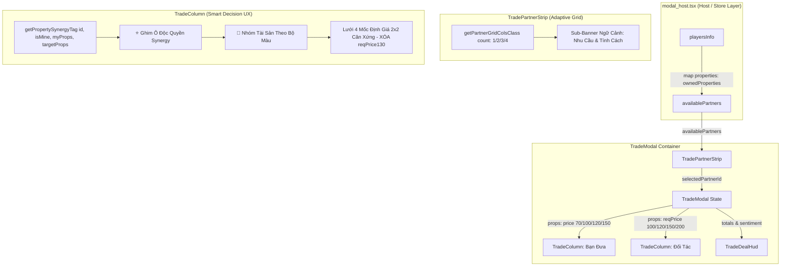

# [Kế Hoạch Triển Khai v2] Tái Cấu Trúc Công Thái Học Giao Diện Trao Đổi Đất P2P (IMP-218)

> **Dành cho agent thực thi:** BẮT BUỘC tuân thủ Quy trình 3 Trạm tự hành (Station 1 RED Contract -> Station 2 GREEN Implementation -> Station 2.5 Scout Audit -> Station 3 Review).

**Mục tiêu:** Tái thiết kế giao diện Trao đổi đất P2P (`TradeModal`, `TradePartnerStrip`, `TradeColumn`) nhằm triệt tiêu hoàn toàn cuộn ngang dải đối tác (lưới thích ứng 1/2/3/4 cột), ghim các ô đất tạo Bộ Độc Quyền (Synergy) lên đầu, xóa bỏ triệt để `reqPrice130` và chuẩn hóa lưới 4 mốc tiền đề nghị (2x2 cân xứng), kết nối đầy đủ `properties` vào `TradePartnerInfo` từ `modal_host.tsx`.

---

## 📐 Kiến Trúc Tổng Thể & Luồng Dữ Liệu 5 Trạm



---

## 🛡️ Bảng Ma Trận & Thông Số Kỹ Thuật Chi Tiết (Resolving Review Findings)

### 1. Khắc Phục Lỗi 1 (BLOCK): Xóa Bỏ Triệt Để `reqPrice130` (Subtractive Parity)
- **Tệp `src/client/ui/modals/trade/trade_column.tsx`**:
  - **Xóa**: L30 (`readonly reqPrice130?: number;`)
  - **Xóa**: L57 (`reqPrice130 = 0,`)
  - **Xóa**: L232 (`<button ... onClick={() => onCashChange(reqPrice130)}>130% ...</button>`)
  - **Thêm**:
    - `readonly price150?: number;`
    - `readonly reqPrice120?: number;`
    - `readonly reqPrice200?: number;`
- **Tệp `src/client/ui/modals/trade_modal.tsx`**:
  - **Xóa**: L125 (`const reqPrice130 = Math.round(requestedBaseCost * 1.3);`)
  - **Xóa**: L220 (`reqPrice130={reqPrice130}`)
  - **Thêm**:
    - `const price150 = Math.round(offeredBaseCost * 1.5);`
    - `const reqPrice120 = Math.round(requestedBaseCost * 1.2);`
    - `const reqPrice200 = Math.round(requestedBaseCost * 2.0);`
  - Truyền cho cột Bạn Đưa: `reqPrice100`, `reqPrice120`, `reqPrice150`, `reqPrice200`.
  - Truyền cho cột Đối Tác: `price70`, `price100`, `price120`, `price150`.
- **Tệp test cũ `tests/contracts/imp208_mobile_real_estate_ui_polish.test.ts`**:
  - Sửa L334: Thay `reqPrice130: 1300` bằng `reqPrice120: 1200` và thêm `reqPrice200: 2000`.

### 2. Khắc Phục Lỗi 2 (BLOCK): Nguồn Cấp Dữ Liệu Sub-Banner (Vertical Slice Completeness)
- **Tệp `src/client/ui/modals/trade/trade_partner_strip.tsx`**:
  - Mở rộng `TradePartnerInfo`:
    ```ts
    export interface TradePartnerInfo {
      readonly id: string;
      readonly name: string;
      readonly balance: number;
      readonly isBot?: boolean;
      readonly avatar?: string;
      readonly personality?: string;
      readonly properties?: readonly number[]; // Bổ sung nguồn cấp BĐS
    }
    ```
- **Tệp `src/client/ui/modals/modal_host.tsx` (L277-L288)**:
  - Khi map `availablePartners`, truyền trực tiếp:
    ```ts
    properties: playersInfo[id]?.ownedProperties ?? []
    ```
- **Tệp `trade_partner_strip.tsx` (Sub-Banner logic)**:
  - Gọi `getBotNeedBadge` với nguồn cấp chuẩn xác:
    ```ts
    const selectedNeedBadge = selectedIsBot
      ? getBotNeedBadge(
          selectedPartner,
          selectedPartner.properties ?? targetProperties,
          selectedPartner.balance
        )
      : null;
    ```

### 3. Khắc Phục Lỗi HIGH 1: Ma Trận Cột Thích Ứng Cho 1, 2, 3, 4 Đối Tác
Hàm tính toán class CSS (không để lại ô trống):
```ts
export function getPartnerGridColsClass(count: number): string {
  if (count <= 1) return 'grid-cols-1';
  if (count === 2) return 'grid-cols-2';
  if (count === 3) return 'grid-cols-3';
  return 'grid-cols-4';
}
```
**Bảng hành vi thích ứng trên Viewport 360px:**
| Số Đối Tác | Grid Class | Chiều Rộng Mỗi Nút | Trải Nghiệm & Chống Lệch |
| :---: | :---: | :---: | :--- |
| **1 đối tác** | `grid-cols-1` | 100% (~320px) | 1 ô đối tác duy nhất chiếm trọn chiều ngang, không để lại ô trống. |
| **2 đối tác** | `grid-cols-2` | 50% (~155px) | 2 ô chia đôi cân xứng hoàn hảo. |
| **3 đối tác** | `grid-cols-3` | 33.3% (~102px) | 3 ô hiển thị đồng thời, không cần quẹt ngang. |
| **4+ đối tác** | `grid-cols-4` | ~75px | Tự động chia 4 ô hoặc cuộn mượt nếu tên dài. |

### 4. Khắc Phục Lỗi HIGH 2: Đặc Tả Tham Số Gọi `getPropertySynergyTag`
- **Định nghĩa gốc tại `src/client/ui/modals/trade_intelligence.ts`**:
  ```ts
  export function getPropertySynergyTag(
    cellId: number,
    isMineOrReceiverProps: boolean | readonly number[],
    myProps?: readonly number[],
    targetProps?: readonly number[],
  ): string | undefined;
  ```
- **Quy tắc gọi trong `TradeColumn`**:
  ```ts
  const synergyTag = getPropertySynergyTag(
    id,              // Param 1 (number): cellId của ô BĐS đang duyệt
    isMine,          // Param 2 (boolean): true nếu là đất của tôi, false nếu là đất đối tác
    myProperties,    // Param 3 (readonly number[]): danh sách BĐS tôi đang sở hữu
    targetProperties // Param 4 (readonly number[]): danh sách BĐS đối tác đang sở hữu
  );
  ```
- **Phân tách danh sách trong `TradeColumn`**:
  ```ts
  const synergyProps = properties.filter((id) =>
    Boolean(getPropertySynergyTag(id, isMine, myProperties, targetProperties))
  );
  const standardProps = properties.filter((id) =>
    !getPropertySynergyTag(id, isMine, myProperties, targetProperties)
  );
  ```

---

## 📋 Danh Sách Nhiệm Vụ Chi Tiết

### Nhiệm Vụ 1: Hợp Đồng Kiểm Thử Trạm 1 (Station 1 RED Contract Test)
**Tệp:** `tests/client/imp218_trade_modal_ergonomics_redesign.test.ts`
- [ ] **Step 1:** Viết 16 atomic tests (Universal 5-Facet Matrix):
  - **Facet 1 (Boundary)**:
    - `getPartnerGridColsClass(1)` trả về `grid-cols-1`.
    - `getPartnerGridColsClass(2)` trả về `grid-cols-2`.
    - `getPartnerGridColsClass(3)` trả về `grid-cols-3`.
    - `getPartnerGridColsClass(4)` trả về `grid-cols-4`.
  - **Facet 2 (Subtractive Parity & 4 Mốc Định Giá)**:
    - DOM mua đất KHÔNG CHỨA text `130%` và KHÔNG CHỨA `reqPrice130`.
    - DOM mua đất hiển thị đúng 4 mốc: `100% Gốc`, `120% Lãi nhẹ`, `150% Hấp dẫn`, `200% Ép bán`.
    - DOM bán đất hiển thị đúng 4 mốc: `70% Sàn`, `100% Gốc`, `120% Lãi chuẩn`, `150% Thắng lớn`.
    - Container mốc định giá có class `grid-cols-2`.
  - **Facet 3 (Strategic Synergy Pinning)**:
    - Khi có ô đất tạo synergy (`getPropertySynergyTag` trả về chuỗi), ô đó được render trong khối mang tiêu đề `⭐ CƠ HỘI ĐỘC QUYỀN (WIN-WIN)`.
    - Ô không có synergy được render trong khối `📁 DANH MỤC BĐS`.
  - **Facet 4 (Sub-Banner Data Source)**:
    - `TradePartnerStrip` nhận `availablePartners` có trường `properties`, sub-banner hiển thị tag nhu cầu `⚡ Cần 1 ô...` ngay cả khi đối tác chưa từng được chọn.
  - **Facet 5 (Ergonomics)**:
    - Cả 4 nút định giá đều chứa `shadow-[0_2px_0_0_#...]` và `active:translate-y-[2px]`, đạt `min-h-[44px]`.
- [ ] **Step 2:** Chạy test để chứng minh RED: `npx vitest run tests/client/imp218_trade_modal_ergonomics_redesign.test.ts`.

### Nhiệm Vụ 2: Triển Khai Dải Đối Tác & Nguồn Dữ Liệu (Station 2 GREEN Part 1)
**Tệp:**
- `src/client/ui/modals/trade/trade_partner_strip.tsx`
- `src/client/ui/modals/modal_host.tsx`
- [ ] **Step 1:** Cập nhật `TradePartnerInfo` thêm `readonly properties?: readonly number[];`
- [ ] **Step 2:** Cập nhật `modal_host.tsx` map `properties: playersInfo[id]?.ownedProperties ?? []`.
- [ ] **Step 3:** Triển khai `getPartnerGridColsClass` và render lưới thích ứng kèm sub-banner ngữ cảnh trong `TradePartnerStrip`.

### Nhiệm Vụ 3: Ghim Synergy, Xóa `reqPrice130` & Chuẩn Hóa Lưới 4 Mốc (Station 2 GREEN Part 2)
**Tệp:**
- `src/client/ui/modals/trade/trade_column.tsx`
- `src/client/ui/modals/trade_modal.tsx`
- `tests/contracts/imp208_mobile_real_estate_ui_polish.test.ts`
- [ ] **Step 1:** Trong `trade_modal.tsx`: xóa `reqPrice130`, tính toán `price150`, `reqPrice120`, `reqPrice200` và truyền props.
- [ ] **Step 2:** Trong `trade_column.tsx`:
  - Xóa `reqPrice130` khỏi props và logic.
  - Phân tách `synergyProps` và `standardProps`. Render khối `⭐ CƠ HỘI ĐỘC QUYỀN (WIN-WIN)` lên đầu.
  - Thay thế cụm 3 nút bằng lưới `grid grid-cols-2 gap-1.5` cho 4 mốc mua và bán.
- [ ] **Step 3:** Cập nhật test `imp208_mobile_real_estate_ui_polish.test.ts` để đồng bộ xóa `reqPrice130`.

### Nhiệm Vụ 4: Trạm 2.5 Scout Audit & Trạm 3 Nghiệm Thu
- [ ] **Step 1:** Chạy toàn bộ test suites liên quan đến trade modal:
  `npx vitest run tests/client/imp218_trade_modal_ergonomics_redesign.test.ts tests/client/imp202_trade_modal_ergonomics_overhaul.test.ts tests/contracts/imp208_mobile_real_estate_ui_polish.test.ts`
- [ ] **Step 2:** Chạy kiểm tra ngân sách LOC: `npm run check:loc`.
- [ ] **Step 3:** Quét 5 nhóm lỗi thường gặp (Stale state, unhandled async, memory leak, dirty bypass, dead code).
- [ ] **Step 4:** Ghi nhận bằng chứng kiểm thử tại `.agents/evidence/imp218_execution.json`.
