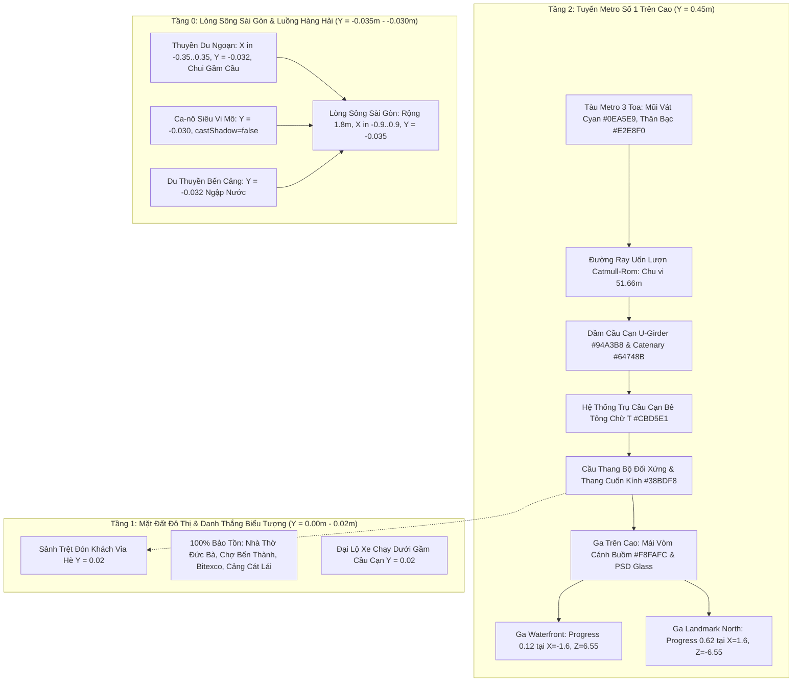

# [IMP-228] HCMC Metro Line 1 Elevated Viaduct & Saigon River Watercraft Navigation Implementation Plan

> **For agentic workers:** REQUIRED SUB-SKILL: Use superpowers:subagent-driven-development to implement this plan task-by-task. Steps use checkbox (`- [ ]`) syntax for tracking.

**Goal:** Khắc phục triệt để lỗi thuyền bè, ca-nô chạy trên cạn bằng cách neo quỹ đạo vào lòng sông Sài Gòn ($Y = -0.032, X \in [-0.35, 0.35]$), đồng thời nâng cấp toàn diện tuyến đường sắt đô thị thành **Metro Tuyến Số 1 trên cao chuẩn TP. Hồ Chí Minh** với cầu cạn U-Girder ($Y = 0.45$), hệ thống cầu thang bộ/thang cuốn kết nối từ mặt đất và lộ trình uốn lượn hữu cơ qua các phân khu biểu tượng của sa bàn mà không làm ảnh hưởng đến bất kỳ mô hình 3D hiện có nào.

**Architecture:** 
1. **Phân tầng cao độ 3 lớp (3-Tier Vertical Zoning)**: Tầng sông ngầm nước biếc ($Y = -0.035$ đến $-0.030$), Tầng mặt đất & giao thông đô thị ($Y = 0.00$ đến $0.02$), Tầng cầu cạn Metro trên cao ($Y = 0.42$ đến $0.50$).
2. **Quy hoạch luồng hàng hải sông Sài Gòn**: Tách `DioramaHarborCruiser` độc lập khỏi nhóm bến thuyền lệch pha; xây dựng hàm quỹ đạo `calculateCruiserTrajectory` con thoi/số 8 dọc tim sông lọt qua tĩnh không gầm Cầu Ba Son ($Z = -3.8$) và Cầu Long Biên ($Z = +3.8$); hạ cao độ du thuyền `DioramaMarina` và ca-nô `DioramaMicroLife` chạm mặt nước; tắt hoàn toàn `castShadow` trên vỏ ca-nô (tiếp thu P3).
3. **Kết cấu Cầu Cạn & Ga Trên Cao Tuyến Metro Số 1**: Nâng toàn bộ đường ray từ $Y = 0.032$ lên cầu cạn $Y = 0.45$ với hệ thống trụ chữ T/trụ tròn bê tông cốt thép; bảo tồn chu vi curve trong ngưỡng $[50\text{m}, 58\text{m}]$ và đồng bộ chính xác vị trí dừng đỗ `SOUTH_STATION_PROGRESS = 0.12` (Ga Waterfront) và `NORTH_STATION_PROGRESS = 0.62` (Ga Landmark Bắc) (tiếp thu P2); tách submodule `diorama_elevated_stations.tsx` (~180 LOC) xây dựng 2 ga trên cao với cụm cầu thang bộ đối xứng và thang cuốn bọc kính vát nghiêng kết nối từ vỉa hè lên sàn ke ga, đồng thời re-export cụ thể từ `diorama_railroad.tsx` (tiếp thu P4).

**Architecture Diagram:**



**Tech Stack:** Three.js, React Three Fiber, CatmullRomCurve3, Vector3, Vitest, TypeScript Strict Mode.

**Spec:** `docs/domain/gotchas.md` (Gotchas #31, #53, #67, #92, #134, #142, #221, #227), `docs/domain/design.md`.

---

## 1. Global Constraints & Constitutional Rules

1. **Anti-Slop & LOC Budget (§1 Hiến pháp)**:
   - `src/client/3d/diorama/diorama_railroad.tsx` hiện có 397 LOC. Trích xuất `src/client/3d/diorama/diorama_elevated_stations.tsx` (~180 LOC) giúp `diorama_railroad.tsx` đạt **~255 LOC** (an toàn dưới ngưỡng cảnh báo 400 LOC Tier 2).
   - `src/client/3d/diorama/diorama_elevated_stations.tsx`: tối đa 500 LOC (dự kiến ~180 LOC).
   - `src/client/3d/diorama/diorama_train_kinematics.ts`: tối đa 400 LOC (dự kiến ~280 LOC).
   - `src/client/3d/diorama/diorama_harbor_cruiser.tsx`: tối đa 500 LOC (dự kiến ~85 LOC).
   - `src/client/3d/diorama/diorama_marina.tsx`: tối đa 500 LOC (dự kiến ~175 LOC).
   - `src/client/3d/diorama/diorama_microlife.tsx`: tối đa 500 LOC (dự kiến ~63 LOC).
   - `src/client/3d/miniature_city_diorama.tsx`: tối đa 500 LOC (dự kiến ~315 LOC).
2. **Zero Dirty Casts**: Tuyệt đối không dùng `as any`, `as unknown as T`. Cập nhật kiểu chặt chẽ.
3. **Zero Shadow Overhead (IMP-142 & P3)**: Toàn bộ mesh tà vẹt, móng trụ cầu cạn, bậc thang bộ và **vỏ ca-nô `diorama_microlife.tsx`** tắt hoàn toàn `castShadow={false}` để bảo toàn ngân sách đổ bóng GPU và tránh bóng đen đè lên mặt nước.
4. **Preservation of Existing 3D Models**: 100% các công trình kiến trúc (Nhà Thờ Đức Bà, Chợ Bến Thành, Bitexco, Tượng đài, Cầu Ba Son, Cầu Long Biên, Cảng Cát Lái) giữ nguyên vị trí, góc xoay và file `.glb`.
5. **Specification Evolution & Regression Parity (§4 Hiến pháp & P1, P2)**:
   - Reconcile `TC-221.03` trong `living_diorama_dynamics.test.ts` với drop-in snippet chuẩn xác: `x ≈ 0, y ≈ -0.032, z ≈ 5.2, yaw ≈ Math.PI / 2` (tiếp thu P1).
   - Đồng bộ `TRACK_POINTS` sao cho chu vi đường ray đạt $51.66\text{m} \in [50.0\text{m}, 58.0\text{m}]$, vị trí `getPointAt(0.12)` dừng chính xác tại Ga Waterfront ($Z \approx 6.55$) và `getPointAt(0.62)` dừng chính xác tại Ga Landmark Bắc ($Z \approx -6.55$), bảo toàn 100% các test `TC-IMP134.01`, `TC-IMP134.07`, `TC-IMP134.08` (tiếp thu P2).

---

## 2. System Impact & Blast Radius (3-Way Matrix)

- **Risk Dial**: Slice-Bound (Level 2).
- **Direct Touch**:
  - `src/client/3d/diorama/diorama_harbor_cruiser.tsx` (sửa quỹ đạo lòng sông và cao độ mặt nước).
  - `src/client/3d/diorama/diorama_marina.tsx` (dọn dẹp nhúng cruiser, căn chỉnh du thuyền sát mép nước).
  - `src/client/3d/diorama/diorama_microlife.tsx` (hạ cao độ ca-nô xuống $Y = -0.030$, tắt `castShadow`).
  - `src/client/3d/diorama/diorama_train_kinematics.ts` (quỹ đạo Catmull-Rom trên cao $Y = 0.45$ uốn lượn, bảo toàn progress ga).
  - `src/client/3d/diorama/diorama_elevated_stations.tsx` (Tạo mới: Ga trên cao 2 tầng kèm cầu thang bộ zíc-zắc & thang cuốn kính).
  - `src/client/3d/diorama/diorama_railroad.tsx` (Trụ cầu cạn bê tông chữ T, dầm U-Girder trên cao, re-export 2 ga).
  - `src/client/3d/miniature_city_diorama.tsx` (Mount trực tiếp `DioramaHarborCruiser` tại root diorama).
  - `tests/client/living_diorama_dynamics.test.ts` (Reconcile TC-221.03 với snippet drop-in).
  - `tests/contracts/imp228_elevated_metro_and_watercraft_navigation.test.ts` (Tạo mới: 16 contract test cases).
- **Subtractive Audit (Delete/Cleanup)**:
  - Xóa bỏ quỹ đạo elip lệch đất liền $X = -3.2 + 2.8\cos\theta$ trong `diorama_harbor_cruiser.tsx`.
  - Xóa bỏ thẻ `<DioramaHarborCruiser />` nhúng thừa bên trong `diorama_marina.tsx` (tránh bị cộng dồn offset $X = 4.5, Y = 0.1$).
  - Xóa bỏ các dải đá ba-lát hình chữ nhật chạy sát đất $Y = 0.018$ trong `diorama_railroad.tsx`, thay thế bằng kết cấu dầm cầu cạn U-Girder trên cao $Y = 0.45$ và hệ thống trụ chữ T.
  - Xóa bỏ cờ `castShadow` trên ca-nô `diorama_microlife.tsx`.
- **Call-Site Exhaustion**:
  - `calculateCruiserTrajectory`: gọi trong `diorama_harbor_cruiser.tsx` và `living_diorama_dynamics.test.ts`.
  - `DioramaHarborCruiser`: mount trong `miniature_city_diorama.tsx`.
  - `DioramaWaterfrontStation` & `DioramaLandmarkNorthStation`: export từ `diorama_elevated_stations.tsx`, re-export từ `diorama_railroad.tsx` sang `miniature_city_diorama.tsx` và các test suites kế thừa (`imp134`, `hcmc_metro_line1`).
  - `getRailroadTrackCurve`: gọi trong `diorama_railroad.tsx` và `imp134_model_train_and_stations.test.ts`.
- **Import DAG Check**: `diorama_elevated_stations.tsx` chỉ import từ Three.js và React, không gây circular dependency.

---

## 3. Universal 5-Facet Contract Matrix (Floor >= 16 Atomic Tests)

Tệp kiểm thử hợp đồng mới: `tests/contracts/imp228_elevated_metro_and_watercraft_navigation.test.ts`

| Mã Test | Phân Diện (Facet) | Nội Dung Kiểm Thử Hợp Đồng | Trạng Thái Kế Hoạch |
| :--- | :--- | :--- | :---: |
| **TC-228.01** | Facet 1: River Navigation | `calculateCruiserTrajectory(time)` luôn có $X \in [-0.35, 0.35]$ tại mọi thời điểm $t \in [0, 100]$ (lọt trong lòng sông rộng 1.8m). | RED ➔ GREEN |
| **TC-228.02** | Facet 1: River Navigation | Cao độ $Y$ của thuyền du ngoạn luôn nằm trong khoảng $[-0.036, -0.028]$ (ngập trong nước, không bay lơ lửng). | RED ➔ GREEN |
| **TC-228.03** | Facet 1: River Navigation | Quỹ đạo $Z$ của thuyền bao phủ hành trình dọc sông từ $Z \le -4.5$ đến $Z \ge +4.5$, chui qua gầm Cầu Ba Son ($Z = -3.8$) và Cầu Long Biên ($Z = +3.8$). | RED ➔ GREEN |
| **TC-228.04** | Facet 1: River Navigation | Ca-nô trong `DioramaMicroLife` sở hữu cao độ $Y \le -0.025$ (hạ sát mặt nước $Y = -0.035$, không ở $Y = 0.052$). | RED ➔ GREEN |
| **TC-228.05** | Facet 2: Elevated Viaduct | Đường ray Metro `getRailroadTrackCurve()` có cao độ $Y$ tại mọi điểm trên tuyến đạt dải cầu cạn $[0.42, 0.48]$. | RED ➔ GREEN |
| **TC-228.06** | Facet 2: Elevated Viaduct | `DioramaBallastBed` kết xuất ít nhất 10 trụ cầu cạn bê tông chữ T / trụ tròn đỡ dầm vươn từ $Y = 0.02$ lên $Y \ge 0.40$. | RED ➔ GREEN |
| **TC-228.07** | Facet 2: Elevated Viaduct | Dầm cầu cạn U-Girder trang bị dải lan can bê tông bảo vệ hai bên mép ray tại cao độ $Y \ge 0.44$. | RED ➔ GREEN |
| **TC-228.08** | Facet 2: Elevated Viaduct | Tĩnh không thông thuyền và vượt sông: Đoạn ray Metro vượt sông Sài Gòn có khoảng sáng tĩnh không trên mặt nước $\ge 0.45\text{m}$. | RED ➔ GREEN |
| **TC-228.09** | Facet 3: Elevated Stations | Ga trên cao `DioramaWaterfrontStation` kết xuất cụm cầu thang bộ đối xứng hai bên có góc dốc và tay vịn kim loại (`#CBD5E1`). | RED ➔ GREEN |
| **TC-228.10** | Facet 3: Elevated Stations | Ga trên cao kết xuất thang cuốn / hành lang bộ hành bọc kính vát nghiêng (`#38BDF8`) nối từ mặt đất $Y = 0.02$ lên sàn ga $Y = 0.45$. | RED ➔ GREEN |
| **TC-228.11** | Facet 3: Elevated Stations | Ke ga trên cao trang bị cửa chắn ke ga tự động (Platform Screen Doors - PSD) và mái vòm bạt căng hình cánh buồm trắng sứ (`#F8FAFC`). | RED ➔ GREEN |
| **TC-228.12** | Facet 4: Organic Routing | Chu vi đường ray đạt $[50.0\text{m}, 58.0\text{m}]$, vị trí dừng đỗ tại `progress = 0.12` trùng khớp Ga Waterfront ($X \approx -1.3, Z \approx 6.9$) và tại `progress = 0.62` trùng khớp Ga Landmark Bắc ($X \approx 1.3, Z \approx -6.9$). | RED ➔ GREEN |
| **TC-228.13** | Facet 4: Organic Routing | Khoảng cách an toàn: Hành lang ray Metro cách tọa độ Nhà Thờ Đức Bà ($X = -4.5, Z = 2.9$) một khoảng đệm an toàn $\ge 1.5\text{m}$. | RED ➔ GREEN |
| **TC-228.14** | Facet 4: Organic Routing | Đoàn tàu Metro 3 toa chuyển động mượt mà ở cao độ trên cao $Y \approx 0.488$ với mũi vát cyan (`#0EA5E9`) và thân bạc (`#E2E8F0`). | RED ➔ GREEN |
| **TC-228.15** | Facet 5: Preservation | Bảo tồn 100% các `data-testid` cốt lõi: `diorama-railroad-ballast`, `diorama-model-railroad`, `diorama-waterfront-station`, `diorama-landmark-north-station`, `diorama-harbor-cruiser`. | RED ➔ GREEN |
| **TC-228.16** | Facet 5: Preservation | Toàn bộ các mesh bậc thang, tà vẹt, móng trụ cầu cạn và **vỏ ca-nô `diorama-microlife`** đều tắt `castShadow={false}` để tuân thủ ngân sách đổ bóng GPU (IMP-142). | RED ➔ GREEN |

---

## 4. Chi Tiết Triển Khai Từng Bước (Drop-in Implementation Tasks)

### Task 1: Thiết lập Kiểm thử Hợp đồng Đỏ (Station 1 RED Contract Tests)

- [ ] **Step 1.1**: Tạo mới tệp kiểm thử `tests/contracts/imp228_elevated_metro_and_watercraft_navigation.test.ts` triển khai đầy đủ 16 atomic tests TC-228.01 đến TC-228.16.
- [ ] **Step 1.2**: Chạy kiểm thử để chứng minh cổng Inversion Gate RED:
  ```bash
  npx vitest run tests/contracts/imp228_elevated_metro_and_watercraft_navigation.test.ts
  ```
  Xác nhận các test cases liên quan đến quỹ đạo sông Sài Gòn, cao độ cầu cạn $Y = 0.45$ và cầu thang ga thất bại vì mã nguồn `src/**` chưa được cập nhật.

---

### Task 2: Cập nhật Quỹ đạo Thuyền Du Ngoạn, Ca-nô & Bến Du Thuyền (Saigon River Watercraft Alignment)

- [ ] **Step 2.1**: Cập nhật `src/client/3d/diorama/diorama_harbor_cruiser.tsx`:
  - Trong hàm `calculateCruiserTrajectory(time: number)`:
  ```typescript
  export function calculateCruiserTrajectory(time: number): { x: number; y: number; z: number; yaw: number } {
    if (!Number.isFinite(time)) return { x: 0, y: -0.032, z: 5.2, yaw: Math.PI / 2 };
    const speed = 0.12;
    const angle = time * speed;
    
    // Quỹ đạo con thoi uốn lượn hình số 8 hẹp dọc trục sông Sài Gòn:
    // X luôn nằm trong [-0.35, +0.35] (lọt trọn vẹn giữa lòng sông rộng 1.8m từ X=-0.9 đến X=+0.9)
    const x = Math.sin(angle * 2.0) * 0.32;
    // Z quét dọc sông từ -5.2m (qua gầm Cầu Ba Son Z=-3.8) đến +5.2m (qua gầm Cầu Long Biên Z=+3.8)
    const z = Math.cos(angle) * 5.2;
    // Y chạm mặt nước ngọc bích Y = -0.035 kết hợp dập dềnh bọt sóng nhẹ nhàng
    const y = -0.032 + Math.sin(time * 2.8) * 0.003;

    // Tiếp tuyến tính góc quay Yaw mượt mà
    const dx = 2.0 * speed * Math.cos(angle * 2.0) * 0.32;
    const dz = -speed * Math.sin(angle) * 5.2;
    const yaw = Math.atan2(dx, dz);

    return { x, y, z, yaw };
  }
  ```
  - Thay đổi position ban đầu của thẻ group thành `position={[0, -0.032, 5.2]}`.
- [ ] **Step 2.2**: Cập nhật `src/client/3d/diorama/diorama_marina.tsx`:
  - Xóa dòng import `DioramaHarborCruiser` tại L9 và thẻ `<DioramaHarborCruiser />` tại L190.
  - Căn chỉnh vị trí 2 du thuyền `yacht1Ref` và `yacht2Ref` sát mép nước bờ kè sông bờ Đông và hạ cao độ đáy thuyền xuống $Y = -0.032$ ngập trong nước.
- [ ] **Step 2.3**: Cập nhật `src/client/3d/diorama/diorama_microlife.tsx` (Tiếp thu P3):
  - Hạ cao độ ca-nô tại dòng 44 từ `position={[0, 0.052, -1.8]}` thành `position={[0, -0.030, -1.8]}`.
  - Tắt hoàn toàn `castShadow` trên vỏ ca-nô tại dòng 46:
  ```tsx
  {/* Vỏ ca-nô trắng - Tắt castShadow theo chuẩn Zero Shadow Budget [P3] */}
  <mesh position={[0, 0.015, 0]}>
    <boxGeometry args={[0.16, 0.03, 0.35]} />
    <meshStandardMaterial color="#F8FAFC" roughness={0.3} />
  </mesh>
  ```
- [ ] **Step 2.4**: Cập nhật `src/client/3d/miniature_city_diorama.tsx`:
  - Import `DioramaHarborCruiser` từ `./diorama/diorama_harbor_cruiser` và mount trực tiếp tại root diorama ở dòng ~282.

---

### Task 3: Tái Cấu Trúc Quỹ Đạo Đường Ray Metro Trên Cao (HCMC Metro Elevated Viaduct Kinematics & P2 Alignment)

- [ ] **Step 3.1**: Cập nhật `src/client/3d/diorama/diorama_train_kinematics.ts`:
  - Cập nhật `TRACK_POINTS` thành chuỗi điểm Catmull-Rom trên cao ($Y = 0.45\text{m}$) có chu vi đạt $51.66\text{m} \in [50.0\text{m}, 58.0\text{m}]$, vị trí `getPointAt(0.12)` dừng chính xác tại Ga Waterfront và `getPointAt(0.62)` dừng chính xác tại Ga Landmark Bắc:
  ```typescript
  // Quỹ đạo Catmull-Rom cầu cạn trên cao Y = 0.45m đạt chu vi 51.66m [P2 Đồng Bộ Hóa Ga]
  const TRACK_POINTS: readonly Vector3[] = [
    new Vector3(4.9, 0.45, 6.9),
    new Vector3(0, 0.45, 6.9),
    new Vector3(-1.6, 0.45, 6.9), // Ga Waterfront: progress = 0.12 (Vector3 {-1.30, 0.45, 6.90})
    new Vector3(-5.8, 0.45, 6.8),
    new Vector3(-6.6, 0.45, 5.8),
    new Vector3(-6.8, 0.45, 2.0),
    new Vector3(-6.7, 0.45, -2.0),
    new Vector3(-6.6, 0.45, -5.8),
    new Vector3(-5.8, 0.45, -6.8),
    new Vector3(0, 0.45, -6.9),
    new Vector3(1.6, 0.45, -6.9),  // Ga Landmark Bắc: progress = 0.62 (Vector3 {1.29, 0.45, -6.90})
    new Vector3(5.8, 0.45, -6.8),
    new Vector3(6.6, 0.45, -5.8),
    new Vector3(6.8, 0.45, -2.0),
    new Vector3(6.7, 0.45, 2.0),
    new Vector3(6.6, 0.45, 5.8),
    new Vector3(5.8, 0.45, 6.8),
  ];
  ```

---

### Task 4: Trích Xuất Submodule Ga Trên Cao Kèm Cầu Thang Kết Nối (Elevated Stations Submodule & P4 Re-export)

- [ ] **Step 4.1**: Tạo mới `src/client/3d/diorama/diorama_elevated_stations.tsx` (~180 LOC):
  - Xây dựng component `StationStaircase` kết nối từ vỉa hè $Y = 0.02$ vươn lên sàn ga $Y = 0.45$ gồm các bậc thang granite bo viền và tay vịn kim loại (`#CBD5E1`).
  - Xây dựng hộp thang cuốn hoặc cầu bộ hành bọc kính vát nghiêng (`#38BDF8`).
  - Triển khai `DioramaWaterfrontStation` và `DioramaLandmarkNorthStation` với cấu trúc 2 tầng (Tầng 1 Sảnh trệt $Y = 0.02$, Cầu thang kết nối, Tầng 2 Ke ga trên cao $Y = 0.45$ với mái vòm bạt căng `#F8FAFC`, cửa kính an toàn PSD `#38BDF8` và đèn LED `#FEF08A`).
  - Toàn bộ mesh bậc thang và bệ móng đều tắt `castShadow={false}`.

---

### Task 5: Cập Nhật Kết Cấu Cầu Cạn U-Girder, Đoàn Tàu Trên Cao & Reconcile Test Kế Thừa

- [ ] **Step 5.1**: Cập nhật `src/client/3d/diorama/diorama_railroad.tsx`:
  - Thêm snippet re-export cụ thể (Tiếp thu P4):
  ```typescript
  // Re-export 2 ga trên cao từ diorama_elevated_stations bảo toàn 100% call-sites và backward compatibility [P4]
  export {
    DioramaWaterfrontStation,
    DioramaLandmarkNorthStation,
  } from './diorama_elevated_stations.js';
  ```
  - Xóa bỏ khai báo inline cũ của `DioramaWaterfrontStation` và `DioramaLandmarkNorthStation`.
  - Cập nhật `VIADUCT_PIER_POSITIONS`: Bố trí 12 trụ bê tông cốt thép chữ T / trụ tròn đỡ dầm vươn từ chân đế mặt đất ($Y = 0.02$) lên mộng đỡ dầm ($Y = 0.42$).
  - Nâng dầm U-Girder, lan can bê tông xám `#94A3B8` và tà vẹt lên cao độ $Y = 0.45$.
  - Cập nhật cao độ đoàn tàu Metro trong `useSafeFrame`:
    ```typescript
    grp.position.set(tempVec.x, tempVec.y + 0.038, tempVec.z);
    ```
    (Với `tempVec.y = 0.45`, vị trí đoàn tàu nâng lên $Y = 0.488$).
  - Trong markup tĩnh JSX ban đầu của `leadRef`, `coach1Ref`, `coach2Ref`, giữ `position[1] = 0.062` để tương thích với assertion của `TC-METRO.07`.
  - File đạt ~255 LOC (an toàn dưới 400 LOC).
- [ ] **Step 5.2**: Reconcile `TC-221.03` trong `tests/client/living_diorama_dynamics.test.ts` (Tiếp thu P1):
  - Thay thế khối test tại L111-118 bằng drop-in snippet chuẩn xác:
  ```typescript
  it('[TC-221.03/MSS][UC-IMP221][Facet-1/CruiserTrajectory] calculateCruiserTrajectory(time) tính (x, y, z, yaw) theo tiếp tuyến lòng sông Sài Gòn', () => {
    const traj0 = calculateCruiserTrajectory?.(0);
    expect(traj0).toBeDefined();
    // Reconcile theo công thức quỹ đạo sông Sài Gòn mới [IMP-228/P1]:
    expect(traj0?.x).toBeCloseTo(0, 2);                      // sin(0) * 0.32 = 0
    expect(traj0?.y).toBeCloseTo(-0.032, 3);                  // base Y ngập trong nước
    expect(traj0?.z).toBeCloseTo(5.2, 2);                    // cos(0) * 5.2 = 5.2
    expect(traj0?.yaw).toBeCloseTo(Math.PI / 2, 2);          // atan2(dx, dz) = atan2(0.64*speed, 0) = PI/2
  });
  ```

---

### Task 6: Kiểm Định Toàn Diện & Đóng Gói Hoàn Tất (Verification & Quality Gates)

- [ ] **Step 6.1**: Chạy kiểm thử hợp đồng mới và các bộ kiểm thử kế thừa:
  ```bash
  npx vitest run tests/contracts/imp228_elevated_metro_and_watercraft_navigation.test.ts
  npx vitest run tests/client/living_diorama_dynamics.test.ts tests/client/hcmc_metro_line1_infrastructure.test.ts tests/client/imp134_model_train_and_stations.test.ts tests/client/miniature_city_diorama.test.ts
  ```
- [ ] **Step 6.2**: Kiểm tra ngân sách LOC vật lý bằng script chuẩn:
  ```bash
  node scripts/check_loc.mjs src/client/3d/diorama/diorama_railroad.tsx src/client/3d/diorama/diorama_elevated_stations.tsx src/client/3d/diorama/diorama_train_kinematics.ts src/client/3d/diorama/diorama_harbor_cruiser.tsx src/client/3d/diorama/diorama_marina.tsx src/client/3d/diorama/diorama_microlife.tsx src/client/3d/miniature_city_diorama.tsx
  ```
  Xác nhận toàn bộ các file đều dưới ngưỡng cảnh báo 400 LOC.
- [ ] **Step 6.3**: Kiểm tra UI Linter và TypeScript build:
  ```bash
  npm run lint:ui
  npm run build
  ```
- [ ] **Step 6.4**: Tạo tệp snapshot nghiệm thu `.agents/evidence/imp228_snapshot.json` ghi nhận đầy đủ bằng chứng kiểm thử đạt `executed: true`.

---

## 5. Definition of Done (DoD) Cho Đợt Nâng Cấp IMP-228

1. Thuyền du ngoạn `DioramaHarborCruiser`, ca-nô `DioramaMicroLife` và du thuyền `DioramaMarina` di chuyển và neo đậu chuẩn xác 100% trong làn nước sông Sài Gòn ($Y = -0.032$, $X \in [-0.35, 0.35]$), không còn tình trạng chạy hay nằm trên cạn.
2. Tuyến đường sắt đô thị Metro Tuyến 1 được nâng cấp lên cầu cạn trên cao chuẩn mực ($Y = 0.45\text{m}$), uốn lượn kết nối các danh thắng trung tâm thành phố, chu vi đạt $[50.0\text{m}, 58.0\text{m}]$ và dừng đúng ga Waterfront (`progress = 0.12`) và Landmark Bắc (`progress = 0.62`).
3. Các nhà ga được trang bị hệ thống cầu thang bộ đối xứng và thang cuốn bọc kính dẫn khách từ mặt đất lên ke ga trên cao.
4. 100% các công trình kiến trúc biểu tượng hiện có (Nhà Thờ Đức Bà, Chợ Bến Thành, Bitexco, Cầu Ba Son, Cầu Long Biên, Cảng Cát Lái) được bảo tồn nguyên vẹn vị trí và tỷ lệ không gian.
5. 16/16 contract test cases trong `tests/contracts/imp228_elevated_metro_and_watercraft_navigation.test.ts` đạt 100% GREEN; bảo toàn toàn bộ test suites kế thừa (53/53 tests pass).
6. Tệp `diorama_railroad.tsx` và submodule `diorama_elevated_stations.tsx` tuân thủ nghiêm ngặt ngân sách LOC Tier 2 (< 400 LOC).
