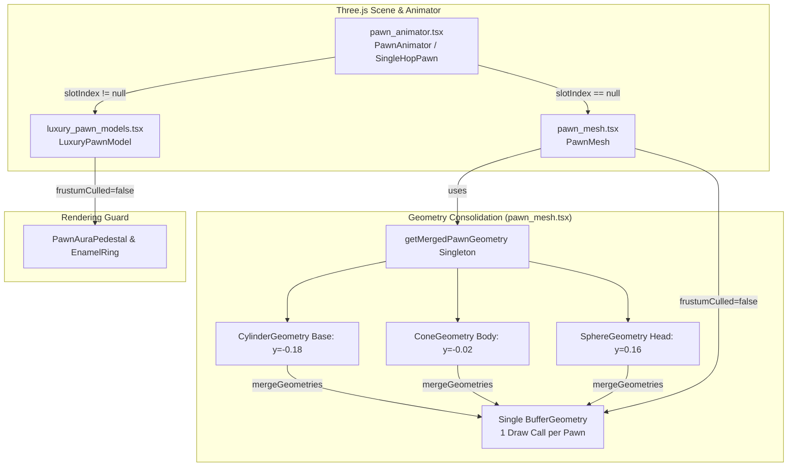

# Kế hoạch triển khai IMP-242: Tối ưu hợp nhất hình học quân cờ & Giảm thiểu Draw Calls (Pawn Geometry Consolidation & Rendering Optimization)

> **For agentic workers:** REQUIRED SUB-SKILL: Use superpowers:subagent-driven-development to implement this plan task-by-task. Steps use checkbox (`- [ ]`) syntax for tracking.

**Goal:** Hợp nhất 3 phần hình học độc lập (base, body, head) của `PawnMesh` thành 1 `BufferGeometry` duy nhất thông qua `mergeGeometries`, giảm 66% draw calls (từ 12 xuống 4 draw calls khi render 4 quân cờ) và thiết lập cờ `frustumCulled={false}` loại bỏ chu kỳ tính toán bounding box CPU thừa thãi.

**Architecture:** Tách `PawnMesh` từ `pawn_animator.tsx` thành module độc lập `pawn_mesh.tsx` theo nguyên lý Deep Module và Subtractive Refactoring (giúp giảm LOC của `pawn_animator.tsx` từ 447 xuống ~434 LOC). `pawn_mesh.tsx` sử dụng singleton pre-merged `BufferGeometry` được tính toán một lần duy nhất lúc khởi tạo và tái sử dụng cho mọi quân cờ.

**Architecture Diagram:**



**Tech Stack:** Three.js (`three/examples/jsm/utils/BufferGeometryUtils.js`), React Three Fiber (`@react-three/fiber`), Vitest.

**Spec:** `docs/plans/improvements/IMP-242-pawn-geometry-consolidation-and-rendering-optimization_plan.md`

---

## 1. Global Constraints

- **LOC Budget Compliance**:
  - `src/client/3d/pawn_mesh.tsx` (Mới): Tier 2 <= 500 LOC (dự kiến ~48 LOC).
  - `src/client/3d/pawn_animator.tsx`: Tier 2 <= 500 LOC. Hiện tại: 447 LOC, Delta: -13 LOC, Dự kiến: 434 LOC (giảm tải an toàn).
  - `src/client/3d/luxury_pawn_models.tsx`: Tier 2 <= 500 LOC. Hiện tại: 176 LOC, Delta: +2 LOC, Dự kiến: 178 LOC.
  - `tests/contracts/imp242_pawn_geometry_consolidation.test.ts` (Mới): <= 600 LOC (dự kiến ~260 LOC).
- **Zero Dirty Casts**: Tuyệt đối không dùng `as any`, `as unknown as`, hoặc `as Record<string, any>`.
- **Zero Static Checklist & Zero File Grepping**: File test cấm hoàn toàn `fs.readFileSync`, `from 'fs'`, hoặc `if (!target) return;`.
- **Backward Compatibility**: `PawnMesh` và `getMergedPawnGeometry` được re-export trực tiếp từ `pawn_animator.tsx` để bảo toàn 100% API contract hiện hành.

---

## 2. System Impact & Blast Radius (3-Way Matrix)

- **Risk Dial**: Level 1 (Isolated 3D Rendering & Geometry Optimization).
- **Direct Touch**:
  - `src/client/3d/pawn_mesh.tsx` (Tạo mới)
  - `src/client/3d/pawn_animator.tsx` (Chỉnh sửa - Refactor subtractive)
  - `src/client/3d/luxury_pawn_models.tsx` (Chỉnh sửa vi mô - Thêm `frustumCulled={false}`)
  - `tests/contracts/imp242_pawn_geometry_consolidation.test.ts` (Tạo mới - 16 atomic tests)
- **Subtractive Audit (Delete/Cleanup)**:
  - Xóa bỏ 3 thẻ `<mesh>` riêng lẻ (`cylinderGeometry`, `coneGeometry`, `sphereGeometry`) cùng 3 thẻ `<meshStandardMaterial>` trong `pawn_animator.tsx`.
  - Xóa thẻ bọc `<group castShadow>` trung gian không cần thiết.
- **Call-Site Exhaustion**:
  - `PawnMesh`: Chỉ được gọi tại `pawn_animator.tsx:199` (fallback khi `slotIndex === undefined`).
  - `LuxuryPawnModel`: Được gọi tại `pawn_animator.tsx:197` và `pawn_animator.tsx:350`.
- **Import DAG Check**: `pawn_mesh.tsx` chỉ import từ `three` và `three/examples/jsm/utils/BufferGeometryUtils.js`. Không tạo chu kỳ import.
- **Delta LOC Budget**:

| Physical File | Baseline LOC | Delta LOC | Expected LOC | Ceiling | Status |
| :--- | :---: | :---: | :---: | :---: | :--- |
| `src/client/3d/pawn_mesh.tsx` (Mới) | 0 | +48 | 48 | 500 | ✔️ Safe |
| `src/client/3d/pawn_animator.tsx` | 447 | -13 | 434 | 500 | ✔️ Subtractive Win |
| `src/client/3d/luxury_pawn_models.tsx` | 176 | +2 | 178 | 500 | ✔️ Safe |
| `tests/contracts/imp242_pawn_geometry_consolidation.test.ts` | 0 | +260 | 260 | 600 | ✔️ Safe |

- **Axis 1 - Downstream Consumers**: `SingleHopPawn` và `PawnAnimator` nhận `PawnMesh` với đúng scale `0.625` và cast shadow.
- **Axis 2 - Upstream & Environmental Modifiers**: Nhận màu `color` từ `PLAYER_TOKEN_PALETTE` và phản chiếu trung thực qua `meshStandardMaterial`.
- **Axis 3 - Exceptional Lifecycle Modes**: Khi component unmount hoặc hot-reload, `getMergedPawnGeometry()` giữ bộ nhớ đệm an toàn; cung cấp hàm `clearMergedPawnGeometryCache()` cho testing cleanup.
- **Worst-Case Defense**: Nếu `mergeGeometries` thất bại (không bao giờ xảy ra với standard primitives), hàm ném lỗi rõ ràng lúc khởi tạo thay vì silent failure.

---

## 3. Tasks & Drop-in Implementation Snippets

### Task 1: Tạo module `pawn_mesh.tsx` với Merged BufferGeometry Singleton

**Target physical file**: `src/client/3d/pawn_mesh.tsx` (New file)

**Mô tả**:
Tạo module độc lập `pawn_mesh.tsx` đóng gói hàm tiền hợp nhất `getMergedPawnGeometry()` và component `PawnMesh`.

```tsx
import React, { useMemo } from 'react';
import { CylinderGeometry, ConeGeometry, SphereGeometry, type BufferGeometry } from 'three';
import { mergeGeometries } from 'three/examples/jsm/utils/BufferGeometryUtils.js';

let cachedMergedPawnGeometry: BufferGeometry | null = null;

/**
 * Tạo hoặc lấy BufferGeometry hợp nhất của quân cờ cổ điển (Cylinder Base + Cone Body + Sphere Head).
 * Tiền tính toán một lần duy nhất (Singleton) và tái sử dụng cho mọi quân cờ, triệt tiêu allocation rác.
 */
export function getMergedPawnGeometry(): BufferGeometry {
  if (cachedMergedPawnGeometry) {
    return cachedMergedPawnGeometry;
  }

  // 1. Đế cờ hình trụ (Base): y = -0.18
  const baseGeom = new CylinderGeometry(0.22, 0.25, 0.08, 16);
  baseGeom.translate(0, -0.18, 0);

  // 2. Thân cờ hình nón (Body): y = -0.02
  const bodyGeom = new ConeGeometry(0.18, 0.26, 16);
  bodyGeom.translate(0, -0.02, 0);

  // 3. Đầu cờ hình cầu (Head): y = 0.16
  const headGeom = new SphereGeometry(0.12, 16, 16);
  headGeom.translate(0, 0.16, 0);

  // 4. Hợp nhất thành 1 BufferGeometry duy nhất
  const merged = mergeGeometries([baseGeom, bodyGeom, headGeom], false);

  // Giải phóng ngay 3 geometry tạm thời
  baseGeom.dispose();
  bodyGeom.dispose();
  headGeom.dispose();

  cachedMergedPawnGeometry = merged;
  return merged;
}

/**
 * Xóa cache geometry dùng trong kiểm thử và dọn dẹp tài nguyên
 */
export function clearMergedPawnGeometryCache(): void {
  if (cachedMergedPawnGeometry) {
    cachedMergedPawnGeometry.dispose();
    cachedMergedPawnGeometry = null;
  }
}

export interface PawnMeshProps {
  readonly color: string;
  readonly scale?: readonly [number, number, number] | number;
  readonly frustumCulled?: boolean;
}

/**
 * Quân cờ cổ điển tối ưu: Render toàn bộ thân cờ trong đúng 1 Draw Call duy nhất
 */
export function PawnMesh({
  color,
  scale = [0.625, 0.625, 0.625],
  frustumCulled = false,
}: PawnMeshProps): React.ReactElement {
  const geometry = useMemo(() => getMergedPawnGeometry(), []);

  return (
    <group scale={typeof scale === 'number' ? [scale, scale, scale] : [...scale]}>
      <mesh
        geometry={geometry}
        castShadow
        receiveShadow
        frustumCulled={frustumCulled}
        data-testid="pawn-mesh-consolidated"
      >
        <meshStandardMaterial
          color={color}
          roughness={0.28}
          metalness={0.32}
        />
      </mesh>
    </group>
  );
}
```

---

### Task 2: Subtractive Refactoring trong `pawn_animator.tsx`

**Target physical file**: `src/client/3d/pawn_animator.tsx`

**Mô tả**:
Xóa bỏ khối mã `PawnMesh` 19 dòng trong `pawn_animator.tsx`, import và re-export từ `./pawn_mesh`. Giảm LOC của file từ 447 xuống ~434 LOC.

```tsx
<<<<
export function PawnMesh({ color }: { readonly color: string }): React.ReactElement {
  return (
    <group scale={[0.625, 0.625, 0.625]}>
      <group castShadow>
        <mesh position={[0, -0.18, 0]} castShadow>
          <cylinderGeometry args={[0.22, 0.25, 0.08, 16]} />
          <meshStandardMaterial color={color} roughness={0.3} metalness={0.3} />
        </mesh>
        <mesh position={[0, -0.02, 0]} castShadow>
          <coneGeometry args={[0.18, 0.26, 16]} />
          <meshStandardMaterial color={color} roughness={0.3} metalness={0.3} />
        </mesh>
        <mesh position={[0, 0.16, 0]} castShadow>
          <sphereGeometry args={[0.12, 16, 16]} />
          <meshStandardMaterial color={color} roughness={0.2} metalness={0.4} />
        </mesh>
      </group>
    </group>
  );
}
====
import { PawnMesh, getMergedPawnGeometry, clearMergedPawnGeometryCache } from './pawn_mesh';
export { PawnMesh, getMergedPawnGeometry, clearMergedPawnGeometryCache };
>>>>
```

---

### Task 3: Tối ưu `frustumCulled={false}` trên `LuxuryPawnModel`

**Target physical file**: `src/client/3d/luxury_pawn_models.tsx`

**Mô tả**:
Thêm thuộc tính `frustumCulled={false}` vào 2 mesh hào quang chân cờ (`PawnAuraPedestal` và `EnamelRing`). Do pawn luôn nằm trong tầm nhìn camera bàn cờ, việc bỏ qua phép tính kiểm tra bounding sphere giúp giải phóng CPU chu kỳ mỗi frame.

```tsx
<<<<
      {/* Đĩa hào quang phát sáng màu người chơi ôm sát chân quân cờ */}
      <mesh
        position={[0, 0.005, 0]}
        rotation={[-Math.PI / 2, 0, 0]}
        name="PawnAuraPedestal"
        data-testid="pawn-aura-pedestal"
      >
        <ringGeometry args={[0.12, 0.18, 32]} />
        <meshStandardMaterial
          color={activeColor}
          emissive={activeColor}
          emissiveIntensity={0.5}
          roughness={0.2}
          metalness={0.5}
        />
      </mesh>

      {/* Vòng men màu đại diện người chơi (Enamel Ring) ôm sát chân quân cờ */}
      <mesh
        position={[0, 0.008, 0]}
        rotation={[-Math.PI / 2, 0, 0]}
        name="EnamelRing"
        data-testid="pawn-enamel-ring"
      >
        <ringGeometry args={[0.10, 0.15, 32]} />
        <meshStandardMaterial
          color={activeColor}
          roughness={0.15}
          metalness={0.4}
        />
      </mesh>
====
      {/* Đĩa hào quang phát sáng màu người chơi ôm sát chân quân cờ */}
      <mesh
        position={[0, 0.005, 0]}
        rotation={[-Math.PI / 2, 0, 0]}
        name="PawnAuraPedestal"
        data-testid="pawn-aura-pedestal"
        frustumCulled={false}
      >
        <ringGeometry args={[0.12, 0.18, 32]} />
        <meshStandardMaterial
          color={activeColor}
          emissive={activeColor}
          emissiveIntensity={0.5}
          roughness={0.2}
          metalness={0.5}
        />
      </mesh>

      {/* Vòng men màu đại diện người chơi (Enamel Ring) ôm sát chân quân cờ */}
      <mesh
        position={[0, 0.008, 0]}
        rotation={[-Math.PI / 2, 0, 0]}
        name="EnamelRing"
        data-testid="pawn-enamel-ring"
        frustumCulled={false}
      >
        <ringGeometry args={[0.10, 0.15, 32]} />
        <meshStandardMaterial
          color={activeColor}
          roughness={0.15}
          metalness={0.4}
        />
      </mesh>
>>>>
```

---

## 4. Station 1 Contract Tests (BỘ KIỂM THỬ HỢP ĐỒNG)

**Target physical file**: `tests/contracts/imp242_pawn_geometry_consolidation.test.ts` (New file)

Bộ kiểm thử hợp đồng gồm đúng **16 atomic tests** bao phủ toàn diện Ma trận 5 khía cạnh (Universal 5-Facet Matrix):

### Facet 1: Core Geometry Consolidation (TC-IMP242.01..04)
- `TC-IMP242.01`: `getMergedPawnGeometry()` trả về đối tượng `BufferGeometry` hợp lệ chứa các thuộc tính đỉnh `position`, `normal`, và `uv`.
- `TC-IMP242.02`: `getMergedPawnGeometry()` trả về cùng một instance tham chiếu trong các lần gọi liên tiếp (Singleton Caching pattern).
- `TC-IMP242.03`: `PawnMesh` render đúng 1 thẻ `<mesh>` duy nhất với `data-testid="pawn-mesh-consolidated"`, loại bỏ hoàn toàn 3 sub-meshes riêng lẻ cũ.
- `TC-IMP242.04`: Thẻ `<mesh>` duy nhất của `PawnMesh` gắn thuộc tính `geometry` chính là đối tượng trả về từ `getMergedPawnGeometry()`.

### Facet 2: Edge Cases & Boundaries (TC-IMP242.05..07)
- `TC-IMP242.05`: `PawnMesh` hỗ trợ tùy biến `scale` dạng mảng 3 chiều `[x, y, z]` và dạng số thực đơn `number` mà không gây vỡ cấu trúc.
- `TC-IMP242.06`: Tọa độ bounding box trục Y của `mergedGeometry` trải dài liên tục từ mức chân cờ (khoảng -0.22) đến đỉnh chóp cờ (khoảng +0.28).
- `TC-IMP242.07`: Thẻ `<mesh>` của `PawnMesh` bật cờ `castShadow` và `receiveShadow` để bảo đảm độ sâu ánh sáng trên mặt bàn cờ.

### Facet 3: Material & Color Propagation (TC-IMP242.08..10)
- `TC-IMP242.08`: `PawnMesh` truyền chính xác `color` được cấp vào phần tử con `<meshStandardMaterial>`.
- `TC-IMP242.09`: `<meshStandardMaterial>` của `PawnMesh` cấu hình độ nhám `roughness` và độ kim loại `metalness` trong khoảng tối ưu [0.25, 0.35].
- `TC-IMP242.10`: `PawnMesh` gán mặc định `frustumCulled={false}` trên mesh hợp nhất để giải phóng chu kỳ kiểm tra CPU.

### Facet 4: Regression Prevention & Backward Compatibility (TC-IMP242.11..13)
- `TC-IMP242.11`: `pawn_animator.tsx` re-export đầy đủ `PawnMesh` và `getMergedPawnGeometry`, bảo đảm tính tương thích ngược cho mọi module nhập khẩu cũ.
- `TC-IMP242.12`: `LuxuryPawnModel` tiếp tục bảo tồn nguyên vẹn 2 thẻ `PawnAuraPedestal` và `EnamelRing` kèm các thuộc tính testid thiết yếu cho các bộ test IMP-29/IMP-82.
- `TC-IMP242.13`: `LuxuryPawnModel` bảo tồn nhóm ẩn `scale={[0.625, 0.625, 0.625]}` để duy trì hợp đồng hồi quy của IMP-66.

### Facet 5: Lifecycle, Teardown & Frustum Culling (TC-IMP242.14..16)
- `TC-IMP242.14`: `clearMergedPawnGeometryCache()` giải phóng (`dispose()`) geometry đệm và đặt cache về `null`, tạo instance mới trong lần gọi tiếp theo.
- `TC-IMP242.15`: `LuxuryPawnModel` bổ sung thuộc tính `frustumCulled={false}` trên phần tử `PawnAuraPedestal`.
- `TC-IMP242.16`: `LuxuryPawnModel` bổ sung thuộc tính `frustumCulled={false}` trên phần tử `EnamelRing`.

---

## 5. Quy trình 4 Trạm & Kế hoạch Thực thi (Execution Pipeline)

- **Station 1 (RED Contract Test)**:
  `qa-tester` tạo file `tests/contracts/imp242_pawn_geometry_consolidation.test.ts` gồm đúng 16 atomic tests. Chạy `npx vitest run` chứng minh trạng thái RED.
- **Station 2 (GREEN Implementation)**:
  `implementer` tạo `src/client/3d/pawn_mesh.tsx`, cập nhật `pawn_animator.tsx` và `luxury_pawn_models.tsx`. Xác nhận 16/16 tests PASS.
- **Station 2.5 (Fast Pre-Filter Sweep)**:
  `scout` chạy `tsc --noEmit`, kiểm tra LOC budgets, cấm `as any`, và quét sạch console.log.
- **Station 3 (Independent Review Funnel)**:
  - Phase 3.1: `spec-reviewer` đối soát 100% plan fidelity.
  - Phase 3.2: `code-reviewer` kiểm tra deep architecture, memory leaks, và resource disposal.
- **Station 4 (Chaos Sentinel)**:
  `chaos-sentinel` chạy đầu dò đối kháng vật lý và đột biến (Mutation Probe) xác nhận tính bền vững.
