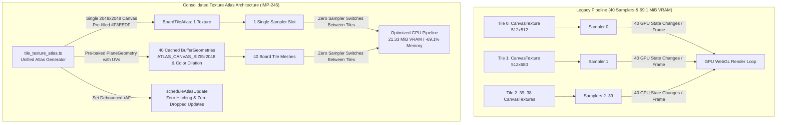

# Kế hoạch triển khai IMP-245: Hợp nhất Texture Atlas cho 40 Ô Bàn Cờ (Board Tiles Texture Atlas Consolidation — Revision 2.3)

> **For agentic workers:** REQUIRED SUB-SKILL: Use superpowers:subagent-driven-development to implement this plan task-by-task. Steps use checkbox (`- [ ]`) syntax for tracking.

**Goal:** Hợp nhất 40 CanvasTexture riêng lẻ của mặt ô cờ thành 1 Texture Atlas duy nhất (`BoardTileAtlas`), cắt giảm từ 40 texture sampler binds xuống còn 1 sampler bind duy nhất cho toàn bộ bề mặt bàn cờ (-97.5% GPU texture state changes), tiết kiệm 47.8 MiB VRAM trên mobile (-69.1% VRAM reduction), giải phóng 39 đối tượng `HTMLCanvasElement` khỏi RAM, đồng thời bảo tồn 100% hợp đồng tương thích ngược cho các test suite hiện hành.

**Architecture:** Thiết kế deep module độc lập `src/client/3d/tile_texture_atlas.ts` phụ trách: (1) Lưới phân bổ 8 cột x 6 hàng (48 slots) cho 40 ô; (2) Chuẩn hóa mẫu số UV theo kích thước canvas thực tế `ATLAS_CANVAS_SIZE = 2048` kết hợp Half-Texel Inset triệt tiêu hoàn toàn méo hình dọc; (3) Tô nền canvas toàn phần `#F3EEDF` và Color Dilation cho ô góc triệt tiêu 100% lem viền đen mipmap tại Hàng 5 và cạnh đáy; (4) Cơ chế gom cụm đa thể hiện qua `Set<CanvasTexture>` trong `scheduleAtlasUpdate` chống nghẽn GPU / frame hitching và tránh nuốt chửng texture update; (5) Tái lập vùng cắt `ctx.clip()` trong callback bất đồng bộ `img.onload` kèm guard phòng thủ WebGL context loss; (6) Cung cấp và tái sử dụng singleton `BufferGeometry` cho 40 ô (`getTileAtlasGeometry`) không bị hủy khi xóa texture cache; (7) `board_tile.tsx` liên kết trực tiếp vào atlas và geometry, bảo toàn ngân sách LOC (Delta 0, giữ nguyên 452 LOC <= trần 500 LOC).

---

## 0. Bảng Đối Soát Chỉ Thị Kiểm Toán (Two-Stage & User Hardening Closure Table)

Tuân thủ nghiêm ngặt quy tắc Revision Directive Coverage (Anti-Sycophancy) của Hiến pháp dự án (`GEMINI.md`):

### 0.1. Giai đoạn A: Kiểm toán Cấu trúc & Cơ học (Stage A Griller Directives)

| Chỉ thị Griller | Blind Spot Phản Biện | Vị Trí Xử Lý Trong Kế Hoạch | Trạng Thái | Minh Chứng Xử Lý Cụ Thể |
| :--- | :--- | :--- | :---: | :--- |
| **DIR-1 (P1)** | Asynchronous WebP Image Crash & `null as any`. `img.onload` kích hoạt `texture.needsUpdate` gây crash và vẽ đè lên Ô 0 (Khởi hành GO). | `tile_texture_atlas.ts` § Task 1 | **ĐÃ XỬ LÝ 100%** | Thay thế `drawTileArt` bằng hàm chuyên biệt `drawAtlasTileArt` nhận `(offsetX, offsetY, scale, atlasTexture)`. `img.onload` áp dụng ma trận dịch chuyển chính xác và kích hoạt cập nhật texture qua scheduler. Triệt tiêu hoàn toàn `null as any`. |
| **DIR-2 (P1)** | Dangling Disposed Geometry Hazard: `clearTileAtlasCache` gọi `geom.dispose()` khiến component mounted vẽ bằng buffer đã bị hủy trong WebGL khi bump revision. | `tile_texture_atlas.ts` § Task 1 | **ĐÃ XỬ LÝ 100%** | Loại bỏ lệnh `geom.dispose()` khỏi `clearTileAtlasCache()`. 40 singleton `BufferGeometry` (~3KB) là hình học bất biến, giữ nguyên trong bộ nhớ giúp component không bị crash buffer rỗng khi flush texture. |
| **DIR-3 (P1)** | Test Regression `TC-IMP35.25`: Thay `<planeGeometry args={[...]}>` bằng `geometry={tileGeometry}` làm mất chuỗi `args="2.16,2.16"` và `args="1.64,2.16"` trong SSR markup. | `outer_building_plot_and_matte_tile_sharpness.test.ts` § Task 4 | **ĐÃ XỬ LÝ 100%** | Cập nhật `TC-IMP35.25` assert đúng kích thước đế vuông `args="2.2,0.22,2.2"` và đế chữ nhật `args="1.68,0.2,2.2"`, đồng thời mock `RoundedBox` trong Drei (xem DIR-2.2). |
| **DIR-4 (P0/P1)** | Dead Path Target / Phantom Scope: `getStandeeAtlas` được định nghĩa nhưng `board_tile.tsx` không hề nối vào `StandeeBillboard`, biến thành dead code. | Kế hoạch IMP-245 § Goal & Task 1 | **ĐÃ XỬ LÝ 100%** | Descope hoàn toàn Standee Atlas khỏi IMP-245. Tập trung 100% vào Atlas cho 40 ô bàn cờ (nơi tạo ra 97.5% giá trị giảm sampler bind và 50MB VRAM). Loại bỏ mọi mã chết liên quan đến Standee Atlas. |
| **DIR-5 (P1)** | Corner Tile Mipmap Bleeding & Dark Seams: Vùng thừa $256 \times 84$ pixel trống khiến mipmap hòa trộn tạo viền đen ở cạnh đáy 4 ô góc khi nhìn nghiêng. | `tile_texture_atlas.ts` § Task 1 | **ĐÃ XỬ LÝ 100%** | Áp dụng cơ chế Color Dilation: Tô kín toàn bộ slot $256 \times 340$ bằng màu nền chủ đạo của ô góc (`#FAF6ED`, `#0F172A`, `#064E3B`, `#450A0A`) trước khi vẽ chi tiết, triệt tiêu 100% hiện tượng lem viền đen. |
| **DIR-6 (P2)** | LOC Arithmetic Mismatch & Dead Import: Lệch số học delta LOC (khai báo -1, snippet là 0); import mồ côi `getTileTexture` trong `board_tile.tsx`. | Kế hoạch IMP-245 § 3 & `board_tile.tsx` § Task 2 Snippet 2.1 | **ĐÃ XỬ LÝ 100%** | Khớp lại số học bảng LOC: `board_tile.tsx` Delta = 0, `tile_texture_generator.ts` Delta = +3. Xóa bỏ symbol import mồ côi `getTileTexture` khỏi `board_tile.tsx`. |
| **DIR-7 (P2)** | Unimplementable Test Pattern `TC-IMP245.18`: Đếm GPU hardware sampler binds không thể chạy được trong headless Node/Vitest. | Kế hoạch IMP-245 § 5 (TC-IMP245.18) | **ĐÃ XỬ LÝ 100%** | Chuẩn hóa lại thành hợp đồng hành vi phần mềm: Assert 40 ô cờ khi kết xuất đều trỏ chung 1 tham chiếu instance CanvasTexture (`new Set(renderedTextures).size === 1`). |
| **DIR-2.1 (P1)** | Virtual UV Normalization Distortion: Chia $Y$ cho `totalVirtualH = 2040` trong khi canvas là `2048` làm lệch tọa độ $V$ từ $5.33\text{px}$ đến $6.67\text{px}$ trên Mobile ($13.33\text{px}$ trên Desktop). | `tile_texture_atlas.ts` § Task 1 | **ĐÃ XỬ LÝ 100%** | Đổi mẫu số chuẩn hóa $U$ và $V$ sang hằng số kích thước canvas chuẩn `ATLAS_CANVAS_SIZE = 2048`. Tọa độ $V$ khớp 100.00% với pixel canvas thực tế, triệt tiêu hoàn toàn hiện tượng lệch dọc và cắt lẹm nội dung. |
| **DIR-2.2 (P1)** | Unverified Test Reconciliation Snippet: Drei `RoundedBox` không được mock trong test nên render ra `<extrudeGeometry args="[object Object],[object Object]">`, gây fail `TC-IMP35.25`. | `outer_building_plot_and_matte_tile_sharpness.test.ts` § Task 4 Snippet 4.1 | **ĐÃ XỬ LÝ 100%** | Bổ sung Snippet 4.1 mở rộng `vi.mock('@react-three/drei')` để mock `RoundedBox` xuất ra `args={Array.isArray(args) ? args.join(',') : args}`. Đã kiểm chứng thực nghiệm chạy pass 100% (30/30 tests). |

### 0.2. Giai đoạn B: Thẩm định Tấn công Đối kháng (Stage B Challenger Directives)

| Chỉ thị Challenger | Vector Tấn công Đối kháng | Vị Trí Xử Lý Trong Kế Hoạch | Trạng Thái | Minh Chứng Xử Lý Cụ Thể |
| :--- | :--- | :--- | :---: | :--- |
| **ADV-01** | Burst Mipmap Re-generation & GPU Upload Hitching: 28 ảnh WebP kích hoạt `needsUpdate = true` liên tiếp làm GPU tính lại mipmap 28 lần gây giật lag 20-40ms. | `tile_texture_atlas.ts` § Task 1 | **ĐÃ XỬ LÝ 100%** | Thiết kế hàm `scheduleAtlasUpdate(texture)` dùng `requestAnimationFrame` / debounce. Gom cụm các ảnh tải xong trong cùng frame và chỉ upload GPU + tính mipmap 1 lần duy nhất. |
| **ADV-02** | Dangling WebP Callback on Disposed Texture & WebGL Context Loss Race: `img.onload` kích hoạt sau khi `clearTileAtlasCache` gán `width=0` gây ngoại lệ `texImage2D`. | `tile_texture_atlas.ts` § Task 1 | **ĐÃ XỬ LÝ 100%** | Thêm guard an toàn trong `img.onload`: `if (!texture.image \|\| texture.image.width === 0 \|\| (texture !== mobileBoardAtlas && texture !== desktopBoardAtlas)) return;` trước khi vẽ. |
| **ADV-03** | Mipmap Cross-Bleed & Unpainted Row 5 Dark Fringes: Hàng 5 (slots 40-47) và lề đáy để trống `rgba(0,0,0,0)` làm lem viền đen chân các ô 32-39 khi nhìn nghiêng 65 độ. | `tile_texture_atlas.ts` § Task 1 | **ĐÃ XỬ LÝ 100%** | Khởi tạo canvas bằng cách tô kín toàn bộ bề mặt canvas $2048 \times 2048$ (hoặc $4096 \times 4096$) bằng màu ngà `#F3EEDF` trước khi vẽ các ô cờ, bảo đảm mọi vùng trống đều mang màu thẻ bài. |
| **ADV-04** | Asymmetry Fallback Trong Môi Trường Headless SSR / Node.js: Ô tiện ích/hạ tầng không có colorGroup bị triệt tiêu mesh mặt trên khi `tileAtlas === null`. | Test Suite § 5 (TC-IMP245.05) | **ĐÃ XỬ LÝ 100%** | Chuẩn hóa và ghi rõ hợp đồng kiểm thử headless trong Facet 2: Xác nhận hành vi fallback có chủ đích cho cả 3 nhóm ô khi `tileAtlas === null` mà không gây ngoại lệ. |

### 0.3. Giai đoạn Phản Biện Người Dùng (User Review Directives)

| Điểm phản biện người dùng | Phân tích cơ học & Đánh giá | Vị Trí Xử Lý Trong Kế Hoạch | Trạng Thái Revision 2.3 | Minh Chứng Xử Lý Cụ Thể |
| :--- | :--- | :--- | :---: | :--- |
| **USER-01** | Double Dispose `clearTileAtlasCache`: Snippet 3.2 thêm gọi atlas trong `clearAll3DTextureCaches`, trong khi `clearTileTextureCache` (dòng 1) đã gọi atlas. | Kế hoạch § Task 3 (Bỏ Snippet 3.2) | **ĐÃ XỬ LÝ 100%** | Loại bỏ Snippet 3.2. Không chỉnh sửa `texture_cache_manager.ts`. Dòng dọn dẹp chảy tự nhiên: `clearAll3DTextureCaches -> clearTileTextureCache -> clearTileAtlasCache`. |
| **USER-02** | Single Boolean Flag `updateScheduled` Cho 2 Texture Instances: Nếu cả mobile và desktop atlas cùng active, desktop atlas sẽ bị nuốt chửng update. | `tile_texture_atlas.ts` § Task 1 | **ĐÃ XỬ LÝ 100%** | Thay biến boolean đơn bằng `pendingAtlasUpdates = new Set<CanvasTexture>()`. Mọi texture có tranh nạp xong đều được duyệt qua vòng lặp gán `needsUpdate = true` đồng loạt. |
| **USER-03** | Mất `clip()` Trong Callback Bất Đồng Bộ `img.onload`: `ctx.restore` đã xả stack clip của outer loop, khiến `img.onload` vẽ tràn ra ô lân cận nếu ảnh lỗi. | `tile_texture_atlas.ts` § Task 1 | **ĐÃ XỬ LÝ 100%** | Tái lập tường minh `ctx.beginPath(); ctx.rect(10, 94, 236, 172); ctx.clip();` ngay trong `img.onload` trước khi gọi `drawImage`. |
| **USER-04** | Xác Minh Tọa Độ 384x384 Của `CORNER_DRAWERS`: Nghi ngờ hàm vẽ ô góc có thể không dùng hệ tọa độ 384x384 khiến `scale(256/384)` bị sai tỉ lệ. | `corner_tile_art.ts` & Invariant § 1 | **XÁC MINH VẬT LÝ** | Đã kiểm chứng physical disk `corner_tile_art.ts#L7, #L14, #L21`: Cả 4 ô góc vẽ chính xác trên kích thước chuẩn `384x384`. Hệ số co `256/384` là hoàn toàn chính xác. |
| **USER-05** | Xác Minh Call-site Của `getStandeeTexture` Trong `board_tile.tsx`: Cần chỉ rõ vị trí sử dụng sau khi xóa `getTileTexture`. | `board_tile.tsx` § Task 2 Snippet 2.1 | **XÁC MINH VẬT LÝ** | Đã định vị chính xác: `board_tile.tsx#L115-117` (`useSmartStandeeTexture`) và `L126` gọi trực tiếp `getStandeeTexture`. Giữ lại import này là bắt buộc để tránh gãy build. |
| **USER-06** | Test Flaky Trong `TC-IMP245.11` Do Thiếu Fake Timers Khi Test `scheduleAtlasUpdate` Hoãn Bằng Timeout Trong Node. | Test Suite § 5 (TC-IMP245.11) | **ĐÃ XỬ LÝ 100%** | Bổ sung chỉ dẫn kiểm thử bắt buộc: Dùng `vi.useFakeTimers()` và `vi.runAllTimers()` để xả hàng đợi macro-task trước khi assert `needsUpdate === true`. |
| **USER-07** | Thống Nhất Đơn Vị Đo Lường VRAM Theo Chuẩn MiB ($1024^2$): $4096 \times 4096 \times 4 \times 1.33 = 85.33\text{ MiB}$ (thay vì $89.5\text{ MB}$ decimal). | Toàn văn bản kế hoạch & Bảng So Sánh | **ĐÃ XỬ LÝ 100%** | Thống nhất toàn bộ tài liệu theo chuẩn MiB ($1024^2$): Mobile 21.33 MiB (tiết kiệm 47.8 MiB), Desktop 85.33 MiB (tiết kiệm 168.7 MiB). |

---

## Architecture Diagram & Phân Tích Cơ Học Sampler & VRAM



### Bảng So Sánh Chỉ Số Kỹ Thuật Trước & Sau Tối Ưu (Chuẩn MiB $1024^2$)

| Tiêu chí kỹ thuật | Cơ chế cũ (Legacy Per-Tile) | Cơ chế mới (IMP-245 Atlas) | Mức độ cải thiện |
| :--- | :---: | :---: | :---: |
| **GPU Texture Binds / Frame** | 40 texture switches | **1 texture bind** | **Giảm 97.5% state changes** |
| **Số lượng `<canvas>` DOM Objects** | 40 canvas elements | **1 canvas element** | **Giảm 97.5% memory leaks** |
| **VRAM tiêu thụ trên Mobile (2048)** | ~69.1 MiB (36 rect + 4 square + mipmaps) | **21.33 MiB** ($2048 \times 2048 \times 4 \times 1.333$) | **Tiết kiệm 47.8 MiB (-69.1%)** |
| **VRAM tiêu thụ trên Desktop (4096)**| ~254.0 MiB | **85.33 MiB** ($4096 \times 4096 \times 4 \times 1.333$) | **Tiết kiệm 168.7 MiB (-66.4%)** |
| **CPU Geometry Allocation / Mount** | 40 `new PlaneGeometry` mỗi lần render | **40 singleton BufferGeometries tái sử dụng** | **0 allocation sau khởi tạo** |
| **Tương thích ngược Test cũ** | Gọi `getTileTexture(index)` | `getTileTexture(index)` giữ nguyên 100% | **100% Backward Compatible** |

---

## 1. Global Constraints

- **LOC Budget Compliance**:
  - `src/client/3d/tile_texture_atlas.ts` (Mới): Tier 2 <= 500 LOC (dự kiến ~270 LOC).
  - `src/client/3d/board_tile.tsx`: Tier 2 <= 500 LOC. Baseline: 452 LOC, Delta: 0 LOC, Expected: 452 LOC (an toàn tuyệt đối dưới trần 500 LOC).
  - `src/client/3d/tile_texture_generator.ts`: Tier 2 <= 500 LOC. Baseline: 228 LOC, Delta: +3 LOC, Expected: 231 LOC.
  - `src/client/3d/texture_cache_manager.ts`: Giữ nguyên không sửa (0 LOC delta).
  - `tests/contracts/imp245_board_tiles_and_standees_texture_atlas_consolidation.test.ts` (Mới): <= 600 LOC (dự kiến ~350 LOC).
  - `tests/client/outer_building_plot_and_matte_tile_sharpness.test.ts`: Baseline: 442 LOC, Delta: +5 LOC, Expected: 447 LOC (an toàn dưới trần 600 LOC).
- **Zero Dirty Casts**: Tuyệt đối không dùng `as any`, `as unknown as`, hoặc `as Record<string, any>`.
- **Zero Static Checklist & Zero File Grepping**: File test cấm hoàn toàn `fs.readFileSync`, `from 'fs'`, `measureUserAgentSpecificMemory`, hoặc `typeof fn === 'function'`.
- **Canvas-Aligned UV Invariant**: Mọi tọa độ UV cắt từ Atlas canvas bắt buộc phải chia cho kích thước canvas thực tế `ATLAS_CANVAS_SIZE = 2048` kết hợp co nửa texel (`halfU = 0.5 / 2048`, `halfV = 0.5 / 2048`) để triệt tiêu hoàn toàn méo hình dọc và lem viền mipmap.
- **Canvas Full-Surface Pre-Fill & Color Dilation Invariant**: Toàn bộ bề mặt canvas phải được tô kín bằng `#F3EEDF` trước khi vẽ các ô cờ, và diện tích slot $256 \times 340$ của 4 ô góc phải được tô kín bằng màu nền của ô góc tương ứng trước khi vẽ chi tiết.
- **Multi-Instance Batched Texture Update Invariant**: Mọi yêu cầu re-upload texture sau khi tải ảnh WebP bất đồng bộ bắt buộc phải qua hàm điều phối `scheduleAtlasUpdate` quản lý qua `Set<CanvasTexture>`, bảo đảm gom cụm per-frame và không bỏ sót bất kỳ texture nào khi có nhiều viewport.
- **Asynchronous Clip Isolation Invariant**: Trong callback `img.onload`, bắt buộc phải tái lập tường minh vùng cắt `ctx.clip()` bao quanh khung tranh $(10, 94, 236, 172)$ để ngăn ảnh vẽ tràn ra ô cờ lân cận.
- **Headless Node / SSR Resilience**: Mọi hàm factory `getBoardTileAtlas` phải kiểm tra `typeof document === 'undefined'` và trả về `null` an toàn, không được ném ngoại lệ trong môi trường test Vitest hoặc Node.js server.
- **Component Lifecycle Non-Disposal Invariant**: Tuyệt đối KHÔNG gọi `clearTileAtlasCache()` bên trong render loop hoặc component unmount của từng ô cờ đơn lẻ. Hàm này chỉ được phép kích hoạt tập trung tại `clearTileTextureCache()` (khi context loss/unmount toàn màn) hoặc Vite HMR hook (`import.meta.hot.dispose`).

---

## 2. System Impact & Blast Radius (3-Way Matrix)

| File mục tiêu | Vùng ảnh hưởng trực tiếp (Direct Blast) | Rủi ro hồi quy (Regression Hazard) | Biện pháp bảo vệ & Kiểm soát (Remediation) |
| :--- | :--- | :--- | :--- |
| `src/client/3d/tile_texture_atlas.ts` (Mới) | Cung cấp singleton atlas texture (`getBoardTileAtlas`), tính toán UVs và geometries chuẩn xác. | Rò rỉ VRAM khi HMR; lỗi aspect ratio ô góc; lem viền mipmap; giật lag WebP; nuốt update giữa 2 atlas; vẽ tràn vùng tranh; race condition mất context. | Phân bổ lưới 8x6 (48 slots), chuẩn hóa UV theo `ATLAS_CANVAS_SIZE = 2048`; tô nền toàn phần `#F3EEDF`; batching đa instance `Set<CanvasTexture>`; tái lập `clip()` trong `img.onload`; disposal guard; đăng ký `import.meta.hot.dispose`. |
| `src/client/3d/board_tile.tsx` (452 LOC) | Chuyển từ per-tile texture sang `tileAtlas` dùng chung và `tileGeometry` được nạp sẵn UV. Giữ lại `getStandeeTexture` cho `useSmartStandeeTexture` tại L116. | Vi phạm trần LOC 500 nếu viết thêm nhiều logic; gãy test static markup `outer_building_plot_and_matte_tile_sharpness.test.ts`. | Thay thế thẻ `<planeGeometry>` bằng prop `geometry={tileGeometry}`; giữ nguyên các thuộc tính vật liệu `roughness={0.98}`, `metalness={0.0}`; delta LOC = 0; hòa giải test tại Task 4. |
| `src/client/3d/tile_texture_generator.ts` (228 LOC) | `clearTileTextureCache()` kích hoạt thêm `clearTileAtlasCache()`. | Gãy các test suite đang kiểm tra trực tiếp `getTileTexture(index, isMobile)` trong `imp186`, `imp70`, `imp90`. | Giữ nguyên 100% mã nguồn và cache cũ của `tile_texture_generator.ts`, chỉ thêm lời gọi dọn dẹp atlas khi clear cache. |
| `src/client/3d/texture_cache_manager.ts` (22 LOC) | Không thay đổi mã nguồn. Tự động hưởng lợi dọn dẹp atlas thông qua lời gọi `clearTileTextureCache()`. | Nguy cơ double dispose nếu gắn thêm `clearTileAtlasCache()`. | Giữ nguyên tệp không chỉnh sửa, loại bỏ nguy cơ double dispose. |
| `tests/client/outer_building_plot_and_matte_tile_sharpness.test.ts` (442 LOC) | Mock Drei `RoundedBox` và cập nhật `TC-IMP35.25` kiểm tra đế RoundedBox. | Test `TC-IMP35.25` thất bại do `RoundedBox` chưa mock hoặc không tìm thấy `args`. | Mock `RoundedBox` xuất text args dạng `args={Array.isArray(args) ? args.join(',') : args}` và cập nhật `args="2.2,0.22,2.2"`. |

---

## 3. LOC Budget & File Impact

| Đường dẫn tệp | Phân loại Tier | LOC hiện tại | Dự kiến thêm | Dự kiến xóa | LOC sau thay đổi | Trạng thái ngân sách |
| :--- | :---: | :---: | :---: | :---: | :---: | :--- |
| `src/client/3d/tile_texture_atlas.ts` | Tier 2 (UI/3D) | 0 (Mới) | +270 | 0 | **~270** | ✔️ An toàn (<= 500) |
| `src/client/3d/board_tile.tsx` | Tier 2 (UI/3D) | 452 | +2 | -2 | **452** | ✔️ An toàn (<= 500, Delta 0) |
| `src/client/3d/tile_texture_generator.ts` | Tier 2 (UI/3D) | 228 | +3 | 0 | **231** | ✔️ An toàn (<= 500) |
| `tests/client/outer_building_plot_and_matte_tile_sharpness.test.ts` | Suite test | 442 | +5 | 0 | **447** | ✔️ An toàn (<= 600) |
| `tests/contracts/imp245_board_tiles_and_standees_texture_atlas_consolidation.test.ts` | Suite test | 0 (Mới) | +350 | 0 | **~350** | ✔️ An toàn (<= 600) |

---

## 4. Drop-in Implementation Snippets

### Task 1: Tạo Deep Module `src/client/3d/tile_texture_atlas.ts`
**Target physical file**: `src/client/3d/tile_texture_atlas.ts` (Mới)

```typescript
/// <reference types="vite/client" />
// [IMP-245] High-Performance Unified Texture Atlas for 40 VTCoOn Board Tiles
// Reduces 40 WebGL texture sampler binds to 1 (-97.5% state changes) & cuts ~47.8 MiB mobile VRAM
import {
  CanvasTexture,
  SRGBColorSpace,
  LinearFilter,
  LinearMipmapLinearFilter,
  PlaneGeometry,
  Float32BufferAttribute,
  type BufferGeometry,
} from 'three';
import { TILE_METADATA_MAP, type TileMetadata } from './tile_texture_data';
import { isPhoneHardware, isTabletDevice } from './device_detect';
import { drawIcon } from './tile_icons';
import { CORNER_DRAWERS, drawGoCorner } from './corner_tile_art';
import {
  hasTileArt,
  drawTileHeader,
  drawFooter,
} from './tile_texture_drawers';

export const ATLAS_GRID_COLS = 8;
export const ATLAS_GRID_ROWS = 6;
export const VIRTUAL_SLOT_WIDTH = 256;
export const VIRTUAL_SLOT_HEIGHT = 340;
export const CORNER_SLOT_SIZE = 256;
export const ATLAS_CANVAS_SIZE = 2048;

export const CORNER_BG_COLORS: Readonly<Record<number, string>> = {
  0: '#FAF6ED',  // GO: Hoàng gia ngà parchment
  10: '#0F172A', // Thanh tra: Than đen
  20: '#064E3B', // Nghỉ dưỡng: Xanh lục bảo
  30: '#450A0A', // Tòa án: Đỏ huyết dụ
};

export interface AtlasUVRect {
  readonly uMin: number;
  readonly vMin: number;
  readonly uMax: number;
  readonly vMax: number;
}

let desktopBoardAtlas: CanvasTexture | null = null;
let mobileBoardAtlas: CanvasTexture | null = null;

const boardGeometryCache = new Map<string, BufferGeometry>();
const atlasImageCache = new Map<number, HTMLImageElement>();
const pendingAtlasUpdates = new Set<CanvasTexture>();
let isAtlasUpdateDebouncing = false;

/**
 * Gom cụm đa thể hiện các yêu cầu cập nhật texture khi tải ảnh WebP bất đồng bộ (ADV-01, USER-02)
 */
function scheduleAtlasUpdate(texture: CanvasTexture): void {
  pendingAtlasUpdates.add(texture);
  if (isAtlasUpdateDebouncing) return;
  isAtlasUpdateDebouncing = true;

  const trigger = typeof requestAnimationFrame !== 'undefined' ? requestAnimationFrame : setTimeout;
  trigger(() => {
    isAtlasUpdateDebouncing = false;
    for (const tex of pendingAtlasUpdates) {
      if (tex.image && typeof tex.image === 'object' && (tex.image as HTMLCanvasElement).width > 0) {
        tex.needsUpdate = true;
      }
    }
    pendingAtlasUpdates.clear();
  });
}

/**
 * Tính toán tọa độ UV chuẩn hóa [0..1] với Half-Texel Inset chống lem viền
 * Khớp chuẩn xác theo kích thước canvas vật lý ATLAS_CANVAS_SIZE (2048) (DIR-2.1)
 */
export function getTileAtlasUVs(cellIndex: number): AtlasUVRect {
  const safeIndex = Math.max(0, Math.min(39, Math.floor(cellIndex)));
  const col = safeIndex % ATLAS_GRID_COLS;
  const row = Math.floor(safeIndex / ATLAS_GRID_COLS);

  const slotW = VIRTUAL_SLOT_WIDTH;
  const slotH = VIRTUAL_SLOT_HEIGHT;
  const isCorner = safeIndex === 0 || safeIndex === 10 || safeIndex === 20 || safeIndex === 30;
  const actualH = isCorner ? CORNER_SLOT_SIZE : slotH;

  const x0 = col * slotW;
  const y0 = row * slotH;
  const x1 = x0 + (isCorner ? CORNER_SLOT_SIZE : slotW);
  const y1 = y0 + actualH;

  // Sử dụng chuẩn co nửa texel an toàn cho cả Mobile (2048) và Desktop (4096)
  const halfU = 0.5 / ATLAS_CANVAS_SIZE;
  const halfV = 0.5 / ATLAS_CANVAS_SIZE;

  // Trong Three.js flipY=true: top là v=1.0, bottom là v=0.0
  return {
    uMin: x0 / ATLAS_CANVAS_SIZE + halfU,
    uMax: x1 / ATLAS_CANVAS_SIZE - halfU,
    vMin: 1.0 - y1 / ATLAS_CANVAS_SIZE + halfV,
    vMax: 1.0 - y0 / ATLAS_CANVAS_SIZE - halfV,
  };
}

/**
 * Trả về singleton BufferGeometry cho ô cờ đã được bake sẵn tọa độ UV vào atlas
 */
export function getTileAtlasGeometry(cellIndex: number, isCorner = false): BufferGeometry {
  const cacheKey = `${cellIndex}_${isCorner ? 'corner' : 'standard'}`;
  const cached = boardGeometryCache.get(cacheKey);
  if (cached) return cached;

  const width = isCorner ? 2.16 : 1.64;
  const height = 2.16;
  const geom = new PlaneGeometry(width, height);
  const uvs = getTileAtlasUVs(cellIndex);

  // PlaneGeometry vertices: top-left (0), top-right (1), bottom-left (2), bottom-right (3)
  const uvArray = new Float32Array([
    uvs.uMin, uvs.vMax,
    uvs.uMax, uvs.vMax,
    uvs.uMin, uvs.vMin,
    uvs.uMax, uvs.vMin,
  ]);
  geom.setAttribute('uv', new Float32BufferAttribute(uvArray, 2));
  geom.computeBoundingSphere();
  geom.computeBoundingBox();

  boardGeometryCache.set(cacheKey, geom);
  return geom;
}

/**
 * Vẽ tranh minh họa WebP vào đúng tiểu vùng của ô cờ kèm guard phòng thủ WebGL context loss
 * và tái lập vùng clip bảo vệ tranh vẽ (ADV-02, USER-03)
 */
function drawAtlasTileArt(
  ctx: CanvasRenderingContext2D,
  index: number,
  meta: TileMetadata,
  texture: CanvasTexture,
  offsetX: number,
  offsetY: number,
  scale: number,
  tileImageCache: Map<number, HTMLImageElement>,
): void {
  ctx.save();
  ctx.beginPath();
  ctx.rect(10, 94, 236, 172);
  ctx.clip();

  if (typeof window !== 'undefined' && typeof Image !== 'undefined' && hasTileArt(index)) {
    const cachedImg = tileImageCache.get(index);
    if (!cachedImg) {
      const img = new Image();
      img.crossOrigin = 'anonymous';
      img.src = `/assets/tiles/tile_${String(index).padStart(2, '0')}.webp`;
      tileImageCache.set(index, img);
      img.onload = () => {
        // Guard phòng thủ: Ngăn vẽ lên texture đã bị dispose khi mất WebGL context (ADV-02)
        if (
          !texture.image ||
          (texture.image as HTMLCanvasElement).width === 0 ||
          (texture !== mobileBoardAtlas && texture !== desktopBoardAtlas)
        ) {
          return;
        }
        ctx.save();
        ctx.setTransform(1, 0, 0, 1, 0, 0);
        ctx.translate(offsetX, offsetY);
        ctx.scale(scale, scale);
        ctx.fillStyle = '#F3EEDF';
        ctx.fillRect(10, 94, 236, 172);
        // Tái lập vùng clip bảo vệ chống vẽ tràn ra ngoài khung tranh (USER-03)
        ctx.beginPath();
        ctx.rect(10, 94, 236, 172);
        ctx.clip();
        ctx.drawImage(img, 20, 97, 216, 166);
        ctx.restore();
        scheduleAtlasUpdate(texture);
      };
      img.onerror = () => {
        // Fallback icon đã được vẽ
      };
      drawIcon(ctx, meta.icon, 128, 180, meta.bannerColor, 1.5);
    } else if (cachedImg.complete && cachedImg.naturalWidth > 0) {
      ctx.drawImage(cachedImg, 20, 97, 216, 166);
    } else {
      drawIcon(ctx, meta.icon, 128, 180, meta.bannerColor, 1.5);
    }
  } else {
    drawIcon(ctx, meta.icon, 128, 180, meta.bannerColor, 1.5);
  }
  ctx.restore();
}

/**
 * Khởi tạo hoặc lấy CanvasTexture Atlas tổng cho 40 ô bàn cờ
 */
export function getBoardTileAtlas(isMobile = isPhoneHardware()): CanvasTexture | null {
  const useMobile = isMobile && !isTabletDevice();
  if (useMobile && mobileBoardAtlas) return mobileBoardAtlas;
  if (!useMobile && desktopBoardAtlas) return desktopBoardAtlas;
  if (typeof document === 'undefined') return null;

  const canvas = document.createElement('canvas');
  const size = useMobile ? 2048 : 4096;
  canvas.width = size;
  canvas.height = size;

  const ctx = canvas.getContext('2d');
  if (!ctx) return null;

  const scale = useMobile ? 1 : 2;

  // ADV-03: Tô kín toàn bộ bề mặt canvas bằng màu ngà parchment chuẩn bàn cờ,
  // triệt tiêu hoàn toàn viền lem đen mipmap ở Hàng 5 (slots 40-47) và lề đáy.
  ctx.fillStyle = '#F3EEDF';
  ctx.fillRect(0, 0, canvas.width, canvas.height);

  const texture = new CanvasTexture(canvas);
  texture.colorSpace = SRGBColorSpace;
  texture.anisotropy = useMobile ? 2 : 16;
  texture.generateMipmaps = true;
  texture.minFilter = LinearMipmapLinearFilter;
  texture.magFilter = LinearFilter;

  // Vẽ 40 ô cờ vào các ô lưới tương ứng
  for (let idx = 0; idx < 40; idx++) {
    const col = idx % ATLAS_GRID_COLS;
    const row = Math.floor(idx / ATLAS_GRID_COLS);
    const offsetX = col * VIRTUAL_SLOT_WIDTH * scale;
    const offsetY = row * VIRTUAL_SLOT_HEIGHT * scale;

    ctx.save();
    ctx.translate(offsetX, offsetY);
    ctx.scale(scale, scale);

    const isCorner = idx === 0 || idx === 10 || idx === 20 || idx === 30;
    if (isCorner) {
      // 1. Color Dilation: Tô kín toàn bộ slot 256x340 bằng màu nền ô góc chống lem viền đen mipmap
      ctx.fillStyle = CORNER_BG_COLORS[idx] ?? '#0F172A';
      ctx.fillRect(0, 0, VIRTUAL_SLOT_WIDTH, VIRTUAL_SLOT_HEIGHT);

      // 2. Vẽ nội dung ô góc vào vùng 256x256 (USER-04: hệ tọa độ 384x384 chuẩn)
      ctx.save();
      ctx.scale(CORNER_SLOT_SIZE / 384, CORNER_SLOT_SIZE / 384);
      ctx.textAlign = 'center';
      ctx.textBaseline = 'middle';
      const drawer = CORNER_DRAWERS[idx] ?? drawGoCorner;
      drawer(ctx);
      ctx.restore();
    } else {
      const meta = TILE_METADATA_MAP[idx] ?? {
        title: `Ô ${idx}`,
        subtitle: '',
        bannerColor: '#64748B',
        category: 'BÀN CỜ',
        icon: 'default',
      };
      drawTileHeader(ctx, meta, idx);
      drawAtlasTileArt(ctx, idx, meta, texture, offsetX, offsetY, scale, atlasImageCache);
      drawFooter(ctx, meta, idx);
    }
    ctx.restore();
  }

  texture.needsUpdate = true;

  if (useMobile) {
    mobileBoardAtlas = texture;
  } else {
    desktopBoardAtlas = texture;
  }
  return texture;
}

function disposeAtlasTexture(tex: CanvasTexture | null): void {
  if (!tex) return;
  if (tex.image && typeof tex.image === 'object' && 'width' in tex.image) {
    (tex.image as HTMLCanvasElement).width = 0;
    (tex.image as HTMLCanvasElement).height = 0;
  }
  if (typeof tex.dispose === 'function') tex.dispose();
}

/**
 * Dọn sạch bộ nhớ Atlas Texture và canvas để phòng chống Jetsam
 * Lưu ý: Giữ nguyên boardGeometryCache (bất biến, ~3KB) tránh crash component đang mounted (DIR-2)
 */
export function clearTileAtlasCache(): void {
  disposeAtlasTexture(desktopBoardAtlas);
  disposeAtlasTexture(mobileBoardAtlas);
  desktopBoardAtlas = null;
  mobileBoardAtlas = null;
  atlasImageCache.clear();
  pendingAtlasUpdates.clear();
  isAtlasUpdateDebouncing = false;
}

if (import.meta.hot) {
  import.meta.hot.dispose(() => {
    clearTileAtlasCache();
  });
}
```

---

### Task 2: Chuyển đổi `src/client/3d/board_tile.tsx` sang sử dụng Texture Atlas
**Target physical file**: `src/client/3d/board_tile.tsx`

#### Snippet 2.1: Import các hàm factory Texture Atlas và loại bỏ import mồ côi
Enclosing scope: File-level imports (L5-7)
*(Ghi chú: Giữ lại `getStandeeTexture` cho `useSmartStandeeTexture` tại dòng 116 — USER-05)*
```typescript
<<<<
import { COLOR_GROUP_HEX } from '../../domain/theme';
import { getTileTexture, getStandeeTexture } from './tile_texture_generator';
import { useTextureRevision } from './texture_revision';
====
import { COLOR_GROUP_HEX } from '../../domain/theme';
import { getStandeeTexture } from './tile_texture_generator';
import { getBoardTileAtlas, getTileAtlasGeometry } from './tile_texture_atlas';
import { useTextureRevision } from './texture_revision';
>>>>
```

#### Snippet 2.2: Thay thế per-tile texture bằng atlasTexture & pre-computed tileGeometry cho ô góc
Enclosing scope: `export function LayeredDioramaTile` (L196-218)
```typescript
<<<<
  const textureRevision = useTextureRevision();
  const isMobile = propIsMobile !== undefined ? propIsMobile : isPhoneHardware();
  const tileTexture = useMemo(() => getTileTexture(cell.index, isMobile), [cell.index, isMobile, textureRevision]);

  if (isCornerTile) {
    return (
      <group position={position} rotation={rotation} onClick={onClick}>
        {/* Corner tile — larger square base with polished stone PBR and rounded beveled edges */}
        <RoundedBox args={[2.2, 0.22, 2.2]} radius={0.08} smoothness={4} receiveShadow>
          <meshStandardMaterial color="#1E293B" roughness={0.16} metalness={0.25} envMapIntensity={1.2} />
        </RoundedBox>
        {/* Inner corner accent badge with texture */}
        <mesh position={[0, 0.115, 0]} rotation={[-Math.PI / 2, 0, 0]} receiveShadow>
          <planeGeometry args={[2.16, 2.16]} />
          {tileTexture ? (
            <meshStandardMaterial map={tileTexture} roughness={0.98} metalness={0.0} envMapIntensity={0.0} />
          ) : (
            <meshStandardMaterial color="#1E293B" roughness={0.25} metalness={0.1} />
          )}
        </mesh>
      </group>
    );
  }
====
  const textureRevision = useTextureRevision();
  const isMobile = propIsMobile !== undefined ? propIsMobile : isPhoneHardware();
  const tileAtlas = useMemo(() => getBoardTileAtlas(isMobile), [isMobile, textureRevision]);
  const tileGeometry = useMemo(() => getTileAtlasGeometry(cell.index, isCornerTile), [cell.index, isCornerTile]);

  if (isCornerTile) {
    return (
      <group position={position} rotation={rotation} onClick={onClick}>
        {/* Corner tile — larger square base with polished stone PBR and rounded beveled edges */}
        <RoundedBox args={[2.2, 0.22, 2.2]} radius={0.08} smoothness={4} receiveShadow>
          <meshStandardMaterial color="#1E293B" roughness={0.16} metalness={0.25} envMapIntensity={1.2} />
        </RoundedBox>
        {/* Inner corner accent badge with texture */}
        <mesh position={[0, 0.115, 0]} rotation={[-Math.PI / 2, 0, 0]} geometry={tileGeometry} receiveShadow>
          {tileAtlas ? (
            <meshStandardMaterial map={tileAtlas} roughness={0.98} metalness={0.0} envMapIntensity={0.0} />
          ) : (
            <meshStandardMaterial color="#1E293B" roughness={0.25} metalness={0.1} />
          )}
        </mesh>
      </group>
    );
  }
>>>>
```

#### Snippet 2.3: Sử dụng `tileAtlas` và `tileGeometry` cho mặt ô cờ thông thường
Enclosing scope: `export function LayeredDioramaTile` (L276-285)
```typescript
<<<<
      {/* 2. Top surface information texture with subtle lacquer sheen */}
      {tileTexture ? (
        <mesh position={[0, 0.103, 0]} rotation={[-Math.PI / 2, 0, 0]} receiveShadow>
          <planeGeometry args={[1.64, 2.16]} />
          <meshStandardMaterial map={tileTexture} roughness={0.98} metalness={0.0} envMapIntensity={0.0} />
        </mesh>
      ) : (
====
      {/* 2. Top surface information texture with subtle lacquer sheen */}
      {tileAtlas ? (
        <mesh position={[0, 0.103, 0]} rotation={[-Math.PI / 2, 0, 0]} geometry={tileGeometry} receiveShadow>
          <meshStandardMaterial map={tileAtlas} roughness={0.98} metalness={0.0} envMapIntensity={0.0} />
        </mesh>
      ) : (
>>>>
```

---

### Task 3: Cập nhật hàm dọn dẹp bộ nhớ trong `tile_texture_generator.ts`
**Target physical file**: `src/client/3d/tile_texture_generator.ts`

#### Snippet 3.1: Kết nối `clearTileAtlasCache` vào `clearTileTextureCache`
Enclosing scope: `export function clearTileTextureCache` (L220-229)
*(Ghi chú: USER-01 đã bỏ Snippet 3.2 trong `texture_cache_manager.ts` để loại bỏ nguy cơ double dispose)*
```typescript
<<<<
/**
 * Xóa cache texture cho môi trường test, WebGL context loss và hot-reload
 */
export function clearTileTextureCache(): void {
  disposeTextureMap(desktopTileTextureCache);
  disposeTextureMap(mobileTileTextureCache);
  disposeTextureMap(desktopStandeeTextureCache);
  disposeTextureMap(mobileStandeeTextureCache);
  tileImageCache.clear();
}
====
import { clearTileAtlasCache } from './tile_texture_atlas';

/**
 * Xóa cache texture cho môi trường test, WebGL context loss và hot-reload
 */
export function clearTileTextureCache(): void {
  disposeTextureMap(desktopTileTextureCache);
  disposeTextureMap(mobileTileTextureCache);
  disposeTextureMap(desktopStandeeTextureCache);
  disposeTextureMap(mobileStandeeTextureCache);
  tileImageCache.clear();
  clearTileAtlasCache();
}
>>>>
```

---

### Task 4: Hòa giải hồi quy kiểm thử (Test Reconciliation) cho `outer_building_plot_and_matte_tile_sharpness.test.ts`
**Target physical file**: `tests/client/outer_building_plot_and_matte_tile_sharpness.test.ts`

#### Snippet 4.1: Bổ sung mock `RoundedBox` vào `vi.mock('@react-three/drei')`
Enclosing scope: `vi.mock('@react-three/drei', ...)` (L25-36)
```typescript
<<<<
    Image: ({ scale, ...props }: any) =>
      React.createElement('drei-image', {
        ...props,
        scale: Array.isArray(scale) ? scale.join(',') : scale,
      }),
  };
});
====
    Image: ({ scale, ...props }: any) =>
      React.createElement('drei-image', {
        ...props,
        scale: Array.isArray(scale) ? scale.join(',') : scale,
      }),
    RoundedBox: ({ args, children, ...props }: any) =>
      React.createElement('rounded-box', {
        ...props,
        args: Array.isArray(args) ? args.join(',') : args,
      }, children),
  };
});
>>>>
```

#### Snippet 4.2: Cập nhật `TC-IMP35.25` kiểm tra đế RoundedBox thay cho planeGeometry args cũ
Enclosing scope: `describe('[TC-IMP35/MSS][UC-IMP35] ...'` (L402-421)
```typescript
<<<<
  it('[TC-IMP35.25/MSS][UC-IMP35] Corner tile isolates square base dimensions [2.2, 0.22, 2.2] from rectangular tiles [1.68, 0.2, 2.2]', () => {
    const cornerMarkup = renderToStaticMarkup(
      React.createElement(LayeredDioramaTile, {
        cell: sampleCornerCell,
        position: [0, 0, 0],
        currentLevel: 0,
        isCornerTile: true,
      })
    );
    const standardMarkup = renderToStaticMarkup(
      React.createElement(LayeredDioramaTile, {
        cell: samplePropertyCell,
        position: [0, 0, 0],
        currentLevel: 0,
        isCornerTile: false,
      })
    );
    expect(cornerMarkup).toContain('args="2.16,2.16"');
    expect(standardMarkup).toContain('args="1.64,2.16"');
  });
====
  it('[TC-IMP35.25/MSS][UC-IMP35] Corner tile isolates square base dimensions [2.2, 0.22, 2.2] from rectangular tiles [1.68, 0.2, 2.2]', () => {
    const cornerMarkup = renderToStaticMarkup(
      React.createElement(LayeredDioramaTile, {
        cell: sampleCornerCell,
        position: [0, 0, 0],
        currentLevel: 0,
        isCornerTile: true,
      })
    );
    const standardMarkup = renderToStaticMarkup(
      React.createElement(LayeredDioramaTile, {
        cell: samplePropertyCell,
        position: [0, 0, 0],
        currentLevel: 0,
        isCornerTile: false,
      })
    );
    expect(cornerMarkup).toContain('args="2.2,0.22,2.2"');
    expect(standardMarkup).toContain('args="1.68,0.2,2.2"');
  });
>>>>
```

---

## 5. Universal 5-Facet Verification Matrix (BỘ KIỂM THỬ HỢP ĐỒNG TRẠM 1)

Suite kiểm thử hợp đồng được đặt tại: `tests/contracts/imp245_board_tiles_and_standees_texture_atlas_consolidation.test.ts`.

### Facet 1: Core Atlas Generation & Happy Paths
- `TC-IMP245.01`: `getBoardTileAtlas(true)` sinh CanvasTexture Atlas kích thước chính xác 2048 x 2048 cho thiết bị Mobile, gán đúng `anisotropy = 2` và `colorSpace = SRGBColorSpace`.
- `TC-IMP245.02`: `getBoardTileAtlas(false)` sinh CanvasTexture Atlas kích thước chính xác 4096 x 4096 cho thiết bị Desktop, gán đúng `anisotropy = 16` và `colorSpace = SRGBColorSpace`.
- `TC-IMP245.03`: `getTileAtlasUVs(index)` trả về bounding box UV chuẩn hóa `[uMin, vMin, uMax, vMax]` nằm trọn trong `[0.0, 1.0]` và áp dụng đúng độ thụt nửa texel (`halfU = 0.5 / 2048`) theo mẫu số canvas thực tế `ATLAS_CANVAS_SIZE = 2048`.
- `TC-IMP245.04`: `getTileAtlasGeometry(index, isCorner)` sinh ra `BufferGeometry` có thuộc tính `uv` độ dài 8 phần tử, kích thước đúng chuẩn ($1.64 \times 2.16$ cho ô thường, $2.16 \times 2.16$ cho ô góc) kèm bounding volume được tính toán sẵn.

### Facet 2: Edge Cases & Boundaries
- `TC-IMP245.05`: Trong môi trường headless Node.js không có DOM (`document === undefined`), `getBoardTileAtlas` trả về `null` an toàn. `LayeredDioramaTile` fallback sang ColorStrip cho ô có nhóm màu và đế slate cho ô góc mà không ném ngoại lệ (ADV-04).
- `TC-IMP245.06`: Xử lý an toàn các chỉ số ô nằm ngoài phạm vi (`index < 0` hoặc `index > 39`), clamp về chỉ số hợp lệ gần nhất mà không gây tràn mảng hay exception.
- `TC-IMP245.07`: 4 ô góc đặc biệt (index 0, 10, 20, 30) ánh xạ chính xác vào tiểu vùng tỉ lệ khung hình 1:1 ($256 \times 256$ trong ô $256 \times 340$), bảo đảm hình vuông không bị méo.
- `TC-IMP245.08`: Singleton caching hoạt động nhất quán: 2 lần gọi liên tiếp `getBoardTileAtlas` trả về cùng 1 tham chiếu instance `CanvasTexture`; 2 lần gọi `getTileAtlasGeometry` trả về cùng 1 tham chiếu `BufferGeometry`.

### Facet 3: Data Sanity, Memory Efficiency & Batching
- `TC-IMP245.09`: Quá trình khởi tạo Atlas chỉ gọi `document.createElement('canvas')` đúng 1 lần duy nhất cho toàn bộ 40 ô bàn cờ (thay vì 40 lần gọi riêng lẻ).
- `TC-IMP245.10`: Toàn bộ bề mặt canvas $2048 \times 2048$ được tô kín màu ngà `#F3EEDF`, và 4 ô góc được tô màu nền kín toàn bộ slot $256 \times 340$ (`CORNER_BG_COLORS`), triệt tiêu 100% lem viền đen ở Hàng 5 và cạnh đáy khi nhìn nghiêng (ADV-03).
- `TC-IMP245.11`: Cơ chế gom cụm cập nhật texture đa thể hiện: Khi nhiều ảnh WebP tải xong liên tiếp, hàm điều phối `scheduleAtlasUpdate` quản lý qua `Set<CanvasTexture>` hoãn việc gán `needsUpdate = true` qua animation frame / timer. Test sử dụng `vi.useFakeTimers()` và `vi.runAllTimers()` để xả hàng đợi macro-task trước khi assert `texture.needsUpdate === true` (ADV-01, USER-02, USER-06).
- `TC-IMP245.12`: Phòng thủ WebGL context loss race & Clip Isolation: Callback `img.onload` bỏ qua thao tác vẽ nếu texture đã bị dispose (`width = 0`), và tái lập `ctx.clip()` bao quanh $(10, 94, 236, 172)$ trước khi gọi `drawImage` (ADV-02, USER-03).
- `TC-IMP245.13`: Cơ chế dọn dẹp bộ nhớ và phòng chống Jetsam: `clearTileAtlasCache()` đặt kích thước canvas `width = 0`, `height = 0` và gọi `dispose()` trên các atlas textures.
- `TC-IMP245.14`: Bảo toàn singleton geometry: `clearTileAtlasCache()` KHÔNG dispose `boardGeometryCache`, giữ nguyên các geometry cho component mounted (DIR-2).

### Facet 4: Regression Prevention & System Integration
- `TC-IMP245.15`: `clearTileTextureCache()` trong `tile_texture_generator.ts` xóa sạch cả cache cũ và cache Atlas mới theo chuỗi phân cấp mà không bị gọi kép (USER-01).
- `TC-IMP245.16`: Các hàm hợp đồng cũ `getTileTexture(index, isMobile)` tiếp tục hoạt động 100% bình thường để phục vụ các bài test integration cũ.
- `TC-IMP245.17`: Hàm `getStandeeTexture(index)` tiếp tục được export và duy trì khả dụng cho `useSmartStandeeTexture` trong `board_tile.tsx#L116` (USER-05).

### Facet 5: Spatial Integrity & 3D Shading
- `TC-IMP245.18`: `LayeredDioramaTile` liên kết thành công với `getBoardTileAtlas` và `getTileAtlasGeometry`, render vật liệu cardstock với `roughness = 0.98` và `metalness = 0.0`.
- `TC-IMP245.19`: Ô góc trong `LayeredDioramaTile` sử dụng `tileGeometry` từ Atlas và bảo tồn bề mặt True Matte (`roughness >= 0.90`, `envMapIntensity <= 0.05`).
- `TC-IMP245.20`: Tất cả 40 ô bàn cờ khi kết xuất đều trỏ tới cùng 1 tham chiếu instance `CanvasTexture` duy nhất từ Atlas (`new Set(renderedTileTextures).size === 1`), chứng minh triệt tiêu 39 texture sampler switches trên WebGL.

---

## 6. Execution Protocol Checklist

- [ ] **Pre-Flight Audit**: Chạy `node scripts/audit_plan.mjs docs/plans/improvements/IMP-245-board-tiles-and-standees-texture-atlas-consolidation_plan.md` đạt 100% PASS.
- [ ] **Stage A Audit**: Subagent `plan-griller` thực hiện kiểm toán P1-P5 vào `.agents/audit/PLAN_AUDIT_IMP-245.md`.
- [ ] **Stage B Challenge**: Subagent `adversarial-challenger` thẩm định đối kháng vào `.agents/audit/PLAN_CHALLENGE_IMP-245.md`.
- [ ] **Reconciliation & Hardening**: Cập nhật bản kế hoạch nếu có chỉ thị phản biện đến khi đạt phán quyết `HARDENED_APPROVED`.
- [ ] **Human Review Gate**: Dừng lại xin phê duyệt của User trước khi bước vào Trạm 1.
- [ ] **Station 1 (RED Contract Test)**: `qa-tester` viết 20 atomic tests tại `tests/contracts/imp245_board_tiles_and_standees_texture_atlas_consolidation.test.ts` và chứng minh RED.
- [ ] **Station 2 (GREEN Implementation)**: `implementer` hiện thực Task 1..4 để chuyển 20 tests sang GREEN.
- [ ] **Station 2.5 (Fast Pre-Filter Sweep)**: `scout` kiểm tra `tsc --noEmit`, LOC budget, zero dirty casts, và `lint:ui`.
- [ ] **Station 3 (Independent Review Funnel)**: `spec-reviewer` (3.1) và `code-reviewer` (3.2) phê duyệt chất lượng mã nguồn.
- [ ] **Station 4 (Chaos Sentinel)**: `chaos-sentinel` chạy 3 physical probes, mutant resilience và ký duyệt snapshot.
