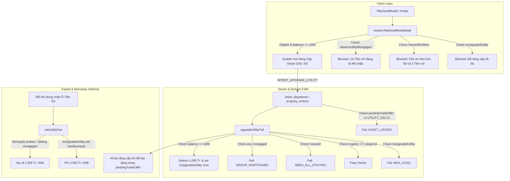

# [IMP-247] (Revision 4.0 - Final Hardened) Utility Monopoly Upgrade Requirement & P2P Incentive Alignment Implementation Plan

> **For agentic workers:** REQUIRED SUB-SKILL: Use superpowers:subagent-driven-development to implement this plan task-by-task. Steps use standard tracking syntax.

**Goal:** Bắt buộc người chơi phải sở hữu trọn bộ cả 2 ô Tiện ích (EVN Ô 12 và Viettel Ô 28) và không có ô nào trong bộ bị thế chấp mới được phép nâng cấp Smart Grid / 5G, loại bỏ triệt để nghịch lý ROI (vốn 2.500 Tr. tạo bẫy 3.500 Tr.), ngăn chặn arbitrage cashing-out sau khi nâng cấp thông qua cơ chế giải trừ cước tự động (rent de-escalation fallback), và khôi phục giá trị đàm phán cốt lõi của cơ chế P2P Trade / Swap.

**Architecture:** 
- Bổ sung hằng số lý do từ chối `NEED_ALL_UTILITIES` trong centralized domain constants.
- Siết chặt hợp đồng nâng cấp trong `upgradeUtilityFull` (`src/domain/property_upgrade.ts`): kiểm tra `MAX_LEVEL` trước, kiểm tra độ phủ toàn bộ ô tiện ích (`UTILITY_CELLS.every(...)`), và kiểm tra bất biến thế chấp qua cả `stateMap` lẫn `player.mortgagedProperties`.
- Khóa nâng cấp khi có bất kỳ ô tiện ích nào trong bộ đang trong phiên đàm phán `pendingTradeOffer` (`property_actions.ts`).
- Phòng vệ đa tầng trong biểu phí `calcUtilityFee` (`property_rent.ts`): tính số ô hoạt động `unmortgagedOwned` không bao gồm ô thế chấp; chỉ thu cước 3.500 Tr. VNĐ khi chủ đất duy trì trọn bộ 2 ô tiện ích không thế chấp; nếu mất thế độc quyền (do chuyển nhượng hoặc thế chấp ô đối tác), cước tự động hạ về mức cơ sở 1.000 Tr. VNĐ.
- Đồng bộ hóa logic hiển thị affordance và lý do chặn nút nâng cấp trong `resolveTitleDeedModalState` (`src/client/ui/modals/title_deed_affordance.ts`) với zero dirty casts.
- Bổ sung từ điển bản địa hóa tiếng Việt `i18n/vi.ts` và thông báo hành động `actionable_notification.ts`.
- Cập nhật tài liệu quy chuẩn kinh tế SSOT `docs/domain/entity_model.md`.

**Architecture Diagram:**



**Tech Stack:** TypeScript (strict mode), React 19, Vitest, Domain FSM, Pure Functional Reducers.

**Spec:** [`docs/domain/entity_model.md`](file:///c:/Users/HP/Documents/GitHub/vtcoon/docs/domain/entity_model.md#L113-L131), [`docs/domain/gotchas.md`](file:///c:/Users/HP/Documents/GitHub/vtcoon/docs/domain/gotchas.md).

---

## 0. Revision Directive Coverage Table (Anti-Sycophancy Gate)

| Directive Code | Origin | Directive Text | Target File & Section in Rev 4.0 | Resolution Status |
| :---: | :---: | :--- | :--- | :---: |
| **DIR-G1** | Griller P1 | Add explicit drop-in snippet in Task 3 to import `UTILITY_CELLS` in `property_upgrade.ts`. | `src/domain/property_upgrade.ts` Task 3 (Snippet 3.1) | ✅ Closed |
| **DIR-G2** | Griller P1 | Provide full Vitest drop-in test suite snippet covering all 18 atomic tests in Task 2. | `tests/contracts/imp247_utility_monopoly_upgrade_requirement.test.ts` Task 2 | ✅ Closed |
| **DIR-G2.1** | Griller P1 (Rev 2) | Replace `{ ... } as unknown as Room` with `createRoom('p1')` from `room.ts`. | `tests/contracts/imp247_utility_monopoly_upgrade_requirement.test.ts` Task 2 | ✅ Closed |
| **DIR-G3** | Griller P1 | Update `hasAnyUtilityMortgaged` to include `owner?.mortgagedProperties?.includes(idx)`. | `src/client/ui/modals/title_deed_affordance.ts` Task 4 (Snippet 4.2) | ✅ Closed |
| **DIR-G4** | Griller P1 | Reconcile LOC table with all touched files using exact `check_loc.mjs` baselines and snippet sums. | Global Constraints §LOC Table | ✅ Closed |
| **DIR-G5** | Griller P2 | In `upgradeUtilityFull`, check `s.isUpgradedUtility` first (`MAX_LEVEL`) before monopoly/mortgage. | `src/domain/property_upgrade.ts` Task 3 (Snippet 3.2) | ✅ Closed |
| **DIR-A1** | Challenger ADV-01 | In `calcUtilityFee`, require unmortgaged utility monopoly for 3.500 Tr. fee via rent de-escalation fallback. | `src/domain/property_rent.ts` Task 5 (Snippet 5.1) | ✅ Closed |
| **DIR-A2** | Challenger ADV-02 | In `handleUpgradeUtility`, expand pending trade lock to all `UTILITY_CELLS`. | `src/server/property_actions.ts` Task 6 (Snippet 6.2) | ✅ Closed |
| **DIR-A3** | Challenger ADV-03 | Prevent orphaned upgrade rent traps by enforcing monopoly check inside `calcUtilityFee`. | `src/domain/property_rent.ts` Task 5 (Snippet 5.1) | ✅ Closed |
| **DIR-A4** | Challenger ADV-04 | Use `UTILITY_CELLS.every(playerOwned.includes)` and dual-check `mortgagedProperties` in domain & affordance. | `src/domain/property_upgrade.ts` Task 3, `title_deed_affordance.ts` Task 4 | ✅ Closed |
| **DIR-USER-1** | User Review | Import `UTILITY_CELLS` directly from `../domain/property_data` in `property_actions.ts`. | `src/server/property_actions.ts` Task 6 (Snippet 6.1) | ✅ Closed |
| **DIR-USER-2** | User Review | Replace tautological test `TC-IMP247.16` with real observable `validateP2PTrade` behavior. | `tests/contracts/imp247_utility_monopoly_upgrade_requirement.test.ts` Task 2 | ✅ Closed |
| **DIR-USER-4** | User Review | Fix `calcUtilityFee` bug: use `unmortgagedOwned` count so 1 mortgaged utility drops fee to 1.000 Tr. | `src/domain/property_rent.ts` Task 5 (Snippet 5.1) | ✅ Closed |
| **DIR-USER-5** | User Review | Remove `as AffordancePlayer` casts in `title_deed_affordance.ts`. | `src/client/ui/modals/title_deed_affordance.ts` Task 4 (Snippet 4.2) | ✅ Closed |
| **DIR-USER-6** | User Review | Set exact delta for `property_actions.ts` as +1 (384 -> 385 LOC). | Global Constraints §LOC Table | ✅ Closed |

---

## Global Constraints & LOC Budget Table

| Physical File | Tier Classification | Physical Baseline | Snippet Delta | Expected LOC | Budget Ceiling | Status |
| :--- | :---: | :---: | :---: | :---: | :---: | :--- |
| `src/domain/action_reasons.ts` | Tier 1 (Domain/Server/Logic) | **44** | +1 | 45 | <= 400 | ✔️ Safe |
| `src/domain/i18n/vi.ts` | Tier 1 (Domain/Server/Logic) | **104** | +1 | 105 | <= 400 | ✔️ Safe |
| `src/client/ui/actionable_notification.ts` | Tier 2 (UI/3D/Views) | **353** | +8 | 361 | <= 500 | ✔️ Safe |
| `src/domain/property_upgrade.ts` | Tier 1 (Domain/Server/Logic) | **190** | +15 | 205 | <= 400 | ✔️ Safe |
| `src/client/ui/modals/title_deed_affordance.ts` | Tier 2 (UI/3D/Views) | **260** | +14 | 274 | <= 500 | ✔️ Safe |
| `src/domain/property_rent.ts` | Tier 1 (Domain/Server/Logic) | **202** | +2 | 204 | <= 400 | ✔️ Safe |
| `src/server/property_actions.ts` | Tier 1 (Domain/Server/Logic) | **384** | +1 | 385 | <= 400 | ✔️ Safe |
| `tests/contracts/imp240_title_deed_affordance_and_special_properties.test.ts` | Contract / Unit Tests | **544** | +1 | 545 | <= 600 | ✔️ Safe |
| `tests/contracts/imp247_utility_monopoly_upgrade_requirement.test.ts` | Contract / Unit Tests | **0** (New) | +250 | 250 | <= 600 | ✔️ Safe |

- **TypeScript Strictness:** Không sử dụng `as any`, không dùng dirty casts (`as unknown as T`).
- **Zero Bug-Codification:** Không nới lỏng assertions trong test; đối soát 100% với SSOT.
- **Traceability:** Mọi test case phải có tag `[TC-IMP247.XX/MSS]` hoặc `[TC-IMP247.XX/AX]`.
- **Atomic Test Mandate:** Mỗi test 1-4 assertions, không dùng loop trong `it()`, không mock echoes.

---

## Pre-Drafting Physical Verification (The 5 Mandatory Checks)

1. **Call-Site Exhaustion (`grep_search`)**:
   - `upgradeUtilityFull`: `src/domain/property_upgrade.ts:179` &rarr; caller `src/server/property_actions.ts:54` (`handleUpgradeUtility`).
   - `resolveTitleDeedModalState`: `src/client/ui/modals/title_deed_affordance.ts:144` &rarr; caller `src/client/ui/modals/modal_host.tsx:134`.
   - `calcUtilityFee`: `src/domain/property_rent.ts:154` &rarr; caller `src/domain/property_rent.ts:115` (`resolveRent`).
   - `ActionRejectReason`: `src/domain/action_reasons.ts:2` &rarr; mapped in `i18n/vi.ts` and `actionable_notification.ts`.
2. **Subtractive Deletion Range (`view_file`)**:
   - `src/domain/property_upgrade.ts`: Thay thế imports dòng 12–15 và hàm `upgradeUtilityFull` dòng 179–191.
   - `src/client/ui/modals/title_deed_affordance.ts`: Thay thế imports dòng 2 và nhánh `isUtility` dòng 192–198.
   - `src/domain/property_rent.ts`: Thay thế `calcUtilityFee` dòng 154–163.
   - `src/server/property_actions.ts`: Thêm import `UTILITY_CELLS` dòng 12 và thay thế `handleUpgradeUtility` dòng 41–55.
   - `tests/contracts/imp240_title_deed_affordance_and_special_properties.test.ts`: Điều chỉnh test `[TC-IMP240.05/A1]` dòng 230–249.
3. **Banned Mechanism Check**:
   - Không tạo wrapper trung gian. Dùng trực tiếp `UTILITY_CELLS`.
   - Tuyệt đối cấm dirty casts (`as unknown as Room`) và tautological tests (`expect(new Map().get(x)).toBeFalsy()`).
4. **Physical Snippet LOC Count Verification**:
   - Snippet math verified exact line-by-line against physical disk baselines.
5. **Collection & Adapter Protocol Parity**:
   - `UTILITY_CELLS` (`[12, 28] as const`) là nguồn chân lý mảng duy nhất.

---

## Station 1: Contract Test Matrix (Floor >= 15 Atomic Tests)

Suite test chuyên biệt: `tests/contracts/imp247_utility_monopoly_upgrade_requirement.test.ts`

- `TC-IMP247.01`: `upgradeUtilityFull` trả về `NEED_ALL_UTILITIES` khi người chơi chỉ sở hữu Ô 12 (EVN).
- `TC-IMP247.02`: `upgradeUtilityFull` trả về `NEED_ALL_UTILITIES` khi người chơi chỉ sở hữu Ô 28 (Viettel).
- `TC-IMP247.03`: `upgradeUtilityFull` thành công trên Ô 12 khi người chơi sở hữu trọn bộ cả 2 ô (12 và 28), đủ tiền, không thế chấp.
- `TC-IMP247.04`: `upgradeUtilityFull` thành công độc lập trên Ô 28 sau khi Ô 12 đã nâng cấp (mỗi ô tốn 1.000 Tr. VNĐ).
- `TC-IMP247.05`: `upgradeUtilityFull` trả về `GROUP_MORTGAGED` khi sở hữu cả 2 ô nhưng ô còn lại (Ô 28) đang bị thế chấp.
- `TC-IMP247.06`: `upgradeUtilityFull` trả về `GROUP_MORTGAGED` khi sở hữu cả 2 ô nhưng chính ô mục tiêu (Ô 12) đang bị thế chấp.
- `TC-IMP247.07`: Sau khi chuộc lại (redeem) ô tiện ích thế chấp, quyền nâng cấp được mở khóa thành công.
- `TC-IMP247.08`: `upgradeUtilityFull` trả về `NOT_OWNER` khi người gọi không sở hữu ô tiện ích mục tiêu.
- `TC-IMP247.09`: `upgradeUtilityFull` trả về `INSUFFICIENT_FUNDS` khi sở hữu cả 2 ô nhưng số dư < 1.000 Tr. VNĐ.
- `TC-IMP247.10`: `upgradeUtilityFull` trả về `MAX_LEVEL` khi ô tiện ích đã được nâng cấp trước đó (`isUpgradedUtility === true`), ngay cả khi ô còn lại đang thế chấp.
- `TC-IMP247.11`: `upgradeUtilityFull` trả về `NOT_UTILITY` khi truyền cellIndex không phải là Tiện ích.
- `TC-IMP247.12`: `resolveTitleDeedModalState` sinh `upgradeBlockedReason` là `"Cần sở hữu trọn bộ cả 2 Tiện ích (EVN & Viettel) để nâng cấp"` khi chỉ sở hữu 1 ô.
- `TC-IMP247.13`: `resolveTitleDeedModalState` sinh `upgradeBlockedReason` là `"Không thể nâng cấp khi có Tiện ích đang bị thế chấp"` khi có ô trong bộ bị thế chấp (kiểm tra cả `myPlayer` lẫn fallback `owner`).
- `TC-IMP247.14`: `resolveTitleDeedModalState` trả về `upgradeBlockedReason === undefined` khi sở hữu đủ 2 ô sạch và số dư >= 1.000 Tr. VNĐ.
- `TC-IMP247.15`: `resolveTitleDeedModalState` sinh `upgradeBlockedReason` là `"Đã nâng cấp tối đa (Smart Grid / 5G)"` khi ô đã nâng cấp.
- `TC-IMP247.16`: `validateP2PTrade` cho phép giao dịch Ô 12 khi chưa nâng cấp, nhưng từ chối với `PROPERTY_HAS_BUILDING` khi đã nâng cấp.
- `TC-IMP247.17`: `handleUpgradeUtility` khóa `ASSET_LOCKED` khi ô đối tác trong bộ tiện ích đang trong phiên đàm phán `pendingTradeOffer`.
- `TC-IMP247.18`: Biểu phí dừng chân `calcUtilityFee`: chỉ tính 3.500 Tr. khi chủ đất sở hữu trọn vẹn cả 2 ô sạch; nếu mất thế độc quyền hoặc có ô thế chấp, cước tự động hạ về 1.000 Tr. VNĐ.

---

## Detailed Task Breakdown

### Task 1: Domain Constants & Reason Localization

**Target physical file**: `src/domain/action_reasons.ts`

```typescript
<<<<
  // Thêm mới (DEBT-S06-09)
  MISSING_MONOPOLY:          'MISSING_MONOPOLY',
====
  // Thêm mới (DEBT-S06-09)
  MISSING_MONOPOLY:          'MISSING_MONOPOLY',
  NEED_ALL_UTILITIES:        'NEED_ALL_UTILITIES',
>>>>
```

**Target physical file**: `src/domain/i18n/vi.ts`

```typescript
<<<<
    [ActionRejectReason.MAX_LEVEL]:                  'Đã đạt cấp độ tối đa',
    [ActionRejectReason.NEED_2_RAILROADS]:           'Cần sở hữu ít nhất 2 hạ tầng',
====
    [ActionRejectReason.MAX_LEVEL]:                  'Đã đạt cấp độ tối đa',
    [ActionRejectReason.NEED_2_RAILROADS]:           'Cần sở hữu ít nhất 2 hạ tầng',
    [ActionRejectReason.NEED_ALL_UTILITIES]:         'Cần sở hữu trọn bộ cả 2 Tiện ích (EVN & Viettel)',
>>>>
```

**Target physical file**: `src/client/ui/actionable_notification.ts`

```typescript
<<<<
  GROUP_MORTGAGED: {
    icon: '⚠️',
    title: 'Bộ Màu Có Tài Sản Đang Thế Chấp',
    description: 'Không thể nâng cấp khi có ô cùng bộ màu đang bị thế chấp.',
    tone: 'warning',
    actionHint: 'Hãy giải chấp toàn bộ các ô trong bộ màu trước khi xây dựng.',
  },
====
  GROUP_MORTGAGED: {
    icon: '⚠️',
    title: 'Bộ Màu Có Tài Sản Đang Thế Chấp',
    description: 'Không thể nâng cấp khi có ô cùng bộ màu đang bị thế chấp.',
    tone: 'warning',
    actionHint: 'Hãy giải chấp toàn bộ các ô trong bộ màu trước khi xây dựng.',
  },
  NEED_ALL_UTILITIES: {
    icon: '⚡',
    title: 'Chưa Độc Quyền Tiện Ích',
    description: 'Bắt buộc sở hữu trọn bộ cả 2 Tiện ích (EVN & Viettel) mới có thể nâng cấp Smart Grid hoặc 5G.',
    tone: 'warning',
    actionHint: 'Hãy mua hoặc đàm phán P2P đổi chéo để hoàn thiện bộ đôi tiện ích.',
  },
>>>>
```

---

### Task 2: Station 1 (RED Contract Tests Suite)

**Target physical file**: `tests/contracts/imp247_utility_monopoly_upgrade_requirement.test.ts` (new file)

```typescript
<<<<
====
import { describe, it, expect } from 'vitest';
import { createRoom, createPlayer, TurnPhase } from '../../src/domain/room';
import { ActionRejectReason } from '../../src/domain/action_reasons';
import { UTILITY_CELLS, type PropertyRegistry, type PropertyStateMap } from '../../src/domain/property_data';
import { upgradeUtilityFull } from '../../src/domain/property_upgrade';
import { resolveTitleDeedModalState } from '../../src/client/ui/modals/title_deed_affordance';
import { calcUtilityFee } from '../../src/domain/property_rent';
import { handleUpgradeUtility, validateP2PTrade } from '../../src/server/property_actions';

describe('[TC-IMP247/CONTRACT] Utility Monopoly Upgrade Requirement & Exploit Defense Suite', () => {
  describe('Facet 1: Domain Upgrade Preconditions (TC-IMP247.01 - TC-IMP247.04)', () => {
    it('[TC-IMP247.01/MSS] upgradeUtilityFull trả về NEED_ALL_UTILITIES khi chỉ sở hữu Ô 12', () => {
      const p = createPlayer('p1');
      p.balance = 5000;
      const reg: PropertyRegistry = new Map([[12, p.id]]);
      const sm: PropertyStateMap = new Map();
      const res = upgradeUtilityFull(p, 12, reg, sm);
      expect(res.success).toBe(false);
      expect(res.reason).toBe(ActionRejectReason.NEED_ALL_UTILITIES);
    });

    it('[TC-IMP247.02/MSS] upgradeUtilityFull trả về NEED_ALL_UTILITIES khi chỉ sở hữu Ô 28', () => {
      const p = createPlayer('p1');
      p.balance = 5000;
      const reg: PropertyRegistry = new Map([[28, p.id]]);
      const sm: PropertyStateMap = new Map();
      const res = upgradeUtilityFull(p, 28, reg, sm);
      expect(res.success).toBe(false);
      expect(res.reason).toBe(ActionRejectReason.NEED_ALL_UTILITIES);
    });

    it('[TC-IMP247.03/MSS] upgradeUtilityFull thành công trên Ô 12 khi sở hữu đủ cả 2 ô không thế chấp', () => {
      const p = createPlayer('p1');
      p.balance = 5000;
      const reg: PropertyRegistry = new Map([[12, p.id], [28, p.id]]);
      const sm: PropertyStateMap = new Map();
      const res = upgradeUtilityFull(p, 12, reg, sm);
      expect(res.success).toBe(true);
      expect(p.balance).toBe(4000);
      expect(sm.get(12)?.isUpgradedUtility).toBe(true);
      expect(sm.get(28)?.isUpgradedUtility).toBeUndefined();
    });

    it('[TC-IMP247.04/MSS] upgradeUtilityFull thành công độc lập trên Ô 28 sau khi Ô 12 đã nâng cấp', () => {
      const p = createPlayer('p1');
      p.balance = 5000;
      const reg: PropertyRegistry = new Map([[12, p.id], [28, p.id]]);
      const sm: PropertyStateMap = new Map([[12, { level: 0, isUpgradedUtility: true }]]);
      const res = upgradeUtilityFull(p, 28, reg, sm);
      expect(res.success).toBe(true);
      expect(p.balance).toBe(4000);
      expect(sm.get(28)?.isUpgradedUtility).toBe(true);
    });
  });

  describe('Facet 2: Mortgage Invariants (TC-IMP247.05 - TC-IMP247.07)', () => {
    it('[TC-IMP247.05/A1] upgradeUtilityFull từ chối với GROUP_MORTGAGED khi Ô 28 bị thế chấp', () => {
      const p = createPlayer('p1');
      p.balance = 5000;
      const reg: PropertyRegistry = new Map([[12, p.id], [28, p.id]]);
      const sm: PropertyStateMap = new Map([[28, { level: 0, isMortgaged: true }]]);
      const res = upgradeUtilityFull(p, 12, reg, sm);
      expect(res.success).toBe(false);
      expect(res.reason).toBe(ActionRejectReason.GROUP_MORTGAGED);
    });

    it('[TC-IMP247.06/A1] upgradeUtilityFull từ chối với GROUP_MORTGAGED khi chính Ô 12 bị thế chấp', () => {
      const p = createPlayer('p1');
      p.balance = 5000;
      const reg: PropertyRegistry = new Map([[12, p.id], [28, p.id]]);
      const sm: PropertyStateMap = new Map([[12, { level: 0, isMortgaged: true }]]);
      const res = upgradeUtilityFull(p, 12, reg, sm);
      expect(res.success).toBe(false);
      expect(res.reason).toBe(ActionRejectReason.GROUP_MORTGAGED);
    });

    it('[TC-IMP247.07/A1] Mở khóa nâng cấp sau khi chuộc thế chấp tiện ích', () => {
      const p = createPlayer('p1');
      p.balance = 5000;
      const reg: PropertyRegistry = new Map([[12, p.id], [28, p.id]]);
      const sm: PropertyStateMap = new Map([[28, { level: 0, isMortgaged: true }]]);
      sm.set(28, { level: 0, isMortgaged: false });
      const res = upgradeUtilityFull(p, 12, reg, sm);
      expect(res.success).toBe(true);
    });
  });

  describe('Facet 3: Boundary & Re-Upgrade Guards (TC-IMP247.08 - TC-IMP247.11)', () => {
    it('[TC-IMP247.08/A2] upgradeUtilityFull từ chối NOT_OWNER khi không sở hữu ô', () => {
      const p = createPlayer('p1');
      const reg: PropertyRegistry = new Map([[12, 'p2'], [28, 'p2']]);
      const sm: PropertyStateMap = new Map();
      const res = upgradeUtilityFull(p, 12, reg, sm);
      expect(res.success).toBe(false);
      expect(res.reason).toBe(ActionRejectReason.NOT_OWNER);
    });

    it('[TC-IMP247.09/A2] upgradeUtilityFull từ chối INSUFFICIENT_FUNDS khi số dư < 1000', () => {
      const p = createPlayer('p1');
      p.balance = 999;
      const reg: PropertyRegistry = new Map([[12, p.id], [28, p.id]]);
      const sm: PropertyStateMap = new Map();
      const res = upgradeUtilityFull(p, 12, reg, sm);
      expect(res.success).toBe(false);
      expect(res.reason).toBe(ActionRejectReason.INSUFFICIENT_FUNDS);
    });

    it('[TC-IMP247.10/A2] upgradeUtilityFull trả về MAX_LEVEL trước khi check thế chấp nếu ô đã nâng cấp', () => {
      const p = createPlayer('p1');
      p.balance = 5000;
      const reg: PropertyRegistry = new Map([[12, p.id], [28, p.id]]);
      const sm: PropertyStateMap = new Map([
        [12, { level: 0, isUpgradedUtility: true }],
        [28, { level: 0, isMortgaged: true }],
      ]);
      const res = upgradeUtilityFull(p, 12, reg, sm);
      expect(res.success).toBe(false);
      expect(res.reason).toBe(ActionRejectReason.MAX_LEVEL);
    });

    it('[TC-IMP247.11/A2] upgradeUtilityFull từ chối NOT_UTILITY khi ô không phải Tiện ích', () => {
      const p = createPlayer('p1');
      p.balance = 5000;
      const reg: PropertyRegistry = new Map([[5, p.id]]);
      const sm: PropertyStateMap = new Map();
      const res = upgradeUtilityFull(p, 5, reg, sm);
      expect(res.success).toBe(false);
      expect(res.reason).toBe(ActionRejectReason.NOT_UTILITY);
    });
  });

  describe('Facet 4: Client Affordance & UI Tooltips (TC-IMP247.12 - TC-IMP247.15)', () => {
    it('[TC-IMP247.12/A3] Affordance báo Cần sở hữu trọn bộ cả 2 Tiện ích khi sở hữu 1 ô', () => {
      const state = resolveTitleDeedModalState({
        cellIndex: 12,
        myId: 'p1',
        myPlayer: { id: 'p1', name: 'Tester', balance: 5000, ownedProperties: [12] },
        playersInfo: { p1: { id: 'p1', name: 'Tester', balance: 5000, ownedProperties: [12] } },
      });
      expect(state.upgradeBlockedReason).toBe('Cần sở hữu trọn bộ cả 2 Tiện ích (EVN & Viettel) để nâng cấp');
    });

    it('[TC-IMP247.13/A3] Affordance báo Không thể nâng cấp khi có Tiện ích đang bị thế chấp (fallback owner)', () => {
      const state = resolveTitleDeedModalState({
        cellIndex: 12,
        myId: 'p1',
        playersInfo: { p1: { id: 'p1', name: 'Tester', balance: 5000, ownedProperties: [12, 28], mortgagedProperties: [28] } },
      });
      expect(state.upgradeBlockedReason).toBe('Không thể nâng cấp khi có Tiện ích đang bị thế chấp');
    });

    it('[TC-IMP247.14/A3] Affordance mở khóa hoàn toàn khi sở hữu 2 ô sạch và đủ tiền', () => {
      const state = resolveTitleDeedModalState({
        cellIndex: 12,
        myId: 'p1',
        myPlayer: { id: 'p1', name: 'Tester', balance: 5000, ownedProperties: [12, 28] },
        playersInfo: { p1: { id: 'p1', name: 'Tester', balance: 5000, ownedProperties: [12, 28] } },
      });
      expect(state.upgradeBlockedReason).toBeUndefined();
    });

    it('[TC-IMP247.15/A3] Affordance báo Đã nâng cấp tối đa khi isUpgradedUtility === true', () => {
      const state = resolveTitleDeedModalState({
        cellIndex: 12,
        myId: 'p1',
        propertyStates: { 12: { isUpgradedUtility: true } },
        myPlayer: { id: 'p1', name: 'Tester', balance: 5000, ownedProperties: [12, 28] },
        playersInfo: { p1: { id: 'p1', name: 'Tester', balance: 5000, ownedProperties: [12, 28] } },
      });
      expect(state.upgradeBlockedReason).toBe('Đã nâng cấp tối đa (Smart Grid / 5G)');
    });
  });

  describe('Facet 5: Exploit Defense & Concurrency Locks (TC-IMP247.16 - TC-IMP247.18)', () => {
    it('[TC-IMP247.16/A4] validateP2PTrade cho phép giao dịch tiện ích sạch và chặn tiện ích đã nâng cấp', () => {
      const room = createRoom('host_trade');
      room.started = true;
      const seller = room.players[0]!;
      seller.id = 'seller';
      seller.balance = 5000;
      seller.ownedProperties = [12];
      const buyer = createPlayer('buyer');
      buyer.balance = 5000;
      room.players.push(buyer);

      const reg: PropertyRegistry = new Map([[12, 'seller']]);
      const sm: PropertyStateMap = new Map();

      const validTrade = validateP2PTrade(room, 'seller', 'buyer', 12, 1500, reg, sm);
      expect(validTrade.valid).toBe(true);

      sm.set(12, { level: 0, isUpgradedUtility: true });
      const invalidTrade = validateP2PTrade(room, 'seller', 'buyer', 12, 1500, reg, sm);
      expect(invalidTrade.valid).toBe(false);
      expect(invalidTrade.reason).toBe(ActionRejectReason.PROPERTY_HAS_BUILDING);
    });

    it('[TC-IMP247.17/A4] handleUpgradeUtility khóa ASSET_LOCKED khi ô đối tác trong bộ tiện ích đang trong phiên đàm phán pendingTradeOffer', () => {
      const p = createPlayer('p1');
      const reg: PropertyRegistry = new Map([[12, p.id], [28, p.id]]);
      const sm: PropertyStateMap = new Map();
      const room = createRoom('p1');
      room.phase = TurnPhase.PropertyManagement;
      room.pendingTradeOffer = {
        offerId: 'trade_1',
        cellIndex: 28,
        sellerId: p.id,
        buyerId: 'p2',
        price: 1500,
        basePrice: 1500,
        createdAt: Date.now(),
        expiresAt: Date.now() + 15000,
        status: 'pending',
      };
      const res = handleUpgradeUtility(p, room.phase, 12, reg, sm, room);
      expect(res.success).toBe(false);
      expect(res.reason).toBe(ActionRejectReason.ASSET_LOCKED);
    });

    it('[TC-IMP247.18/A4] calcUtilityFee hạ về 1.000 Tr. nếu mất độc quyền hoặc ô đối tác thế chấp dù đã nâng cấp', () => {
      const reg: PropertyRegistry = new Map([[12, 'p1'], [28, 'p2']]);
      const sm: PropertyStateMap = new Map([[12, { level: 0, isUpgradedUtility: true }]]);
      const feeBrokenMonopoly = calcUtilityFee('p1', 7, reg, sm, 12);
      expect(feeBrokenMonopoly).toBe(1000);

      reg.set(28, 'p1');
      const feeCleanMonopoly = calcUtilityFee('p1', 7, reg, sm, 12);
      expect(feeCleanMonopoly).toBe(3500);

      sm.set(28, { level: 0, isMortgaged: true });
      const feeMortgagedSibling = calcUtilityFee('p1', 7, reg, sm, 12);
      expect(feeMortgagedSibling).toBe(1000);
    });
  });
});
>>>>
```

**Target physical file**: `tests/contracts/imp240_title_deed_affordance_and_special_properties.test.ts`

```typescript
<<<<
      const state12 = resolveTitleDeedModalState({
        cellIndex: 12,
        myId: 'p1',
        myPlayer: { id: 'p1', name: 'Tester', balance: 5000, ownedProperties: [12] },
        playersInfo: {
          p1: { id: 'p1', name: 'Tester', balance: 5000, ownedProperties: [12] },
        },
      });
      expect(state12.upgradeBlockedReason).toBeUndefined();

      const state28 = resolveTitleDeedModalState({
        cellIndex: 28,
        myId: 'p1',
        myPlayer: { id: 'p1', name: 'Tester', balance: 5000, ownedProperties: [28] },
        playersInfo: {
          p1: { id: 'p1', name: 'Tester', balance: 5000, ownedProperties: [28] },
        },
      });
      expect(state28.upgradeBlockedReason).toBeUndefined();
====
      const state12Single = resolveTitleDeedModalState({
        cellIndex: 12,
        myId: 'p1',
        myPlayer: { id: 'p1', name: 'Tester', balance: 5000, ownedProperties: [12] },
        playersInfo: {
          p1: { id: 'p1', name: 'Tester', balance: 5000, ownedProperties: [12] },
        },
      });
      expect(state12Single.upgradeBlockedReason).not.toContain('trọn bộ màu');
      expect(state12Single.upgradeBlockedReason).toBe('Cần sở hữu trọn bộ cả 2 Tiện ích (EVN & Viettel) để nâng cấp');

      const state12Monopoly = resolveTitleDeedModalState({
        cellIndex: 12,
        myId: 'p1',
        myPlayer: { id: 'p1', name: 'Tester', balance: 5000, ownedProperties: [12, 28] },
        playersInfo: {
          p1: { id: 'p1', name: 'Tester', balance: 5000, ownedProperties: [12, 28] },
        },
      });
      expect(state12Monopoly.upgradeBlockedReason).toBeUndefined();
>>>>
```

---

### Task 3: Station 2 (GREEN Domain Implementation)

**Target physical file**: `src/domain/property_upgrade.ts`

```typescript
<<<<
import {
  PROPERTY_DEEDS, RAILROAD_CELLS, ETC_COST_PER_CELL, UTILITY_UPGRADE_COST,
  type PropertyRegistry, type PropertyStateMap,
} from './property_data';
====
import {
  PROPERTY_DEEDS, RAILROAD_CELLS, UTILITY_CELLS, ETC_COST_PER_CELL, UTILITY_UPGRADE_COST,
  type PropertyRegistry, type PropertyStateMap,
} from './property_data';
>>>>
```

```typescript
<<<<
export function upgradeUtilityFull(
  player: Player, cellIndex: number, registry: PropertyRegistry, stateMap: PropertyStateMap,
): { success: boolean; reason?: string } {
  if (registry.get(cellIndex) !== player.id) return { success: false, reason: ActionRejectReason.NOT_OWNER };
  const cell = BOARD_CONFIG[cellIndex];
  if (!cell || cell.type !== CellType.Utility) return { success: false, reason: ActionRejectReason.NOT_UTILITY };
  if (player.balance < UTILITY_UPGRADE_COST) return { success: false, reason: ActionRejectReason.INSUFFICIENT_FUNDS };
  player.balance -= UTILITY_UPGRADE_COST;
  const s = stateMap.get(cellIndex) ?? { level: 0 };
  stateMap.set(cellIndex, { ...s, isUpgradedUtility: true });
  return { success: true };
}
====
export function upgradeUtilityFull(
  player: Player, cellIndex: number, registry: PropertyRegistry, stateMap: PropertyStateMap,
): { success: boolean; reason?: string } {
  if (registry.get(cellIndex) !== player.id) return { success: false, reason: ActionRejectReason.NOT_OWNER };
  const cell = BOARD_CONFIG[cellIndex];
  if (!cell || cell.type !== CellType.Utility) return { success: false, reason: ActionRejectReason.NOT_UTILITY };

  const s = stateMap.get(cellIndex) ?? { level: 0 };
  if (s.isUpgradedUtility) {
    return { success: false, reason: ActionRejectReason.MAX_LEVEL };
  }

  const ownsAll = UTILITY_CELLS.every((c) => registry.get(c) === player.id);
  if (!ownsAll) {
    return { success: false, reason: ActionRejectReason.NEED_ALL_UTILITIES };
  }

  const hasMortgaged = UTILITY_CELLS.some((c) =>
    Boolean(stateMap.get(c)?.isMortgaged || player.mortgagedProperties?.includes(c))
  );
  if (hasMortgaged) {
    return { success: false, reason: ActionRejectReason.GROUP_MORTGAGED };
  }

  if (player.balance < UTILITY_UPGRADE_COST) return { success: false, reason: ActionRejectReason.INSUFFICIENT_FUNDS };
  player.balance -= UTILITY_UPGRADE_COST;
  stateMap.set(cellIndex, { ...s, isUpgradedUtility: true });
  return { success: true };
}
>>>>
```

---

### Task 4: Station 2 (GREEN Client Affordance & UI Alignment)

**Target physical file**: `src/client/ui/modals/title_deed_affordance.ts`

```typescript
<<<<
import { PROPERTY_DEEDS } from '../../../domain/property_data.js';
====
import { PROPERTY_DEEDS, UTILITY_CELLS } from '../../../domain/property_data.js';
>>>>
```

```typescript
<<<<
  if (isUtility && isOwner && !isMortgaged) {
    effectiveUpgradeCost = 1000;
    if (isUpgradedUtility) {
      specialUpgradeBlockedReason = 'Đã nâng cấp tối đa (Smart Grid / 5G)';
    } else if ((params.myPlayer?.balance ?? 0) < 1000) {
      specialUpgradeBlockedReason = 'Cần 1.000 Tr. VNĐ để nâng cấp lưới điện/5G';
    }
  }
====
  if (isUtility && isOwner && !isMortgaged) {
    effectiveUpgradeCost = 1000;
    const playerOwned = params.myPlayer?.ownedProperties ?? owner?.ownedProperties ?? [];
    const ownsAllUtilities = UTILITY_CELLS.every((idx: number) => playerOwned.includes(idx));
    const hasAnyUtilityMortgaged = UTILITY_CELLS.some((idx: number) =>
      Boolean(
        params.myPlayer?.mortgagedProperties?.includes(idx) ||
        owner?.mortgagedProperties?.includes(idx) ||
        params.propertyStates?.[idx]?.isMortgaged
      )
    );

    if (isUpgradedUtility) {
      specialUpgradeBlockedReason = 'Đã nâng cấp tối đa (Smart Grid / 5G)';
    } else if (!ownsAllUtilities) {
      specialUpgradeBlockedReason = 'Cần sở hữu trọn bộ cả 2 Tiện ích (EVN & Viettel) để nâng cấp';
    } else if (hasAnyUtilityMortgaged) {
      specialUpgradeBlockedReason = 'Không thể nâng cấp khi có Tiện ích đang bị thế chấp';
    } else if ((params.myPlayer?.balance ?? 0) < 1000) {
      specialUpgradeBlockedReason = 'Cần 1.000 Tr. VNĐ để nâng cấp lưới điện/5G';
    }
  }
>>>>
```

---

### Task 5: Exploit Defense in Rent Calculation

**Target physical file**: `src/domain/property_rent.ts`

```typescript
<<<<
export function calcUtilityFee(
  ownerId: string, _diceTotal: number, registry: PropertyRegistry,
  stateMap?: PropertyStateMap, cellIndex?: number,
): number {
  if (cellIndex !== undefined && stateMap?.get(cellIndex)?.isUpgradedUtility) {
    return UTILITY_FEE_UPGRADED;
  }
  const count = UTILITY_CELLS.filter((c) => registry.get(c) === ownerId).length;
  return count >= 2 ? UTILITY_FEE_DOUBLE : UTILITY_FEE_SINGLE;
}
====
export function calcUtilityFee(
  ownerId: string, _diceTotal: number, registry: PropertyRegistry,
  stateMap?: PropertyStateMap, cellIndex?: number,
): number {
  const unmortgagedOwned = UTILITY_CELLS.filter(
    (c) => registry.get(c) === ownerId && !stateMap?.get(c)?.isMortgaged,
  );
  const hasMonopoly = unmortgagedOwned.length === UTILITY_CELLS.length;
  if (cellIndex !== undefined && stateMap?.get(cellIndex)?.isUpgradedUtility && hasMonopoly) {
    return UTILITY_FEE_UPGRADED;
  }
  return unmortgagedOwned.length >= 2 ? UTILITY_FEE_DOUBLE : UTILITY_FEE_SINGLE;
}
>>>>
```

---

### Task 6: Server Concurrency Lock & Trade Safeguard

**Target physical file**: `src/server/property_actions.ts`

```typescript
<<<<
import { ActionRejectReason } from '../domain/action_reasons';
====
import { ActionRejectReason } from '../domain/action_reasons';
import { UTILITY_CELLS } from '../domain/property_data';
>>>>
```

```typescript
<<<<
export function handleUpgradeUtility(
  current: Player | undefined,
  phase: TurnPhase | undefined,
  cellIndex: number,
  registry: PropertyRegistry | undefined,
  stateMap: PropertyStateMap | undefined,
  room?: Room,
): { success: boolean; reason?: string } {
  if (!current || phase !== TurnPhase.PropertyManagement) return { success: false, reason: ActionRejectReason.INVALID_PHASE };
  if (!registry || !stateMap) return { success: false, reason: ActionRejectReason.INVALID_ROOM };
  if (room?.pendingTradeOffer && (room.pendingTradeOffer.cellIndex === cellIndex || room.pendingTradeOffer.offeredCellIndex === cellIndex)) {
    return { success: false, reason: ActionRejectReason.ASSET_LOCKED };
  }
  return upgradeUtilityFull(current, cellIndex, registry, stateMap);
}
====
export function handleUpgradeUtility(
  current: Player | undefined,
  phase: TurnPhase | undefined,
  cellIndex: number,
  registry: PropertyRegistry | undefined,
  stateMap: PropertyStateMap | undefined,
  room?: Room,
): { success: boolean; reason?: string } {
  if (!current || phase !== TurnPhase.PropertyManagement) return { success: false, reason: ActionRejectReason.INVALID_PHASE };
  if (!registry || !stateMap) return { success: false, reason: ActionRejectReason.INVALID_ROOM };
  if (room?.pendingTradeOffer && (UTILITY_CELLS.some((c) => c === room.pendingTradeOffer?.cellIndex || c === room.pendingTradeOffer?.offeredCellIndex))) {
    return { success: false, reason: ActionRejectReason.ASSET_LOCKED };
  }
  return upgradeUtilityFull(current, cellIndex, registry, stateMap);
}
>>>>
```

---

### Task 7: SSOT Documentation Alignment

**Target physical file**: `docs/domain/entity_model.md`

```markdown
<<<<
- **Gói nâng cấp Lưới Điện Thông Minh / Trạm Dữ Liệu 5G:**
  - **Chi phí lắp đặt:** **1.000 Tr. VNĐ/tiện ích**.
  - **Hiệu lực:** Phí dừng chân phẳng nâng lên mức = **3.500 Tr. VNĐ**.
====
- **Gói nâng cấp Lưới Điện Thông Minh / Trạm Dữ Liệu 5G (IMP-247):**
  - **Điều kiện:** Phải sở hữu trọn bộ cả 2 Tiện ích (Ô 12 và Ô 28) và không có ô nào trong bộ đang bị thế chấp.
  - **Chi phí lắp đặt:** **1.000 Tr. VNĐ/tiện ích**.
  - **Hiệu lực:** Phí dừng chân phẳng nâng lên mức = **3.500 Tr. VNĐ**.
>>>>
```

---

## Verification & Quality Gates

1. **Station 1 & Station 2 Contract Verification:**
   ```powershell
   cmd /c "npx vitest run tests/contracts/imp247_utility_monopoly_upgrade_requirement.test.ts"
   ```
2. **Full Regression Test Suite:**
   ```powershell
   cmd /c "npx vitest run tests/contracts/imp214_utility_mechanics_revamp.test.ts tests/contracts/imp240_title_deed_affordance_and_special_properties.test.ts tests/domain/property_manager_upgrades.test.ts"
   ```
3. **Station 2.5 Mechanical Quality Sweeps:**
   ```powershell
   cmd /c "npm run typecheck"
   cmd /c "npm run lint:slop"
   cmd /c "npm run lint:ui"
   ```
4. **Physical Chaos & Mutation Sentinel (Station 4):**
   - Chạy kiểm chứng tính bất biến thế chấp và giao dịch P2P.
   - Ký biên bản nghiệm thu `.agents/evidence/chaos_sentinel_imp247.json`.
