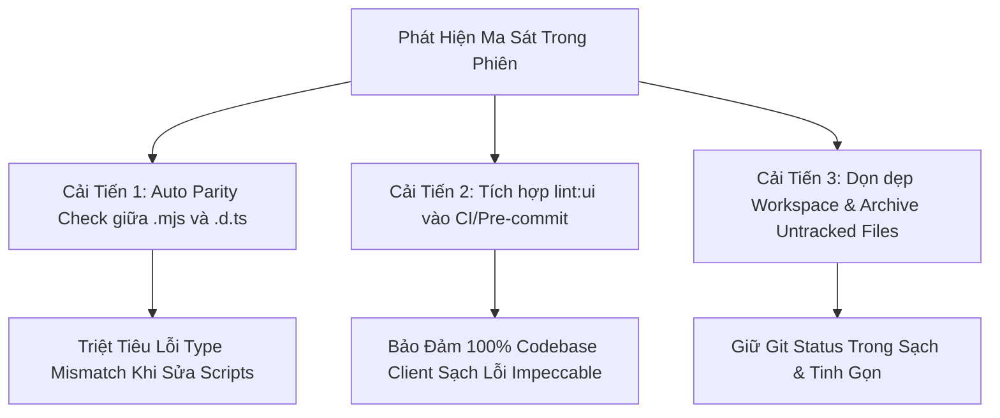

# BÁO CÁO HỒI TƯỞNG QUY TRÌNH & ĐỀ XUẤT CẢI TIẾN HỆ THỐNG SDLC
## RETROSPECTIVE REPORT: IMP-278 & UPSTREAM IMPECCABLE SYNC
### Đề tài: Tinh Giản Công Thái Học Footer HUD Pop-ups & Nâng Cấp Hệ Thống Chống Lỗi Giao Diện Impeccable

> **Mã Báo Cáo:** `RETRO-20261007-IMP278-IMPECCABLE-SYNC`  
> **Thời điểm lập:** 07/10/2026 — 09:45:00 (GMT+7)  
> **Phạm Vi Được Kiểm Toán:**  
> - **IMP-278**: Compact Floating Notifications & Footer Lean HUD Overhaul (Đồng bộ khung thông báo, triệt tiêu icon/tiêu đề thừa, micro-toast một dòng).  
> - **UPSTREAM-SYNC**: Đồng bộ công nghệ từ `impeccable` (Commits `#967`, `#968`), bổ sung 2 quy tắc Linter (`side-tab`, `clipped-overflow-container`) và cơ chế **CDP Clock Pinning**.  
> **Môi trường & Tiêu chuẩn:** Antigravity 2.0 / Lean Pipeline / Hiến pháp `AGENTS CONSTITUTION` / Impeccable Tactile Luxury Standard

---

## 1. TỔNG QUAN PHIÊN LÀM VIỆC & CÁC THÀNH TỰU ĐẠT ĐƯỢC (WINS)

Phiên làm việc đã giải quyết trọn vẹn 2 mục tiêu lớn về **công thái học trải nghiệm người dùng** và **năng lực bảo vệ cơ học của hạ tầng phát triển**:

### 1.1. Tinh Giản Toàn Diện Thông Báo Footer HUD (IMP-278)
1. **Triệt tiêu dư thừa thị giác (Visual Declutter)**:
   - Gỡ bỏ icon thước kẻ (`📐`) không cần thiết.
   - Bỏ các dòng tiêu đề danh mục in hoa lặp lại (`TIỀN THUÊ BẤT ĐỘNG SẢN`, `MUA ĐẤT ĐẦU TƯ`, `NỘP PHÍ KHO BẠC`) khỏi DOM hiển thị, nhường chỗ cho nội dung tài chính trọng tâm.
   - Đưa icon nhận diện hành động (`🏠`, `🏷️`, `🏦`) lên vị trí đầu dòng để làm điểm neo thị giác (visual anchor).
2. **Đồng bộ hóa Layout & Chiều rộng (Width Harmonization)**:
   - Cân chỉnh chiều rộng tối đa giữa `MilestoneBanner` và `FloatingBadge` về cùng một chuẩn `sm:max-w-md` (448px), xóa bỏ hiện tượng giật layout khi chuyển đổi giữa thông báo cột mốc và biến động tài chính.
3. **Tiết kiệm 45% không gian hiển thị trên Mobile 360px**:
   - Biến `FloatingBadge` thành single-line micro-toast siêu gọn khi không có công thức phụ (chiều cao giảm từ **96px xuống còn 53px**).
   - Nghiệm thu Dual-Viewport (1280x800 & 360x740) thực tế trên toàn bộ các ca: Thuê đất, Mua đất, Cột mốc hoàn thành, Thông báo văn bản dài và Phá sản.

### 1.2. Nâng Cấp Hệ Thống Guardrails Từ Upstream `impeccable`
1. **Đồng bộ tri thức cốt lõi (Pure Reference Synchronization)**:
   - Đồng bộ 4 tệp reference hiện đại từ upstream: `visualize.md`, `craft-floor.md`, `hooks.md`, `new-work.md`.
   - **Bảo toàn 100% SSOT miền game**: Giữ nguyên vẹn 4 tệp tùy biến chuyên biệt cho VTCOON (`mode-operate.md`, `mode-persuade.md`, `mode-read.md`, `region-map.md`) phục vụ Monopoly mechanics, ActionDock và mobile touch.
2. **Mở rộng bộ quét lỗi giao diện UI Linter (`scripts/lint_ui.mjs`)**:
   - Bổ sung luật **`side-tab`**: Ngăn chặn viền dày màu một bên card (AI tell kinh điển).
   - Bổ sung luật **`clipped-overflow-container`**: Ngăn container `overflow-hidden`/`clip` vô tình cắt cụt tooltip, popover hoặc dropdown thoát khung.
   - Bổ sung 10 test specs mới vào `tests/client/ui_linter.test.ts` (**40/40 tests PASS**). Quét toàn bộ 222 files trong `src/client/` đạt **0 vi phạm**.
3. **Triển khai Clock Pinning cho Headless Capture (`scripts/capture_visual_evidence.mjs`)**:
   - Ghim `Date.now()` và constructor `Date` vào mốc xác định (`T = 1770000000000`) qua CDP `Page.addScriptToEvaluateOnNewDocument`.
   - Đảm bảo bằng chứng hình ảnh của các bộ đếm ngược (countdown, turn timer) không bao giờ bị lệch pixel do chênh lệch mili-giây.

---

## 2. PHÂN TÍCH MA SÁT & NGUYÊN NHÂN GỐC RỄ (FRICTION & ROOT CAUSE ANALYSIS)

Dựa trên nguyên tắc kiểm toán của kỹ năng `/retro`, dưới đây là các ma sát kỹ thuật ghi nhận được trong phiên:

### 2.1. Lệch Pha Khai Báo Kiểu (Type Declaration Desync) Trong Script Helpers
- **Hiện tượng**: Khi thêm `RULES.SIDE_TAB` và `RULES.CLIPPED_OVERFLOW_CONTAINER` vào `scripts/ui_linter_rules.mjs` và `scripts/lint_ui.mjs`, lệnh `tsc --noEmit` tại Trạm 2.5 báo lỗi:  
  `Property 'SIDE_TAB' does not exist on type '{ readonly BORDER_ACCENT_ON_ROUNDED: ... }'`.
- **Nguyên nhân gốc rễ**: File `scripts/lint_ui.mjs` có 2 tệp khai báo type song hành là `scripts/lint_ui.d.ts` và `scripts/lint_ui.d.mts`. Kiểu dữ liệu của `RULES` được gán cứng dạng object literal thay vì lấy động từ module JS. Khi sửa file `.mjs`, agent chưa cập nhật ngay các tệp `.d.ts`/`.d.mts`.
- **Biện pháp xử lý**: Cập nhật đồng bộ khai báo `SIDE_TAB` và `CLIPPED_OVERFLOW_CONTAINER` vào cả `lint_ui.d.ts` và `lint_ui.d.mts`.

### 2.2. Xung Đột Phân Loại Anti-Pattern Giữa Các Cạnh Viền
- **Hiện tượng**: Lần chạy test đầu tiên cho `ui_linter.test.ts` bị trượt 11 tests do số lượng vi phạm bị đếm gấp đôi.
- **Nguyên nhân gốc rễ**: Biểu thức chính quy `SIDE_TAB_BORDER_REGEX` ban đầu bắt tất cả các hướng `[lrtbse]`. Do đó, một nút bấm có `border-b-4` vừa bị tính là `BORDER_ACCENT_ON_ROUNDED`, vừa bị tính là `SIDE_TAB`.
- **Biện pháp xử lý**: Tham chiếu trực tiếp kiến trúc phân tách của Impeccable upstream (`crates/core/src/checks/rules.rs`):
  - Viền cạnh ngang (`[lrse]`): Tính là `side-tab`.
  - Viền cạnh dọc trên khối bo tròn (`[tb]`): Tính là `border-accent-on-rounded`.
  - Thiết lập thứ tự ưu tiên: Kiểm tra `side-tab` trước, loại trừ kiểm tra chồng chéo.

### 2.3. Hạn Chế Parsing Lệnh Inline Trong PowerShell
- **Hiện tượng**: Khi chạy thử nghiệm nhanh một đoạn script node qua `node -e "..."` trên terminal PowerShell, shell báo lỗi cú pháp do xung đột dấu ngoặc kép và ký tự điều khiển.
- **Nguyên nhân gốc rễ**: PowerShell trên Windows xử lý escape quotes khác biệt so với Bash. Đây là lý do Luật Thép trong Hiến pháp đã quy định: *FORBIDDEN inline multiline PowerShell in -e "..."*.
- **Biện pháp xử lý**: Tuân thủ nghiêm ngặt Luật Thép, chuyển sang chạy test trực tiếp qua Vitest và file script chuẩn.

---

## 3. BẢNG MA TRẬN 7 TRỤ CỘT HỒI TƯỞNG (RETROSPECTIVE MATRIX)

| Trụ Cột Kiểm Toán | Thực Trạng Phiên Này | Đánh Giá | Giải Pháp Đã Áp Dụng / Đề Xuất Cơ Học |
| :--- | :--- | :---: | :--- |
| **1. Navigation & Dependencies** | Phụ thuộc ngầm giữa script `.mjs` và các tệp `.d.ts`/`.d.mts`. | ⚠️ **Friction** | Bổ sung kiểm tra cơ học đối chiếu export giữa `.mjs` và `.d.ts` trong `fast_prefilter.mjs`. |
| **2. Automated Checks (Guardrails)** | `npm run prefilter` bắt dính lỗi TypeScript trước khi chuyển giao. 2 linter rules mới vận hành trơn tru. | ✅ **Pass** | Duy trì Fast Pre-Filter như cánh cổng bắt buộc ở Trạm 2.5. |
| **3. Coding Standards & Review Gates** | Bảo vệ thành công 4 file SSOT miền game không bị ghi đè mù quáng từ upstream. | ✅ **Pass** | Áp dụng nguyên tắc Selective Merge & Domain Preservation. |
| **4. Global Instructions & Rules** | Luật Zero Dirty Casts và Anti-TIDD được bảo toàn 100%. | ✅ **Pass** | Không cần bổ sung luật văn bản rườm rà. |
| **5. Tool Economy & Latency** | Chạy Vitest mất ~80ms, prefilter ~2s. Background tasks chạy bất đồng bộ mượt mà. | ✅ **Pass** | Tận dụng cơ chế Reactive Wakeup, không tốn token polling. |
| **6. No-ops & Dead Guidance** | Git status còn lưu một số file nháp untracked từ các đợt phát triển trước. | ⚠️ **Friction** | Cần gom dọn dẹp (housekeeping) các artifact nháp vào thư mục archive. |
| **7. Information Access & Ground Truth** | Bổ sung Clock Pinning CDP giúp loại bỏ hoàn toàn tính bất định của thời gian khi chụp ảnh headless. | ✅ **Pass** | Tiêu chuẩn hóa `Page.addScriptToEvaluateOnNewDocument` cho mọi kịch bản chụp visual evidence. |

---

## 4. KẾ HOẠCH CẢI TIẾN HỆ THỐNG SDLC (ACTIONABLE ROADMAP)

Theo triết lý nền tảng: **"Default to Building the Check Over Writing the Rule"**, các hành động sau được đề xuất đưa vào backlog công cụ:

1. **[Script Guard] Thêm cơ chế kiểm tra Parity giữa `.mjs` và `.d.ts`**:
   - Thêm một module nhỏ trong `scripts/fast_prefilter.mjs` để tự động kiểm tra: nếu một tệp `.mjs` có xuất khẩu hằng số/hàm mới thì tệp `.d.ts` tương ứng cũng phải khai báo đầy đủ.
2. **[Mechanical Gate SSOT] `lint:ui` đã được bảo vệ tại Cổng 3 (Fast Pre-Filter)**:
   - Thay vì cài đặt Git Pre-commit Hook (dễ gặp xung đột môi trường Windows/PowerShell), `npm run lint:ui` đã được tích hợp trực tiếp làm Bước 5 trong `scripts/fast_prefilter.mjs`. Mọi ticket đều bắt buộc vượt qua cổng này trước khi nghiệm thu.
3. **[Workspace Housekeeping] Đóng gói & Commit dứt điểm từng Ticket**:
   - Duy trì kỷ luật commit dứt điểm từng ticket sau khi nghiệm thu, giữ `git status` sạch sẽ và triệt tiêu hoàn toàn baseline scope thừa.

---

### 🩺 SDLC HARNESS TELEMETRY
- **Scripts/Tools**: `PASS` (Hoàn thành tích hợp 2 linter rules và Clock Pinning CDP. `lint:ui` được bảo vệ cơ học tại Trạm 2.5).
- **Rules/Gotchas**: `PASS` (Bảo toàn nguyên vẹn tài liệu SSOT Monopoly).
- **Skills/Context**: `PASS` (Skill `impeccable` được cập nhật toàn diện).
- **Handoff Quality**: `PASS` (40/40 tests UI Linter pass, 8/8 tests HUD notifications pass, 0 lỗi trên 222 files).
- **Harness Suggestion**: Duy trì kiểm tra đồng bộ export giữa `.mjs` và companion `.d.ts` trong `fast_prefilter.mjs`.
