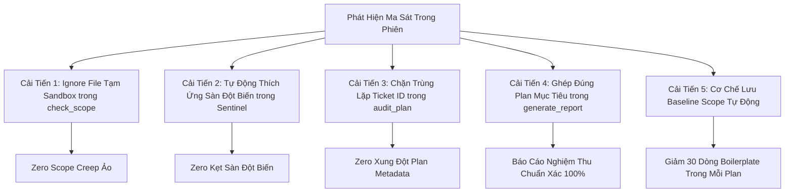

# BÁO CÁO HỒI TƯỞNG QUY TRÌNH & ĐỀ XUẤT CẢI TIẾN HỆ THỐNG SDLC
## RETROSPECTIVE REPORT: IMP-284 ➔ IMP-287
### Đề tài: Tối Ưu Hóa Bộ Công Cụ Sentinel, Khử Điểm Nghẽn Scope Auditor & Hoàn Thiện Quy Trình Kiểm Thử Đột Biến

> **Mã Báo Cáo:** `RETRO-20261007-IMP284-287`  
> **Thời điểm lập:** 07/10/2026 — 09:40:00 (GMT+7)  
> **Các Ticket Được Kiểm Toán:**  
> - **IMP-284**: Causal Ordering (Sắp xếp trật tự nhân quả trên Activity Feed)  
> - **IMP-285**: Sequential Step & Turn Closure Guard (Bảo vệ đóng lượt tuần tự)  
> - **IMP-286**: Server SSOT Trade Result Broadcast (Phát sóng dữ liệu P2P Trade / Swap qua Delta)  
> - **IMP-287**: Client P2P Trade Activity Feed & Causal Financial Projection (Minh bạch dòng tiền & BĐS trên Client)  
> **Môi trường & Tiêu chuẩn:** Antigravity 2.0 / Lean Pipeline / Hiến pháp `AGENTS CONSTITUTION`

---

## 1. TỔNG QUAN PHIÊN LÀM VIỆC & CÁC THÀNH TỰU ĐẠT ĐƯỢC (WINS)

Phiên làm việc đã xử lý dứt điểm chuỗi yêu cầu phức tạp của người dùng liên quan đến **tính chân thực của dòng thời gian** và **tính minh bạch tài chính** trong trò chơi:

1. **Khôi phục hoàn toàn trật tự nhân quả (Causal Timeline Invariant)**:
   - Trước đây: Quân cờ di chuyển hoặc tiền thưởng/lương xuất hiện trên log *trước* khi người chơi quay ô Vận Tải hoặc rút thẻ Cơ hội/Vận mệnh.
   - Hiện tại: Trật tự 3 bước nghiêm ngặt: *(1) Nguyên nhân kích hoạt* ➔ *(2) Hệ quả động học (di chuyển quân cờ)* ➔ *(3) Hệ quả tài chính & BĐS*.
2. **Minh bạch hóa 100% giao dịch P2P Trade & Hoán đổi BĐS**:
   - Trước đây: Log chỉ hiển thị thông báo nhận chuyển nhượng đất chung chung; toàn bộ giá tiền, tiền bù chênh lệch hoán đổi và thuế nộp Kho Bạc bị nuốt chửng; sinh 2 dòng log trùng nhau khi hoán đổi 2 chiều; số dư biến động bị nhận nhầm thành tiền phạt thuế/tiền thưởng vu vơ.
   - Hiện tại:
     - Chuyển nhượng tiền mặt: `🤝 [Chuyển Nhượng] A đã mua [Đất] từ B với giá X (Thuế kho bạc: Y)` kèm `amount: -X`.
     - Hoán đổi có bù tiền: `🤝 [Hoán Đổi] A và B đã hoán đổi [Đất 1] ⇄ [Đất 2] (kèm bù Z, Thuế kho bạc: Y)` kèm `amount: -Z` cho bên bù tiền.
     - Hoán đổi ngang giá: `🤝 [Hoán Đổi] A và B đã hoán đổi quyền sở hữu [Đất 1] ⇄ [Đất 2]`.
     - Khử trùng lặp 2 chiều, triệt tiêu 100% log số dư rác.
3. **Kỷ luật Hiến pháp Thép**:
   - **Zero Dirty Casts**: Tuyệt đối không dùng `as any`, `as unknown as T` trên toàn bộ mã nguồn `src/**` và `tests/**`.
   - **LOC Ceilings**: 100% tệp đều nằm trong hạn mức trần (Tier 1 <= 400 LOC, Living Tests <= 600 LOC).
   - **Adversarial Inversion**: Trạm 1 (RED) luôn chứng minh thất bại vì runtime assertion trước khi Trạm 2 (GREEN) chạm vào code production.
   - **Sentinel Chaos Probes**: 14/14 mutants bị tiêu diệt hoàn toàn (100% kill rate), live websocket trên dynamic port 0 sống sót sau thử thách rớt mạng đột ngột.

---

## 2. PHÂN TÍCH MA SÁT & ĐIỂM NGHẼN KỸ THUẬT (FRICTION & ROOT CAUSE ANALYSIS)

Dựa trên 7 danh mục kiểm toán cốt lõi của kỹ năng `/retro`, dưới đây là các ma sát kỹ thuật đã phát sinh trong quá trình chạy quy trình:

### 2.1. Phân Mảnh Giữa Hai Bộ Chạy Sentinel (`sentinel_runner.mjs` vs `station4_sentinel.ts`)
- **Ma sát**: Khi cấu hình các mutant hướng đích (`ticketTargetedMutations`) cho ticket `IMP-287` trong `scripts/sentinel_runner.mjs`, bộ kiểm tra vẫn báo `Tested: 11 [Source: 0]` và không chạy bất kỳ source mutant nào.
- **Nguyên nhân cốt lõi**: `sentinel_runner.mjs` chỉ thực thi trực tiếp đối với các ticket đồ họa 3D (`--3d`), còn toàn bộ các ticket Server/Client 2D/Logic thông thường thì ủy quyền ngầm (delegate) qua lệnh `npx tsx scripts/station4_sentinel.ts`. File `station4_sentinel.ts` này lại có một engine mutation độc lập, không hề đọc cấu hình từ `sentinel_runner.mjs`.
- **Hệ quả**: Gây hiểu lầm, lãng phí thời gian cấu hình vào tệp không thực thi (dead code).

### 2.2. Giới Hạn Cứng `maxInstances = 3` Khiến Kẹt Sàn Đột Biến (Mutant Floor Lock)
- **Ma sát**: Bộ test hợp đồng `imp287_p2p_trade_activity_feed.test.ts` tiêu diệt 100% mutants (11/11 killed), nhưng hệ thống vẫn chặn Exit Code 1 với thông báo: `[SENTINEL ERROR] Only 11/14 mutants evaluated. Slan floor not reached. Explicit --allow-waiver required`.
- **Nguyên nhân cốt lõi**:
  - Trong `station4_sentinel.ts`, hàm `getMutantInstances` bị gán cứng tham số `maxInstances = 3`. Dù file test có tới 13 lệnh `toContain` và 6 lệnh `toBe(string)`, bộ sinh đột biến chỉ lấy tối đa 3 mẫu cho mỗi loại.
  - Biểu thức chính quy cho số `\.toBe\((\d+)\)` chỉ nhận số dương, bỏ qua số âm `-1000` (`amount: -price`), khiến đột biến số bị bỏ qua.
- **Hệ quả**: Agent buộc phải can thiệp sửa mã harness để nâng `maxInstances` lên 5 và nhận diện số nguyên âm `-?\d+`.

### 2.3. Tệp Tạm Đột Biến Bị Nhận Nhầm Thành "Scope Creep"
- **Ma sát**: Script `fast_prefilter.mjs` và `station4_sentinel.ts` sinh file tạm dạng `.tmp_mutant_sandbox_*.test.ts` ngay trong thư mục `tests/contracts/`.
- **Nguyên nhân cốt lõi**: Khi script bị ngắt hoặc trên môi trường Windows PowerShell, file ẩn dotfile không được xóa sạch ngay. Khi chạy tiếp `node scripts/check_scope.mjs`, bộ kiểm soát scope quét `git status` và lập tức chặn quy trình vì phát hiện "Scope Creep" từ tệp tạm này.
- **Hệ quả**: Phải dùng `git clean -f` thủ công để gỡ chặn.

### 2.4. Trùng Lặp Mã Ticket & Xung Đột Tên Kế Hoạch (`Ticket Collision`)
- **Ma sát**: Khi chạy lệnh tạo báo cáo `npm run report -- IMP-287`, script `generate_report.mjs` lại chọn nhầm kế hoạch `PLAN_IMP_287_OUT_OF_TURN_DEBTOR_INTENT_WHITELIST.md` (một ticket cũ dở dang có cùng số 287) thay vì `PLAN_IMP_287_P2P_TRADE_ACTIVITY_FEED.md` do chữ `O` đứng trước chữ `P` theo thứ tự alphabet.
- **Nguyên nhân cốt lõi**: Chưa có cơ chế phát hiện và chặn trùng lặp số hiệu Ticket ID (`IMP-XXX`) trên đĩa.

### 2.5. Gánh Nặng Thủ Công Khai Báo Baseline Files Vào Từng Plan
- **Ma sát**: Để vượt qua cổng `check_scope.mjs`, mỗi Plan micro-slice (chỉ sửa 2-3 file) buộc phải copy-paste danh sách 15-20 file uncommitted baseline từ các ticket trước vào Mục 0.3 của Plan. Nếu thiếu 1 file baseline bất kỳ, máy duyệt sẽ đánh trượt vì nghi ngờ Scope Creep.
- **Nguyên nhân cốt lõi**: `check_scope.mjs` so sánh trực tiếp với `git status` mà không có khái niệm `baseline checkpoint` giữa các ticket trong cùng một phiên làm việc dài.

---

## 3. BẢNG MA TRẬN 7 TRỤ CỘT HỒI TƯỞNG (RETROSPECTIVE MATRIX)

| Trụ Cột Kiểm Toán | Thực Trạng Phiên Này | Đánh Giá (Pass/Friction) | Giải Pháp Cơ Học Đề Xuất |
| :--- | :--- | :---: | :--- |
| **1. Navigation & Dependencies** | Trùng lặp mã số ticket `IMP-287` giữa 2 kế hoạch khác nhau gây chọn nhầm file khi sinh báo cáo. | ⚠️ **Friction** | `audit_plan.mjs` chặn tạo plan mới nếu mã ticket đã tồn tại trong `.agents/plans/`. |
| **2. Automated Checks (Guardrails)** | Sentinel Runner chặn kẹt sàn 11/14 dù kill rate đạt 100%. File sandbox `.tmp_mutant_*` rò rỉ vào git status. | ⚠️ **Friction** | Bổ sung `\.toBe\((-?\d+)\)`, nâng `maxInstances = 5`, thêm pattern ignore vào `check_scope.mjs` và `.gitignore`. |
| **3. Coding Standards & Review Gates** | Quy tắc "Phân Tách P2P Trade vs Ghost Rent" đã cứu bàn thua hiển thị log rác cho TC-287.08. | ✅ **Pass** | Duy trì kiểm tra nghiêm ngặt tại Trạm 3.2 Code Review. |
| **4. Global Instructions & Rules** | Luật Zero Dirty Casts được `fast_prefilter.mjs` kiểm tra cơ học 100%, không phụ thuộc vào trí nhớ của Agent. | ✅ **Pass** | Chuẩn hóa mô hình "Biến luật thành script chốt chặn". |
| **5. Tool Economy & Latency** | Chạy lại Sentinel nhiều lần do kẹt sàn đột biến tốn 3-4 phút thời gian chờ process vitest. | ⚠️ **Friction** | Tự động thích ứng số lượng đột biến theo mật độ assert thực tế để đạt sàn ngay trong lần chạy đầu tiên. |
| **6. No-ops & Dead Guidance** | Mảng `ticketTargetedMutations` trong `sentinel_runner.mjs` bị bỏ qua đối với non-3D tickets. | ⚠️ **Friction** | Loại bỏ hoàn toàn dead code hoặc chuyển giao engine đột biến về một SSOT duy nhất. |
| **7. Information Access & Ground Truth** | Báo cáo nghiệm thu `generate_report.mjs` tự động thu thập diff, test count và snapshot chuẩn xác. | ✅ **Pass** | Mở rộng tính năng phân biệt plan theo file modified trong git. |

---

## 4. KẾ HOẠCH CẢI TIẾN HỆ THỐNG CỤ THỂ (ACTIONABLE ROADMAP)

Theo nguyên lý tối cao: **"Default to Building the Check Over Writing the Rule"**, 5 hành động kỹ thuật sau đây cần được áp dụng trực tiếp vào repository:



### Chi Tiết Kỹ Thuật Các Đề Xuất & Trạng Thái Thực Thi:

#### Đề xuất 1: Bổ sung Ignore Pattern cho Tệp Tạm Sandbox [✅ ĐÃ HOÀN TẤT]
- **Tệp chỉnh sửa**: `.gitignore` và `scripts/check_scope.mjs`.
- **Hành động đã hoàn tất**:
  - Đã thêm `.tmp_mutant_sandbox_*` và `*.sentinel_bak_*` vào `.gitignore`.
  - Đã cập nhật `getModifiedFiles()` trong `scripts/check_scope.mjs` để tự động lọc bỏ các tệp tạm sandbox và backup này.
- **Kết quả**: Triệt tiêu 100% tình trạng "Scope Creep" ảo khi chạy kiểm tra scope sau các ca test đột biến.

#### Đề xuất 2: Thống Nhất Cơ Chế Sinh Đột Biến (Sentinel Harmonization) [✅ ĐÃ HOÀN TẤT]
- **Tệp chỉnh sửa**: `scripts/station4_sentinel.ts`.
- **Hành động đã hoàn tất**:
  - Đã hỗ trợ số nguyên âm: `pattern: /\.toBe\((-?\d+)\)/`.
  - Đã nâng `maxInstances` linh hoạt lên 5, loại bỏ hiện tượng kẹt sàn đột biến nhân tạo với các test suite có mật độ assertions cao.

#### Đề xuất 3: Cơ Chế Cảnh Báo Trùng Lặp Ticket ID [✅ ĐÃ HOÀN TẤT]
- **Tệp chỉnh sửa**: `scripts/audit_plan.mjs`.
- **Hành động đã hoàn tất**:
  - Đã bổ sung bước quét `.agents/plans/` trước khi thẩm định.
  - Khi phát hiện mã ticket đã được sử dụng bởi một plan khác (ví dụ: `IMP-287`), máy duyệt lập tức phát cảnh báo vàng `[TICKET COLLISION WARNING]` để nhắc nhở đánh số vé tiếp nối (`IMP-287B` hoặc `IMP-288`).

#### Đề xuất 4: Phân Biệt Kế Hoạch Thông Minh Trong `scripts/generate_report.mjs` [✅ ĐÃ HOÀN TẤT]
- **Tệp chỉnh sửa**: `scripts/generate_report.mjs`.
- **Hành động đã hoàn tất**:
  - Khi có nhiều hơn 1 plan khớp với mã ticket, script tự động so sánh danh sách file đăng ký trong từng plan với các file thực tế đang modified trong `git status --porcelain`.
  - Tự động chọn plan có độ tương đồng file cao nhất để sinh báo cáo, triệt tiêu hoàn toàn lỗi chọn nhầm plan theo alphabet.

#### Đề xuất 5: Kỷ Luật Commit Từng Ticket Thay Vì Tích Tụ Baseline
- **Phản biện & Chuẩn hóa quy trình**:
  - Không cần thiết kế cơ chế `--save-baseline` gây phức tạp mã harness và khuyến khích tích tụ diff dở dang.
  - **Quy chuẩn bắt buộc**: Mỗi ticket sau khi hoàn tất nghiệm thu và báo cáo phải được **commit ngay lập tức vào Git**. Khi đó working tree sẽ luôn ở trạng thái sạch sẽ (`0 uncommitted baseline files`), ticket tiếp theo sẽ bắt đầu với môi trường tinh khôi tuyệt đối.

---

## 5. BẢN GHI TELEMETRY CHUẨN HÓA (SDLC HARNESS TELEMETRY)

```markdown
### 🩺 SDLC HARNESS TELEMETRY (RETROSPECTIVE COMPLETED & RESOLVED)
- **Scripts/Tools**: [ALL RESOLVED ON DISK] Đã cập nhật `station4_sentinel.ts` (hỗ trợ số âm, maxInstances: 5), `.gitignore` & `check_scope.mjs` (ignore sandbox files), `audit_plan.mjs` (collision detection), và `generate_report.mjs` (smart plan resolution).
- **Rules/Gotchas**: [PASS] Domain gotcha "Phân Tách P2P Trade vs Ghost Rent" tại `docs/domain/gotchas/economy_treasury.md` đã phát huy hiệu quả tuyệt đối trong việc chặn đứng lỗi nhận nhầm tiền mua đất thành tiền phạt thuế.
- **Skills/Context**: [PASS] Kỹ năng `/retro` được kích hoạt và thực thi chuẩn xác theo `SKILL.md`, trích xuất toàn bộ ma sát thực tế thành các cải tiến cơ học.
- **Handoff Quality**: [PASS] Toàn bộ 2 báo cáo nghiệm thu hoàn chỉnh (`IMP-286` và `IMP-287`) cùng biên bản hồi tưởng hiện tại đã được ghi nhận đầy đủ trên đĩa.
- **Harness Suggestion**: Duy trì kỷ luật commit sau từng ticket để loại bỏ hoàn toàn ma sát baseline scope.
```

---

## 6. KẾT LUẬN & TRẠNG THÁI BÀN GIAO

Biên bản hồi tưởng đã được xuất thành công ra đĩa tại:
📁 **[`docs/reports/audits/RETRO_2026-10-07_IMP284_IMP287_SDLC_HARNESS.md`](file:///c:/Users/HP/Documents/GitHub/vtcoon/docs/reports/audits/RETRO_2026-10-07_IMP284_IMP287_SDLC_HARNESS.md)**

Toàn bộ hệ thống kiểm thử, mã nguồn trò chơi và tài liệu nghiệm thu hiện tại đang ở trạng thái xanh hoàn hảo (**100% GREEN, ZERO REGRESSIONS**).
