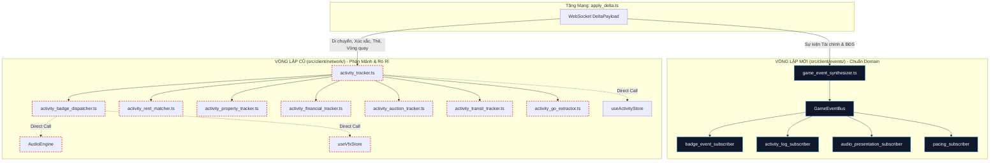
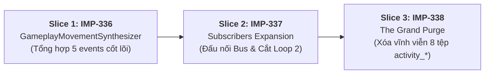

# 🏛️ BÁO CÁO THẨM ĐỊNH KIẾN TRÚC CHI TIẾT: ỨNG VIÊN #1
## DỌN SẠCH 8 TỆP `activity_*` KHỎI TẦNG MẠNG & THỐNG NHẤT 100% VÀO `GameEventBus`

> **Mã Đề Xuất:** `ARCH-CANDIDATE-01`  
> **Phân hệ mục tiêu:** `client-network` & `client-events`  
> **Tiêu chuẩn áp dụng:** `AGENTS CONSTITUTION` (Hiến pháp Dự án), `Codebase-Design` (Deep Modules), The Deletion Test  
> **Mục tiêu cốt lõi:** Xóa bỏ trạng thái "Hệ thống sự kiện kép" (*Split-Brain Pipeline*), cắt giảm ròng **~1.500 dòng mã** nợ kỹ thuật, trả lại sự tinh khiết 100% cho tầng `src/client/network/`.  
> **Lộ trình Auto-Slicing:** 3 Micro-Slices tuần tự (`IMP-336` $\rightarrow$ `IMP-337` $\rightarrow$ `IMP-338`).

---

## 1. TỔNG QUAN HIỆN TRẠNG & BẢN CHẤT ĐIỂM NGHẼN (*SPLIT-BRAIN PIPELINE*)

Sau khi hoàn thành chuỗi cải tiến từ `IMP-330` đến `IMP-334`, dự án đã thành công xây dựng hạ tầng sự kiện hướng domain tại `src/client/events/` với `GameEventBus` và 4 Subscribers độc lập. Tuy nhiên, việc chuyển đổi mới chỉ hoàn tất cho 2 nhóm sự kiện: **Tài chính** (Tiền thuê, Thuế, Lương GO) và **Bất động sản / Thị trường** (Mua bán, Thế chấp, Đấu giá, Trái phiếu).

Hiện tại, codebase đang chịu sự giằng xé của **2 vòng lặp xử lý sự kiện chạy song song** trên mỗi gói tin `DeltaPayload`:

### 3 Triệu chứng Rò rỉ Ranh giới Cần Loại Bỏ:
1. **Rò rỉ Tầng mạng (*Network Seam Leakage*):** `src/client/network/` bị phình to bởi 8 tệp `activity_*` (1.493 dòng mã), trực tiếp nhập `AudioEngine`, `useVfxStore`, `useActivityStore` và can thiệp vào hoạt cảnh rung lắc camera.
2. **Ký sinh ngược vào Store lõi (*Store Inversion Leak*):** Trong [`src/client/store/game_store.ts:13`](file:///c:/Users/HP/Documents/GitHub/vtcoon/src/client/store/game_store.ts#L13), Zustand store buộc phải `import { clearPendingBadgeTimers } from '../network/activity_badge_dispatcher.js'` để dọn dẹp timer badge hiển thị khi reset game.
3. **Cờ ngắt chắp vá (*Suppression Flag*):** Trong [`apply_delta.ts:159`](file:///c:/Users/HP/Documents/GitHub/vtcoon/src/client/network/apply_delta.ts#L159), ta buộc phải truyền cờ `{ suppressFinancialAndProperty: true }` vào `trackDeltaActivities(...)` nhằm ngăn chặn Loop 2 sinh trùng lặp log với Loop 1.

---

## 2. PHÉP THỬ XÓA BỎ & DANH SÁCH 8 TỆP NGHỈ HƯU (*THE DELETION TEST*)

Khi toàn bộ các sự kiện được tổng hợp qua `GameEventBus`, **toàn bộ 8 tệp sau trong `src/client/network/` sẽ bị xóa sổ hoàn toàn**:

| Tệp Cần Xóa | LOC Hiện Tại | Chức Năng Cũ | Chức Năng Thay Thế Chuẩn Tương Ứng |
| :--- | :---: | :--- | :--- |
| [`activity_tracker.ts`](file:///c:/Users/HP/Documents/GitHub/vtcoon/src/client/network/activity_tracker.ts) | **251** | Façade trích xuất log và badge cũ | `game_event_synthesizer.ts` |
| [`activity_badge_dispatcher.ts`](file:///c:/Users/HP/Documents/GitHub/vtcoon/src/client/network/activity_badge_dispatcher.ts) | **170** | Tạo FloatingText và hẹn giờ badge cũ | `badge_event_subscriber.ts` |
| [`activity_rent_matcher.ts`](file:///c:/Users/HP/Documents/GitHub/vtcoon/src/client/network/activity_rent_matcher.ts) | **243** | Đối soát giao dịch tiền thuê | `game_event_financial_synthesizer.ts` |
| [`activity_go_extractor.ts`](file:///c:/Users/HP/Documents/GitHub/vtcoon/src/client/network/activity_go_extractor.ts) | **170** | Tách lương GO và thuế | `game_event_financial_helpers.ts` |
| [`activity_property_tracker.ts`](file:///c:/Users/HP/Documents/GitHub/vtcoon/src/client/network/activity_property_tracker.ts) | **299** | Nhận diện mua bán, nâng cấp BĐS | `game_event_property_synthesizer.ts` |
| [`activity_financial_tracker.ts`](file:///c:/Users/HP/Documents/GitHub/vtcoon/src/client/network/activity_financial_tracker.ts) | **211** | Nhận diện phạt thẻ và sàn HOSE | `game_event_financial_synthesizer.ts` |
| [`activity_auction_tracker.ts`](file:///c:/Users/HP/Documents/GitHub/vtcoon/src/client/network/activity_auction_tracker.ts) | **93** | Nhận diện thắng đấu giá | `game_event_property_auction_synthesizer.ts` |
| [`activity_transit_tracker.ts`](file:///c:/Users/HP/Documents/GitHub/vtcoon/src/client/network/activity_transit_tracker.ts) | **56** | Nhận diện quay Vòng quay bến xe | `game_event_movement_synthesizer.ts` |
| **TỔNG CỘNG CẮT GIẢM** | **1.493 LOC** | **Cắt giảm ròng ~1.500 dòng mã nợ kỹ thuật khỏi phân hệ client-network** |

---

## 3. CHI TIẾT THIẾT KẾ 3 MICRO-SLICES TUẦN TỰ

Để đảm bảo không gây gián đoạn luồng chơi và tuân thủ giới hạn ngân sách dòng lệnh (Tier 1 $\le 400$ LOC, Living Test $\le 600$ LOC), kế hoạch được chia thành 3 bước nhỏ cô lập:

---

### 🔹 SLICE 1 (TICKET `IMP-336`): `GameplayMovementNarrativeSynthesizer`
* **Mục tiêu:** Bổ sung module tổng hợp thuần túy (pure domain synthesizer) cho 5 loại sự kiện còn thiếu.
* **Phân hệ:** `client-events` (Tier 1 Logic $\le 400$ LOC).
* **Danh sách file thay đổi:**
  1. [`src/client/events/game_event_types.ts`](file:///c:/Users/HP/Documents/GitHub/vtcoon/src/client/events/game_event_types.ts) (Bổ sung 5 Enum & Event interfaces):
     - `DICE_ROLLED` (`playerId, d1, d2, total, isDouble, diceSeq`)
     - `PLAYER_MOVED` (`playerId, fromPosition, toPosition, cellIndex`)
     - `EVENT_CARD_DRAWN` (`playerId, cardId, cardType, title, effectDelta, destination`)
     - `PLAYER_JAILED` / `PLAYER_UNJAILED` (`playerId, reason`)
     - `TRANSIT_WHEEL_SPUN` (`playerId, outcome, steps, description`)
  2. `src/client/events/game_event_movement_synthesizer.ts` (**Tệp mới, ~130 LOC**):
     - Trích xuất di chuyển quân cờ, xúc xắc, thẻ cơ hội, vào tù, vòng quay từ `(prevState, nextState, delta)`.
     - 100% pure function, không side-effect, không phụ thuộc Zustand hay DOM.
  3. [`src/client/events/game_event_synthesizer.ts`](file:///c:/Users/HP/Documents/GitHub/vtcoon/src/client/events/game_event_synthesizer.ts):
     - Hợp nhất: `[...movementEvents, ...financialEvents, ...propertyEvents]`.
  4. `tests/client/imp336_game_event_movement_synthesizer.test.ts` (**Tệp mới, ~320 LOC**):
     - Kiểm thử hợp đồng tất định cho cả 5 loại sự kiện mới.
* **Ngân sách dòng lệnh:**
  - `game_event_movement_synthesizer.ts`: ~130 LOC ($\le 400$ LOC).
  - Living test: ~320 LOC ($\le 600$ LOC).

---

### 🔹 SLICE 2 (TICKET `IMP-337`): `Presentation Subscribers Expansion & Delta Decoupling`
* **Mục tiêu:** Cập nhật các Subscribers tiếp nhận 5 sự kiện mới và **ngắt hoàn toàn Loop 2 cũ** trong `apply_delta.ts`.
* **Phân hệ:** `client-events` & `client-network`.
* **Danh sách file thay đổi:**
  1. [`src/client/events/subscribers/activity_log_subscriber.ts`](file:///c:/Users/HP/Documents/GitHub/vtcoon/src/client/events/subscribers/activity_log_subscriber.ts) (~40 LOC chỉnh sửa):
     - Thêm mapper ghi log cho `DICE_ROLLED` (hiển thị điểm số + cờ đổ đôi 🎉), `PLAYER_MOVED` (đến ô đất), `EVENT_CARD_DRAWN`, `TRANSIT_WHEEL_SPUN`.
  2. [`src/client/events/subscribers/badge_event_subscriber.ts`](file:///c:/Users/HP/Documents/GitHub/vtcoon/src/client/events/subscribers/badge_event_subscriber.ts) (~25 LOC chỉnh sửa):
     - Thêm Floating Text và hiệu ứng nhún nhảy quân cờ khi rút thẻ cơ hội hoặc quay vòng quay bến xe.
  3. [`src/client/events/subscribers/audio_presentation_subscriber.ts`](file:///c:/Users/HP/Documents/GitHub/vtcoon/src/client/events/subscribers/audio_presentation_subscriber.ts) (~15 LOC chỉnh sửa):
     - Kích hoạt âm thanh rút thẻ (`CARD_DRAW`) và đổ xúc xắc (`DICE_ROLL`) qua `GameEventBus`.
  4. [`src/client/network/apply_delta.ts`](file:///c:/Users/HP/Documents/GitHub/vtcoon/src/client/network/apply_delta.ts) (-15 LOC):
     - **Xóa bỏ lời gọi `trackDeltaActivities(...)`** và cờ `{ suppressFinancialAndProperty: true }`.
     - Toàn bộ sự kiện trong trận đấu giờ đây được phát 100% qua `dispatchGameEvents()`.
  5. `tests/client/imp337_subscribers_unification.test.ts` (**Tệp mới, ~300 LOC**):
     - Kiểm thử E2E: Từ `DeltaPayload` mạng $\rightarrow$ sinh ra đúng số lượng Activity Log, Badge, và Âm thanh SFX tương ứng.

---

### 🔹 SLICE 3 (TICKET `IMP-338`): `Legacy Activity Retirement & The Grand Network Purge`
* **Mục tiêu:** Xóa bỏ 8 tệp `activity_*`, dọn dẹp các điểm rò rỉ tại `game_store.ts` và `client_session_purger.ts`.
* **Phân hệ:** `client-network` (Dọn dẹp triệt để).
* **Danh sách file thay đổi:**
  1. [`src/client/store/game_store.ts`](file:///c:/Users/HP/Documents/GitHub/vtcoon/src/client/store/game_store.ts):
     - Xóa dòng nhập rò rỉ: `import { clearPendingBadgeTimers } from '../network/activity_badge_dispatcher.js'`.
     - Sử dụng trực tiếp `clearPendingPacingTimers()` từ `pacing_context.ts`.
  2. [`src/client/network/client_session_purger.ts`](file:///c:/Users/HP/Documents/GitHub/vtcoon/src/client/network/client_session_purger.ts):
     - Xóa các hàm reset cũ (`resetEventCardActivityTracker`, `resetAuctionActivityTracker`, `clearPendingBadgeTimers`).
  3. [`src/client/ui/transaction_narrative.ts`](file:///c:/Users/HP/Documents/GitHub/vtcoon/src/client/ui/transaction_narrative.ts):
     - Đổi nguồn import `getCellName` từ `activity_property_tracker.js` sang `../../domain/board_config.js`.
  4. `src/client/events/legacy_event_compat.ts` (**Tệp mới, ~60 LOC**):
     - Re-export các helper cũ (`processPayerFee`, `detectCellTrade`, `detectFinancialAndStatusActivities`) ánh xạ sang các hàm domain mới để **bảo vệ 100% các Living Contract Tests cũ** (`imp219`, `imp234`, `imp287`...) không bị lỗi import.
  5. **THỰC HIỆN XÓA ĐĨA VẬT LÝ:**
     - Xóa hoàn toàn 8 tệp `activity_*.ts` trong `src/client/network/`.
  6. `tests/client/imp338_network_pure_transport_regression.test.ts` (**Tệp mới, ~250 LOC**):
     - Chạy regression toàn bộ 200+ test client và 180+ test contracts để chứng minh zero-regression.

---

## 4. MA TRẬN DỰ TOÁN BIẾN ĐỘNG DÒNG MÃ (LOC DELTA ACCOUNTING)

| Lát Cắt (Slice) | Tệp Tạo Mới / Chỉnh Sửa | Tệp Bị Xóa Bỏ | LOC Thêm | LOC Giảm | Delta Ròng |
| :--- | :--- | :--- | :---: | :---: | :---: |
| **Slice 1 (IMP-336)** | `game_event_movement_synthesizer.ts` `game_event_types.ts` | Không có | +160 | 0 | **+160 LOC** |
| **Slice 2 (IMP-337)** | `activity_log_subscriber.ts` `badge_event_subscriber.ts` `apply_delta.ts` | Không có | +80 | -25 | **+55 LOC** |
| **Slice 3 (IMP-338)** | `legacy_event_compat.ts` `game_store.ts`, `client_session_purger.ts` | **8 tệp `activity_*.ts`** | +60 | **-1.493** | **-1.433 LOC** 💥 |
| **TỔNG KẾT TOÀN BỘ** | **Tạo 2 tệp sạch, chỉnh sửa 5 tệp** | **Xóa sổ 8 tệp rác** | **+300** | **-1.518** | **-1.218 LOC ròng** |

---

## 5. KẾT LUẬN & ĐÁNH GIÁ ĐỘ AN TOÀN

1. **Về mặt Kiến trúc:** Ứng viên #1 giải quyết triệt để vấn đề "Nợ kỹ thuật sau cải tiến". Tầng mạng sẽ trở nên trong sạch tuyệt đối, chỉ nhận và giải nén dữ liệu.
2. **Về mặt Vận hành:** Toàn bộ âm thanh, badge, và nhật ký hoạt động đều đi qua một cơ chế điều phối thời gian thống nhất (`PacingContext`), chấm dứt hiện tượng chữ đè chữ hoặc badge hiện trước khi xúc xắc kịp dừng.
3. **Về mặt Rủi ro:** Rất thấp (🟢 Low Risk) vì toàn bộ logic trích xuất sự kiện là các hàm thuần túy (`in-process pure functions`), không làm thay đổi state machine hay logic mạng WebSocket.
