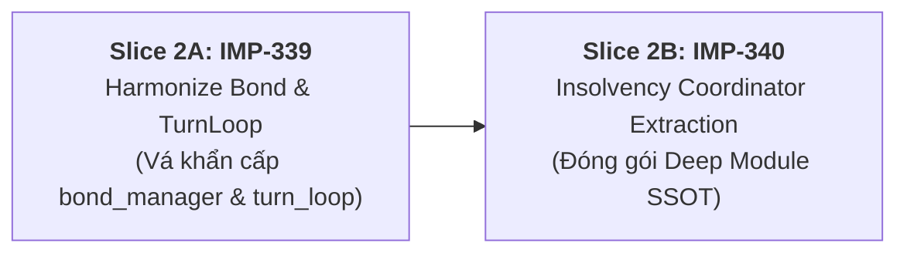

# 🏛️ BÁO CÁO THẨM ĐỊNH KIẾN TRÚC CHI TIẾT: ỨNG VIÊN #2
## `InsolvencyLifecycleCoordinator`: THỐNG NHẤT FSM CÔNG NỢ & BẢO TOÀN TÍNH ĐỐI XỨNG

> **Mã Đề Xuất:** `ARCH-CANDIDATE-02`  
> **Phân hệ mục tiêu:** `server-domain` & `server-network`  
> **Tiêu chuẩn áp dụng:** `AGENTS CONSTITUTION` (Symmetric State Exit Invariant), `Codebase-Design` (Deep Modules), Adversarial Challenge  
> **Mục tiêu cốt lõi:** Khắc phục 3 lỗ hổng rò rỉ FSM công nợ, bảo toàn tính đối xứng tuyệt đối khi thoát pha `InsolvencyPhase`, loại bỏ nguy cơ treo bàn cờ đối với con nợ ngoài lượt (*off-turn debtor*).  
> **Lộ trình Auto-Slicing:** 2 Micro-Slices tuần tự (`IMP-339` $\rightarrow$ `IMP-340`).

---

## 1. TỔNG QUAN HIỆN TRẠNG & BẢN CHẤT LỖ HỔNG FSM CÔNG NỢ

Trong kiến trúc Server của `vtcoon`, khi số dư của một người chơi rơi vào mức âm ($balance < 0$), hệ thống chuyển trạng thái phòng chơi sang `TurnPhase.InsolvencyPhase` nhằm phong tỏa các hành vi bình thường và yêu cầu người chơi giải quyết thâm hụt tài chính.

Tuy nhiên, khảo sát đĩa vật lý phát hiện FSM công nợ hiện đang bị phân mảnh trên **5 tệp độc lập**, dẫn đến vi phạm nghiêm trọng **Thiết quân luật số 2 trong Hiến pháp (Symmetric State Exit Invariant)**:

```mermaid
flowchart TD
  subgraph Before ["HIỆN TRẠNG (FSM Exit Rải Rác 5 Nơi - Nguy Cơ Lệch Pha & Treo Bàn)"]
    direction TB
    ID["intent_dispatcher.ts"]
    ID -->|INTENT_DOWNGRADE| RPC["room_property_coordinator.ts"]
    ID -->|INTENT_MORTGAGE| MM["mortgage_manager.ts"]
    ID -->|INTENT_ISSUE_BOND| BM["bond_manager.ts 🚨<br/>(Tự gán PropertyManagement, bỏ qua restore!)"]
    ID -->|INTENT_AUTO_SOLVENCY| AFK["afk_recovery.ts"]
    ID -->|INTENT_BANKRUPTCY| IM["insolvency_manager.ts"]
    
    RPC -.restorePostInsolvencyPhase.-> FSM["TurnPhase"]
    MM -.restorePostInsolvencyPhase.-> FSM
    BM -.Gán Cứng room.phase.-> FSM
    AFK -.restorePostInsolvencyPhase.-> FSM
    IM -.restorePostInsolvencyPhase.-> FSM
  end

  subgraph After ["ĐỀ XUẤT (InsolvencyLifecycleCoordinator - Deep Module SSOT)"]
    direction TB
    ID2["intent_dispatcher.ts"]
    ID2 -->|Mọi Intent Giải Cứu / Phá Sản| ILC["<b>InsolvencyLifecycleCoordinator</b><br/>(Bộ Điều Phối Công Nợ Độc Quyền)"]
    
    subgraph CoreEngine ["Nội Bộ Coordinator (Ẩn Sau Seam)"]
      ILC -.-> Act1["Hạ cấp BĐS (Downgrade)"]
      ILC -.-> Act2["Thế chấp đất (Mortgage)"]
      ILC -.-> Act3["Vay trái phiếu (Issue Bond)"]
      ILC -.-> Act4["Gỡ nợ tự động (Auto Solvency)"]
      ILC -.-> Act5["Tuyên bố phá sản (Bankruptcy)"]
      
      Act1 & Act2 & Act3 & Act4 & Act5 --> Harmonizer["<b>exitInsolvencySymmetrically()</b><br/>(Cổng Thoát Pha Đối Xứng Duy Nhất)"]
    end
    
    Harmonizer --> SafeFSM["Bảo toàn 100% Invariants<br/>(Dọn Queue, Trả đúng PrePhase, Xóa DebtorId)"]
  end

  classDef leak stroke:#dc2626,stroke-width:2px,stroke-dasharray: 4 4;
  class BM,RPC,MM,AFK,IM leak;
  classDef deep fill:#0f172a,stroke:#38bdf8,color:#ffffff;
  class ILC,Harmonizer deep;
```

---

## 2. BẰNG CHỨNG VẬT LÝ VỀ 3 LỖ HỔNG ĐANG CHẠY TRÊN PRODUCTION

### 🔴 Lỗ hổng 1: `bond_manager.ts` treo vĩnh viễn con nợ ngoài lượt (*Off-Turn Debtor Deadlock*)
* **Vị trí mã nguồn:** [`src/server/bond_manager.ts:130-136`](file:///c:/Users/HP/Documents/GitHub/vtcoon/src/server/bond_manager.ts#L130-L136)
```typescript
  if (
    room.phase === TurnPhase.InsolvencyPhase &&
    room.players[room.currentPlayerIndex]?.id === player.id &&
    player.balance >= 0
  ) {
    room.phase = TurnPhase.PropertyManagement;
  }
```
* **Cơ chế lỗi:** 
  1. Nếu một người chơi bị âm tiền **ngoài lượt** (ví dụ: bị thu phí bảo trì khi đi qua ô của người khác, hoặc bị phạt thẻ sự kiện) và người đó phát hành trái phiếu để tự giải cứu $\rightarrow$ điều kiện `room.players[room.currentPlayerIndex]?.id === player.id` bị **sai** (vì họ không phải là người đang có lượt gieo xúc xắc).
  2. Kết quả: **`room.phase` không bao giờ được phục hồi**, cả phòng chơi bị kẹt vĩnh viễn trong `TurnPhase.InsolvencyPhase`!
  3. Thậm chí nếu là người trong lượt, `bond_manager.ts` cũng **quên xóa** `pendingInsolvencyDebtorId`, không dọn `pendingInsolvencyCreditorId`, và bỏ qua hoàn toàn hàng đợi con nợ `pendingInsolvencyQueue`.

---

### 🔴 Lỗ hổng 2: Xóa sổ `preInsolvencyPhase` tại `turn_loop.ts`
* **Vị trí mã nguồn:** [`src/server/turn_loop.ts:238`](file:///c:/Users/HP/Documents/GitHub/vtcoon/src/server/turn_loop.ts#L238) và [`turn_loop.ts:278`](file:///c:/Users/HP/Documents/GitHub/vtcoon/src/server/turn_loop.ts#L278)
```typescript
  if ((nextPlayer?.balance ?? 0) < 0) {
    room.phase = TurnPhase.InsolvencyPhase;
    checkInsolvency(room);
  }
```
* **Cơ chế lỗi:** 
  1. Trong [`insolvency_manager.ts:28-30`](file:///c:/Users/HP/Documents/GitHub/vtcoon/src/server/insolvency_manager.ts#L28-L30), hệ thống chỉ lưu lại pha trước đó nếu:
     `if (room.phase !== TurnPhase.InsolvencyPhase) { room.preInsolvencyPhase = room.phase; }`
  2. Do `turn_loop.ts` đã gán cứng `room.phase = TurnPhase.InsolvencyPhase` **trước khi** gọi `checkInsolvency`, câu lệnh `if` trên luôn bị đánh giá là `false`.
  3. Kết quả: `room.preInsolvencyPhase` trở thành `undefined`. Khi người chơi thoát nợ, FSM không biết phải trả về đâu và ép người chơi về `PropertyManagement` thay vì trả về `WaitingRoll`.

---

### 🔴 Lỗ hổng 3: Sự phân mảnh của các điểm gọi FSM Exit
* Hiện tại, mỗi khi có một thay đổi về luật thoát nợ, lập trình viên phải sửa tay đồng thời ở 5 tệp:
  - [`mortgage_manager.ts:162`](file:///c:/Users/HP/Documents/GitHub/vtcoon/src/server/mortgage_manager.ts#L162)
  - [`room_property_coordinator.ts:91`](file:///c:/Users/HP/Documents/GitHub/vtcoon/src/server/room_property_coordinator.ts#L91)
  - [`insolvency_manager.ts:116`](file:///c:/Users/HP/Documents/GitHub/vtcoon/src/server/insolvency_manager.ts#L116)
  - [`insolvency_manager.ts:280`](file:///c:/Users/HP/Documents/GitHub/vtcoon/src/server/insolvency_manager.ts#L280)
  - [`bond_manager.ts:135`](file:///c:/Users/HP/Documents/GitHub/vtcoon/src/server/bond_manager.ts#L135)
* Đây là nguồn gốc của các lỗi hồi quy lặp đi lặp lại đã được ghi nhận trong các bản Retro (`IMP-318`, `IMP-320`, `IMP-327`).

---

## 3. THIẾT KẾ KIẾN TRÚC: `InsolvencyLifecycleCoordinator` (DEEP MODULE SSOT)

Áp dụng nguyên lý Deep Modules: Caller (`intent_dispatcher.ts`, `turn_loop.ts`, `room_manager.ts`) chỉ cần gọi qua một giao diện cô đọng, toàn bộ tính phức tạp về kiểm tra quyền, trừ tiền, thế chấp, giải phóng hàng đợi con nợ và chuyển pha FSM được đóng gói an toàn bên trong:

```typescript
export interface InsolvencyLifecycleCoordinator {
  /** 1. Kích hoạt vào pha vỡ nợ một cách an toàn (bảo toàn 100% preInsolvencyPhase) */
  enterInsolvency(room: Room, debtorId: string, deficit: number, creditorId?: string): void;

  /** 2. Kiểm tra thẩm quyền thao tác của con nợ trong pha vỡ nợ */
  isDebtorAuthorized(room: Room, playerId: string): boolean;

  /** 3. Các hành động xử lý thâm hụt tài chính (Tự động đối soát phục hồi pha) */
  resolveDowngrade(ctx: RoomContext, playerId: string, cellIndex: number, options?: DowngradeOptions): ActionResult;
  resolveMortgage(ctx: RoomContext, playerId: string, cellIndex: number): ActionResult;
  resolveIssueBond(room: Room, playerId: string, trancheId?: BondTrancheId): ActionResult;
  resolveAutoSolvency(room: Room, playerId: string, auctions: Map<string, AuctionSession>, roomCode: string): ActionResult;
  resolveBankruptcy(ctx: RoomContext, playerId: string, creditorId?: string, auctions?: Map<string, AuctionSession>, roomCode?: string): BankruptcyResult;

  /** 4. Điểm thoát pha FSM đối xứng duy nhất (SSOT Exit Gate) */
  exitInsolvencySymmetrically(room: Room, playerId: string, rng?: () => number): void;
}
```

---

## 4. CHI TIẾT THIẾT KẾ 2 MICRO-SLICES TUẦN TỰ

Kế hoạch được chia thành 2 lát cắt: **Vá khẩn cấp tính đối xứng** trước, sau đó **Hợp nhất thành Deep Coordinator**.



---

### 🔹 SLICE 2A (TICKET `IMP-339`): `Harmonize Bond & TurnLoop Insolvency Exit`
* **Mục tiêu:** Vá ngay lập tức 2 lỗ hổng nguy hiểm nhất làm kẹt con nợ ngoài lượt và làm mất `preInsolvencyPhase`.
* **Phân hệ:** `server-domain` (Tier 1 $\le 400$ LOC).
* **Danh sách file thay đổi:**
  1. [`src/server/bond_manager.ts`](file:///c:/Users/HP/Documents/GitHub/vtcoon/src/server/bond_manager.ts) (~15 LOC chỉnh sửa):
     - Thay thế đoạn gán cứng `room.phase = TurnPhase.PropertyManagement` bằng lời gọi chuẩn:
       ```typescript
       if (room.phase === TurnPhase.InsolvencyPhase && player.balance >= 0) {
         restorePostInsolvencyPhase(room, player.id);
       }
       ```
  2. [`src/server/turn_loop.ts`](file:///c:/Users/HP/Documents/GitHub/vtcoon/src/server/turn_loop.ts) (~20 LOC chỉnh sửa):
     - Xóa bỏ việc tự gán `room.phase = TurnPhase.InsolvencyPhase` tại dòng 238 và 278.
     - Truyền đúng tham số vào `checkInsolvency(room, nextPlayer, Math.abs(nextPlayer.balance))` để `checkInsolvency` tự động lưu giữ `room.preInsolvencyPhase = TurnPhase.WaitingRoll`.
  3. `tests/server/imp339_bond_and_turn_loop_insolvency_restoration.test.ts` (**Tệp mới, ~280 LOC**):
     - **TC-339.01:** Con nợ ngoài lượt (*off-turn debtor*) phát hành trái phiếu đưa số dư $\ge 0 \rightarrow$ Phục hồi chính xác về lượt chơi và pha ban đầu của phòng.
     - **TC-339.02:** Con nợ trong lượt khi chuyển qua vòng mới bị âm tiền $\rightarrow$ `checkInsolvency` bảo toàn `preInsolvencyPhase = WaitingRoll`.
     - **TC-339.03:** Con nợ thứ nhất phát hành trái phiếu $\rightarrow$ hàng đợi `pendingInsolvencyQueue` tự động chuyển tiếp sang con nợ thứ hai.
* **Ngân sách dòng lệnh:** Sửa ~35 LOC trên 2 tệp server hiện có. Test: ~280 LOC ($\le 600$ LOC).

---

### 🔹 SLICE 2B (TICKET `IMP-340`): `InsolvencyLifecycleCoordinator Deep Module Extraction`
* **Mục tiêu:** Đóng gói toàn bộ logic công nợ, thẩm quyền thao tác và thoát pha vào một Coordinator duy nhất.
* **Phân hệ:** `server-domain` & `server-network`.
* **Danh sách file thay đổi:**
  1. `src/server/insolvency_lifecycle_coordinator.ts` (**Tệp mới, ~170 LOC**):
     - Hiện thực interface `InsolvencyLifecycleCoordinator`.
     - Chứa hàm SSOT `exitInsolvencySymmetrically(room, playerId)` tập trung dọn dẹp `pendingInsolvencyDebtorId`, `pendingInsolvencyCreditorId`, và chuyển tiếp `pendingInsolvencyQueue`.
  2. [`src/server/intent_dispatcher.ts`](file:///c:/Users/HP/Documents/GitHub/vtcoon/src/server/intent_dispatcher.ts) (-40 LOC):
     - Rút gọn toàn bộ khối kiểm tra thẩm quyền con nợ phức tạp tại dòng 88-90, 149-155, 183-198 sang gọi một phương thức duy nhất: `coordinator.isDebtorAuthorized(room, playerId)`.
  3. [`src/server/room_property_coordinator.ts`](file:///c:/Users/HP/Documents/GitHub/vtcoon/src/server/room_property_coordinator.ts) (-30 LOC):
     - Ủy thác các hàm `coordDowngrade`, `coordMortgage`, `coordBankruptcy` qua Coordinator.
  4. `tests/server/imp340_insolvency_lifecycle_coordinator.test.ts` (**Tệp mới, ~350 LOC**):
     - Kiểm thử tính đóng gói và toàn vẹn của Coordinator: 5 nhánh cứu nguy/phá sản đều đi qua cùng một cổng đối soát đối xứng.
* **Ngân sách dòng lệnh:** Tệp mới ~170 LOC ($\le 400$ LOC Tier 1). Test: ~350 LOC ($\le 600$ LOC).

---

## 5. MA TRẬN DỰ TOÁN BIẾN ĐỘNG DÒNG MÃ (LOC DELTA ACCOUNTING)

| Lát Cắt (Slice) | Tệp Tạo Mới / Chỉnh Sửa | Baseline LOC | Target LOC | Delta | Ranh Giới Trần | Trạng Thái |
| :--- | :--- | :---: | :---: | :---: | :---: | :--- |
| **Slice 2A (IMP-339)** | `src/server/bond_manager.ts`<br>`src/server/turn_loop.ts`<br>`imp339_...test.ts` | 244<br>289<br>0 | 249<br>294<br>280 | +5<br>+5<br>+280 | $\le 400$<br>$\le 400$<br>$\le 600$ | 🛡️ Sửa lỗi khẩn cấp |
| **Slice 2B (IMP-340)** | `src/server/insolvency_lifecycle_coordinator.ts`<br>`src/server/intent_dispatcher.ts`<br>`src/server/room_property_coordinator.ts`<br>`imp340_...test.ts` | 0<br>322<br>178<br>0 | 170<br>280<br>148<br>350 | +170<br>-42<br>-30<br>+350 | $\le 400$<br>$\le 400$<br>$\le 400$<br>$\le 600$ | 🆕 Deep Module SSOT |
| **TỔNG KẾT** | **Tạo 1 tệp mới, chỉnh sửa 4 tệp** | **1.033** | **1.141** | **+108 LOC ròng** | **Toàn bộ $\le 400$ LOC** | ✅ Hoàn toàn đạt chuẩn |

---

## 6. KẾT LUẬN & ĐÁNH GIÁ CHẤT LƯỢNG

1. **Tính Cấp Thiết:** Lỗ hổng tại `bond_manager.ts` là một **lỗi logic nghiêm trọng (Game-Breaking Bug)** có thể gây treo toàn bộ trận đấu khi có con nợ ngoài lượt phát hành trái phiếu. Cần được ưu tiên khắc phục ngay.
2. **Tuân thủ Hiến pháp:** Giải quyết triệt để quy tắc *Symmetric State Exit Invariant*. 100% các hành vi cứu nợ và phá sản quy về một mối kiểm soát duy nhất.
3. **An toàn Hồi quy:** Bằng việc chia làm 2 lát cắt (`IMP-339` vá trước, `IMP-340` bóc tách sau), chúng ta đảm bảo không bao giờ tạo ra một PR quá lớn gây rủi ro cho server.
