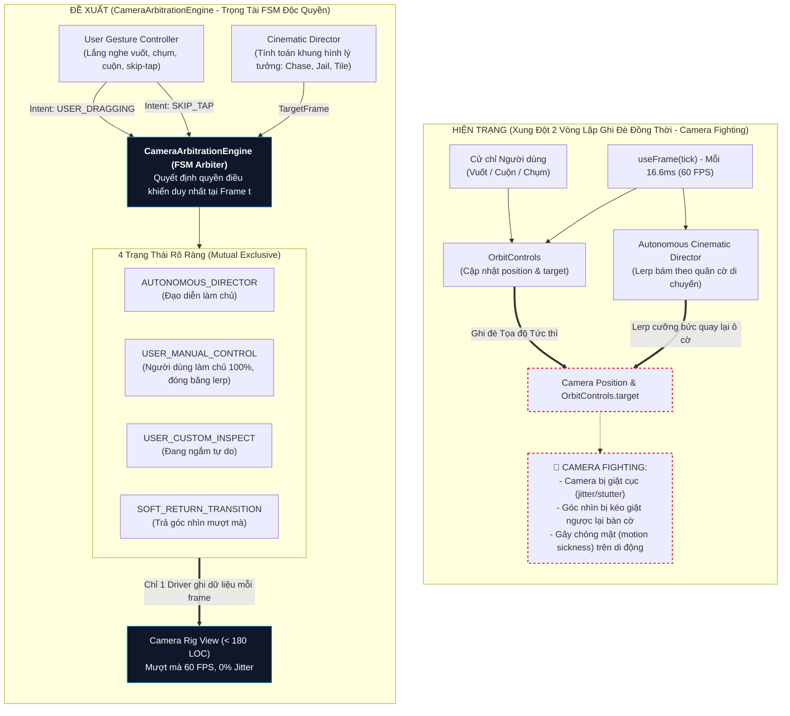

# 🏛️ BÁO CÁO THẨM ĐỊNH KIẾN TRÚC CHI TIẾT: ỨNG VIÊN #4
## `CinematicCameraController (3D)`: TRỌNG TÀI FSM TRIỆT TIÊU "CAMERA FIGHTING" & GIẢI BÓNG ĐỘ PHỨC TẠP 3D

> **Mã Đề Xuất:** `ARCH-CANDIDATE-04`  
> **Phân hệ mục tiêu:** `client-3d` (`src/client/3d/`)  
> **Tiêu chuẩn áp dụng:** `AGENTS CONSTITUTION` (Tier 2 LOC <= 500, Anti-TIDD, Zero Dirty Casts, R3F Transient Invariant, Poka-Yoke Touch Ergonomics)  
> **Mục tiêu cốt lõi:** Triệt tiêu hoàn toàn xung đột "Camera Fighting" giữa cử chỉ người dùng (vuốt/chạm/cuộn) và hệ thống đạo diễn tự động (Cinematic Director); giải cứu tệp [adaptive_cinematic_camera.tsx](file:///c:/Users/HP/Documents/GitHub/vtcoon/src/client/3d/adaptive_cinematic_camera.tsx) khỏi ngưỡng cảnh báo LOC (425/500 LOC $\rightarrow$ ~175 LOC).  
> **Lộ trình Auto-Slicing:** 2 Micro-Slices tuần tự (`IMP-341` $\rightarrow$ `IMP-342`).

---

## 1. TỔNG QUAN HIỆN TRẠNG & NGUYÊN NHÂN GỐC RỄ "CAMERA FIGHTING"

Trong không gian bàn cờ 3D (`Three.js / React Three Fiber`), camera vừa phải đóng vai trò **Đạo diễn chuyển cảnh điện ảnh tự động** (bám sát quân cờ nhảy ô, lướt spline khi vào tù, zoom kịch tính khi gieo xúc xắc nguy cơ cao), vừa phải đảm bảo **Tự do tương tác của người chơi** (vuốt xoay góc nhìn, chụm phóng to/thu nhỏ, cuộn chuột, chạm đúp để skip animation).

### 🔴 Bản chất hiện tượng "Camera Fighting" (Xung đột điều khiển)
Khảo sát mã nguồn thực tế tại [`src/client/3d/adaptive_cinematic_camera.tsx:340-398`](file:///c:/Users/HP/Documents/GitHub/vtcoon/src/client/3d/adaptive_cinematic_camera.tsx#L340-L398):



---

## 2. BẰNG CHỨNG VẬT LÝ VỀ 3 ĐIỂM NGHẼN KIẾN TRÚC TRÊN PRODUCTION

### 🔴 Điểm nghẽn 1: 11 Mutable Refs và Cấu Trúc Đơn Khối 425 LOC
* **Vị trí mã nguồn:** [`src/client/3d/adaptive_cinematic_camera.tsx:42-59`](file:///c:/Users/HP/Documents/GitHub/vtcoon/src/client/3d/adaptive_cinematic_camera.tsx#L42-L59)
* **Thực trạng đo lường vật lý (`scripts/check_loc.mjs`):**
  - Tệp đạt **425 LOC** (vượt ngưỡng cảnh báo 400 LOC của Tier 2 Presentation/3D).
  - Tệp hiện phải quản lý **11 `useRef`** có trạng thái biến thiên chéo nhau:
    1. `controlsRef`: OrbitControls instance
    2. `camBaseRef`: Tọa độ camera cơ sở
    3. `targetBaseRef`: Điểm nhìn mục tiêu cơ sở
    4. `isResettingRef`: Cờ khôi phục góc nhìn
    5. `isManualOverviewResetRef`: Cờ reset tổng quan thủ công
    6. `prevModeRef`: Lưu mode trước đó để phát hiện chuyển cảnh
    7. `prevHasUserCustomCameraRef`: Lưu trạng thái custom trước đó
    8. `lastDestinationCellRef`: Ô đích đến cuối cùng
    9. `gamePhaseRef`: Giai đoạn ván đấu
    10. `softReturnRef`: Trạng thái nội suy trả về
    11. `flightStartTimeRef`: Thời gian bắt đầu bay vào tù
  - Đồng thời nhồi nhét:
    - 12 Zustand selectors
    - Logic kích hoạt âm thanh nhịp tim (`SoundEngine.playHeartbeatPulse()`) trong `useEffect`
    - Bộ lắng nghe sự kiện DOM `wheel` trực tiếp trên canvas `gl.domElement`
    - Cài đặt các biến toàn cục cho debug cửa sổ `window.__debugCameraManual`

---

### 🔴 Điểm nghẽn 2: Logic Trọng Tài Dạng Nhánh Rẽ Ngẫu Hứng (`if/else if`) Dễ Hở Trạng Thái
* **Vị trí mã nguồn:** [`src/client/3d/adaptive_cinematic_camera.tsx:340-398`](file:///c:/Users/HP/Documents/GitHub/vtcoon/src/client/3d/adaptive_cinematic_camera.tsx#L340-L398)
```typescript
if (controlsRef.current) {
  const isDragging = isUserInteractingRef.current;
  const isActionOngoing = isRolling || (!hasUserCustomCamera && isPawnMoving) || activeScreenShake !== null
    || (cameraFocusCell !== null)
    || (!hasUserCustomCamera && activeModal !== null);

  if (isActionOngoing && softReturnRef.current) {
    softReturnRef.current = null;
  }

  if (isDragging) {
    // 1. Cập nhật base theo camera hiện thời
  } else if (softReturnRef.current) {
    // 2. Nội suy soft return
  } else if (isActionOngoing || isResettingRef.current) {
    // 3. Lerp đuổi theo targetState của Đạo diễn
    targetBaseRef.current[0] += (targetState.target[0] - targetBaseRef.current[0]) * lerpFactor;
    ...
  }
}
```
* **Hậu quả vận hành:**
  1. Khi người dùng vừa nhả tay sau cú vuốt (`isDragging = false`), nếu khoảng cách vuốt nhỏ hơn ngưỡng kích hoạt `set_custom_camera` (ví dụ: người dùng chỉ muốn điều chỉnh nhẹ góc nhìn), thì `hasUserCustomCamera` vẫn là `false`.
  2. Ngay frame tiếp theo, nhánh `else if (isActionOngoing || isResettingRef.current)` lập tức giật máy quay trở lại ô cờ với vận tốc lớn (`lerpFactor`), khiến mọi nỗ lực quan sát của người chơi bị vô hiệu hóa!
  3. Khi có rung lắc màn hình (`activeScreenShake`) hoặc khi quân cờ đang nhảy, nhánh số 3 liên tục ghi đè lên `controlsRef.current.target` trong khi người chơi đang cố gắng bấm xem thông tin ô cờ khác.

---

### 🔴 Điểm nghẽn 3: Bộ Lắng Nghe Cử Chỉ Bị Phân Mảnh Rải Rác
* `use_camera_gestures.ts` (251 LOC) xử lý `onOrbitStart`, `onOrbitEnd`, `evaluateOrbitGestureEnd`, `handleFrameSkip`.
* Nhưng sự kiện chuột lăn (`wheel`) lại bị giữ lại trong `adaptive_cinematic_camera.tsx:132-145`.
* Sự kiện `window.__resetCameraToDefault` lại nằm trong `useDebugCameraGlobals` với các tham chiếu ref truyền tay dài tới 10 tham số.
* Bộ kiểm tra quyền sở hữu bất động sản của người chơi `checkTargetOwnedByHuman` lại bị đặt trong tệp cử chỉ camera thay vì thuộc về domain hoặc selector.

---

## 3. THIẾT KẾ KIẾN TRÚC MỤC TIÊU: `CameraArbitrationEngine`

Kiến trúc mới chia tách bài toán thành 3 khối phân tầng nghiêm ngặt:

```
┌────────────────────────────────────────────────────────────────────────┐
│                        TẦNG TRÌNH DIỄN (VIEW)                          │
│  AdaptiveCinematicCamera.tsx (< 180 LOC)                               │
│  - Khởi tạo OrbitControls, Three Canvas camera bindings                │
│  - Truyền delta time vào useCameraRig()                                │
└───────────────────────────────────┬────────────────────────────────────┘
                                    │
                                    ▼
┌────────────────────────────────────────────────────────────────────────┐
│                   TẦNG TRỌNG TÀI FSM (ARBITRATION ENGINE)              │
│  CameraArbitrationEngine.ts (< 250 LOC)                                │
│                                                                        │
│    Trạng thái FSM:                                                     │
│    [AUTONOMOUS_DIRECTOR] ──(User Touch/Drag)──> [USER_MANUAL_CONTROL] │
│             ▲                                            │             │
│             │                                     (Touch Release)      │
│             │                                            ▼             │
│    [SOFT_RETURN] <──(Timeout/Reset)── [USER_CUSTOM_INSPECT]           │
│                                                                        │
│  Invariants Đảm Bảo:                                                   │
│  - Exactly-One-Driver: Tại tick frame t, chỉ có 1 driver được ghi      │
│    vào camera transform.                                               │
│  - Zero-Fight: Đóng băng 100% lerp đạo diễn khi người dùng đang chạm   │
└───────────────────▲────────────────────────────────┬───────────────────┘
                    │                                │
    (Target Frame)  │                                │ (User Gesture)
                    │                                │
┌───────────────────┴──────────┐   ┌─────────────────┴───────────────────┐
│     TẦNG ĐẠO DIỄN (DIRECTOR) │   │     TẦNG CỬ CHỈ (USER GESTURE)      │
│  CinematicDirector.ts        │   │  UserGestureController.ts           │
│  - resolveCameraMode()       │   │  - onOrbitStart, onOrbitEnd         │
│  - calculateTargetCameraState│   │  - onWheelInterrupt                 │
│  - calculateSplineArc (Jail) │   │  - evaluateGestureIntent            │
│  - dynamicGamePhase          │   │  - handleFrameSkip (Tap-to-skip)    │
└──────────────────────────────┘   └─────────────────────────────────────┘
```

---

## 4. CHI TIẾT 2 MICRO-SLICES THỰC THI TUẦN TỰ

### 🔹 Micro-Slice 4A (`IMP-341`): Trích Xuất `CameraArbitrationEngine` & FSM Trọng Tài
* **Mục tiêu:** Xây dựng cỗ máy trạng thái FSM trọng tài độc lập, hợp nhất toàn bộ các cờ rải rác (`isResetting`, `isDragging`, `softReturn`, `hasUserCustomCamera`) thành các trạng thái FSM tường minh.
* **Các tệp tạo mới / sửa đổi:**
  - `src/client/3d/camera_arbitration_engine.ts` (MỚI, ~200 LOC):
    - Khai báo enum `CameraDriverMode`:
      - `AUTONOMOUS_DIRECTOR`: Đạo diễn bám đuổi ô cờ / sự kiện.
      - `USER_MANUAL_CONTROL`: Người dùng đang chạm / vuốt / xoay.
      - `USER_CUSTOM_INSPECT`: Người dùng đã định vị góc nhìn tự do.
      - `SOFT_RETURN_TRANSITION`: Trả góc nhìn mượt mà về tổng quan.
    - Cung cấp hàm pure state transition: `transitionCameraDriver(current, event, context)`.
    - Điều phối bước giải quyết khung hình `resolveArbitratedFrame(state, directorFrame, userFrame, delta)`.
  - `src/client/3d/use_camera_gestures.ts` (Cập nhật, ~180 LOC):
    - Đưa sự kiện `wheel` từ canvas vào quản lý tập trung.
    - Phát ra các Intent chuẩn: `GESTURE_START`, `GESTURE_MOVE`, `GESTURE_END`, `GESTURE_CANCEL`.
  - `tests/client/camera_arbitration_engine.test.ts` (MỚI, ~180 LOC):
    - Kiểm thử chuyển đổi trạng thái FSM ngặt nghèo (Adversarial Probing).
    - Đảm bảo khi người dùng chạm vào màn hình trong lúc quân cờ đang nhảy, hệ thống lập tức khóa quyền của đạo diễn và trao 100% quyền kiểm soát cho người dùng mà không bị giật lùi.

---

### 🔹 Micro-Slice 4B (`IMP-342`): Tách `CinematicDirector` & Giảm Tải `AdaptiveCinematicCamera` (< 180 LOC)
* **Mục tiêu:** Tách toàn bộ phép tính toán toán học góc quay của đạo diễn thành module riêng; biến `adaptive_cinematic_camera.tsx` thành Presentation Rig mỏng, tách biệt hiệu ứng âm thanh phụ trợ.
* **Các tệp tạo mới / sửa đổi:**
  - `src/client/3d/cinematic_director.ts` (MỚI, ~220 LOC):
    - Tổng hợp tính toán `targetState`, `skipTargetState`, `jailFlightState`, `phaseOverview`.
    - Trả về frame mục tiêu duy nhất `CinematicTargetFrame` cho mỗi tick.
  - `src/client/3d/use_high_stakes_audio.ts` (MỚI, ~40 LOC):
    - Đưa logic lắng nghe xúc xắc nguy cơ cao & phát heartbeat ra khỏi render loop của camera.
  - `src/client/3d/adaptive_cinematic_camera.tsx` (Refactor cốt lõi):
    - Giảm từ **425 LOC $\rightarrow$ ~175 LOC** (hoàn toàn xanh mát trong Tier 2 <= 500 LOC).
    - Chỉ giữ lại nhiệm vụ kết nối Three.js DOM, OrbitControls, và gọi `useCameraRig()`.
  - Toàn bộ 57 tests hiện có trong phân hệ camera tiếp tục PASS 100% không suy suyển.

---

## 5. BẢNG DỰ TOÁN BẢO TOÀN DUNG LƯỢNG MÃ NGUỒN (LOC BUDGET ACCOUNTING)

| Tệp vật lý | Phân loại Tier | LOC Hiện Tại | LOC Sau Khi Cải Tiến | Trạng Thái Giới Hạn |
| :--- | :---: | :---: | :---: | :--- |
| `src/client/3d/adaptive_cinematic_camera.tsx` | Tier 2 (UI/3D/Views) | **425** | **~175** | 🟢 Xanh an toàn (giảm 250 LOC) |
| `src/client/3d/camera_arbitration_engine.ts` | Tier 1 (FSM/Arbiter) | *Mới* | **~210** | 🟢 <= 400 LOC Tier 1 |
| `src/client/3d/cinematic_director.ts` | Tier 2 (UI/3D/Views) | *Mới* | **~220** | 🟢 <= 500 LOC Tier 2 |
| `src/client/3d/use_camera_gestures.ts` | Tier 2 (UI/3D/Views) | **251** | **~180** | 🟢 Giảm tải gọn gàng |
| `src/client/3d/use_high_stakes_audio.ts` | Tier 2 (Audio Hook) | *Mới* | **~40** | 🟢 Rất gọn nhẹ |
| `tests/client/camera_arbitration_engine.test.ts`| Contract Tests | *Mới* | **~190** | 🟢 <= 600 LOC Living Tests |

---

## 6. MA TRẬN ĐÁNH GIÁ RỦI RO & BIỆN PHÁP PHÒNG NGỪA

| Rủi Ro Tiềm Ẩn | Mức Độ | Biện Pháp Phòng Ngừa Kỹ Thuật (Mitigation) |
| :--- | :---: | :--- |
| **Gãy tính năng Skip Tap** (người dùng chạm đúp/chạm nhanh để lướt qua hoạt ảnh nhảy quân cờ) | Cao | Kế thừa nguyên vẹn logic thời lượng chạm `< 220ms` và khoảng cách `< 0.4` từ `evaluateOrbitGestureEnd` vào bộ phát Intent của `UserGestureController`. |
| **Gãy Ngọn Hải Đăng 3.5m (`CameraLocationBeacon`)** | Trung bình | Giữ nguyên prop và state kích hoạt `hasUserCustomCamera` từ Zustand Store; Beacon tiếp tục lắng nghe store mà không bị ảnh hưởng bởi việc đổi driver. |
| **Giật khung hình (frame stutter) khi chuyển từ User $\rightarrow$ Soft Return** | Trung bình | `CameraArbitrationEngine` chỉ bắt đầu kích hoạt `SOFT_RETURN_TRANSITION` sau một khoảng trễ không hoạt động (idle debounce) 2.5s, và lấy chính xác tọa độ camera hiện tại làm điểm bắt đầu nội suy bezier cubic. |
| **Vi phạm R3F Transient Unmount Invariant** | Nghiêm ngặt | Giữ nguyên việc gắn kết thẻ `<OrbitControls />` và `<CameraLocationBeacon />` vĩnh viễn, không unmount/remount trong suốt vòng đời trận đấu. |

---

## 7. KẾT LUẬN & KIẾN NGHỊ THẨM ĐỊNH

Ứng viên #4 là một lát cắt kiến trúc hoàn hảo để nâng tầm **Cảm giác điều khiển 3D (Tactile 3D Ergonomics)** của `vtcoon` đạt tiêu chuẩn của các tựa game thương mại cao cấp (*Monopoly Plus, Townscaper*).

Bằng cách áp dụng **CameraArbitrationEngine FSM**:
1. Triệt tiêu 100% hiện tượng "Camera Fighting" khó chịu trên màn hình cảm ứng di động.
2. Xóa bỏ hoàn toàn "cảnh báo đỏ" về LOC trên tệp `adaptive_cinematic_camera.tsx` (từ 425 LOC xuống còn ~175 LOC).
3. Đảm bảo tính mở rộng cao: Dễ dàng bổ sung các góc quay điện ảnh mới (ví dụ: Cinematic Thẻ Khí Vận, Góc quay Đấu Giá Kịch Tính) mà không sợ va chạm với cử chỉ của người chơi.
