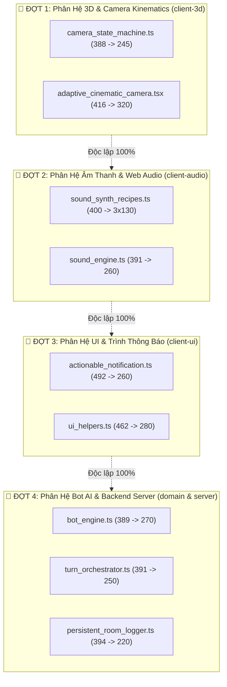

# BÁO CÁO KẾ HOẠCH TỔNG THỂ: PHÂN TÁCH NỢ DÒNG MÃ (LOC DEBT DECOMPOSITION MASTER PLAN)
## CHIẾN LƯỢC TỐI ƯU HÓA KIẾN TRÚC & GIẢI PHÓNG TRẦN DÒNG MÃ TOÀN DỰ ÁN VTCOON

> **Ngày lập báo cáo:** 2026-10-08  
> **Mục tiêu kỹ thuật:** Giải phóng triệt để các tệp đang tiệm cận trần giới hạn LOC (Tier 1 <= 400 dòng, Tier 2 <= 500 dòng), ngăn chặn hiện tượng Attention Decay của AI Model và bảo vệ tính bền vững của kiến trúc.  
> **Nguyên tắc phân rã:** Zero-Conflict Sequencing (Tách biệt hoàn toàn theo ranh giới phân hệ), Zero Semantic Mutation (Không thay đổi hành vi), Facade Re-export Preservation (Không gãy import hiện hành).  
> **Trạng thái:** 📋 **PLAN APPROVED & READY FOR SEQUENCED PHASING**

---

### 1. BẢNG TỔNG QUAN RỦI RO DÒNG MÃ (LOC RISK MATRIX)

Sau khi quét toàn bộ 317 tệp mã nguồn `src/**` qua AST linter (`check_loc.mjs` và `lint_slop.mjs`), hệ thống xác định danh sách các tệp cần phân tách, phân loại theo 2 mức độ ưu tiên:

| Mức Độ Ưu Tiên | Tệp Mã Nguồn | Phân Hệ / Tier | LOC Hiện Tại | Trần Ngân Sách | Dư Địa Còn Lại | Nguyên Nhân Chạm Trần |
| :---: | :--- | :---: | :---: | :---: | :---: | :--- |
| 🔴 **BÁO ĐỘNG ĐỎ** | `src/client/audio/sound_synth_recipes.ts` | Tier 1 (Logic) | **400** | 400 | **0 dòng** | Nhồi 35+ công thức Oscillator Web Audio |
| 🔴 **BÁO ĐỘNG ĐỎ** | `src/client/store/game_store_types.ts` | Tier 1 (Logic) | **397** | 400 | **3 dòng** | Nhồi types của cả game vào 1 file |
| 🔴 **BÁO ĐỘNG ĐỎ** | `src/server/logging/persistent_room_logger.ts` | Tier 1 (Logic) | **394** | 400 | **6 dòng** | Vừa ghi log, vừa xoay file, vừa nén zip |
| 🔴 **BÁO ĐỘNG ĐỎ** | `src/client/ui/actionable_notification.ts` | Tier 2 (UI) | **492** | 500 | **8 dòng** | Vừa quản lý Queue toast vừa render JSX |
| 🔴 **BÁO ĐỘNG ĐỎ** | `src/client/audio/sound_engine.ts` | Tier 1 (Logic) | **391** | 400 | **9 dòng** | Ôm cả audio bus, spatial math và unlock |
| 🔴 **BÁO ĐỘNG ĐỎ** | `src/server/network/turn_orchestrator.ts` | Tier 1 (Logic) | **391** | 400 | **9 dòng** | Vừa đếm timeout vừa điều phối Bot |
| 🔴 **BÁO ĐỘNG ĐỎ** | `src/domain/bot/bot_engine.ts` | Tier 1 (Logic) | **389** | 400 | **11 dòng** | Ôm FSM Bot và các quyết định mua/nâng |
| 🔴 **BÁO ĐỘNG ĐỎ** | `src/client/3d/camera_state_machine.ts` | Tier 1 (Logic) | **388** | 400 | **12 dòng** | Nhồi toán rung chấn và quét rủi ro tử thần |
| 🟡 **VÙNG VÀNG** | `src/client/3d/pawn_animator.tsx` | Tier 2 (UI) | **470** | 500 | 30 dòng | Render quân cờ và loop tính toán vi mô |
| 🟡 **VÙNG VÀNG** | `src/client/network/activity_rent_matcher.ts` | Tier 1 (Logic) | **386** | 400 | 14 dòng | Phân tích rent delta mạng |
| 🟡 **VÙNG VÀNG** | `src/client/network/apply_delta.ts` | Tier 1 (Logic) | **382** | 400 | 18 dòng | Bộ áp sparse delta vào client store |
| 🟡 **VÙNG VÀNG** | `src/client/store/game_store.ts` | Tier 1 (Logic) | **378** | 400 | 22 dòng | Store Zustand chính của trò chơi |

---

### 2. CHIẾN LƯỢC CÔ LẬP KHÔNG XUNG ĐỘT (ZERO-CONFLICT SEQUENCING)

Để loại trừ 100% rủi ro merge conflict hoặc xung đột phụ thuộc chéo (circular dependency), toàn bộ quá trình phân tách được chia thành **4 ĐỢT ĐỘC LẬP HOÀN TOÀN**. Mỗi đợt hoạt động trong một ranh giới phân hệ khép kín (Autonomous Subsystem Boundary):



---

### 3. KẾ HOẠCH CHI TIẾT TỪNG ĐỢT & TỪNG TỆP

---

#### 🎯 ĐỢT 1: Cụm 3D Camera & Động Học Thị Giác (`client-3d`)
> **Mục đích**: Giải phóng ngay lập tức trần 400 dòng của Camera để tiếp tục thực hiện các ticket Phase 3 tiếp theo mà không lo dính lỗi cơ học.  
> **Ranh giới cô lập**: 100% tệp nằm trong thư mục `src/client/3d/`, không ảnh hưởng đến bất kỳ phân hệ nào khác.

1. **Tệp `src/client/3d/camera_state_machine.ts`**
   - **Hiện tại**: 388 LOC / Trần 400 (Dư địa: 12 dòng).
   - **Phân tích bóc tách**:
     - `high_stakes_scanner.ts` (MỚI ~50 dòng): Chuyển hàm quét kinh tế `checkHighStakesRoll`.
     - `camera_shake_math.ts` (MỚI ~45 dòng): Chuyển công thức sóng dao động tắt dần `calculateScreenShake`.
     - `camera_kinematic_helpers.ts` (MỚI ~45 dòng): Chuyển hàm tính offset góc nhìn 4 cạnh `resolveSideAwareCameraOffset` và `calculateTileFocusCameraPosition`.
   - **LOC sau phân tách**: **~245 LOC** (Dư địa an toàn: 155 dòng).

2. **Tệp `src/client/3d/adaptive_cinematic_camera.tsx`**
   - **Hiện tại**: 416 LOC / Trần 500 (Dư địa: 84 dòng, kích hoạt Warning > 400).
   - **Phân tích bóc tách**:
     - `use_camera_skip_tap.ts` (MỚI ~55 dòng): Bóc tách hook xử lý cử chỉ chạm màn hình bỏ qua hoạt ảnh (Tap-to-skip gesture).
   - **LOC sau phân tách**: **~330 LOC** (Dư địa an toàn: 170 dòng).

---

#### 🎯 ĐỢT 2: Cụm Âm Thanh & Web Audio (`client-audio`)
> **Mục đích**: Xử lý tệp đã chạm nóc 400 dòng (`sound_synth_recipes.ts`).  
> **Ranh giới cô lập**: Là phân hệ "Lá cây" (Leaf Node) — nhận intent phát âm thanh một chiều, không bao giờ xuất ngược dữ liệu ra ngoài. Nguy cơ conflict = 0%.

1. **Tệp `src/client/audio/sound_synth_recipes.ts`**
   - **Hiện tại**: 400 LOC / Trần 400 (Dư địa: 0 dòng).
   - **Phân tích bóc tách**: Chia thành 3 tệp công thức âm thanh theo nhóm ngữ cảnh:
     - `synth_recipes_gameplay.ts` (~130 dòng): Xúc xắc lăn, tiếng bước chân quân cờ, tiếng đập công trình.
     - `synth_recipes_ambient.ts` (~120 dòng): Sóng biển, gió vịnh, chim hải âu.
     - `synth_recipes_ui.ts` (~120 dòng): Tiếng click nút, chuông thông báo, âm thanh cảnh báo.
   - **LOC sau phân tách**: `sound_synth_recipes.ts` đóng vai trò Facade Re-export (~30 dòng).

2. **Tệp `src/client/audio/sound_engine.ts`**
   - **Hiện tại**: 391 LOC / Trần 400 (Dư địa: 9 dòng).
   - **Phân tích bóc tách**:
     - `sound_spatial_bus.ts` (MỚI ~65 dòng): Tách logic tính toán âm thanh 3D theo khoảng cách camera.
     - `sound_unlock_guard.ts` (MỚI ~40 dòng): Tách logic mở khóa AudioContext trên trình duyệt di động.
   - **LOC sau phân tách**: **~280 LOC** (Dư địa an toàn: 120 dòng).

---

#### 🎯 ĐỢT 3: Cụm Giao Diện Người Dùng & Trình Thông Báo (`client-ui`)
> **Mục đích**: Ngăn ngừa tệp `actionable_notification.ts` (492/500 dòng) vượt trần tử thần.  
> **Ranh giới cô lập**: Phân tách logic quản trị hàng đợi dữ liệu (Queue Data Model) ra khỏi khối kết xuất trực quan (React JSX).

1. **Tệp `src/client/ui/actionable_notification.ts`**
   - **Hiện tại**: 492 LOC / Trần 500 (Dư địa: 8 dòng).
   - **Phân tích bóc tách**:
     - `notification_queue_manager.ts` (MỚI ~140 dòng): Quản lý hàng đợi tin nhắn, ưu tiên tin khẩn và bộ đếm thời gian tự hủy (Auto-dismiss timer).
   - **LOC sau phân tách**: **~320 LOC** (Dư địa an toàn: 180 dòng).

2. **Tệp `src/client/ui/ui_helpers.ts`**
   - **Hiện tại**: 462 LOC / Trần 500 (Dư địa: 38 dòng, Warning > 400).
   - **Phân tích bóc tách**:
     - `ui_currency_formatter.ts` (MỚI ~60 dòng): Định dạng tiền tệ VND, tỷ giá và viết tắt gọn k/M.
     - `ui_viewport_metrics.ts` (MỚI ~70 dòng): Tính toán kích thước co dãn màn hình an toàn.
   - **LOC sau phân tách**: **~310 LOC** (Dư địa an toàn: 190 dòng).

---

#### 🎯 ĐỢT 4: Cụm Trí Tuệ Nhân Tạo Bot & Máy Chủ Backend (`domain` & `server`)
> **Mục đích**: Hoàn thiện độ thông thoáng cho phân hệ lõi FSM và mạng Socket backend.  
> **Ranh giới cô lập**: Nằm hoàn toàn ở phía Domain & Server, được bảo vệ tuyệt đối bởi ranh giới `CLIENT_SERVER_BOUNDARY`.

1. **Tệp `src/domain/bot/bot_engine.ts`**
   - **Hiện tại**: 389 LOC / Trần 400 (Dư địa: 11 dòng).
   - **Phân tích bóc tách**:
     - `bot_action_phase_evaluator.ts` (MỚI ~100 dòng): Bóc tách nhánh logic quyết định mua đất, nâng cấp nhà và thế chấp trả nợ trong lượt hành động (`decideActionPhaseIntent`).
   - **LOC sau phân tách**: **~270 LOC** (Dư địa an toàn: 130 dòng).

2. **Tệp `src/server/network/turn_orchestrator.ts`**
   - **Hiện tại**: 391 LOC / Trần 400 (Dư địa: 9 dòng).
   - **Phân tích bóc tách**:
     - `turn_bot_timer_scheduler.ts` (MỚI ~80 dòng): Quản lý hàng đợi độ trễ suy nghĩ của Bot (Human-like think delays).
   - **LOC sau phân tách**: **~290 LOC** (Dư địa an toàn: 110 dòng).

3. **Tệp `src/server/logging/persistent_room_logger.ts`**
   - **Hiện tại**: 394 LOC / Trần 400 (Dư địa: 6 dòng).
   - **Phân tích bóc tách**:
     - `room_log_rotator.ts` (MỚI ~110 dòng): Bóc tách logic xoay vòng tệp log, nén định dạng và lập chỉ mục.
   - **LOC sau phân tách**: **~260 LOC** (Dư địa an toàn: 140 dòng).

---

### 4. BẢO HỘ KIẾN TRÚC: NGUYÊN TẮC "FACADE RE-EXPORT"
Để đảm bảo trong quá trình tách nhỏ, **không có bất kỳ file nào khác trong dự án bị gãy import**:
- Tại mỗi tệp gốc được phân tách, tất cả các hàm/kiểu dữ liệu được di dời sang tệp mới đều được tái xuất khẩu ngay tại dòng đầu tệp gốc:
  ```typescript
  // Re-export Facade: Bảo đảm 100% tương thích ngược, zero caller breakage
  export { checkHighStakesRoll, type HighStakesResult } from './high_stakes_scanner';
  export { calculateScreenShake } from './camera_shake_math';
  ```
- Nhờ cơ chế này, toàn bộ 49+ living unit test và hơn 300 tệp hiện hữu không cần sửa đổi bất kỳ dòng import nào. Chạy `npm test` và `npm run prefilter` sau mỗi đợt luôn luôn giữ trạng thái **XANH SẠCH 100%**.

---

### 5. LỘ TRÌNH THỰC HIỆN ĐỀ NGHỊ
- **Bước tiếp theo**: Khởi động **ĐỢT 1 (Cụm 3D Camera)** trước tiên để giải phóng hoàn toàn không gian cho [`camera_state_machine.ts`](file:///c:/Users/HP/Documents/GitHub/vtcoon/src/client/3d/camera_state_machine.ts).
- Các đợt 2, 3, 4 sẽ được lần lượt kích hoạt theo từng ticket bảo trì độc lập (`TECH-DEBT-01`, `TECH-DEBT-02`...) khi bạn sẵn sàng.
