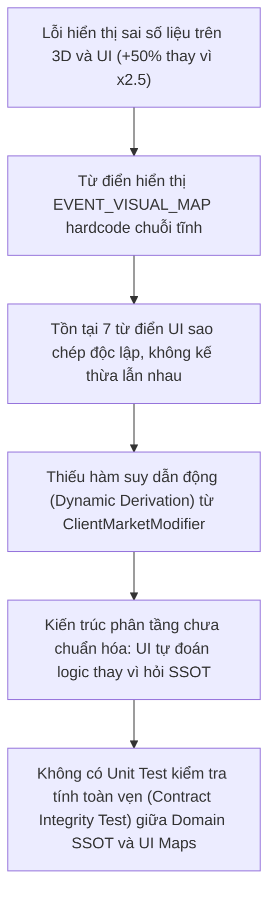

# BÁO CÁO KIỂM TOÁN ĐỐI KHÁNG CHUYÊN SÂU (ADVERSARIAL STATIC AUDIT REPORT)
## Lệch Pha Chuỗi Hiển Thị Cứng (Hardcoded Visual Metadata Desync) giữa UI & Domain Engine

> **Mã kiểm toán**: `AUDIT-2026-VISUAL-DESYNC-01`  
> **Hệ thống mục tiêu**: VTCOON Core Engine & Client UI (2D Modals / 3D Canvas / Ticker)  
> **Mức độ rủi ro hệ thống**: **CRITICAL (P1)** — Lừa thị giác và sai lệch quyết định tài chính của người chơi  
> **Ngày lập báo cáo**: 01/10/2026  

---

### 1. PHẠM VI VÀ PHƯƠNG PHÁP KIỂM TOÁN

Tiến hành rà soát đối kháng tĩnh (Adversarial Static Reconciliation) đối chiếu 100% các từ điển hiển thị ở tầng Client với các bộ quy tắc tính toán của Domain SSOT:

#### 1.1. Tệp Domain Chuẩn (SSOT)
- `src/domain/event_card_metadata.ts`: Đặc tả tài chính của Thẻ Khí Vận & Thẻ Cơ Hội.
- `src/domain/macro_cycle_types.ts` & `src/domain/macro_cycle_engine.ts`: Hệ số chu kỳ kinh tế vĩ mô.
- `src/domain/property_rent.ts`: Thuật toán tính tiền thuê, cước ga tàu, tiện ích và điều kiện giảm trừ.
- `src/domain/market_card_handlers.ts` & `src/domain/chance_card_handlers.ts`: Handlers thực thi thẻ bài và bộ điều biến `activeModifiers`.

#### 1.2. Tệp Giao diện (Client UI / 2D / 3D Dictionaries)
- `src/client/3d/tile_event_aura.tsx` (bảng `EVENT_VISUAL_MAP`)
- `src/client/ui/modals/event_card_visuals.ts` (bảng `KNOWN_HERO_STATS` và `THEMED_EMOJIS`)
- `src/client/ui/market_event_ticker.tsx` (bảng `ACTIVE_MARKET_EFFECT_SUMMARIES`, `ACTIVE_MARKET_COMPACT_FORMULAS`, `resolveMarketIcon`, `resolveMarketShortTag`)
- `src/client/ui/event_card_punchy_summaries.ts` (bảng `PUNCHY_EVENT_SUMMARIES`)
- `src/domain/i18n/vi.ts` (từ điển đa ngôn ngữ tiếng Việt)
- *Phát hiện bổ sung*: `src/client/ui/modals/title_deed_modal.tsx` (bảng `MODIFIER_DESCS`)

---

### 2. BẢNG ĐỐI CHIẾU KIỂM TOÁN TOÀN DIỆN (100% RECONCILIATION LEDGER)

| Tệp UI & Dòng mã | Tên Sự Kiện / Thẻ Bài | Nhãn UI Đang Hiển Thị (Thực Tế) | Logic Domain Chuẩn (SSOT) | Trạng Thái | Mức Độ Rủi Ro |
| :--- | :--- | :--- | :--- | :--- | :---: |
| `src/client/3d/tile_event_aura.tsx:42` | `MACRO_LAND_FEVER` (Sốt Đất Vĩ Mô) | `label: '+50%'`, icon `🌋`, buff vàng | `macro_cycle_types.ts:9,11`: `MACRO_FEVER_RENT_MULT = 2.5` (Thuê x2.5), Xây nhà -25% (`0.75`) | **Lừa Thị Giác Cực Nặng** (Thực tế x2.5 nhưng hiển thị +50%) | **P1** |
| `src/client/3d/tile_event_aura.tsx:31` | `MC_PEAK_TOURISM` (Mùa Cao Điểm Du Lịch) | `label: '+50%'`, icon `🏖️`, buff vàng | `market_card_handlers.ts:224`: `multiplier: 2` (Nhân đôi x2 tiền thuê toàn bộ Resort) | **Lừa Thị Giác** (Thực tế x2 nhưng ghi nhầm thành +50%) | **P1** |
| `src/client/3d/tile_event_aura.tsx:34` | `MC_PUBLIC_INVEST` (Đẩy Mạnh Đầu Tư Công) | `label: '+30%'`, icon `🏗️`, buff vàng | `market_card_handlers.ts:254`: `multiplier: 2` (Nhân đôi x2 cước 4 Ga Tàu) | **Lừa Thị Giác** (Số liệu `+30%` hoàn toàn tự bịa; domain là x2) | **P1** |
| `src/client/3d/tile_event_aura.tsx:30` | `MC_LAND_FEVER` (Sốt Đất Đô Thị Vệ Tinh) | `label: '+50%'`, icon `🔥`, buff vàng | `market_card_handlers.ts:234`: `multiplier: 2` (Nhân đôi x2 tiền thuê ô 6, 8, 31). Không đổi giá bán | **Lệch Pha Kép** (Domain chạy x2, UI ghi +50%; bịa đặt tính năng đổi giá bán) | **P1** |
| `src/client/3d/tile_event_aura.tsx:28-44` | `MC_COASTAL_STORM` (Bão Lũ Duyên Hải) | **Bỏ sót trong map**, fallback `DEFAULT_EVENT_META`: `label: 'Hiệu lực'`, icon `🎴`, buff vàng | `market_card_handlers.ts:225`: `multiplier: 0` (Miễn 100% tiền thuê), dừng chân mất lượt | **Đảo Ngược Bản Chất** (Thiên tai thảm họa biến thành Buff vàng) | **P1** |
| `src/client/3d/tile_event_aura.tsx:40-41` | `CC_BUILD_HALT` & `BUILD_HALT` | Định nghĩa `label: 'Đình chỉ'`, icon `🚧`, nhưng **không bao giờ khớp** do domain push type `MC_COASTAL_STORM` | `chance_card_handlers.ts:268`: push `MC_COASTAL_STORM`. Bị fallback thành Buff vàng `🎴 Hiệu lực`! | **Mã Chết / Hiển Thị Sai** (Bị đình chỉ thi công lại hiển thị Buff vàng) | **P1** |
| `src/client/3d/tile_event_aura.tsx:28-44` | `CC_MEDIA_CRISIS` (Khủng Hoảng Truyền Thông) | **Bỏ sót trong map**, do domain push `MC_COASTAL_STORM` nên rơi vào fallback Buff vàng `🎴 Hiệu lực` | `chance_card_handlers.ts:351`: Đình chỉ ô dịch vụ 2 vòng | **Đảo Ngược Bản Chất** (Ô dịch vụ bị phạt lại hiện hào quang vàng) | **P1** |
| `src/client/3d/tile_event_aura.tsx:28-44` | `CC_PORT_EXCLUSIVE` (Hợp Tác Cảng Biển) | **Bỏ sót trong map**, fallback `DEFAULT_EVENT_META`: `label: 'Hiệu lực'`, icon `🎴` | `chance_card_handlers.ts:307`: `multiplier: 0.5` chia 50% cước cho người hưởng lợi trên 4 Ga tàu | **Lệch Pha Nhận Diện** (Không hiển thị được trạng thái trích cước 50%) | **P2** |
| `src/client/3d/tile_event_aura.tsx:43` | `MACRO_LIQUIDITY_FREEZE` (Đóng Băng Thanh Khoản) | `label: 'Khóa'`, icon `🧊`, xanh cyan | `macro_cycle_types.ts:10`: `MACRO_FREEZE_RENT_MULT = 0.5` (Giảm 50% tiền thuê) và cấm thế chấp | **Che Giấu Thông Tin** (Chỉ ghi 'Khóa', giấu mất quyền lợi giảm 50% tiền thuê) | **P2** |
| `src/client/3d/tile_event_aura.tsx:33,37,38` | `MC_FREEZE_TRADE`, `MC_FIRE_INSPECTION`, `MC_ANTI_SPECULATE` | Có mặt trong `EVENT_VISUAL_MAP` | Tức thì hoặc `affectedCells: []`, không gán lên ô cụ thể | **Mã Rác / Khối Mã Chết** (Không bao giờ xuất hiện trên Aura 3D) | **P2** |
| `src/client/ui/modals/event_card_visuals.ts:62-102` | `MACRO_LAND_FEVER`, `MACRO_LIQUIDITY_FREEZE` | **Bỏ sót trong KNOWN_HERO_STATS**, fallback: `{ label: 'HIỆU ỨNG ĐẶC BIỆT', value: 'KÍCH HOẠT' }` | Thuê x2.5 & Xây -25%; Thuê -50% & Cấm thế chấp | **Mất Thông Tin Thống Kê** (Không có badge tài chính nổi bật trên modal) | **P2** |
| `src/client/ui/modals/event_card_visuals.ts:72` | `MC_LAND_FEVER` | `value: '+50% THUÊ & GIÁ BÁN'` | Handler set `multiplier: 2` (x2 thuê); không có cơ chế tăng giá bán | **Lệch Pha Kép** (Hiển thị sai hệ số và sai tính năng) | **P1** |
| `src/client/ui/modals/event_card_visuals.ts:25` | `MC_NIGHT_ECONOMY` | Icon: `🍸` (Ly cocktail) | `market_event_ticker.tsx:28` & 3D Aura: Icon: `🌙` (Mặt trăng) | **Lệch Pha Icon** (Thiếu nhất quán) | **P2** |
| `src/client/ui/modals/event_card_visuals.ts:35,36` | `MC_URBAN_PLANNING`, `MC_UTILITY_DOUBLE` | Icon: `🏙️`, `💡` | Ticker & 3D Aura dùng: `📐`, `⚡` | **Lệch Pha Icon** (Thiếu nhất quán) | **P2** |
| `src/client/ui/market_event_ticker.tsx:98,148` | `MC_LAND_FEVER` | `'Tăng 50% tiền thuê & giá chuyển nhượng'`, `'Ven đô: Thuê & Bán +50%'` | Handler set `multiplier: 2` (x2); không đổi giá chuyển nhượng | **Lệch Pha Spec & Code** | **P1** |
| `src/client/ui/market_event_ticker.tsx:156` | `MC_CASINO_PILOT` | Công thức rút gọn: `'Thưởng 1.500 - 3.000 khi dừng'` | `market_card_handlers.ts:258`: Thưởng ngay khi rút thẻ, không yêu cầu dừng chân | **Lừa Thị Giác / Hiểu Nhầm Luật** (Tưởng nhầm phải giẫm vào ô mới được tiền) | **P2** |
| `src/client/ui/modals/title_deed_modal.tsx:50` | `MC_FUEL_SURGE` (Phụ Phí Nhiên Liệu) | Icon: `⚡` (Tia sét), text: 'Biến Động Xăng Dầu: Phụ thu +500 cước' | Ticker, Modal bốc thẻ & 3D Aura đều dùng: `⛽` (Cột xăng) | **Lệch Pha Icon** (Xăng dầu hiển thị icon điện thoại/sấm sét) | **P2** |
| `src/client/ui/modals/title_deed_modal.tsx:49-57` | `MACRO_LAND_FEVER`, `MC_LAND_FEVER`, `CC_PORT_EXCLUSIVE` | **Bỏ sót hoàn toàn** trong `MODIFIER_DESCS` | Đang chịu ảnh hưởng bởi sốt đất hoặc chia cước cảng, mở sổ đỏ không thấy badge | **Thiếu Thông Tin Quyết Định** | **P2** |
| `src/client/ui/event_card_punchy_summaries.ts:18` | `MC_LAND_FEVER` | `'Tăng 50% tiền thuê & sang nhượng'` | Domain thực tế là nhân đôi (x2) | **Lệch Pha Chuỗi Tóm Tắt** | **P1** |
| `src/client/ui/event_card_punchy_summaries.ts:6-46` | `MACRO_LAND_FEVER`, `MACRO_LIQUIDITY_FREEZE` | **Bỏ sót hoàn toàn** trong danh sách tóm tắt nhanh | Chu kỳ kinh tế vĩ mô có tác động lớn nhất nhưng không có bản tóm tắt punchy | **Bỏ Sót Dữ Liệu Vĩ Mô** | **P2** |
| `src/domain/i18n/vi.ts:18,90,91` | `MC_LAND_FEVER`, `MACRO_LAND_FEVER`, `MACRO_LIQUIDITY_FREEZE` | Tên sự kiện: `'Sốt Đất Đô Thị Vệ Tinh'`, `'Sốt Đất Vĩ Mô'`, `'Đóng Băng Thanh Khoản'` | Khớp với định danh enum | **Khớp** | N/A |

---

### 3. ĐIỂM NÓNG CẦN CHÚ Ý ĐẶC BIỆT (CRITICAL FINDINGS DEEP DIVE)

```
[Bảng Phù Hiệu 3D Aura]  ──────> Hiển thị nhãn: "+50%" (Màu vàng Buff)
                                   ▲
                                   │  LỆCH PHA 200% SO VỚI THỰC TẾ!
                                   │
[Domain SSOT Engine]    ──────> Tính toán tiền thuê: x 2.5 (Tăng +150%)
```

1. **`MACRO_LAND_FEVER` (Sốt Đất Vĩ Mô)**:
   - *Thực tế tính toán*: Tiền thuê nhân hệ số `2.5` (`MACRO_FEVER_RENT_MULT = 2.5`), đồng thời giảm 25% chi phí nâng cấp nhà (`MACRO_FEVER_UPGRADE_COST_MULT = 0.75`).
   - *Hiển thị trên 3D*: Phù hiệu bay trên ô đất ghi `+50%`. Người chơi tưởng chỉ tăng nhẹ, chủ quan bước vào và bị trừ cước gấp 2.5 lần dẫn đến phá sản đột ngột.

2. **`MC_PUBLIC_INVEST` (Đẩy Mạnh Đầu Tư Công)**:
   - *Thực tế tính toán*: Nhân đôi cước phí vận tải tại 4 Ga Tàu (`multiplier: 2`).
   - *Hiển thị trên 3D*: Nhãn ghi `+30%` (một con số hoàn toàn không có cơ sở trong mã nguồn domain).

3. **`MC_COASTAL_STORM` & `CC_BUILD_HALT` (Đình chỉ / Thảm họa biến thành Buff)**:
   - Khi công trình bị đình chỉ hoặc dính bão lũ (tiền thuê về 0, mất lượt), modifier bị đẩy vào `tile_event_aura.tsx` không có key tương ứng nên fallback về `DEFAULT_EVENT_META`.
   - Kết quả: Ô đất bị phạt lại tỏa hào quang màu **vàng cam rực rỡ của Buff** (`#F59E0B`) kèm biểu tượng `🎴` và chữ "Hiệu lực".

4. **`MC_LAND_FEVER` (Khủng hoảng định danh & Tính năng ma)**:
   - Trong code engine: `multiplier: 2` (nhân đôi tiền thuê tại ô 6, 8, 31).
   - Trong toàn bộ văn bản UI: Tất cả đều ghi "Tăng 50% tiền thuê & giá chuyển nhượng".
   - Thực tế tính năng: **Không có bất kỳ logic nào làm tăng giá chuyển nhượng P2P** trong toàn bộ domain engine.

---

### 4. MA TRẬN BẤT NHẤT BIỂU TƯỢNG (ICON DESYNC MATRIX)

| Sự Kiện / Thẻ Bài | 3D Tile Aura | Market Ticker | Modal Thẻ Bài | Modal Sổ Đỏ | Đánh Giá Tác Động |
| :--- | :---: | :---: | :---: | :---: | :--- |
| `MC_FUEL_SURGE` | `⛽` | `⛽` | `⛽` | `⚡` | **Lỗi ngữ nghĩa**: Sổ đỏ dùng icon điện lực `⚡` cho xăng dầu |
| `MC_NIGHT_ECONOMY` | `🌙` | `🌙` | `🍸` | `🌙` | Modal thẻ dùng ly cocktail, các nơi khác dùng trăng khuyết |
| `MC_URBAN_PLANNING` | `📐` | `📐` | `🏙️` | *(Bỏ sót)* | Modal dùng nhà chọc trời, các nơi khác dùng thước kẻ |
| `MC_UTILITY_DOUBLE` | `⚡` | `⚡` | `💡` | `💡` | 3D & Ticker dùng tia sét, Modal & Sổ đỏ dùng bóng đèn |
| `MC_ANTI_SPECULATE` | `⚖️` | `⚖️` | `🛡️` | *(Bỏ sót)* | Modal dùng cái khiên, Ticker & 3D dùng cán cân công lý |
| `MC_CREDIT_STIMULUS`| *(Bỏ sót)* | `📉` | `🏦` | *(Bỏ sót)* | Ticker dùng biểu đồ giảm, Modal dùng ngân hàng |
| `MC_COASTAL_STORM` | `🎴` *(fallback)*| `🌀` | `🌪️` | `🌀` | 3D rơi vào bài tây, Ticker lốc xanh, Modal vòi rồng |
| `MC_PEAK_TOURISM` | `🏖️` | `🏖️` | `🏖️` | `🌊` | Sổ đỏ dùng con sóng `🌊`, còn lại dùng bãi biển |

---

### 5. NGUYÊN NHÂN GỐC RỄ (ROOT CAUSE ANALYSIS)



1. **Phân mảnh từ điển (Dictionary Siloing)**: Có ít nhất 7 từ điển hiển thị độc lập trong client. Mỗi khi kỹ sư tinh chỉnh balance trong domain engine (đổi multiplier từ 1.5 sang 2.0 hoặc 2.5), họ không thể cập nhật hết 7 tệp này.
2. **Hardcode chuỗi tĩnh thay vì suy dẫn từ Runtime Data**: UI tra cứu nhãn dựa trên ID thẻ bài (`modifier.type`) thay vì đọc các thuộc tính toán học thực tế trên chính đối tượng `modifier` (`modifier.multiplier`).
3. **Lỏng lẻo kiểu dữ liệu (Loose Typing)**: Khai báo `Record<string, ...>` thay vì `Record<MarketCardId | MacroCycleType, ...>`, khiến TypeScript không thể cảnh báo khi thiếu sót các sự kiện quan trọng như bão lũ hay cước cảng.

---

### 6. ĐỀ XUẤT KIẾN TRÚC KỸ THUẬT TRIỆT ĐỂ (TARGET ARCHITECTURE)

#### 6.1. Nguyên tắc: Zero-Redundancy & Dynamic Label Derivation
Loại bỏ hoàn toàn các bảng tra cứu chuỗi tĩnh hardcode. Nhãn hiển thị 2D/3D phải được **suy dẫn động trực tiếp từ thuộc tính số học của `modifier`** tại thời điểm chạy:

```
[Domain SSOT Engine]
  ├── MACRO_FEVER_RENT_MULT = 2.5
  └── modifier.multiplier = 2
               │
               ▼
[src/client/domain_visual_bridge.ts] (Single Source of Truth)
  ├── EVENT_ICON_REGISTRY (Bảng Icon duy nhất cho toàn bộ dự án)
  └── deriveModifierVisual(modifier: ClientMarketModifier): EventVisualMeta
               │
               ├─────────────────────────┬─────────────────────────┐
               ▼                         ▼                         ▼
   [tile_event_aura.tsx]     [market_event_ticker.tsx]   [title_deed_modal.tsx]
   (Nhãn động: x2.5 Thuê)     (Công thức: Thuê x2.5)      (Badge: Thuê x2.5)
```

#### 6.2. Bản mẫu triển khai Hàm suy dẫn nhãn động (`deriveModifierVisual`)
```ts
// src/client/domain_visual_bridge.ts
import { MarketCardId, ChanceCardId } from '../domain/event_card_types.js';
import { MacroCycleType } from '../domain/macro_cycle_types.js';
import type { ClientMarketModifier } from './store/game_store_types.js';

export interface EventVisualMeta {
  readonly icon: string;
  readonly label: string;
  readonly color: string;
  readonly isBuff: boolean;
}

export const EVENT_ICON_REGISTRY: Readonly<Record<string, string>> = Object.freeze({
  [MarketCardId.MC_FUEL_SURGE]: '⛽',
  [MarketCardId.MC_ALCOHOL_CHECK]: '🚨',
  [MarketCardId.MC_PEAK_TOURISM]: '🏖️',
  [MarketCardId.MC_NIGHT_ECONOMY]: '🌙',
  [MarketCardId.MC_MEGA_CONCERT]: '🎤',
  [MarketCardId.MC_CASINO_PILOT]: '🎰',
  [MarketCardId.MC_RATE_HIKE]: '📈',
  [MarketCardId.MC_CREDIT_STIMULUS]: '📉',
  [MarketCardId.MC_LAND_FEVER]: '🔥',
  [MarketCardId.MC_FIRE_INSPECTION]: '🧯',
  [MarketCardId.MC_PUBLIC_INVEST]: '🏗️',
  [MarketCardId.MC_ANTI_SPECULATE]: '⚖️',
  [MarketCardId.MC_FREEZE_TRADE]: '❄️',
  [MarketCardId.MC_URBAN_PLANNING]: '📐',
  [MarketCardId.MC_UTILITY_DOUBLE]: '⚡',
  [MarketCardId.MC_COASTAL_STORM]: '🌀',
  [MacroCycleType.MACRO_LAND_FEVER]: '🌋',
  [MacroCycleType.MACRO_LIQUIDITY_FREEZE]: '🧊',
  [ChanceCardId.CC_PORT_EXCLUSIVE]: '🚢',
  [ChanceCardId.CC_BUILD_HALT]: '🚧',
  [ChanceCardId.CC_MEDIA_CRISIS]: '📢',
});

export function deriveModifierVisual(modifier: ClientMarketModifier): EventVisualMeta {
  const cardType = String(modifier.type ?? '');
  const icon = EVENT_ICON_REGISTRY[cardType] ?? '🎴';

  // 1. Giải mã trực tiếp từ hệ số nhân tiền thuê thực tế (multiplier)
  if (typeof modifier.multiplier === 'number') {
    if (modifier.multiplier === 0) {
      return { icon, label: 'Miễn thuê', color: '#EF4444', isBuff: false };
    }
    if (modifier.multiplier < 1) {
      const discountPct = Math.round((1 - modifier.multiplier) * 100);
      return { icon, label: `-${discountPct}% Thuê`, color: '#EF4444', isBuff: false };
    }
    if (modifier.multiplier > 1) {
      // 2.5 -> 'x2.5 Thuê', 2 -> 'x2 Thuê'
      const formattedMult = Number.isInteger(modifier.multiplier) 
        ? modifier.multiplier.toString() 
        : modifier.multiplier.toFixed(1);
      return { icon, label: `x${formattedMult} Thuê`, color: '#F59E0B', isBuff: true };
    }
  }

  // 2. Định danh các bộ điều biến đặc thù không dùng multiplier
  if (cardType === MarketCardId.MC_FUEL_SURGE) {
    return { icon, label: '+500 Phí', color: '#EF4444', isBuff: false };
  }
  if (cardType === ChanceCardId.CC_PORT_EXCLUSIVE) {
    return { icon, label: 'Hưởng 50%', color: '#F59E0B', isBuff: true };
  }
  if (cardType === MarketCardId.MC_URBAN_PLANNING) {
    return { icon, label: 'Thế chấp 60%', color: '#F59E0B', isBuff: true };
  }
  if (cardType === MacroCycleType.MACRO_LIQUIDITY_FREEZE) {
    return { icon, label: 'Thuê -50%', color: '#06B6D4', isBuff: false };
  }

  return { icon, label: 'Hiệu lực', color: '#F59E0B', isBuff: true };
}
```

#### 6.3. Giải pháp trọng tài cho `MC_LAND_FEVER`
Yêu cầu Product Owner / Lead Designer chốt phương án dứt khoát:
- **Phương án 1 (Khuyên nghị - Giữ nguyên code thực thi)**: Giữ nguyên `multiplier: 2` trong handler; cập nhật toàn bộ metadata, ticker và tóm tắt thành: `"Nhân đôi tiền thuê tại các đô thị vệ tinh (Bình Dương, Đồng Nai, Hưng Yên) trong 1 vòng"`. Xóa bỏ vĩnh viễn cụm từ "giá chuyển nhượng / sang nhượng".
- **Phương án 2 (Đưa code về đúng spec ban đầu)**: Đổi `multiplier: 1.5` trong `market_card_handlers.ts` và triển khai thêm logic tăng 50% định giá sang nhượng đất trong module giao dịch P2P.

#### 6.4. Chốt kiểm thử tự động (Parity Contract Invariant Test)
Viết bộ test tại `tests/contracts/visual_metadata_parity.test.ts` đảm bảo:
- 100% enum `MarketCardId`, `MacroCycleType` và `ChanceCardId` có modifier đều phải tồn tại trong `EVENT_ICON_REGISTRY`.
- Mọi modifier tạo ra với `multiplier = 2.5` bắt buộc nhãn trả về từ `deriveModifierVisual` phải chứa `2.5`. Bất kỳ hành vi hardcode text nào làm lệch số liệu sẽ lập tức làm gãy pipeline CI.
