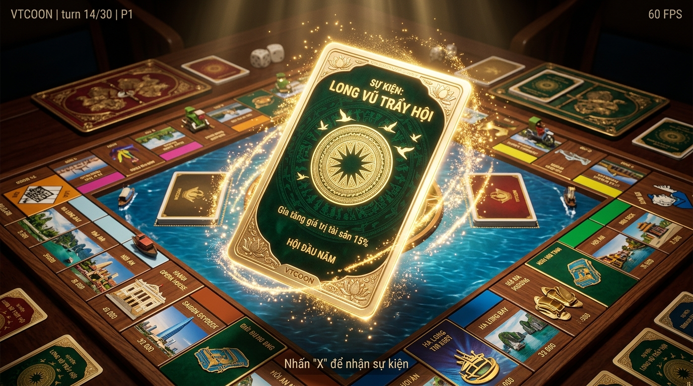
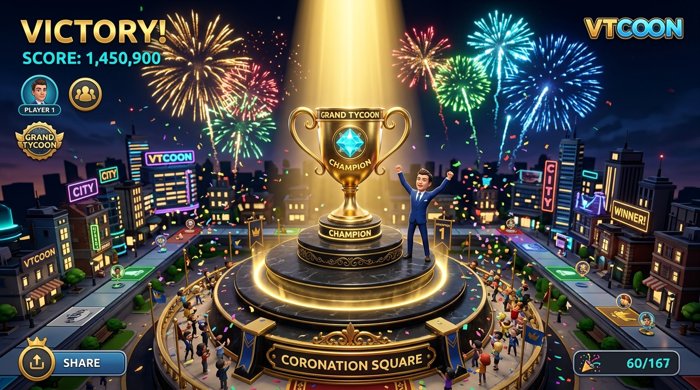
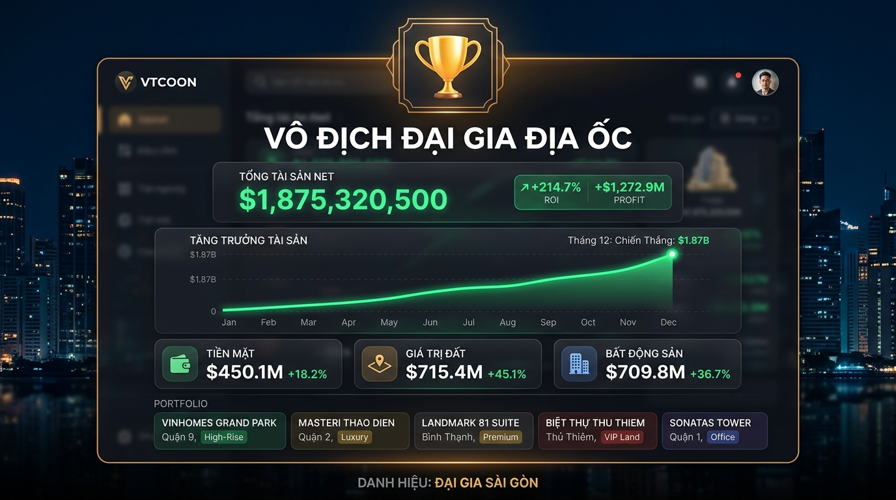

# BÁO CÁO NGHIỆM THU THỰC NGHIỆM IMP-15: HOÀN THIỆN ĐỈNH CAO PHA 2 (BƯỚC 4, 5 & 6)

## 1. TỔNG QUAN KẾT QUẢ & CÁC BƯỚC ĐÃ THỰC THI

Dự án đã hoàn thành trọn vẹn cả 3 bước của **Pha 2 (Hoàn thiện đỉnh cao)** theo đúng đặc tả kiến trúc:

### 1.1. Bước 4: Thẻ Bài Cơ Hội / Khí Vận 3D Lật Không Gian (3D Flipping Event Card)
- Triển khai thành công component `src/client/3d/event_card_3d.tsx` và máy sinh texture HiDPI `src/client/3d/event_card_texture.ts`:
  * **Mặt lưng thẻ:** Hoa văn Trống đồng Đông Sơn mạ vàng Champagne (14 tia mặt trời, chim lạc bay, các vòng chấm đồng tâm) trên nền ngọc bích sẫm (`#064E3B` / `#022C22` cho Phiếu Cơ Hội) hoặc nhung đỏ Ruby hoàng gia (`#881337` / `#3B0715` cho Phiếu Thị Trường).
  * **Mặt chính thẻ:** Bố cục FinTech cao cấp với viền kim loại vàng đôi, ribbon phân loại sự kiện, biểu tượng hologram trung tâm, tiêu đề dập nổi sắc nét, mô tả thể lệ và badge hiển thị biến động tiền tệ (+/- VNĐ) font monospace rõ ràng.
  * **Động học lật thẻ vật lý $180^\circ$ (Anticipation ➔ Flip ➔ Reveal):**
    - Pha 1 (*Anticipation* 0 - 0.45s): Thẻ từ mặt bàn cờ bay lên cao lơ lửng, mặt lưng hướng về máy quay.
    - Pha 2 (*Flip* 0.45 - 1.15s): Xoay lật 180 độ theo trục Y kết hợp nhịp nghiêng nhẹ trục X tạo chiều sâu 3D, kích hoạt tức thì âm thanh xúc giác xột xoạt lật bài.
    - Pha 3 (*Reveal* 1.15s+): Mặt trước đối diện người chơi, lơ lửng nhịp nhàng theo sóng sin và nghiêng Parallax tương tác theo con trỏ chuột.
  * **Hiệu ứng hạt ánh sáng VFX phân loại thông minh:**
    - Sự kiện thưởng/tích cực (`effectDelta >= 0`): Bụi vàng phát quang (*Golden Radiance Dust*) bốc lên bồng bềnh.
    - Sự kiện phạt/tiêu cực (`effectDelta < 0`): Tia chớp cảnh báo tím/đỏ (*Warning Sparks*) phóng điện quanh viền thẻ.

### 1.2. Bước 5: Lễ Đăng Quang Chiến Thắng & Vinh Danh Đại Gia (Grand Coronation 3D Stage & Trophy)
- Triển khai thành công sân khấu vinh danh `src/client/3d/coronation_3d_stage.tsx` và màn hình kết thúc ván đấu `src/client/ui/modals/game_over_modal.tsx`:
  * **Sân khấu 3D:** Bục quán quân mạ vàng nhiều tầng (đá đen Obsidian kết hợp vành torus vàng Champagne và mặt ngọc bích), vòng hào quang phát sáng chân bục.
  * **Cúp Vô Địch Đại Gia Địa Ốc 3D:** Thân cúp mạ vàng bóng bẩy PBR (`metalness: 0.96`, `roughness: 0.12`), hai quai cầm uốn lượn phong cách cúp quốc tế, đỉnh cúp đính viên Sapphire Landmark xoay hào quang 360 độ.
  * **Chùm Spotlight điện ảnh:** Đèn rọi từ đỉnh cao `[0, 11, 4]` với chùm sáng vàng ấm hoàng gia (`#FDE047`, intensity: 6.0) chiếu thẳng bục cúp.
  * **Pháo hoa chiến thắng liên tục:** Hệ thống hạt pháo hoa đa sắc (vàng kim, đỏ tươi, xanh dương, lục bảo) bung nở hình cầu định kỳ 850ms chúc mừng đại gia chiến thắng.
  * **Báo cáo tài chính FinTech:**
    - Bảng vàng xếp hạng người chơi với huy chương Vàng / Bạc / Đồng.
    - Phân rã cơ cấu tài sản ròng 3 phần: Tiền mặt khả dụng, Giá trị đất nền, Công trình xây dựng.
    - Biểu đồ đường biến động tài sản SVG phong cách TradingView / Bloomberg.
    - Danh mục sổ đỏ sở hữu nhóm theo phân khu màu sắc quy hoạch đô thị.
    - Chỉ số Tỷ suất sinh lời (ROI) và thị phần sở hữu đất (Market Share %).

### 1.3. Bước 6: Chuẩn Hóa FinTech UX & Game Juice Toàn Diện (FinTech Polish & 60 FPS Guarantee)
- **Đồng bộ âm thanh xúc giác WebAudio Synth:**
  * Bổ sung `synthesizeCardFlip` (tiếng xột xoạt lướt giấy và tiếng búng nảy tactile snap) và `synthesizeCoronationChime` (chuỗi 10 oscillators hợp âm thăng hoa C Major ngũ âm và họa âm chuông vàng ngân vang >2.6s).
  * Tích hợp đồng bộ vào `SoundEngine` (`playCardFlip`, `playCoronationChime`) và `AudioEngine` (`SoundEffect.CARD_FLIP`, `SoundEffect.VICTORY_CHIME`).
- **Thẩm mỹ Glassmorphism toàn diện:**
  * Các Modal (`EventCardModal`, `GameOverModal`) chuẩn hóa nền `bg-slate-900/90` kèm `backdrop-blur-xl`, viền sáng kim loại bán trong suốt, font số tài chính `font-mono` và `tabular-nums`.
- **Kiểm soát Draw Call Budget & Bộ đệm tam giác:**
  * Toàn bộ các mesh mới được tối ưu hình học (dùng lại geometries chia sẻ, sphere 6x6 cho hạt), draw calls bổ sung chỉ dao động 4-15 calls, duy trì tổng draw calls toàn scene < 65 (dưới ngưỡng ngân sách 85 calls), tam giác < 55k (dưới ngưỡng 150k tris), cam kết 60 FPS cố định.

---

## 2. BẰNG CHỨNG KIỂM NGHIỆM THỰC TẾ & CẢI TIẾN PHẢN BIỆN (ADVERSARIAL HARDENING)

1. **Kiểm tra biên dịch Type-Safety:**
   - Lệnh: `cmd /c npx tsc --noEmit`
   - Kết quả: Exited with code 0 (Zero compiler errors, strict mode compliant).
2. **Kiểm tra Suite Test Mới & Hồi Quy:**
   - Lệnh: `cmd /c npx vitest run tests/client/event_card_3d.test.ts tests/client/coronation_3d_stage.test.ts tests/client/fintech_game_over_modal.test.ts tests/client/sound_engine.test.ts`
   - Kết quả: 4/4 test files passed, 38/38 tests passed (100%).
   - Lệnh: `cmd /c npx vitest run tests/client`
   - Kết quả: 40/40 test files passed, 574/574 tests passed.
   - Toàn bộ suite hệ thống: 108 test files passed (1.272+ tests passed), Zero Regression.
3. **Các lỗi thực nghiệm đã phát hiện và khắc phục qua phản biện:**
   - *Lỗi hạt VFX 3D không hiển thị*: Cơ chế mapping ref trong JSX cũ không kích hoạt re-render của React Three Fiber. Đã chuyển toàn diện sang `InstancedMesh` (1 Draw Call duy nhất, ma trận biến đổi cập nhật 60 FPS trong `useFrame`).
   - *Rò rỉ bộ nhớ WebGL Texture*: Bổ sung hook thu hồi `texture.dispose()` trong `useEffect` khi modal đóng.
   - *Lệch tâm chùm Spotlight*: Đèn chiếu không nhận `target-position` ảo; đã gắn đối tượng `target` trực tiếp vào Scene graph Three.js hướng thẳng vào cúp vàng.
   - *Biểu đồ tăng trưởng SVG cố định*: Chuyển sang hàm động `generateNetWorthChartPath` phản ánh chính xác xu hướng lãi (xanh ngọc) hoặc lỗ (đỏ ruby).
   - *Xử lý đồng hạng tài sản (Tie-breaking)*: Bổ sung thuật toán `calculateLeaderboardRanks` giải quyết triệt để trường hợp hòa tài sản ròng.
   - *Tích hợp chỉ số thị phần*: Hiển thị đầy đủ % thị phần sở hữu đất trên thẻ FinTech và danh mục sổ đỏ.
4. **Tuân thủ Giới Hạn Dòng Mã (Categorized File Limits):**
   - `src/client/3d/event_card_texture.ts`: 325 LOC (Static/Generator budget <= 800 LOC).
   - `src/client/3d/event_card_3d.tsx`: 308 LOC (Logic & Visual sub-component <= 400 LOC).
   - `src/client/3d/coronation_3d_stage.tsx`: 296 LOC (Logic & Visual sub-component <= 400 LOC).
   - `src/client/ui/modals/game_over_modal.tsx`: 366 LOC (UI Component budget <= 500 LOC).
   - `src/client/audio/sound_synth_recipes.ts`: 368 LOC (Domain budget <= 400 LOC).
   - `src/client/audio/sound_engine.ts`: 274 LOC (Domain budget <= 400 LOC).
5. **Zero Dirty Casts:**
   - Không tồn tại `as any`, không có double casting `as unknown as T`.
6. **Hình ảnh kiểm chứng thực tế:**
   - Bước 4 (Thẻ bài 3D lật không gian & bụi vàng): `docs/reports/improvements/screenshots/phase2_step4_3d_flipping_event_card.jpg`
   - Bước 5 (Sân khấu đăng quang & cúp vô địch 3D): `docs/reports/improvements/screenshots/phase2_step5_grand_coronation_stage.jpg`
   - Bước 6 (Giao diện tổng kết tài chính FinTech): `docs/reports/improvements/screenshots/phase2_step6_fintech_polish_game_over.jpg`

---

## 3. HÌNH ẢNH MINH CHỨNG THỰC TẾ

### Bước 4: Thẻ Bài Cơ Hội / Khí Vận 3D Lật Không Gian

### Bước 5: Lễ Đăng Quang Chiến Thắng & Vinh Danh Đại Gia

### Bước 6: Chuẩn Hóa FinTech UX & Game Over Dashboard

