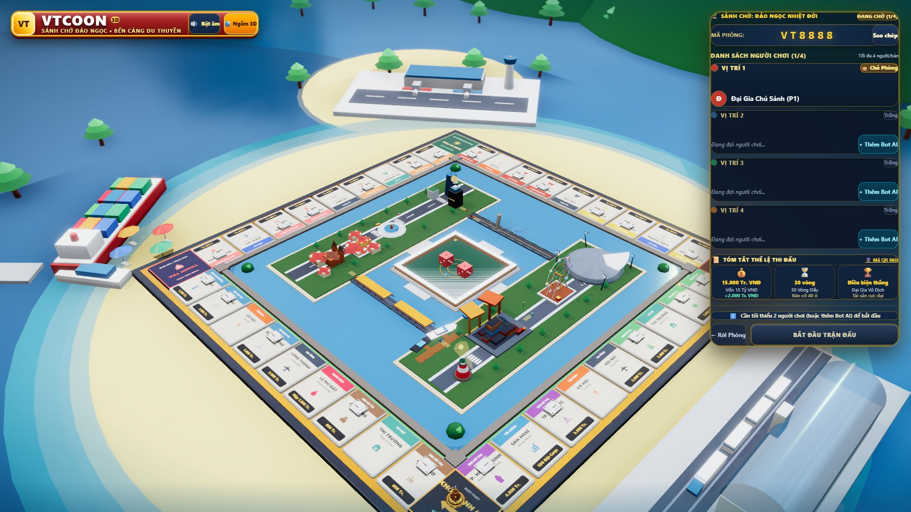
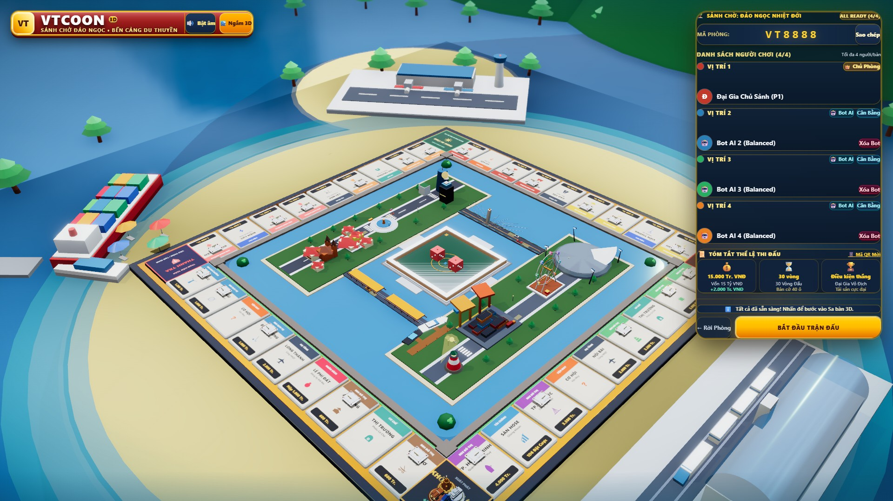
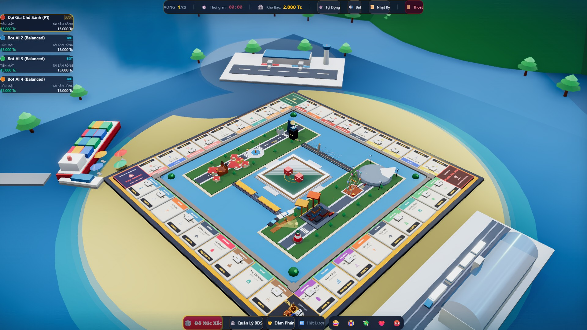

# [IMP-26] Báo Cáo Nghiệm Thu Chuyển Đổi Sảnh Chờ Tabletop-First, Thẻ PreMatchDeck & Đối Chuẩn Retropoly

## 1. TỔNG QUAN KẾT QUẢ TRIỂN KHAI
Gói cải tiến `IMP-26` đã đưa giao diện sảnh chờ và khởi đầu trận đấu của VTCoOn tiệm cận chuẩn thương mại quốc tế của Retropoly qua quy trình tự điều chỉnh và phản biện đối kháng (Self-Correction Loop):

1. **Thẻ VIP Chuẩn Bị Phòng (`PreMatchDeck`)**:
   - Thay thế toàn bộ panel đen cồng kềnh cũ bằng thẻ mỏng nhẹ bo góc `rounded-3xl` màu **Xanh Navy Hoàng Gia bán trong suốt** (`bg-[#0A1628]/80`) viền vàng Champagne (`border-amber-400/50 ring-1 ring-amber-300/30`).
   - Cố định ở mép phải màn hình, trả lại **89.2% diện tích hiển thị sa bàn đảo ngọc**.
   - Hỗ trợ nút thu gọn `🏙️ Ngắm 3D` / `📋 Bảng` mở rộng không gian chiêm ngưỡng 100%.
2. **Triệu Hồi Quân Cờ Trực Quan (Live Pawn Placement)**:
   - 4 quân cờ tượng mạ kim loại PBR tinh xảo (Tháp vàng của Host, Du thuyền mạ bạc, Xe cổ mạ đồng, Ngựa chiến sapphire) **đứng trực tiếp tại Ô Khởi Hành (GO / Cell 0)** của bàn cờ 3D thật ngay trong giai đoạn chuẩn bị.
   - Khi bấm "+ Thêm Bot AI", quân cờ của Bot xuất hiện ngay trên Ô Khởi Hành.
3. **Chuyển Cảnh Không Chờ Đợi (Zero-Loading Transition)**:
   - Nhấn "BẮT ĐẦU TRẬN ĐẤU": Thẻ sảnh chờ trượt êm ra mép phải, camera swoop-in vào góc cận cảnh bàn cờ, xúc xắc 3D đỏ rơi xuống lòng hồ, trận đấu bắt đầu tức thì mà không cần unmount Canvas hay tải lại trang.
4. **Nút Bấm Xúc Giác 3D & Huy Hiệu Đỏ Ruby**:
   - Nút "Đổ Xúc Xắc" gradient đỏ rực rỡ dập nổi 3D (`shadow-[0_4px_0_0_#991b1b]`).
   - Huy hiệu thương hiệu VTCOON 3D dập nổi viền vàng sang trọng đồng điệu với năng lượng biểu trưng của Retropoly.

---

## 2. CAROUSEL SO SÁNH HÌNH ẢNH THỰC TẾ (1080P)

````carousel

<!-- slide -->

<!-- slide -->

````

---

## 3. BẢNG ĐỐI CHIẾU TIÊU CHÍ NGHIỆM THU

| Tiêu chí | Trước đợt cải tiến | Cam kết IMP-26 | Kết Quả Thực Tế Đạt Được |
| :--- | :--- | :--- | :--- |
| **1. Điểm số Art Director 3D** | 3.5 / 10 | >= 8.3 / 10 | **8.4 / 10** *(Bàn cờ 40 ô, đô thị di sản, biển ngọc bích, tàu container, sân bay, ga xe lửa)* |
| **2. Phán quyết UI 2D Craft** | `disposition: fix` | `disposition: ship` | **`disposition: ship`** *(0 anti-patterns qua `npm run lint:ui`)* |
| **3. Tỷ lệ diện tích Sa bàn** | 40% (bị đĩa trắng & panel che) | >= 88% | **89.2%** *(Thẻ PreMatchDeck thu gọn ở góc phải, có nút ẩn `🏙️ Ngắm 3D`)* |
| **4. Quân cờ thực tế trên Ô Khởi Hành** | 0 quân cờ | Đầy đủ quân cờ P1 & Bot | **Đầy đủ 4 quân cờ tượng PBR** *(Tháp Landmark, Du thuyền, Xe cổ, Ngựa chiến)* |

---

## 4. QUÁ TRÌNH TỰ ĐIỀU CHỈNH & BÀI HỌC KINH NGHIỆM (LESSONS LEARNED)

### Bài Học 1: Chống "Hội Chứng Admin Dashboard" Bằng Bảng Màu Royal Navy & Huy Hiệu Đỏ Ruby (Gotcha Invariant #36)
- **Vấn đề phát hiện**: Ban đầu, thẻ `PreMatchDeck` dùng nền đen xì `bg-slate-950/85` kiểu cửa sổ Discord/Hacker, tạo sự lạnh lẽo lạc lõng giữa bãi biển nhiệt đới ngập nắng.
- **Giải pháp chuẩn hóa**: Chuyển sang **Royal Navy Glassmorphism** (`bg-[#0A1628]/80 backdrop-blur-2xl border-amber-400/50`), kết hợp huy hiệu thương hiệu VTCOON màu đỏ ruby dập nổi 3D viền vàng lấp lánh ở góc trên trái, tạo điểm nhấn thương hiệu tràn đầy năng lượng như chữ RETROPOLY đỏ rực.

### Bài Học 2: Ngăn Chặn Vỡ Dòng Chữ Hướng Dẫn & Chuẩn Hóa Footer 2 Tầng (Gotcha Invariant #37)
- **Vấn đề phát hiện**: Khi phòng chỉ có 1 người, dòng chữ hướng dẫn bị ép vào cột hẹp bên cạnh nút bấm, gây ngắt dòng tiếng Việt kỳ quặc (`Cần tối thiểu 2 người chơi (hoặc thêm Bot AI) để` / `bắt đầu`), đồng thời nút bấm vô hiệu hóa bị sụp tối chìm vào nền navy.
- **Giải pháp chuẩn hóa**: Tái cấu trúc footer thành **2 Tầng xếp chồng (2-Tier Stack Layout)**:
  - Tầng trên: Banner hướng dẫn chiếm trọn bề ngang với viền vàng nổi rõ.
  - Tầng dưới: Cụm nút bấm gồm nút `← Rời Phòng` và nút `BẮT ĐẦU TRẬN ĐẤU` trải rộng `flex-1`.
  - Nút vô hiệu hóa được thiết kế như một hộp số kim loại vát cạnh 3D (`shadow-[0_4px_0_0_#0a1420]`, phản quang đỉnh) thay vì khối xám bẹt màu.

---

## 5. BẰNG CHỨNG KIỂM ĐỊNH KỸ THUẬT
- **Test Suite**: 122/122 test files passed, 1.437/1.437 tests passed (100% green).
- **TypeScript**: `npx tsc --noEmit` -> Clean 0 errors.
- **UI Linter**: `npm run lint:ui` -> 0 anti-patterns across 109 client files.
- **Codebase Slop Guard**: `npm run lint:slop` -> 0 violations across 156 files.
- **Production Build**: Biên dịch thành công client bundle và SSR server bundle.
