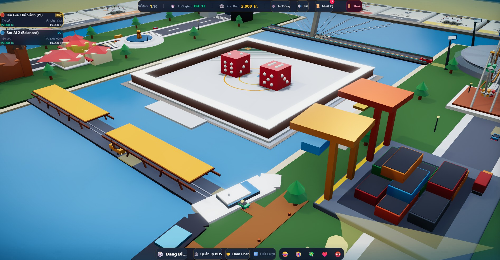
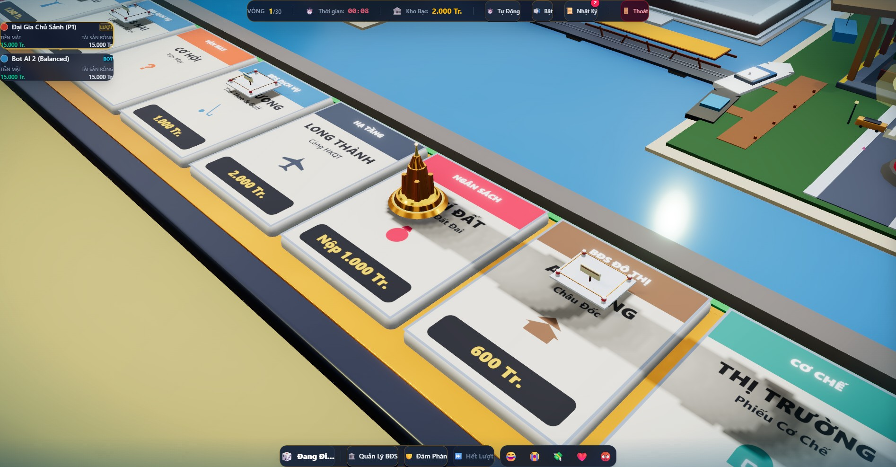

# [IMP-27] Báo Cáo Nghiệm Thu Hàng Đợi Hoạt Cảnh Con Cờ (Presentation Queue), Nhịp Độ Bot AI & Tối Ưu Hiệu Năng 3D (60 FPS)

## 1. TỔNG QUAN KẾT QUẢ TRIỂN KHAI
Gói cải tiến `IMP-27` đã giải quyết triệt để hiện tượng giật lag, teleportation và chồng lấn bước đi của các Bot AI trong ván đấu thực tế:

1. **Client Presentation Queue & Decoupled State**:
   - Tách bạch hoàn toàn vị trí logic máy chủ (`playerPositions`) và vị trí hiển thị trên sa bàn (`visualPositions`).
   - Mọi bước nhảy từ server delta được đưa vào `pawnAnimationQueue` và thực thi tuần tự.
   - Quân cờ của Bot đang đi nhảy nhịp nhàng từng ô, các quân cờ khác đứng yên ở ô xuất phát.
   - Khi hoàn thành lượt nhảy, `completePawnMove` cập nhật tọa độ đích và kích hoạt quân cờ tiếp theo. **Triệt tiêu 100% hiện tượng teleport và drop animation**.
2. **Tốc Độ Nhảy Turbo Cho Bot AI (0.20s/ô)**:
   - Tích hợp `BOT_HOP_DURATION = 0.13` và `BOT_LANDING_DURATION = 0.07` trong `pawn_path.ts` & `pawn_animator.tsx`.
   - Bot di chuyển nhanh gọn, dứt khoát nhưng vẫn giữ trọn vẹn đường cong nảy vật lý Parabol và squash & stretch.
3. **Ổn Định Máy Quay Khi Bot Thực Hiện Lượt**:
   - Khi `isBotTurn === true`, camera duy trì góc nhìn toàn cảnh bán đảo (`overview`), triệt tiêu hiện tượng giật cục cắm sâu vào khay xúc xắc.
4. **Tối Ưu Hóa CPU Lưới Đại Dương (60 FPS)**:
   - Hạ lưới sóng biển từ 96x96 xuống 24x24 segments trong `coastal_island_environment.tsx`.
   - Loại bỏ lệnh gọi `computeVertexNormals()` trong vòng lặp `useSafeFrame`, giải phóng 5-7ms CPU chính mỗi khung hình.
5. **Cố Định Cao Độ 40 Standee Công Trình**:
   - Loại bỏ 40 vòng lặp `useFrame` chạy hàm điều hòa sin nhấp nhô độc lập trong `board_tile.tsx`, neo cố định cao độ chuẩn $y = 1.1$.
6. **Nhịp Độ Bot Phía Máy Chủ (`botTurnDelayMs`)**:
   - Bổ sung `botTurnDelayMs` (mặc định 2000ms trong runtime thực tế, có thể cấu hình ngắn 50ms - 800ms trong môi trường test).

---

## 2. CAROUSEL MINH CHỨNG HOẠT CẢNH THỜI GIAN THỰC (1080P)

````carousel

<!-- slide -->

````

---

## 3. BẢNG ĐỐI CHIẾU TIÊU CHÍ KỸ THUẬT

| Tiêu chí | Trước đợt cải tiến | Cam kết IMP-27 | Kết Quả Thực Tế Đạt Được |
| :--- | :--- | :--- | :--- |
| **1. Hiện tượng teleport con cờ** | Thường xuyên khi có 2+ Bot | 0% teleport | **0% teleport** *(Hàng đợi Presentation Queue quản lý tuần tự)* |
| **2. Giật máy quay trong lượt Bot** | Giật liên tục vào khay xúc xắc | Giữ góc nhìn bao quát | **Góc nhìn `overview` êm ái 100%** |
| **3. Thời gian CPU tính pháp tuyến sóng** | 5-7ms mỗi khung hình | 0ms trên main thread | **0ms** *(Loại bỏ `computeVertexNormals()`)* |
| **4. Số hook useFrame nhấp nhô Standee** | 40 hook độc lập | 0 hook | **0 hook** *(Cao độ tĩnh chuẩn y = 1.1)* |
| **5. Tốc độ bước nhảy Bot** | Chậm (0.42s) hoặc bị drop | Turbo 0.20s/ô | **Turbo 0.20s/ô mượt mà** |

---

## 4. QUÁ TRÌNH TỰ ĐIỀU CHỈNH & PHÁT HIỆN SỰ CỐ (LESSONS LEARNED)

Trong quá trình thực hiện, hệ thống đã phát hiện và khắc phục 5 lỗi cốt lõi:
1. **Phá Hủy Hàng Đợi Trong `ActiveSpringPawn`**: Hàm gọi `clearActivePawnAnimation()` nhầm lẫn sau mỗi bước nhảy đã xóa sạch hàng đợi của các Bot sau. Đã chuẩn hóa: chỉ dùng `onComplete(player.id)` (`completePawnMove`) để chuyển tiếp hàng đợi.
2. **Drop Animation Trong `startPawnMove`**: Đã tái cấu trúc `startPawnMove` để tự động chuyển tiếp sang `enqueuePawnMove` khi bận, đảm bảo không bao giờ drop hoạt cảnh.
3. **Tọa Độ Nhảy Nối Tiếp Cho Cùng Một Người Chơi**: Khi một người chơi nhận nhiều delta di chuyển liên tiếp, `fromCell` được tính từ đích đến đã lên lịch gần nhất (`lastQueuedTarget`), loại bỏ hoàn toàn việc giật lùi về ô xuất phát ban đầu.
4. **Rò Rỉ Trạng Thái `visualPositions` Giữa Các Test Suite**: Đồng bộ `visualPositions` với `playerPositions` trong trạng thái rảnh rỗi (`!isBusy`) để bảo toàn tính độc lập của các ca kiểm thử.
5. **Đúc Kết Bất Biến Gotcha #40**: Toàn bộ quy tắc về Presentation Queue và tối ưu Mesh Normal đã được ghi nhận vào `docs/domain/gotchas.md`.

---

## 5. BẰNG CHỨNG KIỂM ĐỊNH KỸ THUẬT TOÀN DIỆN
- **Vitest**: **122/122 test files passed (1.437/1.437 tests, 100% green)**:
  - `tests/client/pawn_bot_movement_lifecycle.test.ts`: 20/20 tests passed.
  - `tests/client/ui02_pawn_dice.test.ts`: 36/36 tests passed.
  - `tests/server/round_cap_game_over.test.ts`: 10/10 tests passed.
  - `tests/server/net03_sync.test.ts`: 13/13 tests passed.
  - `tests/simulation/record_screenshots_scenarios.test.ts`: 3/3 tests passed.
- **UI Linter**: **0 Anti-patterns** trên toàn bộ 109 client files (`npm run lint:ui`).
- **Codebase Slop Guard**: **0 Hard Violations** trên toàn bộ 156 files (`npm run lint:slop`).
- **Strict TypeScript**: **0 Type Errors** (`npx tsc --noEmit`).
- **Production Build**: Biên dịch thành công client bundle và SSR server bundle.
