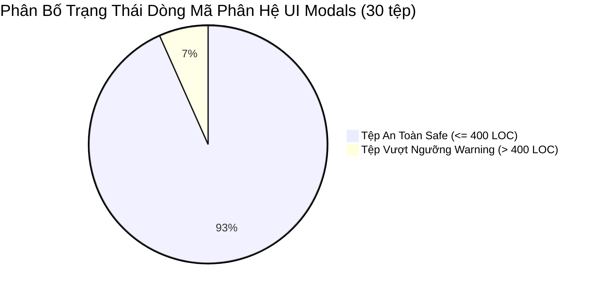
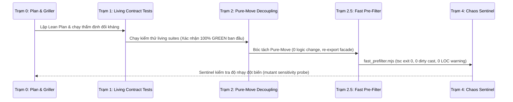

# BÁO CÁO PHÂN TÍCH & KẾ HOẠCH TÁI CẤU TRÚC ỨNG VIÊN #3
## Hạ Nhiệt Modal Vượt Trần (> 400 LOC) — Phân Hệ UI Modals

> **Phân hệ mục tiêu:** `client-ui` (`src/client/ui/modals/`)  
> **Phạm vi tái cấu trúc:** Ứng viên #3 (Gồm 2 lát cắt độc lập: **Slice 3A** và **Slice 3B**)  
> **Nguyên tắc cốt lõi:** **Pure-Move Quarantine** (Bảo toàn 100% hành vi runtime, 100% DOM layout, 100% `data-testid`, zero semantic shift)  
> **Tiêu chuẩn kỹ thuật:** AGENTS CONSTITUTION (GEMINI.md Tier 2 UI $\le 500$ LOC, cảnh báo tại 400 LOC)  
> **Mục tiêu tối thượng:** Đưa **30/30 tệp (100%)** của phân hệ UI Modals về vùng xanh an toàn (`✔️ Safe`), triệt tiêu 100% nợ kỹ thuật cảnh báo LOC.

---

## 1. TỔNG QUAN HIỆN TRẠNG PHÂN HỆ UI MODALS

Qua khảo sát tự động bằng [`scripts/check_loc.mjs`](file:///c:/Users/HP/Documents/GitHub/vtcoon/scripts/check_loc.mjs) trên toàn bộ 30 tệp `.tsx` của `src/client/ui/modals/`:
- **28/30 tệp** hoàn toàn nằm trong ngưỡng an toàn (`✔️ Safe`), dao động từ 34 đến 398 LOC.
- **Chỉ còn duy nhất 2 tệp** vượt ngưỡng cảnh báo Tier 2 UI (`warn: 400`):
  1. [`src/client/ui/modals/event_card_modal.tsx`](file:///c:/Users/HP/Documents/GitHub/vtcoon/src/client/ui/modals/event_card_modal.tsx): **405 LOC vật lý** (368 SLOC) $\rightarrow$ `⚠️ Warning (405 > 400)`.
  2. [`src/client/ui/modals/game_over_modal.tsx`](file:///c:/Users/HP/Documents/GitHub/vtcoon/src/client/ui/modals/game_over_modal.tsx): **405 LOC vật lý** (380 SLOC) $\rightarrow$ `⚠️ Warning (405 > 400)`.



---

## 2. CHI TIẾT LÁT CẮT 3A: HẠ NHIỆT `event_card_modal.tsx` (IMP-329)

### 2.1. Giải Phẫu Cấu Trúc & Điểm Nghẽn

Tệp [`event_card_modal.tsx`](file:///c:/Users/HP/Documents/GitHub/vtcoon/src/client/ui/modals/event_card_modal.tsx) đang tích hợp 5 khối chức năng vào một tệp duy nhất:

| Khối Chức Năng | Tọa Độ Dòng | LOC | Tính Chất | Phương Án Tách |
| :--- | :---: | :---: | :---: | :--- |
| **1. Controller & State Hooks** | L1-165 | 165 | Điều khiển, bàn phím, resolve text | **Giữ lại tại `event_card_modal.tsx`** (Orchestrator) |
| **2. SVG Trống Đồng Đông Sơn** | L176-199 | 24 | Đồ họa dập chìm, 14 polygon tia mặt trời | Tách thành `<DongSonWatermark />` |
| **3. Multi-Event Carousel Nav** | L222-275 | 54 | Thanh tab điều hướng sự kiện thị trường | Tách thành `<EventCardCarouselNav />` |
| **4. Dual Impact Specs Blocks** | L306-353 | 48 | Khối tóm tắt tác động (Mobile vs Desktop) | Tách thành `<EventImpactSpecs />` |
| **5. Affected Cells Strip** | L355-382 | 28 | Danh sách ô bàn cờ chịu ảnh hưởng | Tách thành `<EventAffectedCellsList />` |
| **6. Container Shell & CTA Footer** | L166-175, L384-405 | 32 | Khung viền chỉ mực kép & nút xác nhận | **Giữ lại tại `event_card_modal.tsx`** |

### 2.2. Thiết Kế Kiến Trúc Bóc Tách

Tạo tệp mới: [`src/client/ui/modals/event_card_subviews.tsx`](file:///c:/Users/HP/Documents/GitHub/vtcoon/src/client/ui/modals/event_card_subviews.tsx) (~140 LOC):

```typescript
// 1. Khối nền họa tiết Đông Sơn hoài cổ (0 hook, pure presentation)
export function DongSonWatermark(): React.ReactElement {
  return (
    <div className="pointer-events-none absolute inset-0 flex items-center justify-center opacity-[0.05] overflow-hidden z-0" aria-hidden="true">
      <svg viewBox="0 0 400 400" className="w-[300px] h-[300px] text-slate-900 fill-none stroke-current" strokeWidth="1.5">
        {/* 14 tia mặt trời & các vòng tròn đồng tâm */}
      </svg>
    </div>
  );
}

// 2. Thanh điều hướng Single-Row Carousel (giữ nguyên 100% test-ids & ARIA)
export interface EventCardCarouselNavProps {
  readonly activeModifiers: ReadonlyArray<import('../../store/game_store_types.js').ClientMarketModifier>;
  readonly currentIdx: number;
  readonly onSelectIdx: (idx: number) => void;
  readonly onPrev: () => void;
  readonly onNext: () => void;
}
export function EventCardCarouselNav(props: EventCardCarouselNavProps): React.ReactElement;

// 3. Khối hiển thị thông số tác động thích ứng Mobile / Desktop
export interface EventImpactSpecsProps {
  readonly resolvedTargetScope: string;
  readonly resolvedDenseScope: string;
  readonly resolvedDuration: string;
  readonly resolvedDestination: string;
  readonly shouldShowDestination: boolean;
  readonly singleTruthDescription: string;
}
export function EventImpactSpecs(props: EventImpactSpecsProps): React.ReactElement;

// 4. Khối hiển thị danh sách ô bàn cờ chịu tác động
export function EventAffectedCellsList({ affectedCells }: { readonly affectedCells: number[] }): React.ReactElement;
```

### 2.3. Ranh Giới Kiểm Thử & Chống Hồi Quy
- **Test Suites bảo hộ**:
  - [`tests/client/imp134_event_card_hero_stat_visual_overhaul.test.ts`](file:///c:/Users/HP/Documents/GitHub/vtcoon/tests/client/imp134_event_card_hero_stat_visual_overhaul.test.ts) (28 tests)
  - [`tests/contracts/imp267_active_market_event_carousel.test.ts`](file:///c:/Users/HP/Documents/GitHub/vtcoon/tests/contracts/imp267_active_market_event_carousel.test.ts) (13 tests)
  - [`tests/client/imp156_event_card_visual_declutter.test.ts`](file:///c:/Users/HP/Documents/GitHub/vtcoon/tests/client/imp156_event_card_visual_declutter.test.ts)
- **Bất biến giữ nguyên**: Toàn bộ các selector `data-testid` (`event-card-carousel-nav`, `carousel-prev-btn`, `carousel-next-btn`, `carousel-tab-pill-*`, `event-impact-summary`, `event-specs-table`, `event-affected-cells-list`), phím bấm mũi tên, và CSS layout.

---

## 3. CHI TIẾT LÁT CẮT 3B: HẠ NHIỆT `game_over_modal.tsx` (IMP-330)

### 3.1. Giải Phẫu Cấu Trúc & Điểm Nghẽn

Tệp [`game_over_modal.tsx`](file:///c:/Users/HP/Documents/GitHub/vtcoon/src/client/ui/modals/game_over_modal.tsx) đang vi phạm nguyên tắc Đơn nhiệm (SRP) khi gộp logic toán học tài chính vào cùng giao diện:

| Khối Chức Năng | Tọa Độ Dòng | LOC | Tính Chất | Phương Án Tách |
| :--- | :---: | :---: | :---: | :--- |
| **1. Thuật Toán Nghiệp Vụ FinTech** | L16-101 | 86 | Pure Math (`calculateRoi`, `calculatePortfolioMetrics`, `calculateLeaderboardRanks`, `generateNetWorthChartPath`) | Tách sang `game_over_math.ts` |
| **2. Header Vinh Danh & Tab Bar** | L103-226 | 124 | Controller state, header Quán Quân 🏆, nút chuyển 3 Tab | **Giữ lại tại `game_over_modal.tsx`** |
| **3. Tab 1: Leaderboard View** | L228-279 | 52 | Danh sách bảng xếp hạng người chơi | **Giữ lại tại `game_over_modal.tsx`** (Core View) |
| **4. Tab 2: FinTech Chart & Breakdown** | L282-348 | 67 | SVG Bezier curve TradingView + 4 thẻ phân rã tài sản | Tách thành `<GameOverFintechTab />` |
| **5. Tab 3: Danh Mục Sổ Đỏ** | L351-391 | 41 | Lưới sổ đỏ BĐS, màu sắc nhóm đất, cấp sao C1-C3 | Tách thành `<GameOverPortfolioTab />` |
| **6. Footer Nút Chơi Lại** | L393-405 | 13 | Nút "Về Sảnh Chờ" | **Giữ lại tại `game_over_modal.tsx`** |

### 3.2. Thiết Kế Kiến Trúc Bóc Tách

1. Tạo tệp mới: [`src/client/ui/modals/game_over_math.ts`](file:///c:/Users/HP/Documents/GitHub/vtcoon/src/client/ui/modals/game_over_math.ts) (~85 LOC):
   - Chứa hằng số: `INITIAL_CAPITAL = 15_000`, `TOTAL_PURCHASABLE_PROPERTIES = 28`.
   - Chứa các hàm toán học: `calculateRoi`, `calculatePortfolioMetrics`, `calculateLeaderboardRanks`, `generateNetWorthChartPath`.
2. Tạo tệp mới: [`src/client/ui/modals/game_over_views.tsx`](file:///c:/Users/HP/Documents/GitHub/vtcoon/src/client/ui/modals/game_over_views.tsx) (~110 LOC):
   - `GameOverFintechTab`: Render biểu đồ SVG xu hướng tài sản và 4 hộp số liệu phân rã (Tiền mặt, Đất nền, Công trình, Thị phần).
   - `GameOverPortfolioTab`: Render danh mục sổ đỏ BĐS theo lưới 2 cột.
3. **Thiết kế Anti-Breakage Re-export Seam**:
   - Tại `game_over_modal.tsx`, re-export toàn bộ các hàm toán học từ `game_over_math.js`:
     ```typescript
     export {
       INITIAL_CAPITAL,
       TOTAL_PURCHASABLE_PROPERTIES,
       calculateRoi,
       calculatePortfolioMetrics,
       calculateLeaderboardRanks,
       generateNetWorthChartPath,
       type ChartPathResult,
     } from './game_over_math.js';
     ```
   - *Lợi ích*: Các bộ test cũ import từ `game_over_modal.js` sẽ **100% tiếp tục chạy bình thường**, hoàn toàn không bị gãy import path!

### 3.3. Ranh Giới Kiểm Thử & Chống Hồi Quy
- **Test Suites bảo hộ**:
  - [`tests/client/fintech_game_over_modal.test.ts`](file:///c:/Users/HP/Documents/GitHub/vtcoon/tests/client/fintech_game_over_modal.test.ts) (7 tests)
  - [`tests/client/imp161_modal_360px_ergonomics_and_cross_browser.test.ts`](file:///c:/Users/HP/Documents/GitHub/vtcoon/tests/client/imp161_modal_360px_ergonomics_and_cross_browser.test.ts)
  - [`tests/contracts/imp215_cross_platform_and_browser_hardening.test.ts`](file:///c:/Users/HP/Documents/GitHub/vtcoon/tests/contracts/imp215_cross_platform_and_browser_hardening.test.ts)

---

## 4. DỰ BÁO ĐỊNH LƯỢNG DÒNG MÃ (LOC ACCOUNTING FORECAST)

| Tệp Mã Nguồn | Trạng Thái | Tier / Phân Hệ | LOC Hiện Tại | LOC Dự Kiến Sau Tách | Trạng Thái Cơ Học |
| :--- | :---: | :---: | :---: | :---: | :---: |
| `src/client/ui/modals/event_card_modal.tsx` | MODIFY | Tier 2 UI | **405** | **~255** (giảm 150 LOC) | ✔️ Safe (< 400) |
| `src/client/ui/modals/event_card_subviews.tsx` | CREATE | Tier 2 UI | *Mới* | **~140** | ✔️ Safe (< 500) |
| `src/client/ui/modals/game_over_modal.tsx` | MODIFY | Tier 2 UI | **405** | **~215** (giảm 190 LOC) | ✔️ Safe (< 400) |
| `src/client/ui/modals/game_over_math.ts` | CREATE | Tier 1 Logic | *Mới* | **~85** | ✔️ Safe (< 400) |
| `src/client/ui/modals/game_over_views.tsx` | CREATE | Tier 2 UI | *Mới* | **~110** | ✔️ Safe (< 500) |

> 📊 **Kết quả**: Cả 2 tệp modal chính đều giảm từ **405 dòng xuống còn ~215 - 255 dòng** (giảm 37% - 47%), nằm sâu trong vùng an toàn lý tưởng.

---

## 5. MA TRẬN KIỂM SOÁT QUY TRÌNH 4 TRẠM (SDLC GATES COMPLIANCE)



1. **Trạm 0 (Plan Griller / Adversarial Gate)**:
   - Soát xét ranh giới Anti-Breakage Re-export Seam.
   - Ngăn chặn triệt để nguy cơ đánh mất `data-testid` của các component con.
2. **Trạm 1 (Living Contract Tests)**:
   - Chạy 41 tests cho EventCardModal (`imp134` + `imp267`).
   - Chạy 7 tests cho GameOverModal (`fintech_game_over_modal`).
3. **Trạm 2 (Implementer Pure-Move)**:
   - Di chuyển khối mã nguyên vẹn, không viết lại cú pháp hay đổi tên biến.
4. **Trạm 2.5 (Fast Pre-Filter Sweep)**:
   - `npm run prefilter -- <files>`: Typecheck `tsc --noEmit` exit 0, 0 dirty casts, 0 cờ anti-slop, **0 tệp cảnh báo LOC**.
5. **Trạm 4 (Chaos Sentinel & Evidence Check)**:
   - Chạy `npm run sentinel -- --ticket IMP-329` và `IMP-330`.
   - `node scripts/check_evidence.mjs` bảo đảm 100% mutants bị tiêu diệt và có đột biến cấp mã nguồn thực tế.

---

## 6. ĐỀ XUẤT THỰC THI (ACTIONABLE RECOMMENDATION)

Khuyến nghị chia làm **2 Micro-Slices độc lập** để kiểm soát bán kính ảnh hưởng chặt chẽ:
- **Lát cắt 1 (Slice 3A - Ticket IMP-329)**: Hạ nhiệt `event_card_modal.tsx` $\rightarrow$ Trích xuất `event_card_subviews.tsx`.
- **Lát cắt 2 (Slice 3B - Ticket IMP-330)**: Hạ nhiệt `game_over_modal.tsx` $\rightarrow$ Trích xuất `game_over_math.ts` & `game_over_views.tsx`.
